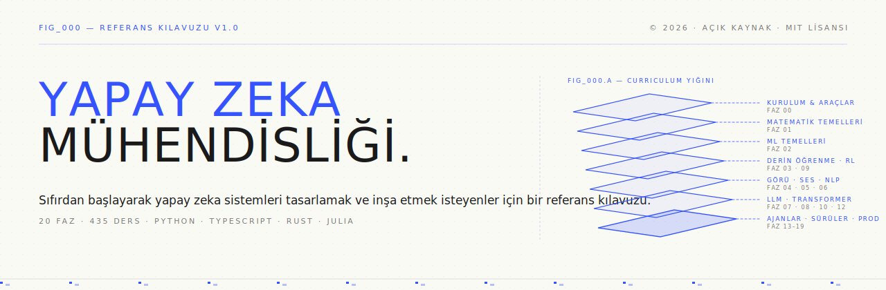
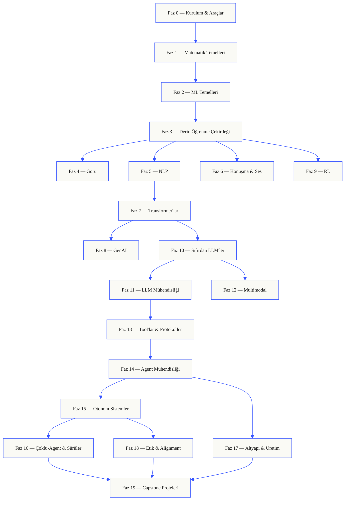
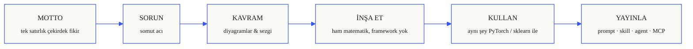

<p align="center">
  
</p>

<p align="center">
  <a href="LICENSE"></a>
  <a href="ROADMAP.md"></a>
  <a href="#contents"></a>
  <a href="https://github.com/komunite/ai-engineering/stargazers"></a>
  <a href="https://ai-muhendisligi.komunite.com.tr"></a>
</p>

```
░░░▒▒▒░░░▒▒▒░░░▒▒▒░░░▒▒▒░░░▒▒▒░░░▒▒▒░░░▒▒▒░░░▒▒▒░░░▒▒▒░░░▒▒▒░░░▒▒▒░░░▒▒▒░░░▒▒▒░░░▒▒▒░░░▒▒▒
```

> 🌐 **İngilizce orijinal:** [upstream README.md](https://github.com/rohitg00/ai-engineering-from-scratch/blob/main/README.md) · **Upstream:** [`rohitg00/ai-engineering-from-scratch`](https://github.com/rohitg00/ai-engineering-from-scratch) (MIT)
>
> **Öğrencilerin %84'ü zaten AI araçlarını kullanıyor. Yalnızca %18'i bunları
> profesyonel olarak kullanmaya hazır hissediyor.** Bu curriculum o boşluğu kapatır.
>
> 435 ders. 20 faz. ~320 saat. Python, TypeScript, Rust, Julia. Her ders yeniden
> kullanılabilir bir artifact üretir: bir prompt, bir skill, bir agent, bir MCP sunucusu.
> Ücretsiz, açık kaynak, MIT.
>
> Yapay zekayı sadece öğrenmiyorsun. Onu inşa ediyorsun. Uçtan uca. Elle.

## Nasıl İşliyor

Yapay zeka materyalinin çoğu dağınık parçalar halinde öğretir. Burada bir makale, orada
bir fine-tuning yazısı, başka bir yerde gösterişli bir agent demosu. Parçalar nadiren
örtüşür. Bir chatbot yayınlarsın ama loss eğrisini açıklayamazsın. Bir agent'a bir
fonksiyon bağlarsın ama onu çağıran modelin içinde attention'ın ne yaptığını söyleyemezsin.

Bu curriculum o omurgadır. 20 faz, 435 ders, dört dil: Python, TypeScript, Rust, Julia.
Bir uçta lineer cebir, diğer uçta otonom sürüler. Her algoritma önce ham matematikten
kurulur. Backprop. Tokenizer. Attention. Agent döngüsü. PyTorch sahneye çıktığında, onun
kapak altında ne yaptığını zaten biliyorsun.

Her ders aynı döngüyü işletir: sorunu oku, matematiği türet, kodu yaz, testi çalıştır,
artifact'i sakla. Beş dakikalık videolar yok, kopyala-yapıştır deployment yok, elinden
tutmak yok. Ücretsiz, açık kaynak ve kendi laptop'unda çalışacak şekilde inşa edilmiş.

```
░░░▒▒▒░░░▒▒▒░░░▒▒▒░░░▒▒▒░░░▒▒▒░░░▒▒▒░░░▒▒▒░░░▒▒▒░░░▒▒▒░░░▒▒▒░░░▒▒▒░░░▒▒▒░░░▒▒▒░░░▒▒▒░░░▒▒▒
```

## Curriculum'un Şekli

Yirmi faz üst üste yığılır. Matematik zemindir. Agent'lar ve üretim çatıdır. Alt katmanları
zaten biliyorsan ileri atla, ama atlayıp sonra tepedeki bir şeyin neden bozulduğunu
sorma.



```
░░░▒▒▒░░░▒▒▒░░░▒▒▒░░░▒▒▒░░░▒▒▒░░░▒▒▒░░░▒▒▒░░░▒▒▒░░░▒▒▒░░░▒▒▒░░░▒▒▒░░░▒▒▒░░░▒▒▒░░░▒▒▒░░░▒▒▒
```

## Bir Dersin Şekli

Her ders kendi klasöründe yaşar; tüm curriculum boyunca aynı yapı geçerlidir:

```
phases/<NN>-<phase-name>/<NN>-<lesson-name>/
├── code/      çalıştırılabilir implementasyonlar (Python, TypeScript, Rust, Julia)
├── docs/
│   └── en.md  ders anlatımı
└── outputs/   bu dersin ürettiği prompt'lar, skill'ler, agent'lar veya MCP sunucuları
```

Her ders altı ritim takip eder. *Build It / Use It* ayrımı omurgadır — algoritmayı önce
sıfırdan kendin yazarsın, sonra aynı şeyi üretim kütüphanesinden geçirirsin. Framework'ün
ne yaptığını anlarsın çünkü daha küçük sürümünü kendin yazmışsındır.



## Başlangıç

Üç giriş yolu. Birini seç.

**Seçenek A — oku.** [komunite/ai-engineering](https://github.com/komunite/ai-engineering)
üzerinden tamamlanmış herhangi bir dersi aç ya da [İçerik](#contents) altındaki bir fazı
genişlet. Kurulum yok, clone yok.

**Seçenek B — clone'la ve çalıştır.**

```bash
git clone https://github.com/komunite/ai-engineering.git
cd ai-engineering-from-scratch
python phases/01-math-foundations/01-linear-algebra-intuition/code/vectors.py
```

**Seçenek C — seviyeni bul *(önerilen)*.** Akıllıca ileri atla. Curriculum skill'leri
yüklenmiş Claude, Cursor, Codex, OpenClaw, Hermes veya herhangi bir agent içinden:

```bash
/find-your-level
```

On soru. Bilgilerini bir başlangıç fazına eşler, saat tahminleriyle birlikte kişiselleştirilmiş
bir yol kurar. Her fazdan sonra:

```bash
/check-understanding 3        # 3. fazda kendini sına
ls phases/03-deep-learning-core/05-loss-functions/outputs/
# ├── prompt-loss-function-selector.md
# └── prompt-loss-debugger.md
```

### Önkoşullar

- Kod yazabiliyorsun (herhangi bir dil; Python yardımcı olur).
- Yapay zekanın yalnızca API'lerini çağırmak değil, **nasıl çalıştığını** anlamak istiyorsun.

### Yerleşik Agent Skill'leri (Claude, Cursor, Codex, OpenClaw, Hermes)

| Skill | Ne Yapar |
|---|---|
| [`/find-your-level`](.claude/skills/find-your-level/SKILL.md) | On soruluk yerleştirme quiz'i. Bilgilerini bir başlangıç fazına eşler ve saat tahminleriyle kişiselleştirilmiş bir yol üretir. |
| [`/check-understanding <phase>`](.claude/skills/check-understanding/SKILL.md) | Faz başına quiz, sekiz soru; geri bildirim ve incelemen gereken belirli dersler ile. |

```
░░░▒▒▒░░░▒▒▒░░░▒▒▒░░░▒▒▒░░░▒▒▒░░░▒▒▒░░░▒▒▒░░░▒▒▒░░░▒▒▒░░░▒▒▒░░░▒▒▒░░░▒▒▒░░░▒▒▒░░░▒▒▒░░░▒▒▒
```

## Her Ders Bir Şey Yayınlar

Diğer curriculum'lar *"tebrikler, X'i öğrendin"* ile biter. Buradaki her ders günlük
iş akışına kurabileceğin ya da yapıştırabileceğin **yeniden kullanılabilir bir araç**
ile biter.

<table>
<tr>
<th align="left" width="25%"><br/><sub>FIG_001 · A</sub><br/><b>PROMPTS</b></th>
<th align="left" width="25%"><br/><sub>FIG_001 · B</sub><br/><b>SKILLS</b></th>
<th align="left" width="25%"><br/><sub>FIG_001 · C</sub><br/><b>AGENTS</b></th>
<th align="left" width="25%"><br/><sub>FIG_001 · D</sub><br/><b>MCP SERVERS</b></th>
</tr>
<tr>
<td valign="top">Dar bir görevde uzman seviyesinde yardım için herhangi bir AI asistana yapıştır.</td>
<td valign="top">Claude, Cursor, Codex, OpenClaw, Hermes ya da <code>SKILL.md</code> okuyan herhangi bir agent'a bırak.</td>
<td valign="top">Otonom işçiler olarak deploy et — döngüyü Faz 14'te kendin yazdın.</td>
<td valign="top">Herhangi bir MCP uyumlu istemciye tak. Faz 13'te uçtan uca inşa edildi.</td>
</tr>
</table>

> Hepsini `python3 scripts/install_skills.py` ile kur. Gerçek araçlar, ev ödevi değil.
> Curriculum'un sonunda, inşa ettiğin için gerçekten anladığın 435 artifact'lik bir
> portfolyon olur.

### FIG_002 · İşlenmiş Örnek

Faz 14, ders 1: agent döngüsü. ~120 satır saf Python, bağımlılık yok.

<table>
<tr>
<td valign="top" width="50%">

**`code/agent_loop.py`** &nbsp; <sub><i>inşa et</i></sub>

```python
def run(query, tools):
    history = [user(query)]
    for step in range(MAX_STEPS):
        msg = llm(history)
        if msg.tool_calls:
            for call in msg.tool_calls:
                result = tools[call.name](**call.args)
                history.append(tool_result(call.id, result))
            continue
        return msg.content
    raise StepLimitExceeded
```

</td>
<td valign="top" width="50%">

**`outputs/skill-agent-loop.md`** &nbsp; <sub><i>yayınla</i></sub>

```markdown
---
name: agent-loop
description: ReAct-style loop for any tool list
phase: 14
lesson: 01
---

Implement a minimal agent loop that...
```

**`outputs/prompt-debug-agent.md`**

```markdown
You are an agent debugger. Given the trace
of an agent run, identify the step where
the agent went wrong and explain why...
```

</td>
</tr>
</table>

```
░░░▒▒▒░░░▒▒▒░░░▒▒▒░░░▒▒▒░░░▒▒▒░░░▒▒▒░░░▒▒▒░░░▒▒▒░░░▒▒▒░░░▒▒▒░░░▒▒▒░░░▒▒▒░░░▒▒▒░░░▒▒▒░░░▒▒▒
```

<a id="contents"></a>

## İçerik

Yirmi faz. Ders listesini genişletmek için herhangi bir faza tıkla.

<a id="phase-0"></a>
### Phase 0: Kurulum ve Araçlar `12 lessons`
> Geri kalan her şey için ortamını hazırla.

| # | Lesson | Type | Lang |
|:---:|--------|:----:|------|
| 01 | [Geliştirme Ortamı](phases/00-setup-and-tooling/01-dev-environment/) | Build | Python, TypeScript, Rust |
| 02 | [Git ve İş Birliği](phases/00-setup-and-tooling/02-git-and-collaboration/) | Learn | — |
| 03 | [GPU Kurulumu ve Bulut](phases/00-setup-and-tooling/03-gpu-setup-and-cloud/) | Build | Python |
| 04 | [API'ler ve Anahtarlar](phases/00-setup-and-tooling/04-apis-and-keys/) | Build | Python, TypeScript |
| 05 | [Jupyter Notebook'ları](phases/00-setup-and-tooling/05-jupyter-notebooks/) | Build | Python |
| 06 | [Python Ortamları](phases/00-setup-and-tooling/06-python-environments/) | Build | Python |
| 07 | [Yapay Zeka için Docker](phases/00-setup-and-tooling/07-docker-for-ai/) | Build | Python |
| 08 | [Editör Kurulumu](phases/00-setup-and-tooling/08-editor-setup/) | Build | — |
| 09 | [Veri Yönetimi](phases/00-setup-and-tooling/09-data-management/) | Build | Python |
| 10 | [Terminal ve Shell](phases/00-setup-and-tooling/10-terminal-and-shell/) | Learn | — |
| 11 | [Yapay Zeka için Linux](phases/00-setup-and-tooling/11-linux-for-ai/) | Learn | — |
| 12 | [Hata Ayıklama ve Profiling](phases/00-setup-and-tooling/12-debugging-and-profiling/) | Build | Python |

<details id="phase-1">
<summary><b>Phase 1 — Matematik Temelleri</b> &nbsp;<code>22 lessons</code>&nbsp; <em>Her yapay zeka algoritmasının arkasındaki sezgi, kodla.</em></summary>
<br/>

| # | Lesson | Type | Lang |
|:---:|--------|:----:|------|
| 01 | [Lineer Cebir Sezgisi](phases/01-math-foundations/01-linear-algebra-intuition/) | Learn | Python, Julia |
| 02 | [Vektörler, Matrisler ve İşlemler](phases/01-math-foundations/02-vectors-matrices-operations/) | Build | Python, Julia |
| 03 | [Matris Dönüşümleri ve Eigenvalue'lar](phases/01-math-foundations/03-matrix-transformations/) | Build | Python, Julia |
| 04 | [ML için Kalkülüs: Türevler ve Gradyanlar](phases/01-math-foundations/04-calculus-for-ml/) | Learn | Python |
| 05 | [Zincir Kuralı ve Otomatik Türev](phases/01-math-foundations/05-chain-rule-and-autodiff/) | Build | Python |
| 06 | [Olasılık ve Dağılımlar](phases/01-math-foundations/06-probability-and-distributions/) | Learn | Python |
| 07 | [Bayes Teoremi ve İstatistiksel Düşünme](phases/01-math-foundations/07-bayes-theorem/) | Build | Python |
| 08 | [Optimizasyon: Gradient Descent Ailesi](phases/01-math-foundations/08-optimization/) | Build | Python |
| 09 | [Bilgi Teorisi: Entropi, KL Diverjansı](phases/01-math-foundations/09-information-theory/) | Learn | Python |
| 10 | [Boyut İndirgeme: PCA, t-SNE, UMAP](phases/01-math-foundations/10-dimensionality-reduction/) | Build | Python |
| 11 | [Tekil Değer Ayrışımı (SVD)](phases/01-math-foundations/11-singular-value-decomposition/) | Build | Python, Julia |
| 12 | [Tensor İşlemleri](phases/01-math-foundations/12-tensor-operations/) | Build | Python |
| 13 | [Sayısal Kararlılık](phases/01-math-foundations/13-numerical-stability/) | Build | Python |
| 14 | [Normlar ve Uzaklıklar](phases/01-math-foundations/14-norms-and-distances/) | Build | Python |
| 15 | [ML için İstatistik](phases/01-math-foundations/15-statistics-for-ml/) | Build | Python |
| 16 | [Örnekleme Yöntemleri](phases/01-math-foundations/16-sampling-methods/) | Build | Python |
| 17 | [Lineer Sistemler](phases/01-math-foundations/17-linear-systems/) | Build | Python |
| 18 | [Konveks Optimizasyon](phases/01-math-foundations/18-convex-optimization/) | Build | Python |
| 19 | [Yapay Zeka için Kompleks Sayılar](phases/01-math-foundations/19-complex-numbers/) | Learn | Python |
| 20 | [Fourier Dönüşümü](phases/01-math-foundations/20-fourier-transform/) | Build | Python |
| 21 | [ML için Graf Teorisi](phases/01-math-foundations/21-graph-theory/) | Build | Python |
| 22 | [Stokastik Süreçler](phases/01-math-foundations/22-stochastic-processes/) | Learn | Python |

</details>

<details id="phase-2">
<summary><b>Phase 2 — ML Temelleri</b> &nbsp;<code>18 lessons</code>&nbsp; <em>Klasik ML — hâlâ üretimdeki yapay zekanın çoğunun omurgası.</em></summary>
<br/>

| # | Lesson | Type | Lang |
|:---:|--------|:----:|------|
| 01 | [Makine Öğrenmesi Nedir?](phases/02-ml-fundamentals/01-what-is-machine-learning/) | Learn | Python |
| 02 | [Sıfırdan Doğrusal Regresyon](phases/02-ml-fundamentals/02-linear-regression/) | Build | Python |
| 03 | [Lojistik Regresyon ve Sınıflandırma](phases/02-ml-fundamentals/03-logistic-regression/) | Build | Python |
| 04 | [Karar Ağaçları ve Random Forest](phases/02-ml-fundamentals/04-decision-trees/) | Build | Python |
| 05 | [Support Vector Machine'ler](phases/02-ml-fundamentals/05-support-vector-machines/) | Build | Python |
| 06 | [KNN ve Uzaklık Metrikleri](phases/02-ml-fundamentals/06-knn-and-distances/) | Build | Python |
| 07 | [Denetimsiz Öğrenme: K-Means, DBSCAN](phases/02-ml-fundamentals/07-unsupervised-learning/) | Build | Python |
| 08 | [Feature Engineering ve Seçimi](phases/02-ml-fundamentals/08-feature-engineering/) | Build | Python |
| 09 | [Model Değerlendirme: Metrikler, Çapraz Doğrulama](phases/02-ml-fundamentals/09-model-evaluation/) | Build | Python |
| 10 | [Bias, Variance ve Öğrenme Eğrisi](phases/02-ml-fundamentals/10-bias-variance/) | Learn | Python |
| 11 | [Ensemble Yöntemleri: Boosting, Bagging, Stacking](phases/02-ml-fundamentals/11-ensemble-methods/) | Build | Python |
| 12 | [Hiperparametre Ayarlama](phases/02-ml-fundamentals/12-hyperparameter-tuning/) | Build | Python |
| 13 | [ML Pipeline'ları ve Deney Takibi](phases/02-ml-fundamentals/13-ml-pipelines/) | Build | Python |
| 14 | [Naive Bayes](phases/02-ml-fundamentals/14-naive-bayes/) | Build | Python |
| 15 | [Zaman Serisi Temelleri](phases/02-ml-fundamentals/15-time-series/) | Build | Python |
| 16 | [Anomali Tespiti](phases/02-ml-fundamentals/16-anomaly-detection/) | Build | Python |
| 17 | [Dengesiz Veriyle Çalışma](phases/02-ml-fundamentals/17-imbalanced-data/) | Build | Python |
| 18 | [Feature Seçimi](phases/02-ml-fundamentals/18-feature-selection/) | Build | Python |

</details>

<details id="phase-3">
<summary><b>Phase 3 — Derin Öğrenme Çekirdeği</b> &nbsp;<code>13 lessons</code>&nbsp; <em>Sinir ağları ilk prensiplerden. Önce kendin bir tane kurmadan framework yok.</em></summary>
<br/>

| # | Lesson | Type | Lang |
|:---:|--------|:----:|------|
| 01 | [Perceptron: Her Şeyin Başladığı Yer](phases/03-deep-learning-core/01-the-perceptron/) | Build | Python |
| 02 | [Çok Katmanlı Ağlar ve Forward Pass](phases/03-deep-learning-core/02-multi-layer-networks/) | Build | Python |
| 03 | [Sıfırdan Backpropagation](phases/03-deep-learning-core/03-backpropagation/) | Build | Python |
| 04 | [Aktivasyon Fonksiyonları: ReLU, Sigmoid, GELU ve Sebepleri](phases/03-deep-learning-core/04-activation-functions/) | Build | Python |
| 05 | [Loss Fonksiyonları: MSE, Cross-Entropy, Contrastive](phases/03-deep-learning-core/05-loss-functions/) | Build | Python |
| 06 | [Optimizer'lar: SGD, Momentum, Adam, AdamW](phases/03-deep-learning-core/06-optimizers/) | Build | Python |
| 07 | [Regularization: Dropout, Weight Decay, BatchNorm](phases/03-deep-learning-core/07-regularization/) | Build | Python |
| 08 | [Weight Initialization ve Eğitim Kararlılığı](phases/03-deep-learning-core/08-weight-initialization/) | Build | Python |
| 09 | [Learning Rate Schedule'ları ve Warmup](phases/03-deep-learning-core/09-learning-rate-schedules/) | Build | Python |
| 10 | [Kendi Mini Framework'ünü Kur](phases/03-deep-learning-core/10-mini-framework/) | Build | Python |
| 11 | [PyTorch'a Giriş](phases/03-deep-learning-core/11-intro-to-pytorch/) | Build | Python |
| 12 | [JAX'e Giriş](phases/03-deep-learning-core/12-intro-to-jax/) | Build | Python |
| 13 | [Sinir Ağlarında Hata Ayıklama](phases/03-deep-learning-core/13-debugging-neural-networks/) | Build | Python |

</details>

<details id="phase-4">
<summary><b>Phase 4 — Bilgisayarlı Görü</b> &nbsp;<code>28 lessons</code>&nbsp; <em>Piksellerden anlama — görsel, video, 3D, VLM'ler ve dünya modelleri.</em></summary>
<br/>

| # | Lesson | Type | Lang |
|:---:|--------|:----:|------|
| 01 | [Görsel Temelleri: Piksel, Kanal, Renk Uzayları](phases/04-computer-vision/01-image-fundamentals/) | Learn | Python |
| 02 | [Sıfırdan Convolution'lar](phases/04-computer-vision/02-convolutions-from-scratch/) | Build | Python |
| 03 | [CNN'ler: LeNet'ten ResNet'e](phases/04-computer-vision/03-cnns-lenet-to-resnet/) | Build | Python |
| 04 | [Görsel Sınıflandırma](phases/04-computer-vision/04-image-classification/) | Build | Python |
| 05 | [Transfer Learning ve Fine-Tuning](phases/04-computer-vision/05-transfer-learning/) | Build | Python |
| 06 | [Nesne Tespiti — Sıfırdan YOLO](phases/04-computer-vision/06-object-detection-yolo/) | Build | Python |
| 07 | [Semantik Segmentasyon — U-Net](phases/04-computer-vision/07-semantic-segmentation-unet/) | Build | Python |
| 08 | [Instance Segmentasyon — Mask R-CNN](phases/04-computer-vision/08-instance-segmentation-mask-rcnn/) | Build | Python |
| 09 | [Görsel Üretimi — GAN'lar](phases/04-computer-vision/09-image-generation-gans/) | Build | Python |
| 10 | [Görsel Üretimi — Diffusion Modelleri](phases/04-computer-vision/10-image-generation-diffusion/) | Build | Python |
| 11 | [Stable Diffusion — Mimari ve Fine-Tuning](phases/04-computer-vision/11-stable-diffusion/) | Build | Python |
| 12 | [Video Anlama — Zamansal Modelleme](phases/04-computer-vision/12-video-understanding/) | Build | Python |
| 13 | [3D Görü: Point Cloud, NeRF](phases/04-computer-vision/13-3d-vision-nerf/) | Build | Python |
| 14 | [Vision Transformer'lar (ViT)](phases/04-computer-vision/14-vision-transformers/) | Build | Python |
| 15 | [Gerçek Zamanlı Görü: Edge Deployment](phases/04-computer-vision/15-real-time-edge/) | Build | Python, Rust |
| 16 | [Komple Görü Pipeline'ı Kur](phases/04-computer-vision/16-vision-pipeline-capstone/) | Build | Python |
| 17 | [Öz-Denetimli Görü — SimCLR, DINO, MAE](phases/04-computer-vision/17-self-supervised-vision/) | Build | Python |
| 18 | [Açık Sözlüklü Görü — CLIP](phases/04-computer-vision/18-open-vocab-clip/) | Build | Python |
| 19 | [OCR ve Belge Anlama](phases/04-computer-vision/19-ocr-document-understanding/) | Build | Python |
| 20 | [Görsel Erişimi ve Metric Learning](phases/04-computer-vision/20-image-retrieval-metric/) | Build | Python |
| 21 | [Keypoint Tespiti ve Poz Tahmini](phases/04-computer-vision/21-keypoint-pose/) | Build | Python |
| 22 | [Sıfırdan 3D Gaussian Splatting](phases/04-computer-vision/22-3d-gaussian-splatting/) | Build | Python |
| 23 | [Diffusion Transformer'lar ve Rectified Flow](phases/04-computer-vision/23-diffusion-transformers-rectified-flow/) | Build | Python |
| 24 | [SAM 3 ve Açık Sözlüklü Segmentasyon](phases/04-computer-vision/24-sam3-open-vocab-segmentation/) | Build | Python |
| 25 | [Görsel-Dil Modelleri (ViT-MLP-LLM)](phases/04-computer-vision/25-vision-language-models/) | Build | Python |
| 26 | [Tek Kameralı Derinlik ve Geometri Tahmini](phases/04-computer-vision/26-monocular-depth/) | Build | Python |
| 27 | [Çoklu Nesne Takibi ve Video Belleği](phases/04-computer-vision/27-multi-object-tracking/) | Build | Python |
| 28 | [Dünya Modelleri ve Video Diffusion](phases/04-computer-vision/28-world-models-video-diffusion/) | Build | Python |

</details>

<details id="phase-5">
<summary><b>Phase 5 — NLP: Temellerden İleri Seviyeye</b> &nbsp;<code>29 lessons</code>&nbsp; <em>Dil, zekanın arayüzüdür.</em></summary>
<br/>

| # | Lesson | Type | Lang |
|:---:|--------|:----:|------|
| 01 | [Metin İşleme: Tokenleştirme, Stemming, Lemmatization](phases/05-nlp-foundations-to-advanced/01-text-processing/) | Build | Python |
| 02 | [Bag of Words, TF-IDF ve Metin Temsili](phases/05-nlp-foundations-to-advanced/02-bag-of-words-tfidf/) | Build | Python |
| 03 | [Word Embedding'leri: Sıfırdan Word2Vec](phases/05-nlp-foundations-to-advanced/03-word-embeddings-word2vec/) | Build | Python |
| 04 | [GloVe, FastText ve Subword Embedding'leri](phases/05-nlp-foundations-to-advanced/04-glove-fasttext-subword/) | Build | Python |
| 05 | [Duygu Analizi](phases/05-nlp-foundations-to-advanced/05-sentiment-analysis/) | Build | Python |
| 06 | [Adlandırılmış Varlık Tanıma (NER)](phases/05-nlp-foundations-to-advanced/06-named-entity-recognition/) | Build | Python |
| 07 | [POS Tagging ve Sözdizimsel Ayrıştırma](phases/05-nlp-foundations-to-advanced/07-pos-tagging-parsing/) | Build | Python |
| 08 | [Metin Sınıflandırma — Metin için CNN ve RNN'ler](phases/05-nlp-foundations-to-advanced/08-cnns-rnns-for-text/) | Build | Python |
| 09 | [Sequence-to-Sequence Modeller](phases/05-nlp-foundations-to-advanced/09-sequence-to-sequence/) | Build | Python |
| 10 | [Attention Mekanizması — Büyük Atılım](phases/05-nlp-foundations-to-advanced/10-attention-mechanism/) | Build | Python |
| 11 | [Makine Çevirisi](phases/05-nlp-foundations-to-advanced/11-machine-translation/) | Build | Python |
| 12 | [Metin Özetleme](phases/05-nlp-foundations-to-advanced/12-text-summarization/) | Build | Python |
| 13 | [Soru-Cevap Sistemleri](phases/05-nlp-foundations-to-advanced/13-question-answering/) | Build | Python |
| 14 | [Bilgi Erişimi ve Arama](phases/05-nlp-foundations-to-advanced/14-information-retrieval-search/) | Build | Python |
| 15 | [Konu Modelleme: LDA, BERTopic](phases/05-nlp-foundations-to-advanced/15-topic-modeling/) | Build | Python |
| 16 | [Metin Üretimi](phases/05-nlp-foundations-to-advanced/16-text-generation-pre-transformer/) | Build | Python |
| 17 | [Chatbot'lar: Kural Bazlıdan Sinirsele](phases/05-nlp-foundations-to-advanced/17-chatbots-rule-to-neural/) | Build | Python |
| 18 | [Çok Dilli NLP](phases/05-nlp-foundations-to-advanced/18-multilingual-nlp/) | Build | Python |
| 19 | [Subword Tokenleştirme: BPE, WordPiece, Unigram, SentencePiece](phases/05-nlp-foundations-to-advanced/19-subword-tokenization/) | Learn | Python |
| 20 | [Yapılandırılmış Çıktılar ve Constrained Decoding](phases/05-nlp-foundations-to-advanced/20-structured-outputs-constrained-decoding/) | Build | Python |
| 21 | [NLI ve Metinsel Çıkarım](phases/05-nlp-foundations-to-advanced/21-nli-textual-entailment/) | Learn | Python |
| 22 | [Embedding Modellerine Derin Dalış](phases/05-nlp-foundations-to-advanced/22-embedding-models-deep-dive/) | Learn | Python |
| 23 | [RAG için Chunking Stratejileri](phases/05-nlp-foundations-to-advanced/23-chunking-strategies-rag/) | Build | Python |
| 24 | [Coreference Çözümü](phases/05-nlp-foundations-to-advanced/24-coreference-resolution/) | Learn | Python |
| 25 | [Varlık Bağlama ve Belirsizlik Giderme](phases/05-nlp-foundations-to-advanced/25-entity-linking/) | Build | Python |
| 26 | [Bağıntı Çıkarımı ve Bilgi Grafı Kurma](phases/05-nlp-foundations-to-advanced/26-relation-extraction-kg/) | Build | Python |
| 27 | [LLM Değerlendirmesi: RAGAS, DeepEval, G-Eval](phases/05-nlp-foundations-to-advanced/27-llm-evaluation-frameworks/) | Build | Python |
| 28 | [Uzun Bağlam Değerlendirmesi: NIAH, RULER, LongBench, MRCR](phases/05-nlp-foundations-to-advanced/28-long-context-evaluation/) | Learn | Python |
| 29 | [Diyalog Durum Takibi](phases/05-nlp-foundations-to-advanced/29-dialogue-state-tracking/) | Build | Python |

</details>

<details id="phase-6">
<summary><b>Phase 6 — Konuşma ve Ses</b> &nbsp;<code>17 lessons</code>&nbsp; <em>Duy, anla, konuş.</em></summary>
<br/>

| # | Lesson | Type | Lang |
|:---:|--------|:----:|------|
| 01 | [Ses Temelleri: Dalga Formları, Örnekleme, FFT](phases/06-speech-and-audio/01-audio-fundamentals) | Learn | Python |
| 02 | [Spektrogramlar, Mel Ölçeği ve Ses Öznitelikleri](phases/06-speech-and-audio/02-spectrograms-mel-features) | Build | Python |
| 03 | [Ses Sınıflandırma](phases/06-speech-and-audio/03-audio-classification) | Build | Python |
| 04 | [Konuşma Tanıma (ASR)](phases/06-speech-and-audio/04-speech-recognition-asr) | Build | Python |
| 05 | [Whisper: Mimari ve Fine-Tuning](phases/06-speech-and-audio/05-whisper-architecture-finetuning) | Build | Python |
| 06 | [Konuşmacı Tanıma ve Doğrulama](phases/06-speech-and-audio/06-speaker-recognition-verification) | Build | Python |
| 07 | [Metinden Konuşmaya (TTS)](phases/06-speech-and-audio/07-text-to-speech) | Build | Python |
| 08 | [Ses Klonlama ve Ses Dönüşümü](phases/06-speech-and-audio/08-voice-cloning-conversion) | Build | Python |
| 09 | [Müzik Üretimi](phases/06-speech-and-audio/09-music-generation) | Build | Python |
| 10 | [Ses-Dil Modelleri](phases/06-speech-and-audio/10-audio-language-models) | Build | Python |
| 11 | [Gerçek Zamanlı Ses İşleme](phases/06-speech-and-audio/11-real-time-audio-processing) | Build | Python, Rust |
| 12 | [Sesli Asistan Pipeline'ı Kur](phases/06-speech-and-audio/12-voice-assistant-pipeline) | Build | Python |
| 13 | [Neural Audio Codec'ler — EnCodec, SNAC, Mimi, DAC](phases/06-speech-and-audio/13-neural-audio-codecs) | Learn | Python |
| 14 | [Ses Etkinliği Tespiti ve Sıra Geçişi](phases/06-speech-and-audio/14-voice-activity-detection-turn-taking) | Build | Python |
| 15 | [Streaming Konuşmadan Konuşmaya — Moshi, Hibiki](phases/06-speech-and-audio/15-streaming-speech-to-speech-moshi-hibiki) | Learn | Python |
| 16 | [Ses Sahteciliğine Karşı Koruma ve Ses Damgalama](phases/06-speech-and-audio/16-anti-spoofing-audio-watermarking) | Build | Python |
| 17 | [Ses Değerlendirmesi — WER, MOS, MMAU, Leaderboard'lar](phases/06-speech-and-audio/17-audio-evaluation-metrics) | Learn | Python |

</details>

<details id="phase-7">
<summary><b>Phase 7 — Transformer'lara Derin Dalış</b> &nbsp;<code>14 lessons</code>&nbsp; <em>Her şeyi değiştiren mimari.</em></summary>
<br/>

| # | Lesson | Type | Lang |
|:---:|--------|:----:|------|
| 01 | [Neden Transformer: RNN'lerin Problemleri](phases/07-transformers-deep-dive/01-why-transformers/) | Learn | Python |
| 02 | [Sıfırdan Self-Attention](phases/07-transformers-deep-dive/02-self-attention-from-scratch/) | Build | Python |
| 03 | [Multi-Head Attention](phases/07-transformers-deep-dive/03-multi-head-attention/) | Build | Python |
| 04 | [Positional Encoding: Sinüsoidal, RoPE, ALiBi](phases/07-transformers-deep-dive/04-positional-encoding/) | Build | Python |
| 05 | [Tam Transformer: Encoder + Decoder](phases/07-transformers-deep-dive/05-full-transformer/) | Build | Python |
| 06 | [BERT — Masked Language Modeling](phases/07-transformers-deep-dive/06-bert-masked-language-modeling/) | Build | Python |
| 07 | [GPT — Causal Language Modeling](phases/07-transformers-deep-dive/07-gpt-causal-language-modeling/) | Build | Python |
| 08 | [T5, BART — Encoder-Decoder Modeller](phases/07-transformers-deep-dive/08-t5-bart-encoder-decoder/) | Learn | Python |
| 09 | [Vision Transformer'lar (ViT)](phases/07-transformers-deep-dive/09-vision-transformers/) | Build | Python |
| 10 | [Ses Transformer'ları — Whisper Mimarisi](phases/07-transformers-deep-dive/10-audio-transformers-whisper/) | Learn | Python |
| 11 | [Mixture of Experts (MoE)](phases/07-transformers-deep-dive/11-mixture-of-experts/) | Build | Python |
| 12 | [KV Cache, Flash Attention ve Çıkarım Optimizasyonu](phases/07-transformers-deep-dive/12-kv-cache-flash-attention/) | Build | Python |
| 13 | [Scaling Laws](phases/07-transformers-deep-dive/13-scaling-laws/) | Learn | Python |
| 14 | [Sıfırdan Transformer Kur](phases/07-transformers-deep-dive/14-build-a-transformer-capstone/) | Build | Python |

</details>

<details id="phase-8">
<summary><b>Phase 8 — Üretken Yapay Zeka</b> &nbsp;<code>14 lessons</code>&nbsp; <em>Görsel, video, ses, 3D ve daha fazlasını üret.</em></summary>
<br/>

| # | Lesson | Type | Lang |
|:---:|--------|:----:|------|
| 01 | [Üretken Modeller: Taksonomi ve Tarihçe](phases/08-generative-ai/01-generative-models-taxonomy-history/) | Learn | Python |
| 02 | [Autoencoder'lar ve VAE](phases/08-generative-ai/02-autoencoders-vae/) | Build | Python |
| 03 | [GAN'lar: Generator vs Discriminator](phases/08-generative-ai/03-gans-generator-discriminator/) | Build | Python |
| 04 | [Koşullu GAN'lar ve Pix2Pix](phases/08-generative-ai/04-conditional-gans-pix2pix/) | Build | Python |
| 05 | [StyleGAN](phases/08-generative-ai/05-stylegan/) | Build | Python |
| 06 | [Diffusion Modelleri — Sıfırdan DDPM](phases/08-generative-ai/06-diffusion-ddpm-from-scratch/) | Build | Python |
| 07 | [Latent Diffusion ve Stable Diffusion](phases/08-generative-ai/07-latent-diffusion-stable-diffusion/) | Build | Python |
| 08 | [ControlNet, LoRA ve Koşullama](phases/08-generative-ai/08-controlnet-lora-conditioning/) | Build | Python |
| 09 | [Inpainting, Outpainting ve Düzenleme](phases/08-generative-ai/09-inpainting-outpainting-editing/) | Build | Python |
| 10 | [Video Üretimi](phases/08-generative-ai/10-video-generation/) | Build | Python |
| 11 | [Ses Üretimi](phases/08-generative-ai/11-audio-generation/) | Build | Python |
| 12 | [3D Üretimi](phases/08-generative-ai/12-3d-generation/) | Build | Python |
| 13 | [Flow Matching ve Rectified Flow](phases/08-generative-ai/13-flow-matching-rectified-flows/) | Build | Python |
| 14 | [Değerlendirme: FID, CLIP Skoru](phases/08-generative-ai/14-evaluation-fid-clip-score/) | Build | Python |

</details>

<details id="phase-9">
<summary><b>Phase 9 — Pekiştirmeli Öğrenme</b> &nbsp;<code>12 lessons</code>&nbsp; <em>RLHF'nin ve oyun oynayan yapay zekaların temeli.</em></summary>
<br/>

| # | Lesson | Type | Lang |
|:---:|--------|:----:|------|
| 01 | [MDP'ler, State'ler, Aksiyon'lar ve Ödüller](phases/09-reinforcement-learning/01-mdps-states-actions-rewards/) | Learn | Python |
| 02 | [Dinamik Programlama](phases/09-reinforcement-learning/02-dynamic-programming/) | Build | Python |
| 03 | [Monte Carlo Yöntemleri](phases/09-reinforcement-learning/03-monte-carlo-methods/) | Build | Python |
| 04 | [Q-Learning, SARSA](phases/09-reinforcement-learning/04-q-learning-sarsa/) | Build | Python |
| 05 | [Deep Q-Network (DQN)](phases/09-reinforcement-learning/05-dqn/) | Build | Python |
| 06 | [Policy Gradient — REINFORCE](phases/09-reinforcement-learning/06-policy-gradients-reinforce/) | Build | Python |
| 07 | [Actor-Critic — A2C, A3C](phases/09-reinforcement-learning/07-actor-critic-a2c-a3c/) | Build | Python |
| 08 | [PPO](phases/09-reinforcement-learning/08-ppo/) | Build | Python |
| 09 | [Reward Modelleme ve RLHF](phases/09-reinforcement-learning/09-reward-modeling-rlhf/) | Build | Python |
| 10 | [Çoklu-Agent RL](phases/09-reinforcement-learning/10-multi-agent-rl/) | Build | Python |
| 11 | [Sim-to-Real Aktarımı](phases/09-reinforcement-learning/11-sim-to-real-transfer/) | Build | Python |
| 12 | [Oyunlar için RL](phases/09-reinforcement-learning/12-rl-for-games/) | Build | Python |

</details>

<details id="phase-10">
<summary><b>Phase 10 — Sıfırdan LLM'ler</b> &nbsp;<code>22 lessons</code>&nbsp; <em>Büyük dil modellerini kur, eğit ve anla.</em></summary>
<br/>

| # | Lesson | Type | Lang |
|:---:|--------|:----:|------|
| 01 | [Tokenleştiriciler: BPE, WordPiece, SentencePiece](phases/10-llms-from-scratch/01-tokenizers/) | Build | Python |
| 02 | [Sıfırdan Tokenleştirici Kurmak](phases/10-llms-from-scratch/02-building-a-tokenizer/) | Build | Python |
| 03 | [Pretraining için Veri Pipeline'ları](phases/10-llms-from-scratch/03-data-pipelines/) | Build | Python |
| 04 | [Mini GPT'yi Pretraining (124M)](phases/10-llms-from-scratch/04-pre-training-mini-gpt/) | Build | Python |
| 05 | [Dağıtık Eğitim, FSDP, DeepSpeed](phases/10-llms-from-scratch/05-scaling-distributed/) | Build | Python |
| 06 | [Instruction Tuning — SFT](phases/10-llms-from-scratch/06-instruction-tuning-sft/) | Build | Python |
| 07 | [RLHF — Reward Model + PPO](phases/10-llms-from-scratch/07-rlhf/) | Build | Python |
| 08 | [DPO — Direct Preference Optimization](phases/10-llms-from-scratch/08-dpo/) | Build | Python |
| 09 | [Constitutional AI ve Öz-Gelişim](phases/10-llms-from-scratch/09-constitutional-ai-self-improvement/) | Build | Python |
| 10 | [Değerlendirme — Benchmark'lar, Eval'ler](phases/10-llms-from-scratch/10-evaluation/) | Build | Python |
| 11 | [Quantization: INT8, GPTQ, AWQ, GGUF](phases/10-llms-from-scratch/11-quantization/) | Build | Python, Rust |
| 12 | [Çıkarım Optimizasyonu](phases/10-llms-from-scratch/12-inference-optimization/) | Build | Python |
| 13 | [Komple LLM Pipeline'ı Kurmak](phases/10-llms-from-scratch/13-building-complete-llm-pipeline/) | Build | Python |
| 14 | [Açık Modeller: Mimari Turları](phases/10-llms-from-scratch/14-open-models-architecture-walkthroughs/) | Learn | Python |
| 15 | [Speculative Decoding ve EAGLE-3](phases/10-llms-from-scratch/15-speculative-decoding-eagle3/) | Build | Python |
| 16 | [Differential Attention (V2)](phases/10-llms-from-scratch/16-differential-attention-v2/) | Build | Python |
| 17 | [Native Sparse Attention (DeepSeek NSA)](phases/10-llms-from-scratch/17-native-sparse-attention/) | Build | Python |
| 18 | [Multi-Token Prediction (MTP)](phases/10-llms-from-scratch/18-multi-token-prediction/) | Build | Python |
| 19 | [DualPipe Paralelliği](phases/10-llms-from-scratch/19-dualpipe-parallelism/) | Learn | Python |
| 20 | [DeepSeek-V3 Mimari Turu](phases/10-llms-from-scratch/20-deepseek-v3-walkthrough/) | Learn | Python |
| 21 | [Jamba — Hibrit SSM-Transformer](phases/10-llms-from-scratch/21-jamba-hybrid-ssm-transformer/) | Learn | Python |
| 22 | [Async ve Hogwild! Çıkarım](phases/10-llms-from-scratch/22-async-hogwild-inference/) | Build | Python |

</details>

<details id="phase-11">
<summary><b>Phase 11 — LLM Mühendisliği</b> &nbsp;<code>17 lessons</code>&nbsp; <em>LLM'leri üretimde çalıştır.</em></summary>
<br/>

| # | Lesson | Type | Lang |
|:---:|--------|:----:|------|
| 01 | [Prompt Engineering: Teknikler ve Desenler](phases/11-llm-engineering/01-prompt-engineering/) | Build | Python |
| 02 | [Few-Shot, CoT, Tree-of-Thought](phases/11-llm-engineering/02-few-shot-cot/) | Build | Python |
| 03 | [Yapılandırılmış Çıktılar](phases/11-llm-engineering/03-structured-outputs/) | Build | Python, TypeScript |
| 04 | [Embedding'ler ve Vektör Temsilleri](phases/11-llm-engineering/04-embeddings/) | Build | Python |
| 05 | [Context Engineering](phases/11-llm-engineering/05-context-engineering/) | Build | Python, TypeScript |
| 06 | [RAG: Retrieval-Augmented Generation](phases/11-llm-engineering/06-rag/) | Build | Python, TypeScript |
| 07 | [İleri RAG: Chunking, Reranking](phases/11-llm-engineering/07-advanced-rag/) | Build | Python |
| 08 | [LoRA ve QLoRA ile Fine-Tuning](phases/11-llm-engineering/08-fine-tuning-lora/) | Build | Python |
| 09 | [Function Calling ve Tool Use](phases/11-llm-engineering/09-function-calling/) | Build | Python |
| 10 | [Değerlendirme ve Test](phases/11-llm-engineering/10-evaluation/) | Build | Python |
| 11 | [Caching, Rate Limiting ve Maliyet](phases/11-llm-engineering/11-caching-cost/) | Build | Python |
| 12 | [Guardrail'ler ve Güvenlik](phases/11-llm-engineering/12-guardrails/) | Build | Python |
| 13 | [Üretime Hazır LLM Uygulaması Kurmak](phases/11-llm-engineering/13-production-app/) | Build | Python |
| 14 | [Model Context Protocol (MCP)](phases/11-llm-engineering/14-model-context-protocol/) | Build | Python |
| 15 | [Prompt Caching ve Context Caching](phases/11-llm-engineering/15-prompt-caching/) | Build | Python |
| 16 | [LangGraph: Agent'lar için State Machine'ler](phases/11-llm-engineering/16-langgraph-state-machines/) | Build | Python |
| 17 | [Agent Framework Karşılaştırması](phases/11-llm-engineering/17-agent-framework-tradeoffs/) | Learn | Python |

</details>

<details id="phase-12">
<summary><b>Phase 12 — Multimodal Yapay Zeka</b> &nbsp;<code>25 lessons</code>&nbsp; <em>Gör, duy, oku ve modaliteler arası akıl yürüt — ViT patch'lerinden computer-use agent'larına.</em></summary>
<br/>

| # | Lesson | Type | Lang |
|:---:|--------|:----:|------|
| 01 | [Vision Transformer'lar ve Patch-Token Temeli](phases/12-multimodal-ai/01-vision-transformer-patch-tokens/) | Learn | Python |
| 02 | [CLIP ve Contrastive Vision-Language Pretraining](phases/12-multimodal-ai/02-clip-contrastive-pretraining/) | Build | Python |
| 03 | [BLIP-2 Q-Former: Modalite Köprüsü](phases/12-multimodal-ai/03-blip2-qformer-bridge/) | Build | Python |
| 04 | [Flamingo ve Gated Cross-Attention](phases/12-multimodal-ai/04-flamingo-gated-cross-attention/) | Learn | Python |
| 05 | [LLaVA ve Visual Instruction Tuning](phases/12-multimodal-ai/05-llava-visual-instruction-tuning/) | Build | Python |
| 06 | [Herhangi Çözünürlükte Görü — Patch-n'-Pack ve NaFlex](phases/12-multimodal-ai/06-any-resolution-patch-n-pack/) | Build | Python |
| 07 | [Açık Ağırlıklı VLM Tarifleri: Gerçekte Ne Önemli](phases/12-multimodal-ai/07-open-weight-vlm-recipes/) | Learn | Python |
| 08 | [LLaVA-OneVision: Tek, Çok, Video](phases/12-multimodal-ai/08-llava-onevision-single-multi-video/) | Build | Python |
| 09 | [Qwen-VL Ailesi ve Dinamik FPS Video](phases/12-multimodal-ai/09-qwen-vl-family-dynamic-fps/) | Learn | Python |
| 10 | [InternVL3 Native Multimodal Pretraining](phases/12-multimodal-ai/10-internvl3-native-multimodal/) | Learn | Python |
| 11 | [Chameleon Early-Fusion Token-Only](phases/12-multimodal-ai/11-chameleon-early-fusion-tokens/) | Build | Python |
| 12 | [Emu3 Üretim için Next-Token Tahmini](phases/12-multimodal-ai/12-emu3-next-token-for-generation/) | Learn | Python |
| 13 | [Transfusion Autoregressive + Diffusion](phases/12-multimodal-ai/13-transfusion-autoregressive-diffusion/) | Build | Python |
| 14 | [Show-o Discrete-Diffusion Birleşik](phases/12-multimodal-ai/14-show-o-discrete-diffusion-unified/) | Learn | Python |
| 15 | [Janus-Pro Ayrık Encoder'lar](phases/12-multimodal-ai/15-janus-pro-decoupled-encoders/) | Build | Python |
| 16 | [MIO Any-to-Any Streaming](phases/12-multimodal-ai/16-mio-any-to-any-streaming/) | Learn | Python |
| 17 | [Video-Dil Zamansal Temellendirme](phases/12-multimodal-ai/17-video-language-temporal-grounding/) | Build | Python |
| 18 | [Million-Token Bağlamda Uzun Video](phases/12-multimodal-ai/18-long-video-million-token/) | Build | Python |
| 19 | [Ses-Dil Modelleri: Whisper'dan AF3'e](phases/12-multimodal-ai/19-audio-language-whisper-to-af3/) | Build | Python |
| 20 | [Omni Modeller: Thinker-Talker Streaming](phases/12-multimodal-ai/20-omni-models-thinker-talker/) | Build | Python |
| 21 | [Embodied VLA'lar: RT-2, OpenVLA, π0, GR00T](phases/12-multimodal-ai/21-embodied-vlas-openvla-pi0-groot/) | Learn | Python |
| 22 | [Belge ve Diyagram Anlama](phases/12-multimodal-ai/22-document-diagram-understanding/) | Build | Python |
| 23 | [ColPali Vision-Native Belge RAG'ı](phases/12-multimodal-ai/23-colpali-vision-native-rag/) | Build | Python |
| 24 | [Multimodal RAG ve Cross-Modal Erişim](phases/12-multimodal-ai/24-multimodal-rag-cross-modal/) | Build | Python |
| 25 | [Multimodal Agent'lar ve Computer-Use (Capstone)](phases/12-multimodal-ai/25-multimodal-agents-computer-use/) | Build | Python |

</details>

<details id="phase-13">
<summary><b>Phase 13 — Tool'lar ve Protokoller</b> &nbsp;<code>23 lessons</code>&nbsp; <em>Yapay zeka ile gerçek dünya arasındaki arayüzler.</em></summary>
<br/>

| # | Lesson | Type | Lang |
|:---:|--------|:----:|------|
| 01 | [Tool Arayüzü](phases/13-tools-and-protocols/01-the-tool-interface/) | Learn | Python |
| 02 | [Function Calling Derin Dalış](phases/13-tools-and-protocols/02-function-calling-deep-dive/) | Build | Python |
| 03 | [Paralel ve Streaming Tool Çağrıları](phases/13-tools-and-protocols/03-parallel-and-streaming-tool-calls/) | Build | Python |
| 04 | [Yapılandırılmış Çıktı](phases/13-tools-and-protocols/04-structured-output/) | Build | Python |
| 05 | [Tool Şema Tasarımı](phases/13-tools-and-protocols/05-tool-schema-design/) | Learn | Python |
| 06 | [MCP Temelleri](phases/13-tools-and-protocols/06-mcp-fundamentals/) | Learn | Python |
| 07 | [MCP Sunucusu Kurmak](phases/13-tools-and-protocols/07-building-an-mcp-server/) | Build | Python |
| 08 | [MCP İstemcisi Kurmak](phases/13-tools-and-protocols/08-building-an-mcp-client/) | Build | Python |
| 09 | [MCP Transport'ları](phases/13-tools-and-protocols/09-mcp-transports/) | Learn | Python |
| 10 | [MCP Resource'ları ve Prompt'lar](phases/13-tools-and-protocols/10-mcp-resources-and-prompts/) | Build | Python |
| 11 | [MCP Sampling](phases/13-tools-and-protocols/11-mcp-sampling/) | Build | Python |
| 12 | [MCP Root'ları ve Elicitation](phases/13-tools-and-protocols/12-mcp-roots-and-elicitation/) | Build | Python |
| 13 | [MCP Async Görevleri](phases/13-tools-and-protocols/13-mcp-async-tasks/) | Build | Python |
| 14 | [MCP Uygulamaları](phases/13-tools-and-protocols/14-mcp-apps/) | Build | Python |
| 15 | [MCP Güvenlik I — Tool Zehirlenmesi](phases/13-tools-and-protocols/15-mcp-security-tool-poisoning/) | Learn | Python |
| 16 | [MCP Güvenlik II — OAuth 2.1](phases/13-tools-and-protocols/16-mcp-security-oauth-2-1/) | Build | Python |
| 17 | [MCP Gateway'leri ve Registry'leri](phases/13-tools-and-protocols/17-mcp-gateways-and-registries/) | Learn | Python |
| 18 | [Üretimde MCP Auth — DCR + JWKS](phases/13-tools-and-protocols/18-mcp-auth-production/) | Build | Python |
| 19 | [A2A Protokolü](phases/13-tools-and-protocols/19-a2a-protocol/) | Build | Python |
| 20 | [OpenTelemetry GenAI](phases/13-tools-and-protocols/20-opentelemetry-genai/) | Build | Python |
| 21 | [LLM Routing Katmanı](phases/13-tools-and-protocols/21-llm-routing-layer/) | Learn | Python |
| 22 | [Skill'ler ve Agent SDK'ları](phases/13-tools-and-protocols/22-skills-and-agent-sdks/) | Learn | Python |
| 23 | [Capstone — Tool Ekosistemi](phases/13-tools-and-protocols/23-capstone-tool-ecosystem/) | Build | Python |

</details>

<details id="phase-14">
<summary><b>Phase 14 — Agent Mühendisliği</b> &nbsp;<code>42 lessons</code>&nbsp; <em>Agent'ları ilk prensiplerden kur — döngü, bellek, planlama, framework'ler, benchmark'lar, üretim, workbench.</em></summary>
<br/>

| # | Lesson | Type | Lang |
|:---:|--------|:----:|------|
| 01 | [Agent Döngüsü](phases/14-agent-engineering/01-the-agent-loop/) | Build | Python |
| 02 | [ReWOO ve Plan-and-Execute](phases/14-agent-engineering/02-rewoo-plan-and-execute/) | Build | Python |
| 03 | [Reflexion ve Sözel Pekiştirmeli Öğrenme](phases/14-agent-engineering/03-reflexion-verbal-rl/) | Build | Python |
| 04 | [Tree of Thoughts ve LATS](phases/14-agent-engineering/04-tree-of-thoughts-lats/) | Build | Python |
| 05 | [Self-Refine ve CRITIC](phases/14-agent-engineering/05-self-refine-and-critic/) | Build | Python |
| 06 | [Tool Use ve Function Calling](phases/14-agent-engineering/06-tool-use-and-function-calling/) | Build | Python |
| 07 | [Bellek — Virtual Context ve MemGPT](phases/14-agent-engineering/07-memory-virtual-context-memgpt/) | Build | Python |
| 08 | [Memory Blocks ve Sleep-Time Compute](phases/14-agent-engineering/08-memory-blocks-sleep-time-compute/) | Build | Python |
| 09 | [Hibrit Bellek — Mem0 Vector + Graph + KV](phases/14-agent-engineering/09-hybrid-memory-mem0/) | Build | Python |
| 10 | [Skill Kütüphaneleri ve Yaşam Boyu Öğrenme — Voyager](phases/14-agent-engineering/10-skill-libraries-voyager/) | Build | Python |
| 11 | [HTN ve Evrimsel Arama ile Planlama](phases/14-agent-engineering/11-planning-htn-and-evolutionary/) | Build | Python |
| 12 | [Anthropic'in İş Akışı Desenleri](phases/14-agent-engineering/12-anthropic-workflow-patterns/) | Build | Python |
| 13 | [LangGraph — Stateful Graf'lar ve Durable Execution](phases/14-agent-engineering/13-langgraph-stateful-graphs/) | Build | Python |
| 14 | [AutoGen v0.4 — Actor Model](phases/14-agent-engineering/14-autogen-actor-model/) | Build | Python |
| 15 | [CrewAI — Rol Tabanlı Crew'ler ve Flow'lar](phases/14-agent-engineering/15-crewai-role-based-crews/) | Build | Python |
| 16 | [OpenAI Agents SDK — Handoff, Guardrail, Tracing](phases/14-agent-engineering/16-openai-agents-sdk/) | Build | Python |
| 17 | [Claude Agent SDK — Subagent'lar ve Session Store](phases/14-agent-engineering/17-claude-agent-sdk/) | Build | Python |
| 18 | [Agno ve Mastra — Üretim Runtime'ları](phases/14-agent-engineering/18-agno-and-mastra-runtimes/) | Learn | Python, TypeScript |
| 19 | [Benchmark'lar — SWE-bench, GAIA, AgentBench](phases/14-agent-engineering/19-benchmarks-swebench-gaia/) | Learn | Python |
| 20 | [Benchmark'lar — WebArena ve OSWorld](phases/14-agent-engineering/20-benchmarks-webarena-osworld/) | Learn | Python |
| 21 | [Computer Use — Claude, OpenAI CUA, Gemini](phases/14-agent-engineering/21-computer-use-agents/) | Build | Python |
| 22 | [Sesli Agent'lar — Pipecat ve LiveKit](phases/14-agent-engineering/22-voice-agents-pipecat-livekit/) | Build | Python |
| 23 | [OpenTelemetry GenAI Semantik Konvansiyonları](phases/14-agent-engineering/23-otel-genai-conventions/) | Build | Python |
| 24 | [Agent Observability — Langfuse, Phoenix, Opik](phases/14-agent-engineering/24-agent-observability-platforms/) | Learn | Python |
| 25 | [Çoklu-Agent Tartışma ve İş Birliği](phases/14-agent-engineering/25-multi-agent-debate/) | Build | Python |
| 26 | [Failure Mode'lar — Agent'lar Neden Kırılır](phases/14-agent-engineering/26-failure-modes-agentic/) | Build | Python |
| 27 | [Prompt Injection ve PVE Savunması](phases/14-agent-engineering/27-prompt-injection-defense/) | Build | Python |
| 28 | [Orkestrasyon Desenleri — Supervisor, Swarm, Hiyerarşik](phases/14-agent-engineering/28-orchestration-patterns/) | Build | Python |
| 29 | [Üretim Runtime'ları — Queue, Event, Cron](phases/14-agent-engineering/29-production-runtimes/) | Learn | Python |
| 30 | [Eval-Güdümlü Agent Geliştirme](phases/14-agent-engineering/30-eval-driven-agent-development/) | Build | Python |
| 31 | [Agent Workbench: Yetkin Modeller Neden Hâlâ Başarısız Oluyor](phases/14-agent-engineering/31-agent-workbench-why-models-fail/) | Learn | Python |
| 32 | [Minimum Agent Workbench'i](phases/14-agent-engineering/32-minimal-agent-workbench/) | Build | Python |
| 33 | [Yürütülebilir Kısıtlar Olarak Agent Talimatları](phases/14-agent-engineering/33-instructions-as-executable-constraints/) | Build | Python |
| 34 | [Repo Belleği ve Durable State](phases/14-agent-engineering/34-repo-memory-and-state/) | Build | Python |
| 35 | [Agent'lar için Başlangıç Script'leri](phases/14-agent-engineering/35-initialization-scripts/) | Build | Python |
| 36 | [Scope Sözleşmeleri ve Görev Sınırları](phases/14-agent-engineering/36-scope-contracts/) | Build | Python |
| 37 | [Runtime Geri Bildirim Döngüleri](phases/14-agent-engineering/37-runtime-feedback-loops/) | Build | Python |
| 38 | [Doğrulama Kapıları](phases/14-agent-engineering/38-verification-gates/) | Build | Python |
| 39 | [Reviewer Agent: Yapıcıyı İşaretçiden Ayır](phases/14-agent-engineering/39-reviewer-agent/) | Build | Python |
| 40 | [Çoklu Oturum Handoff'u](phases/14-agent-engineering/40-multi-session-handoff/) | Build | Python |
| 41 | [Gerçek Repo Üzerinde Workbench](phases/14-agent-engineering/41-workbench-for-real-repos/) | Build | Python |
| 42 | [Capstone: Yeniden Kullanılabilir Agent Workbench Paketi Yayınla](phases/14-agent-engineering/42-agent-workbench-capstone/) | Build | Python |

Faz 14'ün her workbench dersi (31-42), agent tam ders dokümanlarını açmadan önce onu brifingleyen bir `mission.md` ile birlikte gelir.

</details>

<details id="phase-15">
<summary><b>Phase 15 — Otonom Sistemler</b> &nbsp;<code>22 lessons</code>&nbsp; <em>Uzun ufuklu agent'lar, öz-gelişim ve 2026 güvenlik yığını.</em></summary>
<br/>

| # | Lesson | Type | Lang |
|:---:|--------|:----:|------|
| 01 | [Chatbot'lardan Uzun Ufuklu Agent'lara (METR)](phases/15-autonomous-systems/01-long-horizon-agents/) | Learn | Python |
| 02 | [STaR, V-STaR, Quiet-STaR: Kendi Kendine Öğretilen Akıl Yürütme](phases/15-autonomous-systems/02-star-family-reasoning/) | Learn | Python |
| 03 | [AlphaEvolve: Evrimsel Kodlama Agent'ları](phases/15-autonomous-systems/03-alphaevolve-evolutionary-coding/) | Learn | Python |
| 04 | [Darwin Gödel Makinesi: Öz-Değişen Agent'lar](phases/15-autonomous-systems/04-darwin-godel-machine/) | Learn | Python |
| 05 | [AI Scientist v2: Atölye Seviyesinde Araştırma](phases/15-autonomous-systems/05-ai-scientist-v2/) | Learn | Python |
| 06 | [Otomatik Alignment Araştırması (Anthropic AAR)](phases/15-autonomous-systems/06-automated-alignment-research/) | Learn | Python |
| 07 | [Özyinelemeli Öz-Gelişim: Yetenek vs Alignment](phases/15-autonomous-systems/07-recursive-self-improvement/) | Learn | Python |
| 08 | [Sınırlı Öz-Gelişim Tasarımları](phases/15-autonomous-systems/08-bounded-self-improvement/) | Learn | Python |
| 09 | [Otonom Kodlama Agent Manzarası (SWE-bench, CodeAct)](phases/15-autonomous-systems/09-coding-agent-landscape/) | Learn | Python |
| 10 | [Claude Code İzin Modları ve Auto Mode](phases/15-autonomous-systems/10-claude-code-permission-modes/) | Learn | Python |
| 11 | [Browser Agent'lar ve Dolaylı Prompt Injection](phases/15-autonomous-systems/11-browser-agents/) | Learn | Python |
| 12 | [Uzun Süreli Agent'lar için Durable Execution](phases/15-autonomous-systems/12-durable-execution/) | Learn | Python |
| 13 | [Aksiyon Bütçeleri, Iterasyon Sınırları, Maliyet Yöneticileri](phases/15-autonomous-systems/13-cost-governors/) | Learn | Python |
| 14 | [Kill Switch, Circuit Breaker, Canary Token'lar](phases/15-autonomous-systems/14-kill-switches-canaries/) | Learn | Python |
| 15 | [HITL: Öner-Sonra-Commit](phases/15-autonomous-systems/15-propose-then-commit/) | Learn | Python |
| 16 | [Checkpoint'ler ve Rollback](phases/15-autonomous-systems/16-checkpoints-rollback/) | Learn | Python |
| 17 | [Constitutional AI ve Kural Override'ları](phases/15-autonomous-systems/17-constitutional-ai/) | Learn | Python |
| 18 | [Llama Guard ve Giriş/Çıkış Sınıflandırması](phases/15-autonomous-systems/18-llama-guard/) | Learn | Python |
| 19 | [Anthropic Responsible Scaling Policy v3.0](phases/15-autonomous-systems/19-anthropic-rsp/) | Learn | Python |
| 20 | [OpenAI Preparedness Framework ve DeepMind FSF](phases/15-autonomous-systems/20-openai-preparedness-deepmind-fsf/) | Learn | Python |
| 21 | [METR Zaman Ufukları ve Dış Değerlendirme](phases/15-autonomous-systems/21-metr-external-evaluation/) | Learn | Python |
| 22 | [CAIS, CAISI ve Toplumsal Ölçekli Risk](phases/15-autonomous-systems/22-cais-caisi-societal-risk/) | Learn | Python |

</details>

<details id="phase-16">
<summary><b>Phase 16 — Çoklu-Agent ve Sürüler</b> &nbsp;<code>25 lessons</code>&nbsp; <em>Koordinasyon, yükselen davranış ve kolektif zeka.</em></summary>
<br/>

| # | Lesson | Type | Lang |
|:---:|--------|:----:|------|
| 01 | [Neden Çoklu-Agent](phases/16-multi-agent-and-swarms/01-why-multi-agent/) | Learn | TypeScript |
| 02 | [FIPA-ACL Mirası ve Speech Act'ler](phases/16-multi-agent-and-swarms/02-fipa-acl-heritage/) | Learn | Python |
| 03 | [İletişim Protokolleri](phases/16-multi-agent-and-swarms/03-communication-protocols/) | Build | TypeScript |
| 04 | [Çoklu-Agent İlkel Modeli](phases/16-multi-agent-and-swarms/04-primitive-model/) | Learn | Python |
| 05 | [Supervisor / Orchestrator-Worker Deseni](phases/16-multi-agent-and-swarms/05-supervisor-orchestrator-pattern/) | Build | Python |
| 06 | [Hiyerarşik Mimari ve Decomposition Drift](phases/16-multi-agent-and-swarms/06-hierarchical-architecture/) | Learn | Python |
| 07 | [Society of Mind ve Çoklu-Agent Tartışması](phases/16-multi-agent-and-swarms/07-society-of-mind-debate/) | Build | Python |
| 08 | [Rol Uzmanlaşması — Planner / Critic / Executor / Verifier](phases/16-multi-agent-and-swarms/08-role-specialization/) | Build | Python |
| 09 | [Paralel Sürü ve Ağ Tabanlı Mimariler](phases/16-multi-agent-and-swarms/09-parallel-swarm-networks/) | Build | Python |
| 10 | [Group Chat ve Konuşmacı Seçimi](phases/16-multi-agent-and-swarms/10-group-chat-speaker-selection/) | Build | Python |
| 11 | [Handoff'lar ve Routine'ler (Stateless Orkestrasyon)](phases/16-multi-agent-and-swarms/11-handoffs-and-routines/) | Build | Python |
| 12 | [A2A — Agent-to-Agent Protokolü](phases/16-multi-agent-and-swarms/12-a2a-protocol/) | Build | Python |
| 13 | [Paylaşılan Bellek ve Blackboard Desenleri](phases/16-multi-agent-and-swarms/13-shared-memory-blackboard/) | Build | Python |
| 14 | [Konsensüs ve Byzantine Fault Tolerance](phases/16-multi-agent-and-swarms/14-consensus-and-bft/) | Build | Python |
| 15 | [Oylama, Self-Consistency ve Tartışma Topolojisi](phases/16-multi-agent-and-swarms/15-voting-debate-topology/) | Build | Python |
| 16 | [Müzakere ve Pazarlık](phases/16-multi-agent-and-swarms/16-negotiation-bargaining/) | Build | Python |
| 17 | [Üretken Agent'lar ve Yükselen Simülasyon](phases/16-multi-agent-and-swarms/17-generative-agents-simulation/) | Build | Python |
| 18 | [Theory of Mind ve Yükselen Koordinasyon](phases/16-multi-agent-and-swarms/18-theory-of-mind-coordination/) | Build | Python |
| 19 | [Sürü Optimizasyonu (PSO, ACO)](phases/16-multi-agent-and-swarms/19-swarm-optimization-pso-aco/) | Build | Python |
| 20 | [MARL — MADDPG, QMIX, MAPPO](phases/16-multi-agent-and-swarms/20-marl-maddpg-qmix-mappo/) | Learn | Python |
| 21 | [Agent Ekonomileri, Token Teşvikleri, Reputation](phases/16-multi-agent-and-swarms/21-agent-economies/) | Learn | Python |
| 22 | [Üretimde Ölçekleme — Queue'lar, Checkpoint'ler, Dayanıklılık](phases/16-multi-agent-and-swarms/22-production-scaling-queues-checkpoints/) | Build | Python |
| 23 | [Failure Mode'lar — MAST, Groupthink, Monokültür](phases/16-multi-agent-and-swarms/23-failure-modes-mast-groupthink/) | Learn | Python |
| 24 | [Değerlendirme ve Koordinasyon Benchmark'ları](phases/16-multi-agent-and-swarms/24-evaluation-coordination-benchmarks/) | Learn | Python |
| 25 | [Vaka İncelemeleri ve 2026 State of the Art](phases/16-multi-agent-and-swarms/25-case-studies-2026-sota/) | Learn | Python |

</details>

<details id="phase-17">
<summary><b>Phase 17 — Altyapı ve Üretim</b> &nbsp;<code>28 lessons</code>&nbsp; <em>Yapay zekayı gerçek dünyaya çıkar.</em></summary>
<br/>

| # | Lesson | Type | Lang |
|:---:|--------|:----:|------|
| 01 | Yönetilen LLM Platformları — Bedrock, Azure OpenAI, Vertex AI | Learn | Python |
| 02 | Çıkarım Platformu Ekonomisi — Fireworks, Together, Baseten, Modal | Learn | Python |
| 03 | Kubernetes'te GPU Autoscaling — Karpenter, KAI Scheduler | Learn | Python |
| 04 | vLLM Serving İçyapısı — PagedAttention, Continuous Batching, Chunked Prefill | Learn | Python |
| 05 | Üretimde EAGLE-3 Speculative Decoding | Learn | Python |
| 06 | Prefix-Ağırlıklı İş Yükleri için SGLang ve RadixAttention | Learn | Python |
| 07 | Blackwell'de FP8 ve NVFP4 ile TensorRT-LLM | Learn | Python |
| 08 | Çıkarım Metrikleri — TTFT, TPOT, ITL, Goodput, P99 | Learn | Python |
| 09 | Üretimde Quantization — AWQ, GPTQ, GGUF, FP8, NVFP4 | Learn | Python |
| 10 | Serverless LLM'lerde Cold Start Azaltma | Learn | Python |
| 11 | Çoklu Bölgede LLM Serving ve KV Cache Yerelliği | Learn | Python |
| 12 | Edge Çıkarım — ANE, Hexagon, WebGPU, Jetson | Learn | Python |
| 13 | LLM Observability Yığını Seçimi | Learn | Python |
| 14 | Prompt Caching ve Semantik Caching Ekonomisi | Learn | Python |
| 15 | Batch API'leri — %50 İndirim Endüstri Standardı Olarak | Learn | Python |
| 16 | Maliyet Düşürme İlkeli Olarak Model Routing | Learn | Python |
| 17 | Ayrıştırılmış Prefill/Decode — NVIDIA Dynamo ve llm-d | Learn | Python |
| 18 | LMCache KV Offloading ile vLLM Üretim Yığını | Learn | Python |
| 19 | AI Gateway'leri — LiteLLM, Portkey, Kong, Bifrost | Learn | Python |
| 20 | Shadow, Canary ve Aşamalı Deployment | Learn | Python |
| 21 | LLM Feature'larında A/B Test — GrowthBook ve Statsig | Learn | Python |
| 22 | LLM API'lerinde Yük Testi — k6, LLMPerf, GenAI-Perf | Build | Python |
| 23 | Yapay Zeka için SRE — Çoklu-Agent Incident Response | Learn | Python |
| 24 | LLM Üretiminde Chaos Engineering | Learn | Python |
| 25 | Güvenlik — Secret'lar, PII Temizleme, Audit Log'ları | Learn | Python |
| 26 | Uyumluluk — SOC 2, HIPAA, GDPR, EU AI Act, ISO 42001 | Learn | Python |
| 27 | LLM'ler için FinOps — Birim Ekonomisi ve Multi-Tenant Atfetme | Learn | Python |
| 28 | Self-Hosted Serving Seçimi — llama.cpp, Ollama, TGI, vLLM, SGLang | Learn | Python |

</details>

<details id="phase-18">
<summary><b>Phase 18 — Etik, Güvenlik ve Alignment</b> &nbsp;<code>30 lessons</code>&nbsp; <em>İnsanlığa yardım eden yapay zeka kur. Opsiyonel değil.</em></summary>
<br/>

| # | Lesson | Type | Lang |
|:---:|--------|:----:|------|
| 01 | [Alignment Sinyali Olarak Talimat Takibi](phases/18-ethics-safety-alignment/01-instruction-following-alignment-signal/) | Learn | Python |
| 02 | [Reward Hacking ve Goodhart Yasası](phases/18-ethics-safety-alignment/02-reward-hacking-goodhart/) | Learn | Python |
| 03 | [Direct Preference Optimization Ailesi](phases/18-ethics-safety-alignment/03-direct-preference-optimization-family/) | Learn | Python |
| 04 | [RLHF Amplifikasyonu Olarak Sycophancy](phases/18-ethics-safety-alignment/04-sycophancy-rlhf-amplification/) | Learn | Python |
| 05 | [Constitutional AI ve RLAIF](phases/18-ethics-safety-alignment/05-constitutional-ai-rlaif/) | Learn | Python |
| 06 | [Mesa-Optimization ve Aldatıcı Alignment](phases/18-ethics-safety-alignment/06-mesa-optimization-deceptive-alignment/) | Learn | Python |
| 07 | [Sleeper Agent'lar — Kalıcı Aldatma](phases/18-ethics-safety-alignment/07-sleeper-agents-persistent-deception/) | Learn | Python |
| 08 | [Frontier Modellerinde In-Context Scheming](phases/18-ethics-safety-alignment/08-in-context-scheming-frontier-models/) | Learn | Python |
| 09 | [Alignment Faking](phases/18-ethics-safety-alignment/09-alignment-faking/) | Learn | Python |
| 10 | [AI Control — Yıkıcılığa Rağmen Güvenlik](phases/18-ethics-safety-alignment/10-ai-control-subversion/) | Learn | Python |
| 11 | [Scalable Oversight ve Weak-to-Strong](phases/18-ethics-safety-alignment/11-scalable-oversight-weak-to-strong/) | Learn | Python |
| 12 | [Red-Teaming: PAIR ve Otomatik Saldırılar](phases/18-ethics-safety-alignment/12-red-teaming-pair-automated-attacks/) | Build | Python |
| 13 | [Many-Shot Jailbreaking](phases/18-ethics-safety-alignment/13-many-shot-jailbreaking/) | Learn | Python |
| 14 | [ASCII Art ve Görsel Jailbreak'ler](phases/18-ethics-safety-alignment/14-ascii-art-visual-jailbreaks/) | Build | Python |
| 15 | [Dolaylı Prompt Injection](phases/18-ethics-safety-alignment/15-indirect-prompt-injection/) | Build | Python |
| 16 | [Red-Team Araç Seti: Garak, Llama Guard, PyRIT](phases/18-ethics-safety-alignment/16-red-team-tooling-garak-llamaguard-pyrit/) | Build | Python |
| 17 | [WMDP ve Dual-Use Yetenek Değerlendirmesi](phases/18-ethics-safety-alignment/17-wmdp-dual-use-evaluation/) | Learn | Python |
| 18 | [Frontier Güvenlik Çerçeveleri — RSP, PF, FSF](phases/18-ethics-safety-alignment/18-frontier-safety-frameworks-rsp-pf-fsf/) | Learn | — |
| 19 | [Model Welfare Araştırması](phases/18-ethics-safety-alignment/19-model-welfare-research/) | Learn | Python |
| 20 | [Bias ve Temsili Zararlar](phases/18-ethics-safety-alignment/20-bias-representational-harm/) | Build | Python |
| 21 | [Fairness Kriterleri: Grup, Bireysel, Karşıolgusal](phases/18-ethics-safety-alignment/21-fairness-criteria-group-individual-counterfactual/) | Learn | Python |
| 22 | [LLM'ler için Differential Privacy](phases/18-ethics-safety-alignment/22-differential-privacy-for-llms/) | Build | Python |
| 23 | [Watermarking: SynthID, Stable Signature, C2PA](phases/18-ethics-safety-alignment/23-watermarking-synthid-stable-signature-c2pa/) | Build | Python |
| 24 | [Düzenleyici Çerçeveler: AB, ABD, BK, Kore](phases/18-ethics-safety-alignment/24-regulatory-frameworks-eu-us-uk-korea/) | Learn | — |
| 25 | [EchoLeak ve Yapay Zeka için CVE'ler](phases/18-ethics-safety-alignment/25-echoleak-cves-for-ai/) | Learn | Python |
| 26 | [Model, System ve Dataset Card'ları](phases/18-ethics-safety-alignment/26-model-system-dataset-cards/) | Build | Python |
| 27 | [Veri Provenance ve Eğitim Verisi Yönetişimi](phases/18-ethics-safety-alignment/27-data-provenance-training-governance/) | Learn | Python |
| 28 | [Alignment Araştırma Ekosistemi: MATS, Redwood, Apollo, METR](phases/18-ethics-safety-alignment/28-alignment-research-ecosystem/) | Learn | — |
| 29 | [Moderasyon Sistemleri: OpenAI, Perspective, Llama Guard](phases/18-ethics-safety-alignment/29-moderation-systems-openai-perspective-llamaguard/) | Build | Python |
| 30 | [Dual-Use Riski: Siber, Biyo, Kimya, Nükleer](phases/18-ethics-safety-alignment/30-dual-use-risk-cyber-bio-chem-nuclear/) | Learn | — |

</details>

<details id="phase-19">
<summary><b>Phase 19 — Capstone Projeleri</b> &nbsp;<code>17 projects</code>&nbsp; <em>2026 uçtan uca yayınlanabilir ürünler, her biri 20-40 saat.</em></summary>
<br/>

| # | Project | Combines | Lang |
|:---:|---------|----------|------|
| 01 | [Terminal-Native Kodlama Agent'ı](phases/19-capstone-projects/01-terminal-native-coding-agent/) | P0 P5 P7 P10 P11 P13 P14 P15 P17 P18 | TypeScript, Python |
| 02 | [Kod Tabanı Üzerinde RAG (Cross-Repo Semantik Arama)](phases/19-capstone-projects/02-rag-over-codebase/) | P5 P7 P11 P13 P17 | Python, TypeScript |
| 03 | [Gerçek Zamanlı Sesli Asistan (ASR → LLM → TTS)](phases/19-capstone-projects/03-realtime-voice-assistant/) | P6 P7 P11 P13 P14 P17 | Python, TypeScript |
| 04 | [Multimodal Belge Soru-Cevap (Vision-First)](phases/19-capstone-projects/04-multimodal-document-qa/) | P4 P5 P7 P11 P12 P17 | Python, TypeScript |
| 05 | [Otonom Araştırma Agent'ı (AI-Scientist Sınıfı)](phases/19-capstone-projects/05-autonomous-research-agent/) | P0 P2 P3 P7 P10 P14 P15 P16 P18 | Python |
| 06 | [Kubernetes için DevOps Sorun Giderme Agent'ı](phases/19-capstone-projects/06-devops-troubleshooting-agent/) | P11 P13 P14 P15 P17 P18 | Python, TypeScript |
| 07 | [Uçtan Uca Fine-Tuning Pipeline'ı](phases/19-capstone-projects/07-end-to-end-fine-tuning-pipeline/) | P2 P3 P7 P10 P11 P17 P18 | Python |
| 08 | [Üretime Hazır RAG Chatbot (Düzenlemeli Dikey)](phases/19-capstone-projects/08-production-rag-chatbot/) | P5 P7 P11 P12 P17 P18 | Python, TypeScript |
| 09 | [Kod Migrasyon Agent'ı (Repo Seviyesinde Güncelleme)](phases/19-capstone-projects/09-code-migration-agent/) | P5 P7 P11 P13 P14 P15 P17 | Python, TypeScript |
| 10 | [Çoklu-Agent Yazılım Mühendisliği Takımı](phases/19-capstone-projects/10-multi-agent-software-team/) | P11 P13 P14 P15 P16 P17 | Python, TypeScript |
| 11 | [LLM Observability ve Eval Dashboard'u](phases/19-capstone-projects/11-llm-observability-dashboard/) | P11 P13 P17 P18 | TypeScript, Python |
| 12 | [Video Anlama Pipeline'ı (Sahne → Soru-Cevap)](phases/19-capstone-projects/12-video-understanding-pipeline/) | P4 P6 P7 P11 P12 P17 | Python, TypeScript |
| 13 | [Registry ve Yönetişimli MCP Sunucusu](phases/19-capstone-projects/13-mcp-server-with-registry/) | P11 P13 P14 P17 P18 | Python, TypeScript |
| 14 | [Speculative-Decoding Çıkarım Sunucusu](phases/19-capstone-projects/14-speculative-decoding-server/) | P3 P7 P10 P17 | Python |
| 15 | [Constitutional Güvenlik Harness'ı + Red-Team Sahası](phases/19-capstone-projects/15-constitutional-safety-harness/) | P10 P11 P13 P14 P18 | Python |
| 16 | [GitHub Issue'dan PR'a Otonom Agent](phases/19-capstone-projects/16-github-issue-to-pr-agent/) | P11 P13 P14 P15 P17 | Python, TypeScript |
| 17 | [Kişisel Yapay Zeka Tutor'u (Uyarlanır, Multimodal)](phases/19-capstone-projects/17-personal-ai-tutor/) | P5 P6 P11 P12 P14 P17 P18 | Python, TypeScript |

</details>

```
░░░▒▒▒░░░▒▒▒░░░▒▒▒░░░▒▒▒░░░▒▒▒░░░▒▒▒░░░▒▒▒░░░▒▒▒░░░▒▒▒░░░▒▒▒░░░▒▒▒░░░▒▒▒░░░▒▒▒░░░▒▒▒░░░▒▒▒
```

## Araç Seti

Her ders yeniden kullanılabilir bir artifact üretir. Sonunda elinde şunlar olur:

```
outputs/
├── prompts/      her AI görevi için prompt şablonları
└── skills/       AI kodlama agent'ları için SKILL.md dosyaları
```

`python3 scripts/install_skills.py` ile kur. Claude, Cursor, Codex, OpenClaw, Hermes
ya da herhangi bir MCP uyumlu agent'a tak. Gerçek araçlar, ev ödevi değil.

### Tüm Kurs Skill'lerini Agent'ına Yükle

Repo, `phases/**/outputs/` altında 378 skill ve 99 prompt taşır.
`scripts/install_skills.py` her artifact'i gezer, YAML frontmatter'ını parse eder ve
eşleşen dosyaları agent'ının beklediği yerleşimle bir hedef klasöre kopyalar.

```bash
python3 scripts/install_skills.py ~/.claude/skills                 # tüm skill'ler, nested yerleşim
python3 scripts/install_skills.py ./out --type all                 # skills + prompts + agents
python3 scripts/install_skills.py ./out --phase 14                 # yalnızca bir faz
python3 scripts/install_skills.py ./out --tag rag                  # etikete göre filtrele
python3 scripts/install_skills.py ./out --layout flat              # düz dosyalar
python3 scripts/install_skills.py ./out --dry-run                  # yazmadan önizle
python3 scripts/install_skills.py ./out --force                    # mevcut dosyaların üstüne yaz
```

Varsayılan olarak script mevcut bir hedefin üzerine yazmayı reddeder ve çakışan tüm
yolları listeledikten sonra kod 1 ile çıkar. Çakışmaları önizlemek için `--dry-run`,
üzerine yazmak için `--force` kullan. Dry-run olmayan her çalıştırma, hedefe tür ve
faza göre gruplanmış tam envanteri içeren bir `manifest.json` yazar. Agent'ının
okuduğu yerleşimi seç:

| `--layout`  | Yazılan Yol |
|---|---|
| `skills`    | `<target>/<name>/SKILL.md` (Claude / Cursor konvansiyonu) |
| `by-phase`  | `<target>/phase-NN/<name>.md` |
| `flat`      | `<target>/<name>.md` |

### Agent Workbench'ini Kendi Repona Bırak

Faz 14 capstone'u yeniden kullanılabilir bir Agent Workbench paketi (AGENTS.md,
şemalar, init / verify / handoff script'leri) taşır. Herhangi bir repoya iskele kur:

```bash
python3 scripts/scaffold_workbench.py path/to/your-repo            # tam paket + seed'ler
python3 scripts/scaffold_workbench.py path/to/your-repo --minimal  # docs/'u atla
python3 scripts/scaffold_workbench.py path/to/your-repo --dry-run  # yalnızca önizleme
python3 scripts/scaffold_workbench.py path/to/your-repo --force    # üzerine yaz
```

Yedi workbench yüzeyi bağlanmış olarak, bir başlangıç `task_board.json`'u ve
`schema_version: 1`'deki yepyeni bir `agent_state.json` ile karşılaşırsın.
Buradan: görevi düzenle, `AGENTS.md`'yi düzenle, `scripts/init_agent.py`'ı çalıştır,
sözleşmeyi agent'ına teslim et. Paket kaynağı şurada:
`phases/14-agent-engineering/42-agent-workbench-capstone/outputs/agent-workbench-pack/`.

### Tüm Kursu JSON Olarak Tara

`scripts/build_catalog.py` her fazı, her dersi, diskteki her artifact'i gezer ve
repo köküne `catalog.json` yazar. Tek dosya, tüm kurs gerçeği.

```bash
python3 scripts/build_catalog.py               # <repo>/catalog.json yazar
python3 scripts/build_catalog.py --stdout      # stdout'a, repoya dokunma
python3 scripts/build_catalog.py --out path/to/file.json
```

Katalog README'den değil dosya sisteminden türetilir, yani sayılar her zaman diskteki
gerçekle eşleşir. Site build'leri, alt akış tooling'i için veya README sayılarının
sapmadığını doğrulamak için kullan. Şema script'in en üstünde belgelenmiştir.

Bir GitHub Action (`.github/workflows/curriculum.yml`) her PR'de `catalog.json`'u
yeniden inşa eder ve commit edilmiş dosya bayatsa build'i fail eder. Herhangi bir
dersi düzenledikten sonra `python3 scripts/build_catalog.py` çalıştır ve sonucu
commit et, yoksa CI PR'yi reddeder. Aynı workflow `audit_lessons.py`'ı warn-only
modda çalıştırır (yani mevcut sapma katkıcıları engellemez).

### Her Dersin Python Kodunu Smoke-Test Et

`scripts/lesson_run.py` her dersin `code/` klasörü altındaki her `.py` dosyasını
byte-compile eder. Varsayılan mod yalnızca sözdizimi kontrolüdür — yürütme yok,
API anahtarı yok, ağır ML bağımlılığı gerekmez. Katkıcıların en sık yaptığı
regresyonları yakalar (bozuk girinti, kırık f-string'ler, yanlışlıkla yapılan
düzenlemeler).

```bash
python3 scripts/lesson_run.py                  # tüm curriculum'un sözdizimini kontrol et
python3 scripts/lesson_run.py --phase 14       # yalnızca bir faz
python3 scripts/lesson_run.py --json           # stdout'a JSON raporu
python3 scripts/lesson_run.py --strict         # herhangi bir ders fail ederse exit 1
python3 scripts/lesson_run.py --execute        # gerçekten çalıştır, ders başına 10s timeout
```

`--execute` her dersin `code/main.py`'ını (ya da ilk `.py` dosyasını) 10 saniyelik
timeout ile çalıştırır. Giriş dosyası non-stdlib bağımlılıkları listeleyen bir
`# requires: pkg1, pkg2` yorumuyla başlayan dersler `needs <deps>` nedeniyle atlanır.
Script opt-in'dir ve CI'a bağlanmamıştır.

Sadece stdlib, Python 3.10+. Varsayılan atlama listesini (`twitter.com`, `x.com`,
`linkedin.com`, `instagram.com`, `medium.com` — otomatik HEAD/GET'i agresifçe
engelleyen domain'ler) geçersiz kılmak için `LINK_CHECK_SKIP=domain1,domain2` set et.

## Nereden Başlanır

| Geçmiş | Başlangıç | Tahmini süre |
|---|---|---|
| Programlamaya ve AI'a yeni | Faz 0 — Kurulum | ~306 saat |
| Python'u biliyor, ML'e yeni | Faz 1 — Matematik Temelleri | ~270 saat |
| ML'i biliyor, derin öğrenmeye yeni | Faz 3 — Derin Öğrenme Çekirdeği | ~200 saat |
| Derin öğrenmeyi biliyor, LLM ve agent istiyor | Faz 10 — Sıfırdan LLM'ler | ~100 saat |
| Senior engineer, yalnızca agent engineering istiyor | Faz 14 — Agent Mühendisliği | ~60 saat |

```
░░░▒▒▒░░░▒▒▒░░░▒▒▒░░░▒▒▒░░░▒▒▒░░░▒▒▒░░░▒▒▒░░░▒▒▒░░░▒▒▒░░░▒▒▒░░░▒▒▒░░░▒▒▒░░░▒▒▒░░░▒▒▒░░░▒▒▒
```

## Neden Şimdi Önemli

<table>
<tr>
<th align="left" width="50%"><sub>FIG_003 · A</sub><br/><b>SEKTÖR SİNYALİ</b></th>
<th align="left" width="50%"><sub>FIG_003 · B</sub><br/><b>KAPSANAN TEMEL MAKALELER</b></th>
</tr>
<tr>
<td valign="top">

> *"En sıcak yeni programlama dili İngilizce."*<br/>
> — **Andrej Karpathy** ([tweet](https://x.com/karpathy/status/1617979122625712128))

> *"Yazılım mühendisliği gözümüzün önünde yeniden şekilleniyor."*<br/>
> — **Boris Cherny**, Claude Code'un yaratıcısı

> *"Modeller iyileşmeye devam edecek. Bileşik faiz veren skill, **ne inşa edeceğini bilmek**."*<br/>
> — Sektör uzlaşısı, 2026

</td>
<td valign="top">

- *Attention Is All You Need* — Vaswani vd., 2017 → [Faz 7](#phase-7)
- *Language Models are Few-Shot Learners* (GPT-3) → [Faz 10](#phase-10)
- *Denoising Diffusion Probabilistic Models* → [Faz 8](#phase-8)
- *InstructGPT / RLHF* → [Faz 10](#phase-10)
- *Direct Preference Optimization* → [Faz 10](#phase-10)
- *Chain-of-Thought Prompting* → [Faz 11](#phase-11)
- *ReAct: Reasoning + Acting in LLMs* → [Faz 14](#phase-14)
- *Model Context Protocol* — Anthropic → [Faz 13](#phase-13)

</td>
</tr>
</table>

```
░░░▒▒▒░░░▒▒▒░░░▒▒▒░░░▒▒▒░░░▒▒▒░░░▒▒▒░░░▒▒▒░░░▒▒▒░░░▒▒▒░░░▒▒▒░░░▒▒▒░░░▒▒▒░░░▒▒▒░░░▒▒▒░░░▒▒▒
```

## Katkı

| Amaç | Belge |
|---|---|
| Ders ya da düzeltme katkısı | [`CONTRIBUTING.tr.md`](CONTRIBUTING.tr.md) · [EN](CONTRIBUTING.md) |
| Takım ya da okul için fork | [`FORKING.tr.md`](FORKING.tr.md) · [EN](FORKING.md) |
| Ders şablonu | [`LESSON_TEMPLATE.tr.md`](LESSON_TEMPLATE.tr.md) · [EN](LESSON_TEMPLATE.md) |
| İlerlemeyi izle | [`ROADMAP.tr.md`](ROADMAP.tr.md) · [EN](ROADMAP.md) |
| Sözlük | [`glossary/terms.tr.md`](glossary/terms.tr.md) · [EN](glossary/terms.md) |
| Davranış kuralları | [`CODE_OF_CONDUCT.tr.md`](CODE_OF_CONDUCT.tr.md) · [EN](CODE_OF_CONDUCT.md) |
| Değişiklik günlüğü | [`CHANGELOG.tr.md`](CHANGELOG.tr.md) · [EN](CHANGELOG.md) |
| Sponsorluk | [`SPONSORS.tr.md`](SPONSORS.tr.md) · [EN](SPONSORS.md) |
| PR şablonu | [`.github/PULL_REQUEST_TEMPLATE.md`](.github/PULL_REQUEST_TEMPLATE.md) (TR) |
| Issue şablonları | [`.github/ISSUE_TEMPLATE/`](.github/ISSUE_TEMPLATE/) (TR) |
| Çeviri konvansiyonları | [`CLAUDE.md`](CLAUDE.md) |

> Bu repo `rohitg00/ai-engineering-from-scratch`'in MIT lisanslı Türkçe uyarlamasıdır. İngilizce ders içeriği ile ilgili katkıları lütfen [upstream'e](https://github.com/rohitg00/ai-engineering-from-scratch) gönderin; Türkçe çeviri, terim seçimi ve site UX'i ile ilgili katkıları bu repoya gönderebilirsiniz.

Bir ders göndermeden önce invariant kontrolünü çalıştır:

```bash
python3 scripts/audit_lessons.py           # tam curriculum
python3 scripts/audit_lessons.py --phase 14  # tek faz
python3 scripts/audit_lessons.py --json    # CI dostu çıktı
```

Herhangi bir kural fail ettiğinde exit kodu sıfırdan farklıdır. Kurallar (L001–L010)
dizin yapısını, `docs/en.md` varlığı + H1'i, `code/` boş olmamasını, `quiz.json`
şemasını (issue #102'ye neden olan legacy `q/choices/answer` anahtarlarını reddeder)
ve ders dokümanlarındaki göreli linkleri doğrular.

```
░░░▒▒▒░░░▒▒▒░░░▒▒▒░░░▒▒▒░░░▒▒▒░░░▒▒▒░░░▒▒▒░░░▒▒▒░░░▒▒▒░░░▒▒▒░░░▒▒▒░░░▒▒▒░░░▒▒▒░░░▒▒▒░░░▒▒▒
```

## Çalışmaya Sponsor Ol

Ücretsiz, MIT lisanslı, 435 ders. Curriculum yalnızca sponsorlukla sürdürülür. Sadece nakit.

**Erişim (2026-05-14 doğrulandı):** aylık 55.593 ziyaretçi · 90.709 sayfa görüntüleme ·
7.5K star · Twitter/X 1 numaralı edinim kanalı.

| Tier | $/ay | Ne kazanırsın |
|------|------|---|
| Backer | $25 | BACKERS.md'de ismin |
| Bronze | $250 | README sponsor bloğunda metin satırı + lansman günü tweet'i |
| Silver | $750 | README'de küçük logo + API derslerinde desteklenen sağlayıcı olarak listelenme |
| Gold | $2,000 | README'de orta logo + sponsor sayfası + üç ayda bir X / LinkedIn ortak öne çıkarma |
| Platinum | $5,000 | Üst kısımda hero logo + bir adet özel entegrasyon dersi, maks 1 partner |

Tam fiyat kartı, kuralları, fiyatlama çıpaları ve erişim verisi: [SPONSORS.md](SPONSORS.tr.md).
[GitHub Sponsors](https://github.com/sponsors/rohitg00) üzerinden kayıt ol.

```
░░░▒▒▒░░░▒▒▒░░░▒▒▒░░░▒▒▒░░░▒▒▒░░░▒▒▒░░░▒▒▒░░░▒▒▒░░░▒▒▒░░░▒▒▒░░░▒▒▒░░░▒▒▒░░░▒▒▒░░░▒▒▒░░░▒▒▒
```

## Star Geçmişi

<a href="https://star-history.com/#komunite/ai-engineering&Date">
  <picture>
    <source media="(prefers-color-scheme: dark)" srcset="https://api.star-history.com/svg?repos=komunite/ai-engineering&type=Date&theme=dark">
    
  </picture>
</a>

Bu kılavuz işine yaradıysa repoyu star'la. Projeyi ayakta tutar.

## Lisans

MIT. Nasıl istersen kullan — fork'la, öğret, sat, yayınla. Atıf takdir edilir, zorunlu
değildir.

[Rohit Ghumare](https://github.com/rohitg00) ve topluluk tarafından sürdürülür.

<sub>
  <a href="https://x.com/ghumare64">@ghumare64</a> &nbsp;·&nbsp;
  <a href="https://ai-muhendisligi.komunite.com.tr">ai-muhendisligi.komunite.com.tr</a> &nbsp;·&nbsp;
  <a href="https://github.com/komunite/ai-engineering/issues/new/choose">Bildir / Öner</a>
</sub>
