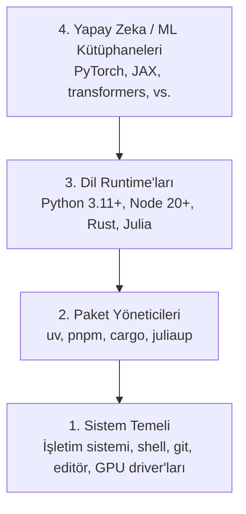

# Geliştirme Ortamı

> Araçlarınız düşüncenizi şekillendirir. Bir kere kurun, doğru kurun.

**Tür:** Yapım
**Diller:** Python, Node.js, Rust
**Ön koşullar:** Yok
**Süre:** ~45 dakika

## Öğrenme Hedefleri

- Python 3.11+, Node.js 20+ ve Rust araç zincirlerini sıfırdan kur
- Tekrarlanabilir build'ler için sanal ortamları ve paket yöneticilerini yapılandır
- CUDA/MPS ile GPU erişimini doğrula ve test bir tensor işlemi çalıştır
- Dört katmanlı yığını anla: sistem, paketler, runtime'lar, yapay zeka kütüphaneleri

## Sorun

200'ün üzerinde derste Python, TypeScript, Rust ve Julia kullanarak yapay zeka mühendisliği öğrenmek üzeresin. Ortamın bozuksa, her ders öğrenmek yerine araçlarla boğuşma savaşına dönüşür.

İnsanların çoğu ortam kurulumunu atlar. Sonra saatlerini import hatalarını, sürüm çakışmalarını ve eksik CUDA driver'larını çözmekle geçirirler. Biz bu işi bir kere, düzgün yapacağız.

## Kavram

Bir yapay zeka mühendisliği ortamının dört katmanı vardır:



Aşağıdan yukarı kurarız. Her katman, altındakine bağımlıdır.

## İnşa Et

### Adım 1: Sistem Temeli

Sisteminizi kontrol edin ve temel araçları kurun.

```bash
# macOS
xcode-select --install
brew install git curl wget

# Ubuntu/Debian
sudo apt update && sudo apt install -y build-essential git curl wget

# Windows (WSL2 kullanın)
wsl --install -d Ubuntu-24.04
```

### Adım 2: uv ile Python

`uv` kullanıyoruz — pip'ten 10-100 kat daha hızlı ve sanal ortamları otomatik yönetiyor.

```bash
curl -LsSf https://astral.sh/uv/install.sh | sh

uv python install 3.12

uv venv
source .venv/bin/activate  # ya da Windows'ta .venv\Scripts\activate

uv pip install numpy matplotlib jupyter
```

Doğrulama:

```python
import sys
print(f"Python {sys.version}")

import numpy as np
print(f"NumPy {np.__version__}")
a = np.array([1, 2, 3])
print(f"Vektör: {a}, kendisiyle nokta çarpımı: {np.dot(a, a)}")
```

### Adım 3: pnpm ile Node.js

TypeScript dersleri için (agent'lar, MCP sunucuları, web uygulamaları).

```bash
curl -fsSL https://fnm.vercel.app/install | bash
fnm install 22
fnm use 22

npm install -g pnpm

node -e "console.log('Node', process.version)"
```

### Adım 4: Rust

Performans-kritik dersler için (çıkarım, sistemler).

```bash
curl --proto '=https' --tlsv1.2 -sSf https://sh.rustup.rs | sh

rustc --version
cargo --version
```

### Adım 5: Julia (Opsiyonel)

Julia'nın parladığı matematik ağırlıklı dersler için.

```bash
curl -fsSL https://install.julialang.org | sh

julia -e 'println("Julia ", VERSION)'
```

### Adım 6: GPU Kurulumu (Eğer Varsa)

```bash
# NVIDIA
nvidia-smi

# PyTorch'u CUDA ile kur
uv pip install torch torchvision torchaudio --index-url https://download.pytorch.org/whl/cu124
```

```python
import torch
print(f"CUDA erişilebilir: {torch.cuda.is_available()}")
if torch.cuda.is_available():
    print(f"GPU: {torch.cuda.get_device_name(0)}")
```

GPU yok mu? Sorun değil. Derslerin çoğu CPU'da çalışır. Eğitim ağırlıklı dersler için Google Colab ya da bulut GPU'ları kullanın.

### Adım 7: Her Şeyi Doğrula

Doğrulama script'ini çalıştırın:

```bash
python phases/00-setup-and-tooling/01-dev-environment/code/verify.py
```

## Kullan

Ortamınız artık kurstaki her ders için hazır. Hangisini nerede kullanacağınızı şu tablo özetliyor:

| Dil | Kullanıldığı Yer | Paket Yöneticisi |
|-----|-------------------|-------------------|
| Python | Faz 1-12 (ML, DL, NLP, Görü, Ses, LLM'ler) | uv |
| TypeScript | Faz 13-17 (Tool'lar, Agent'lar, Sürüler, Altyapı) | pnpm |
| Rust | Faz 12, 15-17 (Performans-kritik sistemler) | cargo |
| Julia | Faz 1 (Matematik temelleri) | Pkg |

## Yayınla

Bu ders, herkesin kurulumunu kontrol etmek için çalıştırabileceği bir doğrulama script'i üretir.

Yapay zeka asistanlarının ortam sorunlarını teşhis etmesine yardım eden prompt için `outputs/prompt-env-check.md` dosyasına bakın.

## Alıştırmalar

1. Doğrulama script'ini çalıştırın ve başarısız olan kısımları düzeltin
2. Bu kurs için bir Python sanal ortamı oluşturun ve PyTorch kurun
3. Dört dilin hepsinde bir "merhaba dünya" yazın ve her birini çalıştırın
