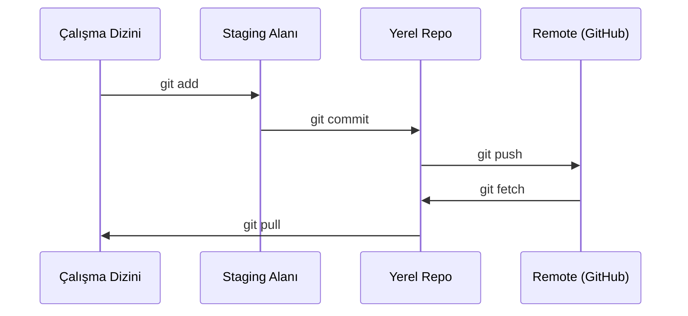

# Git & İşbirliği

> Versiyon kontrolü opsiyonel değildir. Burada inşa ettiğin her deney, her model, her ders takip edilir.

**Tür:** Öğrenim
**Diller:** --
**Ön koşullar:** Faz 0, Ders 01
**Süre:** ~30 dakika

## Öğrenme Hedefleri

- Git kimliğini yapılandır ve günlük add, commit, push iş akışını kullan
- main'i bozmadan izole deneyler için branch oluştur ve birleştir
- Model checkpoint'leri ve büyük binary dosyaları hariç tutan bir `.gitignore` yaz
- Projenin evrimini anlamak için `git log` ile commit geçmişinde gezin

## Sorun

Yirmi faz boyunca yüzlerce kod dosyası yazmak üzeresin. Versiyon kontrolü olmadan işini kaybedersin, geri alamayacağın şeyleri bozarsın ve başkalarıyla işbirliği yapmanın bir yolu olmaz.

Araç git. Kodun yaşadığı yer GitHub. Bu ders bu kurs için ihtiyacın olanı kapsar, fazlasını değil.

## Kavram



Hatırlanacak üç şey:
1. Sık kaydet (`git commit`)
2. Remote'a gönder (`git push`)
3. Deneyler için branch aç (`git checkout -b experiment`)

## İnşa Et

### Adım 1: Git'i yapılandır

```bash
git config --global user.name "Adın Soyadın"
git config --global user.email "sen@ornek.com"
```

### Adım 2: Günlük iş akışı

```bash
git status
git add file.py
git commit -m "Add perceptron implementation"
git push origin main
```

### Adım 3: Deneyler için branching

```bash
git checkout -b experiment/new-optimizer

# ... değişiklik yap, commit'le ...

git checkout main
git merge experiment/new-optimizer
```

### Adım 4: Bu kursun repo'su ile çalışmak

```bash
git clone https://github.com/komunite/ai-muhendisligi.git
cd ai-engineering-from-scratch

git checkout -b my-progress
# dersler üzerinde çalış, kodunu commit'le
git push origin my-progress
```

## Kullan

Bu kurs için ihtiyacın olan tek komutlar şunlar:

| Komut | Ne zaman |
|---------|------|
| `git clone` | Kurs repo'sunu al |
| `git add` + `git commit` | İşini kaydet |
| `git push` | GitHub'a yedekle |
| `git checkout -b` | main'i bozmadan bir şey dene |
| `git log --oneline` | Ne yaptığını gör |

Hepsi bu kadar. Bu kurs için rebase, cherry-pick veya submodule'a ihtiyacın yok.

## Alıştırmalar

1. Bu repo'yu klonla, `my-progress` adında bir branch oluştur, bir dosya oluştur, commit'le, push'la
2. Model checkpoint dosyalarını (`.pt`, `.pth`, `.safetensors`) hariç tutan bir `.gitignore` oluştur
3. Bu repo'nun commit geçmişine `git log --oneline` ile bak ve derslerin nasıl eklendiğini oku

## Anahtar Terimler

| Terim | İnsanlar ne diyor | Gerçekte ne anlama geliyor |
|------|----------------|----------------------|
| Commit | "Kaydetmek" | Projenin belirli bir andaki tamamen snapshot'ı |
| Branch | "Bir kopya" | Çalıştıkça ileri hareket eden bir commit'e işaret eden işaretçi |
| Merge | "Kodu birleştirmek" | Bir branch'teki değişiklikleri alıp başka bir branch'e uygulamak |
| Remote | "Bulut" | Repo'nun başka bir yerde (GitHub, GitLab) barındırılan kopyası |
