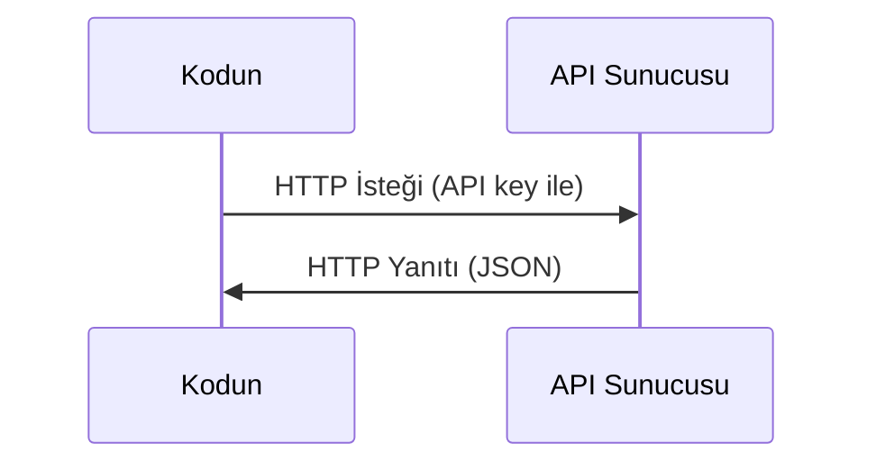

# API'lar & Anahtarlar

> Her yapay zeka API'si aynı şekilde çalışır: bir istek gönder, bir yanıt al. Detaylar değişir, kalıp değişmez.

**Tür:** Yapım
**Diller:** Python, TypeScript
**Ön koşullar:** Faz 0, Ders 01
**Süre:** ~30 dakika

## Öğrenme Hedefleri

- Ortam değişkenleri ve `.env` dosyaları kullanarak API anahtarlarını güvenli sakla
- Hem Anthropic Python SDK hem de raw HTTP ile bir LLM API çağrısı yap
- Hata ayıklama için SDK-tabanlı ve raw HTTP istek/yanıt formatlarını karşılaştır
- Kimlik doğrulama ve rate limit dahil yaygın API hatalarını tanımla ve ele al

## Sorun

Faz 11'den itibaren LLM API'larını (Anthropic, OpenAI, Google) çağıracaksın. Faz 13-16'da bu API'ları döngüde kullanan agent'lar inşa edeceksin. API anahtarlarının nasıl çalıştığını, güvenli saklamayı ve ilk API çağrını yapmayı bilmen lazım.

## Kavram



Her API çağrısında şunlar olur:
1. Bir endpoint (URL)
2. Bir API anahtarı (kimlik doğrulama)
3. Bir istek gövdesi (ne istediğin)
4. Bir yanıt gövdesi (geri aldığın)

## İnşa Et

### Adım 1: API anahtarlarını güvenle sakla

API anahtarlarını asla koda koyma. Ortam değişkenleri kullan.

```bash
export ANTHROPIC_API_KEY="sk-ant-..."
export OPENAI_API_KEY="sk-..."
```

Ya da `.env` dosyası kullan (`.gitignore`'a ekle):

```
ANTHROPIC_API_KEY=sk-ant-...
OPENAI_API_KEY=sk-...
```

### Adım 2: İlk API çağrısı (Python)

```python
import anthropic

client = anthropic.Anthropic()

response = client.messages.create(
    model="claude-sonnet-4-20250514",
    max_tokens=256,
    messages=[{"role": "user", "content": "What is a neural network in one sentence?"}]
)

print(response.content[0].text)
```

### Adım 3: İlk API çağrısı (TypeScript)

```typescript
import Anthropic from "@anthropic-ai/sdk";

const client = new Anthropic();

const response = await client.messages.create({
  model: "claude-sonnet-4-20250514",
  max_tokens: 256,
  messages: [{ role: "user", content: "What is a neural network in one sentence?" }],
});

console.log(response.content[0].text);
```

### Adım 4: Raw HTTP (SDK yok)

```python
import os
import urllib.request
import json

url = "https://api.anthropic.com/v1/messages"
headers = {
    "Content-Type": "application/json",
    "x-api-key": os.environ["ANTHROPIC_API_KEY"],
    "anthropic-version": "2023-06-01",
}
body = json.dumps({
    "model": "claude-sonnet-4-20250514",
    "max_tokens": 256,
    "messages": [{"role": "user", "content": "What is a neural network in one sentence?"}],
}).encode()

req = urllib.request.Request(url, data=body, headers=headers, method="POST")
with urllib.request.urlopen(req) as resp:
    result = json.loads(resp.read())
    print(result["content"][0]["text"])
```

SDK'lar perde arkasında bunu yapıyor. Raw HTTP çağrısını anlamak hata ayıklarken işine yarar.

## Kullan

Bu kurs için:

| API | Ne zaman lazım | Ücretsiz tier |
|-----|-----------------|-----------|
| Anthropic (Claude) | Faz 11-16 (agent'lar, tool'lar) | Kayıtta $5 kredi |
| OpenAI | Faz 11 (karşılaştırma) | Kayıtta $5 kredi |
| Hugging Face | Faz 4-10 (modeller, veri setleri) | Ücretsiz |

Hepsine şu an ihtiyacın yok. Ders gerektirdiğinde kur.

## Yayınla

Bu ders şunu üretir:
- `outputs/prompt-api-troubleshooter.md` - yaygın API hatalarını teşhis et

## Alıştırmalar

1. Bir Anthropic API anahtarı al ve ilk API çağrını yap
2. Raw HTTP versiyonunu dene ve yanıt formatını SDK versiyonuyla karşılaştır
3. Bilerek yanlış bir API anahtarı kullan ve hata mesajını oku

## Anahtar Terimler

| Terim | İnsanlar ne diyor | Gerçekte ne anlama geliyor |
|------|----------------|----------------------|
| API key | "API'nin parolası" | Hesabını tanımlayan ve isteklere izin veren benzersiz bir string |
| Rate limit | "Beni kısıtlıyorlar" | Suistimali önlemek ve adil kullanımı sağlamak için dakika/saat başına maksimum istek |
| Token | "Bir kelime" (API bağlamında) | Bir faturalama birimi: girdi ve çıktı token'ları ayrı sayılır ve faturalandırılır |
| Streaming | "Gerçek zamanlı yanıtlar" | Tüm yanıtı beklemek yerine yanıtı kelime kelime almak |
