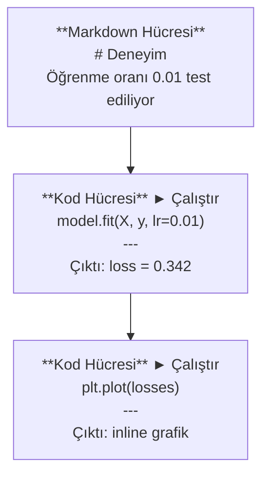
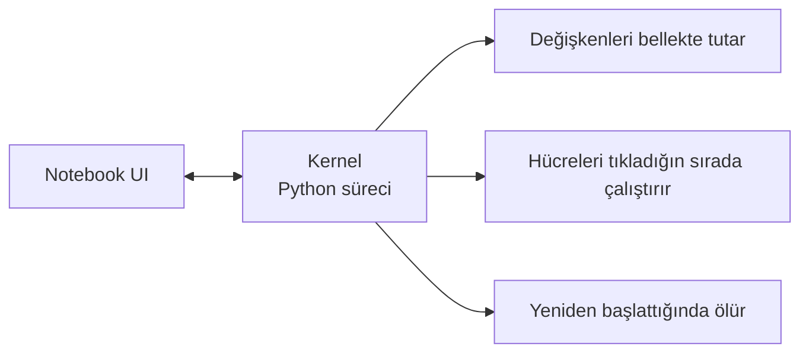

# Jupyter Notebook'ları

> Notebook'lar yapay zeka mühendisliğinin laboratuvar tezgahıdır. Burada prototip yaparsın, sonra çalışanı production'a taşırsın.

**Tür:** Yapım
**Diller:** Python
**Ön koşullar:** Faz 0, Ders 01
**Süre:** ~30 dakika

## Öğrenme Hedefleri

- JupyterLab, Jupyter Notebook veya Jupyter eklentili VS Code'u kur ve başlat
- Inline benchmark ve görselleştirme için magic komutları (`%timeit`, `%%time`, `%matplotlib inline`) kullan
- Notebook ne zaman, script ne zaman kullanılır ayırt et ve "notebook'ta keşfet, script'te yayınla" iş akışını uygula
- Yaygın notebook tuzaklarını tanımla ve onlardan kaçın: sırasız çalıştırma, gizli state ve bellek sızıntıları

## Sorun

Her yapay zeka makalesi, eğitim ve Kaggle yarışması Jupyter notebook kullanır. Kodu parça parça çalıştırmana, çıktıları inline görmene, kodu açıklamalarla karıştırmana ve hızlı iterasyon yapmana izin verirler. Notebook'lar olmadan yapay zeka öğrenmeye çalışmak, müsvedde kağıdı olmadan matematik ödevi yapmak gibidir.

Ama notebook'ların gerçek tuzakları var. İnsanlar her şey için kullanıyor, berbat oldukları şeyler de dahil. Notebook ne zaman, script ne zaman kullanılır bilmek seni ileride hata ayıklama kabuslarından kurtarır.

## Kavram

Bir notebook hücre listesidir. Her hücre ya kod ya da metindir.



Kernel arka planda çalışan bir Python süreci. Bir hücreyi çalıştırdığında kodu kernel'e gönderir, kernel onu çalıştırır ve sonucu geri gönderir. Tüm hücreler aynı kernel'i paylaşır, bu yüzden değişkenler hücreler arasında kalır.



O "tıkladığın sırada" kısmı hem süper güç hem de ayağa kurşun sıkma aracı.

## İnşa Et

### Adım 1: Arayüzünü seç

Üç seçenek, tek format:

| Arayüz | Kurulum | En iyi |
|-----------|---------|----------|
| JupyterLab | `pip install jupyterlab` sonra `jupyter lab` | Tam IDE deneyimi, çoklu sekme, dosya tarayıcısı, terminal |
| Jupyter Notebook | `pip install notebook` sonra `jupyter notebook` | Basit, hafif, tek seferde bir notebook |
| VS Code | "Jupyter" eklentisini kur | Zaten editöründe, git entegrasyonu, hata ayıklama |

Üçü de aynı `.ipynb` dosyasını okur ve yazar. Hangisini istersen seç. Yapay zeka işinde en yaygın olanı JupyterLab.

```bash
pip install jupyterlab
jupyter lab
```

### Adım 2: Önemli klavye kısayolları

İki modda çalışırsın. Komut modu için `Escape` (solda mavi çubuk), düzenleme modu için `Enter` (yeşil çubuk).

**Komut modu (en çok kullanılan):**

| Tuş | Eylem |
|-----|--------|
| `Shift+Enter` | Hücreyi çalıştır, sonrakine geç |
| `A` | Üstüne hücre ekle |
| `B` | Altına hücre ekle |
| `DD` | Hücreyi sil |
| `M` | Markdown'a dönüştür |
| `Y` | Kod'a dönüştür |
| `Z` | Hücre işlemini geri al |
| `Ctrl+Shift+H` | Tüm kısayolları göster |

**Düzenleme modu:**

| Tuş | Eylem |
|-----|--------|
| `Tab` | Otomatik tamamla |
| `Shift+Tab` | Fonksiyon imzasını göster |
| `Ctrl+/` | Yorum aç/kapa |

`Shift+Enter` günde bin kez kullanacağın tuş. Önce onu öğren.

### Adım 3: Hücre türleri

**Kod hücreleri** Python çalıştırır ve çıktıyı gösterir:

```python
import numpy as np
data = np.random.randn(1000)
data.mean(), data.std()
```

Çıktı: `(0.0032, 0.9987)`

**Markdown hücreleri** biçimli metin render eder. Ne yaptığını ve neden yaptığını belgelemek için kullan. Başlıklar, kalın, italik, LaTeX matematik (`$E = mc^2$`), tablolar ve görseller destekler.

### Adım 4: Magic komutları

Bunlar Python değil. `%` (line magic) veya `%%` (cell magic) ile başlayan Jupyter'a özgü komutlar.

**Kodunu zamanla:**

```python
%timeit np.random.randn(10000)
```

Çıktı: `45.2 us +/- 1.3 us per loop`

```python
%%time
model.fit(X_train, y_train, epochs=10)
```

Çıktı: `Wall time: 2.34 s`

`%timeit` kodu birçok kez çalıştırır ve ortalama alır. `%%time` bir kez çalıştırır. Mikrobenchmark'lar için `%timeit`, eğitim koşuları için `%%time` kullan.

**Inline grafikleri etkinleştir:**

```python
%matplotlib inline
```

Her `plt.plot()` veya `plt.show()` artık doğrudan notebook'ta render edilir.

**Notebook'tan çıkmadan paket kur:**

```python
!pip install scikit-learn
```

`!` öneki herhangi bir shell komutunu çalıştırır.

**Ortam değişkenlerini kontrol et:**

```python
%env CUDA_VISIBLE_DEVICES
```

### Adım 5: Zengin çıktıyı inline göster

Notebook'lar bir hücredeki son ifadeyi otomatik gösterir. Ama kontrol edebilirsin:

```python
import pandas as pd

df = pd.DataFrame({
    "model": ["Linear", "Random Forest", "Neural Net"],
    "accuracy": [0.72, 0.89, 0.94],
    "training_time": [0.1, 2.3, 45.6]
})
df
```

Bu metin dökümü değil, biçimli bir HTML tablosu render eder. Grafiklerle de aynı:

```python
import matplotlib.pyplot as plt

plt.figure(figsize=(8, 4))
plt.plot([1, 2, 3, 4], [1, 4, 2, 3])
plt.title("Inline Plot")
plt.show()
```

Grafik hücrenin hemen altında belirir. Yapay zeka işinde notebook'ların hakim olmasının sebebi bu. Veriyi, grafiği ve kodu birlikte görüyorsun.

Görseller için:

```python
from IPython.display import Image, display
display(Image(filename="architecture.png"))
```

### Adım 6: Google Colab

Colab bulutta ücretsiz bir Jupyter notebook. Sana GPU, önceden kurulu kütüphaneler ve Google Drive entegrasyonu verir. Kurulum gerektirmez.

1. [colab.research.google.com](https://colab.research.google.com) adresine git
2. Bu kurstan herhangi bir `.ipynb` dosyası yükle
3. Runtime > Change runtime type > T4 GPU (ücretsiz)

Yerel Jupyter'dan farkları:
- Dosyalar oturumlar arasında kalmaz (Drive'a kaydet veya indir)
- Önceden kurulu: numpy, pandas, matplotlib, torch, tensorflow, sklearn
- Dosya yükleme/indirme için `from google.colab import files`
- Kalıcı depolama için `from google.colab import drive; drive.mount('/content/drive')`
- Oturumlar 90 dakika hareketsizlikten sonra zaman aşımına uğrar (ücretsiz tier)

## Kullan

### Notebook'lar vs Script'ler: Hangisi ne zaman

| Notebook kullan | Script kullan |
|-------------------|-----------------|
| Bir veri setini keşfetmek | Eğitim pipeline'ları |
| Bir model prototiplemek | Yeniden kullanılabilir utility'ler |
| Sonuçları görselleştirmek | `if __name__` içeren her şey |
| İşini açıklamak | Zamanlanmış çalışan kod |
| Hızlı deneyler | Production kodu |
| Kurs alıştırmaları | Paketler ve kütüphaneler |

Kural: **notebook'ta keşfet, script'te yayınla**.

Yapay zekada yaygın bir iş akışı:
1. Bir notebook'ta veriyi keşfet
2. Modelini notebook'ta prototiple
3. Çalıştığında kodu `.py` dosyalarına taşı
4. Daha fazla deney için bu `.py` dosyalarını notebook'a geri import et

### Yaygın tuzaklar

**Sırasız çalıştırma.** Hücre 5'i, sonra 2'yi, sonra 7'yi çalıştırıyorsun. Notebook senin makinende çalışıyor ama biri yukarıdan aşağıya çalıştırınca bozuluyor. Çözüm: Paylaşmadan önce Kernel > Restart & Run All.

**Gizli state.** Bir hücreyi siliyorsun ama oluşturduğu değişken hâlâ bellekte. Notebook temiz görünüyor ama hayalet bir hücreye bağımlı. Çözüm: Kernel'i düzenli olarak yeniden başlat.

**Bellek sızıntıları.** 4GB veri seti yüklüyorsun, model eğitiyorsun, başka bir veri seti yüklüyorsun. Hiçbir şey serbest bırakılmıyor. Çözüm: `del variable_name` ve `gc.collect()`, ya da kernel'i yeniden başlat.

## Yayınla

Bu ders şunu üretir:
- `outputs/prompt-notebook-helper.md` notebook sorunlarını ayıklamak için

## Alıştırmalar

1. JupyterLab'i aç, bir notebook oluştur ve 100.000 rastgele sayıdan oluşan bir array yaratmak için list comprehension vs numpy karşılaştırmak için `%timeit` kullan
2. Hem markdown hem kod hücreleri olan, bir CSV yükleyen, bir dataframe gösteren ve bir grafik çizen bir notebook oluştur. Sonra yukarıdan aşağıya çalıştığını doğrulamak için Kernel > Restart & Run All çalıştır
3. `code/notebook_tips.py` içindeki kodu al, bir Colab notebook'una yapıştır ve ücretsiz bir GPU ile çalıştır

## Anahtar Terimler

| Terim | İnsanlar ne diyor | Gerçekte ne anlama geliyor |
|------|----------------|----------------------|
| Kernel | "Kodumu çalıştıran şey" | Hücreleri çalıştıran ve değişkenleri bellekte tutan ayrı bir Python süreci |
| Cell | "Bir kod bloğu" | Notebook'ta bağımsız olarak çalıştırılabilir bir birim, ya kod ya markdown |
| Magic komut | "Jupyter hileleri" | Notebook ortamını kontrol eden `%` veya `%%` önekli özel komutlar |
| `.ipynb` | "Notebook dosyası" | Hücreleri, çıktıları ve metadata'yı içeren bir JSON dosyası. IPython Notebook'un kısaltması |

## İleri Okuma

- Tam özellik seti için [JupyterLab Dokümantasyonu](https://jupyterlab.readthedocs.io/)
- Colab'a özgü limitler ve özellikler için [Google Colab FAQ](https://research.google.com/colaboratory/faq.html)
- Power-user kısayolları için [28 Jupyter Notebook İpucu](https://www.dataquest.io/blog/jupyter-notebook-tips-tricks-shortcuts/)
