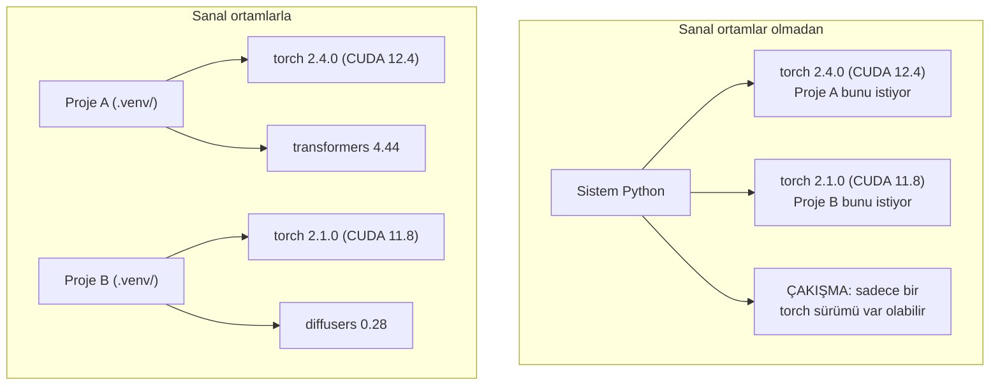

# Python Ortamları

> Bağımlılık cehennemi gerçektir. Sanal ortamlar tedavidir.

**Tür:** Yapım
**Diller:** Python
**Ön koşullar:** Faz 0, Ders 01
**Süre:** ~30 dakika

## Öğrenme Hedefleri

- `uv`, `venv` veya `conda` kullanarak izole sanal ortamlar oluştur
- Tekrarlanabilirlik için opsiyonel bağımlılık gruplu bir `pyproject.toml` yaz ve lockfile üret
- Yaygın tuzakları teşhis et ve düzelt: global kurulumlar, pip/conda karışımı, CUDA sürüm uyumsuzlukları
- Çakışan bağımlılıkları olan projeler için faz başına ortam stratejisi uygula

## Sorun

Bir fine-tuning projesi için PyTorch 2.4 kuruyorsun. Sonraki hafta başka bir proje PyTorch 2.1'e ihtiyaç duyuyor çünkü CUDA build'i sabitlenmiş. Global olarak yükseltiyorsun, ilk proje bozuluyor. Düşürüyorsun, ikincisi bozuluyor.

Bu bağımlılık cehennemi. Yapay zeka/ML işinde sürekli olur çünkü:

- PyTorch, JAX ve TensorFlow her biri kendi CUDA bağlamalarını gönderir
- Model kütüphaneleri belirli framework sürümlerini sabitler
- Global bir `pip install` daha önce ne varsa üzerine yazar
- CUDA 11.8 build'leri CUDA 12.x driver'larıyla çalışmaz (ve tersi)

Çözüm: her proje kendi izole ortamını ve kendi paketlerini alır.

## Kavram



## İnşa Et

### Seçenek 1: uv venv (Önerilen)

`uv` en hızlı Python paket yöneticisi (pip'ten 10-100x daha hızlı). Sanal ortamları, Python sürümlerini ve bağımlılık çözümlemesini tek araçta halleder.

```bash
curl -LsSf https://astral.sh/uv/install.sh | sh

uv python install 3.12

cd your-project
uv venv
source .venv/bin/activate
```

Paket kur:

```bash
uv pip install torch numpy
```

Tek adımda `pyproject.toml` ile proje oluştur:

```bash
uv init my-ai-project
cd my-ai-project
uv add torch numpy matplotlib
```

### Seçenek 2: venv (Yerleşik)

`uv` kuramıyorsan, Python `venv` ile gelir:

```bash
python3 -m venv .venv
source .venv/bin/activate  # Linux/macOS
.venv\Scripts\activate     # Windows

pip install torch numpy
```

`uv`'den daha yavaş ama Python'un kurulu olduğu her yerde çalışır.

### Seçenek 3: conda (İhtiyacın Olduğunda)

Conda CUDA toolkit'leri, cuDNN ve C kütüphaneleri gibi Python-dışı bağımlılıkları yönetir. Şunlarda kullan:

- Sistem genelinde kurmadan belirli bir CUDA toolkit sürümüne ihtiyacın olduğunda
- Sistem paketleri kuramadığın paylaşılan bir cluster'dasin
- Bir kütüphanenin kurulum talimatı "conda kullan" diyor

```bash
# miniconda kur (tam Anaconda değil)
curl -LsSf https://repo.anaconda.com/miniconda/Miniconda3-latest-Linux-x86_64.sh -o miniconda.sh
bash miniconda.sh -b

conda create -n myproject python=3.12
conda activate myproject

conda install pytorch torchvision torchaudio pytorch-cuda=12.4 -c pytorch -c nvidia
```

Bir kural: bir ortam için conda kullanırsan, o ortamdaki tüm paketler için conda kullan. Bir conda env'ine `pip install` karıştırmak, hata ayıklaması acı verici olan bağımlılık çakışmalarına yol açar.

### Bu Kurs İçin: Faz-Başına Strateji

Tüm kurs için tek ortam oluşturabilirsin. Yapma. Farklı fazlar farklı (bazen çakışan) bağımlılıklara ihtiyaç duyar.

Strateji:

```
ai-engineering-from-scratch/
├── .venv/                    <-- faz 0-3 için paylaşılan hafif env
├── phases/
│   ├── 04-neural-networks/
│   │   └── .venv/            <-- PyTorch env
│   ├── 05-cnns/
│   │   └── .venv/            <-- aynı PyTorch env (symlink veya paylaşılan)
│   ├── 08-transformers/
│   │   └── .venv/            <-- farklı transformer sürümlerine ihtiyaç olabilir
│   └── 11-llm-apis/
│       └── .venv/            <-- API SDK'ları, torch lazım değil
```

`code/env_setup.sh` içindeki script bu kurs için temel ortamı oluşturur.

## pyproject.toml Temelleri

Her Python projesinde bir `pyproject.toml` olmalı. `setup.py`, `setup.cfg` ve `requirements.txt`'nin yerini tek dosyada alır.

```toml
[project]
name = "ai-engineering-from-scratch"
version = "0.1.0"
requires-python = ">=3.11"
dependencies = [
    "numpy>=1.26",
    "matplotlib>=3.8",
    "jupyter>=1.0",
    "scikit-learn>=1.4",
]

[project.optional-dependencies]
torch = ["torch>=2.3", "torchvision>=0.18"]
llm = ["anthropic>=0.39", "openai>=1.50"]
```

Sonra kur:

```bash
uv pip install -e ".[torch]"    # temel + PyTorch
uv pip install -e ".[llm]"     # temel + LLM SDK'ları
uv pip install -e ".[torch,llm]" # her şey
```

## Lockfile'lar

Bir lockfile her bağımlılığı (transitive olanlar dahil) tam sürümlere sabitler. Bu tekrarlanabilirliği garantiler: lockfile'dan kuran herkes tam olarak aynı paketleri alır.

```bash
# uv add kullanırken uv.lock'u otomatik üretir
uv add numpy

# pip-tools yaklaşımı
uv pip compile pyproject.toml -o requirements.lock
uv pip install -r requirements.lock
```

Lockfile'ını git'e commit'le. Biri repo'yu klonladığında lockfile'dan kurar ve aynı sürümleri alır.

## Yaygın Hatalar

### 1. Global kurulum

```bash
pip install torch  # KÖTÜ: sistem Python'una kurar

source .venv/bin/activate
pip install torch  # İYİ: sanal ortama kurar
```

Paketlerinin nereye gittiğini kontrol et:

```bash
which python       # .venv/bin/python göstermeli, /usr/bin/python değil
which pip           # .venv/bin/pip göstermeli
```

### 2. pip ve conda karıştırmak

```bash
conda create -n myenv python=3.12
conda activate myenv
conda install pytorch -c pytorch
pip install some-other-package   # KÖTÜ: conda'nın bağımlılık takibini bozabilir
conda install some-other-package # İYİ: her şeyi conda'ya yönettir
```

Eğer conda içinde pip kullanmak zorundaysan (bazı paketler sadece pip'te), önce tüm conda paketlerini kur, sonra en son pip paketlerini.

### 3. Aktive etmeyi unutmak

```bash
python train.py           # sistem Python'u kullanır, paketler eksik
source .venv/bin/activate
python train.py           # proje Python'unu kullanır, paketler bulunur
```

Shell prompt'un ortam adını göstermeli:

```
(.venv) $ python train.py
```

### 4. .venv'i git'e commit'lemek

```bash
echo ".venv/" >> .gitignore
```

Sanal ortamlar 200MB-2GB. Yereldir, makineler arasında taşınabilir değildir. Onun yerine `pyproject.toml`'u ve lockfile'ı commit'le.

### 5. CUDA sürüm uyumsuzluğu

```bash
nvidia-smi                # driver CUDA sürümünü gösterir (ör. 12.4)
python -c "import torch; print(torch.version.cuda)"  # PyTorch CUDA sürümünü gösterir

# Bunlar uyumlu olmalı.
# PyTorch CUDA sürümü <= driver CUDA sürümü olmalı.
```

## Kullan

Kurs ortamını oluşturmak için setup script'ini çalıştır:

```bash
bash phases/00-setup-and-tooling/06-python-environments/code/env_setup.sh
```

Bu repo kökünde temel bağımlılıkları kurulu ve doğrulanmış bir `.venv` oluşturur.

## Alıştırmalar

1. `env_setup.sh` çalıştır ve tüm kontrollerin geçtiğini doğrula
2. İkinci bir sanal ortam oluştur, içine farklı bir numpy sürümü kur ve iki ortamın izole olduğunu doğrula
3. Hem PyTorch hem Anthropic SDK'ya ihtiyaç duyan bir proje için `pyproject.toml` yaz
4. Bilerek global olarak (bir venv aktive etmeden) bir paket kur, nereye gittiğini gör, sonra kaldır

## Anahtar Terimler

| Terim | İnsanlar ne diyor | Gerçekte ne anlama geliyor |
|------|----------------|----------------------|
| Sanal ortam | "Bir venv" | Sistem Python'undan ayrı, bir Python yorumlayıcısı ve paketler içeren izole bir dizin |
| Lockfile | "Sabitlenmiş bağımlılıklar" | Her paketi ve tam sürümünü listeleyen, makineler arası özdeş kurulumları garanti eden dosya |
| pyproject.toml | "Yeni setup.py" | Standart Python proje yapılandırma dosyası, setup.py/setup.cfg/requirements.txt yerine geçer |
| Transitive bağımlılık | "Bağımlılığın bağımlılığı" | Paket B C'ye bağımlı; B'ye bağımlı A'yı kurarsan C, A'nın transitive bağımlılığıdır |
| CUDA uyumsuzluğu | "GPU'm çalışmıyor" | PyTorch GPU driver'ının desteklediğinden farklı bir CUDA sürümü için derlenmiş |
