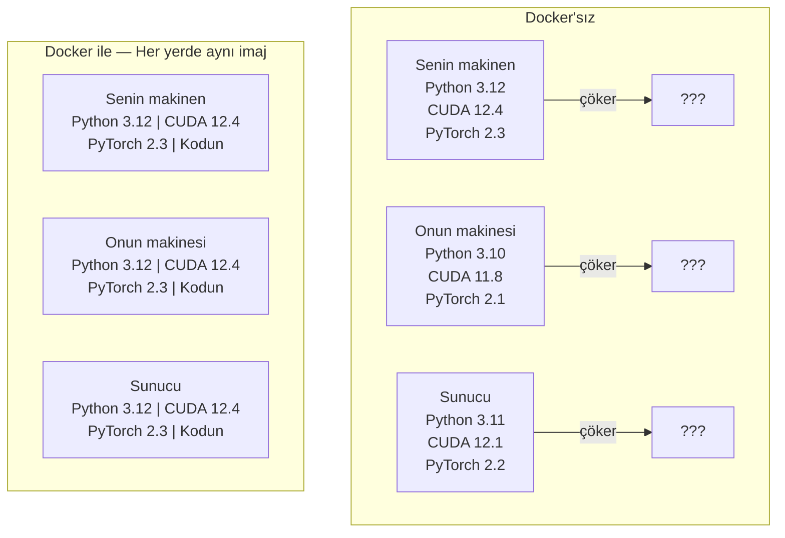

# Yapay Zeka için Docker

> Container'lar "benim makinemde çalışıyor"u tarihe gömer.

**Tür:** Yapım
**Diller:** Python
**Ön koşullar:** Faz 0, Ders 01 ve 03
**Süre:** ~60 dakika

## Öğrenme Hedefleri

- Bir Dockerfile'dan CUDA, PyTorch ve yapay zeka kütüphaneleriyle GPU'lu bir Docker imajı build et
- Container yeniden build'leri arasında model, veri seti ve kodu kalıcı tutmak için host dizinlerini volume olarak mount et
- Container'lar içinde GPU'ları açığa çıkarmak için NVIDIA Container Toolkit'i yapılandır
- Docker Compose kullanarak çok-servisli yapay zeka uygulamalarını (inference sunucusu + vector veritabanı) orkestre et

## Sorun

Laptop'unda bir modeli PyTorch 2.3, CUDA 12.4 ve Python 3.12 ile eğittin. Bir meslektaşında PyTorch 2.1, CUDA 11.8 ve Python 3.10 var. Modelin onun makinesinde çöküyor. Dockerfile'ın ikisinde de çalışıyor.

Yapay zeka projeleri bağımlılık kabusudur. Tipik bir yığın Python, PyTorch, CUDA driver'lar, cuDNN, sistem-düzeyi C kütüphaneleri ve flash-attn gibi tam derleyici sürümleri gerektiren özelleşmiş paketler içerir. Docker tüm bunları her yerde aynı çalışan tek bir imaja paketler.

## Kavram

Docker kodunu, runtime'ını, kütüphanelerini ve sistem araçlarını container denilen izole bir birime sarar. Onu hafif bir sanal makine olarak düşün, ama host OS kernel'ini paylaşır kendi kernel'ini çalıştırmak yerine, yani dakikalar yerine saniyelerde başlar.



### Yapay zeka projeleri neden Docker'a en fazla ihtiyaç duyar

1. **GPU driver'lar kırılgan.** CUDA 12.4 kodu CUDA 11.8'de çalışmaz. Docker CUDA toolkit'ini container içinde izole ederken NVIDIA Container Toolkit aracılığıyla host GPU driver'ı paylaşır.

2. **Model ağırlıkları büyük.** 7B parametreli bir model fp16'da 14 GB. Her yeniden build'de tekrar indirmek istemezsin. Docker volume'ları host'tan bir models dizinini mount etmene izin verir.

3. **Çok-servisli mimariler yaygın.** Gerçek bir yapay zeka uygulaması sadece bir Python script'i değildir. Bir inference sunucusu, RAG için bir vector veritabanı, belki bir web frontend'idir. Docker Compose bunların hepsini tek komutla orkestre eder.

### Anahtar kelime hazinesi

| Terim | Ne anlama geliyor |
|------|---------------|
| Image | Salt-okunur bir şablon. Senin tarifin. Bir Dockerfile'dan build edilir. |
| Container | Bir imajın çalışan örneği. Senin mutfağın. |
| Dockerfile | İmajı build etme talimatları. Katman katman. |
| Volume | Container yeniden başlatmalarında hayatta kalan kalıcı depolama. |
| docker-compose | Çok-container'lı uygulamaları YAML'de tanımlamak için bir araç. |

### Yapay zekada yaygın container kalıpları

```
Dev Container
  Tam toolkit. Editör desteği. Jupyter. Hata ayıklama araçları.
  Geliştirme ve deney sırasında kullanılır.

Eğitim Container'ı
  Minimal. Sadece eğitim script'i ve bağımlılıklar.
  GPU cluster'larda çalışır. Editör yok, Jupyter yok.

Inference Container'ı
  Servis için optimize. Küçük imaj. Hızlı cold start.
  Production'da bir load balancer arkasında çalışır.
```

## İnşa Et

### Adım 1: Docker'ı kur

```bash
# macOS
brew install --cask docker
open /Applications/Docker.app

# Ubuntu
curl -fsSL https://get.docker.com | sh
sudo usermod -aG docker $USER
# Grup değişikliğinin etkin olması için çıkış yapıp tekrar gir
```

Doğrula:

```bash
docker --version
docker run hello-world
```

### Adım 2: NVIDIA Container Toolkit'i kur (NVIDIA GPU'lu Linux)

Bu Docker container'larının GPU'na erişmesini sağlar. macOS ve Windows (WSL2) kullanıcıları bunu atlayabilir; Docker Desktop bu platformlarda GPU passthrough'u farklı şekilde halleder.

```bash
distribution=$(. /etc/os-release;echo $ID$VERSION_ID)
curl -fsSL https://nvidia.github.io/libnvidia-container/gpgkey | sudo gpg --dearmor -o /usr/share/keyrings/nvidia-container-toolkit-keyring.gpg
curl -s -L https://nvidia.github.io/libnvidia-container/$distribution/libnvidia-container.list | \
    sed 's#deb https://#deb [signed-by=/usr/share/keyrings/nvidia-container-toolkit-keyring.gpg] https://#g' | \
    sudo tee /etc/apt/sources.list.d/nvidia-container-toolkit.list

sudo apt-get update
sudo apt-get install -y nvidia-container-toolkit
sudo nvidia-ctk runtime configure --runtime=docker
sudo systemctl restart docker
```

Container içinde GPU erişimini test et:

```bash
docker run --rm --gpus all nvidia/cuda:12.4.1-base-ubuntu22.04 nvidia-smi
```

GPU bilgini görürsen, toolkit çalışıyor.

### Adım 3: Base imajları anla

Doğru base imajı seçmek saatlerce hata ayıklamadan kurtarır.

```
nvidia/cuda:12.4.1-devel-ubuntu22.04
  Tam CUDA toolkit. Derleyiciler dahil.
  Kullanım: nvcc gerektiren paketler build etmek (flash-attn, bitsandbytes)
  Boyut: ~4 GB

nvidia/cuda:12.4.1-runtime-ubuntu22.04
  Sadece CUDA runtime. Derleyici yok.
  Kullanım: önceden build edilmiş kodu çalıştırmak
  Boyut: ~1.5 GB

pytorch/pytorch:2.3.1-cuda12.4-cudnn9-runtime
  CUDA üzerine önceden kurulu PyTorch.
  Kullanım: PyTorch kurulum adımını atlamak
  Boyut: ~6 GB

python:3.12-slim
  CUDA yok. Sadece CPU.
  Kullanım: CPU'da inference, hafif araçlar
  Boyut: ~150 MB
```

### Adım 4: Yapay zeka geliştirme için Dockerfile yaz

İşte `code/Dockerfile` içindeki Dockerfile. Üzerinden geç:

```dockerfile
FROM nvidia/cuda:12.4.1-devel-ubuntu22.04

ENV DEBIAN_FRONTEND=noninteractive
ENV PYTHONUNBUFFERED=1

RUN apt-get update && apt-get install -y --no-install-recommends \
    python3.12 \
    python3.12-venv \
    python3.12-dev \
    python3-pip \
    git \
    curl \
    build-essential \
    && rm -rf /var/lib/apt/lists/*

RUN update-alternatives --install /usr/bin/python python /usr/bin/python3.12 1

RUN python -m pip install --no-cache-dir --upgrade pip setuptools wheel

RUN python -m pip install --no-cache-dir \
    torch==2.3.1 \
    torchvision==0.18.1 \
    torchaudio==2.3.1 \
    --index-url https://download.pytorch.org/whl/cu124

RUN python -m pip install --no-cache-dir \
    numpy \
    pandas \
    scikit-learn \
    matplotlib \
    jupyter \
    transformers \
    datasets \
    accelerate \
    safetensors

WORKDIR /workspace

VOLUME ["/workspace", "/models"]

EXPOSE 8888

CMD ["python"]
```

Build et:

```bash
docker build -t ai-dev -f phases/00-setup-and-tooling/07-docker-for-ai/code/Dockerfile .
```

İlk seferinde uzun sürer (CUDA base imajı + PyTorch indirme). Sonraki build'ler cache'lenmiş katmanları kullanır.

Çalıştır:

```bash
docker run --rm -it --gpus all \
    -v $(pwd):/workspace \
    -v ~/models:/models \
    ai-dev python -c "import torch; print(f'PyTorch {torch.__version__}, CUDA: {torch.cuda.is_available()}')"
```

Container içinde Jupyter çalıştır:

```bash
docker run --rm -it --gpus all \
    -v $(pwd):/workspace \
    -v ~/models:/models \
    -p 8888:8888 \
    ai-dev jupyter notebook --ip=0.0.0.0 --port=8888 --no-browser --allow-root
```

### Adım 5: Veri ve modeller için volume mount'ları

Volume mount'lar yapay zeka işi için kritiktir. Onlar olmadan 14 GB model indirmelerin container durduğunda kaybolur.

```bash
# Kodunu mount et
-v $(pwd):/workspace

# Paylaşılan bir models dizini mount et
-v ~/models:/models

# Veri setlerini mount et
-v ~/datasets:/data
```

Eğitim script'in içinde, mount edilmiş yoldan yükle:

```python
from transformers import AutoModel

model = AutoModel.from_pretrained("/models/llama-7b")
```

Model host dosya sisteminde yaşar. Container'ı istediğin kadar yeniden build et, tekrar indirmek zorunda kalmazsın.

### Adım 6: Çok-servisli yapay zeka uygulamaları için Docker Compose

Gerçek bir RAG uygulaması bir inference sunucusu ve bir vector veritabanına ihtiyaç duyar. Docker Compose ikisini de tek komutla çalıştırır.

`code/docker-compose.yml`'ye bak:

```yaml
services:
  ai-dev:
    build:
      context: .
      dockerfile: Dockerfile
    deploy:
      resources:
        reservations:
          devices:
            - driver: nvidia
              count: all
              capabilities: [gpu]
    volumes:
      - ../../../:/workspace
      - ~/models:/models
      - ~/datasets:/data
    ports:
      - "8888:8888"
    stdin_open: true
    tty: true
    command: jupyter notebook --ip=0.0.0.0 --port=8888 --no-browser --allow-root

  qdrant:
    image: qdrant/qdrant:v1.12.5
    ports:
      - "6333:6333"
      - "6334:6334"
    volumes:
      - qdrant_data:/qdrant/storage

volumes:
  qdrant_data:
```

Her şeyi başlat:

```bash
cd phases/00-setup-and-tooling/07-docker-for-ai/code
docker compose up -d
```

Artık yapay zeka dev container'ın vector veritabanına servis adıyla `http://qdrant:6333` üzerinden ulaşabilir. Docker Compose otomatik olarak paylaşılan bir ağ oluşturur.

Yapay zeka container'ı içinden bağlantıyı test et:

```python
from qdrant_client import QdrantClient

client = QdrantClient(host="qdrant", port=6333)
print(client.get_collections())
```

Her şeyi durdur:

```bash
docker compose down
```

qdrant volume'unu da silmek için `-v` ekle:

```bash
docker compose down -v
```

### Adım 7: Yapay zeka işi için yararlı Docker komutları

```bash
# Çalışan container'ları listele
docker ps

# Tüm imajları ve boyutlarını listele
docker images

# Kullanılmayan imajları kaldır (disk alanı geri kazan)
docker system prune -a

# Çalışan bir container içinde GPU kullanımını kontrol et
docker exec -it <container_id> nvidia-smi

# Container'dan host'a dosya kopyala
docker cp <container_id>:/workspace/results.csv ./results.csv

# Container loglarını görüntüle
docker logs -f <container_id>
```

## Kullan

Artık tekrarlanabilir bir yapay zeka geliştirme ortamın var. Bu kursun geri kalanı için:

- Dev ortamını ve vector veritabanını birlikte başlatmak için `docker compose up` kullan
- Yeniden build'ler arasında hiçbir şey kaybolmasın diye kodu, modelleri ve veriyi volume olarak mount et
- Bir ders yeni bir Python paketi gerektirdiğinde, Dockerfile'a ekle ve yeniden build et
- Dockerfile'ı takım arkadaşlarınla paylaş. Onlar da tam olarak aynı ortamı alır.

### GPU yok mu?

`--gpus all` flag'ini ve NVIDIA deploy bloğunu kaldır. Container CPU-tabanlı dersler için hâlâ çalışır. PyTorch CUDA'nın olmadığını algılar ve otomatik olarak CPU'ya geri döner.

## Alıştırmalar

1. Dockerfile'ı build et ve container içinde `python -c "import torch; print(torch.__version__)"` çalıştır
2. docker-compose yığınını başlat ve Qdrant'a yapay zeka container'ından `http://qdrant:6333/collections` üzerinden erişilebildiğini doğrula
3. Dockerfile'a `flask` ekle, yeniden build et ve port 5000'de basit bir API sunucusu çalıştır. Port'u `-p 5000:5000` ile eşle
4. `docker images` ile imaj boyutunu ölç. Base imajı `devel`'dan `runtime`'a değiştirmeyi dene ve boyutları karşılaştır

## Anahtar Terimler

| Terim | İnsanlar ne diyor | Gerçekte ne anlama geliyor |
|------|----------------|----------------------|
| Container | "Hafif VM" | Host kernel'ini kullanan, kendi dosya sistemi ve ağı olan izole bir süreç |
| Image katmanı | "Cache'lenmiş adım" | Her Dockerfile talimatı bir katman oluşturur. Değişmemiş katmanlar cache'lenir, bu yüzden yeniden build'ler hızlı. |
| NVIDIA Container Toolkit | "Docker'da GPU" | Host GPU'ları `--gpus` flag'i ile container'lara açan runtime hook'u |
| Volume mount | "Paylaşılan klasör" | Host üzerinde container'a eşlenen bir dizin. Container durduktan sonra değişiklikler kalıcı. |
| Base image | "Başlangıç noktası" | Dockerfile'ının üzerine inşa ettiği `FROM` imajı. Önceden ne kurulu olduğunu belirler. |
