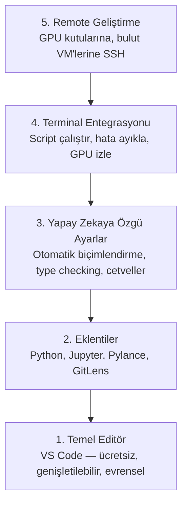

# Editör Kurulumu

> Editörün senin yardımcı pilotun. Bir kere yapılandır ki yolundan çekilsin ve yükünü çekmeye başlasın.

**Tür:** Yapım
**Diller:** --
**Ön koşullar:** Faz 0, Ders 01
**Süre:** ~20 dakika

## Öğrenme Hedefleri

- VS Code'u Python, Jupyter, linting ve remote SSH için temel eklentilerle kur
- Yapay zeka iş akışları için kaydetmede biçimlendirme, type checking ve notebook çıktı scroll'unu yapılandır
- Uzak GPU makinelerinde sanki yerelmiş gibi kod düzenlemek ve hata ayıklamak için Remote SSH kur
- Editör alternatiflerini (Cursor, Windsurf, Neovim) ve yapay zeka işi için trade-off'larını değerlendir

## Sorun

Editörün içinde Python yazarak, notebook çalıştırarak, eğitim döngülerinde hata ayıklayarak ve GPU kutularına SSH bağlanarak binlerce saat harcayacaksın. Yanlış yapılandırılmış bir editör her oturumu sürtünmeye çevirir: otomatik tamamlama yok, type hint yok, inline hata yok, manuel biçimlendirme ve hantal bir terminal iş akışı.

Doğru kurulum 20 dakika alır. Atlamak sana her gün 20 dakikaya mal olur.

## Kavram

Bir yapay zeka mühendisliği editör kurulumunun beş şeye ihtiyacı var:



## İnşa Et

### Adım 1: VS Code'u kur

VS Code önerilen editör. Ücretsiz, her OS'te çalışır, birinci sınıf Jupyter notebook desteği var ve eklenti ekosistemi yapay zeka işi için ihtiyacın olan her şeyi kapsar.

[code.visualstudio.com](https://code.visualstudio.com/) adresinden indir.

Terminal'den doğrula:

```bash
code --version
```

macOS'te `code` bulunamıyorsa VS Code'u aç, `Cmd+Shift+P` bas, "Shell Command" yaz ve "Install 'code' command in PATH" seç.

### Adım 2: Temel eklentileri kur

VS Code'da entegre terminal'i aç (`Ctrl+`` ` veya `` Cmd+` ``) ve yapay zeka işi için önemli eklentileri kur:

```bash
code --install-extension ms-python.python
code --install-extension ms-python.vscode-pylance
code --install-extension ms-toolsai.jupyter
code --install-extension eamodio.gitlens
code --install-extension ms-vscode-remote.remote-ssh
code --install-extension ms-python.debugpy
code --install-extension ms-python.black-formatter
code --install-extension charliermarsh.ruff
```

Her birinin işlevi:

| Eklenti | Niye |
|-----------|-----|
| Python | Dil desteği, sanal env algılama, çalıştır/hata ayıkla |
| Pylance | Hızlı type checking, otomatik tamamlama, import çözümleme |
| Jupyter | VS Code içinde notebook çalıştır, değişken explorer |
| GitLens | Kim neyi değiştirdi gör, inline git blame |
| Remote SSH | Uzak GPU kutusunda bir klasörü sanki yerelmiş gibi aç |
| Debugpy | Python için adım adım hata ayıklama |
| Black Formatter | Kaydetmede otomatik biçimlendir, tutarlı stil |
| Ruff | Hızlı linting, yaygın hataları yakalar |

Bu derste `code/.vscode/extensions.json` dosyası tam öneri listesini içerir. Proje klasörünü açtığında VS Code seni bunları kurmaya yönlendirir.

### Adım 3: Ayarları yapılandır

Bu dersteki `code/.vscode/settings.json` içindeki ayarları kopyala, ya da `Settings > Open Settings (JSON)` üzerinden manuel uygula.

Yapay zeka işi için anahtar ayarlar:

```jsonc
{
    "python.analysis.typeCheckingMode": "basic",
    "editor.formatOnSave": true,
    "editor.rulers": [88, 120],
    "notebook.output.scrolling": true,
    "files.autoSave": "afterDelay"
}
```

Bunlar neden önemli:

- **Type checking basic**: Çalıştırmadan önce yanlış argüman tiplerini yakalar. Tensor şekil uyumsuzlukları ve yanlış API parametrelerinde hata ayıklama süresini kurtarır.
- **Kaydetmede biçimlendir**: Bir daha biçimlendirmeyi düşünme. Black halleder.
- **88 ve 120'de cetveller**: Black 88'de kırar. 120 işareti docstring ve yorumların çok uzadığını gösterir.
- **Notebook çıktı scroll**: Eğitim döngüleri binlerce satır basar. Scroll olmadan çıktı paneli patlar.
- **Otomatik kaydet**: Kaydetmeyi unutacaksın. Eğitim script'in bayat kodu çalıştıracak. Otomatik kaydet bunu önler.

### Adım 4: Terminal entegrasyonu

VS Code'un entegre terminali eğitim script'lerini çalıştırdığın, GPU izlediğin ve ortamları yönettiğin yer.

Düzgün kur:

```jsonc
{
    "terminal.integrated.defaultProfile.osx": "zsh",
    "terminal.integrated.defaultProfile.linux": "bash",
    "terminal.integrated.fontSize": 13,
    "terminal.integrated.scrollback": 10000
}
```

Yararlı kısayollar:

| Eylem | macOS | Linux/Windows |
|--------|-------|---------------|
| Terminal aç/kapa | `` Ctrl+` `` | `` Ctrl+` `` |
| Yeni terminal | `Ctrl+Shift+`` ` | `Ctrl+Shift+`` ` |
| Terminal'i böl | `Cmd+\` | `Ctrl+\` |

Bölünmüş terminaller yararlı: biri script'ini çalıştırmak için, diğeri `nvidia-smi -l 1` veya `watch -n 1 nvidia-smi` ile GPU izlemek için.

### Adım 5: Remote Geliştirme (GPU Kutularına SSH)

Yapay zeka işi için en önemli eklenti bu. Eğitimi uzak makinelerde (bulut VM'leri, lab sunucuları, Lambda, Vast.ai) çalıştıracaksın. Remote SSH uzak dosya sistemini açmana, dosyaları düzenlemene, terminaller çalıştırmana ve sanki her şey yerelmiş gibi hata ayıklamana izin verir.

Kurulum:

1. Remote SSH eklentisini kur (Adım 2'de yapıldı).
2. `Ctrl+Shift+P` (ya da `Cmd+Shift+P`) bas, "Remote-SSH: Connect to Host" yaz.
3. `user@your-gpu-box-ip` gir.
4. VS Code uzak makineye sunucu bileşenini otomatik olarak kurar.

Parolasız erişim için SSH anahtarları kur:

```bash
ssh-keygen -t ed25519 -C "your-email@example.com"
ssh-copy-id user@your-gpu-box-ip
```

Kolaylık için host'u `~/.ssh/config`'e ekle:

```
Host gpu-box
    HostName 203.0.113.50
    User ubuntu
    IdentityFile ~/.ssh/id_ed25519
    ForwardAgent yes
```

Artık `Remote-SSH: Connect to Host > gpu-box` anında bağlanır.

## Alternatifler

### Cursor

[cursor.com](https://cursor.com) yerleşik yapay zeka kod üretimi olan bir VS Code fork'u. Aynı eklenti ekosistemini ve ayar formatını kullanır. Cursor kullanıyorsan bu dersteki her şey hâlâ geçerli. Aynı `settings.json` ve `extensions.json`'u import et.

### Windsurf

[windsurf.com](https://windsurf.com) başka bir yapay zeka-öncelikli VS Code fork'u. Aynı hikaye: aynı eklentiler, aynı ayar formatı, aynı Remote SSH desteği.

### Vim/Neovim

Zaten Vim veya Neovim kullanıyorsan ve onda üretkensen, orada kal. Yapay zeka Python işi için minimum kurulum:

- Type checking için **pyright** veya **pylsp** (Mason veya manuel kurulum aracılığıyla)
- Dil sunucusu entegrasyonu için **nvim-lspconfig**
- Notebook benzeri çalıştırma için **jupyter-vim** veya **molten-nvim**
- Dosya/sembol arama için **telescope.nvim**
- Biçimlendirme/linting için black ve ruff ile **none-ls.nvim**

Vim'i zaten kullanmıyorsan, şimdi başlama. Öğrenme eğrisi yapay zeka mühendisliği öğrenmekle rekabet eder. VS Code kullan.

## Kullan

Bu kurulumla günlük iş akışın şöyle:

1. Proje klasörünü VS Code'da aç (ya da bir GPU kutusuna Remote SSH ile bağlan).
2. Editörde otomatik tamamlama, type hint ve inline hata ile Python yaz.
3. Jupyter eklentisiyle Jupyter notebook'ları inline çalıştır.
4. Eğitim script'leri, `uv pip install` ve GPU izleme için entegre terminal'i kullan.
5. Commit etmeden önce GitLens ile değişiklikleri gözden geçir.

## Alıştırmalar

1. VS Code'u ve Adım 2'de listelenen tüm eklentileri kur
2. Bu dersteki `settings.json`'u VS Code yapılandırmana kopyala
3. Bir Python dosyası aç ve Pylance'in type hint gösterdiğini ve Black'in kaydetmede biçimlendirdiğini doğrula
4. Uzak bir makineye erişimin varsa, Remote SSH kur ve üzerinde bir klasör aç

## Anahtar Terimler

| Terim | İnsanlar ne diyor | Gerçekte ne anlama geliyor |
|------|----------------|----------------------|
| LSP | "Otomatik tamamlama motoru" | Language Server Protocol: editörlerin dile özgü bir sunucudan type bilgisi, tamamlama ve teşhis almasının standartı |
| Pylance | "Python eklentisi" | Microsoft'un type checking ve IntelliSense için Pyright kullanan Python dil sunucusu |
| Remote SSH | "Sunucuda çalışmak" | Uzak makinede hafif bir sunucu çalıştıran ve UI'ı yerel editörüne stream eden VS Code eklentisi |
| Kaydetmede biçimlendir | "Otomatik prettier" | Editör her kaydettiğinde bir biçimlendirici (Black, Ruff) çalıştırır, böylece kod stili her zaman tutarlıdır |
