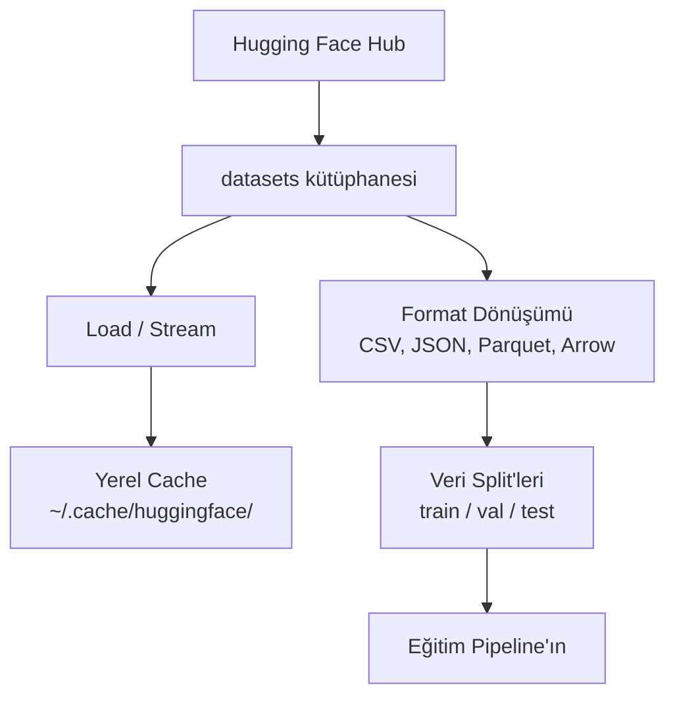

# Veri Yönetimi

> Veri yakıttır. Onu nasıl yönettiğin ne kadar hızlı gittiğini belirler.

**Tür:** Yapım
**Diller:** Python
**Ön koşullar:** Faz 0, Ders 01
**Süre:** ~45 dakika

## Öğrenme Hedefleri

- Hugging Face `datasets` kütüphanesini kullanarak veri setlerini yükle, stream et ve cache'le
- CSV, JSON, Parquet ve Arrow formatları arasında dönüştür ve trade-off'larını açıkla
- Sabit rastgele tohumlarla tekrarlanabilir train/validation/test split'leri oluştur
- `.gitignore`, Git LFS veya DVC kullanarak büyük model ve veri seti dosyalarını yönet

## Sorun

Her yapay zeka projesi veriyle başlar. Veri seti bulmak, indirmek, formatlar arasında dönüştürmek, eğitim ve değerlendirme için bölmek ve deneyler tekrarlanabilir olsun diye sürümlemek lazım. Bunu her seferinde manuel yapmak yavaş ve hataya açıktır. Tekrar edilebilir bir iş akışına ihtiyacın var.

## Kavram



Hugging Face `datasets` kütüphanesi yapay zeka işi için veri yüklemenin standart yolu. İndirme, cache'leme, format dönüştürme ve streaming'i kutudan çıkar çıkmaz halleder.

## İnşa Et

### Adım 1: datasets kütüphanesini kur

```bash
pip install datasets huggingface_hub
```

### Adım 2: Bir veri seti yükle

```python
from datasets import load_dataset

dataset = load_dataset("imdb")
print(dataset)
print(dataset["train"][0])
```

Bu IMDB film yorumu veri setini indirir. İlk indirmeden sonra `~/.cache/huggingface/datasets/` cache'inden yükler.

### Adım 3: Büyük veri setlerini stream et

Bazı veri setleri diske sığmayacak kadar büyük. Streaming, tam dosyayı indirmeden satır satır yükler.

```python
dataset = load_dataset("wikimedia/wikipedia", "20220301.en", split="train", streaming=True)

for i, example in enumerate(dataset):
    print(example["title"])
    if i >= 4:
        break
```

Streaming sana bir `IterableDataset` verir. Satırları geldikçe işlersin. Bellek kullanımı veri seti boyutundan bağımsız olarak sabit kalır.

### Adım 4: Veri seti formatları

`datasets` kütüphanesi perde arkasında Apache Arrow kullanır. Pipeline'ının ne istediğine göre başka formatlara dönüştürebilirsin.

```python
dataset = load_dataset("imdb", split="train")

dataset.to_csv("imdb_train.csv")
dataset.to_json("imdb_train.json")
dataset.to_parquet("imdb_train.parquet")
```

Format karşılaştırması:

| Format | Boyut | Okuma Hızı | En İyi |
|--------|------|-----------|----------|
| CSV | Büyük | Yavaş | İnsan okunabilirliği, hesap tabloları |
| JSON | Büyük | Yavaş | API'lar, iç içe veri |
| Parquet | Küçük | Hızlı | Analytics, columnar sorgular |
| Arrow | Küçük | En Hızlı | Bellek-içi işleme (`datasets`'in dahili kullandığı) |

Yapay zeka işi için Parquet en iyi depolama formatı. Bellekte Arrow ile çalışırsın. CSV ve JSON değiş tokuş içindir.

### Adım 5: Veri split'leri

Her ML projesi üç split'e ihtiyaç duyar:

- **Train**: Model bundan öğrenir (tipik olarak %80)
- **Validation**: Eğitim sırasında ilerlemeyi kontrol edersin (tipik olarak %10)
- **Test**: Eğitim bittikten sonra son değerlendirme (tipik olarak %10)

Bazı veri setleri önceden split'li gelir. Gelmediğinde kendin böl:

```python
dataset = load_dataset("imdb", split="train")

split = dataset.train_test_split(test_size=0.2, seed=42)
train_val = split["train"].train_test_split(test_size=0.125, seed=42)

train_ds = train_val["train"]
val_ds = train_val["test"]
test_ds = split["test"]

print(f"Train: {len(train_ds)}, Val: {len(val_ds)}, Test: {len(test_ds)}")
```

Tekrarlanabilirlik için her zaman seed ayarla. Aynı seed her seferinde aynı split'i üretir.

### Adım 6: Model indir ve cache'le

Modeller büyük dosyalardır. `huggingface_hub` kütüphanesi indirmeyi ve cache'lemeyi halleder.

```python
from huggingface_hub import hf_hub_download, snapshot_download

model_path = hf_hub_download(
    repo_id="sentence-transformers/all-MiniLM-L6-v2",
    filename="config.json"
)
print(f"Cached at: {model_path}")

model_dir = snapshot_download("sentence-transformers/all-MiniLM-L6-v2")
print(f"Full model at: {model_dir}")
```

Modeller `~/.cache/huggingface/hub/` adresine cache'lenir. Bir kere indirildi mi, sonraki çalıştırmalarda anında yüklenir.

### Adım 7: Büyük dosyaları yönet

Model ağırlıkları ve büyük veri setleri git'e gitmemeli. Üç seçenek:

**Seçenek A: .gitignore (en basit)**

```
*.bin
*.safetensors
*.pt
*.onnx
data/*.parquet
data/*.csv
models/
```

**Seçenek B: Git LFS (git'te büyük dosyaları takip et)**

```bash
git lfs install
git lfs track "*.bin"
git lfs track "*.safetensors"
git add .gitattributes
```

Git LFS repo'da pointer'lar saklar ve gerçek dosyaları ayrı bir sunucuda. GitHub sana 1 GB ücretsiz verir.

**Seçenek C: DVC (data version control)**

```bash
pip install dvc
dvc init
dvc add data/training_set.parquet
git add data/training_set.parquet.dvc data/.gitignore
git commit -m "Track training data with DVC"
```

DVC verine işaret eden küçük `.dvc` dosyaları oluşturur. Veri kendisi S3, GCS veya başka bir uzak depolama backend'inde yaşar.

| Yaklaşım | Karmaşıklık | En İyi |
|----------|-----------|----------|
| .gitignore | Düşük | Kişisel projeler, tekrar indirebileceğin veri |
| Git LFS | Orta | Model ağırlıklarını git üzerinden paylaşan takımlar |
| DVC | Yüksek | Tekrarlanabilir deneyler, büyük veri setleri, takımlar |

Bu kurs için `.gitignore` yeterli. Makineler arası tam deneyleri tekrarlamak gerektiğinde DVC kullan.

### Adım 8: Depolama kalıpları

**Yerel depolama** ~10 GB altındaki veri setleri için işe yarar. HF cache bunu otomatik halleder.

**Bulut depolama** daha büyük olan ya da makineler arası paylaşılan her şey için:

```python
import os

local_path = os.path.expanduser("~/.cache/huggingface/datasets/")

# s3_path = "s3://my-bucket/datasets/"
# gcs_path = "gs://my-bucket/datasets/"
```

DVC S3 ve GCS ile doğrudan entegre olur:

```bash
dvc remote add -d myremote s3://my-bucket/dvc-store
dvc push
```

Bu kurs için yerel depolama yeterli. Bulut depolama uzak GPU instance'larında fine-tune ettiğinde alakalı hale gelir.

## Bu Kursta Kullanılan Veri Setleri

| Veri Seti | Dersler | Boyut | Ne Öğretiyor |
|---------|---------|------|----------------|
| IMDB | Tokenization, sınıflandırma | 84 MB | Metin sınıflandırma temelleri |
| WikiText | Dil modelleme | 181 MB | Sonraki-token tahmini |
| SQuAD | QA sistemleri | 35 MB | Soru cevaplama, span'lar |
| Common Crawl (alt küme) | Embedding'ler | Değişken | Büyük ölçekli metin işleme |
| MNIST | Görü temelleri | 21 MB | Görsel sınıflandırma temelleri |
| COCO (alt küme) | Multimodal | Değişken | Görsel-metin çiftleri |

Şu an bunların hepsini indirmen gerekmiyor. Her ders neye ihtiyacı olduğunu belirtir.

## Kullan

Her şeyin çalıştığını doğrulamak için utility script'ini çalıştır:

```bash
python code/data_utils.py
```

Bu küçük bir veri seti indirir, dönüştürür, böler ve özet basar.

## Yayınla

Bu ders şunu üretir:
- `code/data_utils.py` - yeniden kullanılabilir veri yükleme ve cache'leme utility'si
- `outputs/prompt-data-helper.md` - bir görev için doğru veri setini bulma prompt'u

## Alıştırmalar

1. `glue` veri setini `mrpc` config'i ile yükle ve ilk 5 örneği incele
2. `c4` veri setini stream et ve 10 saniyede kaç örnek işleyebildiğini say
3. Bir veri setini Parquet'a dönüştür ve dosya boyutunu CSV ile karşılaştır
4. Sabit bir seed ile 70/15/15 train/val/test split'i oluştur ve boyutları doğrula

## Anahtar Terimler

| Terim | İnsanlar ne diyor | Gerçekte ne anlama geliyor |
|------|----------------|----------------------|
| Veri seti split'i | "Eğitim verisi" | ML yaşam döngüsünün farklı aşamalarında kullanılan isimlendirilmiş bir alt küme (train/val/test) |
| Streaming | "Lazy yükle" | Tam veri setini indirmeden, uzak bir kaynaktan satır satır veri işleme |
| Parquet | "Sıkıştırılmış CSV" | Analitik sorgular ve depolama verimliliği için optimize edilmiş bir columnar dosya formatı |
| Arrow | "Hızlı dataframe" | datasets kütüphanesinin sıfır-kopya okumalar için dahili olarak kullandığı bellek-içi columnar format |
| Git LFS | "Büyük dosyalar için Git" | Pointer'ları versiyon kontrolde tutarken büyük dosyaları git repo'su dışında saklayan bir uzantı |
| DVC | "Veri için Git" | Veri setleri ve modeller için bulut depolamayla entegre olan bir versiyon kontrol sistemi |
| Cache | "Zaten indirildi" | Önceden çekilmiş verinin yerel kopyası, varsayılan olarak ~/.cache/huggingface/ adresinde saklanır |
