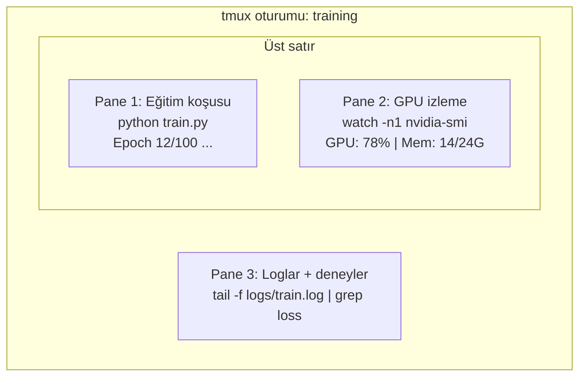

# Terminal & Shell

> Terminal yapay zeka mühendislerinin yaşadığı yerdir. Burada rahat ol.

**Tür:** Öğrenim
**Diller:** --
**Ön koşullar:** Faz 0, Ders 01
**Süre:** ~35 dakika

## Öğrenme Hedefleri

- Komut satırından eğitim loglarını filtrelemek ve işlemek için piping, redirect ve `grep` kullan
- Eşzamanlı eğitim ve GPU izleme için birden fazla pane'i olan kalıcı tmux oturumları oluştur
- Sistem ve GPU kaynaklarını `htop`, `nvtop` ve `nvidia-smi` ile izle
- SSH, `scp` ve `rsync` kullanarak yerel ve uzak makineler arasında dosya transferi yap

## Sorun

Terminalde herhangi bir editörden daha fazla zaman geçireceksin. Eğitim koşuları, GPU izleme, log takibi, uzak SSH oturumları, ortam yönetimi. Her yapay zeka iş akışı shell'e dokunur. Burada yavaşsan her yerde yavaşsın.

Bu ders yapay zeka işi için önemli olan terminal becerilerini kapsar. Unix tarihi yok. Bash scripting'e derin dalış yok. Sadece ihtiyacın olan.

## Kavram



Üç şey aynı anda çalışıyor. Tek terminal. Detach edebilirsin, eve gidebilirsin, SSH'la geri dönüp reattach edebilirsin. Eğitim çalışmaya devam eder.

## İnşa Et

### Adım 1: Shell'ini tanı

Hangi shell'i kullandığını kontrol et:

```bash
echo $SHELL
```

Çoğu sistem `bash` veya `zsh` kullanır. İkisi de gayet iyi. Bu kurstaki komutlar her ikisinde de çalışır.

Bilinmesi gereken anahtar şeyler:

```bash
# Gezin
cd ~/projects/ai-engineering-from-scratch
pwd
ls -la

# Geçmişte arama (öğreneceğin en yararlı kısayol)
# Ctrl+R sonra önceki bir komutun parçasını yaz
# Eşleşmeler arasında dolaşmak için tekrar Ctrl+R'a bas

# Terminal'i temizle
clear   # ya da Ctrl+L

# Çalışan bir komutu iptal et
# Ctrl+C

# Çalışan bir komutu askıya al (fg ile devam ettir)
# Ctrl+Z
```

### Adım 2: Piping ve redirect'ler

Piping komutları birbirine bağlar. Logları işleme, çıktı filtreleme ve araçları zincirleme bu şekilde yapılır. Bunu sürekli kullanacaksın.

```bash
# Bir logda "loss" kaç kez geçtiğini say
cat train.log | grep "loss" | wc -l

# Eğitim çıktısından sadece loss değerlerini çıkar
grep "loss:" train.log | awk '{print $NF}' > losses.txt

# Bir log dosyasını gerçek zamanlı güncellemeyle izle, hataları filtrele
tail -f train.log | grep --line-buffered "ERROR"

# Deneyleri son doğruluğa göre sırala
grep "final_accuracy" results/*.log | sort -t= -k2 -n -r

# stdout ve stderr'i ayrı dosyalara yönlendir
python train.py > output.log 2> errors.log

# İkisini de aynı dosyaya yönlendir
python train.py > train_full.log 2>&1
```

İhtiyacın olan üç redirect:

| Sembol | Ne yapar |
|--------|-------------|
| `>` | stdout'u dosyaya yaz (üzerine yaz) |
| `>>` | stdout'u dosyaya ekle |
| `2>` | stderr'i dosyaya yaz |
| `2>&1` | stderr'i stdout ile aynı yere gönder |
| `\|` | Bir komutun stdout'unu sonrakine stdin olarak gönder |

### Adım 3: Arka plan süreçleri

Eğitim koşuları saatler sürer. Terminali tüm bu süre boyunca açık tutmak istemezsin.

```bash
# Arka planda çalıştır (çıktı yine terminale gider)
python train.py &

# Arka planda çalıştır, hangup'a karşı bağışık (terminal kapanması öldürmez)
nohup python train.py > train.log 2>&1 &

# Arka planda ne çalışıyor kontrol et
jobs
ps aux | grep train.py

# Arka plan iş'i ön plana getir
fg %1

# Bir arka plan sürecini öldür
kill %1
# ya da PID'i bul ve onu öldür
kill $(pgrep -f "train.py")
```

`&`, `nohup` ve `screen`/`tmux` arasındaki fark:

| Yöntem | Terminal kapanmasından kurtulur mu? | Yeniden bağlanılabilir mi? |
|--------|-------------------------|---------------|
| `command &` | Hayır | Hayır |
| `nohup command &` | Evet | Hayır (log dosyasını kontrol et) |
| `screen` / `tmux` | Evet | Evet |

Birkaç dakikadan uzun her şey için tmux kullan.

### Adım 4: tmux

tmux çoklu pane'li kalıcı terminal oturumları oluşturmana izin verir. Eğitim koşularını yönetmek için en yararlı tek araç.

```bash
# Kur
# macOS
brew install tmux
# Ubuntu
sudo apt install tmux

# İsimlendirilmiş bir oturum başlat
tmux new -s training

# Yatay böl
# Ctrl+B sonra "

# Dikey böl
# Ctrl+B sonra %

# Pane'ler arasında gezin
# Ctrl+B sonra ok tuşları

# Detach et (oturum çalışmaya devam eder)
# Ctrl+B sonra d

# Tekrar bağlan
tmux attach -t training

# Oturumları listele
tmux ls

# Oturumu öldür
tmux kill-session -t training
```

Tipik bir yapay zeka iş akışı oturumu:

```bash
tmux new -s train

# Pane 1: eğitimi başlat
python train.py --epochs 100 --lr 1e-4

# Ctrl+B, " ile böl, sonra GPU monitör çalıştır
watch -n1 nvidia-smi

# Ctrl+B, % ile dikey böl, logları tail et
tail -f logs/experiment.log

# Şimdi Ctrl+B, d ile detach et
# SSH'tan çık, kahve al, geri dön
# tmux attach -t train
```

### Adım 5: htop ve nvtop ile izleme

```bash
# Sistem süreçleri (top'tan daha iyi)
htop

# GPU süreçleri (NVIDIA GPU'n varsa)
# Kur: sudo apt install nvtop (Ubuntu) ya da brew install nvtop (macOS)
nvtop

# nvtop olmadan hızlı GPU kontrolü
nvidia-smi

# GPU kullanımını her saniye güncelle
watch -n1 nvidia-smi

# Hangi süreçler GPU'yu kullanıyor gör
nvidia-smi --query-compute-apps=pid,name,used_memory --format=csv
```

Kullanacağın `htop` tuş kombinasyonları:
- Sütuna göre sıralamak için `F6` veya `>` (bellek sızıntılarını bulmak için belleğe göre sırala)
- Tree view'i aç/kapa için `F5` (alt süreçleri gör)
- Bir süreci öldür için `F9`
- Süreç adı aramak için `/`

### Adım 6: Uzak GPU kutuları için SSH

Bulut GPU (Lambda, RunPod, Vast.ai) kiraladığında SSH ile bağlanırsın.

```bash
# Basit bağlantı
ssh user@gpu-box-ip

# Belirli bir anahtarla
ssh -i ~/.ssh/my_gpu_key user@gpu-box-ip

# Uzakta dosya kopyala
scp model.pt user@gpu-box-ip:~/models/

# Uzaktan dosya kopyala
scp user@gpu-box-ip:~/results/metrics.json ./

# Tüm dizini senkronize et (çok sayıda dosya için daha hızlı)
rsync -avz ./data/ user@gpu-box-ip:~/data/

# Port forward (uzak Jupyter/TensorBoard'a yerelden eriş)
ssh -L 8888:localhost:8888 user@gpu-box-ip
# Şimdi tarayıcıda localhost:8888'i aç

# Kolaylık için SSH config
# ~/.ssh/config'e ekle:
# Host gpu
#     HostName 192.168.1.100
#     User ubuntu
#     IdentityFile ~/.ssh/gpu_key
#
# Sonra sadece:
# ssh gpu
```

### Adım 7: Yapay zeka işi için yararlı alias'lar

Bunları `~/.bashrc` veya `~/.zshrc`'ne ekle:

```bash
source phases/00-setup-and-tooling/10-terminal-and-shell/code/shell_aliases.sh
```

Ya da istediklerini kopyala. Anahtar alias'lar:

```bash
# Bir bakışta GPU durumu
alias gpu='nvidia-smi --query-gpu=index,name,utilization.gpu,memory.used,memory.total,temperature.gpu --format=csv,noheader'

# Tüm Python eğitim süreçlerini öldür
alias killtraining='pkill -f "python.*train"'

# Hızlı sanal ortam aktivasyonu
alias ae='source .venv/bin/activate'

# Eğitim loss'unu izle
alias watchloss='tail -f logs/*.log | grep --line-buffered "loss"'
```

Tam set için `code/shell_aliases.sh`'a bak.

### Adım 8: Yaygın yapay zeka terminal kalıpları

Bunlar pratikte sürekli karşına çıkar:

```bash
# Eğitimi çalıştır, her şeyi logla, bittiğinde bildir
python train.py 2>&1 | tee train.log; echo "DONE" | mail -s "Training complete" you@email.com

# İki deney logunu yan yana karşılaştır
diff <(grep "accuracy" exp1.log) <(grep "accuracy" exp2.log)

# En büyük model dosyalarını bul (disk alanı temizliği)
find . -name "*.pt" -o -name "*.safetensors" | xargs du -h | sort -rh | head -20

# Hugging Face'den model indir
wget https://huggingface.co/model/resolve/main/model.safetensors

# Bir veri setini untar et
tar xzf dataset.tar.gz -C ./data/

# Tüm Python dosyalarındaki satırları say (projenin ne kadar büyük olduğunu gör)
find . -name "*.py" | xargs wc -l | tail -1

# Disk alanını kontrol et (eğitim verisi diskleri hızlı doldurur)
df -h
du -sh ./data/*

# Eğitimden önce ortam değişkeni kontrolü
env | grep -i cuda
env | grep -i torch
```

## Kullan

Bu kurs sırasında her aracın ne zaman devreye gireceği:

| Araç | Ne zaman kullanırsın |
|------|----------------|
| tmux | Her eğitim koşusu (Faz 3+) |
| `tail -f` + `grep` | Eğitim loglarını izleme |
| `nohup` / `&` | Hızlı arka plan görevleri |
| `htop` / `nvtop` | Yavaş eğitim, OOM hataları için hata ayıklama |
| SSH + `rsync` | Bulut GPU'larında çalışmak |
| Piping + redirect'ler | Deney sonuçlarını işleme |
| Alias'lar | Tekrarlayan komutlarda zaman kazanmak |

## Alıştırmalar

1. tmux kur, üç pane'li bir oturum oluştur ve birinde `htop`, diğerinde `watch -n1 date`, üçüncüsünde bir Python script çalıştır. Detach et ve tekrar bağlan.
2. `code/shell_aliases.sh` içindeki alias'ları shell yapılandırmana ekle ve `source ~/.zshrc` (ya da `~/.bashrc`) ile yeniden yükle.
3. `for i in $(seq 1 100); do echo "epoch $i loss: $(echo "scale=4; 1/$i" | bc)"; sleep 0.1; done > fake_train.log` ile sahte bir eğitim logu oluştur, sonra sadece loss değerlerini çıkarmak için `grep`, `tail` ve `awk` kullan.
4. Erişimin olan bir sunucu için bir SSH config girdisi kur (ya da syntax'i pratiğe dökmek için `localhost` kullan).

## Anahtar Terimler

| Terim | İnsanlar ne diyor | Gerçekte ne anlama geliyor |
|------|----------------|----------------------|
| Shell | "Terminal" | Komutlarını yorumlayan program (bash, zsh, fish) |
| tmux | "Terminal multiplexer" | Tek pencerede birden fazla terminal oturumu çalıştırmana ve detach/reattach yapmana izin veren program |
| Pipe | "Çubuk olan şey" | Bir komutun çıktısını başkasına input olarak gönderen `\|` operatörü |
| PID | "Process ID" | Her çalışan sürece atanan benzersiz numara, izlemek veya öldürmek için kullanılır |
| nohup | "No hangup" | Hangup sinyaline karşı bağışık bir komut çalıştırır, terminal kapanması onu öldürmez |
| SSH | "Sunucuya bağlanmak" | Secure Shell, uzak makinede komut çalıştırmak için şifreli bir protokol |
