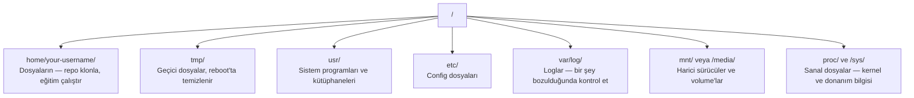

# Yapay Zeka için Linux

> Yapay zekanın çoğu Linux'ta çalışır. Takılıp kalmayacak kadar bilmen lazım.

**Tür:** Öğrenim
**Diller:** --
**Ön koşullar:** Faz 0, Ders 01
**Süre:** ~30 dakika

## Öğrenme Hedefleri

- Linux dosya sisteminde gezin ve temel dosya operasyonlarını komut satırından yap
- "Permission denied" hatalarını çözmek için `chmod` ve `chown` ile dosya izinlerini yönet
- `apt` ile sistem paketleri kur ve yapay zeka işi için yeni bir GPU kutusunu hazırla
- Uzak makinelerde çalışan geliştiricileri sık sık takan macOS-Linux farklarını tanımla

## Sorun

macOS veya Windows'ta geliştirme yapıyorsun. Ama bir bulut GPU kutusuna SSH'ladığın, bir Lambda instance kiraladığın ya da bir EC2 makinesi başlattığın an, Ubuntu'ya iniyorsun. Tek arayüzün terminal. Finder yok, Explorer yok, GUI yok. Dosya sisteminde gezinemezsen, paket kuramazsan ve komut satırından süreç yönetemezsen, "Linux'ta nasıl unzip yapılır" diye Google'larken boşa duran GPU saatlerinin parasını ödemeye takılırsın.

Bu bir hayatta kalma rehberi. Yapay zeka işi için uzak bir Linux makinesinde operasyon yapmak için tam ihtiyacın olanı kapsar. Fazlasını değil.

## Dosya Sistemi Yerleşimi

Linux her şeyi tek bir kök `/` altında organize eder. `C:\` veya `/Volumes` yok. Gerçekten dokunacağın dizinler:



Home dizinin `~` veya `/home/your-username`. Yaptığın hemen her şey burada olur.

## Temel Komutlar

Bir uzak GPU kutusunda yapacaklarının %95'ini kapsayan 15 komut bunlar.

### Gezinme

```bash
pwd                         # Neredeyim?
ls                          # Burada ne var?
ls -la                      # Burada ne var, gizli dosyalar dahil detaylarla?
cd /path/to/dir             # Oraya git
cd ~                        # Home'a git
cd ..                       # Bir üst seviyeye git
```

### Dosyalar ve Dizinler

```bash
mkdir my-project            # Dizin oluştur
mkdir -p a/b/c              # Tek seferde iç içe dizinler oluştur

cp file.txt backup.txt      # Bir dosyayı kopyala
cp -r src/ src-backup/      # Bir dizini kopyala (recursive)

mv old.txt new.txt          # Bir dosyayı yeniden adlandır
mv file.txt /tmp/           # Bir dosyayı taşı

rm file.txt                 # Bir dosyayı sil (çöp kutusu yok, gitti)
rm -rf my-dir/              # Bir dizini ve içindeki her şeyi sil
```

`rm -rf` kalıcıdır. Geri alma yok. Enter'a basmadan önce yolu iki kez kontrol et.

### Dosya Okuma

```bash
cat file.txt                # Tüm dosyayı bastır
head -20 file.txt           # İlk 20 satır
tail -20 file.txt           # Son 20 satır
tail -f log.txt             # Bir log dosyasını gerçek zamanlı izle (durdurmak için Ctrl+C)
less file.txt               # Bir dosyada scroll et (çıkmak için q)
```

### Arama

```bash
grep "error" training.log           # "error" içeren satırları bul
grep -r "learning_rate" .           # Mevcut dizindeki tüm dosyaları ara
grep -i "cuda" config.yaml          # Büyük/küçük harfe duyarsız arama

find . -name "*.py"                 # Mevcut dizin altında tüm Python dosyalarını bul
find . -name "*.ckpt" -size +1G     # 1GB'tan büyük checkpoint dosyalarını bul
```

## İzinler

Linux'ta her dosyanın bir sahibi ve izin bit'leri var. Script'ler çalışmadığında veya bir dizine yazamadığında bununla karşılaşacaksın.

```bash
ls -l train.py
# -rwxr-xr-- 1 user group 2048 Mar 19 10:00 train.py
#  ^^^             sahip izinleri: oku, yaz, çalıştır
#     ^^^          grup izinleri: oku, çalıştır
#        ^^        diğerleri: sadece oku
```

Yaygın çözümler:

```bash
chmod +x train.sh           # Bir script'i çalıştırılabilir yap
chmod 755 deploy.sh         # Sahip: tam, diğerleri: oku+çalıştır
chmod 644 config.yaml       # Sahip: oku+yaz, diğerleri: sadece oku

chown user:group file.txt   # Dosya sahibini değiştir (sudo gerekir)
```

"Permission denied" dediğinde, neredeyse her zaman bir izin sorunudur. Çoğu durumda `chmod +x` veya `sudo` çözer.

## Paket Yönetimi (apt)

Ubuntu `apt` kullanır. Sistem-düzeyi yazılım bu şekilde kurulur.

```bash
sudo apt update             # Paket listesini yenile (her zaman önce bunu yap)
sudo apt install -y htop    # Bir paket kur (-y onayı atlar)
sudo apt install -y build-essential  # C derleyici, make vs. Çoğu Python paketi tarafından gerekli
sudo apt install -y tmux    # Terminal multiplexer (bağlantı koptuktan sonra oturumları canlı tut)

apt list --installed        # Ne kurulu?
sudo apt remove htop        # Kaldır
```

Yeni bir GPU kutusunda kuracağın yaygın paketler:

```bash
sudo apt update && sudo apt install -y \
    build-essential \
    git \
    curl \
    wget \
    tmux \
    htop \
    unzip \
    python3-venv
```

## Kullanıcılar ve sudo

Genellikle normal bir kullanıcı olarak giriş yapmışsındır. Bazı operasyonlar root (admin) erişimi gerektirir.

```bash
whoami                      # Hangi kullanıcıyım?
sudo command                # Tek komutu root olarak çalıştır
sudo su                     # Root ol (geri dönmek için exit, idareli kullan)
```

Bulut GPU instance'larında tipik olarak tek kullanıcısın ve sudo erişimin zaten var. Her şeyi root olarak çalıştırma. Sudo'yu sadece gerektiğinde kullan.

## Süreçler ve systemd

Eğitimin takıldığında veya neyin çalıştığını kontrol etmen gerektiğinde:

```bash
htop                        # Interaktif süreç görüntüleyici (çıkmak için q)
ps aux | grep python        # Çalışan Python süreçlerini bul
kill 12345                  # PID 12345 olan süreci nazikçe durdur
kill -9 12345               # Zorla öldür (nazik çalışmadığında kullan)
nvidia-smi                  # GPU süreçleri ve bellek kullanımı
```

systemd servisleri (arka plan daemon'larını) yönetir. Inference sunucuları çalıştırıyorsan kullanırsın:

```bash
sudo systemctl start nginx          # Bir servisi başlat
sudo systemctl stop nginx           # Durdur
sudo systemctl restart nginx        # Yeniden başlat
sudo systemctl status nginx         # Çalışıyor mu kontrol et
sudo systemctl enable nginx         # Boot'ta otomatik başlat
```

## Disk Alanı

GPU kutularının genelde sınırlı disk alanı var. Modeller ve veri setleri hızla doldurur.

```bash
df -h                       # Tüm mount edilmiş sürücüler için disk kullanımı
df -h /home                 # Özellikle /home için disk kullanımı

du -sh *                    # Mevcut dizindeki her öğenin boyutu
du -sh ~/.cache             # Cache'inin boyutu (pip, huggingface modelleri buraya iniyor)
du -sh /data/checkpoints/   # Checkpoint'lerinin ne kadar büyük olduğunu kontrol et

# En büyük alan tüketenleri bul
du -h --max-depth=1 / 2>/dev/null | sort -hr | head -20
```

Yaygın alan tasarrufları:

```bash
# pip cache'ini temizle
pip cache purge

# apt cache'ini temizle
sudo apt clean

# İhtiyacın olmayan eski checkpoint'leri sil
rm -rf checkpoints/epoch_01/ checkpoints/epoch_02/
```

## Ağ

Komut satırından modeller indireceksin, dosya transferi yapacaksın ve API'lara istek atacaksın.

```bash
# Dosya indir
wget https://example.com/model.bin                   # Bir dosya indir
curl -O https://example.com/data.tar.gz              # curl ile aynı şey
curl -s https://api.example.com/health | python3 -m json.tool  # Bir API'a istek at, JSON'u güzel-bastır

# Makineler arası dosya transferi
scp model.bin user@remote:/data/                     # Uzak makineye dosya kopyala
scp user@remote:/data/results.csv .                  # Uzaktan yerele dosya kopyala
scp -r user@remote:/data/checkpoints/ ./local-dir/   # Dizin kopyala

# Dizinleri senkronize et (büyük transferler için scp'den hızlı, hatada devam eder)
rsync -avz --progress ./data/ user@remote:/data/
rsync -avz --progress user@remote:/results/ ./results/
```

Büyük her şey için `scp` yerine `rsync` kullan. Sadece değişen byte'ları transfer eder ve kesintili bağlantıları halleder.

## tmux: Oturumları Canlı Tut

Bir uzak kutuya SSH'landığında, laptop'unu kapatmak eğitim koşunu öldürür. tmux bunu önler.

```bash
tmux new -s train           # "train" adlı yeni oturum başlat
# ... eğitimini başlat, sonra:
# Ctrl+B, sonra D            # Detach (eğitim çalışmaya devam eder)

tmux ls                     # Oturumları listele
tmux attach -t train        # Oturuma yeniden bağlan

# tmux içinde:
# Ctrl+B, sonra %            # Pane'i dikey böl
# Ctrl+B, sonra "            # Pane'i yatay böl
# Ctrl+B, sonra ok tuşları   # Pane'ler arasında geç
```

Uzun eğitim iş'lerini her zaman tmux içinde çalıştır. Her zaman.

## Windows Kullanıcıları için WSL2

Windows'taysan, WSL2 sana dual-boot yapmadan gerçek bir Linux ortamı verir.

```bash
# PowerShell'de (admin)
wsl --install -d Ubuntu-24.04

# Yeniden başlattıktan sonra Başlat menüsünden Ubuntu'yu aç
sudo apt update && sudo apt upgrade -y
```

WSL2 gerçek bir Linux kernel'i çalıştırır. Bu dersteki her şey içinde çalışır. WSL içinden Windows dosyaların `/mnt/c/Users/YourName/` adresinde.

GPU passthrough Windows tarafında kurulu NVIDIA driver'larıyla çalışır. Windows NVIDIA driver'ını kur (Linux olanı değil), CUDA WSL2 içinde erişilebilir olacak.

## Tuzaklar: macOS'ten Linux'a

macOS'tan geliyorsan seni takacak şeyler:

| macOS | Linux | Notlar |
|-------|-------|-------|
| `brew install` | `sudo apt install` | Bazen farklı paket isimleri. `brew install htop` vs `sudo apt install htop` aynı çalışır, ama `brew install readline` vs `sudo apt install libreadline-dev` çalışmaz. |
| `open file.txt` | `xdg-open file.txt` | Ama uzak kutuda GUI'n olmayacak. `cat` veya `less` kullan. |
| `pbcopy` / `pbpaste` | Mevcut değil | Clipboard'a pipe SSH üzerinde yok. |
| `~/.zshrc` | `~/.bashrc` | macOS varsayılan olarak zsh. Çoğu Linux sunucusu bash kullanır. |
| `/opt/homebrew/` | `/usr/bin/`, `/usr/local/bin/` | Binary'ler farklı yerlerde yaşar. |
| `sed -i '' 's/a/b/' file` | `sed -i 's/a/b/' file` | macOS sed `-i`'den sonra boş bir string ister. Linux istemez. |
| Büyük/küçük harf duyarsız dosya sistemi | Büyük/küçük harf duyarlı dosya sistemi | `Model.py` ve `model.py` Linux'ta iki farklı dosya. |
| Satır sonları `\n` | Satır sonları `\n` | Aynı. Ama Windows `\r\n` kullanır, bash script'lerini bozar. Düzeltmek için `dos2unix` çalıştır. |

## Hızlı Referans Kartı

```
Gezinme:        pwd, ls, cd, find
Dosyalar:       cp, mv, rm, mkdir, cat, head, tail, less
Arama:          grep, find
İzinler:        chmod, chown, sudo
Paketler:       apt update, apt install
Süreçler:       htop, ps, kill, nvidia-smi
Servisler:      systemctl start/stop/restart/status
Disk:           df -h, du -sh
Ağ:             curl, wget, scp, rsync
Oturumlar:      tmux new/attach/detach
```

## Alıştırmalar

1. Herhangi bir Linux makinesine SSH'la (ya da WSL2 aç) ve home dizinine git. Bir proje klasörü oluştur, içinde `touch` ile üç boş dosya yarat, sonra `ls -la` ile listele.
2. apt ile `htop` kur, çalıştır ve en çok belleği kullanan süreci tanımla.
3. Bir tmux oturumu başlat, içinde `sleep 300` çalıştır, detach et, oturumları listele ve yeniden bağlan.
4. Mevcut disk alanını kontrol etmek için `df -h` kullan, sonra cache'inde neyin alan kapladığını bulmak için `du -sh ~/.cache/*` kullan.
5. Yerel makinenden uzaktakine `scp` ile dosya transfer et, sonra aynı transferi `rsync` ile yap ve deneyimi karşılaştır.
