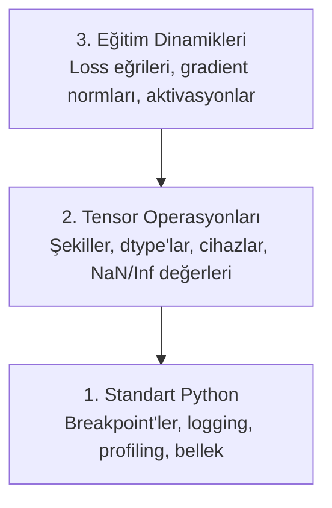

# Hata Ayıklama ve Profiling

> En kötü yapay zeka bug'ları çökmez. Sessizce çöp veriyle eğitir ve sana güzel bir loss eğrisi raporlar.

**Tür:** Yapım
**Diller:** Python
**Ön koşullar:** Ders 1 (Geliştirme Ortamı), temel PyTorch aşinalığı
**Süre:** ~60 dakika

## Öğrenme Hedefleri

- Eğitim sırasında tensor şekillerini, dtype'larını ve NaN değerlerini incelemek için koşullu `breakpoint()` ve `debug_print` kullan
- Darboğazları bulmak için eğitim döngülerini `cProfile`, `line_profiler` ve `tracemalloc` ile profil çıkar
- Yaygın yapay zeka bug'larını tespit et: şekil uyumsuzlukları, NaN loss, veri sızıntısı ve yanlış-cihaz tensor'ları
- Loss eğrilerini, ağırlık histogramlarını ve gradient dağılımlarını görselleştirmek için TensorBoard kur

## Sorun

Yapay zeka kodu normal koddan farklı şekilde başarısız olur. Bir web uygulaması bir stack trace ile çöker. Yanlış yapılandırılmış bir eğitim döngüsü 8 saat çalışır, $200 GPU zamanı yakar ve her girdinin ortalamasını tahmin eden bir model üretir. Kod hiç hata vermedi. Bug yanlış cihazdaki bir tensor, unutulmuş bir `.detach()` veya feature'lara sızan label'lardı.

Bu sessiz hataları zamanını ve compute'unu boşa harcamadan yakalayan hata ayıklama araçlarına ihtiyacın var.

## Kavram

Yapay zeka hata ayıklaması üç seviyede çalışır:



İnsanların çoğu doğrudan seviye 3'e atlar (TensorBoard'a bakmak). Ama yapay zeka bug'larının %80'i seviye 1 ve 2'de yaşar.

## İnşa Et

### Bölüm 1: Print Debug (Evet, İşe Yarar)

Print debug küçümseniyor. Küçümsenmemeli. Tensor kodu için, hedefli bir print ifadesi debugger'da adım atmaktan iyidir çünkü şekilleri, dtype'ları ve değer aralıklarını hepsini aynı anda görmen gerekir.

```python
def debug_print(name, tensor):
    print(f"{name}: shape={tensor.shape}, dtype={tensor.dtype}, "
          f"device={tensor.device}, "
          f"min={tensor.min().item():.4f}, max={tensor.max().item():.4f}, "
          f"mean={tensor.mean().item():.4f}, "
          f"has_nan={tensor.isnan().any().item()}")
```

Her şüpheli operasyondan sonra bunu çağır. Bug bulunduğunda print'leri kaldır. Basit.

### Bölüm 2: Python Debugger (pdb ve breakpoint)

Yerleşik debugger yapay zeka işi için hak ettiğinden az ilgi görür. Eğitim döngüne `breakpoint()` koy ve tensor'ları interaktif olarak incele.

```python
def training_step(model, batch, criterion, optimizer):
    inputs, labels = batch
    outputs = model(inputs)
    loss = criterion(outputs, labels)

    if loss.item() > 100 or torch.isnan(loss):
        breakpoint()

    loss.backward()
    optimizer.step()
```

Debugger seni içine attığında yararlı komutlar:

- Şekilleri kontrol etmek için `p outputs.shape`
- Loss değerini görmek için `p loss.item()`
- NaN'leri saymak için `p torch.isnan(outputs).sum()`
- Gradient'leri kontrol etmek için `p model.fc1.weight.grad`
- Devam etmek için `c`, çıkmak için `q`

Bu koşullu hata ayıklama. Sadece bir şey yanlış göründüğünde durursun. 10.000 adımlık bir eğitim koşusu için bu önemli.

### Bölüm 3: Python Logging

Hata ayıklaman hızlı bir kontrolün ötesine geçtiğinde print ifadelerini logging ile değiştir.

```python
import logging

logging.basicConfig(
    level=logging.INFO,
    format="%(asctime)s [%(levelname)s] %(message)s",
    handlers=[
        logging.FileHandler("training.log"),
        logging.StreamHandler()
    ]
)
logger = logging.getLogger(__name__)

logger.info("Starting training: lr=%.4f, batch_size=%d", lr, batch_size)
logger.warning("Loss spike detected: %.4f at step %d", loss.item(), step)
logger.error("NaN loss at step %d, stopping", step)
```

Logging sana zaman damgaları, ciddiyet seviyeleri ve dosya çıktısı verir. Bir eğitim koşusu gece 3'te başarısız olduğunda, ekrandan kaybolmuş terminal çıktısı değil bir log dosyası istersin.

### Bölüm 4: Kod Bölümlerini Zamanlama

Zamanın nereye gittiğini bilmek optimizasyona giden ilk adımdır.

```python
import time

class Timer:
    def __init__(self, name=""):
        self.name = name

    def __enter__(self):
        self.start = time.perf_counter()
        return self

    def __exit__(self, *args):
        elapsed = time.perf_counter() - self.start
        print(f"[{self.name}] {elapsed:.4f}s")

with Timer("data loading"):
    batch = next(dataloader_iter)

with Timer("forward pass"):
    outputs = model(batch)

with Timer("backward pass"):
    loss.backward()
```

Yaygın bulgu: veri yükleme eğitim zamanının %60'ını alır. Çözüm daha hızlı bir GPU değil, DataLoader'ında `num_workers > 0`.

### Bölüm 5: cProfile ve line_profiler

Manuel zamanlayıcılardan fazlasına ihtiyacın olduğunda:

```bash
python -m cProfile -s cumtime train.py
```

Bu kümülatif zamana göre sıralı her fonksiyon çağrısını gösterir. Satır satır profiling için:

```bash
pip install line_profiler
```

```python
@profile
def train_step(model, data, target):
    output = model(data)
    loss = F.cross_entropy(output, target)
    loss.backward()
    return loss

# Şununla çalıştır: kernprof -l -v train.py
```

### Bölüm 6: Bellek Profiling

#### tracemalloc ile CPU Belleği

```python
import tracemalloc

tracemalloc.start()

# kodun burada
model = build_model()
data = load_dataset()

snapshot = tracemalloc.take_snapshot()
top_stats = snapshot.statistics("lineno")
for stat in top_stats[:10]:
    print(stat)
```

#### memory_profiler ile CPU Belleği

```bash
pip install memory_profiler
```

```python
from memory_profiler import profile

@profile
def load_data():
    raw = read_csv("data.csv")       # belleğin burada zıpladığını izle
    processed = preprocess(raw)       # ve burada
    return processed
```

Satır satır bellek kullanımını görmek için `python -m memory_profiler your_script.py` ile çalıştır.

#### PyTorch ile GPU Belleği

```python
import torch

if torch.cuda.is_available():
    print(torch.cuda.memory_summary())

    print(f"Allocated: {torch.cuda.memory_allocated() / 1e9:.2f} GB")
    print(f"Cached: {torch.cuda.memory_reserved() / 1e9:.2f} GB")
```

OOM'a (Out of Memory) çarptığında:

1. Batch size'ı azalt (önce denenecek şey, her zaman)
2. Cache'lenmiş belleği serbest bırakmak için `torch.cuda.empty_cache()` kullan
3. Büyük ara değerler için `del tensor` ve ardından `torch.cuda.empty_cache()` kullan
4. Bellek kullanımını yarıya indirmek için mixed precision (`torch.cuda.amp`) kullan
5. Çok derin modeller için gradient checkpointing kullan

### Bölüm 7: Yaygın Yapay Zeka Bug'ları ve Nasıl Yakalanır

#### Şekil Uyumsuzluğu

En sık görülen bug. Bir tensor `[batch, features]` şeklinde, model ise `[batch, channels, height, width]` bekliyor.

```python
def check_shapes(model, sample_input):
    print(f"Input: {sample_input.shape}")
    hooks = []

    def make_hook(name):
        def hook(module, inp, out):
            in_shape = inp[0].shape if isinstance(inp, tuple) else inp.shape
            out_shape = out.shape if hasattr(out, "shape") else type(out)
            print(f"  {name}: {in_shape} -> {out_shape}")
        return hook

    for name, module in model.named_modules():
        hooks.append(module.register_forward_hook(make_hook(name)))

    with torch.no_grad():
        model(sample_input)

    for h in hooks:
        h.remove()
```

Bunu bir kere örnek bir batch ile çalıştır. Modelindeki her şekil dönüşümünü haritalandırır.

#### NaN Loss

NaN loss bir şeyin patladığı anlamına gelir. Yaygın sebepler:

- Öğrenme oranı çok yüksek
- Özel loss'ta sıfıra bölme
- Sıfırın veya negatif sayının logaritması
- RNN'lerde patlayan gradient'ler

```python
def detect_nan(model, loss, step):
    if torch.isnan(loss):
        print(f"NaN loss at step {step}")
        for name, param in model.named_parameters():
            if param.grad is not None:
                if torch.isnan(param.grad).any():
                    print(f"  NaN gradient in {name}")
                if torch.isinf(param.grad).any():
                    print(f"  Inf gradient in {name}")
        return True
    return False
```

#### Veri Sızıntısı

Modelin test setinde %99 doğruluk alıyor. Harika gibi. Bu bir bug.

```python
def check_data_leakage(train_set, test_set, id_column="id"):
    train_ids = set(train_set[id_column].tolist())
    test_ids = set(test_set[id_column].tolist())
    overlap = train_ids & test_ids
    if overlap:
        print(f"DATA LEAKAGE: {len(overlap)} samples in both train and test")
        return True
    return False
```

Zamansal sızıntıyı da kontrol et: geçmişi tahmin etmek için gelecek veriyi kullanmak. Bölmeden önce zaman damgasına göre sırala.

#### Yanlış Cihaz

Farklı cihazlardaki (CPU vs GPU) tensor'lar runtime hatalarına yol açar. Ama bazen bir tensor sessizce CPU'da kalır diğer her şey GPU'dayken ve eğitim sadece yavaş çalışır.

```python
def check_devices(model, *tensors):
    model_device = next(model.parameters()).device
    print(f"Model device: {model_device}")
    for i, t in enumerate(tensors):
        if t.device != model_device:
            print(f"  WARNING: tensor {i} on {t.device}, model on {model_device}")
```

### Bölüm 8: TensorBoard Temelleri

TensorBoard sana eğitimin içinde zaman içinde ne olduğunu gösterir.

```bash
pip install tensorboard
```

```python
from torch.utils.tensorboard import SummaryWriter

writer = SummaryWriter("runs/experiment_1")

for step in range(num_steps):
    loss = train_step(model, batch)

    writer.add_scalar("loss/train", loss.item(), step)
    writer.add_scalar("lr", optimizer.param_groups[0]["lr"], step)

    if step % 100 == 0:
        for name, param in model.named_parameters():
            writer.add_histogram(f"weights/{name}", param, step)
            if param.grad is not None:
                writer.add_histogram(f"grads/{name}", param.grad, step)

writer.close()
```

Başlat:

```bash
tensorboard --logdir=runs
```

Nelere bakılır:

- **Loss azalmıyor**: Öğrenme oranı çok düşük veya model mimari sorunu
- **Loss çılgınca salınıyor**: Öğrenme oranı çok yüksek
- **Loss NaN'e gidiyor**: Sayısal istikrarsızlık (yukarıdaki NaN bölümüne bak)
- **Train loss azalıyor, val loss artıyor**: Overfitting
- **Ağırlık histogramları sıfıra çöküyor**: Kaybolan gradient'ler
- **Gradient histogramları patlıyor**: Gradient clipping gerekli

### Bölüm 9: VS Code Debugger

Interaktif hata ayıklama için VS Code'u bir `launch.json` ile yapılandır:

```json
{
    "version": "0.2.0",
    "configurations": [
        {
            "name": "Debug Training",
            "type": "debugpy",
            "request": "launch",
            "program": "${file}",
            "console": "integratedTerminal",
            "justMyCode": false
        }
    ]
}
```

Gutter'a tıklayarak breakpoint koy. Tensor özelliklerini incelemek için Variables panelini kullan. Debug Console çalıştırma sırasında keyfi Python ifadeleri çalıştırmana izin verir.

Her dönüşümü görmek istediğin veri ön-işleme pipeline'larında adım atmak için yararlı.

## Kullan

Yapay zeka bug'larının çoğunu yakalayan hata ayıklama iş akışı:

1. **Eğitimden önce**: Örnek bir batch ile `check_shapes` çalıştır. Girdi ve çıktı boyutlarının beklentilerle eşleştiğini doğrula.
2. **İlk 10 adım**: Loss, çıktılar ve gradient'lerde `debug_print` kullan. Hiçbir şeyin NaN olmadığını ve değerlerin makul aralıklarda olduğunu onayla.
3. **Eğitim sırasında**: Loss, öğrenme oranı ve gradient normlarını logla. Görselleştirme için TensorBoard kullan.
4. **Bir şey bozulduğunda**: Başarısızlık noktasına `breakpoint()` koy. Tensor'ları interaktif incele.
5. **Performans için**: Veri yükleme vs forward vs backward pass'i zamanla. OOM'a yakınsan belleği profil çıkar.

## Yayınla

Hata ayıklama toolkit script'ini çalıştır:

```bash
python phases/00-setup-and-tooling/12-debugging-and-profiling/code/debug_tools.py
```

Yapay zekaya özgü bug'ları teşhis etmeye yardım eden prompt için `outputs/prompt-debug-ai-code.md` dosyasına bak.

## Alıştırmalar

1. `debug_tools.py` çalıştır ve her bölümün çıktısını oku. Dummy modeli bir NaN tanıtacak şekilde değiştir (ipucu: forward pass'te sıfıra böl) ve dedektörün onu yakaladığını izle.
2. Bir eğitim döngüsünü `cProfile` ile profil çıkar ve en yavaş fonksiyonu tanımla.
3. Veri yükleme pipeline'ında hangi satırın en çok bellek ayırdığını bulmak için `tracemalloc` kullan.
4. Basit bir eğitim koşusu için TensorBoard kur ve modelin overfit edip etmediğini tanımla.
5. Bir eğitim döngüsü içinde `breakpoint()` kullan. Debugger prompt'undan tensor şekillerini, cihazlarını ve gradient değerlerini incelemeyi pratiğe dök.
