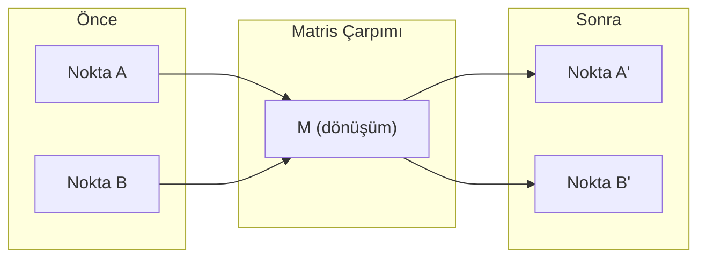
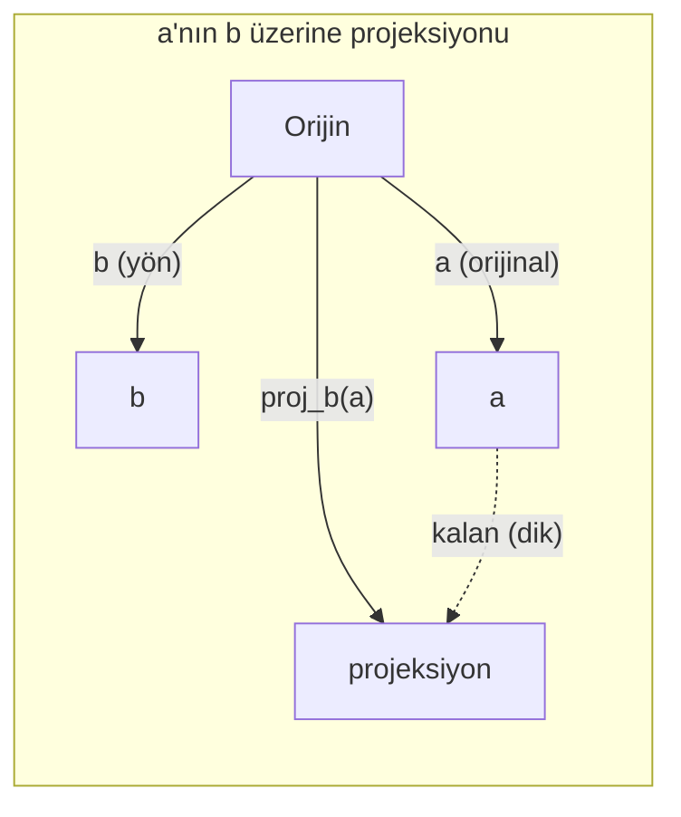

# Lineer Cebir Sezgisi

> Her yapay zeka modeli aslında şık bir şapka takmış matris matematiğidir.

**Tür:** Öğrenim
**Diller:** Python, Julia
**Ön koşullar:** Faz 0
**Süre:** ~60 dakika

## Öğrenme Hedefleri

- Python'da sıfırdan vektör ve matris işlemlerini (toplama, dot product, matris çarpımı) implemente et
- Dot product, projeksiyon ve Gram-Schmidt sürecinin geometrik olarak ne yaptığını açıkla
- Satır indirgemesi (row reduction) kullanarak bir vektör kümesinin lineer bağımsızlığını, rank'ını ve tabanını belirle
- Lineer cebir kavramlarını yapay zeka uygulamalarına bağla: embedding'ler, attention skorları ve LoRA

## Sorun

Herhangi bir ML makalesi aç. İlk sayfanın içinde vektörler, matrisler, dot product'lar ve dönüşümler göreceksin. Lineer cebir sezgisi yoksa, bunlar sadece sembollerdir. Varsa, bir sinir ağının aslında ne yaptığını görebilirsin — uzayda noktaları oraya buraya hareket ettiriyor.

Matematikçi olmana gerek yok. Bu işlemlerin geometrik olarak ne anlama geldiğini görmen ve sonra kendin kodlamana gerek var.

## Kavram

### Vektörler Noktadır (ve Yöndür)

Vektör sadece sayılardan oluşan bir listedir. Ama bu sayıların bir anlamı var — uzaydaki koordinatlardır.

**2B vektör [3, 2]:**

| x | y | Nokta |
|---|---|-------|
| 3 | 2 | Vektör orijinden (0,0) düzlemdeki (3, 2) noktasına işaret eder |

Vektörün büyüklüğü sqrt(3^2 + 2^2) = sqrt(13) ve yukarı sağa doğru işaret ediyor.

Yapay zekada vektörler her şeyi temsil eder:
- Bir kelime → 768 sayıdan oluşan bir vektör (embedding uzayındaki "anlamı")
- Bir görüntü → milyonlarca piksel değerinden oluşan bir vektör
- Bir kullanıcı → tercihlerinden oluşan bir vektör

### Matrisler Dönüşümlerdir

Bir matris, bir vektörü başka bir vektöre dönüştürür. Döndürebilir, ölçekleyebilir, gerebilir veya yansıtabilir.



Yapay zekada matrisler modelin TA KENDİSİDİR:
- Sinir ağı weight'leri → girdiyi çıktıya dönüştüren matrisler
- Attention skorları → neye odaklanacağına karar veren matrisler
- Embedding'ler → kelimeleri vektörlere eşleyen matrisler

### Dot Product Benzerliği Ölçer

İki vektörün dot product'ı sana ne kadar benzer olduklarını söyler.

```
a · b = a₁×b₁ + a₂×b₂ + ... + aₙ×bₙ

Aynı yön:        a · b > 0  (benzer)
Dik:             a · b = 0  (ilgisiz)
Zıt yön:         a · b < 0  (benzemez)
```

Arama motorlarının, öneri sistemlerinin ve RAG'in çalışma şekli tam olarak budur — yüksek dot product'a sahip vektörleri bul.

### Lineer Bağımsızlık

Kümedeki hiçbir vektör diğerlerinin bir kombinasyonu olarak yazılamıyorsa, vektörler lineer bağımsızdır. v1, v2, v3 bağımsızsa, 3B bir uzayı span ederler. Biri diğerlerinin kombinasyonuysa, sadece bir düzlemi span ederler.

Yapay zeka için neden önemli: feature matrisinin lineer bağımsız sütunları olmalı. İki feature mükemmel şekilde ilişkiliyse (lineer bağımlıysa), model bunların etkilerini ayırt edemez. Bu, regresyonda multicollinearity'ye yol açar — weight matrisi kararsız hale gelir ve küçük girdi değişiklikleri çılgın çıktı değişimlerine sebep olur.

**Somut örnek:**

```
v1 = [1, 0, 0]
v2 = [0, 1, 0]
v3 = [2, 1, 0]   # v3 = 2*v1 + v2
```

v1 ve v2 bağımsız — hiçbiri diğerinin skaler katı veya kombinasyonu değil. Ama v3 = 2*v1 + v2, dolayısıyla {v1, v2, v3} bağımlı bir kümedir. Bu üç vektörün hepsi xy düzleminde yer alır. Onları nasıl kombine edersen et, [0, 0, 1]'e ulaşamazsın. Üç vektörün var ama sadece iki boyut serbestliğin var.

Bir veri kümesinde: feature_3 = 2*feature_1 + feature_2 ise, feature_3'ü eklemek modele sıfır yeni bilgi katar. Daha kötüsü, normal denklemleri tekil (singular) yapar — weight'ler için tek bir çözüm yoktur.

### Taban ve Rank

Taban (basis), tüm uzayı span eden minimal sayıdaki lineer bağımsız vektörler kümesidir. Taban vektörlerinin sayısı uzayın boyutudur.

3B uzayın standart tabanı {[1,0,0], [0,1,0], [0,0,1]}'dir. Ama 3B'deki herhangi üç bağımsız vektör geçerli bir taban oluşturur. Taban seçimi bir koordinat sistemi seçimidir.

Bir matrisin rank'ı = lineer bağımsız sütunların sayısı = lineer bağımsız satırların sayısı. Eğer rank < min(satır, sütun) ise, matris rank-yetersizdir (rank-deficient). Bu şu anlama gelir:
- Sistemin sonsuz çözümü vardır (veya hiç yoktur)
- Dönüşümde bilgi kaybedilir
- Matrisin tersi alınamaz

| Durum | Rank | ML için anlamı |
|-----------|------|---------------------|
| Tam rank (rank = min(m, n)) | Maksimum mümkün | Eşsiz en küçük kareler çözümü var. Model iyi koşullanmış. |
| Rank yetersiz (rank < min(m, n)) | Maksimumun altında | Feature'lar gereksiz. Sonsuz weight çözümü. Regularization gerekli. |
| Rank 1 | 1 | Her sütun bir vektörün ölçeklenmiş kopyası. Tüm veri bir doğru üzerinde. |
| Rank yetersizliğine yakın (küçük singular value'lar) | Sayısal olarak düşük | Matris kötü koşullanmış. Küçük girdi gürültüsü büyük çıktı değişikliklerine yol açar. SVD truncation veya ridge regression kullan. |

### Projeksiyon

**a** vektörünü **b** vektörü üzerine projekte etmek, **a**'nın **b** yönündeki bileşenini verir:

```
proj_b(a) = (a dot b / b dot b) * b
```

Kalan (a - proj_b(a)) b'ye diktir. Bu ortogonal ayrıştırma en küçük kareler fit'inin temelidir.

ML'de projeksiyon her yerdedir:
- Lineer regresyon, gözlemlerden sütun uzayına olan mesafeyi minimize eder — çözüm bizzat bir projeksiyondur
- PCA veriyi maksimum varyans yönlerine projekte eder
- Transformer'larda attention, query'lerin key'ler üzerine projeksiyonlarını hesaplar



**Örnek:** a = [3, 4], b = [1, 0]

proj_b(a) = (3*1 + 4*0) / (1*1 + 0*0) * [1, 0] = 3 * [1, 0] = [3, 0]

Projeksiyon y bileşenini düşürür. Bu, en basit haliyle boyut indirgemedir — umursamadığın yönleri at gitsin.

### Gram-Schmidt Süreci

Herhangi bir bağımsız vektör kümesini ortonormal tabana çevirme. Ortonormal, her vektörün uzunluğu 1 ve her çiftin birbirine dik olması demektir.

Algoritma:
1. İlk vektörü al, normalize et
2. İkinci vektörü al, birincinin üzerindeki projeksiyonunu çıkar, normalize et
3. Üçüncü vektörü al, önceki tüm vektörler üzerindeki projeksiyonlarını çıkar, normalize et
4. Kalan vektörler için tekrarla

```
Girdi:  v1, v2, v3, ... (lineer bağımsız)

u1 = v1 / |v1|

w2 = v2 - (v2 dot u1) * u1
u2 = w2 / |w2|

w3 = v3 - (v3 dot u1) * u1 - (v3 dot u2) * u2
u3 = w3 / |w3|

Çıktı: u1, u2, u3, ... (ortonormal taban)
```

QR ayrıştırması içeride böyle çalışır. Q ortonormal taban, R projeksiyon katsayılarını yakalar. QR ayrıştırması şunlarda kullanılır:
- Lineer sistemlerin çözümü (Gauss elemesinden daha kararlı)
- Eigenvalue hesaplama (QR algoritması)
- En küçük kareler regresyonu (standart sayısal yöntem)

## İnşa Et

### Adım 1: Sıfırdan vektörler (Python)

```python
class Vector:
    def __init__(self, components):
        self.components = list(components)
        self.dim = len(self.components)

    def __add__(self, other):
        return Vector([a + b for a, b in zip(self.components, other.components)])

    def __sub__(self, other):
        return Vector([a - b for a, b in zip(self.components, other.components)])

    def dot(self, other):
        return sum(a * b for a, b in zip(self.components, other.components))

    def magnitude(self):
        return sum(x**2 for x in self.components) ** 0.5

    def normalize(self):
        mag = self.magnitude()
        return Vector([x / mag for x in self.components])

    def cosine_similarity(self, other):
        return self.dot(other) / (self.magnitude() * other.magnitude())

    def __repr__(self):
        return f"Vector({self.components})"


a = Vector([1, 2, 3])
b = Vector([4, 5, 6])

print(f"a + b = {a + b}")
print(f"a · b = {a.dot(b)}")
print(f"|a| = {a.magnitude():.4f}")
print(f"kosinüs benzerliği = {a.cosine_similarity(b):.4f}")
```

### Adım 2: Sıfırdan matrisler (Python)

```python
class Matrix:
    def __init__(self, rows):
        self.rows = [list(row) for row in rows]
        self.shape = (len(self.rows), len(self.rows[0]))

    def __matmul__(self, other):
        if isinstance(other, Vector):
            return Vector([
                sum(self.rows[i][j] * other.components[j] for j in range(self.shape[1]))
                for i in range(self.shape[0])
            ])
        rows = []
        for i in range(self.shape[0]):
            row = []
            for j in range(other.shape[1]):
                row.append(sum(
                    self.rows[i][k] * other.rows[k][j]
                    for k in range(self.shape[1])
                ))
            rows.append(row)
        return Matrix(rows)

    def transpose(self):
        return Matrix([
            [self.rows[j][i] for j in range(self.shape[0])]
            for i in range(self.shape[1])
        ])

    def __repr__(self):
        return f"Matrix({self.rows})"


rotation_90 = Matrix([[0, -1], [1, 0]])
point = Vector([3, 1])

rotated = rotation_90 @ point
print(f"Orijinal: {point}")
print(f"90° döndürülmüş: {rotated}")
```

### Adım 3: Bu yapay zeka için neden önemli

```python
import random

random.seed(42)
weights = Matrix([[random.gauss(0, 0.1) for _ in range(3)] for _ in range(2)])
input_vector = Vector([1.0, 0.5, -0.3])

output = weights @ input_vector
print(f"Girdi (3B): {input_vector}")
print(f"Çıktı (2B): {output}")
print("Bir sinir ağı katmanının yaptığı şey budur — matris çarpımı.")
```

### Adım 4: Julia versiyonu

```julia
a = [1.0, 2.0, 3.0]
b = [4.0, 5.0, 6.0]

println("a + b = ", a + b)
println("a · b = ", a ⋅ b)       # Julia unicode operatörlerini destekler
println("|a| = ", √(a ⋅ a))
println("kosinüs = ", (a ⋅ b) / (√(a ⋅ a) * √(b ⋅ b)))

# Matris-vektör çarpımı
W = [0.1 -0.2 0.3; 0.4 0.5 -0.1]
x = [1.0, 0.5, -0.3]
println("Wx = ", W * x)
println("Bu bir sinir ağı katmanıdır.")
```

### Adım 5: Sıfırdan lineer bağımsızlık ve projeksiyon (Python)

```python
def is_linearly_independent(vectors):
    n = len(vectors)
    dim = len(vectors[0].components)
    mat = Matrix([v.components[:] for v in vectors])
    rows = [row[:] for row in mat.rows]
    rank = 0
    for col in range(dim):
        pivot = None
        for row in range(rank, len(rows)):
            if abs(rows[row][col]) > 1e-10:
                pivot = row
                break
        if pivot is None:
            continue
        rows[rank], rows[pivot] = rows[pivot], rows[rank]
        scale = rows[rank][col]
        rows[rank] = [x / scale for x in rows[rank]]
        for row in range(len(rows)):
            if row != rank and abs(rows[row][col]) > 1e-10:
                factor = rows[row][col]
                rows[row] = [rows[row][j] - factor * rows[rank][j] for j in range(dim)]
        rank += 1
    return rank == n


def project(a, b):
    scalar = a.dot(b) / b.dot(b)
    return Vector([scalar * x for x in b.components])


def gram_schmidt(vectors):
    orthonormal = []
    for v in vectors:
        w = v
        for u in orthonormal:
            proj = project(w, u)
            w = w - proj
        if w.magnitude() < 1e-10:
            continue
        orthonormal.append(w.normalize())
    return orthonormal


v1 = Vector([1, 0, 0])
v2 = Vector([1, 1, 0])
v3 = Vector([1, 1, 1])
basis = gram_schmidt([v1, v2, v3])
for i, u in enumerate(basis):
    print(f"u{i+1} = {u}")
    print(f"  |u{i+1}| = {u.magnitude():.6f}")

print(f"u1 · u2 = {basis[0].dot(basis[1]):.6f}")
print(f"u1 · u3 = {basis[0].dot(basis[2]):.6f}")
print(f"u2 · u3 = {basis[1].dot(basis[2]):.6f}")
```

## Kullan

Şimdi aynı şeyi NumPy ile — pratikte gerçekten kullanacağın şey:

```python
import numpy as np

a = np.array([1, 2, 3], dtype=float)
b = np.array([4, 5, 6], dtype=float)

print(f"a + b = {a + b}")
print(f"a · b = {np.dot(a, b)}")
print(f"|a| = {np.linalg.norm(a):.4f}")
print(f"kosinüs = {np.dot(a, b) / (np.linalg.norm(a) * np.linalg.norm(b)):.4f}")

W = np.random.randn(2, 3) * 0.1
x = np.array([1.0, 0.5, -0.3])
print(f"Wx = {W @ x}")
```

### NumPy ile Rank, Projeksiyon ve QR

```python
import numpy as np

A = np.array([[1, 2], [2, 4]])
print(f"Rank: {np.linalg.matrix_rank(A)}")

a = np.array([3, 4])
b = np.array([1, 0])
proj = (np.dot(a, b) / np.dot(b, b)) * b
print(f"{a}'nın {b} üzerine projeksiyonu: {proj}")

Q, R = np.linalg.qr(np.random.randn(3, 3))
print(f"Q ortogonal mi: {np.allclose(Q @ Q.T, np.eye(3))}")
print(f"R üst üçgen mi: {np.allclose(R, np.triu(R))}")
```

### PyTorch — Tensor'lar Autodiff'li Vektörlerdir

```python
import torch

x = torch.randn(3, requires_grad=True)
y = torch.tensor([1.0, 0.0, 0.0])

similarity = torch.dot(x, y)
similarity.backward()

print(f"x = {x.data}")
print(f"y = {y.data}")
print(f"dot product = {similarity.item():.4f}")
print(f"d(dot)/dx = {x.grad}")
```

Dot product'ın x'e göre gradyanı tam olarak y'dir. PyTorch bunu otomatik hesapladı. Bir sinir ağındaki her işlem bunun gibi işlemlerden oluşur — matris çarpımları, dot product'lar, projeksiyonlar — ve autodiff hepsinde gradyanları takip eder.

NumPy'ın tek satırda yaptığını az önce sıfırdan inşa ettin. Artık kaputun altında ne döndüğünü biliyorsun.

## Yayınla

Bu ders şunu üretir:
- `outputs/prompt-linear-algebra-tutor.md` — yapay zeka asistanlarının lineer cebiri geometrik sezgi yoluyla öğretmesi için prompt

## Bağlantılar

Bu dersteki her şey modern yapay zekanın belirli parçalarına bağlanır:

| Kavram | Nerede görünür |
|---------|------------------|
| Dot product | Transformer'larda attention skorları, RAG'de kosinüs benzerliği |
| Matris çarpımı | Her sinir ağı katmanı, her lineer dönüşüm |
| Lineer bağımsızlık | Feature seçimi, multicollinearity'den kaçınma |
| Rank | Bir sistemin çözülebilir olup olmadığını belirleme, LoRA (low-rank adaptation) |
| Projeksiyon | Lineer regresyon (sütun uzayına projeksiyon), PCA |
| Gram-Schmidt / QR | Sayısal çözücüler, eigenvalue hesaplama |
| Ortonormal taban | Kararlı sayısal hesaplama, whitening dönüşümleri |

LoRA özellikle bahsetmeyi hak ediyor. Büyük dil modellerini, weight güncellemelerini düşük-rank matrislere ayrıştırarak fine-tune eder. 4096x4096'lık bir weight matrisi (16M parametre) güncellemek yerine LoRA, 4096x16 ve 16x4096 boyutunda iki matris (131K parametre) günceller. Rank-16 kısıtlaması, LoRA'nın weight güncellemesinin tam 4096-boyutlu uzayın 16-boyutlu bir alt uzayında yaşadığını varsaydığı anlamına gelir. Bu lineer cebrin gerçek iş yapması.

## Alıştırmalar

1. İki vektör arasındaki açıyı derece cinsinden döndüren `Vector.angle_between(other)` metodunu implemente et
2. x-koordinatını ikiye, y-koordinatını üçe katlayan 2B ölçekleme matrisi oluştur, sonra bunu [1, 1] vektörüne uygula
3. 5 rastgele kelime benzeri vektör (boyut 50) verildiğinde, kosinüs benzerliği kullanarak en benzer iki tanesini bul
4. Gram-Schmidt çıktısının gerçekten ortonormal olduğunu doğrula: her çiftin dot product'ının 0 ve her vektörün büyüklüğünün 1 olduğunu kontrol et
5. Rank'ı 2 olan bir 3x3 matris oluştur. `rank()` metodunu kullanarak doğrula. Sonra sütunların hangi geometrik nesneyi span ettiğini açıkla.
6. [1, 2, 3] vektörünü [1, 1, 1] üzerine projekte et. Sonuç geometrik olarak neyi temsil ediyor?

## Anahtar Terimler

| Terim | İnsanlar ne der | Aslında ne demek |
|------|----------------|----------------------|
| Vektör | "Bir ok" | n-boyutlu uzayda bir nokta veya yönü temsil eden sayı listesi |
| Matris | "Sayılardan oluşan bir tablo" | Vektörleri bir uzaydan başka bir uzaya eşleyen dönüşüm |
| Dot product | "Çarp ve topla" | İki vektörün ne kadar hizalı olduğunun ölçüsü — benzerlik aramasının özü |
| Embedding | "Bir tür yapay zeka büyüsü" | Bir şeyin (kelime, görüntü, kullanıcı) anlamını temsil eden vektör |
| Lineer bağımsızlık | "Üst üste binmiyorlar" | Kümedeki hiçbir vektör diğerlerinin kombinasyonu olarak yazılamaz |
| Rank | "Kaç boyut" | Bir matristeki lineer bağımsız sütun (veya satır) sayısı |
| Projeksiyon | "Gölge" | Bir vektörün başka bir vektör yönündeki bileşeni |
| Taban (basis) | "Koordinat eksenleri" | Uzayı span eden minimal bağımsız vektör kümesi |
| Ortonormal | "Dik birim vektörler" | Birbirine dik olan ve her birinin uzunluğu 1 olan vektörler |
