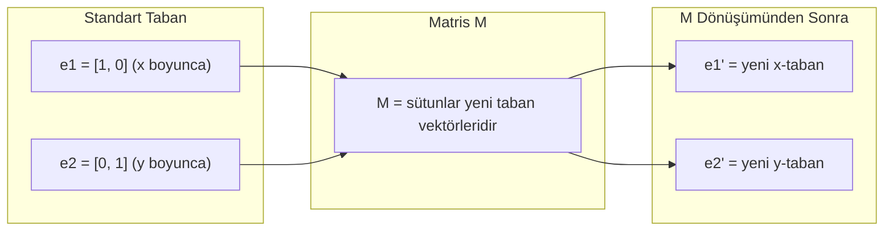
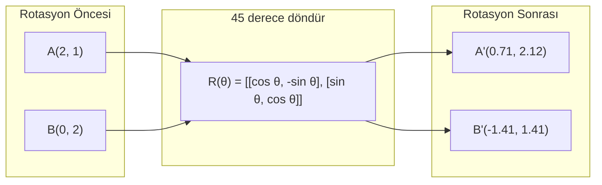
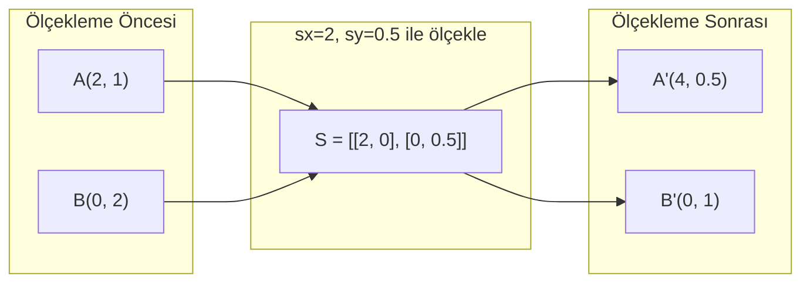
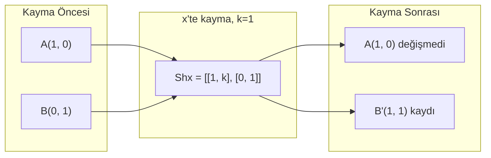
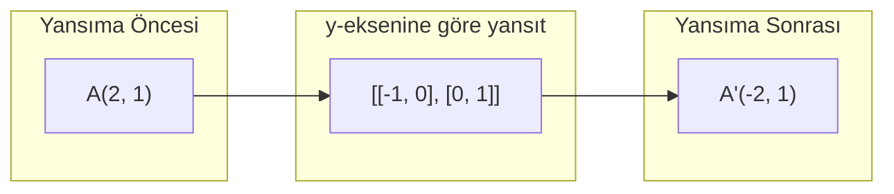
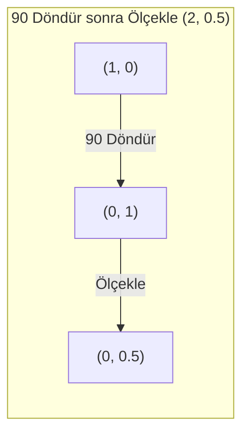
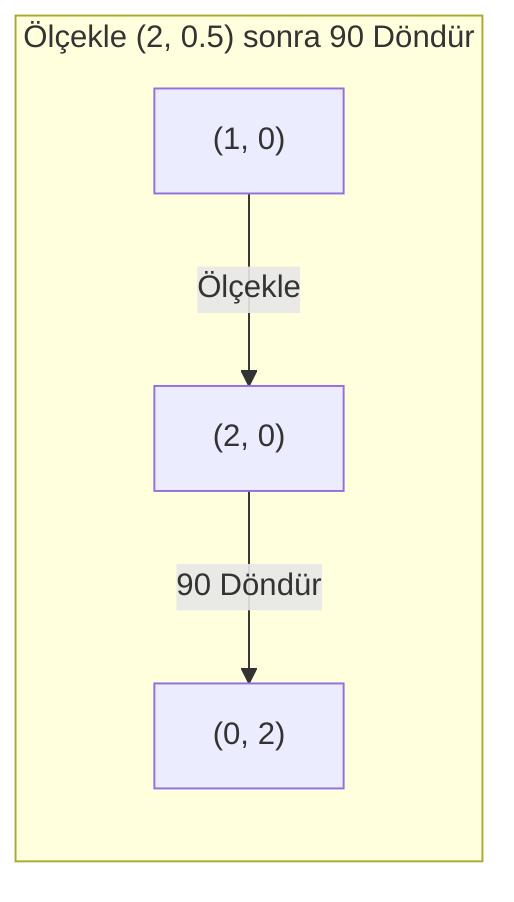

# Matris Dönüşümleri

> Matris uzayı yeniden şekillendiren bir makinedir. Her noktaya ne yaptığını öğren, tüm dönüşümü anlamış olursun.

**Tür:** Yapım
**Diller:** Python, Julia
**Ön koşullar:** Faz 1, Ders 01-02 (Lineer Cebir Sezgisi, Vektörler ve Matris İşlemleri)
**Süre:** ~75 dakika

## Öğrenme Hedefleri

- 2B ve 3B noktalara uygulanacak rotasyon, ölçekleme, kayma (shearing) ve yansıma matrislerini kur
- Matris çarpımıyla birden fazla dönüşümü birleştir ve sıranın önemli olduğunu doğrula
- Karakteristik denklemden 2x2 matrislerin eigenvalue ve eigenvector'larını hesapla
- Eigenvalue'ların neden PCA yönlerini, RNN kararlılığını ve spektral kümeleme davranışını belirlediğini açıkla

## Sorun

PCA hakkında okuyorsun ve "kovaryans matrisinin eigenvector'larını bul" diyor. Model kararlılığı hakkında okuyorsun ve "tüm eigenvalue'ların büyüklüğünün 1'den küçük olup olmadığını kontrol et" diyor. Veri çoğaltması (data augmentation) hakkında okuyorsun ve "rastgele bir rotasyon uygula" diyor. Matrislerin uzaya geometrik olarak ne yaptığını anlayana kadar bunların hiçbiri mantıklı gelmez.

Matrisler sadece sayı ızgaraları değildir. Uzaysal makinelerdir. Rotasyon matrisi noktaları döndürür. Ölçekleme matrisi onları gerer. Kayma matrisi onları eğer. Bir sinir ağının veriye uyguladığı her dönüşüm bu işlemlerden biri veya bunların bir kombinasyonudur. Bu ders bu işlemleri somut hale getiriyor.

## Kavram

### Matrisler olarak dönüşümler

2B'deki her lineer dönüşüm bir 2x2 matris olarak yazılabilir. Matris sana taban vektörleri [1, 0] ve [0, 1]'in nereye gittiğini tam olarak söyler. Geri kalanı kendiliğinden çıkar.



### Rotasyon

Theta açısı kadar bir 2B rotasyon, mesafeleri ve açıları korur. Her noktayı dairesel bir yay boyunca hareket ettirir.



3B'de bir eksen etrafında dönersin. Her eksenin kendi rotasyon matrisi vardır:

```
Rz(theta) = | cos  -sin  0 |     z-ekseni etrafında döndür
            | sin   cos  0 |     (x-y düzlemi döner, z sabit kalır)
            |  0     0   1 |

Rx(theta) = | 1   0     0    |   x-ekseni etrafında döndür
            | 0  cos  -sin   |   (y-z düzlemi döner, x sabit kalır)
            | 0  sin   cos   |

Ry(theta) = |  cos  0  sin |     y-ekseni etrafında döndür
            |   0   1   0  |     (x-z düzlemi döner, y sabit kalır)
            | -sin  0  cos |
```

### Ölçekleme

Ölçekleme her eksen boyunca bağımsız olarak gerer veya sıkıştırır.



### Kayma (Shearing)

Kayma, bir eksen sabit kalırken diğerini eğer. Dikdörtgenleri paralelkenarlara çevirir.



Kayma matrisleri:
- `Shx = [[1, k], [0, 1]]` x'i k * y kadar kaydırır
- `Shy = [[1, 0], [k, 1]]` y'yi k * x kadar kaydırır

### Yansıma

Yansıma noktaları bir eksene veya doğruya göre aynalar.



Yansıma matrisleri:
- y-eksenine göre yansıt: `[[-1, 0], [0, 1]]`
- x-eksenine göre yansıt: `[[1, 0], [0, -1]]`

### Bileşim (composition): dönüşümleri zincirleme

A sonra B dönüşümünü uygulamak, matrislerini çarpmakla aynıdır: `sonuç = B @ A @ nokta`. Sıra önemli. Önce döndür sonra ölçekle, önce ölçekle sonra döndürden farklı sonuçlar verir.



Birleştirilmiş: `S @ R = [[0, -2], [0.5, 0]]`



Birleştirilmiş: `R @ S = [[0, -0.5], [2, 0]]`

Farklı sonuçlar. Matris çarpımı değişmeli (commutative) değildir.

### Eigenvalue ve eigenvector'lar

Bir matris çoğu vektöre çarptığında yönünü değiştirir. Eigenvector'lar özeldir: matris onları sadece ölçekler, asla döndürmez. Ölçekleme faktörü eigenvalue'dur.

```
A @ v = lambda * v

v eigenvector (hayatta kalan yön)
lambda eigenvalue (ne kadar gerildiği)

Örnek: A = | 2  1 |
           | 1  2 |

Eigenvector [1, 1] eigenvalue 3 ile:
  A @ [1,1] = [3, 3] = 3 * [1, 1]     (aynı yön, 3 ile ölçeklenmiş)

Eigenvector [1, -1] eigenvalue 1 ile:
  A @ [1,-1] = [1, -1] = 1 * [1, -1]  (aynı yön, değişmemiş)
```

Matris uzayı [1, 1] boyunca 3x gerer ve [1, -1]'i değişmeden bırakır. Diğer her yön bu ikisinin bir karışımıdır.

### Eigendecomposition (özayrışım)

Bir matrisin n lineer bağımsız eigenvector'u varsa, ayrıştırılabilir:

```
A = V @ D @ V^(-1)

V = sütunları eigenvector olan matris
D = eigenvalue'ların diagonal matrisi
V^(-1) = V'nin inverse'i

Bu der ki: eigenvector koordinatlarına döndür, her eksen boyunca ölçekle, geri döndür.
```

### Eigenvalue'lar neden önemli

**PCA.** Kovaryans matrisinin eigenvector'ları temel bileşenlerdir (principal components). Eigenvalue'lar her bileşenin ne kadar varyans yakaladığını söyler. Eigenvalue'ya göre sırala, en üstteki k'yı tut, ve boyut indirgemen var.

**Kararlılık.** Recurrent ağlarda ve dinamik sistemlerde, büyüklüğü > 1 olan eigenvalue'lar çıktıların patlamasına neden olur. Büyüklük < 1 onları yok eder. Bu, vanishing/exploding gradient problemini tek cümlede ifade eder.

**Spektral yöntemler.** Graph neural network'ler komşuluk matrisinin eigenvalue'larını kullanır. Spektral kümeleme Laplacian'ın eigenvalue'larını kullanır. Eigenvector'lar grafın yapısını ortaya koyar.

### Hacim ölçekleme faktörü olarak determinant

Bir dönüşüm matrisinin determinantı sana onun alanı (2B) veya hacmi (3B) ne kadar ölçeklediğini söyler.

```
det = 1:   alan korunur (rotasyon)
det = 2:   alan ikiye katlanır
det = 0:   uzay daha düşük boyuta çöker (singular)
det = -1:  alan korunur ama yön tersine döner (yansıma)

| det(Rotasyon) | = 1        (her zaman)
| det(Ölçekleme sx, sy) | = sx * sy
| det(Kayma) | = 1           (alan korunur)
| det(Yansıma) | = -1        (yön tersine döner)
```

## İnşa Et

### Adım 1: Sıfırdan dönüşüm matrisleri (Python)

```python
import math

def rotation_2d(theta):
    c, s = math.cos(theta), math.sin(theta)
    return [[c, -s], [s, c]]

def scaling_2d(sx, sy):
    return [[sx, 0], [0, sy]]

def shearing_2d(kx, ky):
    return [[1, kx], [ky, 1]]

def reflection_x():
    return [[1, 0], [0, -1]]

def reflection_y():
    return [[-1, 0], [0, 1]]

def mat_vec_mul(matrix, vector):
    return [
        sum(matrix[i][j] * vector[j] for j in range(len(vector)))
        for i in range(len(matrix))
    ]

def mat_mul(a, b):
    rows_a, cols_b = len(a), len(b[0])
    cols_a = len(a[0])
    return [
        [sum(a[i][k] * b[k][j] for k in range(cols_a)) for j in range(cols_b)]
        for i in range(rows_a)
    ]

point = [1.0, 0.0]
angle = math.pi / 4

rotated = mat_vec_mul(rotation_2d(angle), point)
print(f"(1,0)'ı 45 derece döndür: ({rotated[0]:.4f}, {rotated[1]:.4f})")

scaled = mat_vec_mul(scaling_2d(2, 3), [1.0, 1.0])
print(f"(1,1)'i (2,3) ile ölçekle: ({scaled[0]:.1f}, {scaled[1]:.1f})")

sheared = mat_vec_mul(shearing_2d(1, 0), [1.0, 1.0])
print(f"(1,1)'e kx=1 kayması: ({sheared[0]:.1f}, {sheared[1]:.1f})")

reflected = mat_vec_mul(reflection_y(), [2.0, 1.0])
print(f"(2,1)'i y'ye yansıt: ({reflected[0]:.1f}, {reflected[1]:.1f})")
```

### Adım 2: Dönüşümlerin bileşimi

```python
R = rotation_2d(math.pi / 2)
S = scaling_2d(2, 0.5)

rotate_then_scale = mat_mul(S, R)
scale_then_rotate = mat_mul(R, S)

point = [1.0, 0.0]
result1 = mat_vec_mul(rotate_then_scale, point)
result2 = mat_vec_mul(scale_then_rotate, point)

print(f"90 döndür sonra ölçekle: ({result1[0]:.2f}, {result1[1]:.2f})")
print(f"Ölçekle sonra 90 döndür: ({result2[0]:.2f}, {result2[1]:.2f})")
print(f"Aynı mı? {result1 == result2}")
```

### Adım 3: Sıfırdan eigenvalue'lar (2x2)

Bir 2x2 matris `[[a, b], [c, d]]` için, eigenvalue'lar karakteristik denklemi çözer: `lambda^2 - (a+d)*lambda + (ad - bc) = 0`.

```python
def eigenvalues_2x2(matrix):
    a, b = matrix[0]
    c, d = matrix[1]
    trace = a + d
    det = a * d - b * c
    discriminant = trace ** 2 - 4 * det
    if discriminant < 0:
        real = trace / 2
        imag = (-discriminant) ** 0.5 / 2
        return (complex(real, imag), complex(real, -imag))
    sqrt_disc = discriminant ** 0.5
    return ((trace + sqrt_disc) / 2, (trace - sqrt_disc) / 2)

def eigenvector_2x2(matrix, eigenvalue):
    a, b = matrix[0]
    c, d = matrix[1]
    if abs(b) > 1e-10:
        v = [b, eigenvalue - a]
    elif abs(c) > 1e-10:
        v = [eigenvalue - d, c]
    else:
        if abs(a - eigenvalue) < 1e-10:
            v = [1, 0]
        else:
            v = [0, 1]
    mag = (v[0] ** 2 + v[1] ** 2) ** 0.5
    return [v[0] / mag, v[1] / mag]

A = [[2, 1], [1, 2]]
vals = eigenvalues_2x2(A)
print(f"Matris: {A}")
print(f"Eigenvalue'lar: {vals[0]:.4f}, {vals[1]:.4f}")

for val in vals:
    vec = eigenvector_2x2(A, val)
    result = mat_vec_mul(A, vec)
    scaled = [val * vec[0], val * vec[1]]
    print(f"  lambda={val:.1f}, v={[round(x,4) for x in vec]}")
    print(f"    A@v = {[round(x,4) for x in result]}")
    print(f"    l*v = {[round(x,4) for x in scaled]}")
```

### Adım 4: Hacim ölçekleme faktörü olarak determinant

```python
def det_2x2(matrix):
    return matrix[0][0] * matrix[1][1] - matrix[0][1] * matrix[1][0]

print(f"det(rotasyon 45) = {det_2x2(rotation_2d(math.pi/4)):.4f}")
print(f"det(ölçek 2,3)   = {det_2x2(scaling_2d(2, 3)):.1f}")
print(f"det(kayma kx=1)  = {det_2x2(shearing_2d(1, 0)):.1f}")
print(f"det(yansıma y)   = {det_2x2(reflection_y()):.1f}")

singular = [[1, 2], [2, 4]]
print(f"det(singular)     = {det_2x2(singular):.1f}")
print("Singular: sütunlar orantılı, uzay bir doğruya çöküyor.")
```

## Kullan

NumPy bunların hepsini optimize edilmiş rutinlerle ele alır.

```python
import numpy as np

theta = np.pi / 4
R = np.array([[np.cos(theta), -np.sin(theta)],
              [np.sin(theta),  np.cos(theta)]])

point = np.array([1.0, 0.0])
print(f"(1,0)'ı 45 derece döndür: {R @ point}")

S = np.diag([2.0, 3.0])
composed = S @ R
print(f"Scale(2,3) after Rotate(45): {composed @ point}")

A = np.array([[2, 1], [1, 2]], dtype=float)
eigenvalues, eigenvectors = np.linalg.eig(A)
print(f"\nEigenvalue'lar: {eigenvalues}")
print(f"Eigenvector'lar (sütunlar):\n{eigenvectors}")

for i in range(len(eigenvalues)):
    v = eigenvectors[:, i]
    lam = eigenvalues[i]
    print(f"  A @ v{i} = {A @ v}, lambda * v{i} = {lam * v}")

print(f"\ndet(R) = {np.linalg.det(R):.4f}")
print(f"det(S) = {np.linalg.det(S):.1f}")

B = np.array([[3, 1], [0, 2]], dtype=float)
vals, vecs = np.linalg.eig(B)
D = np.diag(vals)
V = vecs
reconstructed = V @ D @ np.linalg.inv(V)
print(f"\nEigendecomposition A = V @ D @ V^-1:")
print(f"Orijinal:\n{B}")
print(f"Yeniden inşa edilen:\n{reconstructed}")
```

### NumPy ile 3B rotasyonlar

```python
def rotation_3d_z(theta):
    c, s = np.cos(theta), np.sin(theta)
    return np.array([[c, -s, 0], [s, c, 0], [0, 0, 1]])

def rotation_3d_x(theta):
    c, s = np.cos(theta), np.sin(theta)
    return np.array([[1, 0, 0], [0, c, -s], [0, s, c]])

point_3d = np.array([1.0, 0.0, 0.0])
rotated_z = rotation_3d_z(np.pi / 2) @ point_3d
rotated_x = rotation_3d_x(np.pi / 2) @ point_3d

print(f"\n3B nokta: {point_3d}")
print(f"z etrafında 90 döndür: {np.round(rotated_z, 4)}")
print(f"x etrafında 90 döndür: {np.round(rotated_x, 4)}")
```

## Yayınla

Bu ders PCA (Faz 2) ve sinir ağı weight analizi için geometrik temeli oluşturur. Burada inşa edilen eigenvalue/eigenvector kodu, üretim ML sistemlerindeki boyut indirgeme, spektral kümeleme ve kararlılık analizini güçlendiren aynı algoritmadır.

## Alıştırmalar

1. Bir birim kareye (köşeleri [0,0], [1,0], [1,1], [0,1] olan) rotasyon, ölçekleme ve kayma uygula. Her biri için dönüştürülmüş köşeleri yazdır. Rotasyonun köşeler arası mesafeleri koruduğunu doğrula.

2. [[4, 2], [1, 3]] matrisinin eigenvalue'larını karakteristik denklem kullanarak elle bul. Sonra sıfırdan yazdığın fonksiyonla ve NumPy ile doğrula.

3. Üç dönüşümün bir bileşimini oluştur (30 derece döndür, [1.5, 0.8] ile ölçekle, kx=0.3 ile kayma) ve bir çember üzerinde dizilmiş 8 noktaya uygula. Önce ve sonra koordinatları yazdır. Birleştirilmiş matrisin determinantını hesapla ve bunun bireysel determinantların çarpımına eşit olduğunu doğrula.

## Anahtar Terimler

| Terim | İnsanlar ne der | Aslında ne demek |
|------|----------------|----------------------|
| Rotasyon matrisi | "Şeyleri döndürür" | Mesafeleri ve açıları korurken noktaları dairesel yaylar boyunca hareket ettiren ortogonal matris. Determinantı her zaman 1'dir. |
| Ölçekleme matrisi | "Şeyleri büyütür" | Her eksen boyunca bağımsız olarak geren veya sıkıştıran diagonal matris. Determinantı ölçek faktörlerinin çarpımıdır. |
| Kayma matrisi | "Şeyleri eğer" | Bir koordinatı diğerine orantılı olarak kaydırarak dikdörtgenleri paralelkenarlara dönüştüren matris. Determinantı 1'dir. |
| Yansıma | "Şeyleri aynalar" | Uzayı bir eksen veya düzleme göre çeviren matris. Determinantı -1'dir. |
| Bileşim | "İki şeyi yap" | İşlemleri zincirlemek için dönüşüm matrislerini çarpmak. Sıra önemli: B @ A önce A'yı sonra B'yi uygula demek. |
| Eigenvector | "Özel yön" | Matrisin sadece ölçeklediği, asla döndürmediği bir yön. Dönüşümün parmak izi. |
| Eigenvalue | "Ne kadar gerdiği" | Matrisin eigenvector'unu ölçeklediği skaler faktör. Negatif (çevir) veya karmaşık (rotasyon) olabilir. |
| Eigendecomposition | "Matrisi parçala" | Bir matrisi V @ D @ V^(-1) olarak yazmak, onu temel ölçekleme yönlerine ve büyüklüklerine ayırmak. |
| Determinant | "Matristen tek bir sayı" | Dönüşümün alanı (2B) veya hacmi (3B) ölçeklediği faktör. Sıfır, dönüşümün geri alınamaz olduğu anlamına gelir. |
| Karakteristik denklem | "Eigenvalue'ların geldiği yer" | det(A - lambda * I) = 0. Kökleri eigenvalue olan polinom. |

## İleri Okuma

- [3Blue1Brown: Linear Transformations](https://www.3blue1brown.com/lessons/linear-transformations) -- matrislerin uzayı nasıl yeniden şekillendirdiğine dair görsel sezgi
- [3Blue1Brown: Eigenvectors and Eigenvalues](https://www.3blue1brown.com/lessons/eigenvalues) -- eigenvector'ların geometrik olarak ne anlama geldiğine dair en iyi görsel açıklama
- [MIT 18.06 Lecture 21: Eigenvalues and Eigenvectors](https://ocw.mit.edu/courses/18-06-linear-algebra-spring-2010/) -- Gilbert Strang'in klasik anlatımı
