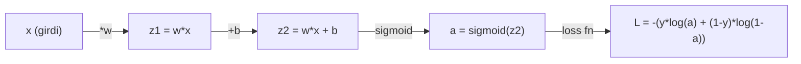
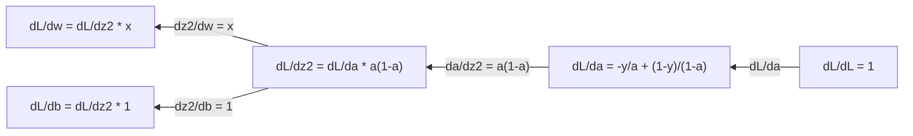
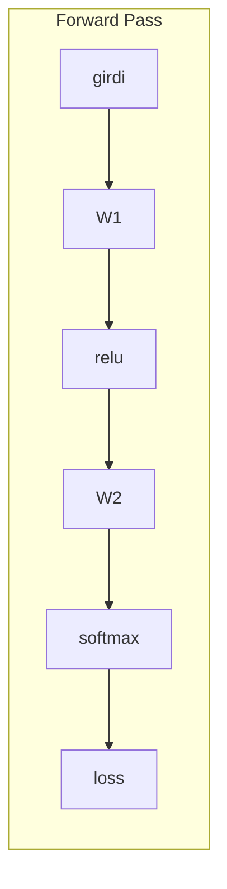
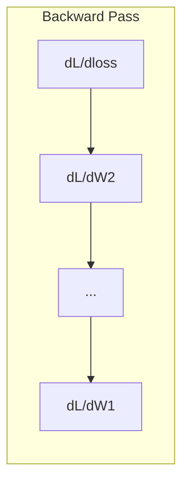

# Makine Öğrenmesi için Kalkülüs

> Türevler sana hangi yönün aşağı doğru olduğunu söyler. Bir sinir ağının öğrenmek için ihtiyaç duyduğu tek şey budur.

**Tür:** Öğrenim
**Dil:** Python
**Ön koşullar:** Faz 1, Ders 01-03
**Süre:** ~60 dakika

## Öğrenme Hedefleri

- Yaygın ML fonksiyonları (x^2, sigmoid, cross-entropy) için sayısal ve analitik türevleri hesapla
- 1B ve 2B'de bir loss fonksiyonunu minimize etmek için sıfırdan gradient descent implemente et
- Bir lineer regresyon modelinin gradyanını türet ve manuel weight güncellemeleriyle eğit
- Hessian matrisini, Taylor serisi yaklaşımlarını ve bunların optimizasyon yöntemleriyle bağlantısını açıkla

## Sorun

Milyonlarca weight'i olan bir sinir ağın var. Her weight bir düğme. Modeli biraz daha az yanlış yapmak için her bir düğmeyi hangi yöne çevireceğini bulman lazım. Kalkülüs sana bu yönü verir.

Kalkülüs olmadan, bir sinir ağını eğitmek rastgele değişiklikler deneyip en iyisini ummak anlamına gelirdi. Türevler ile, her weight'in hatayı nasıl etkilediğini tam olarak bilirsin. Her düğmeyi her seferinde doğru yönde çevirirsin.

## Kavram

### Türev nedir?

Türev değişim oranını ölçer. y = f(x) fonksiyonu için, türev f'(x) sana şunu söyler: x'i çok küçük bir miktar değiştirirsen, y ne kadar değişir?

Geometrik olarak, türev bir noktadaki teğet doğrunun eğimidir.

**f(x) = x^2:**

| x | f(x) | f'(x) (eğim) |
|---|------|---------------|
| 0 | 0    | 0 (düz, en dipte) |
| 1 | 1    | 2 |
| 2 | 4    | 4 (bu noktadaki teğet doğru eğimi) |
| 3 | 9    | 6 |

x=2'de eğim 4. x'i sağa doğru çok az hareket ettirirsen, y bu miktarın yaklaşık 4 katı artar. x=0'da eğim 0. Çukurun en dibindesin.

Resmi tanım:

```
f'(x) = lim   f(x + h) - f(x)
        h->0  -----------------
                     h
```

Kodda, limiti atlayıp sadece çok küçük bir h kullanırsın. Bu sayısal türevdir.

### Kısmi türevler: tek seferde bir değişken

Gerçek fonksiyonların birçok girdisi vardır. Bir sinir ağı loss'u binlerce weight'e bağlıdır. Kısmi türev biri hariç tüm değişkenleri sabit tutar, sonra o birine göre türev alır.

```
f(x, y) = x^2 + 3xy + y^2

df/dx = 2x + 3y     (y'yi sabit gibi düşün)
df/dy = 3x + 2y     (x'i sabit gibi düşün)
```

Her kısmi türev şunu cevaplar: sadece bu tek weight'i biraz değiştirirsem, loss nasıl değişir?

### Gradyan: tüm kısmi türevlerin vektörü

Gradyan her kısmi türevi tek bir vektörde toplar. f(x, y, z) fonksiyonu için gradyan:

```
grad f = [ df/dx, df/dy, df/dz ]
```

Gradyan en dik çıkış yönünü gösterir. Bir fonksiyonu minimize etmek için ters yöne git.

**f(x,y) = x^2 + y^2'nin kontur grafiği:**

Fonksiyon, kontur çizgileri olarak iç içe çemberlere sahip bir çanak şekli oluşturur. Minimum (0, 0)'dadır.

| Nokta | grad f | -grad f (iniş yönü) |
|-------|--------|----------------------------|
| (1, 1) | [2, 2] (yokuş yukarı, minimumdan uzağa) | [-2, -2] (yokuş aşağı, minimuma doğru) |
| (0, 0) | [0, 0] (düz, minimumda) | [0, 0] |

Bir resimde gradient descent. Gradyanı hesapla, negatifini al, bir adım at.

### Optimizasyonla bağlantı

Bir sinir ağını eğitmek optimizasyondur. Modelin ne kadar yanlış olduğunu ölçen bir L(w1, w2, ..., wn) loss fonksiyonun var. Onu minimize etmek istiyorsun.

```
Gradient descent güncelleme kuralı:

  w_new = w_old - learning_rate * dL/dw

Her weight için:
  1. Loss'un o weight'e göre kısmi türevini hesapla
  2. Onun küçük bir katını weight'ten çıkar
  3. Tekrarla
```

Learning rate adım büyüklüğünü kontrol eder. Çok büyükse overshoot edersin. Çok küçükse sürünürsün.

**Loss manzarası (1B dilim):**

L(w) loss fonksiyonu, w weight'i değiştikçe tepeleri ve vadileri olan bir eğri oluşturur.

| Özellik | Açıklama |
|---------|-------------|
| Global minimum | Tüm eğrideki en alçak nokta — en iyi çözüm |
| Yerel minimum | Komşularından daha alçak ama genelde en alçak olmayan vadi |
| Eğim | Gradient descent herhangi bir başlangıç noktasından eğimi yokuş aşağı takip eder |

Gradient descent eğimi yokuş aşağı takip eder. Yerel minimumlarda sıkışabilir, ama yüksek boyutlu uzaylarda (milyonlarca weight) bu nadiren pratik bir problemdir.

### Sayısal vs analitik türevler

Türev hesaplamanın iki yolu var.

Analitik: kalkülüs kurallarını elle uygula. f(x) = x^2 için türev f'(x) = 2x'tir. Tam. Hızlı.

Sayısal: tanımı kullanarak yaklaş. Küçük bir h için f(x+h) ve f(x-h)'yi hesapla, sonra farkı kullan.

```
Sayısal (merkezi fark):

f'(x) ~= f(x + h) - f(x - h)
          -----------------------
                  2h

h = 0.0001 pratikte iyi çalışır
```

Sayısal türevler daha yavaştır ama her fonksiyon için çalışır. Analitik türevler hızlıdır ama formülü türetmen gerekir. Sinir ağı framework'leri üçüncü bir yaklaşım kullanır: tam türevleri mekanik olarak hesaplayan otomatik diferansiyasyon. Bunu Faz 3'te göreceksin.

### Basit fonksiyonlar için elle türevler

Bunlar ML'de defalarca göreceğin türevlerdir.

```
Fonksiyon       Türev            Kullanıldığı yer
--------        ----------       -------
f(x) = x^2     f'(x) = 2x      Loss fonksiyonları (MSE)
f(x) = wx + b  f'(w) = x        Lineer katman (weight'e göre gradyan)
                f'(b) = 1        Lineer katman (bias'a göre gradyan)
                f'(x) = w        Lineer katman (girdiye göre gradyan)
f(x) = e^x     f'(x) = e^x     Softmax, attention
f(x) = ln(x)   f'(x) = 1/x     Cross-entropy loss
f(x) = 1/(1+e^-x)  f'(x) = f(x)(1-f(x))   Sigmoid aktivasyon
```

f(x) = x^2 için:

```
f(x) = x^2    f'(x) = 2x

  x    f(x)   f'(x)   anlamı
  -2    4      -4      eğim sola (azalan)
  -1    1      -2      eğim sola (azalan)
   0    0       0      düz (minimum!)
   1    1       2      eğim sağa (artan)
   2    4       4      eğim sağa (artan)
```

x=3, b=1 ile f(w) = wx + b için:

```
f(w) = 3w + 1    f'(w) = 3

w'ye göre türev tam olarak x'tir.
x büyükse, w'deki küçük bir değişim çıktıda büyük bir değişime neden olur.
```

### Zincir kuralı

Fonksiyonlar bileşik olduğunda, zincir kuralı sana nasıl türev alacağını söyler.

```
y = f(g(x)) ise, dy/dx = f'(g(x)) * g'(x)

Örnek: y = (3x + 1)^2
  dış: f(u) = u^2       f'(u) = 2u
  iç: g(x) = 3x + 1    g'(x) = 3
  dy/dx = 2(3x + 1) * 3 = 6(3x + 1)
```

Sinir ağları fonksiyon zincirleridir: girdi -> lineer -> aktivasyon -> lineer -> aktivasyon -> loss. Backpropagation çıkıştan girdiye doğru tekrarlanan zincir kuralıdır. Tüm algoritma budur.

### Hessian Matrisi

Gradyan sana eğimi söyler. Hessian sana eğriliği söyler.

Hessian, ikinci dereceden kısmi türevlerin matrisidir. f(x1, x2, ..., xn) fonksiyonu için Hessian'ın (i, j) girdisi:

```
H[i][j] = d^2f / (dx_i * dx_j)
```

2 değişkenli f(x, y) fonksiyonu için:

```
H = | d^2f/dx^2    d^2f/dxdy |
    | d^2f/dydx    d^2f/dy^2 |
```

**Kritik noktada (gradyan = 0 olan yerde) Hessian sana ne anlatır:**

| Hessian özelliği | Anlamı | Örnek yüzey |
|-----------------|---------|-----------------|
| Pozitif tanımlı (tüm eigenvalue'lar > 0) | Yerel minimum | Yukarı bakan çanak |
| Negatif tanımlı (tüm eigenvalue'lar < 0) | Yerel maksimum | Aşağı bakan çanak |
| Belirsiz (karışık eigenvalue'lar) | Eyer noktası (saddle) | At eyeri şekli |

**Örnek:** f(x, y) = x^2 - y^2 (bir saddle fonksiyon)

```
df/dx = 2x       df/dy = -2y
d^2f/dx^2 = 2    d^2f/dy^2 = -2    d^2f/dxdy = 0

H = | 2   0 |
    | 0  -2 |

Eigenvalue'lar: 2 ve -2 (biri pozitif, biri negatif)
--> (0, 0)'da saddle point
```

f(x, y) = x^2 + y^2 (bir çanak) ile karşılaştır:

```
H = | 2  0 |
    | 0  2 |

Eigenvalue'lar: 2 ve 2 (ikisi de pozitif)
--> (0, 0)'da yerel minimum
```

**Hessian ML'de neden önemli:**

Newton metodu, gradient descent'ten daha iyi optimizasyon adımları atmak için Hessian'ı kullanır. Sadece eğimi takip etmek yerine, eğriliği de hesaba katar:

```
Newton güncellemesi:  w_new = w_old - H^(-1) * gradient
Gradient descent:     w_new = w_old - lr * gradient
```

Newton metodu daha hızlı yakınsar çünkü Hessian gradyanı "yeniden ölçekler" — dik yönler daha küçük adım, düz yönler daha büyük adım alır.

Sorun şu: N parametreli bir sinir ağı için Hessian N x N'dir. 1 milyon parametreli bir modelin 1 trilyon girdili bir matrise ihtiyacı olur. Bu yüzden yaklaşımlar kullanırız.

| Yöntem | Ne kullanır | Maliyet | Yakınsama |
|--------|-------------|------|-------------|
| Gradient descent | Sadece birinci türevler | Adım başına O(N) | Yavaş (lineer) |
| Newton metodu | Tam Hessian | Adım başına O(N^3) | Hızlı (quadratic) |
| L-BFGS | Gradyan geçmişinden yaklaşık Hessian | Adım başına O(N) | Orta (superlinear) |
| Adam | Parametre başına adaptif rate (diagonal Hessian yaklaşımı) | Adım başına O(N) | Orta |
| Natural gradient | Fisher information matrisi (istatistiksel Hessian) | Adım başına O(N^2) | Hızlı |

Pratikte Adam, deep learning için varsayılan optimizer'dır. Parametre başına gradyanların running mean ve variance'ını takip ederek ikinci dereceden bilgiyi ucuza yaklaşıklar.

### Taylor Serisi Yaklaşımı

Herhangi bir düzgün fonksiyon yerel olarak bir polinomla yaklaşıklanabilir:

```
f(x + h) = f(x) + f'(x)*h + (1/2)*f''(x)*h^2 + (1/6)*f'''(x)*h^3 + ...
```

Ne kadar çok terim eklersen, yaklaşım o kadar iyi olur — ama sadece x noktasına yakın.

**Taylor serisi ML için neden önemli:**

- **Birinci dereceden Taylor = gradient descent.** f(x + h) ~ f(x) + f'(x)*h kullandığında lineer bir yaklaşım yapıyorsun. Gradient descent bu lineer modeli minimize ederek h = -lr * f'(x)'i seçer.

- **İkinci dereceden Taylor = Newton metodu.** f(x + h) ~ f(x) + f'(x)*h + (1/2)*f''(x)*h^2 kullanarak quadratic bir model elde edersin. Onu minimize etmek h = -f'(x)/f''(x) verir — Newton adımı.

- **Loss fonksiyonu tasarımı.** MSE ve cross-entropy düzgündür, yani Taylor açılımları iyi davranır. Bu tesadüf değil. Düzgün loss'lar optimizasyonu öngörülebilir kılar.

```
Yaklaşım derecesi      Ne yakalar          Optimizasyon yöntemi
-------------------    -----------------   -------------------
0. derece (sabit)      Sadece değer        Rastgele arama
1. derece (lineer)     Eğim                Gradient descent
2. derece (quadratic)  Eğrilik             Newton metodu
Daha yüksek dereceler  İnce yapı           ML'de nadiren kullanılır
```

Anahtar içgörü: tüm gradient tabanlı optimizasyon aslında loss fonksiyonunu yerel olarak yaklaşıklamak ve o yaklaşımın minimumuna adım atmaktır.

### ML'de integraller

Türevler sana değişim oranlarını söyler. İntegraller birikimleri hesaplar — eğri altındaki alan.

ML'de integralleri elle nadiren hesaplarsın, ama kavram her yerdedir:

**Olasılık.** Yoğunluk p(x) olan sürekli bir rastgele değişken için:
```
P(a < X < b) = a'dan b'ye integral p(x) dx
```
Olasılık yoğunluk eğrisi altındaki a ve b arasındaki alan, o aralığa düşme olasılığıdır.

**Beklenen değer.** Olasılıkla ağırlıklandırılmış ortalama sonuç:
```
E[f(X)] = integral f(x) * p(x) dx
```
Bir veri dağılımı üzerindeki beklenen loss bir integraldir. Eğitim bunun ampirik bir yaklaşımını minimize eder.

**KL diverjansı.** İki dağılımın ne kadar farklı olduğunu ölçer:
```
KL(p || q) = integral p(x) * log(p(x) / q(x)) dx
```
VAE'lerde, knowledge distillation'da ve Bayesçi çıkarımda kullanılır.

**Normalizasyon sabitleri.** Bayesçi çıkarımda:
```
p(w | data) = p(data | w) * p(w) / integral p(data | w) * p(w) dw
```
Payda tüm olası parametre değerleri üzerinde bir integraldir. Genellikle hesaplanması güçtür, bu yüzden MCMC ve variational inference gibi yaklaşımlar kullanırız.

| İntegral kavramı | ML'de nerede görünür |
|-----------------|----------------------|
| Eğri altındaki alan | Yoğunluk fonksiyonlarından olasılık |
| Beklenen değer | Loss fonksiyonları, risk minimizasyonu |
| KL diverjansı | VAE'ler, policy optimization, distillation |
| Normalizasyon | Bayesçi posterior'lar, softmax paydası |
| Marginal likelihood | Model karşılaştırması, evidence lower bound (ELBO) |

### Hesaplama Grafında Çok Değişkenli Zincir Kuralı

Zincir kuralı sadece bir hattaki skaler fonksiyonlar için geçerli değildir. Bir sinir ağında değişkenler dallanır ve birleşir. Türevlerin basit bir forward pass'te nasıl aktığını gösterelim:



Backward pass gradyanları sağdan sola hesaplar:



Her ok yerel türevle çarpar. Herhangi bir parametre için gradyan, loss'tan o parametreye giden yol boyunca tüm yerel türevlerin çarpımıdır. Yollar dallanıp birleştiğinde, katkıları toplarsın (çok değişkenli zincir kuralı).

Backpropagation tüm bunlardan ibarettir: zincir kuralının bir hesaplama grafında çıkıştan girdilere sistematik olarak uygulanması.

### Jacobian matrisi

Bir fonksiyon bir vektörü bir vektöre eşlediğinde (bir sinir ağı katmanı gibi), türevi bir matristir. Jacobian her girdiye göre her çıktının her kısmi türevini içerir.

f: R^n -> R^m için Jacobian J, m x n bir matristir:

| | x1 | x2 | ... | xn |
|---|---|---|---|---|
| f1 | df1/dx1 | df1/dx2 | ... | df1/dxn |
| f2 | df2/dx1 | df2/dx2 | ... | df2/dxn |
| ... | ... | ... | ... | ... |
| fm | dfm/dx1 | dfm/dx2 | ... | dfm/dxn |

Sinir ağları için Jacobian'ları elle hesaplamayacaksın. PyTorch hallediyor. Ama var olduğunu bilmek backpropagation'da shape'leri anlamana yardım eder: eğer bir katman R^n'yi R^m'ye eşliyorsa, Jacobian'ı m x n'dir. Gradyan bu matrisin transpozu üzerinden geriye doğru akar.

### Sinir ağları için neden önemli

Bir sinir ağındaki her weight bir gradyan alır. Gradyan loss'u azaltmak için o weight'i nasıl ayarlayacağını söyler.





Her weight güncellemesi:
- `W1 = W1 - lr * dL/dW1`
- `W2 = W2 - lr * dL/dW2`

Forward pass tahmini ve loss'u hesaplar. Backward pass loss'un her weight'e göre gradyanını hesaplar. Sonra her weight yokuş aşağı küçük bir adım atar. Milyonlarca adım için tekrarla. Deep learning budur.

## İnşa Et

### Adım 1: Sıfırdan sayısal türev

```python
def numerical_derivative(f, x, h=1e-7):
    return (f(x + h) - f(x - h)) / (2 * h)

def f(x):
    return x ** 2

for x in [-2, -1, 0, 1, 2]:
    numerical = numerical_derivative(f, x)
    analytical = 2 * x
    print(f"x={x:2d}  f'(x) sayısal={numerical:.6f}  analitik={analytical:.1f}")
```

Sayısal türev analitik olanı virgülden sonra birçok basamağa kadar tutar.

### Adım 2: Kısmi türevler ve gradyanlar

```python
def numerical_gradient(f, point, h=1e-7):
    gradient = []
    for i in range(len(point)):
        point_plus = list(point)
        point_minus = list(point)
        point_plus[i] += h
        point_minus[i] -= h
        partial = (f(point_plus) - f(point_minus)) / (2 * h)
        gradient.append(partial)
    return gradient

def f_multi(point):
    x, y = point
    return x**2 + 3*x*y + y**2

grad = numerical_gradient(f_multi, [1.0, 2.0])
print(f"(1,2)'de sayısal gradyan: {[f'{g:.4f}' for g in grad]}")
print(f"(1,2)'de analitik gradyan: [2*1+3*2, 3*1+2*2] = [{2*1+3*2}, {3*1+2*2}]")
```

### Adım 3: f(x) = x^2'nin minimumunu bulmak için gradient descent

```python
x = 5.0
lr = 0.1
for step in range(20):
    grad = 2 * x
    x = x - lr * grad
    print(f"adım {step:2d}  x={x:8.4f}  f(x)={x**2:10.6f}")
```

x=5'ten başlayarak, her adım x=0'a (minimuma) yaklaşır.

### Adım 4: 2B bir fonksiyon üzerinde gradient descent

```python
def f_2d(point):
    x, y = point
    return x**2 + y**2

point = [4.0, 3.0]
lr = 0.1
for step in range(30):
    grad = numerical_gradient(f_2d, point)
    point = [p - lr * g for p, g in zip(point, grad)]
    loss = f_2d(point)
    if step % 5 == 0 or step == 29:
        print(f"adım {step:2d}  nokta=({point[0]:7.4f}, {point[1]:7.4f})  f={loss:.6f}")
```

### Adım 5: Sayısal ve analitik türevleri karşılaştırma

```python
import math

test_functions = [
    ("x^2",      lambda x: x**2,          lambda x: 2*x),
    ("x^3",      lambda x: x**3,          lambda x: 3*x**2),
    ("sin(x)",   lambda x: math.sin(x),   lambda x: math.cos(x)),
    ("e^x",      lambda x: math.exp(x),   lambda x: math.exp(x)),
    ("1/x",      lambda x: 1/x,           lambda x: -1/x**2),
]

x = 2.0
print(f"{'Fonksiyon':<12} {'Sayısal':>12} {'Analitik':>12} {'Hata':>12}")
print("-" * 50)
for name, f, df in test_functions:
    num = numerical_derivative(f, x)
    ana = df(x)
    err = abs(num - ana)
    print(f"{name:<12} {num:12.6f} {ana:12.6f} {err:12.2e}")
```

### Adım 6: Hessian'ı sayısal hesaplama

```python
def hessian_2d(f, x, y, h=1e-5):
    fxx = (f(x + h, y) - 2 * f(x, y) + f(x - h, y)) / (h ** 2)
    fyy = (f(x, y + h) - 2 * f(x, y) + f(x, y - h)) / (h ** 2)
    fxy = (f(x + h, y + h) - f(x + h, y - h) - f(x - h, y + h) + f(x - h, y - h)) / (4 * h ** 2)
    return [[fxx, fxy], [fxy, fyy]]

def saddle(x, y):
    return x ** 2 - y ** 2

def bowl(x, y):
    return x ** 2 + y ** 2

H_saddle = hessian_2d(saddle, 0.0, 0.0)
H_bowl = hessian_2d(bowl, 0.0, 0.0)
print(f"Saddle Hessian: {H_saddle}")  # [[2, 0], [0, -2]] -- karışık işaretler
print(f"Bowl Hessian:   {H_bowl}")    # [[2, 0], [0, 2]]  -- ikisi de pozitif
```

Saddle fonksiyonunun Hessian'ı 2 ve -2 eigenvalue'larına sahiptir (karışık işaretler, saddle noktasını doğrular). Çanak 2 ve 2 eigenvalue'larına sahiptir (ikisi de pozitif, minimumu doğrular).

### Adım 7: Taylor yaklaşımı iş başında

```python
import math

def taylor_approx(f, f_prime, f_double_prime, x0, h, order=2):
    result = f(x0)
    if order >= 1:
        result += f_prime(x0) * h
    if order >= 2:
        result += 0.5 * f_double_prime(x0) * h ** 2
    return result

x0 = 0.0
for h in [0.1, 0.5, 1.0, 2.0]:
    true_val = math.sin(h)
    t1 = taylor_approx(math.sin, math.cos, lambda x: -math.sin(x), x0, h, order=1)
    t2 = taylor_approx(math.sin, math.cos, lambda x: -math.sin(x), x0, h, order=2)
    print(f"h={h:.1f}  sin(h)={true_val:.4f}  derece1={t1:.4f}  derece2={t2:.4f}")
```

x0=0 yakınında sin(x) ~ x (birinci dereceden Taylor). Yaklaşım küçük h için mükemmel ama büyük h için bozulur. Bu yüzden gradient descent küçük learning rate'lerle en iyi çalışır — her adım lineer yaklaşımın doğru olduğunu varsayar.

### Adım 8: Bu bir sinir ağı için neden önemli

```python
import random

random.seed(42)

w = random.gauss(0, 1)
b = random.gauss(0, 1)
lr = 0.01

xs = [1.0, 2.0, 3.0, 4.0, 5.0]
ys = [3.0, 5.0, 7.0, 9.0, 11.0]

for epoch in range(200):
    total_loss = 0
    dw = 0
    db = 0
    for x, y in zip(xs, ys):
        pred = w * x + b
        error = pred - y
        total_loss += error ** 2
        dw += 2 * error * x
        db += 2 * error
    dw /= len(xs)
    db /= len(xs)
    total_loss /= len(xs)
    w -= lr * dw
    b -= lr * db
    if epoch % 40 == 0 or epoch == 199:
        print(f"epoch {epoch:3d}  w={w:.4f}  b={b:.4f}  loss={total_loss:.6f}")

print(f"\nÖğrenilen: y = {w:.2f}x + {b:.2f}")
print(f"Gerçek:    y = 2x + 1")
```

Her gradient tabanlı eğitim döngüsü bu deseni izler: tahmin et, loss hesapla, gradyanları hesapla, weight'leri güncelle.

## Kullan

NumPy ile aynı işlemler daha hızlı ve daha özlüdür:

```python
import numpy as np

x = np.array([1, 2, 3, 4, 5], dtype=float)
y = np.array([3, 5, 7, 9, 11], dtype=float)

w, b = np.random.randn(), np.random.randn()
lr = 0.01

for epoch in range(200):
    pred = w * x + b
    error = pred - y
    loss = np.mean(error ** 2)
    dw = np.mean(2 * error * x)
    db = np.mean(2 * error)
    w -= lr * dw
    b -= lr * db

print(f"Öğrenilen: y = {w:.2f}x + {b:.2f}")
```

Sıfırdan gradient descent inşa ettin. PyTorch gradyan hesaplamasını otomatize ediyor ama güncelleme döngüsü aynıdır.

## Alıştırmalar

1. `numerical_derivative`'ı iki kez kullanarak `numerical_second_derivative(f, x)` implemente et. x=2'de x^3'ün ikinci türevinin 12 olduğunu doğrula.
2. f(x, y) = (x - 3)^2 + (y + 1)^2'nin minimumunu bulmak için gradient descent kullan. (0, 0)'dan başla. Cevap (3, -1)'e yakınsamalı.
3. Gradient descent döngüsüne momentum ekle: geçmiş gradyanları biriktiren bir velocity vektörü tut. f(x) = x^4 - 3x^2 üzerinde momentum ile ve momentumsuz yakınsama hızını karşılaştır.

## Anahtar Terimler

| Terim | İnsanlar ne der | Aslında ne demek |
|------|----------------|----------------------|
| Türev | "Eğim" | Bir fonksiyonun bir noktadaki değişim oranı. Girdideki birim değişim başına çıktının ne kadar değiştiğini söyler. |
| Kısmi türev | "Tek bir değişkenin türevi" | Diğer tüm değişkenler sabit tutulurken bir değişkene göre türev. |
| Gradyan | "En dik çıkış yönü" | Tüm kısmi türevlerin vektörü. Fonksiyonu en hızlı artıran yönü gösterir. |
| Gradient descent | "Yokuş aşağı git" | Loss'u azaltmak için gradyanı (learning rate ile çarparak) parametrelerden çıkarmak. Sinir ağı eğitiminin özü. |
| Learning rate | "Adım büyüklüğü" | Her gradient descent adımının ne kadar büyük olduğunu kontrol eden skaler. Çok büyük: diverge eder. Çok küçük: yavaş yakınsar. |
| Zincir kuralı | "Türevleri çarp" | Bileşik fonksiyonların türevini almak için kural: df/dx = df/dg * dg/dx. Backpropagation'ın matematiksel temeli. |
| Jacobian | "Türev matrisi" | Bir fonksiyon vektörleri vektörlere eşlediğinde, Jacobian girdilere göre çıktıların tüm kısmi türevlerinin matrisidir. |
| Sayısal türev | "Sonlu farklar" | Bir türevi, fonksiyonu iki yakın noktada değerlendirip aralarındaki eğimi hesaplayarak yaklaşıklamak. |
| Backpropagation | "Reverse-mode autodiff" | Zincir kuralını kullanarak çıkıştan girdiye katman katman gradyan hesaplama. Sinir ağlarının nasıl öğrendiği. |
| Hessian | "İkinci türevler matrisi" | Tüm ikinci dereceden kısmi türevlerin matrisi. Bir fonksiyonun eğriliğini tanımlar. Kritik noktada pozitif tanımlı Hessian yerel minimum demektir. |
| Taylor serisi | "Polinom yaklaşımı" | Bir fonksiyonu türevlerini kullanarak bir nokta yakınında yaklaşıklama: f(x+h) ~ f(x) + f'(x)h + (1/2)f''(x)h^2 + ... Gradient descent ve Newton metodunun neden çalıştığını anlamak için temel. |
| İntegral | "Eğri altındaki alan" | Bir niceliğin bir aralık boyunca birikimi. ML'de integraller olasılıkları, beklenen değerleri ve KL diverjansını tanımlar. |

## İleri Okuma

- [3Blue1Brown: Essence of Calculus](https://www.3blue1brown.com/topics/calculus) - türevler, integraller ve zincir kuralı için görsel sezgi
- [Stanford CS231n: Backpropagation](https://cs231n.github.io/optimization-2/) - gradyanlar sinir ağı katmanlarında nasıl akar
