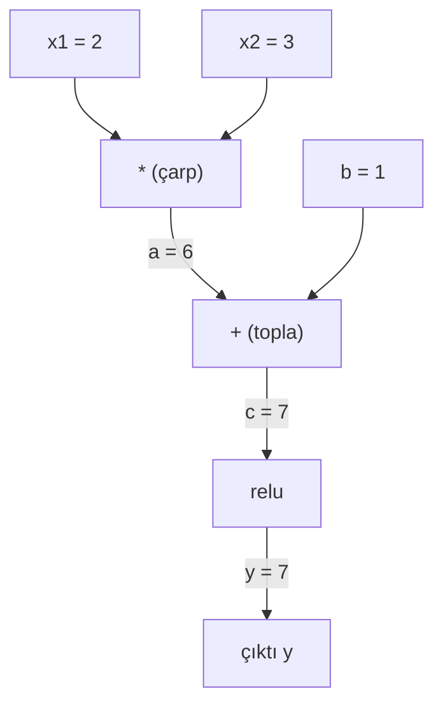
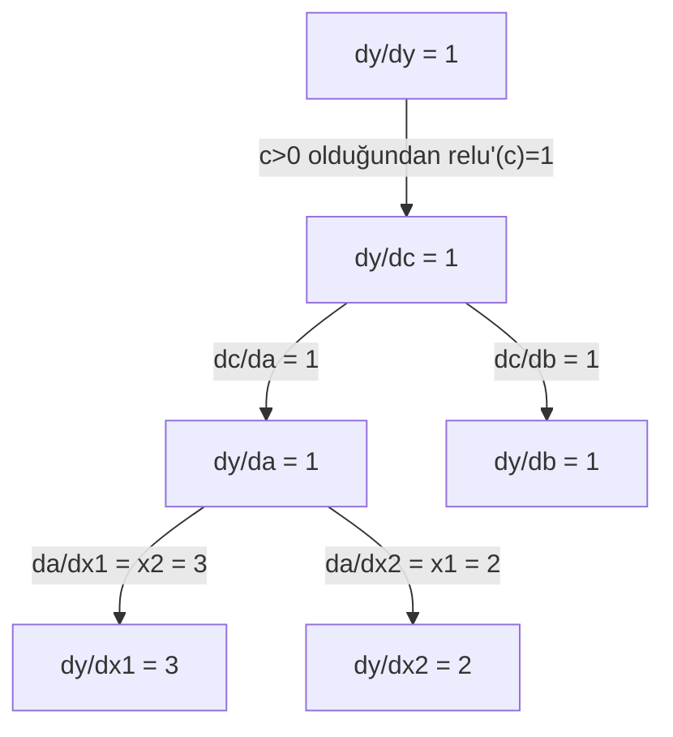

# Zincir Kuralı ve Otomatik Diferansiyasyon

> Zincir kuralı, öğrenen her sinir ağının arkasındaki motordur.

**Tür:** Yapım
**Dil:** Python
**Ön koşullar:** Faz 1, Ders 04 (Türevler ve Gradyanlar)
**Süre:** ~90 dakika

## Öğrenme Hedefleri

- İşlemleri kaydeden ve reverse-mode autodiff ile gradyanları hesaplayan minimal bir autograd motoru (Value sınıfı) inşa et
- Topolojik sıralama kullanarak bir hesaplama grafında forward ve backward pass'leri implemente et
- Sadece sıfırdan yazılmış autograd motorunu kullanarak XOR üzerinde bir multi-layer perceptron kur ve eğit
- Sayısal sonlu farklara karşı gradient checking ile autodiff doğruluğunu doğrula

## Sorun

Basit fonksiyonların türevlerini hesaplayabilirsin. Ama sinir ağı basit bir fonksiyon değil. Birbirine bileşik yüzlerce fonksiyondur: matris çarp, bias ekle, aktivasyon uygula, tekrar matris çarp, softmax, cross-entropy loss. Çıktı, bir fonksiyonun fonksiyonunun fonksiyonudur.

Ağı eğitmek için, loss'un her tek weight'e göre gradyanına ihtiyacın var. Milyonlarca parametre için bunu elle yapmak imkansız. Sayısal olarak (sonlu farklar) yapmak çok yavaş.

Zincir kuralı sana matematiği verir. Otomatik diferansiyasyon sana algoritmayı verir. Birlikte, tek bir forward pass ile orantılı bir sürede keyfi fonksiyon bileşimleri üzerinden tam gradyanlar hesaplamana izin verirler.

PyTorch, TensorFlow ve JAX böyle çalışır. Sıfırdan minik bir versiyonunu inşa edeceksin.

## Kavram

### Zincir Kuralı

Eğer `y = f(g(x))` ise, `y`'nin `x`'e göre türevi:

```
dy/dx = dy/dg * dg/dx = f'(g(x)) * g'(x)
```

Türevleri zincir boyunca çarp. Her halka kendi yerel türevini katkıda bulunur.

Örnek: `y = sin(x^2)`

```
g(x) = x^2       g'(x) = 2x
f(g) = sin(g)     f'(g) = cos(g)

dy/dx = cos(x^2) * 2x
```

Daha derin bileşimler için zincir uzar:

```
y = f(g(h(x)))

dy/dx = f'(g(h(x))) * g'(h(x)) * h'(x)
```

Bir sinir ağındaki her katman bu zincirdeki bir halkadır.

### Hesaplama Grafları

Hesaplama grafı zincir kuralını görsel hale getirir. Her işlem bir node olur. Veri graf boyunca ileri akar. Gradyanlar geri akar.

**Forward pass (değerleri hesapla):**



**Backward pass (gradyanları hesapla):**



Backward pass her node'da zincir kuralını uygular, gradyanları çıktıdan girdilere yayar.

### Forward Mode vs Reverse Mode

Bir graf boyunca zincir kuralını uygulamanın iki yolu var.

**Forward mode** girdilerden başlar ve türevleri ileri iter. `dx/dx = 1` hesaplar ve her işlem boyunca yayar. Az girdin ve çok çıktın olduğunda iyidir.

```
Forward mode: dx/dx = 1 ile tohumla, ileri yay

  x = 2       (dx/dx = 1)
  a = x^2     (da/dx = 2x = 4)
  y = sin(a)  (dy/dx = cos(a) * da/dx = cos(4) * 4 = -2.615)
```

**Reverse mode** çıktıdan başlar ve gradyanları geri çeker. `dy/dy = 1` hesaplar ve her işlem boyunca tersine yayar. Çok girdin ve az çıktın olduğunda iyidir.

```
Reverse mode: dy/dy = 1 ile tohumla, geri yay

  y = sin(a)  (dy/dy = 1)
  a = x^2     (dy/da = cos(a) = cos(4) = -0.654)
  x = 2       (dy/dx = dy/da * da/dx = -0.654 * 4 = -2.615)
```

Sinir ağlarının milyonlarca girdisi (weight) ve bir çıktısı (loss) vardır. Reverse mode tüm gradyanları bir backward pass'te hesaplar. Bu yüzden backpropagation reverse mode kullanır.

| Mode | Tohum | Yön | Ne zaman en iyi |
|------|------|-----------|-----------|
| Forward | `dx_i/dx_i = 1` | Girdiden çıktıya | Az girdi, çok çıktı |
| Reverse | `dy/dy = 1` | Çıktıdan girdiye | Çok girdi, az çıktı (sinir ağları) |

### Forward Mode için Dual Sayılar

Forward mode, dual sayılarla zarif bir şekilde implemente edilebilir. Bir dual sayı `a + b*epsilon` formundadır ve `epsilon^2 = 0`'dır.

```
Dual sayı: (değer, türev)

(2, 1) şu demek: değer 2, x'e göre türev 1

Aritmetik kuralları:
  (a, a') + (b, b') = (a+b, a'+b')
  (a, a') * (b, b') = (a*b, a'*b + a*b')
  sin(a, a')         = (sin(a), cos(a)*a')
```

Girdi değişkenini türev 1 ile tohumla. Türev her işlem boyunca otomatik yayılır.

### Bir Autograd Motoru İnşa Etmek

Bir autograd motorunun üç şeye ihtiyacı vardır:

1. **Değer sarma.** Her sayıyı değerini ve gradyanını saklayan bir nesneye sar.
2. **Graf kaydı.** Her işlem girdilerini ve yerel gradyan fonksiyonunu kaydeder.
3. **Backward pass.** Grafı topolojik olarak sırala, sonra tersine yürü, her node'da zincir kuralını uygula.

PyTorch'un `autograd`'ının yaptığı tam olarak budur. `torch.Tensor` sınıfı değerleri sarar, `requires_grad=True` olduğunda işlemleri kaydeder ve `.backward()` çağırdığında gradyanları hesaplar.

### PyTorch Autograd Kaputun Altında Nasıl Çalışır

PyTorch kodu yazdığında:

```python
x = torch.tensor(2.0, requires_grad=True)
y = x ** 2 + 3 * x + 1
y.backward()
print(x.grad)  # 7.0 = 2*x + 3 = 2*2 + 3
```

PyTorch içeride:

1. `x` için `requires_grad=True` olan bir `Tensor` node'u oluşturur
2. Her işlem (`**`, `*`, `+`) yeni bir node oluşturur ve backward fonksiyonunu kaydeder
3. `y.backward()` kaydedilen graf boyunca reverse-mode autodiff'i tetikler
4. Her node'un `grad_fn`'i yerel gradyanları hesaplar ve onları parent node'lara iletir
5. Gradyanlar `.grad` attribute'larında toplama ile birikir (değiştirme ile değil)

Graf dinamiktir (define-by-run). Her forward pass'te yeni bir graf inşa edilir. Bu yüzden PyTorch model içinde kontrol akışını (if/else, döngüler) destekler.

## İnşa Et

### Adım 1: Value sınıfı

```python
class Value:
    def __init__(self, data, children=(), op=''):
        self.data = data
        self.grad = 0.0
        self._backward = lambda: None
        self._prev = set(children)
        self._op = op

    def __repr__(self):
        return f"Value(data={self.data:.4f}, grad={self.grad:.4f})"
```

Her `Value` sayısal verisini, gradyanını (başlangıçta sıfır), bir backward fonksiyonunu ve onu üreten child node'lara pointer'ları saklar.

### Adım 2: Gradyan takibi ile aritmetik işlemler

```python
    def __add__(self, other):
        other = other if isinstance(other, Value) else Value(other)
        out = Value(self.data + other.data, (self, other), '+')
        def _backward():
            self.grad += out.grad
            other.grad += out.grad
        out._backward = _backward
        return out

    def __mul__(self, other):
        other = other if isinstance(other, Value) else Value(other)
        out = Value(self.data * other.data, (self, other), '*')
        def _backward():
            self.grad += other.data * out.grad
            other.grad += self.data * out.grad
        out._backward = _backward
        return out

    def relu(self):
        out = Value(max(0, self.data), (self,), 'relu')
        def _backward():
            self.grad += (1.0 if out.data > 0 else 0.0) * out.grad
        out._backward = _backward
        return out
```

Her işlem, yerel gradyanları nasıl hesaplayacağını ve upstream gradyan (`out.grad`) ile nasıl çarpacağını bilen bir closure oluşturur. `+=` bir değerin birden fazla işlemde kullanıldığı durumu ele alır.

### Adım 3: Backward pass

```python
    def backward(self):
        topo = []
        visited = set()
        def build_topo(v):
            if v not in visited:
                visited.add(v)
                for child in v._prev:
                    build_topo(child)
                topo.append(v)
        build_topo(self)

        self.grad = 1.0
        for v in reversed(topo):
            v._backward()
```

Topolojik sıralama, her node'un gradyanının child'larına yayılmadan önce tamamen hesaplandığından emin olur. Tohum gradyan 1.0'dır (dy/dy = 1).

### Adım 4: Tam bir motor için daha fazla işlem

Temel Value sınıfı toplama, çarpma ve relu'yu ele alır. Gerçek bir autograd motoruna daha fazlası gerekir. İşte sinir ağları inşa etmek için ihtiyacın olan işlemler:

```python
    def __neg__(self):
        return self * -1

    def __sub__(self, other):
        return self + (-other)

    def __radd__(self, other):
        return self + other

    def __rmul__(self, other):
        return self * other

    def __rsub__(self, other):
        return other + (-self)

    def __pow__(self, n):
        out = Value(self.data ** n, (self,), f'**{n}')
        def _backward():
            self.grad += n * (self.data ** (n - 1)) * out.grad
        out._backward = _backward
        return out

    def __truediv__(self, other):
        return self * (other ** -1) if isinstance(other, Value) else self * (Value(other) ** -1)

    def exp(self):
        import math
        e = math.exp(self.data)
        out = Value(e, (self,), 'exp')
        def _backward():
            self.grad += e * out.grad
        out._backward = _backward
        return out

    def log(self):
        import math
        out = Value(math.log(self.data), (self,), 'log')
        def _backward():
            self.grad += (1.0 / self.data) * out.grad
        out._backward = _backward
        return out

    def tanh(self):
        import math
        t = math.tanh(self.data)
        out = Value(t, (self,), 'tanh')
        def _backward():
            self.grad += (1 - t ** 2) * out.grad
        out._backward = _backward
        return out
```

**Her işlem neden önemli:**

| İşlem | Backward kuralı | Kullanıldığı yer |
|-----------|--------------|---------|
| `__sub__` | add + neg'i yeniden kullanır | Loss hesaplaması (pred - target) |
| `__pow__` | n * x^(n-1) | Polinom aktivasyonlar, MSE (error^2) |
| `__truediv__` | mul + pow(-1)'i yeniden kullanır | Normalizasyon, learning rate ölçekleme |
| `exp` | exp(x) * upstream | Softmax, log-likelihood |
| `log` | (1/x) * upstream | Cross-entropy loss, log olasılıkları |
| `tanh` | (1 - tanh^2) * upstream | Klasik aktivasyon fonksiyonu |

Akıllıca olan kısım: `__sub__` ve `__truediv__` mevcut işlemler cinsinden tanımlanır. Zincir kuralı altta yatan add/mul/pow işlemleri boyunca bileşik olduğu için bedavaya doğru gradyanları alırlar.

### Adım 5: Sıfırdan mini MLP

Tam bir Value sınıfı ile bir sinir ağı inşa edebilirsin. PyTorch yok. NumPy yok. Sadece Value'lar ve zincir kuralı.

```python
import random

class Neuron:
    def __init__(self, n_inputs):
        self.w = [Value(random.uniform(-1, 1)) for _ in range(n_inputs)]
        self.b = Value(0.0)

    def __call__(self, x):
        act = sum((wi * xi for wi, xi in zip(self.w, x)), self.b)
        return act.tanh()

    def parameters(self):
        return self.w + [self.b]

class Layer:
    def __init__(self, n_inputs, n_outputs):
        self.neurons = [Neuron(n_inputs) for _ in range(n_outputs)]

    def __call__(self, x):
        return [n(x) for n in self.neurons]

    def parameters(self):
        return [p for n in self.neurons for p in n.parameters()]

class MLP:
    def __init__(self, sizes):
        self.layers = [Layer(sizes[i], sizes[i+1]) for i in range(len(sizes)-1)]

    def __call__(self, x):
        for layer in self.layers:
            x = layer(x)
        return x[0] if len(x) == 1 else x

    def parameters(self):
        return [p for layer in self.layers for p in layer.parameters()]
```

Bir `Neuron`, `tanh(w1*x1 + w2*x2 + ... + b)` hesaplar. Bir `Layer` nöronlardan oluşan bir listedir. Bir `MLP` katmanları üst üste koyar. Her weight bir `Value`, dolayısıyla `loss.backward()` çağırmak gradyanları her parametreye yayar.

**XOR üzerinde eğitim:**

```python
random.seed(42)
model = MLP([2, 4, 1])  # 2 girdi, 4 gizli nöron, 1 çıktı

xs = [[0, 0], [0, 1], [1, 0], [1, 1]]
ys = [-1, 1, 1, -1]  # XOR deseni (tanh için -1/1 kullanıyor)

for step in range(100):
    preds = [model(x) for x in xs]
    loss = sum((p - y) ** 2 for p, y in zip(preds, ys))

    for p in model.parameters():
        p.grad = 0.0
    loss.backward()

    lr = 0.05
    for p in model.parameters():
        p.data -= lr * p.grad

    if step % 20 == 0:
        print(f"adım {step:3d}  loss = {loss.data:.4f}")

print("\nEğitim sonrası tahminler:")
for x, y in zip(xs, ys):
    print(f"  girdi={x}  hedef={y:2d}  tahmin={model(x).data:6.3f}")
```

Bu micrograd. Otomatik diferansiyasyonla saf Python'da eksiksiz bir sinir ağı eğitim döngüsü. Her ticari deep learning framework'ü aynı şeyi devasa ölçekte yapar.

### Adım 6: Gradient checking

Autodiff'inin doğru olduğunu nasıl bilirsin? Sayısal türevlerle karşılaştır. Bu gradient checking'tir.

```python
def gradient_check(build_expr, x_val, h=1e-7):
    x = Value(x_val)
    y = build_expr(x)
    y.backward()
    autodiff_grad = x.grad

    y_plus = build_expr(Value(x_val + h)).data
    y_minus = build_expr(Value(x_val - h)).data
    numerical_grad = (y_plus - y_minus) / (2 * h)

    diff = abs(autodiff_grad - numerical_grad)
    return autodiff_grad, numerical_grad, diff
```

Karmaşık bir ifade üzerinde test et:

```python
def expr(x):
    return (x ** 3 + x * 2 + 1).tanh()

ad, num, diff = gradient_check(expr, 0.5)
print(f"Autodiff:  {ad:.8f}")
print(f"Sayısal:   {num:.8f}")
print(f"Fark:      {diff:.2e}")
# Fark < 1e-5 olmalı
```

Gradient checking, yeni işlemleri implemente ederken esastır. Backward pass'inde bir bug varsa, sayısal kontrol onu yakalar. Her ciddi deep learning implementasyonu geliştirme sırasında gradient check çalıştırır.

**Gradient checking ne zaman kullanılır:**

| Durum | Gradient check yap? |
|-----------|-------------------|
| Autograd'a yeni bir işlem ekliyorsun | Evet, her zaman |
| Yakınsamayan bir eğitim döngüsünü debug ediyorsun | Evet, önce gradyanları kontrol et |
| Üretim eğitimi | Hayır, çok yavaş (parametre başına 2 forward pass) |
| Autograd kodu için unit testleri | Evet, otomatize et |

### Adım 7: Manuel hesaplamaya karşı doğrula

```python
x1 = Value(2.0)
x2 = Value(3.0)
a = x1 * x2          # a = 6.0
b = a + Value(1.0)    # b = 7.0
y = b.relu()          # y = 7.0

y.backward()

print(f"y = {y.data}")          # 7.0
print(f"dy/dx1 = {x1.grad}")   # 3.0 (= x2)
print(f"dy/dx2 = {x2.grad}")   # 2.0 (= x1)
```

Manuel kontrol: `y = relu(x1*x2 + 1)`. `x1*x2 + 1 = 7 > 0` olduğundan, relu identity'dir.
`dy/dx1 = x2 = 3`. `dy/dx2 = x1 = 2`. Motor eşleşiyor.

## Kullan

### PyTorch'a karşı doğrula

```python
import torch

x1 = torch.tensor(2.0, requires_grad=True)
x2 = torch.tensor(3.0, requires_grad=True)
a = x1 * x2
b = a + 1.0
y = torch.relu(b)
y.backward()

print(f"PyTorch dy/dx1 = {x1.grad.item()}")  # 3.0
print(f"PyTorch dy/dx2 = {x2.grad.item()}")  # 2.0
```

Aynı gradyanlar. Motorun PyTorch ile aynı sonucu hesaplar çünkü matematik aynıdır: zincir kuralı üzerinden reverse-mode autodiff.

### Daha karmaşık bir ifade

```python
a = Value(2.0)
b = Value(-3.0)
c = Value(10.0)
f = (a * b + c).relu()  # relu(2*(-3) + 10) = relu(4) = 4

f.backward()
print(f"df/da = {a.grad}")  # -3.0 (= b)
print(f"df/db = {b.grad}")  #  2.0 (= a)
print(f"df/dc = {c.grad}")  #  1.0
```

## Yayınla

Bu ders şunları üretir:
- `outputs/skill-autodiff.md` -- autograd sistemleri inşa etme ve debug etme için skill
- `code/autodiff.py` -- genişletebileceğin minimal bir autograd motoru

Burada inşa edilen Value sınıfı, Faz 3'teki sinir ağı eğitim döngüsünün temelidir.

## Alıştırmalar

1. Value sınıfına `__pow__` ekle, böylece `x ** n` hesaplayabilesin. `x=2`'de `d/dx(x^3)`'ün `12.0` olduğunu doğrula.

2. Aktivasyon fonksiyonu olarak `tanh` ekle. `tanh'(0) = 1` ve `tanh'(2) = 0.0707` (yaklaşık) olduğunu doğrula.

3. Tek bir nöron için bir hesaplama grafı inşa et: `y = relu(w1*x1 + w2*x2 + b)`. Beş gradyanın hepsini hesapla ve PyTorch'a karşı doğrula.

4. Dual sayıları kullanarak forward-mode autodiff implemente et. Bir `Dual` sınıfı oluştur ve reverse-mode motorunla aynı türevleri verdiğini doğrula.

## Anahtar Terimler

| Terim | İnsanlar ne der | Aslında ne demek |
|------|----------------|----------------------|
| Zincir kuralı | "Türevleri çarp" | Bileşik fonksiyonların türevi, her fonksiyonun doğru noktada değerlendirilen yerel türevinin çarpımına eşittir |
| Hesaplama grafı | "Ağ diyagramı" | Node'ların işlemler, kenarların değerleri (forward) veya gradyanları (backward) taşıdığı yönlü asiklik graf |
| Forward mode | "Türevleri ileri it" | Türevleri girdilerden çıktılara yayan autodiff. Girdi değişkeni başına bir pass. |
| Reverse mode | "Backpropagation" | Gradyanları çıktılardan girdilere yayan autodiff. Çıktı değişkeni başına bir pass. |
| Autograd | "Otomatik gradyanlar" | Değerler üzerindeki işlemleri kaydeden, bir graf inşa eden ve zincir kuralı üzerinden tam gradyanlar hesaplayan sistem |
| Dual sayılar | "Değer artı türev" | Aritmetik boyunca türev bilgisi taşıyan a + b*epsilon (epsilon^2 = 0) formundaki sayılar |
| Topolojik sıralama | "Bağımlılık sırası" | Her node tüm bağımlılıklarından sonra gelecek şekilde graf node'larını sıralama. Doğru gradyan yayılımı için gerekli. |
| Gradyan biriktirme | "Topla, değiştirme" | Bir değer birden fazla işleme beslendiğinde gradyanı tüm gelen gradyan katkılarının toplamıdır |
| Dinamik graf | "Define by run" | Her forward pass'te yeniden inşa edilen, model içinde Python kontrol akışına izin veren hesaplama grafı (PyTorch tarzı) |
| Gradient checking | "Sayısal doğrulama" | Doğruluğu doğrulamak için autodiff gradyanlarını sayısal sonlu fark gradyanlarına karşı karşılaştırma. Debug için esastır. |
| MLP | "Multi-layer perceptron" | Bir veya daha fazla gizli nöron katmanı olan sinir ağı. Her nöron ağırlıklı bir toplam artı bias hesaplar ve sonra bir aktivasyon fonksiyonu uygular. |
| Nöron | "Ağırlıklı toplam + aktivasyon" | Temel birim: output = activation(w1*x1 + w2*x2 + ... + b). Weight'ler ve bias öğrenilebilir parametrelerdir. |

## İleri Okuma

- [3Blue1Brown: Backpropagation calculus](https://www.youtube.com/watch?v=tIeHLnjs5U8) -- sinir ağlarında zincir kuralının görsel açıklaması
- [PyTorch Autograd mechanics](https://pytorch.org/docs/stable/notes/autograd.html) -- gerçek sistem nasıl çalışır
- [Baydin et al., Automatic Differentiation in Machine Learning: a Survey](https://arxiv.org/abs/1502.05767) -- kapsamlı referans
