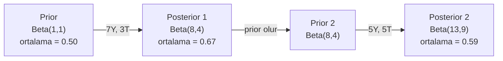

# Bayes Teoremi

> Olasılık beklediğin şeyle ilgilidir. Bayes teoremi öğrendiğin şeyle ilgilidir.

**Tür:** Yapım
**Dil:** Python
**Ön koşullar:** Faz 1, Ders 06 (Olasılık Temelleri)
**Süre:** ~75 dakika

## Öğrenme Hedefleri

- Bayes teoremini, prior'lar, likelihood'lar ve evidence'tan posterior olasılıklarını hesaplamak için uygula
- Laplace smoothing ve log uzayında hesaplama ile sıfırdan bir Naive Bayes metin sınıflandırıcısı inşa et
- MLE ve MAP tahminini karşılaştır ve MAP'in L2 regularization'a nasıl karşılık geldiğini açıkla
- A/B testi için Beta-Binomial conjugate prior'lar kullanarak ardışık Bayesçi güncelleme implemente et

## Sorun

Bir tıbbi test %99 doğru. Pozitif test sonucu aldın. Gerçekten hasta olma şansın nedir?

Çoğu insan %99 der. Gerçek cevap, hastalığın ne kadar nadir olduğuna bağlı. 10.000 kişiden 1'i bu hastalığa sahipse, pozitif bir sonuç sana sadece %1 civarında hasta olma şansı verir. Pozitif sonuçların diğer %99'u sağlıklı insanlardan gelen yanlış alarmlardır.

Bu hileli bir soru değil. Bu Bayes teoremi. Her spam filtresi, her tıbbi tanı, belirsizliği nicelleştiren her makine öğrenmesi modeli tam olarak bu mantığı kullanır. Bir inançla başlarsın. Kanıt görürsün. Güncellersin.

Bunu anlamadan ML sistemleri inşa edersen, model çıktılarını yanlış yorumlayacak, kötü eşikler belirleyecek ve aşırı özgüvenli tahminler yayınlayacaksın.

## Kavram

### Birleşik olasılıktan Bayes'e

Ders 06'dan zaten biliyorsun ki koşullu olasılık:

```
P(A|B) = P(A ve B) / P(B)
```

Ve simetrik olarak:

```
P(B|A) = P(A ve B) / P(A)
```

Her iki ifade de aynı payı paylaşır: P(A ve B). Onları eşitle ve yeniden düzenle:

```
P(A ve B) = P(A|B) * P(B) = P(B|A) * P(A)

Bu nedenle:

P(A|B) = P(B|A) * P(A) / P(B)
```

Bu Bayes teoremidir. Dört nicelik, bir denklem.

### Dört parça

| Parça | İsim | Ne demek |
|------|------|---------------|
| P(A\|B) | Posterior | Kanıt B'yi gördükten sonra A hakkındaki güncellenmiş inancın |
| P(B\|A) | Likelihood | A doğruysa B kanıtının ne kadar olası olduğu |
| P(A) | Prior | Herhangi bir kanıt görmeden önce A hakkındaki inancın |
| P(B) | Evidence | B'yi tüm olasılıklar altında görmenin toplam olasılığı |

Evidence terimi P(B) bir normalleştirici görevi görür. Toplam olasılık yasasını kullanarak onu açabilirsin:

```
P(B) = P(B|A) * P(A) + P(B|A değil) * P(A değil)
```

### Tıbbi test örneği

Bir hastalık 10.000 kişiden 1'ini etkiliyor. Test %99 doğru (hasta insanların %99'unu yakalar, %1 oranında yanlış pozitif verir).

```
P(hasta)          = 0.0001     (prior: hastalık nadirdir)
P(pozitif|hasta) = 0.99       (likelihood: test onu yakalar)
P(pozitif|sağlıklı) = 0.01    (yanlış pozitif oranı)

P(pozitif) = P(pozitif|hasta) * P(hasta) + P(pozitif|sağlıklı) * P(sağlıklı)
           = 0.99 * 0.0001 + 0.01 * 0.9999
           = 0.000099 + 0.009999
           = 0.010098

P(hasta|pozitif) = P(pozitif|hasta) * P(hasta) / P(pozitif)
                 = 0.99 * 0.0001 / 0.010098
                 = 0.0098
                 = %0.98
```

%1'den az. Prior hakim. Bir durum nadir olduğunda, doğru testler bile çoğunlukla yanlış pozitif üretir. Bu yüzden doktorlar doğrulama testleri ister.

### Spam filtresi örneği

"piyango" kelimesini içeren bir e-posta aldın. Spam mi?

```
P(spam)                = 0.3      (e-postanın %30'u spam)
P("piyango"|spam)      = 0.05     (spam e-postaların %5'i "piyango" içerir)
P("piyango"|spam değil)= 0.001    (meşru e-postaların %0.1'i "piyango" içerir)

P("piyango") = 0.05 * 0.3 + 0.001 * 0.7
             = 0.015 + 0.0007
             = 0.0157

P(spam|"piyango") = 0.05 * 0.3 / 0.0157
                  = 0.955
                  = %95.5
```

Bir kelime olasılığı %30'dan %95.5'e kaydırır. Gerçek bir spam filtresi Bayes'i yüzlerce kelimeye aynı anda uygular.

### Naive Bayes: bağımsızlık varsayımı

Naive Bayes bunu birden çok feature'a, sınıf verildiğinde tüm feature'ların koşullu olarak bağımsız olduğunu varsayarak genişletir:

```
P(sınıf | feature_1, feature_2, ..., feature_n)
  = P(sınıf) * P(feature_1|sınıf) * P(feature_2|sınıf) * ... * P(feature_n|sınıf)
    / P(feature_1, feature_2, ..., feature_n)
```

"Naive" kısmı bağımsızlık varsayımı. Metinde kelime tekrarları bağımsız değildir ("New" ve "York" ilişkilidir). Ama varsayım pratikte şaşırtıcı şekilde iyi çalışır çünkü sınıflandırıcının sadece sınıfları sıralaması gerekir, kalibre edilmiş olasılıklar üretmesi gerekmez.

Payda tüm sınıflar için aynı olduğundan, onu atlayıp sadece payları karşılaştırabilirsin:

```
score(sınıf) = P(sınıf) * P(feature_i | sınıf)'ların çarpımı
```

En yüksek skora sahip sınıfı seç.

### Maximum likelihood estimation (MLE)

Eğitim verisinden P(feature|sınıf)'ı nasıl alırsın? Say.

```
P("ücretsiz"|spam) = ("ücretsiz" içeren spam e-posta sayısı) / (toplam spam e-posta)
```

Bu MLE'dir: gözlemlenen veriyi en olası kılan parametre değerlerini seç. Likelihood fonksiyonunu maksimize ediyorsun, ki kesikli sayımlar için bu göreli frekansa indirgenir.

Problem: eğitim sırasında bir kelime spam'de hiç görünmüyorsa, MLE ona sıfır olasılık verir. Görülmemiş bir kelime tüm çarpımı öldürür. Laplace smoothing ile bunu düzelt:

```
P(kelime|sınıf) = (count(kelime, sınıf) + 1) / (sınıftaki_toplam_kelime + vocab_size)
```

Her sayıma 1 eklemek hiçbir olasılığın sıfır olmamasını sağlar.

### Maximum a posteriori (MAP)

MLE şunu sorar: hangi parametreler P(data|parametreler)'i maksimize eder?

MAP şunu sorar: hangi parametreler P(parametreler|data)'yı maksimize eder?

Bayes teoremine göre:

```
P(parametreler|data) ile orantılı P(data|parametreler) * P(parametreler)
```

MAP parametrelerin kendisi üzerine bir prior ekler. Parametrelerin küçük olması gerektiğine inanıyorsan, bunu büyük değerleri cezalandıran bir prior olarak kodlarsın. Bu, ML'deki L2 regularization ile aynıdır. Ridge regression'daki "ridge" ceza terimi tam anlamıyla weight'ler üzerine bir Gauss prior'dur.

| Tahmin | Optimize eder | ML karşılığı |
|------------|-----------|---------------|
| MLE | P(data\|parametreler) | Regularize edilmemiş eğitim |
| MAP | P(data\|parametreler) * P(parametreler) | L2 / L1 regularization |

### Bayesçi vs frekansçı: pratik fark

Frekansçılar parametreleri sabit bilinmeyenler olarak ele alır. Şunu sorarlar: "Bu deneyi birçok kez tekrarlasaydım ne olurdu?"

Bayesçiler parametreleri dağılımlar olarak ele alır. Şunu sorarlar: "Gözlemlediğim şey verildiğinde, parametreler hakkında ne düşünüyorum?"

ML sistemleri inşa etmek için pratik fark:

| Boyut | Frekansçı | Bayesçi |
|--------|-------------|----------|
| Çıktı | Nokta tahmini | Değerler üzerinde dağılım |
| Belirsizlik | Confidence interval (prosedür hakkında) | Credible interval (parametre hakkında) |
| Az veri | Overfit edebilir | Prior regularization gibi davranır |
| Hesaplama | Genelde daha hızlı | Sıklıkla sampling gerektirir (MCMC) |

Çoğu üretim ML'i frekansçıdır (SGD, nokta tahminleri). Bayesçi yöntemler kalibre edilmiş belirsizliğe ihtiyacın olduğunda (tıbbi kararlar, güvenlik kritik sistemler) veya veri kıt olduğunda (few-shot öğrenme, cold start) parlar.

### Bayesçi düşünme ML için neden önemli

Bağlantı analojinin ötesinde derindir:

**Prior'lar regularization'dır.** Weight'ler üzerine Gauss prior L2 regularization'dır. Laplace prior L1'dir. Bir regularization terimi eklediğinde, hangi parametre değerlerini beklediğin hakkında Bayesçi bir ifade yapıyorsun.

**Posterior'lar belirsizliktir.** Tek bir tahmin edilen olasılık, modelin o tahminden ne kadar emin olduğu hakkında sana hiçbir şey söylemez. Bayesçi yöntemler sana bir dağılım verir: "P(spam)'in 0.8 ile 0.95 arasında olduğunu düşünüyorum."

**Bayes güncellemeleri online öğrenmedir.** Bugünün posterior'u yarının prior'u olur. Modelin yeni veri gördüğünde, sıfırdan yeniden eğitmek yerine inançlarını artımlı olarak günceller.

**Model karşılaştırması Bayesçidir.** Bayesian information criterion (BIC), marjinal likelihood ve Bayes faktörleri, overfit etmeden modeller arasında seçim yapmak için Bayesçi mantık kullanır.

## İnşa Et

### Adım 1: Bayes teoremi fonksiyonu

```python
def bayes(prior, likelihood, false_positive_rate):
    evidence = likelihood * prior + false_positive_rate * (1 - prior)
    posterior = likelihood * prior / evidence
    return posterior

result = bayes(prior=0.0001, likelihood=0.99, false_positive_rate=0.01)
print(f"P(hasta|pozitif) = {result:.4f}")
```

### Adım 2: Naive Bayes sınıflandırıcı

```python
import math
from collections import defaultdict

class NaiveBayes:
    def __init__(self, smoothing=1.0):
        self.smoothing = smoothing
        self.class_counts = defaultdict(int)
        self.word_counts = defaultdict(lambda: defaultdict(int))
        self.class_word_totals = defaultdict(int)
        self.vocab = set()

    def train(self, documents, labels):
        for doc, label in zip(documents, labels):
            self.class_counts[label] += 1
            words = doc.lower().split()
            for word in words:
                self.word_counts[label][word] += 1
                self.class_word_totals[label] += 1
                self.vocab.add(word)

    def predict(self, document):
        words = document.lower().split()
        total_docs = sum(self.class_counts.values())
        vocab_size = len(self.vocab)
        best_class = None
        best_score = float("-inf")
        for cls in self.class_counts:
            score = math.log(self.class_counts[cls] / total_docs)
            for word in words:
                count = self.word_counts[cls].get(word, 0)
                total = self.class_word_totals[cls]
                score += math.log((count + self.smoothing) / (total + self.smoothing * vocab_size))
            if score > best_score:
                best_score = score
                best_class = cls
        return best_class
```

Log olasılıkları underflow'u önler. Birçok küçük olasılığı çarpmak floating point için çok küçük sayılar üretir. Log olasılıklarını toplamak sayısal olarak kararlıdır ve matematiksel olarak eşdeğerdir.

### Adım 3: Spam verisi üzerinde eğit

```python
train_docs = [
    "win free money now",
    "free lottery ticket winner",
    "claim your prize today free",
    "urgent offer free cash",
    "congratulations you won free",
    "meeting tomorrow at noon",
    "project update attached",
    "can we schedule a call",
    "quarterly report review",
    "lunch on thursday sounds good",
    "team standup notes attached",
    "please review the pull request",
]

train_labels = [
    "spam", "spam", "spam", "spam", "spam",
    "ham", "ham", "ham", "ham", "ham", "ham", "ham",
]

classifier = NaiveBayes()
classifier.train(train_docs, train_labels)

test_messages = [
    "free money waiting for you",
    "meeting rescheduled to friday",
    "you won a free prize",
    "please review the attached report",
]

for msg in test_messages:
    print(f"  '{msg}' -> {classifier.predict(msg)}")
```

### Adım 4: Öğrenilen olasılıkları incele

```python
def show_top_words(classifier, cls, n=5):
    vocab_size = len(classifier.vocab)
    total = classifier.class_word_totals[cls]
    probs = {}
    for word in classifier.vocab:
        count = classifier.word_counts[cls].get(word, 0)
        probs[word] = (count + classifier.smoothing) / (total + classifier.smoothing * vocab_size)
    sorted_words = sorted(probs.items(), key=lambda x: x[1], reverse=True)
    for word, prob in sorted_words[:n]:
        print(f"    {word}: {prob:.4f}")

print("\nEn üstteki spam kelimeleri:")
show_top_words(classifier, "spam")
print("\nEn üstteki ham kelimeleri:")
show_top_words(classifier, "ham")
```

## Kullan

Scikit-learn üretim hazır naive Bayes implementasyonları sağlar:

```python
from sklearn.feature_extraction.text import CountVectorizer
from sklearn.naive_bayes import MultinomialNB
from sklearn.metrics import classification_report

vectorizer = CountVectorizer()
X_train = vectorizer.fit_transform(train_docs)
clf = MultinomialNB()
clf.fit(X_train, train_labels)

X_test = vectorizer.transform(test_messages)
predictions = clf.predict(X_test)
for msg, pred in zip(test_messages, predictions):
    print(f"  '{msg}' -> {pred}")
```

Aynı algoritma. CountVectorizer tokenizasyon ve kelime hazinesi inşasını ele alır. MultinomialNB smoothing ve log olasılıklarını içeride halleder. Sıfırdan versiyonun aynı şeyi 40 satırda yapar.

## Yayınla

Burada inşa edilen NaiveBayes sınıfı tüm pipeline'ı gösterir: tokenizasyon, Laplace smoothing ile olasılık tahmini, log uzayında tahmin. `code/bayes.py`'deki kod Python'ın standart kütüphanesi dışında bağımlılık olmadan uçtan uca çalışır.

### Conjugate Prior'lar

Prior ve posterior aynı dağılım ailesine ait olduğunda, prior'a "conjugate" denir. Bu, Bayesçi güncellemeyi cebirsel olarak temiz yapar — sayısal integral olmadan kapalı form posterior alırsın.

| Likelihood | Conjugate Prior | Posterior | Örnek |
|-----------|----------------|-----------|---------|
| Bernoulli | Beta(a, b) | Beta(a + başarılar, b + başarısızlıklar) | Yazı-tura yanlılığı tahmini |
| Normal (bilinen varyans) | Normal(mu_0, sigma_0) | Normal(ağırlıklı ortalama, daha küçük varyans) | Sensör kalibrasyonu |
| Poisson | Gamma(a, b) | Gamma(a + sayım toplamı, b + n) | Varış oranlarını modelleme |
| Multinomial | Dirichlet(alpha) | Dirichlet(alpha + sayımlar) | Topic modeling, dil modelleri |

Bu neden önemli: conjugate prior'lar olmadan posterior'u yaklaşıklamak için Monte Carlo sampling veya variational inference gerekir. Conjugate prior'larla sadece iki sayı güncellersin.

Beta dağılımı pratikte en yaygın conjugate prior'dur. Beta(a, b) bir olasılık parametresi hakkındaki inancını temsil eder. Ortalama a/(a+b)'dir. a+b ne kadar büyükse, dağılım o kadar yoğun (güvenli) olur.

Beta prior'un özel durumları:
- Beta(1, 1) = uniform. Parametre hakkında bir fikrin yok.
- Beta(10, 10) = 0.5'te tepeli. Parametrenin 0.5 yakınında olduğuna güçlü inanırsın.
- Beta(1, 10) = 0'a doğru çarpık. Parametrenin küçük olduğuna inanırsın.

Güncelleme kuralı son derece basittir:

```
Prior:     Beta(a, b)
Veri:      s başarı, f başarısızlık
Posterior: Beta(a + s, b + f)
```

İntegral yok. Sampling yok. Sadece toplama.

### Ardışık Bayesçi Güncelleme

Bayesçi çıkarım doğal olarak ardışıktır. Bugünün posterior'u yarının prior'u olur. Gerçek sistemler tüm geçmiş veriyi yeniden işlemeden artımlı olarak böyle öğrenir.

Somut örnek: bir paranın adil olup olmadığını tahmin etmek.

**Gün 1: Henüz veri yok.**
Beta(1, 1) ile başla — uniform prior. Fikrin yok.
- Prior ortalama: 0.5
- Prior [0, 1] üzerinde düzdür

**Gün 2: 7 yazı, 3 tura gözle.**
Posterior = Beta(1 + 7, 1 + 3) = Beta(8, 4)
- Posterior ortalama: 8/12 = 0.667
- Kanıt madeni paranın yazıya doğru yanlı olduğunu öneriyor

**Gün 3: 5 yazı, 5 tura daha gözle.**
Dünkü posterior'u bugünün prior'u olarak kullan.
Posterior = Beta(8 + 5, 4 + 5) = Beta(13, 9)
- Posterior ortalama: 13/22 = 0.591
- Dengeli yeni veri tahmini 0.5'e geri çekti



Gözlemlerin sırası önemli değildir. Beta(1,1) tüm 12 yazı ve 8 tura ile bir kerede güncellenirse Beta(13, 9) verir — aynı sonuç. Ardışık güncelleme ve batch güncelleme matematiksel olarak eşdeğerdir. Ama ardışık güncelleme her adımda ham veriyi depolamadan karar vermeni sağlar.

Bu üretim ML sistemlerinde online öğrenmenin temelidir. Bandit'ler için Thompson sampling, artımlı öneri sistemleri ve streaming anomali dedektörlerinin hepsi bu deseni kullanır.

### A/B Testi ile Bağlantı

A/B testi kılık değiştirmiş Bayesçi çıkarımdır.

Kurulum: iki buton rengini test ediyorsun. Varyant A (mavi) ve varyant B (yeşil). Hangisinin daha fazla tıklama aldığını bilmek istiyorsun.

Bayesçi A/B testi:

1. **Prior.** Her iki varyant için Beta(1, 1) ile başla. Önceden tercih yok.
2. **Veri.** Varyant A: 1000 görüntülemede 50 tıklama. Varyant B: 1000 görüntülemede 65 tıklama.
3. **Posterior'lar.**
   - A: Beta(1 + 50, 1 + 950) = Beta(51, 951). Ortalama = 0.051
   - B: Beta(1 + 65, 1 + 935) = Beta(66, 936). Ortalama = 0.066
4. **Karar.** P(B > A)'yı hesapla — B'nin gerçek conversion rate'inin A'nınkinden yüksek olma olasılığı.

P(B > A)'yı analitik olarak hesaplamak zor. Ama Monte Carlo bunu önemsiz kılar:

```
1. Beta(51, 951)'den 100.000 örnek çek  -> samples_A
2. Beta(66, 936)'dan 100.000 örnek çek  -> samples_B
3. P(B > A) = B > A olan örneklerin oranı
```

P(B > A) > 0.95 ise, varyant B'yi yayınlarsın. 0.05 ile 0.95 arasındaysa, veri toplamaya devam edersin. P(B > A) < 0.05 ise, varyant A'yı yayınlarsın.

Frekansçı A/B testine göre avantajlar:
- Doğrudan olasılık ifadesi alırsın: "B'nin daha iyi olma şansı %97"
- p-değeri karışıklığı yok. "Null hipotezi reddetmekte başarısız" çekincesi yok.
- Yanlış pozitif oranlarını şişirmeden istediğin zaman sonuçları kontrol edebilirsin ("peeking problem" yok)
- Önceki bilgiyi dahil edebilirsin (örn. önceki testler conversion rate'lerin genelde %3-8 arasında olduğunu öneriyor)

| Boyut | Frekansçı A/B | Bayesçi A/B |
|--------|----------------|--------------|
| Çıktı | p-değeri | P(B > A) |
| Yorum | "A=B olsaydı bu veri ne kadar şaşırtıcı olurdu?" | "B'nin A'dan iyi olma olasılığı nedir?" |
| Erken durdurma | Yanlış pozitifleri şişirir | Herhangi bir noktada güvenli (iyi seçilmiş bir prior ve doğru belirlenmiş model verildiğinde) |
| Önceki bilgi | Kullanılmaz | Beta prior olarak kodlanır |
| Karar kuralı | p < 0.05 | P(B > A) > eşik |

## Alıştırmalar

1. **Çoklu testler.** Bir hasta iki bağımsız testte pozitif çıkıyor (ikisi de %99 doğru, hastalık prevalansı 10.000'de 1). İki test sonrası P(hasta) nedir? İlk testin posterior'unu ikinci için prior olarak kullan.

2. **Smoothing etkisi.** Spam sınıflandırıcıyı 0.01, 0.1, 1.0 ve 10.0 smoothing değerleriyle çalıştır. En üst kelime olasılıkları nasıl değişiyor? Smoothing=0 ve sadece ham'de görünen bir kelime ile ne olur?

3. **Feature ekle.** NaiveBayes sınıfını mesaj uzunluğunu (kısa/uzun) da kelime sayımlarının yanında bir feature olarak kullanacak şekilde genişlet. Eğitim verisinden P(kısa|spam) ve P(kısa|ham)'i tahmin et ve tahmin skoruna katla.

4. **Elle MAP.** Gözlemlenen veri (10 yazı-tura atışından 7 yazı) verildiğinde, Beta(2,2) prior kullanarak yanlılığın MAP tahminini hesapla. MLE tahmini (7/10) ile karşılaştır.

## Anahtar Terimler

| Terim | İnsanlar ne der | Aslında ne demek |
|------|----------------|----------------------|
| Prior | "İlk tahminim" | Kanıt gözlemlemeden önce P(hipotez). ML'de: regularization terimi. |
| Likelihood | "Verinin ne kadar uyduğu" | P(kanıt\|hipotez). Belirli bir hipotez altında gözlemlenen verinin ne kadar olası olduğu. |
| Posterior | "Güncellenmiş inancım" | P(hipotez\|kanıt). Prior likelihood ile çarpılır, sonra normalleştirilir. |
| Evidence | "Normalleştirme sabiti" | Tüm hipotezler boyunca P(veri). Posterior'un 1'e toplanmasını sağlar. |
| Naive Bayes | "Şu basit metin sınıflandırıcı" | Feature'ların sınıf verildiğinde bağımsız olduğunu varsayan sınıflandırıcı. Yanlış varsayıma rağmen iyi çalışır. |
| Laplace smoothing | "Bir ekle smoothing" | Görünmeyen veriden sıfır olasılıkları önlemek için her feature'a küçük bir sayım ekleme. |
| MLE | "Sadece frekansları kullan" | P(veri\|parametreler)'i maksimize eden parametreleri seç. Prior yok. Az veriyle overfit edebilir. |
| MAP | "Prior'lı MLE" | P(veri\|parametreler) * P(parametreler)'i maksimize eden parametreleri seç. Regularize edilmiş MLE'ye eşdeğer. |
| Log olasılığı | "Log uzayında çalış" | Birçok küçük sayıyı çarparken floating-point underflow'unu önlemek için P yerine log(P) kullanma. |
| Yanlış pozitif | "Yanlış alarm" | Test pozitif diyor ama gerçek durum negatif. Base rate fallacy'sini sürükler. |

## İleri Okuma

- [3Blue1Brown: Bayes' theorem](https://www.youtube.com/watch?v=HZGCoVF3YvM) - tıbbi test örneği ile görsel açıklama
- [Stanford CS229: Generative Learning Algorithms](https://cs229.stanford.edu/notes2022fall/cs229-notes2.pdf) - naive Bayes ve diskriminatif modellerle bağlantısı
- [Think Bayes](https://greenteapress.com/wp/think-bayes/) - ücretsiz kitap, Python kodu ile Bayesçi istatistik
- [scikit-learn Naive Bayes](https://scikit-learn.org/stable/modules/naive_bayes.html) - üretim implementasyonları ve hangi varyantın ne zaman kullanılacağı
