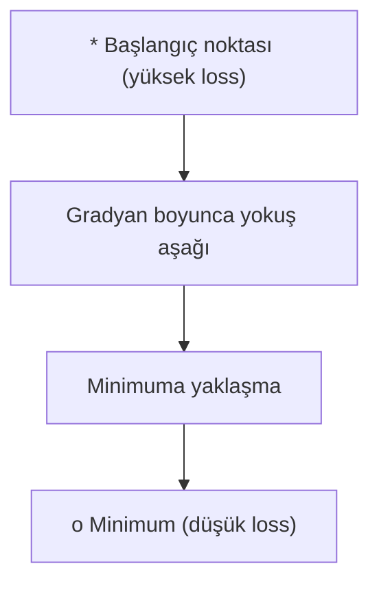
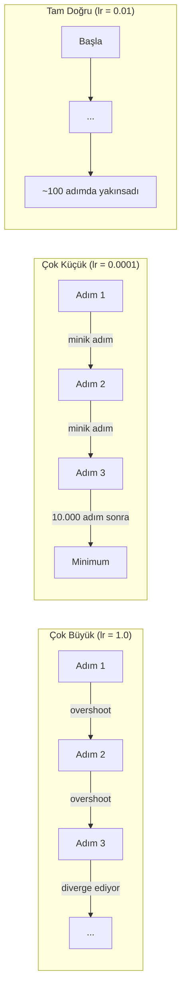
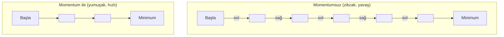
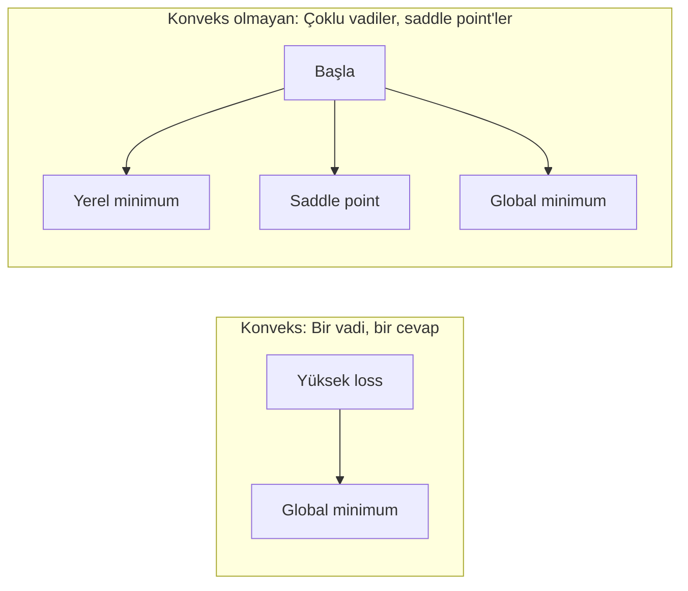
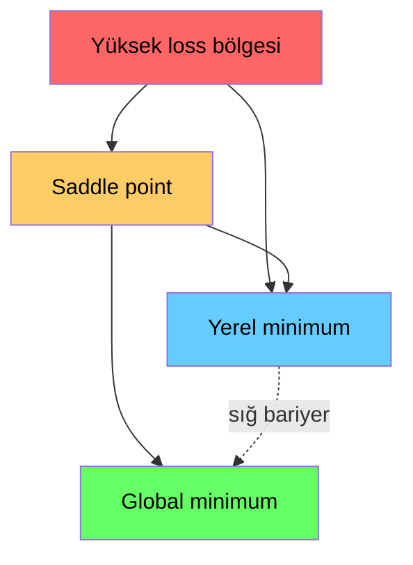

# Optimizasyon

> Bir sinir ağını eğitmek, bir vadinin dibini bulmaktan başka bir şey değildir.

**Tür:** Yapım
**Dil:** Python
**Ön koşullar:** Faz 1, Ders 04-05 (Türevler, Gradyanlar)
**Süre:** ~75 dakika

## Öğrenme Hedefleri

- Vanilla gradient descent, momentum'lu SGD ve Adam'ı sıfırdan implemente et
- Rosenbrock fonksiyonu üzerinde optimizer yakınsamasını karşılaştır ve Adam'ın neden weight başına learning rate'leri adapte ettiğini açıkla
- Konveks olan loss landscape'lerini konveks olmayanlardan ayır ve yüksek boyutlarda saddle point'lerin rolünü açıkla
- Eğitim kararlılığı için learning rate schedule'larını (step decay, cosine annealing, warmup) yapılandır

## Sorun

Bir loss fonksiyonun var. Sana modelinin ne kadar yanlış olduğunu söylüyor. Gradyanların var. Sana hangi yönün loss'u kötüleştirdiğini söylüyorlar. Şimdi yokuş aşağı yürümek için bir stratejiye ihtiyacın var.

Naif yaklaşım basit: gradyanın tersine hareket et. Adımı learning rate denilen bir sayıyla ölçekle. Tekrarla. Bu gradient descent ve çalışıyor. Ama "çalışıyor"un çekinceleri var. Çok büyük learning rate ile vadiyi tamamen geçer, duvarlar arasında zıplarsın. Çok küçük olursa, gereksiz binlerce adımla cevaba doğru sürünürsün. Bir saddle point'e çarp ve bir minimum bulmamış olsan bile hareket etmeyi durdur.

Deep learning'deki her optimizer aynı sorunun cevabıdır: vadinin dibine nasıl daha hızlı ve daha güvenilir şekilde inersin?

## Kavram

### Optimizasyon ne demek

Optimizasyon, bir fonksiyonu minimize (veya maksimize) eden girdi değerlerini bulmaktır. Makine öğrenmesinde, fonksiyon loss'tur. Girdiler modelin weight'leridir. Eğitim optimizasyondur.

```
L(w)'yi minimize et, burada:
  L = loss fonksiyonu
  w = model weight'leri (milyonlarca parametre olabilir)
```

### Gradient descent (vanilla)

En basit optimizer. Loss'un her weight'e göre gradyanını hesapla. Her weight'i gradyanının tersine hareket ettir. Adımı learning rate ile ölçekle.

```
w = w - lr * gradient
```

Tüm algoritma bu. Bir satır.



### Learning rate: en önemli hiperparametre

Learning rate adım büyüklüğünü kontrol eder. Yakınsama hakkında her şeyi belirler.



Doğru learning rate için formül yok. Deneyle bulursun. Yaygın başlangıç noktaları: Adam için 0.001, momentum'lu SGD için 0.01.

### SGD vs batch vs mini-batch

Vanilla gradient descent bir adım atmadan önce tüm veri seti üzerinden gradyanı hesaplar. Buna batch gradient descent denir. Kararlıdır ama yavaştır.

Stochastic gradient descent (SGD) tek bir rastgele örnek üzerinde gradyanı hesaplar ve hemen adım atar. Gürültülüdür ama hızlıdır.

Mini-batch gradient descent farkı böler. Küçük bir batch üzerinde (32, 64, 128, 256 örnek) gradyanı hesapla, sonra adım at. Herkesin aslında kullandığı budur.

| Varyant | Batch boyutu | Gradyan kalitesi | Adım başına hız | Gürültü |
|---------|-----------|-----------------|---------------|-------|
| Batch GD | Tüm veri seti | Tam | Yavaş | Yok |
| SGD | 1 örnek | Çok gürültülü | Hızlı | Yüksek |
| Mini-batch | 32-256 | İyi tahmin | Dengeli | Orta |

SGD ve mini-batch'teki gürültü bir bug değil. Sığ yerel minimumlardan ve saddle point'lerden kaçmaya yardımcı olur.

### Momentum: yokuş aşağı yuvarlanan top

Vanilla gradient descent sadece mevcut gradyana bakar. Gradyan zikzak çiziyorsa (dar vadilerde yaygın), ilerleme yavaştır. Momentum geçmiş gradyanları bir velocity terimine biriktirerek bunu düzeltir.

```
v = beta * v + gradient
w = w - lr * v
```

Analoji: yokuş aşağı yuvarlanan bir top. Her tümsekte durup yeniden başlamaz. Tutarlı yönlerde hız kazanır ve salınımları söndürür.



`beta` (tipik olarak 0.9) ne kadar geçmiş tutulacağını kontrol eder. Daha yüksek beta daha fazla momentum, daha yumuşak yollar, ama yön değişikliklerine daha yavaş tepki demektir.

### Adam: adaptif learning rate'ler

Farklı weight'lerin farklı learning rate'lere ihtiyacı vardır. Nadiren büyük gradyan alan bir weight, nihayet aldığında daha büyük adımlar atmalıdır. Sürekli devasa gradyanlar alan bir weight daha küçük adımlar atmalıdır.

Adam (Adaptive Moment Estimation) weight başına iki şey takip eder:

1. Birinci moment (m): gradyanların hareketli ortalaması (momentum gibi)
2. İkinci moment (v): kare gradyanların hareketli ortalaması (gradyan büyüklüğü)

```
m = beta1 * m + (1 - beta1) * gradient
v = beta2 * v + (1 - beta2) * gradient^2

m_hat = m / (1 - beta1^t)    bias correction
v_hat = v / (1 - beta2^t)    bias correction

w = w - lr * m_hat / (sqrt(v_hat) + epsilon)
```

`sqrt(v_hat)`'a bölme anahtar içgörüdür. Büyük gradyanlı weight'ler büyük bir sayıya bölünür (küçük efektif adım). Küçük gradyanlı weight'ler küçük bir sayıya bölünür (büyük efektif adım). Her weight kendi adaptif learning rate'ini alır.

Varsayılan hiperparametreler: `lr=0.001, beta1=0.9, beta2=0.999, epsilon=1e-8`. Bu varsayılanlar çoğu problem için iyi çalışır.

### Learning rate schedule'ları

Sabit bir learning rate bir uzlaşmadır. Eğitimin başında, hızlı ilerleme için büyük adımlar istersin. Eğitimin sonunda, minimumun yakınında ince ayar yapmak için küçük adımlar istersin.

Yaygın schedule'lar:

| Schedule | Formül | Kullanım durumu |
|----------|---------|----------|
| Step decay | her N epoch'ta lr = lr * factor | Basit, manuel kontrol |
| Exponential decay | lr = lr_0 * decay^t | Yumuşak azaltma |
| Cosine annealing | lr = lr_min + 0.5 * (lr_max - lr_min) * (1 + cos(pi * t / T)) | Transformer'lar, modern eğitim |
| Warmup + decay | Lineer rampa, sonra azalt | Büyük modeller, erken kararsızlığı önler |

### Konveks vs konveks olmayan

Konveks bir fonksiyonun bir minimumu vardır. Gradient descent onu her zaman bulur. `f(x) = x^2` gibi bir quadratic konvekstir.

Sinir ağı loss fonksiyonları konveks değildir. Birçok yerel minimum, saddle point ve düz bölgeye sahiptirler.



Pratikte, yüksek boyutlu sinir ağlarındaki yerel minimumlar nadiren sorundur. Çoğu yerel minimumun loss değerleri global minimuma yakındır. Saddle point'ler (bazı yönlerde düz, diğerlerinde eğri) gerçek engeldir. Momentum ve mini-batch'lerden gelen gürültü onlardan kaçmaya yardım eder.

### Loss landscape görselleştirmesi

Loss tüm weight'lerin bir fonksiyonudur. 1 milyon weight'li bir model için, loss landscape 1.000.001 boyutlu uzayda yaşar. Weight uzayında iki rastgele yön seçerek ve loss'u o yönler boyunca çizerek görselleştiririz, bu da 2B bir yüzey üretir.



Keskin minimumlar kötü genelleşir. Düz minimumlar iyi genelleşir. Bu, momentum'lu SGD'nin Adam'a göre çoğu zaman daha iyi final test doğruluğu vermesinin bir nedenidir: gürültüsü keskin minimumlara yerleşmeyi önler.

## İnşa Et

### Adım 1: Bir test fonksiyonu tanımla

Rosenbrock fonksiyonu klasik bir optimizasyon benchmark'ıdır. Minimumu (1, 1)'dedir ve dar, eğri bir vadinin içindedir — bulması kolay ama takip etmesi zor.

```
f(x, y) = (1 - x)^2 + 100 * (y - x^2)^2
```

```python
def rosenbrock(params):
    x, y = params
    return (1 - x) ** 2 + 100 * (y - x ** 2) ** 2

def rosenbrock_gradient(params):
    x, y = params
    df_dx = -2 * (1 - x) + 200 * (y - x ** 2) * (-2 * x)
    df_dy = 200 * (y - x ** 2)
    return [df_dx, df_dy]
```

### Adım 2: Vanilla gradient descent

```python
class GradientDescent:
    def __init__(self, lr=0.001):
        self.lr = lr

    def step(self, params, grads):
        return [p - self.lr * g for p, g in zip(params, grads)]
```

### Adım 3: Momentum'lu SGD

```python
class SGDMomentum:
    def __init__(self, lr=0.001, momentum=0.9):
        self.lr = lr
        self.momentum = momentum
        self.velocity = None

    def step(self, params, grads):
        if self.velocity is None:
            self.velocity = [0.0] * len(params)
        self.velocity = [
            self.momentum * v + g
            for v, g in zip(self.velocity, grads)
        ]
        return [p - self.lr * v for p, v in zip(params, self.velocity)]
```

### Adım 4: Adam

```python
class Adam:
    def __init__(self, lr=0.001, beta1=0.9, beta2=0.999, epsilon=1e-8):
        self.lr = lr
        self.beta1 = beta1
        self.beta2 = beta2
        self.epsilon = epsilon
        self.m = None
        self.v = None
        self.t = 0

    def step(self, params, grads):
        if self.m is None:
            self.m = [0.0] * len(params)
            self.v = [0.0] * len(params)

        self.t += 1

        self.m = [
            self.beta1 * m + (1 - self.beta1) * g
            for m, g in zip(self.m, grads)
        ]
        self.v = [
            self.beta2 * v + (1 - self.beta2) * g ** 2
            for v, g in zip(self.v, grads)
        ]

        m_hat = [m / (1 - self.beta1 ** self.t) for m in self.m]
        v_hat = [v / (1 - self.beta2 ** self.t) for v in self.v]

        return [
            p - self.lr * mh / (vh ** 0.5 + self.epsilon)
            for p, mh, vh in zip(params, m_hat, v_hat)
        ]
```

### Adım 5: Çalıştır ve karşılaştır

```python
def optimize(optimizer, func, grad_func, start, steps=5000):
    params = list(start)
    history = [params[:]]
    for _ in range(steps):
        grads = grad_func(params)
        params = optimizer.step(params, grads)
        history.append(params[:])
    return history

start = [-1.0, 1.0]

gd_history = optimize(GradientDescent(lr=0.0005), rosenbrock, rosenbrock_gradient, start)
sgd_history = optimize(SGDMomentum(lr=0.0001, momentum=0.9), rosenbrock, rosenbrock_gradient, start)
adam_history = optimize(Adam(lr=0.01), rosenbrock, rosenbrock_gradient, start)

for name, history in [("GD", gd_history), ("SGD+M", sgd_history), ("Adam", adam_history)]:
    final = history[-1]
    loss = rosenbrock(final)
    print(f"{name:6s} -> x={final[0]:.6f}, y={final[1]:.6f}, loss={loss:.8f}")
```

Beklenen çıktı: Adam en hızlı yakınsar. Momentum'lu SGD daha pürüzsüz bir yol izler. Vanilla GD dar vadi boyunca yavaş ilerler.

## Kullan

Pratikte PyTorch veya JAX optimizer'ları kullan. Parametre gruplarını, weight decay'i, gradient clipping'i ve GPU hızlandırmasını ele alırlar.

```python
import torch

model = torch.nn.Linear(784, 10)

sgd = torch.optim.SGD(model.parameters(), lr=0.01, momentum=0.9)
adam = torch.optim.Adam(model.parameters(), lr=0.001)
adamw = torch.optim.AdamW(model.parameters(), lr=0.001, weight_decay=0.01)

scheduler = torch.optim.lr_scheduler.CosineAnnealingLR(adam, T_max=100)
```

Pratik kurallar:

- Adam ile başla (lr=0.001). Tuning yapmadan çoğu problem için çalışır.
- En iyi final doğruluğa ihtiyacın olduğunda ve daha fazla tuning yapabiliyorsan momentum'lu SGD'ye (lr=0.01, momentum=0.9) geç.
- Transformer'lar için AdamW (decoupled weight decay'li Adam) kullan.
- Birkaç epoch'tan uzun eğitim çalıştırmaları için her zaman bir learning rate schedule kullan.
- Eğitim kararsızsa, learning rate'i düşür. Eğitim çok yavaşsa, arttır.

## Yayınla

Bu ders doğru optimizer'ı seçmek için bir prompt üretir. `outputs/prompt-optimizer-guide.md` dosyasına bakın.

Burada inşa edilen optimizer sınıfları Faz 3'te sıfırdan bir sinir ağı eğittiğimizde tekrar görünür.

## Alıştırmalar

1. **Learning rate taraması.** Rosenbrock fonksiyonu üzerinde [0.0001, 0.0005, 0.001, 0.005, 0.01] learning rate'leri ile vanilla gradient descent çalıştır. Her biri için 5000 adım sonrası final loss'u çiz veya yazdır. Hala yakınsayan en büyük learning rate'i bul.

2. **Momentum karşılaştırması.** Rosenbrock fonksiyonu üzerinde [0.0, 0.5, 0.9, 0.99] momentum değerleri ile SGD çalıştır. Her adımdaki loss'u takip et. Hangi momentum değeri en hızlı yakınsar? Hangisi overshoot eder?

3. **Saddle point kaçışı.** `f(x, y) = x^2 - y^2` fonksiyonunu tanımla (orijinde saddle point). (0.01, 0.01)'den başla. Vanilla GD, momentum'lu SGD ve Adam'ın nasıl davrandığını karşılaştır. Hangisi saddle point'ten kaçar?

4. **Learning rate decay implemente et.** GradientDescent sınıfına exponential decay schedule ekle: `lr = lr_0 * 0.999^step`. Rosenbrock fonksiyonu üzerinde decay'li ve decay'siz yakınsamayı karşılaştır.

## Anahtar Terimler

| Terim | İnsanlar ne der | Aslında ne demek |
|------|----------------|----------------------|
| Gradient descent | "Yokuş aşağı git" | Gradyanı learning rate ile ölçekleyip weight'lerden çıkararak weight'leri güncellemek. En temel optimizer. |
| Learning rate | "Adım büyüklüğü" | Her güncellemenin weight'leri ne kadar hareket ettirdiğini kontrol eden skaler. Çok büyük diverge'a yol açar. Çok küçük compute'u harcar. |
| Momentum | "Yuvarlanmaya devam et" | Geçmiş gradyanları bir velocity vektörüne biriktirme. Salınımları söndürür ve tutarlı yönlerdeki hareketi hızlandırır. |
| SGD | "Rastgele örnekleme" | Stochastic gradient descent. Gradyanı tüm veri seti yerine rastgele bir alt küme üzerinde hesapla. Pratikte neredeyse her zaman mini-batch SGD demektir. |
| Mini-batch | "Bir parça veri" | Gradyanı tahmin etmek için kullanılan küçük bir eğitim verisi alt kümesi (32-256 örnek). Hız ve gradyan doğruluğunu dengeler. |
| Adam | "Varsayılan optimizer" | Adaptive Moment Estimation. Weight başına gradyanların ve kare gradyanların hareketli ortalamalarını takip ederek her weight'e kendi learning rate'ini verir. |
| Bias correction | "Soğuk başlangıcı düzelt" | Adam'ın birinci ve ikinci momentleri sıfıra initialize edilir. Bias correction erken adımlarda telafi etmek için (1 - beta^t)'ye böler. |
| Learning rate schedule | "Zamanla lr'yi değiştir" | Eğitim sırasında learning rate'i ayarlayan bir fonksiyon. Erken büyük adımlar, geç küçük adımlar. |
| Konveks fonksiyon | "Tek vadi" | Herhangi bir yerel minimumun global minimum olduğu fonksiyon. Gradient descent her zaman onu bulur. Sinir ağı loss'ları konveks değildir. |
| Saddle point | "Düz ama minimum değil" | Gradyanın sıfır olduğu ama bazı yönlerde minimum, diğerlerinde maksimum olduğu nokta. Yüksek boyutlarda yaygın. |
| Loss landscape | "Arazi" | Weight uzayı üzerinde çizilen loss fonksiyonu. İki rastgele yön boyunca dilimleyerek görselleştirilir. |
| Yakınsama (convergence) | "Oraya varma" | Optimizer, daha fazla adımın loss'u anlamlı ölçüde azaltmadığı bir noktaya ulaşmıştır. |

## İleri Okuma

- [Sebastian Ruder: An overview of gradient descent optimization algorithms](https://ruder.io/optimizing-gradient-descent/) - tüm büyük optimizer'ların kapsamlı incelemesi
- [Why Momentum Really Works (Distill)](https://distill.pub/2017/momentum/) - momentum dinamiklerinin etkileşimli görselleştirmesi
- [Adam: A Method for Stochastic Optimization (Kingma & Ba, 2014)](https://arxiv.org/abs/1412.6980) - orijinal Adam makalesi, okunabilir ve kısa
- [Visualizing the Loss Landscape of Neural Nets (Li et al., 2018)](https://arxiv.org/abs/1712.09913) - keskin vs düz minimumları gösteren makale
