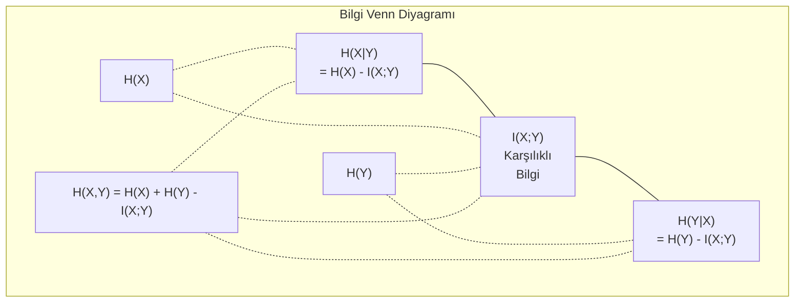

# Bilgi Teorisi

> Bilgi teorisi sürprizi ölçer. Loss fonksiyonları onun üzerine inşa edilmiştir.

**Tür:** Öğrenim
**Dil:** Python
**Ön koşullar:** Faz 1, Ders 06 (Olasılık)
**Süre:** ~60 dakika

## Öğrenme Hedefleri

- Entropi, cross-entropy ve KL diverjansını sıfırdan hesapla ve ilişkilerini açıkla
- Cross-entropy loss'u minimize etmenin neden log-likelihood'u maksimize etmeye eşdeğer olduğunu türet
- Feature önemini sıralamak için feature'lar ile hedef arasındaki karşılıklı bilgiyi hesapla
- Perplexity'i bir dil modelinin aralarından seçtiği etkin kelime hazinesi boyutu olarak açıkla

## Sorun

Eğittiğin her sınıflandırma modelinde `CrossEntropyLoss()` çağırıyorsun. Her dil modeli makalesinde "perplexity" görüyorsun. VAE'ler, distillation ve RLHF'te KL diverjansı hakkında okuyorsun. Bunlar birbirinden kopuk kavramlar değil. Hepsi farklı şapkalar takmış aynı fikir.

Bilgi teorisi sana belirsizlik, sıkıştırma ve tahmin hakkında akıl yürütme dili verir. Claude Shannon bunu 1948'de iletişim problemlerini çözmek için icat etti. Meğer bir sinir ağını eğitmek bir iletişim problemiymiş: model, öğrenilen weight'lerin gürültülü kanalı boyunca doğru label'ı iletmeye çalışıyor.

Bu ders her formülü sıfırdan inşa ediyor, böylece nereden geldiklerini ve neden çalıştıklarını görüyorsun.

## Kavram

### Bilgi İçeriği (Sürpriz)

Olası olmayan bir şey olduğunda, daha fazla bilgi taşır. Bir madeni paranın yazı gelmesi? Sürpriz değil. Piyango kazanmak? Çok sürpriz.

Olasılığı p olan bir olayın bilgi içeriği:

```
I(x) = -log(p(x))
```

Log taban 2 kullanmak sana bit verir. Doğal log kullanmak sana nat verir. Aynı fikir, farklı birimler.

```
Olay              Olasılık       Sürpriz (bit)
Adil madeni para  0.5            1.0
6 atmak           0.167          2.58
1/1000 olay       0.001          9.97
Kesin olay        1.0            0.0
```

Kesin olaylar sıfır bilgi taşır. Olacağını zaten biliyordun.

### Entropi (Ortalama Sürpriz)

Entropi, bir dağılımın tüm olası sonuçları boyunca beklenen sürprizdir.

```
H(P) = -sum( p(x) * log(p(x)) )  tüm x'ler için
```

Adil bir madeni paranın ikili bir değişken için maksimum entropisi vardır: 1 bit. Yanlı bir madeni paranın (%99 yazı) düşük entropisi vardır: 0.08 bit. Ne olacağını zaten biliyorsun, dolayısıyla her atış sana neredeyse hiçbir şey söylemiyor.

```
Adil madeni para:    H = -(0.5 * log2(0.5) + 0.5 * log2(0.5)) = 1.0 bit
Yanlı madeni para:   H = -(0.99 * log2(0.99) + 0.01 * log2(0.01)) = 0.08 bit
```

Entropi bir dağılımdaki indirgenemez belirsizliği ölçer. Onun altında sıkıştıramazsın.

### Cross-Entropy (Her Gün Kullandığın Loss Fonksiyonu)

Cross-entropy, aslında P dağılımından gelen olayları kodlamak için Q dağılımını kullandığında ortalama sürprizi ölçer.

```
H(P, Q) = -sum( p(x) * log(q(x)) )  tüm x'ler için
```

P gerçek dağılımdır (label'lar). Q modelinin tahminleridir. Q, P ile mükemmel eşleşirse, cross-entropy entropiye eşit olur. Herhangi bir uyumsuzluk onu büyütür.

Sınıflandırmada P bir one-hot vektördür (gerçek sınıfın olasılığı 1, geri kalan her şey 0). Bu cross-entropy'i şuna sadeleştirir:

```
H(P, Q) = -log(q(true_class))
```

Sınıflandırma için tüm cross-entropy loss formülü budur. Doğru sınıfın tahmin edilen olasılığını maksimize et.

### KL Diverjansı (Dağılımlar Arası Uzaklık)

KL diverjansı, P yerine Q kullandığında elde ettiğin ekstra sürprizi ölçer.

```
D_KL(P || Q) = sum( p(x) * log(p(x) / q(x)) )  tüm x'ler için
             = H(P, Q) - H(P)
```

Cross-entropy entropi artı KL diverjansıdır. Eğitim sırasında gerçek dağılımın entropisi sabit olduğundan, cross-entropy'i minimize etmek KL diverjansını minimize etmekle aynıdır. Modelinin dağılımını gerçek dağılıma doğru itiyorsun.

KL diverjansı simetrik değildir: D_KL(P || Q) != D_KL(Q || P). Gerçek bir uzaklık metriği değildir.

### Karşılıklı Bilgi (Mutual Information)

Karşılıklı bilgi, bir değişkeni bilmenin diğeri hakkında ne kadar şey söylediğini ölçer.

```
I(X; Y) = H(X) - H(X|Y)
        = H(X) + H(Y) - H(X, Y)
```

X ve Y bağımsızsa, karşılıklı bilgi sıfırdır. Birini bilmek diğeri hakkında hiçbir şey söylemez. Mükemmel ilişkililerse, karşılıklı bilgi herhangi bir değişkenin entropisine eşittir.

Feature seçiminde, bir feature ile hedef arasındaki yüksek karşılıklı bilgi, feature'ın yararlı olduğu anlamına gelir. Düşük karşılıklı bilgi onun gürültü olduğu anlamına gelir.

### Koşullu Entropi

H(Y|X), X'i gözlemledikten sonra Y hakkında ne kadar belirsizlik kaldığını ölçer.

```
H(Y|X) = H(X,Y) - H(X)
```

İki uç:
- X, Y'yi tamamen belirliyorsa, H(Y|X) = 0. X'i bilmek Y hakkındaki tüm belirsizliği ortadan kaldırır. Örnek: X = Celsius sıcaklığı, Y = Fahrenheit sıcaklığı.
- X, Y hakkında hiçbir şey söylemiyorsa, H(Y|X) = H(Y). X'i bilmek belirsizliğini hiç azaltmaz. Örnek: X = yazı-tura atışı, Y = yarınki hava.

Koşullu entropi her zaman negatif olmayandır ve H(Y)'yi aşmaz:

```
0 <= H(Y|X) <= H(Y)
```

Makine öğrenmesinde, koşullu entropi karar ağaçlarında görünür. Her bölünmede, algoritma H(Y|X)'i minimize eden X feature'ını seçer — etiket Y hakkındaki en fazla belirsizliği gideren feature.

### Birleşik Entropi

H(X,Y), X ve Y'nin birlikte birleşik dağılımının entropisidir.

```
H(X,Y) = -sum sum p(x,y) * log(p(x,y))   tüm x, y için
```

Anahtar özellik:

```
H(X,Y) <= H(X) + H(Y)
```

X ve Y bağımsız olduğunda eşitlik geçerlidir. Bilgi paylaşırlarsa, birleşik entropi bireysel entropilerin toplamından küçüktür. "Eksik" entropi tam olarak karşılıklı bilgidir.



İlişkiler:
- H(X,Y) = H(X) + H(Y|X) = H(Y) + H(X|Y)
- I(X;Y) = H(X) - H(X|Y) = H(Y) - H(Y|X)
- H(X,Y) = H(X) + H(Y) - I(X;Y)

### Karşılıklı Bilgi (Derinlemesine)

Karşılıklı bilgi I(X;Y), bir değişkeni bilmenin diğeri hakkındaki belirsizliği ne kadar azalttığını nicelendirir.

```
I(X;Y) = H(X) - H(X|Y)
       = H(Y) - H(Y|X)
       = H(X) + H(Y) - H(X,Y)
       = sum sum p(x,y) * log(p(x,y) / (p(x) * p(y)))
```

Özellikler:
- I(X;Y) >= 0 her zaman. Bir şeyi gözlemleyerek asla bilgi kaybetmezsin.
- I(X;Y) = 0 ancak ve ancak X ve Y bağımsız olduğunda.
- I(X;Y) = I(Y;X). KL diverjansının aksine simetriktir.
- I(X;X) = H(X). Bir değişken tüm bilgisini kendisiyle paylaşır.

**Feature seçimi için karşılıklı bilgi.** ML'de hedef hakkında bilgilendirici olan feature'lar istersin. Karşılıklı bilgi sana feature'ları sıralamak için ilkesel bir yol verir:

1. Her X_i feature'ı için, Y hedef değişken olduğunda I(X_i; Y)'yi hesapla.
2. Feature'ları MI skoruna göre sırala.
3. En üstteki k feature'ı tut.

Bu, feature ve hedef arasındaki herhangi bir ilişki için çalışır — lineer, lineer olmayan, monoton veya değil. Korelasyon sadece lineer ilişkileri yakalar. MI her şeyi yakalar.

| Yöntem | Tespit eder | Hesaplama maliyeti | Kategorik destekler mi? |
|--------|---------|-------------------|---------------------|
| Pearson korelasyonu | Lineer ilişkiler | O(n) | Hayır |
| Spearman korelasyonu | Monoton ilişkiler | O(n log n) | Hayır |
| Karşılıklı bilgi | Herhangi bir istatistiksel bağımlılık | Binning ile O(n log n) | Evet |

### Label Smoothing ve Cross-Entropy

Standart sınıflandırma sert hedefler kullanır: [0, 0, 1, 0]. Gerçek sınıf 1 olasılığı alır, geri kalan her şey 0 alır. Label smoothing bunları yumuşak hedeflerle değiştirir:

```
soft_target = (1 - epsilon) * hard_target + epsilon / num_classes
```

epsilon = 0.1 ve 4 sınıf ile:
- Sert hedef:  [0, 0, 1, 0]
- Yumuşak hedef:  [0.025, 0.025, 0.925, 0.025]

Bilgi teorisi perspektifinden, label smoothing hedef dağılımının entropisini arttırır. Sert one-hot hedeflerin entropisi 0'dır — belirsizlik yoktur. Yumuşak hedeflerin pozitif entropisi vardır.

Bu neden yardımcı olur:
- Modelin logit'leri aşırı değerlere itmesini önler (cross-entropy altında bir one-hot hedefe mükemmel eşleşmek için sonsuz logit'ler gerekirdi)
- Regularization gibi davranır: model %100 emin olamaz
- Kalibrasyonu iyileştirir: tahmin edilen olasılıklar gerçek belirsizliği daha iyi yansıtır
- Eğitim ve inference davranışı arasındaki farkı azaltır

Label smoothing'li cross-entropy loss şuna dönüşür:

```
L = (1 - epsilon) * CE(hard_target, prediction) + epsilon * H_uniform(prediction)
```

İkinci terim uniform'dan uzak tahminleri cezalandırır — özgüven üzerinde doğrudan bir regularization.

### Cross-Entropy Neden TEK Sınıflandırma Loss'udur

Üç perspektif, aynı sonuç.

**Bilgi teorisi görüşü.** Cross-entropy, gerçek dağılım yerine modelinin dağılımını kullanarak kaç bit israf ettiğini ölçer. Onu minimize etmek modelini gerçekliğin en verimli encoder'ı yapar.

**Maximum likelihood görüşü.** Gerçek sınıfları y_i olan N eğitim örneği için:

```
Likelihood     = product( q(y_i) )
Log-likelihood = sum( log(q(y_i)) )
Negatif log-likelihood = -sum( log(q(y_i)) )
```

Son satır cross-entropy loss'tur. Cross-entropy'i minimize etmek = eğitim verisinin modelin altındaki likelihood'unu maksimize etmek.

**Gradyan görüşü.** Cross-entropy'in logit'lere göre gradyanı basitçe (predicted - true)'dur. Temiz, kararlı ve hesaplaması hızlı. Bu yüzden softmax ile mükemmel uyum sağlar.

### Bitler vs Natlar

Tek fark log tabanıdır.

```
log taban 2   -> bit       (bilgi teorisi geleneği)
log taban e   -> nat       (makine öğrenmesi konvansiyonu)
log taban 10  -> hartley   (nadiren kullanılır)
```

1 nat = 1/ln(2) bit = 1.4427 bit. PyTorch ve TensorFlow varsayılan olarak doğal log (nat) kullanır.

### Perplexity

Perplexity, cross-entropy'in üstelidir. Sana modelin arasında belirsiz kaldığı eşit olası seçeneklerin etkin sayısını söyler.

```
Perplexity = 2^H(P,Q)   (bit kullanılıyorsa)
Perplexity = e^H(P,Q)   (nat kullanılıyorsa)
```

Perplexity'si 50 olan bir dil modeli, ortalama olarak 50 olası sonraki token'dan uniform olarak seçmek zorundaymış gibi kafası karışıktır. Daha düşük daha iyidir.

GPT-2 yaygın benchmark'larda ~30 perplexity elde etti. Modern modeller iyi temsil edilen alanlarda tek haneli rakamlardadır.

## İnşa Et

### Adım 1: Bilgi içeriği ve entropi

```python
import math

def information_content(p, base=2):
    if p <= 0 or p > 1:
        return float('inf') if p <= 0 else 0.0
    return -math.log(p) / math.log(base)

def entropy(probs, base=2):
    return sum(
        p * information_content(p, base)
        for p in probs if p > 0
    )

fair_coin = [0.5, 0.5]
biased_coin = [0.99, 0.01]
fair_die = [1/6] * 6

print(f"Adil madeni para entropisi:   {entropy(fair_coin):.4f} bit")
print(f"Yanlı madeni para entropisi:  {entropy(biased_coin):.4f} bit")
print(f"Adil zar entropisi:           {entropy(fair_die):.4f} bit")
```

### Adım 2: Cross-entropy ve KL diverjansı

```python
def cross_entropy(p, q, base=2):
    total = 0.0
    for pi, qi in zip(p, q):
        if pi > 0:
            if qi <= 0:
                return float('inf')
            total += pi * (-math.log(qi) / math.log(base))
    return total

def kl_divergence(p, q, base=2):
    return cross_entropy(p, q, base) - entropy(p, base)

true_dist = [0.7, 0.2, 0.1]
good_model = [0.6, 0.25, 0.15]
bad_model = [0.1, 0.1, 0.8]

print(f"Gerçek dağılımın entropisi:    {entropy(true_dist):.4f} bit")
print(f"CE (iyi model):                {cross_entropy(true_dist, good_model):.4f} bit")
print(f"CE (kötü model):               {cross_entropy(true_dist, bad_model):.4f} bit")
print(f"KL diverjansı (iyi):           {kl_divergence(true_dist, good_model):.4f} bit")
print(f"KL diverjansı (kötü):          {kl_divergence(true_dist, bad_model):.4f} bit")
```

### Adım 3: Sınıflandırma loss'u olarak cross-entropy

```python
def softmax(logits):
    max_logit = max(logits)
    exps = [math.exp(z - max_logit) for z in logits]
    total = sum(exps)
    return [e / total for e in exps]

def cross_entropy_loss(true_class, logits):
    probs = softmax(logits)
    return -math.log(probs[true_class])

logits = [2.0, 1.0, 0.1]
true_class = 0

probs = softmax(logits)
loss = cross_entropy_loss(true_class, logits)

print(f"Logit'ler:    {logits}")
print(f"Softmax:      {[f'{p:.4f}' for p in probs]}")
print(f"Gerçek sınıf: {true_class}")
print(f"Loss:         {loss:.4f} nat")
print(f"Perplexity:   {math.exp(loss):.2f}")
```

### Adım 4: Cross-entropy negatif log-likelihood'a eşittir

```python
import random

random.seed(42)

n_samples = 1000
n_classes = 3
true_labels = [random.randint(0, n_classes - 1) for _ in range(n_samples)]
model_logits = [[random.gauss(0, 1) for _ in range(n_classes)] for _ in range(n_samples)]

ce_loss = sum(
    cross_entropy_loss(label, logits)
    for label, logits in zip(true_labels, model_logits)
) / n_samples

nll = -sum(
    math.log(softmax(logits)[label])
    for label, logits in zip(true_labels, model_logits)
) / n_samples

print(f"Cross-entropy loss:      {ce_loss:.6f}")
print(f"Negatif log-likelihood:  {nll:.6f}")
print(f"Fark:                    {abs(ce_loss - nll):.2e}")
```

### Adım 5: Karşılıklı bilgi

```python
def mutual_information(joint_probs, base=2):
    rows = len(joint_probs)
    cols = len(joint_probs[0])

    margin_x = [sum(joint_probs[i][j] for j in range(cols)) for i in range(rows)]
    margin_y = [sum(joint_probs[i][j] for i in range(rows)) for j in range(cols)]

    mi = 0.0
    for i in range(rows):
        for j in range(cols):
            pxy = joint_probs[i][j]
            if pxy > 0:
                mi += pxy * math.log(pxy / (margin_x[i] * margin_y[j])) / math.log(base)
    return mi

independent = [[0.25, 0.25], [0.25, 0.25]]
dependent = [[0.45, 0.05], [0.05, 0.45]]

print(f"MI (bağımsız): {mutual_information(independent):.4f} bit")
print(f"MI (bağımlı):  {mutual_information(dependent):.4f} bit")
```

## Kullan

NumPy kullanarak aynı kavramlar, pratikte kullanacağın şekilde:

```python
import numpy as np

def np_entropy(p):
    p = np.asarray(p, dtype=float)
    mask = p > 0
    result = np.zeros_like(p)
    result[mask] = p[mask] * np.log(p[mask])
    return -result.sum()

def np_cross_entropy(p, q):
    p, q = np.asarray(p, dtype=float), np.asarray(q, dtype=float)
    mask = p > 0
    return -(p[mask] * np.log(q[mask])).sum()

def np_kl_divergence(p, q):
    return np_cross_entropy(p, q) - np_entropy(p)

true = np.array([0.7, 0.2, 0.1])
pred = np.array([0.6, 0.25, 0.15])
print(f"Entropi:    {np_entropy(true):.4f} nat")
print(f"Cross-ent:  {np_cross_entropy(true, pred):.4f} nat")
print(f"KL div:     {np_kl_divergence(true, pred):.4f} nat")
```

`torch.nn.CrossEntropyLoss()`'un içeride yaptığını sıfırdan inşa ettin. Artık eğitim sırasında loss'un neden düştüğünü biliyorsun: modelinin tahmin ettiği dağılım gerçek dağılıma yaklaşıyor, israf edilen bilginin nat'ları cinsinden ölçülüyor.

## Alıştırmalar

1. Uniform dağılım varsayarak (26 harf) İngilizce alfabesinin entropisini hesapla. Sonra gerçek harf frekanslarını kullanarak tahmin et. Hangisi daha yüksek ve neden?

2. Bir model gerçek sınıfı 1 olan bir örnek için [5.0, 2.0, 0.5] logit'leri çıkarıyor. Cross-entropy loss'u elle hesapla, sonra `cross_entropy_loss` fonksiyonunla doğrula. Hangi logit'ler sıfır loss verir?

3. KL diverjansının simetrik olmadığını göster. İki dağılım P ve Q seç ve D_KL(P || Q) ve D_KL(Q || P) hesapla. Neden farklı olduklarını açıkla.

4. Token tahminlerinden oluşan bir dizi için perplexity hesaplayan bir fonksiyon kur. (true_token_index, predicted_logits) çiftlerinin bir listesi verildiğinde, dizinin perplexity'sini döndür.

## Anahtar Terimler

| Terim | İnsanlar ne der | Aslında ne demek |
|------|----------------|----------------------|
| Bilgi içeriği | "Sürpriz" | Bir olayı kodlamak için gereken bit (veya nat) sayısı: -log(p) |
| Entropi | "Rastgelelik" | Bir dağılımın tüm sonuçları boyunca ortalama sürpriz. İndirgenemez belirsizliği ölçer. |
| Cross-entropy | "Loss fonksiyonu" | Gerçek dağılım P'den gelen olayları kodlamak için model dağılımı Q kullanıldığında ortalama sürpriz. |
| KL diverjansı | "Dağılımlar arası uzaklık" | P yerine Q kullanarak israf edilen ekstra bit'ler. Cross-entropy eksi entropi'ye eşit. Simetrik değil. |
| Karşılıklı bilgi | "X ve Y ne kadar ilişkili" | Y'yi bilmekten X hakkındaki belirsizliğin azalması. Sıfır bağımsız demek. |
| Softmax | "Logit'leri olasılıklara çevir" | Üstel al ve normalize et. Herhangi bir reel değerli vektörü geçerli bir olasılık dağılımına eşler. |
| Perplexity | "Model ne kadar kafası karışık" | Cross-entropy'in üsteli. Modelin her adımda arasından seçtiği etkin kelime hazinesi boyutu. |
| Bit | "Shannon'un birimi" | Log taban 2 ile ölçülen bilgi. Bir bit, bir adil madeni para atışını çözer. |
| Nat | "ML'nin birimi" | Doğal log ile ölçülen bilgi. PyTorch ve TensorFlow tarafından varsayılan olarak kullanılır. |
| Negatif log-likelihood | "NLL loss" | One-hot label'lar için cross-entropy loss ile aynı. Onu minimize etmek doğru tahminlerin olasılığını maksimize eder. |

## İleri Okuma

- [Shannon 1948: A Mathematical Theory of Communication](https://people.math.harvard.edu/~ctm/home/text/others/shannon/entropy/entropy.pdf) - orijinal makale, hala okunabilir
- [Visual Information Theory (Chris Olah)](https://colah.github.io/posts/2015-09-Visual-Information/) - entropi ve KL diverjansının en iyi görsel açıklaması
- [PyTorch CrossEntropyLoss docs](https://pytorch.org/docs/stable/generated/torch.nn.CrossEntropyLoss.html) - framework'ün az önce inşa ettiğin şeyi nasıl uyguladığı
