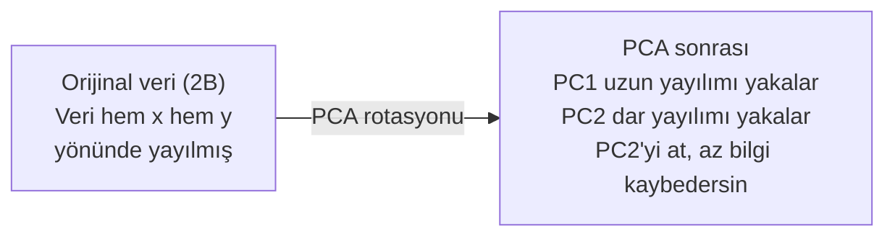

# Boyut İndirgeme

> Yüksek boyutlu verinin yapısı vardır. Onu doğru açıdan bakarak bulursun.

**Tür:** Yapım
**Dil:** Python
**Ön koşullar:** Faz 1, Ders 01 (Lineer Cebir Sezgisi), 02 (Vektörler, Matrisler ve İşlemler), 03 (Eigenvalue ve Eigenvector), 06 (Olasılık ve Dağılımlar)
**Süre:** ~90 dakika

## Öğrenme Hedefleri

- PCA'yı sıfırdan implemente et: veriyi merkezle, kovaryans matrisini hesapla, eigendecompose et ve projekte et
- Temel bileşen sayısını seçmek için açıklanan varyans oranını ve elbow method'unu kullan
- MNIST rakamlarını 2B'de görselleştirmek için PCA, t-SNE ve UMAP'i karşılaştır ve trade-off'larını açıkla
- Standart PCA'nın halledemediği lineer olmayan veri yapılarını ayırmak için RBF kernel ile kernel PCA uygula

## Sorun

Örnek başına 784 feature'lı bir veri setin var. Belki bunlar el yazısı rakamların piksel değerleri. Belki gen ekspresyon seviyeleri. Belki kullanıcı davranış sinyalleri. 784 boyutu görselleştiremezsin. Onları çizemezsin. Hatta onlar hakkında düşünemezsin bile.

Ama bu 784 feature'ın çoğu gereksizdir. Gerçek bilgi çok daha küçük bir yüzeyde yaşar. El yazısıyla yazılmış bir "7"yi tanımlamak için 784 bağımsız sayıya ihtiyaç yoktur. Birkaç tane yeterli: vuruşun açısı, çapraz çubuğun uzunluğu, ne kadar yaslandığı. Geri kalanı gürültü.

Boyut indirgeme o daha küçük yüzeyi bulur. 784 boyutlu verini alır ve önemli yapıyı koruyarak 2, 10 veya 50 boyuta sıkıştırır.

## Kavram

### Boyutluluğun laneti (curse of dimensionality)

Yüksek boyutlu uzaylar sezgisel değildir. Boyutlar büyüdükçe üç şey bozulur.

**Uzaklık anlamsızlaşır.** Yüksek boyutlarda, herhangi iki rastgele nokta arasındaki uzaklık aynı değere yakınsar. Her nokta birbirinden kabaca aynı uzaklıktaysa, en yakın komşu araması çalışmayı durdurur.

```
Boyut        Ortalama uzaklık oranı (rastgele noktalar arasında maks/min)
2            ~5.0
10           ~1.8
100          ~1.2
1000         ~1.02
```

**Hacim köşelerde yoğunlaşır.** d boyutta bir birim hiperküpün 2^d köşesi vardır. 100 boyutta, neredeyse tüm hacim merkezden uzakta, köşelerdedir. Veri noktaları kenarlara yayılır ve modellerin iç bölgede veri açlığı çeker.

**Üstel olarak daha fazla veriye ihtiyacın olur.** Bir uzayda aynı örnek yoğunluğunu korumak için, 2B'den 20B'ye gitmek 10^18 kat daha fazla veri gerektirir. Asla yeterince yok. Boyutları indirgemek veri yoğunluğunu çalışılabilir bir şeye geri getirir.

### PCA: önemli olan yönleri bul

Principal Component Analysis (PCA), verinin en çok değiştiği eksenleri bulur. Koordinat sistemini birinci eksen en fazla varyansı yakalayacak, ikincisi sonraki en fazlasını, vb. şekilde döndürür.

Algoritma:

```
1. Veriyi merkezle          (her feature'dan ortalamayı çıkar)
2. Kovaryansı hesapla       (feature'ların birlikte nasıl hareket ettiği)
3. Eigendecomposition       (temel yönleri bul)
4. Eigenvalue'ya göre sırala (en büyük varyans önce)
5. Projekte et              (en üstteki k eigenvector'u tut, geri kalanını at)
```

Neden eigendecomposition? Kovaryans matrisi simetrik ve pozitif yarı tanımlıdır. Eigenvector'ları feature uzayında ortogonal yönlerdir. Eigenvalue'lar her yönün ne kadar varyans yakaladığını söyler. En büyük eigenvalue'lu eigenvector maksimum varyans yönü boyunca işaret eder.



- **PCA öncesi:** Veri bulutu hem x hem y eksenleri boyunca diyagonal olarak yayılmıştır
- **PCA sonrası:** Koordinat sistemi PC1 maksimum varyans yönüyle (uzun yayılım) ve PC2 minimum varyans yönüyle (dar yayılım) hizalanacak şekilde döndürülür
- **Boyut indirgeme:** PC2'yi atmak veriyi PC1'e projekte eder, çok az bilgi kaybedersin

### Açıklanan varyans oranı

Her temel bileşen toplam varyansın bir kesrini yakalar. Açıklanan varyans oranı sana ne kadarını söyler.

```
Bileşen      Eigenvalue    Açıklanan oran     Kümülatif
PC1          4.73          0.473              0.473
PC2          2.51          0.251              0.724
PC3          1.12          0.112              0.836
PC4          0.89          0.089              0.925
...
```

Kümülatif açıklanan varyans 0.95'e ulaştığında, o kadar bileşenin bilginin %95'ini yakaladığını bilirsin. Ondan sonraki her şey çoğunlukla gürültüdür.

### Bileşen sayısını seçme

Üç strateji:

1. **Eşik.** Varyansın %90-95'ini açıklayacak kadar bileşen tut.
2. **Elbow method.** Bileşen başına açıklanan varyansı çiz. Keskin bir düşüş ara.
3. **Downstream performans.** PCA'yı ön işleme olarak kullan. k'yı tara ve modelinin doğruluğunu ölç. En iyi k, doğruluğun plato yaptığı yerdir.

### t-SNE: komşulukları koru

t-Distributed Stochastic Neighbor Embedding (t-SNE) görselleştirme için tasarlanmıştır. Yüksek boyutlu veriyi 2B'ye (veya 3B'ye) hangi noktaların birbirine yakın olduğunu koruyarak eşler.

Sezgi: orijinal uzayda, nokta çiftleri üzerinden uzaklıklarına dayalı bir olasılık dağılımı hesapla. Yakın noktalar yüksek olasılık alır. Uzak noktalar düşük olasılık alır. Sonra aynı olasılık dağılımının geçerli olduğu bir 2B düzenleme bul. 784 boyutta komşu olan noktalar 2B'de komşu kalır.

t-SNE'nin temel özellikleri:
- Non-linear. PCA'nın yapamadığı karmaşık manifold'ları açabilir.
- Stokastik. Farklı çalıştırmalar farklı düzenler üretir.
- Perplexity parametresi kaç komşu dikkate alınacağını kontrol eder (tipik aralık: 5-50).
- Çıktıdaki kümeler arası uzaklıklar anlamlı değildir. Sadece kümelerin kendileri anlamlıdır.
- Büyük veri setlerinde yavaş. Varsayılan olarak O(n^2).

### UMAP: daha hızlı, daha iyi global yapı

Uniform Manifold Approximation and Projection (UMAP), t-SNE'ye benzer çalışır ama iki avantajıyla:
- Daha hızlı. Tüm çiftler arası uzaklıkları hesaplamak yerine yaklaşık en yakın komşu grafları kullanır.
- Daha iyi global yapı. Çıktıdaki kümelerin göreli konumları t-SNE'dekinden daha anlamlı olma eğilimindedir.

UMAP yüksek boyutlu uzayda ağırlıklı bir graf inşa eder ("fuzzy topological representation") ve sonra bu grafı mümkün olduğunca koruyan düşük boyutlu bir düzen bulur.

Anahtar parametreler:
- `n_neighbors`: yerel yapıyı kaç komşunun tanımladığı (perplexity'ye benzer). Daha yüksek değerler daha fazla global yapı korur.
- `min_dist`: çıktıda noktaların ne kadar sıkı paketlendiği. Daha düşük değerler daha yoğun kümeler yaratır.

### Ne zaman hangisini kullanmalı

| Yöntem | Kullanım | Korur | Hız |
|--------|----------|-----------|-------|
| PCA | Eğitim öncesi ön işleme | Global varyans | Hızlı (tam), milyonlarca örnek üzerinde çalışır |
| PCA | Hızlı keşifsel görselleştirme | Lineer yapı | Hızlı |
| t-SNE | Yayın kalitesinde 2B grafikler | Yerel komşuluklar | Yavaş (ideal < 10k örnek) |
| UMAP | Ölçekte 2B görselleştirme | Yerel + biraz global yapı | Orta (milyonları halleder) |
| PCA | Modeller için feature azaltma | Varyansa göre sıralanmış feature'lar | Hızlı |
| t-SNE / UMAP | Küme yapısını anlama | Küme ayırımı | Orta ila yavaş |

Pratik kural: Ön işleme ve veri sıkıştırma için PCA kullan. Yapıyı 2B'de görselleştirmen gerektiğinde t-SNE veya UMAP kullan.

### Kernel PCA

Standart PCA lineer alt uzaylar bulur. Koordinat sistemini döndürür ve eksenleri atar. Ama veri lineer olmayan bir manifold üzerinde yer alıyorsa? 2B'deki bir çember herhangi bir doğru tarafından ayrılamaz. Standart PCA yardımcı olmaz.

Kernel PCA, kernel fonksiyonuyla indüklenen yüksek boyutlu feature uzayında PCA uygular, o uzaydaki koordinatları açıkça hesaplamadan. Bu kernel trick — SVM'lerin arkasındaki aynı fikir.

Algoritma:
1. K_ij = k(x_i, x_j) olan K kernel matrisini hesapla
2. Feature uzayında kernel matrisini merkezle
3. Merkezlenmiş kernel matrisini eigendecompose et
4. En üstteki eigenvector'lar (1/sqrt(eigenvalue) ile ölçeklenmiş) projeksiyonlardır

Yaygın kernel fonksiyonları:

| Kernel | Formül | Şunun için iyi |
|--------|---------|----------|
| RBF (Gauss) | exp(-gamma * \|\|x - y\|\|^2) | Çoğu lineer olmayan veri, düzgün manifold'lar |
| Polinomiyal | (x . y + c)^d | Polinomiyal ilişkiler |
| Sigmoid | tanh(alpha * x . y + c) | Sinir ağı benzeri eşlemeler |

Kernel PCA vs standart PCA ne zaman kullanılır:

| Kriter | Standart PCA | Kernel PCA |
|-----------|-------------|------------|
| Veri yapısı | Lineer alt uzay | Lineer olmayan manifold |
| Hız | O(min(n^2 d, d^2 n)) | O(n^2 d + n^3) |
| Yorumlanabilirlik | Bileşenler feature'ların lineer kombinasyonlarıdır | Bileşenlerin doğrudan feature yorumlaması yoktur |
| Ölçeklenebilirlik | Milyonlarca örnek üzerinde çalışır | Kernel matrisi n x n, bellekle sınırlı |
| Yeniden inşa | Doğrudan inverse transform | Pre-image yaklaşımı gerektirir |

Klasik örnek: 2B'de iç içe çemberler. İki nokta halkası, biri diğerinin içinde. Standart PCA ikisini de aynı doğruya projekte eder — sınıflandırma için işe yaramaz. RBF kernel'li kernel PCA iç çemberi ve dış çemberi farklı bölgelere eşler, onları lineer olarak ayrılabilir kılar.

### Yeniden İnşa Hatası

Boyut indirgemen ne kadar iyi? 784 boyutu 50'ye sıkıştırdın. Ne kaybettin?

Yeniden inşa hatasını ölç:
1. Veriyi k boyuta projekte et: X_reduced = X @ W_k
2. Yeniden inşa et: X_hat = X_reduced @ W_k^T
3. MSE hesapla: mean((X - X_hat)^2)

PCA için yeniden inşa hatası açıklanan varyansa temiz bir ilişkiye sahiptir:

```
Yeniden inşa hatası = dahil EDİLMEYEN eigenvalue'ların toplamı
Toplam varyans = TÜM eigenvalue'ların toplamı
Kaybedilen kesir = (atılan eigenvalue'ların toplamı) / (tüm eigenvalue'ların toplamı)
```

Her bileşen için açıklanan varyans oranı:

```
explained_ratio_k = eigenvalue_k / sum(tüm eigenvalue'lar)
```

Kümülatif açıklanan varyansı bileşen sayısına karşı çizmek sana "elbow" eğrisini verir. Doğru bileşen sayısı:
- Eğrinin düzleştiği yerdir (azalan getiriler)
- Kümülatif varyans eşiğini geçer (genelde 0.90 veya 0.95)
- Downstream görev performansı plato yapar

Yeniden inşa hatası k seçmenin ötesinde yararlıdır. Anomali tespiti için kullanabilirsin: yüksek yeniden inşa hatası olan örnekler öğrenilen alt uzaya uymayan outlier'lardır. Bu üretim sistemlerinde PCA tabanlı anomali tespitinin temelidir.

## İnşa Et

### Adım 1: Sıfırdan PCA

```python
import numpy as np

class PCA:
    def __init__(self, n_components):
        self.n_components = n_components
        self.components = None
        self.mean = None
        self.eigenvalues = None
        self.explained_variance_ratio_ = None

    def fit(self, X):
        self.mean = np.mean(X, axis=0)
        X_centered = X - self.mean

        cov_matrix = np.cov(X_centered, rowvar=False)

        eigenvalues, eigenvectors = np.linalg.eigh(cov_matrix)

        sorted_idx = np.argsort(eigenvalues)[::-1]
        eigenvalues = eigenvalues[sorted_idx]
        eigenvectors = eigenvectors[:, sorted_idx]

        self.components = eigenvectors[:, :self.n_components].T
        self.eigenvalues = eigenvalues[:self.n_components]
        total_var = np.sum(eigenvalues)
        self.explained_variance_ratio_ = self.eigenvalues / total_var

        return self

    def transform(self, X):
        X_centered = X - self.mean
        return X_centered @ self.components.T

    def fit_transform(self, X):
        self.fit(X)
        return self.transform(X)
```

### Adım 2: Sentetik veri üzerinde test

```python
np.random.seed(42)
n_samples = 500

t = np.random.uniform(0, 2 * np.pi, n_samples)
x1 = 3 * np.cos(t) + np.random.normal(0, 0.2, n_samples)
x2 = 3 * np.sin(t) + np.random.normal(0, 0.2, n_samples)
x3 = 0.5 * x1 + 0.3 * x2 + np.random.normal(0, 0.1, n_samples)

X_synthetic = np.column_stack([x1, x2, x3])

pca = PCA(n_components=2)
X_reduced = pca.fit_transform(X_synthetic)

print(f"Orijinal shape: {X_synthetic.shape}")
print(f"İndirgenmiş shape:  {X_reduced.shape}")
print(f"Açıklanan varyans oranları: {pca.explained_variance_ratio_}")
print(f"Toplam yakalanan varyans: {sum(pca.explained_variance_ratio_):.4f}")
```

### Adım 3: MNIST rakamları 2B'de

```python
from sklearn.datasets import fetch_openml

mnist = fetch_openml("mnist_784", version=1, as_frame=False, parser="auto")
X_mnist = mnist.data[:5000].astype(float)
y_mnist = mnist.target[:5000].astype(int)

pca_mnist = PCA(n_components=50)
X_pca50 = pca_mnist.fit_transform(X_mnist)
print(f"50 bileşen varyansın {sum(pca_mnist.explained_variance_ratio_):.2%}'ini yakalıyor")

pca_2d = PCA(n_components=2)
X_pca2d = pca_2d.fit_transform(X_mnist)
print(f"2 bileşen varyansın {sum(pca_2d.explained_variance_ratio_):.2%}'ini yakalıyor")
```

### Adım 4: sklearn ile karşılaştır

```python
from sklearn.decomposition import PCA as SklearnPCA
from sklearn.manifold import TSNE

sklearn_pca = SklearnPCA(n_components=2)
X_sklearn_pca = sklearn_pca.fit_transform(X_mnist)

print(f"\nBizim PCA'mızın açıklanan varyansı:    {pca_2d.explained_variance_ratio_}")
print(f"Sklearn PCA'nın açıklanan varyansı:   {sklearn_pca.explained_variance_ratio_}")

diff = np.abs(np.abs(X_pca2d) - np.abs(X_sklearn_pca))
print(f"Maksimum mutlak fark: {diff.max():.10f}")

tsne = TSNE(n_components=2, perplexity=30, random_state=42)
X_tsne = tsne.fit_transform(X_mnist)
print(f"\nt-SNE çıktı shape'i: {X_tsne.shape}")
```

### Adım 5: UMAP karşılaştırması

```python
try:
    from umap import UMAP

    reducer = UMAP(n_components=2, n_neighbors=15, min_dist=0.1, random_state=42)
    X_umap = reducer.fit_transform(X_mnist)
    print(f"UMAP çıktı shape'i: {X_umap.shape}")
except ImportError:
    print("umap-learn'i kur: pip install umap-learn")
```

## Kullan

Bir sınıflandırıcıdan önce ön işleme olarak PCA:

```python
from sklearn.decomposition import PCA as SklearnPCA
from sklearn.linear_model import LogisticRegression
from sklearn.model_selection import train_test_split
from sklearn.metrics import accuracy_score

X_train, X_test, y_train, y_test = train_test_split(
    X_mnist, y_mnist, test_size=0.2, random_state=42
)

results = {}
for k in [10, 30, 50, 100, 200]:
    pca_k = SklearnPCA(n_components=k)
    X_tr = pca_k.fit_transform(X_train)
    X_te = pca_k.transform(X_test)

    clf = LogisticRegression(max_iter=1000, random_state=42)
    clf.fit(X_tr, y_train)
    acc = accuracy_score(y_test, clf.predict(X_te))
    var_captured = sum(pca_k.explained_variance_ratio_)
    results[k] = (acc, var_captured)
    print(f"k={k:>3d}  doğruluk={acc:.4f}  varyans={var_captured:.4f}")
```

Performans 784 boyuttan çok önce plato yapar. O plato senin çalışma noktan.

## Yayınla

Bu ders şunu üretir:
- `outputs/skill-dimensionality-reduction.md` - belirli bir görev için doğru boyut indirgeme tekniğini seçmek için bir skill

## Alıştırmalar

1. PCA sınıfını `inverse_transform`'u destekleyecek şekilde değiştir. MNIST rakamlarını 10, 50 ve 200 bileşenden yeniden inşa et. Her biri için yeniden inşa hatasını (orijinalden ortalama kare fark) yazdır.

2. t-SNE'yi aynı MNIST alt kümesi üzerinde 5, 30 ve 100 perplexity değerleriyle çalıştır. Çıktının nasıl değiştiğini açıkla. Perplexity neden küme sıkılığını etkiler?

3. Sadece 5'i bilgilendirici olan 50 feature'lı bir veri seti al (`sklearn.datasets.make_classification` ile bir tane üret). PCA uygula ve açıklanan varyans eğrisinin verinin etkin olarak 5 boyutlu olduğunu doğru tanımlayıp tanımlamadığını kontrol et.

## Anahtar Terimler

| Terim | İnsanlar ne der | Aslında ne demek |
|------|----------------|----------------------|
| Boyutluluğun laneti | "Çok fazla feature" | Boyutlar büyüdükçe uzaklıklar, hacimler ve veri yoğunluğunun hepsi sezgisel olmayan davranır. Modellerin telafi etmek için üstel olarak daha fazla veriye ihtiyacı vardır. |
| PCA | "Boyutları azalt" | Eksenlerin maksimum varyans yönleriyle hizalanacağı şekilde koordinat sistemini döndür, sonra düşük varyans eksenlerini at. |
| Temel bileşen | "Önemli bir yön" | Kovaryans matrisinin bir eigenvector'u. Feature uzayında verinin en çok değiştiği yön. |
| Açıklanan varyans oranı | "Bu bileşenin ne kadar bilgisi var" | Bir temel bileşen tarafından yakalanan toplam varyansın kesri. K bileşenin ne kadarını koruduğunu görmek için en üstteki k oranı topla. |
| Kovaryans matrisi | "Feature'ların nasıl ilişkili olduğu" | (i,j) girdisinin feature i ve feature j'nin birlikte nasıl hareket ettiğini ölçtüğü simetrik matris. Diagonal girdiler bireysel varyanslardır. |
| t-SNE | "Şu küme grafiği" | Çift komşuluk olasılıklarını koruyarak yüksek boyutlu veriyi 2B'ye eşleyen lineer olmayan bir yöntem. Görselleştirme için iyi, ön işleme için değil. |
| UMAP | "Daha hızlı t-SNE" | Topolojik veri analizine dayalı lineer olmayan bir yöntem. Hem yerel hem de biraz global yapıyı korur. t-SNE'den daha iyi ölçeklenir. |
| Perplexity | "Bir t-SNE düğmesi" | Her noktanın dikkate aldığı etkin komşu sayısını kontrol eder. Düşük perplexity çok yerel yapıya odaklanır. Yüksek perplexity daha geniş desenleri yakalar. |
| Manifold | "Verinin yaşadığı yüzey" | Daha yüksek boyutlu bir uzaya gömülü daha düşük boyutlu bir yüzey. 3B'de buruşturulmuş bir kağıt 2B bir manifold'dur. |

## İleri Okuma

- [A Tutorial on Principal Component Analysis](https://arxiv.org/abs/1404.1100) (Shlens) - PCA'nın temellerden net türetilmesi
- [How to Use t-SNE Effectively](https://distill.pub/2016/misread-tsne/) (Wattenberg et al.) - t-SNE tuzaklarına ve parametre seçimlerine etkileşimli rehber
- [UMAP documentation](https://umap-learn.readthedocs.io/) - UMAP yazarlarından teori ve pratik rehberlik
