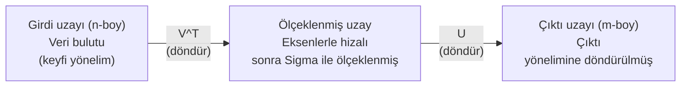
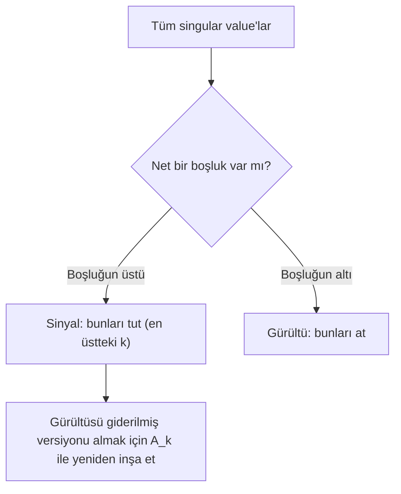

# Singular Value Decomposition

> SVD lineer cebrin İsviçre çakısıdır. Her matrisin biri vardır. Her veri bilimcinin birine ihtiyacı vardır.

**Tür:** Yapım
**Diller:** Python, Julia
**Ön koşullar:** Faz 1, Ders 01 (Lineer Cebir Sezgisi), 02 (Vektörler ve Matris İşlemleri), 03 (Matris Dönüşümleri)
**Süre:** ~120 dakika

## Öğrenme Hedefleri

- Power iteration ile SVD'yi implemente et ve U, Sigma, V^T'nin geometrik anlamını açıkla
- Görüntü sıkıştırması için truncated SVD uygula ve sıkıştırma oranı vs yeniden inşa hatasını ölç
- Aşırı belirlenmiş en küçük kareler sistemlerini çözmek için SVD ile Moore-Penrose pseudoinverse'i hesapla
- SVD'yi PCA'ya, öneri sistemlerine (latent factor'lar) ve NLP'de Latent Semantic Analysis'e bağla

## Sorun

1000x2000'lik bir matrisin var. Belki kullanıcı-film puanları. Belki belge-terim frekans tablosu. Belki bir görüntünün piksel değerleri. Onu sıkıştırman, gürültüsünü gidermen, içindeki gizli yapıyı bulman veya onunla bir en küçük kareler sistemini çözmen gerekiyor. Eigendecomposition yalnızca kare matrislerde çalışır. O zaman bile matrisin tam bir lineer bağımsız eigenvector seti olması gerekir.

SVD herhangi bir matriste çalışır. Herhangi bir şekilde. Herhangi bir rank'ta. Koşul yok. Matrisi, matrisin uzaya ne yaptığının geometrisini ortaya çıkaran üç faktöre ayırır. Tüm lineer cebrin en genel ve en yararlı faktörizasyonudur.

## Kavram

### SVD'nin geometrik olarak ne yaptığı

Her matris, şeklinden bağımsız olarak, sırayla üç işlem yapar: döndür, ölçekle, döndür. SVD bu ayrıştırmayı açık hale getirir.

```
A = U * Sigma * V^T

      m x n     m x m    m x n    n x n
     (herhangi) (döndür)  (ölçek) (döndür)
```

Herhangi bir A matrisi verildiğinde, SVD onu şuna ayırır:
- V^T girdi uzayında vektörleri döndürür (n boyutlu)
- Sigma her eksen boyunca ölçekler (gerer veya sıkıştırır)
- U sonucu çıktı uzayına döndürür (m boyutlu)



Şöyle düşün. SVD'ye bir matris veriyorsun. Sana şunu söylüyor: "Bu matris bir küre girdiyi alır, önce V^T ile döndürür, sonra Sigma ile bir elipsoide gerer, sonra elipsoidi U ile döndürür." Singular value'lar elipsoidin eksenlerinin uzunluklarıdır.

### Tam ayrışım

m x n şekilli bir A matrisi için:

```
A = U * Sigma * V^T

burada:
  U     m x m'dir, ortogonaldir (U^T U = I)
  Sigma m x n'dir, diagonaldır (singular value'lar diagonal üzerinde)
  V     n x n'dir, ortogonaldir (V^T V = I)

Singular value'lar sigma_1 >= sigma_2 >= ... >= sigma_r > 0
burada r = rank(A)
```

U'nun sütunlarına sol singular vektörler denir. V'nin sütunlarına sağ singular vektörler denir. Sigma'nın diagonal girdilerine singular value'lar denir. Her zaman negatif olmayan ve konvansiyonel olarak azalan sırada sıralanmıştır.

### Sol singular vektörler, singular value'lar, sağ singular vektörler

SVD'nin her bileşeninin farklı bir geometrik anlamı vardır.

**Sağ singular vektörler (V'nin sütunları):** Bunlar girdi uzayı (R^n) için ortonormal bir taban oluşturur. Matrisin çıktı uzayında ortogonal yönlere eşlediği girdi uzayındaki yönlerdir. Onları alanın doğal koordinat sistemi olarak düşün.

**Singular value'lar (Sigma'nın diagonali):** Bunlar ölçekleme faktörleridir. i'inci singular value, matrisin i'inci sağ singular vektör boyunca vektörleri ne kadar gerdiğini söyler. Sıfır singular value, matrisin o yönü tamamen ezdiği anlamına gelir.

**Sol singular vektörler (U'nun sütunları):** Bunlar çıktı uzayı (R^m) için ortonormal bir taban oluşturur. i'inci sol singular vektör, i'inci sağ singular vektörün (ölçeklemeden sonra) çıktı uzayında indiği yöndür.

Aralarındaki ilişki:

```
A * v_i = sigma_i * u_i

A matrisi i'inci sağ singular vektör v_i'yi alır,
sigma_i ile ölçekler ve i'inci sol singular vektör u_i'ye eşler.
```

Bu sana herhangi bir matrisin ne yaptığına dair koordinat koordinat bir resim verir.

### Outer product (dış çarpım) formu

SVD rank-1 matrislerin bir toplamı olarak yazılabilir:

```
A = sigma_1 * u_1 * v_1^T + sigma_2 * u_2 * v_2^T + ... + sigma_r * u_r * v_r^T

Her sigma_i * u_i * v_i^T terimi rank-1 bir matristir (bir outer product).
Tam matris böyle r matrisin toplamıdır, burada r rank'tır.
```

Bu form düşük rank yaklaşımının temelidir. Her terim bir yapı katmanı ekler. İlk terim en önemli tek deseni yakalar. İkincisi sonraki en önemliyi yakalar. Ve böyle devam eder. Bu toplamı kısaltmak sana herhangi bir verilen rank'ta mümkün olan en iyi yaklaşımı verir.

```
Rank-1 yaklaşım:  A_1 = sigma_1 * u_1 * v_1^T
                  (baskın deseni yakalar)

Rank-2 yaklaşım:  A_2 = sigma_1 * u_1 * v_1^T + sigma_2 * u_2 * v_2^T
                  (en önemli iki deseni yakalar)

Rank-k yaklaşım:  A_k = en üstteki k terimin toplamı
                  (Eckart-Young teoremine göre optimal)
```

### Eigendecomposition ile ilişki

SVD ve eigendecomposition derinden bağlıdır. A'nın singular value'ları ve vektörleri doğrudan A^T A ve A A^T'nin eigenvalue ve eigenvector'larından gelir.

```
A^T A = V * Sigma^T * U^T * U * Sigma * V^T
      = V * Sigma^T * Sigma * V^T
      = V * D * V^T

burada D = Sigma^T * Sigma diagonalı sigma_i^2 olan diagonal matristir.

Yani:
- Sağ singular vektörler (V), A^T A'nın eigenvector'larıdır
- Singular value'ların karesi (sigma_i^2), A^T A'nın eigenvalue'larıdır

Benzer şekilde:
A A^T = U * Sigma * V^T * V * Sigma^T * U^T
      = U * Sigma * Sigma^T * U^T

Yani:
- Sol singular vektörler (U), A A^T'nin eigenvector'larıdır
- A A^T'nin eigenvalue'ları da sigma_i^2'dir
```

Bu bağlantı sana üç şey söyler:
1. Singular value'lar her zaman reel ve negatif olmayandır (pozitif yarı tanımlı bir matrisin eigenvalue'larının karekökleridir).
2. SVD'yi A^T A'nın eigendecomposition'ı yoluyla hesaplayabilirsin, ama bu condition number'ı kareler ve sayısal hassasiyeti kaybeder. Adanmış SVD algoritmaları bundan kaçınır.
3. A kare ve simetrik pozitif yarı tanımlıysa, SVD ve eigendecomposition aynı şeydir.

### Truncated SVD: düşük rank yaklaşımı

Eckart-Young-Mirsky teoremi, A'ya en iyi rank-k yaklaşımının (hem Frobenius hem de spektral norm'da) sadece en üstteki k singular value'yu ve bunlara karşılık gelen vektörleri tutarak elde edildiğini belirtir:

```
A_k = U_k * Sigma_k * V_k^T

burada:
  U_k     m x k'dır  (U'nun ilk k sütunu)
  Sigma_k k x k'dır  (Sigma'nın sol üst k x k bloğu)
  V_k     n x k'dır  (V'nin ilk k sütunu)

Yaklaşım hatası = sigma_{k+1}  (spektral norm'da)
                = sqrt(sigma_{k+1}^2 + ... + sigma_r^2)  (Frobenius norm'da)
```

Bu sadece "iyi bir" yaklaşım değildir. Kanıtlanabilir şekilde rank k'nın mümkün olan en iyi yaklaşımıdır. Başka hiçbir rank-k matris A'ya daha yakın değildir.

| Bileşen | Göreli büyüklük | Rank-3 yaklaşımda tutulur mu? |
|-----------|-------------------|------------------------|
| sigma_1 | En büyük | Evet |
| sigma_2 | Büyük | Evet |
| sigma_3 | Orta-büyük | Evet |
| sigma_4 | Orta | Hayır (hata) |
| sigma_5 | Orta-küçük | Hayır (hata) |
| sigma_6 | Küçük | Hayır (hata) |
| sigma_7 | Çok küçük | Hayır (hata) |
| sigma_8 | Minik | Hayır (hata) |

İlk 3'ü tut: A_3 en büyük üç singular value'yu yakalar. Hata = kalan değerler (sigma_4 ile sigma_8 arası).

Singular value'lar hızlı azalırsa, küçük bir k matrisin çoğunu yakalar. Yavaş azalırlarsa, matrisin düşük rank yapısı yoktur.

### SVD ile görüntü sıkıştırma

Bir gri tonlamalı görüntü piksel yoğunluklarının bir matrisidir. 800x600 bir görüntünün 480.000 değeri vardır. SVD onu çok daha azıyla yaklaşıklamana izin verir.

```
Orijinal görüntü: 800 x 600 = 480.000 değer

Rank k ile SVD:
  U_k:      800 x k değer
  Sigma_k:  k değer
  V_k:      600 x k değer
  Toplam:   k * (800 + 600 + 1) = k * 1401 değer

  k=10:   14.010 değer   (orijinalin %2.9'u)
  k=50:   70.050 değer  (orijinalin %14.6'sı)
  k=100: 140.100 değer  (orijinalin %29.2'si)

  Sıkıştırma oranı k küçüldükçe iyileşir,
  ama görsel kalite bozulur.
```

Anahtar içgörü: doğal görüntülerin singular value'ları hızla azalır. İlk birkaç singular value geniş yapıyı (şekiller, gradyanlar) yakalar. Sonrakiler ince detayları ve gürültüyü yakalar. Rank 50'de kısaltmak genelde orijinal ile neredeyse aynı görünen ama %85 daha az depolama kullanan bir görüntü üretir.

### Öneri sistemleri için SVD

Netflix Prize bunu meşhur etti. Çoğu girdisi eksik olan bir kullanıcı-film puanı matrisin var.

```
             Movie1  Movie2  Movie3  Movie4  Movie5
  User1      [  5      ?       3       ?       1  ]
  User2      [  ?      4       ?       2       ?  ]
  User3      [  3      ?       5       ?       ?  ]
  User4      [  ?      ?       ?       4       3  ]

  ? = bilinmeyen puan
```

Fikir: bu puan matrisinin rank'ı düşüktür. Kullanıcıların tamamen bağımsız zevkleri yoktur. Çoğu tercihi açıklayan bir avuç latent faktör (aksiyon vs drama, eski vs yeni, beyinsel vs içgüdüsel) vardır.

(Doldurulmuş) puan matrisi üzerinde SVD onu şuna ayırır:
- U: latent faktör uzayında kullanıcı profilleri
- Sigma: her latent faktörün önemi
- V^T: latent faktör uzayında film profilleri

Bir kullanıcının bir film için tahmin edilen puanı, kullanıcı profilinin film profili ile dot product'ıdır (singular value'larla ağırlıklandırılmış). Düşük rank yaklaşımı eksik girdileri doldurur.

Pratikte, eksik veriyi doğrudan halleden Simon Funk'un incremental SVD'si veya ALS (alternating least squares) gibi varyantlar kullanırsın. Ama temel fikir aynıdır: SVD yoluyla latent factor decomposition.

### NLP'de SVD: Latent Semantic Analysis

Latent Semantic Analysis (LSA), aynı zamanda Latent Semantic Indexing (LSI) olarak da adlandırılır, SVD'yi bir terim-belge matrisine uygular.

```
             Doc1   Doc2   Doc3   Doc4
  "kedi"     [  3      0      1      0  ]
  "köpek"    [  2      0      0      1  ]
  "balık"    [  0      4      1      0  ]
  "evcil"    [  1      1      1      1  ]
  "okyanus"  [  0      3      0      0  ]

Rank k=2 ile SVD sonrası:

  Her belge 2B "kavram uzayında" bir nokta olur.
  Her terim aynı 2B uzayda bir nokta olur.
  Benzer konularda belgeler birlikte kümelenir.
  Benzer anlamlı terimler birlikte kümelenir.

  "kedi" ve "köpek" birbirine yakın olur (kara evcil hayvanları).
  "balık" ve "okyanus" birbirine yakın olur (su kavramları).
  Doc1 ve Doc3 benzer konuları paylaşırlarsa kümelenir.
```

LSA, ham metinden semantik benzerliği yakalamak için ilk başarılı yöntemlerden biriydi. Çalışır çünkü eş anlamlı terimler benzer belgelerde görünme eğilimindedir, bu yüzden SVD onları aynı latent boyutlara gruplar. Modern word embedding'ler (Word2Vec, GloVe) bu fikrin torunları olarak görülebilir.

### Gürültü giderme için SVD

Gürültülü verinin sinyali en üstteki singular value'larda yoğunlaşır ve gürültü tüm singular value'lara yayılır. Kısaltma gürültü tabanını kaldırır.

**Temiz sinyal singular value'ları:**

| Bileşen | Büyüklük | Tür |
|-----------|-----------|------|
| sigma_1 | Çok büyük | Sinyal |
| sigma_2 | Büyük | Sinyal |
| sigma_3 | Orta | Sinyal |
| sigma_4 | Sıfıra yakın | İhmal edilebilir |
| sigma_5 | Sıfıra yakın | İhmal edilebilir |

**Gürültülü sinyal singular value'ları (gürültü hepsine ekler):**

| Bileşen | Büyüklük | Tür |
|-----------|-----------|------|
| sigma_1 | Çok büyük | Sinyal |
| sigma_2 | Büyük | Sinyal |
| sigma_3 | Orta | Sinyal |
| sigma_4 | Küçük | Gürültü |
| sigma_5 | Küçük | Gürültü |
| sigma_6 | Küçük | Gürültü |
| sigma_7 | Küçük | Gürültü |



Bu sinyal işlemede, bilimsel ölçümde ve veri temizlemede kullanılır. Eklenti gürültüsüyle bozulmuş bir matrisin olduğu her zaman, truncated SVD sinyali gürültüden ayırmak için ilkesel bir yoldur.

### SVD ile pseudoinverse

Moore-Penrose pseudoinverse A+, matris tersini kare olmayan ve singular matrislere genelleştirir. SVD onu hesaplamayı önemsiz kılar.

```
A = U * Sigma * V^T ise:

A+ = V * Sigma+ * U^T

burada Sigma+ şu şekilde oluşturulur:
  1. Sigma'yı transpoze et (satır ve sütunları takas et)
  2. Sıfır olmayan her diagonal girdi sigma_i'yi 1/sigma_i ile değiştir
  3. Sıfırları sıfır olarak bırak

A (m x n) için:      A+ (n x m)'dir
Sigma (m x n) için:  Sigma+ (n x m)'dir
```

Pseudoinverse en küçük kareler problemlerini çözer. Ax = b'nin tam çözümü yoksa (aşırı belirlenmiş sistem), x = A+ b en küçük kareler çözümüdür (||Ax - b||'yi minimize eder).

```
Aşırı belirlenmiş sistem (bilinmeyenden daha fazla denklem):

  [1  1]         [3]
  [2  1] x   =   [5]       Tam çözüm yok.
  [3  1]         [6]

  x_ls = A+ b = V * Sigma+ * U^T * b

  Bu, kalan kareler toplamını minimize eden x'i verir.
  Normal denklemler (A^T A)^(-1) A^T b ile aynı sonuç,
  ama sayısal olarak daha kararlı.
```

### Sayısal kararlılık avantajları

A^T A'nın eigendecomposition'ını hesaplamak singular value'ları kareler (A^T A'nın eigenvalue'ları sigma_i^2'dir). Bu condition number'ı kareler, sayısal hataları büyütür.

```
Örnek:
  A'nın singular value'ları [1000, 1, 0.001]
  A'nın condition number'ı: 1000 / 0.001 = 10^6

  A^T A'nın eigenvalue'ları [10^6, 1, 10^{-6}]
  A^T A'nın condition number'ı: 10^6 / 10^{-6} = 10^{12}

  SVD'yi doğrudan hesaplama: 10^6 condition number ile çalışır
  A^T A üzerinden hesaplama:  10^{12} condition number ile çalışır
                              (6 ekstra hassasiyet basamağı kaybedildi)
```

Modern SVD algoritmaları (Golub-Kahan bidiagonalization) doğrudan A üzerinde çalışır, asla A^T A'yı oluşturmaz. Bu yüzden her zaman `np.linalg.eig(A.T @ A)` yerine `np.linalg.svd(A)`'yı tercih etmelisin.

### PCA ile bağlantı

PCA, merkezlenmiş veri üzerinde SVD'DİR. Bu bir analoji değil. Tam anlamıyla aynı hesaplama.

```
Veri matrisi X verildiğinde (n_samples x n_features), merkezlenmiş (ortalama çıkarılmış):

Kovaryans matrisi: C = (1/(n-1)) * X^T X

PCA C'nin eigenvector'larını bulur. Ama:

  X = U * Sigma * V^T    (X'in SVD'si)

  X^T X = V * Sigma^2 * V^T

  C = (1/(n-1)) * V * Sigma^2 * V^T

Yani temel bileşenler tam olarak sağ singular vektörler V'dir.
Her bileşen için açıklanan varyans sigma_i^2 / (n-1)'dir.

sklearn'de PCA, eigendecomposition değil SVD kullanılarak uygulanır.
Daha hızlı ve sayısal olarak daha kararlıdır.
```

Bu Ders 10'da boyut indirgeme hakkında öğrendiğin her şeyin kaputun altında SVD olduğu anlamına gelir. PCA, makine öğrenmesinde SVD'nin en yaygın uygulamasıdır.

## İnşa Et

### Adım 1: Power iteration kullanarak sıfırdan SVD

Fikir: en büyük singular value'yu ve vektörlerini bulmak için A^T A (veya A A^T) üzerinde power iteration kullan. Sonra matrisi azalt ve bir sonraki singular value için tekrarla.

```python
import numpy as np

def power_iteration(M, num_iters=100):
    n = M.shape[1]
    v = np.random.randn(n)
    v = v / np.linalg.norm(v)

    for _ in range(num_iters):
        Mv = M @ v
        v = Mv / np.linalg.norm(Mv)

    eigenvalue = v @ M @ v
    return eigenvalue, v

def svd_from_scratch(A, k=None):
    m, n = A.shape
    if k is None:
        k = min(m, n)

    sigmas = []
    us = []
    vs = []

    A_residual = A.copy().astype(float)

    for _ in range(k):
        AtA = A_residual.T @ A_residual
        eigenvalue, v = power_iteration(AtA, num_iters=200)

        if eigenvalue < 1e-10:
            break

        sigma = np.sqrt(eigenvalue)
        u = A_residual @ v / sigma

        sigmas.append(sigma)
        us.append(u)
        vs.append(v)

        A_residual = A_residual - sigma * np.outer(u, v)

    U = np.column_stack(us) if us else np.empty((m, 0))
    S = np.array(sigmas)
    V = np.column_stack(vs) if vs else np.empty((n, 0))

    return U, S, V
```

### Adım 2: Test et ve NumPy ile karşılaştır

```python
np.random.seed(42)
A = np.random.randn(5, 4)

U_ours, S_ours, V_ours = svd_from_scratch(A)
U_np, S_np, Vt_np = np.linalg.svd(A, full_matrices=False)

print("Bizim singular value'lar:", np.round(S_ours, 4))
print("NumPy singular value'lar:", np.round(S_np, 4))

A_reconstructed = U_ours @ np.diag(S_ours) @ V_ours.T
print(f"Yeniden inşa hatası: {np.linalg.norm(A - A_reconstructed):.8f}")
```

### Adım 3: Görüntü sıkıştırma demosu

```python
def compress_image_svd(image_matrix, k):
    U, S, Vt = np.linalg.svd(image_matrix, full_matrices=False)
    compressed = U[:, :k] @ np.diag(S[:k]) @ Vt[:k, :]
    return compressed

image = np.random.seed(42)
rows, cols = 200, 300
image = np.random.randn(rows, cols)

for k in [1, 5, 10, 20, 50]:
    compressed = compress_image_svd(image, k)
    error = np.linalg.norm(image - compressed) / np.linalg.norm(image)
    original_size = rows * cols
    compressed_size = k * (rows + cols + 1)
    ratio = compressed_size / original_size
    print(f"k={k:>3d}  hata={error:.4f}  depolama={ratio:.1%}")
```

### Adım 4: Gürültü giderme

```python
np.random.seed(42)
clean = np.outer(np.sin(np.linspace(0, 4*np.pi, 100)),
                 np.cos(np.linspace(0, 2*np.pi, 80)))
noise = 0.3 * np.random.randn(100, 80)
noisy = clean + noise

U, S, Vt = np.linalg.svd(noisy, full_matrices=False)
denoised = U[:, :5] @ np.diag(S[:5]) @ Vt[:5, :]

print(f"Gürültülü hata:           {np.linalg.norm(noisy - clean):.4f}")
print(f"Gürültüsü giderilmiş hata: {np.linalg.norm(denoised - clean):.4f}")
print(f"İyileşme:                  {(1 - np.linalg.norm(denoised - clean) / np.linalg.norm(noisy - clean)):.1%}")
```

### Adım 5: Pseudoinverse

```python
A = np.array([[1, 1], [2, 1], [3, 1]], dtype=float)
b = np.array([3, 5, 6], dtype=float)

U, S, Vt = np.linalg.svd(A, full_matrices=False)
S_inv = np.diag(1.0 / S)
A_pinv = Vt.T @ S_inv @ U.T

x_svd = A_pinv @ b
x_lstsq = np.linalg.lstsq(A, b, rcond=None)[0]
x_pinv = np.linalg.pinv(A) @ b

print(f"SVD pseudoinverse çözümü:    {x_svd}")
print(f"np.linalg.lstsq çözümü:      {x_lstsq}")
print(f"np.linalg.pinv çözümü:       {x_pinv}")
```

## Kullan

Tam çalışan demolar `code/svd.py`'dedir. Görüntü sıkıştırma, öneri sistemleri, latent semantic analysis ve gürültü gidermede uygulanan SVD'yi görmek için çalıştır.

```bash
python svd.py
```

`code/svd.jl`'deki Julia versiyonu, Julia'nın yerel `svd()` fonksiyonu ve `LinearAlgebra` paketini kullanarak aynı kavramları gösterir.

```bash
julia svd.jl
```

## Yayınla

Bu ders şunu üretir:
- `outputs/skill-svd.md` - gerçek projelerde SVD'yi ne zaman ve nasıl uygulayacağını bilmek için bir skill

## Alıştırmalar

1. SVD'nin tamamını power iteration kullanmadan sıfırdan implemente et. Bunun yerine, V'yi ve singular value'ları almak için A^T A'nın eigendecomposition'ını hesapla, sonra U = A V Sigma^{-1}'i hesapla. Sayısal doğruluğu power iteration versiyonun ve NumPy ile karşılaştır.

2. Gerçek bir gri tonlamalı görüntü yükle (veya birini gri tonlamaya çevir). Onu rank 1, 5, 10, 25, 50, 100'de sıkıştır. Her rank için sıkıştırma oranını ve göreli hatayı hesapla. Görüntünün görsel olarak kabul edilebilir olduğu rank'ı bul.

3. Küçük bir öneri sistemi kur. Bazı bilinen girdileri olan 10x8 kullanıcı-film puanı matrisi oluştur. Eksik girdileri satır ortalamalarıyla doldur. SVD hesapla ve rank-3 yaklaşımı yeniden inşa et. Eksik puanları tahmin etmek için yeniden inşa edilmiş matrisi kullan. Tahminlerin makul olduğunu doğrula.

4. 3 sentetik konusu olan 100x50 belge-terim matrisi oluştur. Her konunun 5 ilişkili terimi var. Gürültü ekle. SVD uygula ve en üstteki 3 singular value'nun geri kalanından çok daha büyük olduğunu doğrula. Belgeleri 3B latent uzayına projekte et ve aynı konudaki belgelerin birlikte kümelendiğini kontrol et.

5. Temiz bir düşük rank matris üret (rank 3, boyut 50x40) ve farklı seviyelerde Gauss gürültüsü ekle (sigma = 0.1, 0.5, 1.0, 2.0). Her gürültü seviyesi için, k'yı 1'den 40'a tarayarak ve temiz matrise karşı yeniden inşa hatasını ölçerek optimal kısaltma rank'ını bul. Optimal k'nın gürültü seviyesiyle nasıl değiştiğini çiz.

## Anahtar Terimler

| Terim | İnsanlar ne der | Aslında ne demek |
|------|----------------|----------------------|
| SVD | "Herhangi bir matrisi faktörle" | A'yı U Sigma V^T'ye ayır, burada U ve V ortogonal ve Sigma negatif olmayan girdileri olan diagonal. Herhangi bir şekildeki herhangi bir matris için çalışır. |
| Singular value | "Bu bileşen ne kadar önemli" | Sigma'nın i'inci diagonal girdisi. Matrisin i'inci temel yön boyunca ne kadar gerdiğini ölçer. Her zaman negatif olmayan, azalan sırada sıralanmış. |
| Sol singular vektör | "Çıktı yönü" | U'nun bir sütunu. İ'inci sağ singular vektörün (sigma_i ile ölçeklemeden sonra) eşlendiği çıktı uzayındaki yön. |
| Sağ singular vektör | "Girdi yönü" | V'nin bir sütunu. Matrisin i'inci sol singular vektöre (sigma_i ile ölçeklemeden sonra) eşlediği girdi uzayındaki yön. |
| Truncated SVD | "Düşük rank yaklaşımı" | Sadece en üstteki k singular value'yu ve vektörlerini tut. Orijinal matrise kanıtlanabilir en iyi rank-k yaklaşımını üretir (Eckart-Young teoremi). |
| Rank | "Gerçek boyutluluk" | Sıfır olmayan singular value sayısı. Matrisin gerçekten kaç bağımsız yön kullandığını söyler. |
| Pseudoinverse | "Genelleştirilmiş ters" | V Sigma+ U^T. Sıfır olmayan singular value'ları tersine çevirir, sıfırları sıfır olarak bırakır. Kare olmayan veya singular matrisler için en küçük kareler problemlerini çözer. |
| Condition number | "Hatalara ne kadar duyarlı" | sigma_max / sigma_min. Büyük condition number küçük girdi değişikliklerinin büyük çıktı değişikliklerine neden olduğu anlamına gelir. SVD bunu doğrudan ortaya çıkarır. |
| Latent factor | "Gizli değişken" | SVD tarafından keşfedilen düşük rank uzayında bir boyut. Önerilerde, bir latent factor tür tercihine karşılık gelebilir. NLP'de, bir konuya karşılık gelebilir. |
| Frobenius norm | "Toplam matris boyutu" | Kare girdilerin toplamının karekökü. Singular value karelerin toplamının kareköküne eşit. Yaklaşım hatasını ölçmek için kullanılır. |
| Eckart-Young teoremi | "SVD en iyi sıkıştırmayı verir" | Herhangi bir hedef rank k için, truncated SVD mümkün olan tüm rank-k matrisler üzerinde yaklaşım hatasını minimize eder. |
| Power iteration | "En büyük eigenvector'u bul" | Bir rastgele vektörü matrisle tekrar tekrar çarp ve normalize et. En büyük eigenvalue'lu eigenvector'a yakınsar. Birçok SVD algoritmasının yapı taşı. |

## İleri Okuma

- [Gilbert Strang: Linear Algebra and Its Applications, Chapter 7](https://math.mit.edu/~gs/linearalgebra/) - uygulamalarıyla SVD'nin kapsamlı anlatımı
- [3Blue1Brown: But what is the SVD?](https://www.youtube.com/watch?v=vSczTbgc8Rc) - SVD için geometrik sezgi
- [We Recommend a Singular Value Decomposition](https://www.ams.org/publicoutreach/feature-column/fcarc-svd) - American Mathematical Society'den erişilebilir genel bakış
- [Netflix Prize and Matrix Factorization](https://sifter.org/~simon/journal/20061211.html) - Simon Funk'un öneriler için SVD üzerine orijinal blog yazısı
- [Latent Semantic Analysis](https://en.wikipedia.org/wiki/Latent_semantic_analysis) - SVD'nin orijinal NLP uygulaması
- [Numerical Linear Algebra by Trefethen and Bau](https://people.maths.ox.ac.uk/trefethen/text.html) - SVD algoritmalarını ve sayısal özelliklerini anlamak için altın standart
