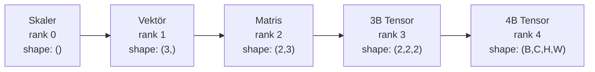
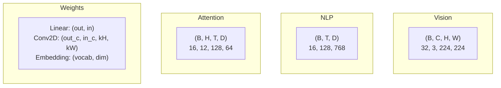
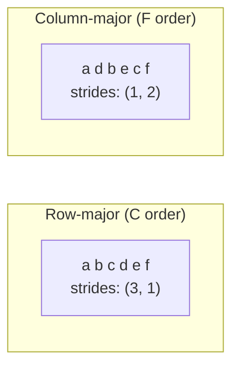
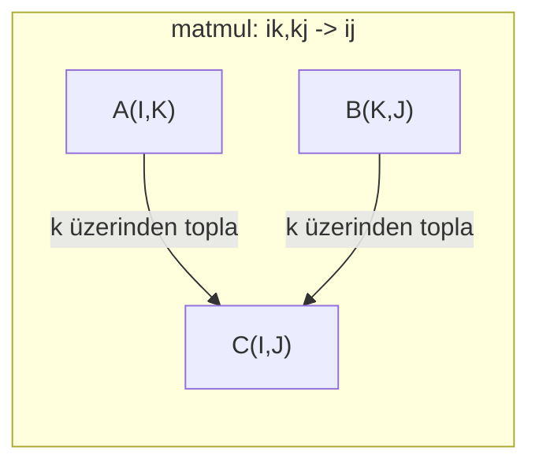

# Tensor İşlemleri

> Tensor'lar veri ile deep learning arasındaki ortak dildir. Her görüntü, her cümle, her gradyan onların içinden akar.

**Tür:** Yapım
**Dil:** Python
**Ön koşullar:** Faz 1, Ders 01 (Lineer Cebir Sezgisi), 02 (Vektörler, Matrisler ve İşlemler)
**Süre:** ~90 dakika

## Öğrenme Hedefleri

- Shape, stride, reshape, transpoz ve eleman bazlı işlemlerle sıfırdan bir tensor sınıfı implemente et
- Veriyi kopyalamadan farklı shape'li tensor'lar üzerinde işlem yapmak için broadcasting kurallarını uygula
- Dot product'lar, matris çarpımları, outer product'lar ve batch işlemleri için einsum ifadeleri yaz
- Multi-head attention'ın her adımı boyunca tam tensor shape'lerini takip et

## Sorun

Bir transformer inşa ediyorsun. Forward pass temiz görünüyor. Onu çalıştırıyorsun ve şunu alıyorsun: `RuntimeError: mat1 and mat2 shapes cannot be multiplied (32x768 and 512x768)`. Shape'lere bakıyorsun. Bir transpose deniyorsun. Şimdi `Expected 4D input (got 3D input)` diyor. Bir unsqueeze ekliyorsun. Başka bir şey bozuluyor.

Shape hataları deep learning kodundaki en yaygın bug'dır. Kavramsal olarak zor değiller — her işlemin bir shape sözleşmesi var — ama hızla katlanırlar. Bir transformer'ın birbirine zincirlenmiş düzinelerce reshape, transpose ve broadcast'i vardır. Bir yanlış axis ve hata zincirleme çoğalır. Daha kötüsü, bazı shape hataları hiç hata fırlatmaz. Yanlış boyut üzerinde broadcast yaparak veya yanlış axis üzerinden toplayarak sessizce çöp üretirler.

Matrisler iki şey kümesi arasındaki ikili ilişkileri ele alır. Gerçek veri iki boyuta sığmaz. 224x224'te 32 RGB görüntüden oluşan bir batch, 4B bir tensor'dur: `(32, 3, 224, 224)`. 12 başlıklı self-attention da 4B'dir: `(batch, heads, seq_len, head_dim)`. Herhangi bir sayıda boyuta genelleyen, bunların hepsi üzerinde temiz bir şekilde bileşik olan işlemlerle bir veri yapısına ihtiyacın var. Bu yapı tensor'dur. İşlemlerinde ustalaş ve shape hataları önemsiz şekilde debug edilebilir hale gelir.

## Kavram

### Tensor nedir

Bir tensor, üniform veri türüne sahip çok boyutlu bir sayı dizisidir. Boyut sayısına **rank** (veya **order**) denir. Her boyut bir **axis**'tir. **Shape**, her axis boyunca boyutu listeleyen bir tuple'dır.



Toplam eleman sayısı = tüm boyutların çarpımı. Bir `(2, 3, 4)` shape'i `2 * 3 * 4 = 24` eleman tutar.

### Deep learning'de tensor shape'leri

Farklı veri türleri konvansiyon olarak belirli tensor shape'lerine eşlenir.



PyTorch NCHW (channels-first) kullanır. TensorFlow varsayılan olarak NHWC (channels-last) kullanır. Uyumsuz layout'lar sessiz yavaşlamalara veya hatalara yol açar.

### Bellek layout'u nasıl çalışır

Bellekteki bir 2B dizi 1B bir byte dizisidir. **Stride'lar**, her axis boyunca bir adım hareket etmek için kaç eleman atlanacağını söyler.



Transpoz veriyi hareket ettirmez. Stride'ları takas eder, tensor'u **non-contiguous** yapar — bir satırın elemanları artık bellekte bitişik değildir.

### Broadcasting kuralları

Broadcasting, veriyi kopyalamadan farklı shape'li tensor'lar üzerinde işlem yapmana izin verir. Shape'leri sağdan hizala. İki boyut, eşit olduklarında veya biri 1 olduğunda uyumludur. Daha az boyut sola 1'lerle doldurulur.

```
Tensor A:     (8, 1, 6, 1)
Tensor B:        (7, 1, 5)
Doldurulmuş B: (1, 7, 1, 5)
Sonuç:        (8, 7, 6, 5)
```

### Einsum: evrensel tensor işlemi

Einstein summation her axis'i bir harfle etiketler. Girdide olan ama çıktıda olmayan axis'ler toplanır. Her ikisinde olan axis'ler tutulur.



Anahtar desenler: `i,i->` (dot product), `i,j->ij` (outer product), `ii->` (trace), `ij->ji` (transpose), `bij,bjk->bik` (batch matmul), `bhtd,bhsd->bhts` (attention skorları).

## İnşa Et

Kod `code/tensors.py`'de yer alır. Her adım oradaki implementasyona referans verir.

### Adım 1: Tensor depolama ve stride'lar

Bir tensor düz bir sayı listesi artı shape metadata'sı depolar. Stride'lar, çok boyutlu indeksleri düz pozisyonlara eşlemek için indeksleme mantığına yol gösterir.

```python
class Tensor:
    def __init__(self, data, shape=None):
        if isinstance(data, (list, tuple)):
            self._data, self._shape = self._flatten_nested(data)
        elif isinstance(data, np.ndarray):
            self._data = data.flatten().tolist()
            self._shape = tuple(data.shape)
        else:
            self._data = [data]
            self._shape = ()

        if shape is not None:
            total = reduce(lambda a, b: a * b, shape, 1)
            if total != len(self._data):
                raise ValueError(
                    f"Cannot reshape {len(self._data)} elements into shape {shape}"
                )
            self._shape = tuple(shape)

        self._strides = self._compute_strides(self._shape)

    @staticmethod
    def _compute_strides(shape):
        if len(shape) == 0:
            return ()
        strides = [1] * len(shape)
        for i in range(len(shape) - 2, -1, -1):
            strides[i] = strides[i + 1] * shape[i + 1]
        return tuple(strides)
```

Shape `(3, 4)` için stride'lar `(4, 1)` — bir satır ilerlemek için 4 eleman atla, bir sütun ilerlemek için 1 eleman atla.

### Adım 2: Reshape, squeeze, unsqueeze

Reshape eleman sırasını değiştirmeden shape'i değiştirir. Toplam eleman sayısı aynı kalmalıdır. Bir boyutun boyutunu çıkarmak için `-1` kullan.

```python
t = Tensor(list(range(12)), shape=(2, 6))
r = t.reshape((3, 4))
r = t.reshape((-1, 3))
```

Squeeze 1 boyutlu axis'leri kaldırır. Unsqueeze bir tane ekler. Unsqueeze broadcasting için kritiktir — bir batch `(B, T, D)`'ye eklenen bir bias vektörü `(D,)`'nın `(1, 1, D)` olarak unsqueeze edilmesi gerekir.

```python
t = Tensor(list(range(6)), shape=(1, 3, 1, 2))
s = t.squeeze()
v = Tensor([1, 2, 3])
u = v.unsqueeze(0)
```

### Adım 3: Transpose ve permute

Transpose iki axis'i takas eder. Permute tüm axis'leri yeniden sıralar. NCHW ve NHWC arasında böyle dönüşürsün.

```python
mat = Tensor(list(range(6)), shape=(2, 3))
tr = mat.transpose(0, 1)

t4d = Tensor(list(range(24)), shape=(1, 2, 3, 4))
perm = t4d.permute((0, 2, 3, 1))
```

Transpose veya permute sonrası tensor bellekte non-contiguous'tur. PyTorch'ta `view` non-contiguous tensor'larda başarısız olur — `reshape` kullan veya önce `.contiguous()` çağır.

### Adım 4: Eleman bazlı işlemler ve reductions

Eleman bazlı işlemler (add, multiply, subtract) her elemana bağımsız olarak uygulanır ve shape'i korur. Reduction'lar (sum, mean, max) bir veya daha fazla axis'i çökertir.

```python
a = Tensor([[1, 2], [3, 4]])
b = Tensor([[10, 20], [30, 40]])
c = a + b
d = a * 2
s = a.sum(axis=0)
```

Bir CNN'de global average pooling: `(B, C, H, W).mean(axis=[2, 3])` `(B, C)` üretir. NLP'de sequence mean pooling: `(B, T, D).mean(axis=1)` `(B, D)` üretir.

### Adım 5: NumPy ile broadcasting

`tensors.py`'deki `demo_broadcasting_numpy()` fonksiyonu temel desenleri gösterir.

```python
activations = np.random.randn(4, 3)
bias = np.array([0.1, 0.2, 0.3])
result = activations + bias

images = np.random.randn(2, 3, 4, 4)
scale = np.array([0.5, 1.0, 1.5]).reshape(1, 3, 1, 1)
result = images * scale

a = np.array([1, 2, 3]).reshape(-1, 1)
b = np.array([10, 20, 30, 40]).reshape(1, -1)
outer = a * b
```

Broadcasting ile ikili uzaklık: `(M, 2)`'yi `(M, 1, 2)`'ye ve `(N, 2)`'yi `(1, N, 2)`'ye reshape et, çıkar, kare al, son axis boyunca topla, karekök al. Sonuç: `(M, N)`.

### Adım 6: Einsum işlemleri

`demo_einsum()` ve `demo_einsum_gallery()` fonksiyonları her yaygın deseni gösterir.

```python
a = np.array([1.0, 2.0, 3.0])
b = np.array([4.0, 5.0, 6.0])
dot = np.einsum("i,i->", a, b)

A = np.array([[1, 2], [3, 4], [5, 6]], dtype=float)
B = np.array([[7, 8, 9], [10, 11, 12]], dtype=float)
matmul = np.einsum("ik,kj->ij", A, B)

batch_A = np.random.randn(4, 3, 5)
batch_B = np.random.randn(4, 5, 2)
batch_mm = np.einsum("bij,bjk->bik", batch_A, batch_B)
```

Bir contraction'ın hesaplama maliyeti tüm indeks boyutlarının (tutulanlar ve toplananlar) çarpımıdır. B=32, I=128, J=64, K=128 ile `bij,bjk->bik` için: `32 * 128 * 64 * 128 = 33.554.432` multiply-add.

### Adım 7: Einsum ile attention mekanizması

`demo_attention_einsum()` fonksiyonu multi-head attention'ı uçtan uca implemente eder.

```python
B, H, T, D = 2, 4, 8, 16
E = H * D

X = np.random.randn(B, T, E)
W_q = np.random.randn(E, E) * 0.02

Q = np.einsum("bte,ek->btk", X, W_q)
Q = Q.reshape(B, T, H, D).transpose(0, 2, 1, 3)

scores = np.einsum("bhtd,bhsd->bhts", Q, K) / np.sqrt(D)
weights = softmax(scores, axis=-1)
attn_output = np.einsum("bhts,bhsd->bhtd", weights, V)

concat = attn_output.transpose(0, 2, 1, 3).reshape(B, T, E)
output = np.einsum("bte,ek->btk", concat, W_o)
```

Her adım bir tensor işlemidir: projeksiyon (einsum üzerinden matmul), head splitting (reshape + transpose), attention skorları (einsum üzerinden batch matmul), ağırlıklı toplam (einsum üzerinden batch matmul), head merging (transpose + reshape), output projection (einsum üzerinden matmul).

## Kullan

### Sıfırdan vs NumPy

| İşlem | Sıfırdan (Tensor sınıfı) | NumPy |
|---|---|---|
| Oluştur | `Tensor([[1,2],[3,4]])` | `np.array([[1,2],[3,4]])` |
| Reshape | `t.reshape((3,4))` | `a.reshape(3,4)` |
| Transpose | `t.transpose(0,1)` | `a.T` veya `a.transpose(0,1)` |
| Squeeze | `t.squeeze(0)` | `np.squeeze(a, 0)` |
| Sum | `t.sum(axis=0)` | `a.sum(axis=0)` |
| Einsum | Yok | `np.einsum("ij,jk->ik", a, b)` |

### Sıfırdan vs PyTorch

```python
import torch

t = torch.tensor([[1, 2, 3], [4, 5, 6]], dtype=torch.float32)
t.shape
t.stride()
t.is_contiguous()

t.reshape(3, 2)
t.unsqueeze(0)
t.transpose(0, 1)
t.transpose(0, 1).contiguous()

torch.einsum("ik,kj->ij", A, B)
```

PyTorch autograd, GPU desteği ve optimize edilmiş BLAS kernel'leri ekler. Shape semantikleri aynıdır. Sıfırdan versiyonunu anlıyorsan, PyTorch shape hataları okunabilir hale gelir.

### Tensor işlemi olarak her sinir ağı katmanı

| İşlem | Tensor Formu | Einsum |
|---|---|---|
| Linear katman | `Y = X @ W.T + b` | `"bd,od->bo"` + bias |
| Attention QKV | `Q = X @ W_q` | `"btd,dh->bth"` |
| Attention skorları | `Q @ K.T / sqrt(d)` | `"bhtd,bhsd->bhts"` |
| Attention çıkışı | `softmax(scores) @ V` | `"bhts,bhsd->bhtd"` |
| Batch norm | `(X - mu) / sigma * gamma` | eleman bazlı + broadcast |
| Softmax | `exp(x) / sum(exp(x))` | eleman bazlı + reduction |

## Yayınla

Bu ders iki yeniden kullanılabilir prompt üretir:

1. **`outputs/prompt-tensor-shapes.md`** -- Tensor shape uyumsuzluklarını debug etmek için sistematik bir prompt. Her yaygın işlem (matmul, broadcast, cat, Linear, Conv2d, BatchNorm, softmax) için karar tabloları ve bir fix lookup tablosu içerir.

2. **`outputs/prompt-tensor-debugger.md`** -- Bir shape hatası seni engellediğinde herhangi bir yapay zeka asistanına yapıştırdığın adım adım bir debugging promptu. Ona hata mesajını ve tensor shape'lerini ver, tam fix'i geri al.

## Alıştırmalar

1. **Kolay -- Reshape gidiş-dönüş.** Shape'i `(2, 3, 4)` olan bir tensor al. Onu `(6, 4)`'e, sonra `(24,)`'e, sonra geri `(2, 3, 4)`'e reshape et. Düz veriyi yazdırarak her adımda eleman sırasının korunduğunu doğrula.

2. **Orta -- Broadcasting implemente et.** `Tensor` sınıfını, hedef shape'e eşleşmek için boyutu 1 olan boyutları genişleten bir `broadcast_to(shape)` metoduyla genişlet. Sonra `_elementwise_op`'u işlem yapmadan önce otomatik olarak broadcast yapacak şekilde değiştir. `(3, 1)` ve `(1, 4)` shape'leri ile `(3, 4)` üretmek için test et.

3. **Zor -- Sıfırdan einsum kur.** En azından şunları halleden basit bir `einsum(subscripts, *tensors)` fonksiyonu implemente et: dot product (`i,i->`), matris çarpımı (`ij,jk->ik`), outer product (`i,j->ij`) ve transpose (`ij->ji`). Subscript string'i parse et, contract edilen indeksleri tanımla ve tüm indeks kombinasyonları üzerinde döngü kur. Sonuçlarını `np.einsum`'a karşı karşılaştır.

4. **Zor -- Attention shape izleyici.** `batch_size`, `seq_len`, `embed_dim` ve `num_heads`'i girdi olarak alan ve multi-head attention'ın her adımında tam shape'i yazdıran bir fonksiyon yaz: input, Q/K/V projection, head split, attention scores, softmax weights, weighted sum, head merge, output projection. `demo_attention_einsum()` çıktısına karşı doğrula.

## Anahtar Terimler

| Terim | İnsanlar ne der | Aslında ne demek |
|---|---|---|
| Tensor | "Matris ama daha fazla boyut" | Üniform tipte ve tanımlı shape, stride ve işlemleri olan çok boyutlu bir dizi |
| Rank | "Boyut sayısı" | Axis sayısı. Bir matrisin rank'ı 2'dir, matris rank'ına eşit değil |
| Shape | "Tensor'un boyutu" | Her axis boyunca boyutu listeleyen tuple. `(2, 3)` 2 satır, 3 sütun demek |
| Stride | "Bellek nasıl yerleştirilmiş" | Her axis boyunca bir pozisyon ilerlemek için atlanacak eleman sayısı |
| Broadcasting | "Shape'ler farklı olduğunda çalışıyor" | Katı bir kurallar seti: sağdan hizala, boyutlar eşit olmalı veya biri 1 olmalı |
| Contiguous | "Tensor normal" | Mantıksal layout'tan boşluk veya yeniden sıralama olmadan bellekte sırayla depolanan elemanlar |
| Einsum | "Matmul yazmanın süslü yolu" | Herhangi bir tensor contraction'ını, outer product'ı, trace'i veya transpose'u tek satırda ifade eden genel bir notasyon |
| View | "Reshape ile aynı" | Aynı bellek tamponunu paylaşan ama farklı shape/stride metadata'sı olan tensor. Non-contiguous veride başarısız olur |
| Contraction | "Bir indeks üzerinden toplama" | Tensor'lar arasında paylaşılan bir indeksin çarpılıp toplandığı, daha düşük rank sonuç üreten genel işlem |
| NCHW / NHWC | "PyTorch vs TensorFlow formatı" | Görüntü tensor'ları için bellek layout konvansiyonları. NCHW kanalları spatial dim'lerden önce koyar, NHWC sonra koyar |

## İleri Okuma

- [NumPy Broadcasting](https://numpy.org/doc/stable/user/basics.broadcasting.html) -- Görsel örneklerle kanonik kurallar
- [PyTorch Tensor Views](https://pytorch.org/docs/stable/tensor_view.html) -- View'lar ne zaman çalışır ve ne zaman kopyalanır
- [einops](https://github.com/arogozhnikov/einops) -- Tensor reshape'lemeyi okunabilir ve güvenli hale getiren bir kütüphane
- [The Illustrated Transformer](https://jalammar.github.io/illustrated-transformer/) -- Attention boyunca akan tensor shape'lerini görselleştirir
- [Einstein Summation in NumPy](https://numpy.org/doc/stable/reference/generated/numpy.einsum.html) -- Örneklerle tam einsum dokümantasyonu
