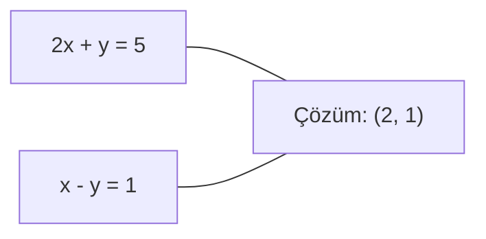
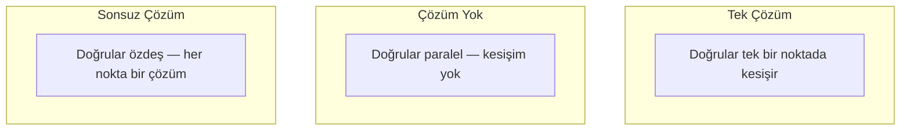

# Lineer Sistemler

> Ax = b'yi çözmek matematikteki en eski problemdir ve hala sinir ağını çalıştırır.

**Tür:** Yapım
**Dil:** Python
**Ön koşullar:** Faz 1, Ders 01 (Lineer Cebir Sezgisi), 02 (Vektörler ve Matrisler), 03 (Matris Dönüşümleri)
**Süre:** ~120 dakika

## Öğrenme Hedefleri

- Kısmi pivotlama ve back substitution ile Gauss elemesi kullanarak Ax = b'yi çöz
- Matrisleri LU, QR ve Cholesky ayrıştırmalarıyla faktörle ve her birinin ne zaman uygun olduğunu açıkla
- En küçük kareler için normal denklemleri türet ve onları lineer ve ridge regresyonuna bağla
- Condition number kullanarak kötü koşullanmış sistemleri teşhis et ve onları kararlı kılmak için regularization uygula

## Sorun

Lineer regresyon eğittiğin her seferinde bir lineer sistem çözersin. En küçük kareler fit'i hesapladığın her seferinde bir lineer sistem çözersin. Bir sinir ağı katmanı `y = Wx + b` hesapladığı her seferinde lineer bir sistemin bir tarafını değerlendiriyor. Regularization eklediğinde, sistemi değiştirirsin. Gaussian processes kullandığında, bir matris faktörlersin. Mahalanobis uzaklığı için bir kovaryans matrisini tersine çevirdiğinde, bir lineer sistem çözersin.

Ax = b denklemi her yerde görünür. A bilinen katsayıların bir matrisidir. b bilinen çıktıların bir vektörüdür. x bulmak istediğin bilinmeyenlerin vektörüdür. Lineer regresyonda, A veri matrisin, b hedef vektörün ve x weight vektörüdür. Tüm model şuna indirgenir: Ax mümkün olduğunca b'ye yakın olacak şekilde x bul.

Bu ders o denklemi çözmek için her büyük yöntemi sıfırdan inşa eder. Bazı yöntemlerin neden hızlı ve diğerlerinin kararlı olduğunu, bazılarının neden sadece kare sistemler için çalışırken diğerlerinin aşırı belirlenmiş sistemleri halletmesini ve matrisinizin condition number'ının cevabınızın bir anlam ifade edip etmediğini neden belirlediğini anlayacaksınız.

## Kavram

### Ax = b'nin geometrik anlamı

Bir lineer denklemler sisteminin geometrik bir yorumu vardır. Her denklem bir hiperdüzlem tanımlar. Çözüm tüm hiperdüzlemlerin kesiştiği nokta(lar)dır.

```
2x + y = 5          2B'de iki doğru.
x - y  = 1          x=2, y=1'de kesişirler.
```



Üç şey olabilir:



Matris formunda, "tek çözüm" A'nın tersinir olduğu anlamına gelir. "Çözüm yok" sistemin tutarsız olduğu anlamına gelir. "Sonsuz çözüm" A'nın bir null space'i olduğu anlamına gelir. Çoğu ML problemi "kesin çözüm yok" kategorisine düşer çünkü bilinmeyenlerden (parametreler) daha fazla denkleminiz (veri noktaları) vardır. En küçük karelerin devreye girdiği yer burasıdır.

### Sütun resmi vs satır resmi

Ax = b'yi okumanın iki yolu vardır.

**Satır resmi.** A'nın her satırı bir denklem tanımlar. Her denklem bir hiperdüzlemdir. Çözüm hepsinin kesiştiği yerdir.

**Sütun resmi.** A'nın her sütunu bir vektördür. Soru şu hale gelir: A'nın sütunlarının hangi lineer kombinasyonu b'yi üretir?

```
A = | 2  1 |    b = | 5 |
    | 1 -1 |        | 1 |

Satır resmi: 2x + y = 5 ve x - y = 1'i eşzamanlı çöz.

Sütun resmi: x1, x2 bul öyle ki:
  x1 * [2, 1] + x2 * [1, -1] = [5, 1]
  2 * [2, 1] + 1 * [1, -1] = [4+1, 2-1] = [5, 1]   doğru.
```

Sütun resmi daha temeldir. Eğer b, A'nın sütun uzayında yer alıyorsa, sistemin bir çözümü vardır. Yatmıyorsa, sütun uzayındaki en yakın noktayı bulursun. O en yakın nokta en küçük kareler çözümüdür.

### Gauss elemesi

Gauss elemesi Ax = b'yi back substitution ile çözeceğin üst üçgen sistem Ux = c'ye dönüştürür. En doğrudan yöntemdir.

Algoritma:

```
1. Her sütun k için (pivot sütun):
   a. K satırında veya altında k sütununda en büyük girdiyi bul (kısmi pivotlama).
   b. O satırı k satırıyla takas et.
   c. K'nin altındaki her i satırı için:
      - Çarpan m = A[i][k] / A[k][k] hesapla
      - I satırından m kez k satırını çıkar.
2. Back substitute: son denklemden yukarı doğru çöz.
```

Örnek:

```
Orijinal:
| 2  1  1 | 8 |       R2 = R2 - (2)R1     | 2  1   1 |  8 |
| 4  3  3 |20 |  -->  R3 = R3 - (1)R1 --> | 0  1   1 |  4 |
| 2  3  1 |12 |                            | 0  2   0 |  4 |

                       R3 = R3 - (2)R2     | 2  1   1 |  8 |
                                       --> | 0  1   1 |  4 |
                                           | 0  0  -2 | -4 |

Back substitute:
  -2 * x3 = -4    -->  x3 = 2
  x2 + 2  = 4     -->  x2 = 2
  2*x1 + 2 + 2 = 8 --> x1 = 2
```

Gauss elemesi O(n^3) işlem maliyetlidir. 1000x1000 bir sistem için bu yaklaşık bir milyar floating-point işlemdir. Hızlı, ama aynı A ile birden çok sistem çözmen gerekirse daha iyisini yapabilirsin.

### Kısmi pivotlama: neden önemli

Pivotlama olmadan, Gauss elemesi başarısız olabilir veya çöp üretebilir. Bir pivot elemanı sıfırsa, sıfıra bölersin. Küçükse, yuvarlama hatalarını büyütürsün.

```
Kötü pivot:                      Kısmi pivotlama ile:
| 0.001  1 | 1.001 |            Önce satırları takas et:
| 1      1 | 2     |            | 1      1 | 2     |
                                 | 0.001  1 | 1.001 |
m = 1/0.001 = 1000              m = 0.001/1 = 0.001
R2 = R2 - 1000*R1               R2 = R2 - 0.001*R1
| 0.001  1     | 1.001   |      | 1      1     | 2     |
| 0     -999   | -999.0  |      | 0      0.999 | 0.999 |

x2 = 1.000 (doğru)              x2 = 1.000 (doğru)
x1 = (1.001 - 1)/0.001          x1 = (2 - 1)/1 = 1.000 (doğru)
   = 0.001/0.001 = 1.000        Kararlı çünkü çarpan küçük.
```

Sınırlı hassasiyetli floating-point aritmetiğinde, pivotlanmamış versiyon anlamlı basamakları kaybedebilir. Kısmi pivotlama, hata büyütmesini minimize etmek için her zaman en büyük mevcut pivotu seçer.

### LU ayrıştırması

LU ayrıştırması A'yı L alt üçgen matris ve U üst üçgen matrise faktörler: A = LU. L matrisi Gauss elemesinden çarpanları saklar. U matrisi elemenin sonucudur.

```
A = L @ U

| 2  1  1 |   | 1  0  0 |   | 2  1   1 |
| 4  3  3 | = | 2  1  0 | @ | 0  1   1 |
| 2  3  1 |   | 1  2  1 |   | 0  0  -2 |
```

Sadece elemek yerine neden faktörle? Çünkü L ve U'ya sahip olduğunda, herhangi bir yeni b için Ax = b'yi çözmek sadece O(n^2) maliyettir:

```
Ax = b
LUx = b
y = Ux olsun:
  Ly = b    (forward substitution, O(n^2))
  Ux = y    (back substitution, O(n^2))
```

O(n^3) maliyeti faktörleme sırasında bir kez ödenir. Sonraki her çözme O(n^2)'dir. Aynı A ile ama farklı b vektörleriyle 1000 sistem çözmen gerekirse, LU toplam iş yükünden 1000/3 faktör tasarruf eder.

Kısmi pivotlama ile, PA = LU elde edersin burada P satır takaslarını kaydeden bir permütasyon matrisidir.

### QR ayrıştırması

QR ayrıştırması A'yı Q ortogonal matris ve R üst üçgen matrise faktörler: A = QR.

Bir ortogonal matris Q^T Q = I özelliğine sahiptir. Sütunları ortonormal vektörlerdir. Q ile çarpmak uzunlukları ve açıları korur.

```
A = Q @ R

Q ortonormal sütunlara sahip: Q^T Q = I
R üst üçgen

Ax = b'yi çözmek için:
  QRx = b
  Rx = Q^T b    (sadece Q^T ile çarp, ters alma gerekmez)
  X'i almak için back substitute.
```

QR en küçük kareler problemleri çözmek için LU'dan sayısal olarak daha kararlıdır. Gram-Schmidt süreci Q'yu sütun sütun inşa eder:

```
A'nın sütunları a1, a2, ... verildiğinde:

q1 = a1 / ||a1||

q2 = a2 - (a2 . q1) * q1        (q1 üzerine projeksiyonu çıkar)
q2 = q2 / ||q2||                (normalize et)

q3 = a3 - (a3 . q1) * q1 - (a3 . q2) * q2
q3 = q3 / ||q3||

R[i][j] = qi . aj    i <= j için
```

Her adım tüm önceki q vektörleri boyunca bileşeni kaldırır, sadece yeni ortogonal yönü bırakır.

### Cholesky ayrıştırması

A simetrik (A = A^T) ve pozitif tanımlı (tüm eigenvalue'lar pozitif) olduğunda, L alt üçgen olacak şekilde A = L L^T olarak faktörleyebilirsin. Bu Cholesky ayrıştırmasıdır.

```
A = L @ L^T

| 4  2 |   | 2  0 |   | 2  1 |
| 2  5 | = | 1  2 | @ | 0  2 |

L[i][i] = sqrt(A[i][i] - sum(L[i][k]^2 for k < i))
L[i][j] = (A[i][j] - sum(L[i][k]*L[j][k] for k < j)) / L[j][j]    i > j için
```

Cholesky LU'nun iki katı hızlıdır ve depolama yarısı kadar gerektirir. Sadece simetrik pozitif tanımlı matrisler için çalışır ama bunlar sürekli ortaya çıkar:

- Kovaryans matrisleri simetrik pozitif yarı tanımlıdır (regularization ile pozitif tanımlı).
- Gaussian processes'teki kernel matrisi simetrik pozitif tanımlıdır.
- Bir minimumda konveks bir fonksiyonun Hessian'ı simetrik pozitif tanımlıdır.
- A^T A her zaman simetrik pozitif yarı tanımlıdır.

Gaussian processes'te, kernel matrisi K'yi Cholesky ile faktörlersin, sonra tahmin ortalamasını almak için K alpha = y çözersin. Cholesky faktör marginal likelihood için log-determinant da verir: log det(K) = 2 * sum(log(diag(L))).

### En küçük kareler: Ax = b'nin kesin çözümü olmadığında

A m x n ise m > n ile (bilinmeyenlerden daha fazla denklem), sistem aşırı belirlenmiştir. Kesin çözüm yoktur. Bunun yerine, kare hatasını minimize edersin:

```
||Ax - b||^2'yi minimize et

Bu kare kalıntıların toplamıdır:
  sum((A[i,:] @ x - b[i])^2 for i in range(m))
```

Minimize eden normal denklemleri karşılar:

```
A^T A x = A^T b
```

Türetim: ||Ax - b||^2 = (Ax - b)^T (Ax - b) = x^T A^T A x - 2 x^T A^T b + b^T b'yi aç. X'e göre gradyanını al, sıfıra ayarla: 2 A^T A x - 2 A^T b = 0.

```
Orijinal sistem (aşırı belirlenmiş, 4 denklem, 2 bilinmeyen):
| 1  1 |         | 3 |
| 1  2 | x     = | 5 |       4 denklemi de karşılayan kesin x yok.
| 1  3 |         | 6 |
| 1  4 |         | 8 |

Normal denklemler:
A^T A = | 4  10 |    A^T b = | 22 |
        | 10 30 |            | 63 |

Çöz: x = [1.5, 1.7]

Bu lineer regresyondur. x[0] intercept, x[1] slope'tur.
```

### Normal denklemler = lineer regresyon

Bağlantı kesindir. Lineer regresyonda, veri matrisin X her örnek için bir satıra ve her feature için bir sütuna sahiptir. Hedef vektörün y her örnek için bir girdiye sahiptir. Weight vektörü w şunu karşılar:

```
X^T X w = X^T y
w = (X^T X)^(-1) X^T y
```

Bu lineer regresyona kapalı form çözümdür. `sklearn.linear_model.LinearRegression.fit()` her çağrı bunu (veya QR veya SVD üzerinden eşdeğeri) hesaplar.

Matrise bir regularization terimi lambda * I ekle ve ridge regresyonu elde edersin:

```
(X^T X + lambda * I) w = X^T y
w = (X^T X + lambda * I)^(-1) X^T y
```

Regularization matrisi daha iyi koşullanmış yapar (daha doğru tersine çevrilebilir) ve weight'leri sıfıra doğru küçülterek overfitting'i önler. Lambda > 0 olduğunda matris X^T X + lambda * I her zaman simetrik pozitif tanımlıdır, dolayısıyla Cholesky ile çözebilirsin.

### Pseudoinverse (Moore-Penrose)

Pseudoinverse A+ matris tersini kare olmayan ve singular matrislere genelleştirir. Herhangi bir A matrisi için:

```
x = A+ b

burada A+ = V Sigma+ U^T    (SVD ile hesaplanır)
```

Sigma+ her sıfır olmayan singular value'nun resiprokalını alıp sonucu transpoze ederek oluşturulur. A = U Sigma V^T ise, A+ = V Sigma+ U^T.

```
A = U Sigma V^T        (SVD)

Sigma = | 5  0 |       Sigma+ = | 1/5  0  0 |
        | 0  2 |                | 0  1/2  0 |
        | 0  0 |

A+ = V Sigma+ U^T
```

Pseudoinverse minimum-norm en küçük kareler çözümünü verir. Eğer sistem:
- Bir çözüm: A+ b onu verir.
- Çözüm yok: A+ b en küçük kareler çözümünü verir.
- Sonsuz çözüm: A+ b en küçük ||x|| olanı verir.

NumPy'ın `np.linalg.lstsq` ve `np.linalg.pinv`'i içeride SVD kullanır.

### Condition number

Condition number çözümün girdideki küçük değişikliklere ne kadar duyarlı olduğunu ölçer. Bir A matrisi için condition number:

```
kappa(A) = ||A|| * ||A^(-1)|| = sigma_max / sigma_min
```

burada sigma_max ve sigma_min en büyük ve en küçük singular value'lardır.

```
İyi koşullanmış (kappa ~ 1):        Kötü koşullanmış (kappa ~ 10^15):
B'de küçük değişiklik -->            B'de küçük değişiklik -->
x'te küçük değişiklik                x'te büyük değişiklik

| 2  0 |   kappa = 2/1 = 2          | 1   1          |   kappa ~ 10^15
| 0  1 |   güvenle çöz              | 1   1+10^(-15) |   çözüm çöp
```

Pratik kurallar:
- kappa < 100: güvenli, çözüm doğru.
- kappa ~ 10^k: floating-point aritmetiğinden yaklaşık k hassasiyet basamağı kaybedersin.
- kappa ~ 10^16 (float64 için): çözüm anlamsız. Matris etkin olarak singular'dır.

ML'de, feature'lar neredeyse eşdoğrusal olduğunda kötü koşullanma olur. Regularization (lambda * I ekleyerek) condition number'ı sigma_max / sigma_min'den (sigma_max + lambda) / (sigma_min + lambda)'ya iyileştirir.

### İteratif yöntemler: conjugate gradient

Çok büyük seyrek sistemler (milyonlarca bilinmeyen) için, LU veya Cholesky gibi doğrudan yöntemler çok pahalıdır. İteratif yöntemler birçok iterasyon boyunca bir tahmini iyileştirerek çözüme yaklaşıklar.

Conjugate gradient (CG) A simetrik pozitif tanımlı olduğunda Ax = b'yi çözer. En fazla n iterasyonda kesin çözümü bulur (kesin aritmetikte), ama A'nın eigenvalue'ları kümelenmişse genelde çok daha hızlı yakınsar.

```
Algoritma taslağı:
  x0 = başlangıç tahmini (genelde sıfır)
  r0 = b - A x0           (kalıntı)
  p0 = r0                 (arama yönü)

  k = 0, 1, 2, ... için:
    alpha = (rk . rk) / (pk . A pk)
    x_{k+1} = xk + alpha * pk
    r_{k+1} = rk - alpha * A pk
    beta = (r_{k+1} . r_{k+1}) / (rk . rk)
    p_{k+1} = r_{k+1} + beta * pk
    if ||r_{k+1}|| < tolerans: dur
```

CG şunlarda kullanılır:
- Büyük ölçekli optimizasyon (Newton-CG yöntemi)
- PDE ayrıklaştırmalarını çözme
- Kernel matrisinin faktörlenmeyecek kadar büyük olduğu kernel yöntemleri
- Diğer iteratif çözücüler için ön koşullandırma

Yakınsama oranı condition number'a bağlıdır. Daha iyi koşullanmış sistemler daha hızlı yakınsar, bu regularization'ın yardım etmesinin başka bir sebebidir.

### Tam resim: hangi yöntem ne zaman

| Yöntem | Gereksinimler | Maliyet | Kullanım |
|--------|-------------|------|----------|
| Gauss elemesi | Kare, nonsingular A | O(n^3) | Tek seferlik kare sistem çözümü |
| LU ayrıştırması | Kare, nonsingular A | O(n^3) faktör + O(n^2) çözüm | Aynı A ile birden çok çözüm |
| QR ayrıştırması | Herhangi bir A (m >= n) | O(mn^2) | En küçük kareler, sayısal olarak kararlı |
| Cholesky | Simetrik pozitif tanımlı A | O(n^3/3) | Kovaryans matrisleri, Gaussian processes, ridge regresyon |
| Normal denklemler | Aşırı belirlenmiş (m > n) | O(mn^2 + n^3) | Lineer regresyon (küçük n) |
| SVD / pseudoinverse | Herhangi bir A | O(mn^2) | Rank-eksik sistemler, minimum-norm çözümler |
| Conjugate gradient | Simetrik pozitif tanımlı, seyrek A | O(n * k * nnz) | Büyük seyrek sistemler, k = iterasyon |

### ML'ye bağlantı

Bu dersteki her yöntem üretim ML'inde görünür:

**Lineer regresyon.** Kapalı form çözüm normal denklemler X^T X w = X^T y'yi çözer. Bu Cholesky (n küçükse) veya QR (sayısal kararlılık önemliyse) veya SVD (matris rank-eksik olabilirse) ile yapılır.

**Ridge regresyon.** X^T X'e lambda * I ekler. Regularize edilmiş sistem (X^T X + lambda * I) w = X^T y, X^T X + lambda * I lambda > 0 için simetrik pozitif tanımlı olduğundan her zaman Cholesky ile çözülebilir.

**Gaussian processes.** Tahmin ortalaması K alpha = y çözmeyi gerektirir burada K kernel matrisidir. K'nin Cholesky faktörizasyonu standart yaklaşımdır. Log marginal likelihood log det(K) = 2 sum(log(diag(L))) kullanır.

**Sinir ağı initialization.** Ortogonal initialization sütunları ortonormal olan weight matrisleri oluşturmak için QR ayrıştırması kullanır. Derin ağlarda sinyal çöküşünü önler.

**Ön koşullandırma.** Büyük ölçekli optimizer'lar conjugate gradient çözücüleri için ön koşullandırıcı olarak incomplete Cholesky veya incomplete LU kullanır.

**Feature engineering.** X^T X'in condition number'ı feature'larının eşdoğrusal olup olmadığını söyler. Kappa büyükse, feature'ları at veya regularization ekle.

## İnşa Et

### Adım 1: Kısmi pivotlamalı Gauss elemesi

```python
import numpy as np

def gaussian_elimination(A, b):
    n = len(b)
    Ab = np.hstack([A.astype(float), b.reshape(-1, 1).astype(float)])

    for k in range(n):
        max_row = k + np.argmax(np.abs(Ab[k:, k]))
        Ab[[k, max_row]] = Ab[[max_row, k]]

        if abs(Ab[k, k]) < 1e-12:
            raise ValueError(f"Matrix is singular or nearly singular at pivot {k}")

        for i in range(k + 1, n):
            m = Ab[i, k] / Ab[k, k]
            Ab[i, k:] -= m * Ab[k, k:]

    x = np.zeros(n)
    for i in range(n - 1, -1, -1):
        x[i] = (Ab[i, -1] - Ab[i, i+1:n] @ x[i+1:n]) / Ab[i, i]

    return x
```

### Adım 2: LU ayrıştırması

```python
def lu_decompose(A):
    n = A.shape[0]
    L = np.eye(n)
    U = A.astype(float).copy()
    P = np.eye(n)

    for k in range(n):
        max_row = k + np.argmax(np.abs(U[k:, k]))
        if max_row != k:
            U[[k, max_row]] = U[[max_row, k]]
            P[[k, max_row]] = P[[max_row, k]]
            if k > 0:
                L[[k, max_row], :k] = L[[max_row, k], :k]

        for i in range(k + 1, n):
            L[i, k] = U[i, k] / U[k, k]
            U[i, k:] -= L[i, k] * U[k, k:]

    return P, L, U

def lu_solve(P, L, U, b):
    n = len(b)
    Pb = P @ b.astype(float)

    y = np.zeros(n)
    for i in range(n):
        y[i] = Pb[i] - L[i, :i] @ y[:i]

    x = np.zeros(n)
    for i in range(n - 1, -1, -1):
        x[i] = (y[i] - U[i, i+1:] @ x[i+1:]) / U[i, i]

    return x
```

### Adım 3: Cholesky ayrıştırması

```python
def cholesky(A):
    n = A.shape[0]
    L = np.zeros_like(A, dtype=float)

    for i in range(n):
        for j in range(i + 1):
            s = A[i, j] - L[i, :j] @ L[j, :j]
            if i == j:
                if s <= 0:
                    raise ValueError("Matrix is not positive definite")
                L[i, j] = np.sqrt(s)
            else:
                L[i, j] = s / L[j, j]

    return L
```

### Adım 4: Normal denklemler üzerinden en küçük kareler

```python
def least_squares_normal(A, b):
    AtA = A.T @ A
    Atb = A.T @ b
    return gaussian_elimination(AtA, Atb)

def ridge_regression(A, b, lam):
    n = A.shape[1]
    AtA = A.T @ A + lam * np.eye(n)
    Atb = A.T @ b
    L = cholesky(AtA)
    y = np.zeros(n)
    for i in range(n):
        y[i] = (Atb[i] - L[i, :i] @ y[:i]) / L[i, i]
    x = np.zeros(n)
    for i in range(n - 1, -1, -1):
        x[i] = (y[i] - L.T[i, i+1:] @ x[i+1:]) / L.T[i, i]
    return x
```

### Adım 5: Condition number

```python
def condition_number(A):
    U, S, Vt = np.linalg.svd(A)
    return S[0] / S[-1]
```

## Kullan

Gerçek veri üzerinde lineer regresyon ve ridge regresyon için parçaları bir araya getirme:

```python
np.random.seed(42)
X_raw = np.random.randn(100, 3)
w_true = np.array([2.0, -1.0, 0.5])
y = X_raw @ w_true + np.random.randn(100) * 0.1

X = np.column_stack([np.ones(100), X_raw])

w_ols = least_squares_normal(X, y)
print(f"OLS weight'leri (bizim):  {w_ols}")

w_np = np.linalg.lstsq(X, y, rcond=None)[0]
print(f"OLS weight'leri (numpy):   {w_np}")
print(f"Maksimum fark: {np.max(np.abs(w_ols - w_np)):.2e}")

w_ridge = ridge_regression(X, y, lam=1.0)
print(f"Ridge weight'leri (bizim): {w_ridge}")

from sklearn.linear_model import Ridge
ridge_sk = Ridge(alpha=1.0, fit_intercept=False)
ridge_sk.fit(X, y)
print(f"Ridge weight'leri (sklearn): {ridge_sk.coef_}")
```

## Yayınla

Bu ders şunu üretir:
- Gauss elemesi, LU ayrıştırması, Cholesky ayrıştırması, en küçük kareler ve ridge regresyonun sıfırdan implementasyonlarını içeren `code/linear_systems.py`
- Normal denklemlerin ve sklearn'in LinearRegression'ının aynı weight'leri ürettiğine dair çalışan bir gösteri

## Alıştırmalar

1. `[[1,2,3],[4,5,6],[7,8,10]] x = [6, 15, 27]` sistemini Gauss elemesini, LU çözücüsünü ve `np.linalg.solve`'u kullanarak çöz. Üçünün de floating-point toleransı içinde aynı cevabı verdiğini doğrula.

2. 50x5 rastgele bir matris X ve hedef y = X @ w_true + gürültü üret. Normal denklemler, QR (`np.linalg.qr` üzerinden), SVD (`np.linalg.svd` üzerinden) ve `np.linalg.lstsq` kullanarak w için çöz. Dört çözümün hepsini karşılaştır. X^T X'in condition number'ını ölç ve hangi yönteme güveneceğini nasıl etkilediğini açıkla.

3. İki sütunu neredeyse özdeş yaparak neredeyse singular bir matris oluştur (örn. sütun 2 = sütun 1 + 1e-10 * gürültü). Condition number'ını hesapla. Regularization ile ve regularization olmadan (0.01 * I ekle) Ax = b'yi çöz. Çözümleri ve kalıntıları karşılaştır. Regularization'ın neden yardım ettiğini açıkla.

4. 100x100 rastgele simetrik pozitif tanımlı bir matris için conjugate gradient algoritmasını implemente et. Tolerans 1e-8'e yakınsamak için kaç iterasyon aldığını say. Teorik maksimum n iterasyonu ile karşılaştır.

5. Cholesky çözücünü vs LU çözücünü vs `np.linalg.solve`'u boyut 10, 50, 200, 500 olan simetrik pozitif tanımlı matrislerde zamanla. Sonuçları çiz. Cholesky'nin LU'dan yaklaşık 2x daha hızlı olduğunu doğrula.

## Anahtar Terimler

| Terim | İnsanlar ne der | Aslında ne demek |
|------|----------------|----------------------|
| Lineer sistem | "X için çöz" | Lineer denklemler kümesi Ax = b. X'i bulmak A dönüşümü altında çıktı b'yi üreten girdiyi bulmak demektir. |
| Gauss elemesi | "Row reduce" | Satır işlemleri kullanarak diagonalin altındaki girdileri sistematik olarak sıfırlamak, back substitution ile çözülebilir üst üçgen bir sistem üretmek. O(n^3). |
| Kısmi pivotlama | "Kararlılık için satırları takas et" | Sütun k'de elemeden önce, o sütundaki en büyük mutlak değerli satırı pivot konumuna takas et. Küçük sayılara bölmeyi önler. |
| LU ayrıştırması | "Üçgenlere faktörle" | A = LU yaz burada L alt üçgen (çarpanları saklar) ve U üst üçgen (eleminmiş matris). O(n^3) maliyetini birden çok çözüme amorti eder. |
| QR ayrıştırması | "Ortogonal faktörizasyon" | A = QR yaz burada Q ortonormal sütunlara sahip ve R üst üçgen. En küçük kareler için LU'dan daha kararlı. |
| Cholesky ayrıştırması | "Matrisin karekökü" | Simetrik pozitif tanımlı A için, A = LL^T yaz. LU'nun yarısı maliyet. Kovaryans matrisleri, kernel matrisleri ve ridge regresyon için kullanılır. |
| En küçük kareler | "Kesin imkansızken en iyi fit" | Sistem aşırı belirlendiğinde (bilinmeyenden daha fazla denklem) kare kalıntılarının toplamı ||Ax - b||^2'yi minimize et. |
| Normal denklemler | "Kalkülüs kısayolu" | A^T A x = A^T b. ||Ax - b||^2'nin gradyanını sıfıra ayarlamak. Bu lineer regresyona kapalı form çözümdür. |
| Pseudoinverse | "Kare olmayan matrisler için inversion" | SVD üzerinden A+ = V Sigma+ U^T. Herhangi bir matris, kare veya dikdörtgen, singular veya değil için minimum-norm en küçük kareler çözümünü verir. |
| Condition number | "Bu cevap ne kadar güvenilir" | kappa = sigma_max / sigma_min. Girdi pertürbasyonlarına duyarlılığı ölçer. Yaklaşık log10(kappa) hassasiyet basamağı kaybedersin. |
| Ridge regresyon | "Regularize edilmiş en küçük kareler" | (X^T X + lambda I) w = X^T y çöz. Lambda I eklemek koşullanmayı iyileştirir ve weight'leri sıfıra doğru küçültür. Overfitting'i önler. |
| Conjugate gradient | "Büyük matrisler için iteratif Ax=b" | Simetrik pozitif tanımlı sistemler için iteratif çözücü. En fazla n adımda yakınsar. Faktörlemenin çok pahalı olduğu büyük seyrek sistemler için pratik. |
| Aşırı belirlenmiş sistem | "Parametreden daha fazla veri" | M x n bir sistemde m > n. Kesin çözüm yok. En küçük kareler en iyi yaklaşımı bulur. Bu her regresyon problemidir. |
| Back substitution | "Aşağıdan yukarı çöz" | Üst üçgen bir sistem verildiğinde, önce son denklemi çöz, sonra geriye doğru substitute et. O(n^2). |
| Forward substitution | "Yukarıdan aşağı çöz" | Alt üçgen bir sistem verildiğinde, önce ilk denklemi çöz, sonra ileri doğru substitute et. O(n^2). LU çözümlerinin L adımında kullanılır. |

## İleri Okuma

- [MIT 18.06: Linear Algebra](https://ocw.mit.edu/courses/18-06-linear-algebra-spring-2010/) (Gilbert Strang) -- lineer sistemler ve matris faktörizasyonları üzerine kesin kurs
- [Numerical Linear Algebra](https://people.maths.ox.ac.uk/trefethen/text.html) (Trefethen & Bau) -- sayısal kararlılığı, koşullanmayı ve algoritmaların neden başarısız olduğunu anlamak için standart referans
- [Matrix Computations](https://www.cs.cornell.edu/cv/GolubVanLoan4/golubandvanloan.htm) (Golub & Van Loan) -- her matris algoritması için ansiklopedik referans
- [3Blue1Brown: Inverse Matrices](https://www.3blue1brown.com/lessons/inverse-matrices) -- Ax = b çözmenin geometrik olarak ne anlama geldiğine dair görsel sezgi
