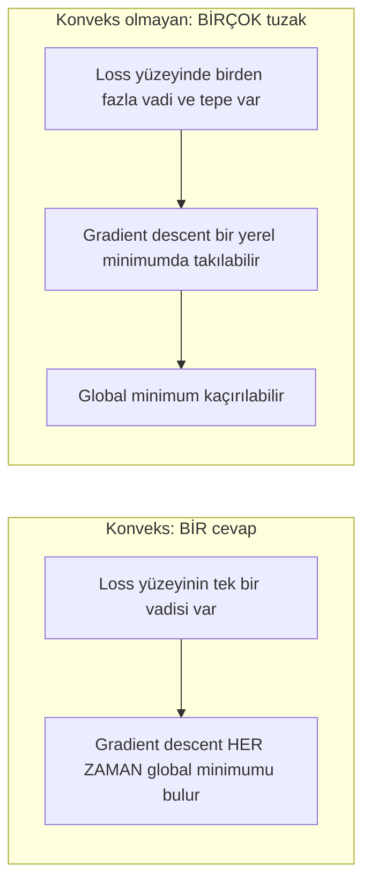
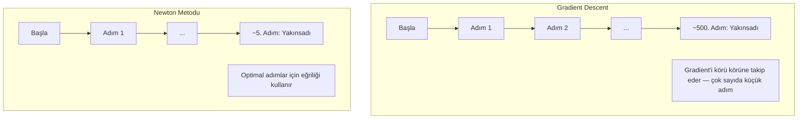
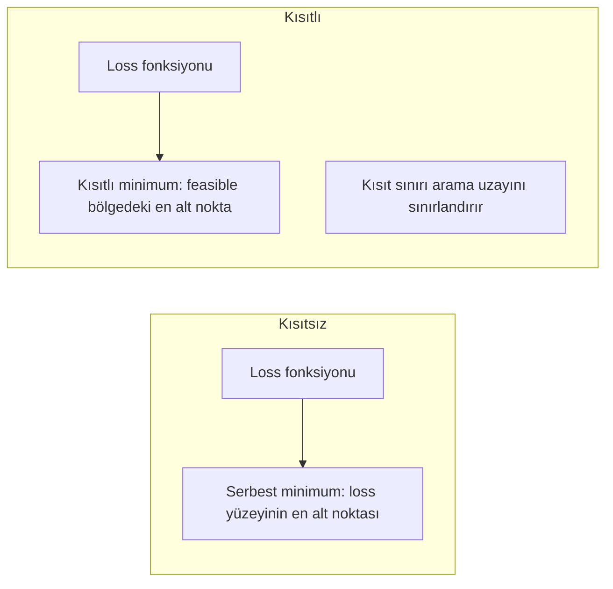
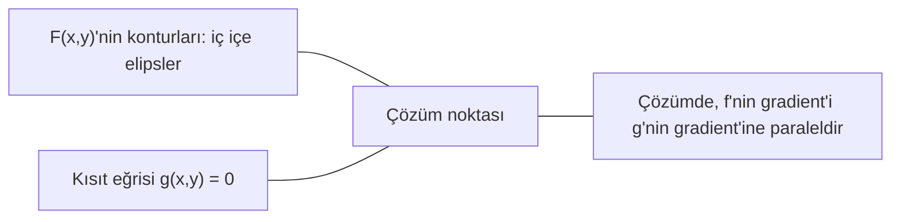

# Konveks Optimizasyon

> Konveks problemlerin bir vadisi vardır. Sinir ağlarının milyonlarcası vardır. Farkı bilmek önemli.

**Tür:** Yapım
**Dil:** Python
**Ön koşullar:** Faz 1, Ders 04 (ML için Kalkülüs), 08 (Optimizasyon)
**Süre:** ~90 dakika

## Öğrenme Hedefleri

- Tanım, ikinci türev ve Hessian kriterleri kullanarak bir fonksiyonun konveks olup olmadığını test et
- Newton metodunu implemente et ve quadratic yakınsamasını gradient descent ile karşılaştır
- Lagrange çarpanları kullanarak kısıtlı optimizasyon problemlerini çöz ve KKT koşullarını yorumla
- Sinir ağı loss manzaralarının neden konveks olmadığını ama SGD'nin yine de iyi çözümler bulduğunu açıkla

## Sorun

Ders 08 sana gradient descent, momentum ve Adam'ı öğretti. Bu optimizer'lar herhangi bir yüzey üzerinde yokuş aşağı yürür. Ama hiçbir garanti ile gelmezler. Konveks olmayan bir manzarada gradient descent kötü bir yerel minimuma inebilir, bir saddle point'te takılı kalabilir veya sonsuza kadar salınabilir. Yine de kullandın çünkü sinir ağları konveks değildir ve alternatif yoktur.

Ama makine öğrenmesindeki birçok problem konvekstir. Lineer regresyon, lojistik regresyon, SVM'ler, LASSO, ridge regresyon. Bunlar için daha güçlü bir şey vardır: matematiksel garantilerle optimizasyon. Bir konveks problemin tam olarak bir vadisi vardır. Yokuş aşağı yürüyen herhangi bir algoritma global minimuma ulaşır. Yeniden başlatma gerekmez. Learning rate schedule'ları gerekmez. Dua gerekmez.

Konveksliği anlamak üç şey yapar. Birincisi, problemin ne zaman kolay (konveks) veya zor (konveks olmayan) olduğunu söyler. İkincisi, konveks problemler için Newton metodu gibi daha hızlı araçlar verir. Üçüncüsü, ML boyunca görünen kavramları açıklar: kısıt olarak regularization, SVM'lerde duality ve konveksliğin verdiği her güzel özelliği ihlal etmesine rağmen deep learning'in neden çalıştığı.

## Kavram

### Konveks kümeler

Bir S kümesi konvekstir eğer S'deki herhangi iki nokta için, aralarındaki doğru parçası da tamamen S içinde yatıyorsa.

| Konveks kümeler | Konveks olmayan |
|---|---|
| **Dikdörtgen**: içindeki herhangi iki nokta içinde kalan bir doğru parçasıyla bağlanabilir | **Yıldız/ay şekli**: iki iç nokta arasındaki bir doğru kümenin dışından geçebilir |
| **Üçgen**: aynı özellik tüm iç noktalar için geçerlidir | **Simit/anüler**: delik bazı doğru parçalarının kümeden çıkmasına neden olur |
| Herhangi iki nokta arasındaki doğru parçası küme içinde kalır | Bazı nokta çiftleri arasındaki doğru parçası kümeden çıkar |

Resmi test: S'deki herhangi x, y noktaları ve [0, 1] aralığındaki herhangi t için, tx + (1-t)y noktası da S'dedir.

Konveks kümelerin örnekleri:
- Bir doğru, bir düzlem, tüm R^n
- Bir top (çember, küre, hiperküre)
- Bir yarı uzay: {x : a^T x <= b}
- Herhangi sayıda konveks kümenin kesişimi

Konveks olmayan küme örnekleri:
- Bir simit (annulus)
- İki ayrık çemberin birleşimi
- "Çentik" veya "deliği" olan herhangi bir küme

### Konveks fonksiyonlar

Bir f fonksiyonu konvekstir eğer alanı bir konveks küme ise ve alanındaki herhangi iki nokta x, y ve [0, 1] aralığındaki herhangi t için:

```
f(tx + (1-t)y) <= t*f(x) + (1-t)*f(y)
```

Geometrik olarak: grafikteki herhangi iki nokta arasındaki doğru parçası grafiğin üstünde veya üzerinde yatar.

| Özellik | Konveks fonksiyon | Konveks olmayan fonksiyon |
|---|---|---|
| **Doğru parçası testi** | Grafikteki herhangi iki nokta arasındaki doğru eğrinin **üstünde veya üzerinde** yatar | Grafikteki bazı noktalar arasındaki doğru eğrinin **altına** iner |
| **Şekil** | Yukarı kıvrılan tek çanak/vadi | Karışık eğrilikle birden fazla tepe ve vadi |
| **Yerel minimumlar** | Her yerel minimum global minimumdur | Farklı yüksekliklerde birden fazla yerel minimum olabilir |

Yaygın konveks fonksiyonlar:
- f(x) = x^2 (parabol)
- f(x) = |x| (mutlak değer)
- f(x) = e^x (üstel)
- f(x) = max(0, x) (ReLU, parçalı lineer olsa da)
- x > 0 için f(x) = -log(x) (negatif log)
- Herhangi bir lineer fonksiyon f(x) = a^T x + b (hem konveks hem konkav)

### Konvekslik testi

Üç pratik test, en kolaydan en titize.

**Test 1: İkinci türev testi (1B).** Tüm x için f''(x) >= 0 ise, f konvekstir.

- f(x) = x^2: f''(x) = 2 >= 0. Konveks.
- f(x) = x^3: f''(x) = 6x. X < 0 için negatif. Konveks değil.
- f(x) = e^x: f''(x) = e^x > 0. Konveks.

**Test 2: Hessian testi (çok değişkenli).** Hessian matrisi H(x) tüm x için pozitif yarı tanımlı ise, f konvekstir. Hessian, ikinci kısmi türevlerin matrisidir.

**Test 3: Tanım testi.** f(tx + (1-t)y) <= t*f(x) + (1-t)*f(y) eşitsizliğini doğrudan kontrol et. Türevlerin hesaplanması zor olan fonksiyonlar için yararlı.

### Konvekslik neden önemli

Konveks optimizasyonun merkezi teoremi:

**Bir konveks fonksiyon için, her yerel minimum bir global minimumdur.**

Bu, gradient descent'in kapana kısılamayacağı anlamına gelir. Yokuş aşağı herhangi bir yol aynı cevaba götürür. Algoritmanın optimal çözüme yakınsadığı garantilidir.



Sonuçlar:
- Rastgele yeniden başlatmalara gerek yok
- Karmaşık learning rate schedule'larına gerek yok
- Yakınsama kanıtları mümkün (oran fonksiyon özelliklerine bağlı)
- Çözüm tek (düz bölgelere kadar)

### ML'de konveks vs konveks olmayan

| Problem | Konveks mi? | Neden |
|---------|---------|-----|
| Lineer regresyon (MSE) | Evet | Loss weight'lerde kareseldir |
| Lojistik regresyon | Evet | Log-loss weight'lerde konvekstir |
| SVM (hinge loss) | Evet | Lineer fonksiyonların maksimumu |
| LASSO (L1 regresyon) | Evet | Konveks fonksiyonların toplamı konvekstir |
| Ridge regresyon (L2) | Evet | Kare + kare = konveks |
| Sinir ağı (herhangi loss) | Hayır | Nonlinear aktivasyonlar konveks olmayan manzara yaratır |
| k-means kümeleme | Hayır | Kesikli atama adımı |
| Matris faktorizasyonu | Hayır | Bilinmeyenlerin çarpımı |

Konveks loss'lu lineer modeller konvekstir. Nonlinear aktivasyonlu gizli katmanlar eklediğin anda, konvekslik bozulur.

### Hessian matrisi

Bir f: R^n -> R fonksiyonunun H Hessian'ı ikinci kısmi türevlerin n x n matrisidir.

```
H[i][j] = d^2 f / (dx_i dx_j)
```

F(x, y) = x^2 + 3xy + y^2 için:

```
df/dx = 2x + 3y       d^2f/dx^2 = 2      d^2f/dxdy = 3
df/dy = 3x + 2y       d^2f/dydx = 3      d^2f/dy^2 = 2

H = [ 2  3 ]
    [ 3  2 ]
```

Hessian sana eğrilik hakkında bilgi verir:
- Tüm eigenvalue'lar pozitif: fonksiyon her yönde yukarı kıvrılır (o noktada konveks)
- Tüm eigenvalue'lar negatif: her yönde aşağı kıvrılır (konkav, yerel maks)
- Karışık işaretler: saddle point (bazı yönlerde yukarı, diğerlerinde aşağı kıvrılır)
- Sıfır eigenvalue: o yönde düz (yozlaşmış)

Konvekslik için, Hessian sadece bir noktada değil her yerde pozitif yarı tanımlı (tüm eigenvalue'lar >= 0) olmalıdır.

### Newton metodu

Gradient descent birinci derece bilgi (gradient) kullanır. Newton metodu ikinci derece bilgi (Hessian) kullanır. Mevcut noktada kareli bir yaklaşım fit eder ve doğrudan o karelenin minimumuna atlar.

```
Güncelleme kuralı:
  x_new = x - H^(-1) * gradient

Gradient descent ile karşılaştır:
  x_new = x - lr * gradient
```

Newton metodu skaler learning rate'i inverse Hessian ile değiştirir. Bu, adım boyutunu ve yönünü yerel eğriliğe göre otomatik olarak ayarlar.



Avantajlar:
- Minimum yakınında quadratic yakınsama (her adımda hata kareleniyor)
- Tune edilecek learning rate yok
- Ölçek değişmez (problemi nasıl parametrize ettiğinden bağımsız çalışır)

Dezavantajlar:
- Hessian'ı hesaplamak O(n^2) bellek ve tersine çevirmek O(n^3) maliyetlidir
- 1 milyon weight'li bir sinir ağı için, bu 10^12 girdi ve 10^18 işlem demektir
- Deep learning için pratik değil

### Kısıtlı optimizasyon

Kısıtsız optimizasyon: tüm x üzerinde f(x)'i minimize et.
Kısıtlı optimizasyon: kısıtlara tabi olarak f(x)'i minimize et.

Gerçek problemlerin kısıtları vardır. Maliyeti minimize etmek istersin ama bütçen sınırlıdır. Hatayı minimize etmek istersin ama model karmaşıklığın sınırlıdır.



### Lagrange çarpanları

Lagrange çarpanları yöntemi kısıtlı bir problemi kısıtsız bir probleme dönüştürür.

Problem: g(x) = 0'a tabi olarak f(x)'i minimize et.

Çözüm: yeni bir değişken (Lagrange çarpanı lambda) tanıt ve kısıtsız problemi çöz:

```
L(x, lambda) = f(x) + lambda * g(x)
```

Çözümde, L'nin gradient'i sıfırdır:

```
dL/dx = df/dx + lambda * dg/dx = 0
dL/dlambda = g(x) = 0
```

Geometrik sezgi: kısıtlı minimumda, f'nin gradient'i kısıt g'nin gradient'ine paralel olmalıdır. Paralel olmasaydı, kısıt yüzeyi boyunca hareket edip f'yi daha da azaltabilirdin.



Örnek: x + y = 1'e tabi olarak f(x,y) = x^2 + y^2'yi minimize et.

```
L = x^2 + y^2 + lambda(x + y - 1)

dL/dx = 2x + lambda = 0  =>  x = -lambda/2
dL/dy = 2y + lambda = 0  =>  y = -lambda/2
dL/dlambda = x + y - 1 = 0

İlk iki ifadeden: x = y
Yerine koyarsak: 2x = 1, yani x = y = 0.5, lambda = -1
```

X + y = 1 doğrusu üzerinde orijine en yakın nokta (0.5, 0.5)'tir.

### KKT koşulları

Karush-Kuhn-Tucker koşulları Lagrange çarpanlarını eşitsizlik kısıtlamalarına genişletir.

Problem: i = 1, ..., m için g_i(x) <= 0'a tabi olarak f(x)'i minimize et.

KKT koşulları (optimallik için gerekli):

```
1. Stationarity:           df/dx + sum(lambda_i * dg_i/dx) = 0
2. Primal feasibility:     tüm i için g_i(x) <= 0
3. Dual feasibility:       tüm i için lambda_i >= 0
4. Complementary slackness: tüm i için lambda_i * g_i(x) = 0
```

Complementary slackness anahtar içgörüdür: ya kısıt aktiftir (g_i = 0, çözüm sınırda oturur) ya da çarpan sıfırdır (kısıt önemli değildir). Çözümü etkilemeyen bir kısıtın lambda = 0'ı vardır.

KKT koşulları SVM'ler için merkezidir. Support vektörler kısıtın aktif olduğu (lambda > 0) veri noktalarıdır. Diğer tüm veri noktalarının lambda = 0'ı vardır ve karar sınırını etkilemezler.

### Kısıtlı optimizasyon olarak regularization

L1 ve L2 regularization keyfi trick'ler değildir. Kılık değiştirmiş kısıtlı optimizasyon problemleridir.

**L2 regularization (Ridge):**

```
Loss(w)'yi minimize et   ||w||^2 <= t'ye tabi

Eşdeğer kısıtsız form:
Loss(w) + lambda * ||w||^2'yi minimize et
```

Kısıt ||w||^2 <= t bir top tanımlar (2B'de çember, 3B'de küre). Çözüm loss konturlarının önce bu topa dokunduğu yerdir.

**L1 regularization (LASSO):**

```
Loss(w)'yi minimize et   ||w||_1 <= t'ye tabi

Eşdeğer kısıtsız form:
Loss(w) + lambda * ||w||_1'i minimize et
```

Kısıt ||w||_1 <= t bir elmas tanımlar (2B'de döndürülmüş kare).

| Özellik | L2 kısıtı (çember) | L1 kısıtı (elmas) |
|---|---|---|
| **Kısıt şekli** | Çember (yüksek boyutlarda küre) | Elmas (2B'de döndürülmüş kare) |
| **Loss konturunun dokunduğu yer** | Yumuşak sınır — çember üzerindeki herhangi bir nokta | Köşe — bir eksene hizalanmış |
| **Çözüm davranışı** | Weight'ler küçük ama sıfır değil | Bazı weight'ler tam olarak sıfır (seyrek) |
| **Sonuç** | Weight küçültme | Feature seçimi |

Bu, L1'in neden seyrek modeller (feature seçimi) ürettiğini ama L2'nin sadece weight'leri küçülttüğünü açıklar. Elmasın eksenlerle hizalı köşeleri vardır. Loss konturlarının bir köşeye dokunma olasılığı daha yüksektir, bir veya daha fazla weight'i tam olarak sıfıra ayarlar.

### Duality

Her kısıtlı optimizasyon problemi (primal) bir eş problem (dual) sahiptir. Konveks problemler için, primal ve dual aynı optimal değere sahiptir. Bu güçlü duality'dir.

Lagrangian dual fonksiyonu:

```
Primal: g(x) <= 0'a tabi f(x)'i minimize et
Lagrangian: L(x, lambda) = f(x) + lambda * g(x)
Dual fonksiyonu: d(lambda) = min_x L(x, lambda)
Dual problemi: lambda >= 0'a tabi d(lambda)'yı maksimize et
```

Duality neden önemli:
- Dual problem bazen primal'den daha kolaydır
- SVM'ler dual formlarında çözülür, burada problem veri noktaları arasındaki dot product'lara bağlıdır (kernel trick'i mümkün kılar)
- Dual primal optimum üzerinde bir alt sınır sağlar, çözüm kalitesini kontrol etmek için yararlıdır

SVM'ler için özellikle:

```
Primal: tüm i için y_i(w^T x_i + b) >= 1'e tabi
        margin 2/||w||'yi maksimize eden w, b bul

Dual:   alpha_i >= 0 ve sum(alpha_i * y_i) = 0'a tabi
        sum(alpha_i) - 0.5 * sum_ij(alpha_i * alpha_j * y_i * y_j * x_i^T x_j)'yi maksimize et

Dual sadece dot product'lar x_i^T x_j içerir.
Kernel trick'ini almak için x_i^T x_j'yi K(x_i, x_j) ile değiştir.
```

### Deep learning konvekssizliğe rağmen neden çalışır

Sinir ağı loss fonksiyonları çılgınca konveks değildir. Her klasik ölçüye göre, onları optimize etmek başarısız olmalıdır. Yine de stochastic gradient descent güvenilir şekilde iyi çözümler bulur. Birkaç faktör bunu açıklar.

**Çoğu yerel minimum yeterince iyidir.** Yüksek boyutlu uzaylarda, rastgele kritik noktalar (gradient'in sıfır olduğu yerler) ezici çoğunlukla yerel minimumlar değil saddle point'lerdir. Var olan az sayıdaki yerel minimumun loss değerleri global minimuma yakın olma eğilimindedir. Parametre uzayının milyonlarca boyutu olduğunda korkunç bir yerel minimumda kapana kısılmak son derece olası değildir.

**Yerel minimumlar değil saddle point'ler gerçek engellerdir.** N parametreli bir fonksiyonda, bir saddle point pozitif ve negatif eğrilik yönlerinin bir karışımına sahiptir. Yüksek boyutlarda rastgele bir kritik nokta için, tüm n eigenvalue'nun pozitif olma (yerel minimum) olasılığı yaklaşık 2^(-n)'dir. Neredeyse tüm kritik noktalar saddle point'lerdir. SGD'nin gürültüsü onlardan kaçmaya yardım eder.

**Overparameterization manzarayı düzleştirir.** Eğitim örneklerinden daha fazla parametreye sahip ağlar daha düzgün, daha bağlı loss yüzeylerine sahiptir. Daha geniş ağların daha az kötü yerel minimumu vardır. Bu mantıksız ama deneysel olarak tutarlıdır.

**Loss manzara yapısı:**

| Özellik | Düşük boyutlu uzay | Yüksek boyutlu uzay |
|---|---|---|
| **Manzara** | Çok sayıda izole tepe ve vadi | Yumuşakça bağlı vadiler |
| **Minimumlar** | Çok sayıda izole yerel minimum | Az kötü yerel minimum; çoğu yakın-optimal |
| **Gezinme** | Global minimumu bulmak zor | Çok sayıda yol iyi çözümlere götürür |
| **Kritik noktalar** | Yerel minimum ve saddle point karışımı | Ezici çoğunlukla saddle point'ler, yerel minimum değil |

**Stochastic gürültü örtük regularization görevi görür.** Mini-batch SGD keskin minimumlara yerleşmeyi önleyen gürültü ekler. Keskin minimumlar overfit eder; düz minimumlar iyi genelleşir. Gürültü optimizasyonu loss manzarasının düz bölgelerine doğru yanlandırır.

### Pratikte ikinci derece yöntemler

Saf Newton metodu büyük modeller için pratik değildir. Çeşitli yaklaşımlar ikinci derece bilgiyi kullanılabilir kılar.

**L-BFGS (Limited-memory BFGS):** Son m gradient farkını kullanarak inverse Hessian'ı yaklaşıklar. Tam Hessian yerine O(mn) bellek gerektirir. ~10.000 parametreye kadar problemler için iyi çalışır. Klasik ML'de (lojistik regresyon, CRF'ler) kullanılır ama deep learning'de kullanılmaz.

**Natural gradient:** Standart Hessian yerine Fisher information matrisini (log-likelihood'un beklenen Hessian'ı) kullanır. Bu olasılık dağılımlarının geometrisini hesaba katar. K-FAC (Kronecker-Factored Approximate Curvature) Fisher matrisini bir Kronecker çarpımı olarak yaklaşıklar, onu sinir ağları için pratik kılar.

**Hessian-free optimizasyon:** H'yi hiç oluşturmadan Hx = g'yi çözmek için conjugate gradient kullanır. Sadece otomatik diferansiyasyon ile O(n) zamanda hesaplanabilen Hessian-vektör çarpımları gerektirir.

**Diagonal yaklaşımlar:** Adam'ın ikinci momenti Hessian diagonalinin bir diagonal yaklaşımıdır. AdaHessian bunu Hutchinson tahmin edicisi ile gerçek Hessian diagonal elemanlarını kullanarak genişletir.

| Yöntem | Bellek | Adım başına maliyet | Ne zaman kullanılır |
|--------|--------|--------------|-------------|
| Gradient descent | O(n) | O(n) | Temel, büyük modeller |
| Newton metodu | O(n^2) | O(n^3) | Küçük konveks problemler |
| L-BFGS | O(mn) | O(mn) | Orta konveks problemler |
| Adam | O(n) | O(n) | Deep learning varsayılanı |
| K-FAC | O(n) | Katman başına O(n) | Araştırma, büyük-batch eğitim |

## İnşa Et

### Adım 1: Konvekslik kontrol edici

Noktaları örnekleyerek ve tanımı kontrol ederek deneysel olarak konveksliği test eden bir fonksiyon kur.

```python
import random
import math

def check_convexity(f, dim, bounds=(-5, 5), samples=1000):
    violations = 0
    for _ in range(samples):
        x = [random.uniform(*bounds) for _ in range(dim)]
        y = [random.uniform(*bounds) for _ in range(dim)]
        t = random.uniform(0, 1)
        mid = [t * xi + (1 - t) * yi for xi, yi in zip(x, y)]
        lhs = f(mid)
        rhs = t * f(x) + (1 - t) * f(y)
        if lhs > rhs + 1e-10:
            violations += 1
    return violations == 0, violations
```

### Adım 2: 2B için Newton metodu

Açık bir Hessian kullanarak Newton metodunu implemente et. Yakınsama hızını gradient descent'e karşı karşılaştır.

```python
def newtons_method(f, grad_f, hessian_f, x0, steps=50, tol=1e-12):
    x = list(x0)
    history = [x[:]]
    for _ in range(steps):
        g = grad_f(x)
        H = hessian_f(x)
        det = H[0][0] * H[1][1] - H[0][1] * H[1][0]
        if abs(det) < 1e-15:
            break
        H_inv = [
            [H[1][1] / det, -H[0][1] / det],
            [-H[1][0] / det, H[0][0] / det],
        ]
        dx = [
            H_inv[0][0] * g[0] + H_inv[0][1] * g[1],
            H_inv[1][0] * g[0] + H_inv[1][1] * g[1],
        ]
        x = [x[0] - dx[0], x[1] - dx[1]]
        history.append(x[:])
        if sum(gi ** 2 for gi in g) < tol:
            break
    return history
```

### Adım 3: Lagrange çarpanı çözücüsü

Lagrangian üzerinde gradient descent kullanarak kısıtlı optimizasyonu çöz.

```python
def lagrange_solve(f_grad, g_val, g_grad, x0, lr=0.01,
                   lr_lambda=0.01, steps=5000):
    x = list(x0)
    lam = 0.0
    history = []
    for _ in range(steps):
        fg = f_grad(x)
        gv = g_val(x)
        gg = g_grad(x)
        x = [
            xi - lr * (fgi + lam * ggi)
            for xi, fgi, ggi in zip(x, fg, gg)
        ]
        lam = lam + lr_lambda * gv
        history.append((x[:], lam, gv))
    return history
```

### Adım 4: Birinci derece vs ikinci dereceyi karşılaştır

Aynı kareli fonksiyon üzerinde gradient descent ve Newton metodunu çalıştır. Yakınsamaya kadar geçen adımları say.

```python
def quadratic(x):
    return 5 * x[0] ** 2 + x[1] ** 2

def quadratic_grad(x):
    return [10 * x[0], 2 * x[1]]

def quadratic_hessian(x):
    return [[10, 0], [0, 2]]
```

Newton metodu 1 adımda yakınsar (quadratic'ler için kesindir). Gradient descent yüzlerce adım alır çünkü Hessian'ın eigenvalue'ları 5 faktör ile farklıdır, uzamış bir vadi oluşturur.

## Kullan

Konvekslik analizi ML modelleri ve çözücüleri seçerken doğrudan uygulanır.

Konveks problemler için (lojistik regresyon, SVM'ler, LASSO):
- Adanmış çözücüler kullan (liblinear, CVXPY, method='L-BFGS-B' ile scipy.optimize.minimize)
- Tek bir global çözüm bekle
- İkinci derece yöntemler pratik ve hızlıdır

Konveks olmayan problemler için (sinir ağları):
- Birinci derece yöntemler kullan (SGD, Adam)
- Çözümün initialization'a ve rastgeleliğe bağlı olduğunu kabul et
- Örtük regularization olarak overparameterization, gürültü ve learning rate schedule'ları kullan
- Global minimum aramaya zaman harcama. İyi bir yerel minimum yeterlidir.

```python
from scipy.optimize import minimize

result = minimize(
    fun=lambda w: sum((y - X @ w) ** 2) + 0.1 * sum(w ** 2),
    x0=np.zeros(d),
    method='L-BFGS-B',
    jac=lambda w: -2 * X.T @ (y - X @ w) + 0.2 * w,
)
```

SVM'ler için dual formülasyon kernel trick'ini kullanmanı sağlar:

```python
from sklearn.svm import SVC

svm = SVC(kernel='rbf', C=1.0)
svm.fit(X_train, y_train)
print(f"Support vektörler: {svm.n_support_}")
```

## Alıştırmalar

1. **Konvekslik galerisi.** Bu fonksiyonları kontrol edici kullanarak konvekslik için test et: f(x) = x^4, f(x) = sin(x), f(x,y) = x^2 + y^2, f(x,y) = x*y, f(x) = max(x, 0). Her sonucun neden anlamlı olduğunu açıkla.

2. **Newton vs gradient descent yarışı.** Başlangıç noktası (10, 10)'dan f(x,y) = 50*x^2 + y^2 üzerinde her iki yöntemi çalıştır. Her birinin loss < 1e-10'a ulaşmak için kaç adım gerektiği? Gradient descent'e condition number (en büyük Hessian eigenvalue'sunun en küçüğüne oranı) arttığında ne olur?

3. **Lagrange çarpanı geometrisi.** x + 2y = 4'e tabi olarak f(x,y) = (x-3)^2 + (y-3)^2'yi minimize et. F'nin gradient'inin çözümde g'nin gradient'ine paralel olduğunu kontrol ederek çözümü doğrula.

4. **Regularization kısıtı.** L1-kısıtlı optimizasyonu implemente et: |x| + |y| <= 1'e tabi olarak (x-3)^2 + (y-2)^2'yi minimize et. Çözümün bir koordinatının sıfıra eşit olduğunu göster (elmas kısıtından sparsity).

5. **Hessian eigenvalue analizi.** Rosenbrock fonksiyonunun Hessian'ını (1,1)'de ve (-1,1)'de hesapla. Her iki noktada da eigenvalue'ları hesapla. Eigenvalue'lar sana minimumdaki vs ondan uzaktaki eğrilik hakkında ne söylüyor?

## Anahtar Terimler

| Terim | Ne demek |
|------|---------------|
| Konveks küme | Kümedeki herhangi iki nokta arasındaki doğru parçasının kümede kaldığı bir küme |
| Konveks fonksiyon | Grafiğindeki herhangi iki nokta arasındaki doğrunun grafiğin üstünde veya üzerinde yattığı bir fonksiyon. Eşdeğer olarak, Hessian her yerde pozitif yarı tanımlı |
| Yerel minimum | Tüm yakın noktalardan daha alçak bir nokta. Konveks fonksiyonlar için, her yerel minimum global minimumdur |
| Global minimum | Bir fonksiyonun tüm alanı üzerinde en alçak noktası |
| Hessian matrisi | Tüm ikinci kısmi türevlerin matrisi. Eğrilik bilgisini kodlar |
| Pozitif yarı tanımlı | Tüm eigenvalue'ları negatif olmayan bir matris. "İkinci türev >= 0"ın çok boyutlu analogu |
| Condition number | Hessian'ın en büyük eigenvalue'sunun en küçüğüne oranı. Yüksek condition number uzamış vadiler ve yavaş gradient descent demektir |
| Newton metodu | Adım yönünü ve boyutunu belirlemek için inverse Hessian'ı kullanan ikinci derece optimizer. Minimum yakınında quadratic yakınsama |
| Lagrange çarpanı | Kısıtlı optimizasyon problemini kısıtsız bir probleme dönüştürmek için tanıtılan değişken |
| KKT koşulları | Eşitsizlik kısıtlarıyla optimallik için gerekli koşullar. Lagrange çarpanlarını genelleştirir |
| Complementary slackness | Çözümde, ya bir kısıt aktiftir ya da çarpanı sıfırdır. İkisi de asla sıfır değil |
| Duality | Her kısıtlı problemin bir eş dual problemi vardır. Konveks problemler için, her ikisinin de aynı optimal değeri vardır |
| Strong duality | Primal ve dual optimal değerleri eşittir. Slater koşulunu karşılayan konveks problemler için geçerli |
| L-BFGS | Tam Hessian yerine son m gradient farkını saklayan yaklaşık ikinci derece yöntemi |
| Saddle point | Gradient'in sıfır olduğu ama bazı yönlerde minimum, diğerlerinde maksimum olduğu nokta |
| Overparameterization | Eğitim örneklerinden daha fazla parametre kullanmak. Loss manzarasını yumuşatır ve kötü yerel minimumları azaltır |

## İleri Okuma

- [Boyd & Vandenberghe: Convex Optimization](https://web.stanford.edu/~boyd/cvxbook/) - standart ders kitabı, ücretsiz çevrimiçi
- [Bottou, Curtis, Nocedal: Optimization Methods for Large-Scale Machine Learning (2018)](https://arxiv.org/abs/1606.04838) - konveks optimizasyon teorisi ile deep learning pratiğini köprüler
- [Choromanska et al.: The Loss Surfaces of Multilayer Networks (2015)](https://arxiv.org/abs/1412.0233) - konveks olmayan sinir ağı manzaralarının neden göründüğü kadar kötü olmadığı
- [Nocedal & Wright: Numerical Optimization](https://link.springer.com/book/10.1007/978-0-387-40065-5) - Newton metodu, L-BFGS ve kısıtlı optimizasyon için kapsamlı referans
