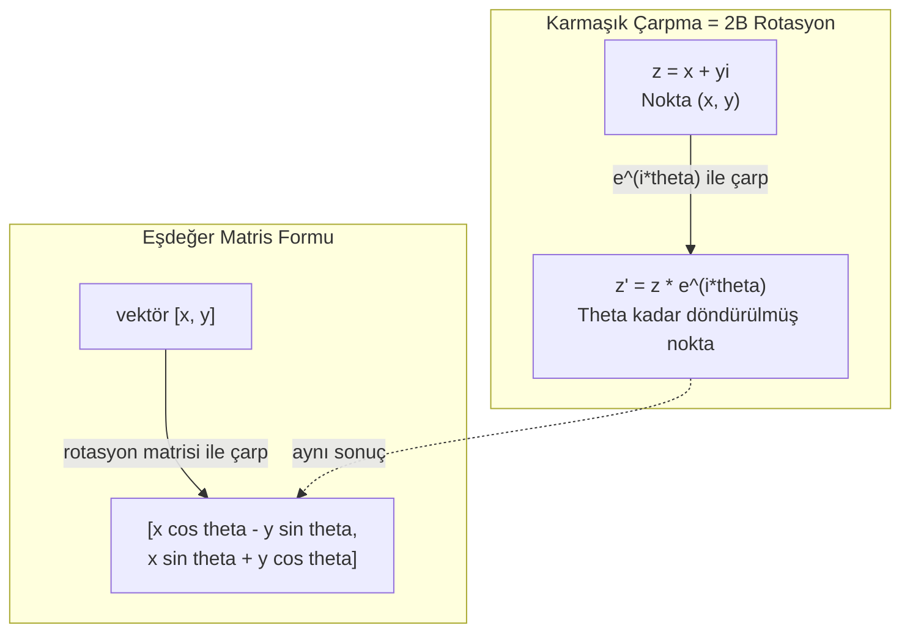
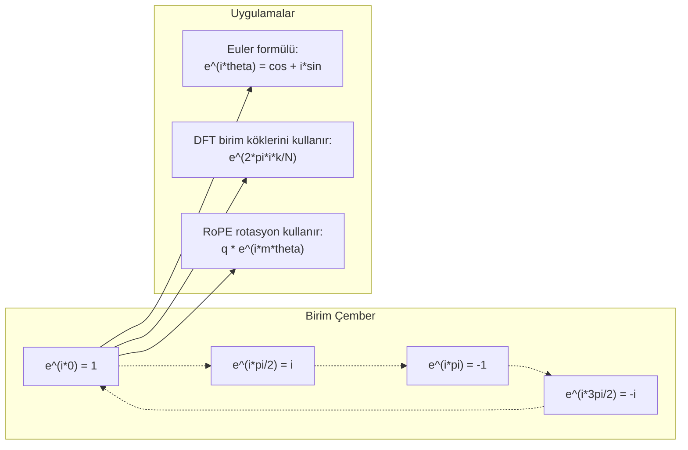

# Yapay Zeka için Karmaşık Sayılar

> -1'in karekökü hayali değildir. Rotasyonların, frekansların ve sinyal işlemenin yarısının anahtarıdır.

**Tür:** Öğrenim
**Dil:** Python
**Ön koşullar:** Faz 1, Ders 01-04 (lineer cebir, kalkülüs)
**Süre:** ~60 dakika

## Öğrenme Hedefleri

- Hem dikdörtgen hem de polar formda karmaşık aritmetik (toplama, çarpma, bölme, eşlenik) gerçekleştir
- Karmaşık üsteller ile trigonometrik fonksiyonlar arasında dönüşüm yapmak için Euler formülünü uygula
- Birimin karmaşık köklerini kullanarak Discrete Fourier Transform'u implemente et
- Karmaşık rotasyonların transformer'larda RoPE ve sinüsoidal positional encoding'lerin altında nasıl yattığını açıkla

## Sorun

Fourier dönüşümleri üzerine bir makale açıyorsun ve her yerde `i` var. Transformer positional encoding'lere bakıyorsun ve farklı frekanslarda `sin` ve `cos` görüyorsun — karmaşık üstellerin reel ve imajiner kısımları. Quantum computing hakkında okuyorsun ve her şeyin karmaşık vektör uzaylarında ifade edildiğini buluyorsun.

Karmaşık sayılar soyut görünür. -1'in karekökü üzerine inşa edilmiş bir sayı sistemi matematiksel bir trick gibi hissettirir. Ama trick değil. Rotasyonların ve salınımların doğal dilidir. Bir şey döndüğünde, titreştiğinde veya salındığında, karmaşık sayılar doğru araçtır.

Karmaşık sayıları anlamadan Discrete Fourier Transform'u anlayamazsın. FFT'yi anlayamazsın. Modern dil modellerinde RoPE'nin (Rotary Position Embedding) nasıl çalıştığını anlayamazsın. Orijinal Transformer makalesindeki sinüsoidal positional encoding'lerin neden kullandığı frekansları kullandığını anlayamazsın.

Bu ders karmaşık aritmetiği sıfırdan inşa eder, onu geometriye bağlar ve karmaşık sayıların makine öğrenmesinde tam olarak nerede göründüğünü gösterir.

## Kavram

### Karmaşık sayı nedir?

Bir karmaşık sayının iki kısmı vardır: bir reel kısım ve bir imajiner kısım.

```
z = a + bi

burada:
  a reel kısım
  b imajiner kısım
  i imajiner birim, i^2 = -1 ile tanımlı
```

İşte bu kadar. Sayı doğrusunu bir düzleme genişletirsin. Reel sayılar bir eksendedir. İmajiner sayılar diğerindedir. Her karmaşık sayı bu düzlemde bir noktadır.

### Karmaşık aritmetik

**Toplama.** Reel kısımları birlikte topla, imajiner kısımları birlikte topla.

```
(a + bi) + (c + di) = (a + c) + (b + d)i

Örnek: (3 + 2i) + (1 + 4i) = 4 + 6i
```

**Çarpma.** Dağılma kuralını kullan ve i^2 = -1 olduğunu unutma.

```
(a + bi)(c + di) = ac + adi + bci + bdi^2
                 = ac + adi + bci - bd
                 = (ac - bd) + (ad + bc)i

Örnek: (3 + 2i)(1 + 4i) = 3 + 12i + 2i + 8i^2
                          = 3 + 14i - 8
                          = -5 + 14i
```

**Eşlenik.** İmajiner kısmın işaretini çevir.

```
(a + bi)'nin eşleniği = a - bi
```

Bir karmaşık sayı ile eşleniğinin çarpımı her zaman reeldir:

```
(a + bi)(a - bi) = a^2 + b^2
```

**Bölme.** Pay ve paydayı paydanın eşleniği ile çarp.

```
(a + bi) / (c + di) = (a + bi)(c - di) / (c^2 + d^2)
```

Bu paydadan imajiner kısmı eler, sana temiz bir karmaşık sayı verir.

### Karmaşık düzlem

Karmaşık düzlem her karmaşık sayıyı 2B bir noktaya eşler. Yatay eksen reel eksendir, dikey eksen imajiner eksendir.

```
z = 3 + 2i  noktasına (3, 2) karşılık gelir
z = -1 + 0i reel eksendeki (-1, 0) noktasına karşılık gelir
z = 0 + 4i  imajiner eksendeki (0, 4) noktasına karşılık gelir
```

Bir karmaşık sayı aynı zamanda hem bir nokta hem de orijinden bir vektördür. Bu çifte yorum karmaşık sayıları geometri için yararlı kılan şeydir.

### Polar form

Düzlemdeki herhangi bir nokta orijinden uzaklığı ve pozitif reel eksenden açısı ile tanımlanabilir.

```
z = r * (cos(theta) + i*sin(theta))

burada:
  r = |z| = sqrt(a^2 + b^2)     (büyüklük veya modulus)
  theta = atan2(b, a)             (faz veya argument)
```

Dikdörtgen form (a + bi) toplama için iyidir. Polar form (r, theta) çarpma için iyidir.

**Polar formda çarpma.** Büyüklükleri çarp, açıları topla.

```
z1 = r1 * e^(i*theta1)
z2 = r2 * e^(i*theta2)

z1 * z2 = (r1 * r2) * e^(i*(theta1 + theta2))
```

Bu yüzden karmaşık sayılar rotasyonlar için mükemmeldir. Büyüklüğü 1 olan bir karmaşık sayıyla çarpmak saf bir rotasyondur.

### Euler formülü

Karmaşık üsteller ile trigonometri arasındaki köprü:

```
e^(i*theta) = cos(theta) + i*sin(theta)
```

Bu bu derste en önemli formüldür. Theta = pi olduğunda:

```
e^(i*pi) = cos(pi) + i*sin(pi) = -1 + 0i = -1

Bu nedenle: e^(i*pi) + 1 = 0
```

Tek bir denklemde bağlı beş temel sabit (e, i, pi, 1, 0).

### Euler formülü ML için neden önemli

Euler formülü theta değiştikçe `e^(i*theta)`'nın birim çemberi izlediğini söyler. Theta = 0'da (1, 0)'dasın. Theta = pi/2'de (0, 1)'desin. Theta = pi'de (-1, 0)'dasın. Theta = 3*pi/2'de (0, -1)'desin. Tam bir rotasyon theta = 2*pi'dir.

Bu, karmaşık üstellerin rotasyonlar OLDUĞU anlamına gelir. Ve rotasyonlar sinyal işleme ve ML'de her yerdedir.

### 2B rotasyonlara bağlantı

(x + yi) karmaşık sayısını e^(i*theta) ile çarpmak (x, y) noktasını orijinin etrafında theta açısı kadar döndürür.

```
Karmaşık çarpma ile rotasyon:
  (x + yi) * (cos(theta) + i*sin(theta))
  = (x*cos(theta) - y*sin(theta)) + (x*sin(theta) + y*cos(theta))i

Matris çarpımı ile rotasyon:
  [cos(theta)  -sin(theta)] [x]   [x*cos(theta) - y*sin(theta)]
  [sin(theta)   cos(theta)] [y] = [x*sin(theta) + y*cos(theta)]
```

Aynı sonuçları üretirler. Karmaşık çarpma 2B rotasyonDUR. Rotasyon matrisi sadece matris notasyonunda yazılmış karmaşık çarpmadır.



### Phasor'lar ve döner sinyaller

Bir karmaşık üstel e^(i*omega*t), birim çember etrafında açısal frekans omega ile dönen bir noktadır. T arttıkça nokta çemberi izler.

Bu dönen noktanın reel kısmı cos(omega*t)'dir. İmajiner kısmı sin(omega*t)'dir. Bir sinüsoidal sinyal dönen bir karmaşık sayının gölgesidir.

```
e^(i*omega*t) = cos(omega*t) + i*sin(omega*t)

Reel kısım:      cos(omega*t)    -- bir kosinüs dalga
İmajiner kısım:  sin(omega*t)    -- bir sinüs dalga
```

Bu phasor temsilidir. Kıvrılan bir sinüs dalgasını izlemek yerine, yumuşakça dönen bir oku izlersin. Faz kaymaları açı offset'leri olur. Genlik değişiklikleri büyüklük değişiklikleri olur. Sinyallerin toplanması vektör toplanması olur.

### Birimin kökleri

N'inci birim kökleri birim çember üzerinde eşit aralıklı N noktadır:

```
w_k = e^(2*pi*i*k/N)    k = 0, 1, 2, ..., N-1 için
```

N = 4 için, kökler: 1, i, -1, -i (dört pusula noktası).
N = 8 için, dört pusula noktası artı dört diyagonal alırsın.

Birim kökleri Discrete Fourier Transform'un temelidir. DFT bir sinyali bu N eşit aralıklı frekansta bileşenlere ayrıştırır.

### DFT'ye bağlantı

Bir sinyal x[0], x[1], ..., x[N-1]'in Discrete Fourier Transform'u:

```
X[k] = sum_{n=0}^{N-1} x[n] * e^(-2*pi*i*k*n/N)
```

Her X[k] sinyalin k'inci birim kökü ile ne kadar ilişkili olduğunu ölçer — k frekansında karmaşık bir sinüsoid. DFT bir sinyali N dönen phasor'a böler ve her birinin genliği ve fazını söyler.

### I neden imajiner değil

"İmajiner" kelimesi tarihsel bir kazadır. Descartes bunu küçümseyici şekilde kullandı. Ama i, negatif sayıların ilk reddedildiğinde olduğundan daha imajiner değildir. Negatif sayılar "5'i 3'ten çıkarsan ne elde edersin?" sorusuna cevap verir. İmajiner birim "-1 elde etmek için neyi karelemen gerekir?" sorusuna cevap verir.

Daha kullanışlı bir şekilde: i bir 90 derecelik rotasyon operatörüdür. Bir reel sayıyı i ile bir kez çarp, imajiner eksene 90 derece döndürürsün. Tekrar i ile çarp (i^2), başka bir 90 derece döndürürsün — şimdi negatif reel yöne işaret ediyorsun. Bu yüzden i^2 = -1. Gizemli değil. İki çeyrek tur'dan inşa edilmiş bir yarım tur.

Bu yüzden karmaşık sayılar mühendislikte her yerdedir. Dönen herhangi bir şey — elektromanyetik dalgalar, quantum durumları, sinyal salınımları, positional encoding'ler — doğal olarak karmaşık sayılarla tanımlanır.

### Karmaşık üsteller vs trigonometrik fonksiyonlar

Euler formülünden önce, mühendisler sinyalleri A*cos(omega*t + phi) olarak yazardı — genlik A, frekans omega, faz phi. Bu çalışır ama aritmetiği acı verici yapar. Farklı fazlı iki kosinüs eklemek trigonometrik özdeşlikler gerektirir.

Karmaşık üstellerle, aynı sinyal A*e^(i*(omega*t + phi))'dir. İki sinyali eklemek sadece iki karmaşık sayıyı eklemektir. Çarpma (modülasyon) sadece büyüklükleri çarpıp açıları eklemektir. Faz kaymaları açı toplamaları olur. Frekans kaymaları phasor'larla çarpmalar olur.

Tüm sinyal işleme alanı karmaşık üstel notasyona geçti çünkü matematik daha temiz. "Reel sinyal" her zaman karmaşık temsilin reel kısmıdır. İmajiner kısım defter tutması olarak taşınır, tüm cebrin doğal olarak çıkmasını sağlar.

### Transformer'lara bağlantı

**Sinüsoidal positional encoding'ler** (orijinal Transformer makalesi):

```
PE(pos, 2i) = sin(pos / 10000^(2i/d))
PE(pos, 2i+1) = cos(pos / 10000^(2i/d))
```

Sin ve cos çiftleri farklı frekanslardaki karmaşık üstellerin reel ve imajiner kısımlarıdır. Her frekans pozisyonu kodlamak için farklı bir "çözünürlük" sağlar. Düşük frekanslar yavaşça değişir (kaba pozisyon). Yüksek frekanslar hızla değişir (ince pozisyon). Birlikte her pozisyona benzersiz bir frekans parmak izi verirler.

**RoPE (Rotary Position Embedding)** bunu daha da ileri taşır. Query ve key vektörlerini açıkça karmaşık rotasyon matrisleriyle çarpar. İki token arasındaki göreli pozisyon bir rotasyon açısı olur. Attention bu döndürülmüş vektörler kullanılarak hesaplanır, modeli karmaşık çarpma yoluyla göreli pozisyona duyarlı kılar.

| İşlem | Cebirsel Form | Geometrik Anlam |
|-----------|---------------|-------------------|
| Toplama | (a+c) + (b+d)i | Düzlemde vektör toplaması |
| Çarpma | (ac-bd) + (ad+bc)i | Döndür ve ölçekle |
| Eşlenik | a - bi | Reel eksen üzerinde yansıt |
| Büyüklük | sqrt(a^2 + b^2) | Orijinden uzaklık |
| Faz | atan2(b, a) | Pozitif reel eksenden açı |
| Bölme | eşlenik ile çarp | Rotasyonu tersine çevir ve yeniden ölçekle |
| Üs | r^n * e^(i*n*theta) | N kez döndür, r^n ile ölçekle |



## İnşa Et

### Adım 1: Complex sınıfı

Aritmetiği, büyüklüğü, fazı ve dikdörtgen ile polar formlar arasında dönüşümü destekleyen bir Complex sayı sınıfı inşa et.

```python
import math

class Complex:
    def __init__(self, real, imag=0.0):
        self.real = real
        self.imag = imag

    def __add__(self, other):
        return Complex(self.real + other.real, self.imag + other.imag)

    def __mul__(self, other):
        r = self.real * other.real - self.imag * other.imag
        i = self.real * other.imag + self.imag * other.real
        return Complex(r, i)

    def __truediv__(self, other):
        denom = other.real ** 2 + other.imag ** 2
        r = (self.real * other.real + self.imag * other.imag) / denom
        i = (self.imag * other.real - self.real * other.imag) / denom
        return Complex(r, i)

    def magnitude(self):
        return math.sqrt(self.real ** 2 + self.imag ** 2)

    def phase(self):
        return math.atan2(self.imag, self.real)

    def conjugate(self):
        return Complex(self.real, -self.imag)
```

### Adım 2: Polar dönüşüm ve Euler formülü

```python
def to_polar(z):
    return z.magnitude(), z.phase()

def from_polar(r, theta):
    return Complex(r * math.cos(theta), r * math.sin(theta))

def euler(theta):
    return Complex(math.cos(theta), math.sin(theta))
```

Doğrula: `euler(theta).magnitude()` her zaman 1.0 olmalı. `euler(0)` (1, 0) vermeli. `euler(pi)` (-1, 0) vermeli.

### Adım 3: Rotasyon

Bir (x, y) noktasını theta açısı kadar döndürmek tek bir karmaşık çarpmadır:

```python
point = Complex(3, 4)
rotated = point * euler(math.pi / 4)
```

Büyüklük aynı kalır. Sadece açı değişir.

### Adım 4: Karmaşık aritmetik ile DFT

```python
def dft(signal):
    N = len(signal)
    result = []
    for k in range(N):
        total = Complex(0, 0)
        for n in range(N):
            angle = -2 * math.pi * k * n / N
            total = total + Complex(signal[n], 0) * euler(angle)
        result.append(total)
    return result
```

Bu O(N^2) DFT'dir. Her X[k] çıktısı sinyal örneklerinin birim kökleri ile çarpılmasının toplamıdır.

### Adım 5: Inverse DFT

Inverse DFT spektrumundan orijinal sinyali yeniden inşa eder. Forward DFT'den tek değişiklikler: üs işaretini çevir ve N'e böl.

```python
def idft(spectrum):
    N = len(spectrum)
    result = []
    for n in range(N):
        total = Complex(0, 0)
        for k in range(N):
            angle = 2 * math.pi * k * n / N
            w = Complex(math.cos(angle), math.sin(angle))
            total = total + spectrum[k] * euler(angle)
        result.append(Complex(total.real / N, total.imag / N))
    return result
```

Bu sana mükemmel yeniden inşa verir. DFT uygula, sonra IDFT, ve orijinal sinyali makine hassasiyetine kadar geri alırsın. Bilgi kaybı yoktur.

### Adım 6: Birimin kökleri

```python
def roots_of_unity(N):
    return [euler(2 * math.pi * k / N) for k in range(N)]
```

İki özelliği doğrula:
- Her kökün büyüklüğü tam olarak 1'dir.
- Tüm N kökün toplamı sıfırdır (simetri ile iptal olurlar).

Bu özellikler DFT'yi tersinir yapan şeylerdir. Birim kökleri frekans alanı için ortogonal bir taban oluşturur.

## Kullan

Python yerleşik karmaşık sayı desteğine sahiptir. `j` literal'i imajiner birimi temsil eder.

```python
z = 3 + 2j
w = 1 + 4j

print(z + w)
print(z * w)
print(abs(z))

import cmath
print(cmath.phase(z))
print(cmath.exp(1j * cmath.pi))
```

Diziler için, numpy karmaşık sayıları yerel olarak halleder:

```python
import numpy as np

z = np.array([1+2j, 3+4j, 5+6j])
print(np.abs(z))
print(np.angle(z))
print(np.conj(z))
print(np.real(z))
print(np.imag(z))

signal = np.sin(2 * np.pi * 5 * np.linspace(0, 1, 128))
spectrum = np.fft.fft(signal)
freqs = np.fft.fftfreq(128, d=1/128)
```

## Yayınla

`outputs/skill-complex-arithmetic.md`'yi üretmek için `code/complex_numbers.py`'ı çalıştır.

## Alıştırmalar

1. **Elle karmaşık aritmetik.** (2 + 3i) * (4 - i)'yi hesapla ve kodla doğrula. Sonra (5 + 2i) / (1 - 3i)'yi hesapla. Her iki sonucu karmaşık düzlemde çiz ve çarpmanın ilk sayıyı döndürdüğünü ve ölçeklediğini kontrol et.

2. **Rotasyon dizisi.** (1, 0) noktası ile başla. E^(i*pi/6) ile on iki kez çarp. 12 çarpmadan sonra (1, 0)'a döndüğünü doğrula. Her adımda koordinatları yazdır ve düzenli bir 12-gen izlediklerini onayla.

3. **Bilinen sinyalin DFT'si.** 32 noktada örneklenen sin(2*pi*3*t) ve 0.5*sin(2*pi*7*t)'nin toplamı olan bir sinyal oluştur. DFT'ni çalıştır. Büyüklük spektrumunun 3 ve 7 frekanslarında tepelere sahip olduğunu, 7'deki tepenin 3'teki tepenin yarısı yükseklikte olduğunu doğrula.

4. **Birim köklerinin görselleştirilmesi.** 8. birim köklerini hesapla. Sıfıra toplandıklarını doğrula. Herhangi bir kökü ilkel kök e^(2*pi*i/8) ile çarpmanın bir sonraki kökü verdiğini doğrula.

5. **Rotasyon matrisi eşdeğerliği.** 10 rastgele açı ve 10 rastgele nokta için, karmaşık çarpmanın 2x2 rotasyon matrisi ile matris-vektör çarpımıyla aynı sonucu verdiğini doğrula. Maksimum sayısal farkı yazdır.

## Anahtar Terimler

| Terim | Ne demek |
|------|---------------|
| Karmaşık sayı | A reel kısım, b imajiner kısım ve i^2 = -1 olan a + bi sayısı |
| İmajiner birim | i^2 = -1 ile tanımlı i sayısı. Felsefi anlamda imajiner değil — bir rotasyon operatörü |
| Karmaşık düzlem | X ekseni reel ve y ekseni imajiner olan 2B düzlem. Argand düzlemi olarak da bilinir |
| Büyüklük (modulus) | Orijinden uzaklık: sqrt(a^2 + b^2). \|z\| olarak yazılır |
| Faz (argument) | Pozitif reel eksenden açı: atan2(b, a). arg(z) olarak yazılır |
| Eşlenik | Reel eksen boyunca ayna görüntüsü: a + bi'nin eşleniği a - bi'dir |
| Polar form | Z'yi a + bi yerine r * e^(i*theta) olarak ifade etme. Çarpmayı kolaylaştırır |
| Euler formülü | e^(i*theta) = cos(theta) + i*sin(theta). Üstelleri trigonometriye bağlar |
| Phasor | Sinüsoidal sinyali temsil eden dönen karmaşık sayı e^(i*omega*t) |
| Birim kökleri | K = 0'dan N-1'e olmak üzere N karmaşık sayı e^(2*pi*i*k/N). Birim çember üzerinde N eşit aralıklı nokta |
| DFT | Discrete Fourier Transform. Birim kökleri kullanarak bir sinyali karmaşık sinüsoidal bileşenlere ayrıştırır |
| RoPE | Rotary Position Embedding. Transformer attention'da göreli pozisyonu kodlamak için karmaşık çarpma kullanır |

## İleri Okuma

- [Visual Introduction to Euler's Formula](https://betterexplained.com/articles/intuitive-understanding-of-eulers-formula/) - ağır notasyon olmadan geometrik sezgi inşa eder
- [Su et al.: RoFormer (2021)](https://arxiv.org/abs/2104.09864) - karmaşık rotasyonlar kullanarak Rotary Position Embedding'i tanıtan makale
- [Vaswani et al.: Attention Is All You Need (2017)](https://arxiv.org/abs/1706.03762) - sinüsoidal positional encoding'lere sahip orijinal Transformer makalesi
- [3Blue1Brown: Euler's formula with introductory group theory](https://www.youtube.com/watch?v=mvmuCPvRoWQ) - e^(i*pi) = -1'in neden olduğunun görsel açıklaması
- [Needham: Visual Complex Analysis](https://global.oup.com/academic/product/visual-complex-analysis-9780198534464) - karmaşık sayılara en iyi görsel yaklaşım, geometrik içgörü dolu
- [Strang: Introduction to Linear Algebra, Ch. 10](https://math.mit.edu/~gs/linearalgebra/) - lineer cebir ve eigenvalue'lar bağlamında karmaşık sayılar
