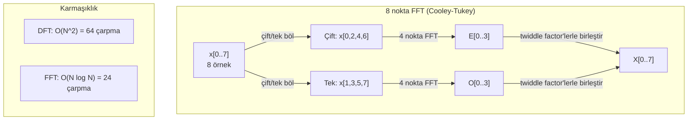
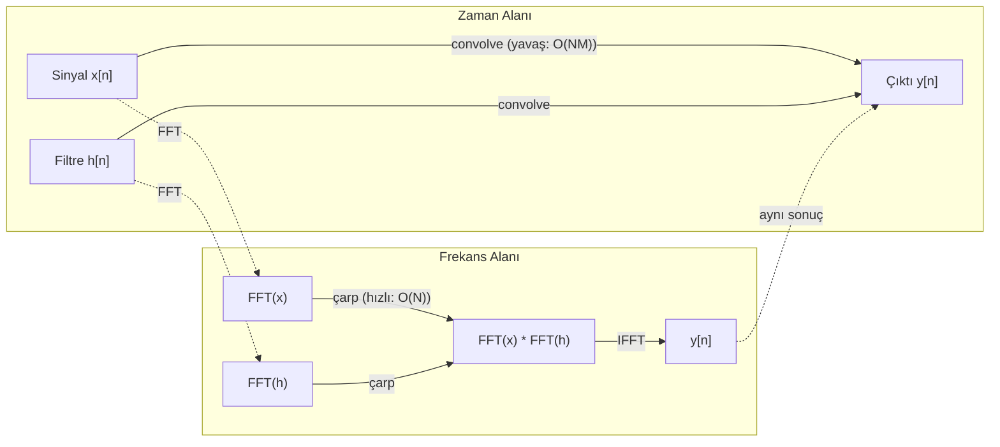

# Fourier Dönüşümü

> Her sinyal sinüs dalgalarının bir toplamıdır. Fourier dönüşümü sana hangilerini söyler.

**Tür:** Yapım
**Dil:** Python
**Ön koşullar:** Faz 1, Ders 01-04, 19 (karmaşık sayılar)
**Süre:** ~90 dakika

## Öğrenme Hedefleri

- DFT'yi sıfırdan implemente et ve O(N log N) Cooley-Tukey FFT'ye karşı doğrula
- Frekans katsayılarını yorumla: bir sinyalden genlik, faz ve power spectrum çıkar
- FFT çarpımı ile convolution gerçekleştirmek için convolution teoremini uygula
- Fourier frekans ayrıştırmasını transformer positional encoding'lerine ve CNN convolution katmanlarına bağla

## Sorun

Bir ses kaydı zaman içinde basınç ölçümlerinin bir dizisidir. Bir hisse senedi fiyatı günler boyunca değerler dizisidir. Bir görüntü uzay üzerinde piksel yoğunluklarının bir ızgarasıdır. Bunların hepsi zaman alanındaki (veya uzay alanındaki) verilerdir. Bir indeks boyunca değişen değerler görürsün.

Ama birçok desen zaman alanında görünmezdir. Bu ses sinyali saf bir ton mu yoksa bir akor mu? Bu hisse senedi fiyatının haftalık bir döngüsü var mı? Bu görüntünün tekrarlayan bir dokusu var mı? Bu sorular frekans içeriği hakkındadır ve zaman alanı onu gizler.

Fourier dönüşümü veriyi zaman alanından frekans alanına çevirir. Bir sinyali alır ve onu farklı frekanslarda sinüs dalgalarına ayrıştırır. Her sinüs dalgasının bir genliği (ne kadar güçlü) ve bir fazı (nerede başladığı) vardır. Fourier dönüşümü sana her ikisini de söyler.

Bu ML için önemlidir çünkü frekans-alanı düşüncesi her yerde görünür. Convolutional sinir ağları convolution gerçekleştirir, bu da frekans alanında çarpmadır. Transformer positional encoding'ler pozisyonu temsil etmek için frekans ayrıştırması kullanır. Ses modelleri (konuşma tanıma, müzik üretimi) spektrogramlar üzerinde çalışır — sesin frekans temsilleri. Zaman serisi modelleri periyodik desenler arar. Fourier dönüşümünü anlamak sana bunların hepsiyle çalışmak için kelime dağarcığı verir.

## Kavram

### DFT tanımı

N örnek x[0], x[1], ..., x[N-1] verildiğinde, Discrete Fourier Transform N frekans katsayısı X[0], X[1], ..., X[N-1] üretir:

```
X[k] = sum_{n=0}^{N-1} x[n] * e^(-2*pi*i*k*n/N)

k = 0, 1, ..., N-1 için
```

Her X[k] bir karmaşık sayıdır. Büyüklüğü |X[k]| sana k frekansının genliğini söyler. Fazı angle(X[k]) sana o frekansın faz offset'ini söyler.

Anahtar içgörü: `e^(-2*pi*i*k*n/N)` k frekansında dönen bir phasor'dur. DFT sinyal ile N eşit aralıklı frekansın her biri arasındaki korelasyonu hesaplar. Sinyal k frekansında enerji içeriyorsa, korelasyon büyüktür. Değilse, sıfıra yakındır.

### Her katsayı ne anlama gelir

**X[0]: DC bileşeni.** Bu tüm örneklerin toplamıdır — mean ile orantılı. Sinyalin sabit (sıfır frekanslı) offset'ini temsil eder.

```
X[0] = sum_{n=0}^{N-1} x[n] * e^0 = tüm örneklerin toplamı
```

**1 <= k <= N/2 için X[k]: pozitif frekanslar.** X[k] N örnek başına k döngü frekansını temsil eder. Daha yüksek k daha yüksek frekans demektir (daha hızlı salınım).

**X[N/2]: Nyquist frekansı.** N örnekle temsil edebileceğin en yüksek frekans. Bunun üzerinde aliasing alırsın — yüksek frekansların düşük olanlar gibi davranması.

**N/2 < k < N için X[k]: negatif frekanslar.** Reel değerli sinyaller için, X[N-k] = conj(X[k]). Negatif frekanslar pozitif olanların ayna görüntüleridir. Bu yüzden yararlı bilgi ilk N/2 + 1 katsayıdadır.

### Inverse DFT

Inverse DFT, frekans katsayılarından orijinal sinyali yeniden inşa eder:

```
x[n] = (1/N) * sum_{k=0}^{N-1} X[k] * e^(2*pi*i*k*n/N)

n = 0, 1, ..., N-1 için
```

Forward DFT'den tek farklar: üsdeki işaret pozitiftir (negatif değil) ve bir 1/N normalleştirme faktörü vardır.

Inverse DFT mükemmel yeniden inşadır. Bilgi kaybı yoktur. Zaman alanından frekans alanına ve geri gidebilirsin, hata olmadan. DFT bir taban değişikliğidir — aynı bilgiyi farklı bir koordinat sisteminde yeniden ifade eder.

### FFT: hızlandırma

Yukarıda tanımlanan DFT O(N^2)'dir: N çıktı katsayısının her biri için, N girdi örneği üzerinde toplam alırsın. N = 1 milyon için, bu 10^12 işlemdir.

Fast Fourier Transform (FFT) aynı sonucu O(N log N)'de hesaplar. N = 1 milyon için, bu trilyon yerine yaklaşık 20 milyon işlemdir. Bu frekans analizini pratik kılan şeydir.

Cooley-Tukey algoritması (en yaygın FFT) böl-ve-yönet ile çalışır:

1. Sinyali çift indeksli ve tek indeksli örneklere böl.
2. Her yarının DFT'sini özyinelemeli olarak hesapla.
3. "Twiddle factor'leri" e^(-2*pi*i*k/N) kullanarak iki yarı-boyut DFT'yi birleştir.

```
X[k] = E[k] + e^(-2*pi*i*k/N) * O[k]          k = 0, ..., N/2 - 1 için
X[k + N/2] = E[k] - e^(-2*pi*i*k/N) * O[k]    k = 0, ..., N/2 - 1 için

burada E = çift indeksli örneklerin DFT'si
      O = tek indeksli örneklerin DFT'si
```

Simetri her özyineleme seviyesinin O(N) iş yapması anlamına gelir ve log2(N) seviye vardır. Toplam: O(N log N).



FFT sinyal uzunluğunun 2'nin kuvveti olmasını gerektirir. Pratikte, sinyaller bir sonraki 2'nin kuvvetine zero-pad edilir.

### Spektral analiz

**Power spectrum** |X[k]|^2'dir — her frekans katsayısının kare büyüklüğü. Her frekansta ne kadar enerji olduğunu gösterir.

**Phase spectrum** angle(X[k])'dir — her frekansın faz offset'i. Çoğu analiz görevi için power spectrum'a önem verir ve fazı yok sayarsın.

```
k frekansındaki güç:  P[k] = |X[k]|^2 = X[k].real^2 + X[k].imag^2
k frekansındaki faz:  phi[k] = atan2(X[k].imag, X[k].real)
```

### Frekans çözünürlüğü

DFT'nin frekans çözünürlüğü örnek sayısı N ve örnekleme oranı fs'e bağlıdır.

```
k bin'inin frekansı:      f_k = k * fs / N
Frekans çözünürlüğü:      delta_f = fs / N
Maksimum frekans:         f_max = fs / 2  (Nyquist)
```

Birbirine yakın iki frekansı çözmek için, daha fazla örneğe ihtiyacın var. Yüksek frekansları yakalamak için, daha yüksek bir örnekleme oranına ihtiyacın var.

### Convolution teoremi

Bu sinyal işlemenin ve CNN'lerle doğrudan ilgili en önemli sonuçlardan biridir.

**Zaman alanında convolution frekans alanında noktasal çarpıma eşittir.**

```
x * h = IFFT(FFT(x) . FFT(h))

burada * convolution ve . eleman bazlı çarpımdır
```

Bu neden önemli:

- Uzunluğu N ve M olan iki sinyalin doğrudan convolution'ı O(N*M) işlem alır.
- FFT tabanlı convolution O(N log N) alır: ikisini de dönüştür, çarp, geri dönüştür.
- Büyük kernel'ler için, FFT convolution'ı dramatik şekilde daha hızlıdır.
- Büyük receptive field'li convolutional katmanlarda tam olarak bu olur.

Not: DFT circular convolution hesaplar (sinyal wrap around yapar). Linear convolution için (wrap around yok), DFT'yi hesaplamadan önce her iki sinyali N + M - 1 uzunluğuna zero-pad et.



### Windowing

DFT sinyalin periyodik olduğunu varsayar — N örneği sonsuz tekrarlayan bir sinyalin bir periyodu olarak ele alır. Sinyal aynı değerde başlamayıp bitmiyorsa, bu sınırda bir süreksizlik yaratır, bu da sahte yüksek frekanslı içerik olarak görünür. Buna spectral leakage denir.

Windowing, DFT'yi hesaplamadan önce sinyali her iki ucunda sıfıra konuşturarak leakage'ı azaltır.

Yaygın window'lar:

| Window | Şekil | Ana lobe genişliği | Yan lobe seviyesi | Kullanım durumu |
|--------|-------|----------------|-----------------|----------|
| Rectangular | Düz (window yok) | En dar | En yüksek (-13 dB) | Sinyal N örnekte tam periyodikse |
| Hann | Yükseltilmiş kosinüs | Orta | Düşük (-31 dB) | Genel amaçlı spektral analiz |
| Hamming | Değiştirilmiş kosinüs | Orta | Daha düşük (-42 dB) | Ses işleme, konuşma analizi |
| Blackman | Üçlü kosinüs | Geniş | Çok düşük (-58 dB) | Yan lobe baskılaması kritik olduğunda |

```
Hann window:    w[n] = 0.5 * (1 - cos(2*pi*n / (N-1)))
Hamming window: w[n] = 0.54 - 0.46 * cos(2*pi*n / (N-1))
```

Window'u DFT'den önce sinyal ile eleman bazlı çarparak uygula: `X = DFT(x * w)`.

### DFT özellikleri

| Özellik | Zaman Alanı | Frekans Alanı |
|----------|-------------|-----------------|
| Doğrusallık | a*x + b*y | a*X + b*Y |
| Zaman kayması | x[n - k] | X[f] * e^(-2*pi*i*f*k/N) |
| Frekans kayması | x[n] * e^(2*pi*i*f0*n/N) | X[f - f0] |
| Convolution | x * h | X * H (noktasal) |
| Çarpma | x * h (noktasal) | X * H (circular convolution, 1/N ile ölçeklenmiş) |
| Parseval teoremi | sum \|x[n]\|^2 | (1/N) * sum \|X[k]\|^2 |
| Eşlenik simetri (reel girdi) | x[n] reel | X[k] = conj(X[N-k]) |

Parseval teoremi toplam enerjinin her iki alanda da aynı olduğunu söyler. Enerji dönüşüm boyunca korunur.

### Positional encoding'lere bağlantı

Orijinal Transformer sinüsoidal positional encoding kullanır:

```
PE(pos, 2i)   = sin(pos / 10000^(2i/d_model))
PE(pos, 2i+1) = cos(pos / 10000^(2i/d_model))
```

Her boyut çifti (2i, 2i+1) farklı bir frekansta salınır. Frekanslar yüksekten (boyut 0,1) düşüğe (son boyutlar) geometrik olarak aralıklıdır. Bu her pozisyona tüm frekans bantları boyunca benzersiz bir desen verir — Fourier katsayılarının bir sinyali benzersiz şekilde tanımladığına benzer.

Bunun sağladığı temel özellikler:

- **Benzersizlik:** İki pozisyon aynı encoding'e sahip değildir.
- **Sınırlı değerler:** sin ve cos her zaman [-1, 1] aralığındadır.
- **Göreli pozisyon:** Pozisyon p+k'nın encoding'i pozisyon p'deki encoding'in lineer bir fonksiyonu olarak ifade edilebilir. Model göreli pozisyonlara attention vermeyi öğrenebilir.

### CNN'lere bağlantı

Bir convolution katmanı sinyal veya görüntü üzerinde kaydırarak girdiye öğrenilmiş bir filtre (kernel) uygular. Matematiksel olarak, bu convolution işlemidir.

Convolution teoremine göre, bu eşdeğerdir:
1. Girdiyi FFT et
2. Kernel'i FFT et
3. Frekans alanında çarp
4. Sonucu IFFT et

Standart CNN implementasyonları doğrudan convolution kullanır (küçük 3x3 kernel'ler için daha hızlı). Ama büyük kernel'ler veya global convolution için, FFT tabanlı yaklaşımlar önemli ölçüde daha hızlıdır. Bazı mimariler (FNet gibi) attention'ı tamamen FFT ile değiştirir, O(N^2) yerine O(N log N) karmaşıklık ile rekabetçi doğruluk elde ederler.

### Spektrogramlar ve Short-Time Fourier Transform

Tek bir FFT sana tüm sinyalin frekans içeriğini verir, ama o frekansların ne zaman olduğu hakkında hiçbir şey söylemez. Bir chirp (frekansı zamanla artan bir sinyal) ve bir akor (tüm frekanslar aynı anda mevcut) aynı büyüklük spektrumuna sahip olabilir.

Short-Time Fourier Transform (STFT) bunu sinyalin örtüşen window'ları üzerinde FFT'ler hesaplayarak çözer. Sonuç bir spektrogramdır: bir eksende zaman, diğerinde frekans olan 2B bir temsil. Her noktadaki yoğunluk o zamandaki o frekanstaki enerjiyi gösterir.

```
STFT prosedürü:
1. Bir window boyutu seç (örn. 1024 örnek)
2. Bir hop boyutu seç (örn. 256 örnek -- %75 örtüşme)
3. Her window pozisyonu için:
   a. Window'lanmış segmenti çıkar
   b. Hann/Hamming window uygula
   c. FFT hesapla
   d. Büyüklük spektrumunu spektrogramın bir sütunu olarak sakla
```

Spektrogramlar ses ML modelleri için standart girdi temsilidir. Konuşma tanıma modelleri (Whisper, DeepSpeech) mel-spektrogramlar üzerinde çalışır — insan perde algısına daha iyi uyan mel ölçeğine eşlenmiş frekanslı spektrogramlar.

### Aliasing

Bir sinyal fs/2'nin (Nyquist frekansı) üzerinde frekanslar içerirse, fs oranında örneklemek aliased kopyalar yaratır. 100 Hz'de örneklenen 90 Hz'lik bir sinyal 10 Hz'lik bir sinyalle aynı görünür. Sadece örneklerden onları ayırt etmenin bir yolu yoktur.

```
Örnek:
  Gerçek sinyal: 90 Hz sinüs dalga
  Örnekleme oranı: 100 Hz
  Görünen frekans: 100 - 90 = 10 Hz

  100 Hz örnekleme oranında 90 Hz sinyalden örnekler
  10 Hz sinyalden örneklerle aynıdır.
  Hiçbir matematik miktarı orijinal 90 Hz'i kurtaramaz.
```

Bu yüzden analog-dijital dönüştürücüler örneklemeden önce Nyquist üzerindeki frekansları kaldıran anti-aliasing filtreleri içerir. ML'de, aliasing düzgün low-pass filtreleme olmadan feature map'leri downsample ettiğinde görünür — bazı mimariler bunu anti-aliased pooling katmanlarıyla ele alır.

### Zero-padding çözünürlüğü arttırmaz

Yaygın bir yanlış anlama: FFT'den önce bir sinyali zero-pad etmek frekans çözünürlüğünü iyileştirir. İyileştirmez. Zero-padding mevcut frekans bin'leri arasında interpolasyon yapar, sana daha düzgün görünümlü bir spektrum verir. Ama orijinal örneklerde mevcut olmayan frekans detayını ortaya çıkaramaz.

Gerçek frekans çözünürlüğü sadece gözlem süresi T = N / fs'e bağlıdır. Delta_f kadar ayrılmış iki frekansı çözmek için, en az T = 1 / delta_f saniyelik veriye ihtiyacın var. Hiçbir miktarda zero-padding bu temel sınırı değiştirmez.

## İnşa Et

### Adım 1: Sıfırdan DFT

O(N^2) DFT doğrudan tanımdan çıkar.

```python
import math

class Complex:
    ...

def dft(x):
    N = len(x)
    result = []
    for k in range(N):
        total = Complex(0, 0)
        for n in range(N):
            angle = -2 * math.pi * k * n / N
            w = Complex(math.cos(angle), math.sin(angle))
            xn = x[n] if isinstance(x[n], Complex) else Complex(x[n])
            total = total + xn * w
        result.append(total)
    return result
```

### Adım 2: Inverse DFT

Aynı yapı, pozitif üs, N'e böl.

```python
def idft(X):
    N = len(X)
    result = []
    for n in range(N):
        total = Complex(0, 0)
        for k in range(N):
            angle = 2 * math.pi * k * n / N
            w = Complex(math.cos(angle), math.sin(angle))
            total = total + X[k] * w
        result.append(Complex(total.real / N, total.imag / N))
    return result
```

### Adım 3: FFT (Cooley-Tukey)

Özyinelemeli FFT 2'nin kuvveti uzunluk gerektirir. Çift ve teke böl, recurse et, twiddle factor'lerle birleştir.

```python
def fft(x):
    N = len(x)
    if N <= 1:
        return [x[0] if isinstance(x[0], Complex) else Complex(x[0])]
    if N % 2 != 0:
        return dft(x)

    even = fft([x[i] for i in range(0, N, 2)])
    odd = fft([x[i] for i in range(1, N, 2)])

    result = [Complex(0)] * N
    for k in range(N // 2):
        angle = -2 * math.pi * k / N
        twiddle = Complex(math.cos(angle), math.sin(angle))
        t = twiddle * odd[k]
        result[k] = even[k] + t
        result[k + N // 2] = even[k] - t
    return result
```

### Adım 4: Spektral analiz yardımcıları

```python
def power_spectrum(X):
    return [xk.real ** 2 + xk.imag ** 2 for xk in X]

def convolve_fft(x, h):
    N = len(x) + len(h) - 1
    padded_N = 1
    while padded_N < N:
        padded_N *= 2

    x_padded = x + [0.0] * (padded_N - len(x))
    h_padded = h + [0.0] * (padded_N - len(h))

    X = fft(x_padded)
    H = fft(h_padded)

    Y = [xk * hk for xk, hk in zip(X, H)]

    y = idft(Y)
    return [y[n].real for n in range(N)]
```

## Kullan

Gerçek iş için, yüksek optimize edilmiş C kütüphaneleri ile desteklenen numpy'ın FFT'sini kullan.

```python
import numpy as np

signal = np.sin(2 * np.pi * 5 * np.arange(256) / 256)
spectrum = np.fft.fft(signal)
freqs = np.fft.fftfreq(256, d=1/256)

power = np.abs(spectrum) ** 2

positive_freqs = freqs[:len(freqs)//2]
positive_power = power[:len(power)//2]
```

Windowing ve daha gelişmiş spektral analiz için:

```python
from scipy.signal import windows, stft

window = windows.hann(256)
windowed = signal * window
spectrum = np.fft.fft(windowed)
```

Convolution için:

```python
from scipy.signal import fftconvolve

result = fftconvolve(signal, kernel, mode='full')
```

Spektrogramlar için:

```python
from scipy.signal import stft

frequencies, times, Zxx = stft(signal, fs=sample_rate, nperseg=256)
spectrogram = np.abs(Zxx) ** 2
```

Spektrogram matrisi (n_frequencies, n_time_frames) shape'ine sahiptir. Her sütun bir zaman window'undaki power spectrum'dur. Bu, ses ML modellerinin girdi olarak tükettiği şeydir.

## Yayınla

`outputs/prompt-spectral-analyzer.md`'yi üretmek için `code/fourier.py`'ı çalıştır.

## Alıştırmalar

1. **Saf ton tanımlama.** 128 Hz'de 1 saniye boyunca örneklenmiş bilinmeyen bir frekansta (1 ile 50 Hz arası) tek bir sinüs dalgası içeren bir sinyal oluştur. Frekansı tanımlamak için DFT'ni kullan. Cevabın eşleştiğini doğrula. Şimdi standart sapması 0.5 olan Gauss gürültüsü ekle ve tekrarla. Gürültü spektrumu nasıl etkiler?

2. **FFT vs DFT doğrulaması.** Uzunluğu 64 olan rastgele bir sinyal üret. Hem DFT'yi (O(N^2)) hem de FFT'yi hesapla. Tüm katsayıların 1e-10 içinde eşleştiğini doğrula. Her iki fonksiyonu uzunluğu 256, 512, 1024 ve 2048 olan sinyaller üzerinde zamanla. DFT zamanının FFT zamanına oranını çiz.

3. **Convolution teoremi örnekle kanıt.** Sinyal x = [1, 2, 3, 4, 0, 0, 0, 0] ve filtre h = [1, 1, 1, 0, 0, 0, 0, 0] oluştur. Circular convolution'larını doğrudan (iç içe döngü) hesapla. Sonra FFT yoluyla hesapla (dönüştür, çarp, inverse dönüştür). Sonuçların eşleştiğini doğrula. Şimdi uygun şekilde zero-padding yaparak linear convolution yap.

4. **Windowing etkileri.** 10 Hz ve 12 Hz'deki (çok yakın) iki sinüs dalgasının toplamı olan bir sinyal oluştur. 128 Hz'de 1 saniye örnekle. Window yok, Hann window ve Hamming window ile power spectrum hesapla. Hangi window iki tepeyi ayırt etmeyi en kolay yapar? Neden?

5. **Positional encoding analizi.** d_model = 128 ve max_pos = 512 için sinüsoidal positional encoding'leri üret. Her pozisyon çifti (p1, p2) için encoding'lerinin dot product'ını hesapla. Dot product'ın mutlak pozisyonlara değil, sadece |p1 - p2|'ye bağlı olduğunu göster. Uzaklık arttıkça dot product'a ne olur?

## Anahtar Terimler

| Terim | Ne demek |
|------|---------------|
| DFT (Discrete Fourier Transform) | N zaman alanı örneğini N frekans alanı katsayısına dönüştürür. Her katsayı o frekanstaki karmaşık sinüsoid ile korelasyondur |
| FFT (Fast Fourier Transform) | DFT'yi hesaplamak için O(N log N) algoritması. Cooley-Tukey algoritması çift/tek indeksleri özyinelemeli olarak böler |
| Inverse DFT | Frekans katsayılarından zaman alanı sinyalini yeniden inşa eder. DFT ile aynı formül, üs işareti çevrilmiş ve 1/N ölçekleme ile |
| Frekans bin | DFT çıktısındaki her indeks k frekans k*fs/N Hz'i temsil eder. "Bin" kesikli frekans slot'u |
| DC bileşeni | X[0], sıfır frekanslı katsayı. Sinyal mean'ine orantılı |
| Nyquist frekansı | fs/2, örnekleme oranı fs'de temsil edilebilir maksimum frekans. Bunun üzerindeki frekanslar alias yapar |
| Power spectrum | \|X[k]\|^2, her frekans katsayısının kare büyüklüğü. Frekanslar boyunca enerji dağılımını gösterir |
| Phase spectrum | angle(X[k]), her frekans bileşeninin faz offset'i. Analizde sıklıkla yok sayılır |
| Spectral leakage | Periyodik olmayan sinyali periyodik olarak ele almaktan kaynaklanan sahte frekans içeriği. Windowing ile azaltılır |
| Window fonksiyonu | Spectral leakage'ı azaltmak için DFT'den önce uygulanan konikleştirme fonksiyonu (Hann, Hamming, Blackman) |
| Twiddle factor | FFT butterfly hesaplamasında alt DFT'leri birleştirmek için kullanılan karmaşık üstel e^(-2*pi*i*k/N) |
| Convolution teoremi | Zaman alanında convolution frekans alanında noktasal çarpıma eşittir. Sinyal işleme ve CNN'lerin temeli |
| Circular convolution | Sinyalin wrap around yaptığı convolution. Bu DFT'nin doğal olarak hesapladığı şeydir |
| Linear convolution | Wrap around olmadan standart convolution. DFT'den önce zero-padding ile elde edilir |
| Parseval teoremi | Fourier dönüşümü boyunca toplam enerji korunur. sum \|x[n]\|^2 = (1/N) sum \|X[k]\|^2 |
| Aliasing | Yetersiz örnekleme oranı nedeniyle Nyquist üzerindeki frekansların daha düşük frekanslar olarak görünmesi |

## İleri Okuma

- [Cooley & Tukey: An Algorithm for the Machine Calculation of Complex Fourier Series (1965)](https://www.ams.org/journals/mcom/1965-19-090/S0025-5718-1965-0178586-1/) - bilişimi değiştiren orijinal FFT makalesi
- [3Blue1Brown: But what is the Fourier Transform?](https://www.youtube.com/watch?v=spUNpyF58BY) - Fourier dönüşümlerine en iyi görsel giriş
- [Lee-Thorp et al.: FNet: Mixing Tokens with Fourier Transforms (2021)](https://arxiv.org/abs/2105.03824) - transformer'larda self-attention'ı FFT ile değiştirir
- [Smith: The Scientist and Engineer's Guide to Digital Signal Processing](http://www.dspguide.com/) - FFT, windowing ve spektral analizi derinlemesine kapsayan ücretsiz çevrimiçi ders kitabı
- [Vaswani et al.: Attention Is All You Need (2017)](https://arxiv.org/abs/1706.03762) - Fourier frekans ayrıştırmasından türetilmiş sinüsoidal positional encoding'ler
- [Radford et al.: Whisper (2022)](https://arxiv.org/abs/2212.04356) - girdi temsili olarak mel-spektrogramları kullanan konuşma tanıma
