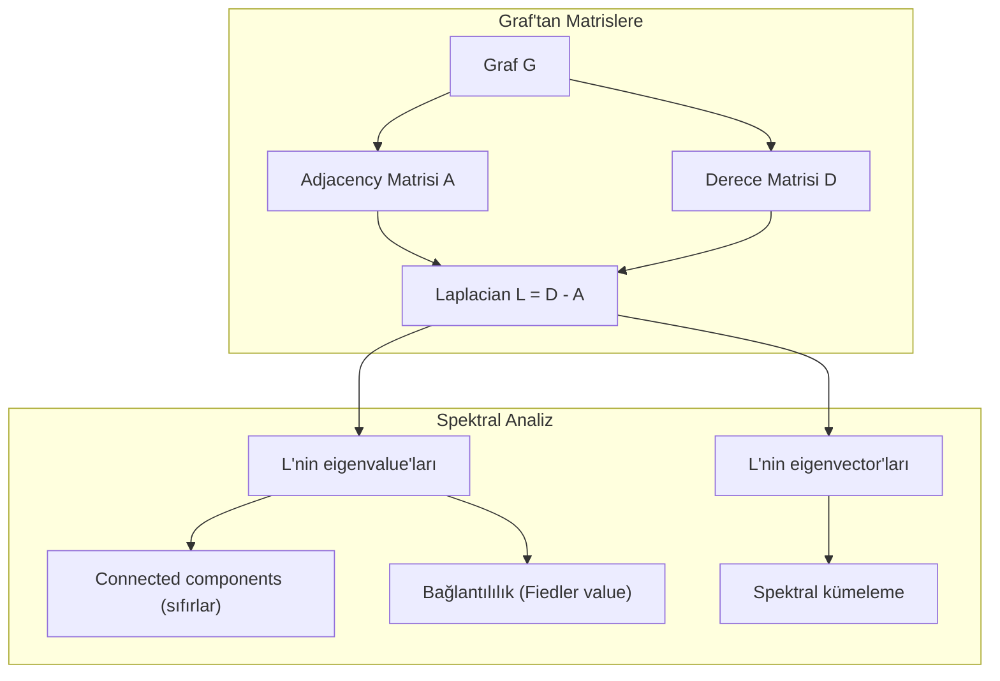
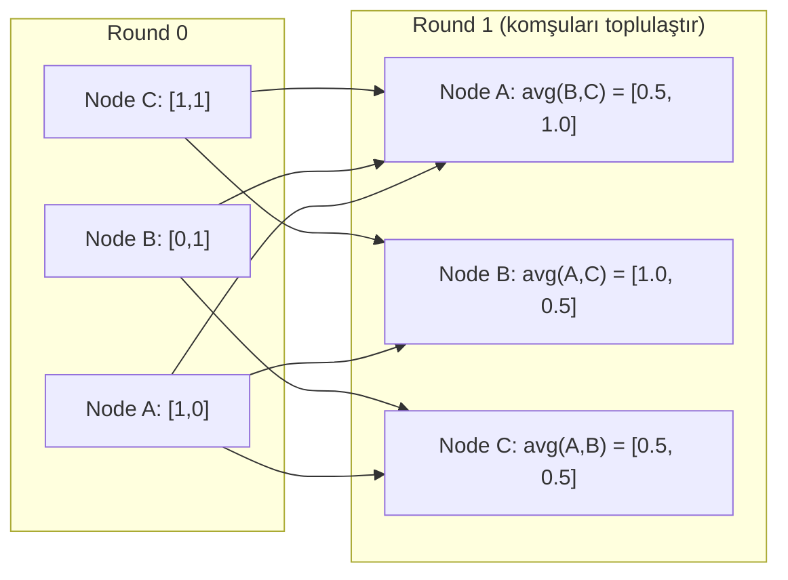

# Makine Öğrenmesi için Çizge (Graf) Teorisi

> Graf'lar ilişkilerin veri yapısıdır. Verinin bağlantıları varsa, graf teorisine ihtiyacın var.

**Tür:** Yapım
**Dil:** Python
**Ön koşullar:** Faz 1, Ders 01-03 (lineer cebir, matrisler)
**Süre:** ~90 dakika

## Öğrenme Hedefleri

- Adjacency matrix/list temsilleri olan bir graf sınıfı kur ve BFS ve DFS traversal'leri implemente et
- Graf Laplacian'ı hesapla ve eigenvalue'larını connected components tespit etmek ve node'ları kümelemek için kullan
- Bir round'luk GNN tarzı message passing'i normalize adjacency matrisi çarpımı olarak implemente et
- Fiedler vector kullanarak bir grafı bölümlemek için spektral kümeleme uygula

## Sorun

Sosyal ağlar, moleküller, bilgi tabanları, atıf ağları, yol haritaları — hepsi graf'tır. Geleneksel ML veriyi düz tablolar olarak ele alır. Her satır bağımsızdır. Her feature bir sütundur. Ama bağlantıların yapısı önemli olduğunda, tablolar başarısız olur.

Bir sosyal ağ düşün. Bir kullanıcının hangi ürünü satın alacağını tahmin etmek istiyorsun. Onların satın alma geçmişi önemli. Ama arkadaşlarının satın alma geçmişi daha da önemli. Bağlantılar sinyal taşır.

Veya bir molekül düşün. Bir proteine bağlanıp bağlanmadığını tahmin etmek istiyorsun. Atomlar önemli, ama gerçekten önemli olan atomların birbirine nasıl bağlı olduğudur. Yapı veridir.

Graph Neural Network'ler (GNN'ler) deep learning'in en hızlı büyüyen alanıdır. İlaç keşfini, sosyal öneriyi, dolandırıcılık tespitini ve bilgi grafı muhakemesini güçlendirirler. Her GNN aynı temel üzerine inşa edilmiştir: temel graf teorisi.

Dört şeye ihtiyacın var:
1. Graf'ları matrisler olarak temsil etmenin bir yolu (böylece çarpabilirsin)
2. Graf yapısını keşfetmek için traversal algoritmaları
3. Laplacian — spektral graf teorisindeki en önemli tek matris
4. Message passing — GNN'leri çalıştıran işlem

## Kavram

### Graf'lar: Node'lar ve Kenarlar

Bir graf G = (V, E) köşelerden (node) V ve kenarlardan E oluşur. Her kenar iki node'u bağlar.

**Yönlü vs yönsüz.** Yönsüz bir grafta, (u, v) kenarı u'nun v'ye bağlandığı VE v'nin u'ya bağlandığı anlamına gelir. Yönlü bir grafta (digraph), (u, v) kenarı u'nun v'ye işaret ettiği, ama tersinin mutlaka olmadığı anlamına gelir.

**Ağırlıklı vs ağırlıksız.** Ağırlıksız bir grafta, kenarlar ya vardır ya da yoktur. Ağırlıklı bir grafta, her kenarın sayısal bir ağırlığı vardır — bir uzaklık, bir maliyet, bir güç.

| Graf tipi | Örnek |
|-----------|---------|
| Yönsüz, ağırlıksız | Facebook arkadaşlık ağı |
| Yönlü, ağırlıksız | Twitter takip ağı |
| Yönsüz, ağırlıklı | Yol haritası (uzaklıklar) |
| Yönlü, ağırlıklı | Web sayfa linkleri (PageRank skorları) |

### Adjacency Matrisi

Adjacency matrisi A temel temsildir. N node'lu bir graf için:

```
A[i][j] = 1    i node'undan j node'una bir kenar varsa
A[i][j] = 0    aksi halde
```

Yönsüz graf'lar için, A simetriktir: A[i][j] = A[j][i]. Ağırlıklı graf'lar için, A[i][j] = (i, j) kenarının ağırlığı.

**Örnek — bir üçgen:**

```
Node'lar: 0, 1, 2
Kenarlar: (0,1), (1,2), (0,2)

A = [[0, 1, 1],
     [1, 0, 1],
     [1, 1, 0]]
```

Adjacency matrisi her GNN'in girdisidir. A üzerinde matris işlemleri graf üzerindeki işlemlere karşılık gelir.

### Derece

Bir node'un derecesi ona bağlı kenar sayısıdır. Yönlü graf'lar için, in-degree (gelen kenarlar) ve out-degree (giden kenarlar) vardır.

Derece matrisi D diagonaldir:

```
D[i][i] = i node'unun derecesi
D[i][j] = 0    i != j için
```

Üçgen örneği için: D = diag(2, 2, 2) çünkü her node diğer ikisine bağlanır.

Derece sana node önemi hakkında bilgi verir. Yüksek derece = hub node. Bir ağın derece dağılımı yapısını ortaya çıkarır. Sosyal ağlar power law'ları takip eder (az hub, çok yaprak node). Rastgele graf'lar Poisson dağılımlı derecelere sahiptir.

### BFS ve DFS

İki temel graf traversal algoritması. İkisine de ihtiyacın var.

**Breadth-First Search (BFS):** Önce tüm komşuları, sonra komşuların komşularını keşfet. Queue (FIFO) kullanır.

```
0 node'undan BFS:
  0'ı ziyaret et
  Queue: [1, 2]        (0'ın komşuları)
  1'i ziyaret et
  Queue: [2, 3]        (1'in komşularını ekle)
  2'yi ziyaret et
  Queue: [3]           (2'nin komşuları zaten ziyaret edildi)
  3'ü ziyaret et
  Queue: []            (bitti)
```

BFS ağırlıksız graf'larda shortest path'leri bulur. Başlangıçtan herhangi bir node'a uzaklık, o node'un ilk keşfedildiği BFS seviyesine eşittir. Bu yüzden BFS sosyal ağlarda hop-count uzaklıkları için kullanılır.

**Depth-First Search (DFS):** Backtrack etmeden önce mümkün olduğunca derine git. Stack (LIFO) veya özyineleme kullanır.

```
0 node'undan DFS:
  0'ı ziyaret et
  Stack: [1, 2]        (0'ın komşuları)
  2'yi ziyaret et      (stack'ten pop)
  Stack: [1, 3]         (2'nin komşularını ekle)
  3'ü ziyaret et       (stack'ten pop)
  Stack: [1]
  1'i ziyaret et       (stack'ten pop)
  Stack: []             (bitti)
```

DFS şunlar için yararlıdır:
- Connected component'leri bulma (ziyaret edilmemiş node'lardan DFS çalıştır)
- Cycle tespiti (DFS ağacında back edge'ler)
- Topolojik sıralama (ters DFS bitiş sırası)

| Algoritma | Veri yapısı | Bulduğu | Kullanım durumu |
|-----------|---------------|-------|----------|
| BFS | Queue | Shortest path'ler | Sosyal ağ uzaklığı, bilgi grafı traversal'i |
| DFS | Stack | Component'ler, cycle'lar | Bağlantılılık, topolojik sıralama |

### Graf Laplacian

L = D - A. Spektral graf teorisindeki en önemli matris.

Üçgen için:

```
D = [[2, 0, 0],    A = [[0, 1, 1],    L = [[2, -1, -1],
     [0, 2, 0],         [1, 0, 1],         [-1, 2, -1],
     [0, 0, 2]]         [1, 1, 0]]         [-1, -1,  2]]
```

Laplacian'ın dikkat çekici özellikleri vardır:

1. **L pozitif yarı tanımlıdır.** Tüm eigenvalue'lar >= 0.

2. **Sıfır eigenvalue sayısı connected component sayısına eşittir.** Bağlı bir grafın tam olarak bir sıfır eigenvalue'u vardır. 3 ayrık component'li bir grafın üç sıfır eigenvalue'u vardır.

3. **En küçük sıfır olmayan eigenvalue (Fiedler value) bağlantılılığı ölçer.** Büyük Fiedler value grafın iyi bağlandığı anlamına gelir. Küçük Fiedler value graf'ın bir zayıf noktası olduğu anlamına gelir — bir darboğaz.

4. **Fiedler value'nun eigenvector'u (Fiedler vector) en iyi bölünmeyi ortaya çıkarır.** Pozitif değerli node'lar bir gruba, negatif değerli node'lar diğerine gider. Bu spektral kümelemedir.



### Spektral Özellikler

Adjacency matrisi ve Laplacian'ın eigenvalue'ları herhangi bir traversal olmadan yapısal özellikleri ortaya çıkarır.

**Spektral kümeleme** şöyle çalışır:
1. Laplacian L'yi hesapla
2. L'nin k en küçük eigenvector'unu bul (bağlı graf'lar için all-ones olan ilkini atla)
3. Her node için bu eigenvector'ları yeni koordinatlar olarak kullan
4. Bu koordinatlar üzerinde k-means çalıştır

Bu neden çalışır? L'nin eigenvector'ları graf üzerindeki "en düzgün" fonksiyonları kodlar. İyi bağlı node'lar benzer eigenvector değerleri alır. Bir darboğazla ayrılmış node'lar farklı değerler alır. Eigenvector'lar kümeleri doğal olarak ayırır.

**Random walk bağlantısı.** Normalize edilmiş Laplacian graf üzerindeki random walk'larla ilgilidir. Bir random walk'un stationary dağılımı node derecesine orantılıdır. Mixing time (walk'un ne kadar hızlı yakınsadığı) spektral gap'e bağlıdır.

### Message Passing

Graph Neural Network'lerin temel işlemi. Her node komşularından mesajlar toplar, onları toplulaştırır ve kendi durumunu günceller.

```
h_v^(k+1) = UPDATE(h_v^(k), AGGREGATE({h_u^(k) : u in neighbors(v)}))
```

En basit formda, AGGREGATE = mean, ve UPDATE = lineer dönüşüm + aktivasyon:

```
h_v^(k+1) = sigma(W * mean({h_u^(k) : u in neighbors(v)}))
```

Bu kılık değiştirmiş matris çarpımıdır. H tüm node feature'larının matrisi ve A adjacency matrisi ise:

```
H^(k+1) = sigma(A_norm * H^(k) * W)
```

burada A_norm normalize edilmiş adjacency matrisidir (her satır 1'e toplanır).

Bir round'luk message passing her node'un yakın komşularını "görmesini" sağlar. İki round komşuların komşularını görmesini sağlar. K round her node'a K-hop komşuluğundan bilgi verir.



### Kavramlar ve ML Uygulamaları

| Kavram | ML Uygulaması |
|---------|---------------|
| Adjacency matrisi | GNN girdi temsili |
| Graf Laplacian | Spektral kümeleme, community detection |
| BFS/DFS | Bilgi grafı traversal'i, path finding |
| Derece dağılımı | Node önemi, feature engineering |
| Message passing | GNN katmanları (GCN, GAT, GraphSAGE) |
| L'nin eigenvalue'ları | Community detection, graf bölümleme |
| Spektral kümeleme | Denetimsiz node gruplama |
| PageRank | Node önemi, web araması |

## İnşa Et

### Adım 1: Sıfırdan Graph sınıfı

```python
class Graph:
    def __init__(self, n_nodes, directed=False):
        self.n = n_nodes
        self.directed = directed
        self.adj = {i: {} for i in range(n_nodes)}

    def add_edge(self, u, v, weight=1.0):
        self.adj[u][v] = weight
        if not self.directed:
            self.adj[v][u] = weight

    def neighbors(self, node):
        return list(self.adj[node].keys())

    def degree(self, node):
        return len(self.adj[node])

    def adjacency_matrix(self):
        import numpy as np
        A = np.zeros((self.n, self.n))
        for u in range(self.n):
            for v, w in self.adj[u].items():
                A[u][v] = w
        return A

    def degree_matrix(self):
        import numpy as np
        D = np.zeros((self.n, self.n))
        for i in range(self.n):
            D[i][i] = self.degree(i)
        return D

    def laplacian(self):
        return self.degree_matrix() - self.adjacency_matrix()
```

Adjacency listesi (`self.adj`) komşuları verimli şekilde saklar. Adjacency matrisi dönüşümü numpy kullanır çünkü tüm spektral işlemlere ihtiyacı vardır.

### Adım 2: BFS ve DFS

```python
from collections import deque

def bfs(graph, start):
    visited = set()
    order = []
    distances = {}
    queue = deque([(start, 0)])
    visited.add(start)
    while queue:
        node, dist = queue.popleft()
        order.append(node)
        distances[node] = dist
        for neighbor in graph.neighbors(node):
            if neighbor not in visited:
                visited.add(neighbor)
                queue.append((neighbor, dist + 1))
    return order, distances


def dfs(graph, start):
    visited = set()
    order = []
    stack = [start]
    while stack:
        node = stack.pop()
        if node in visited:
            continue
        visited.add(node)
        order.append(node)
        for neighbor in reversed(graph.neighbors(node)):
            if neighbor not in visited:
                stack.append(neighbor)
    return order
```

BFS O(1) popleft için bir deque (çift uçlu queue) kullanır. DFS stack olarak bir list kullanır. İkisi de her node'u tam olarak bir kez ziyaret eder — O(V + E) zaman.

### Adım 3: Connected components ve Laplacian eigenvalue'ları

```python
def connected_components(graph):
    visited = set()
    components = []
    for node in range(graph.n):
        if node not in visited:
            order, _ = bfs(graph, node)
            visited.update(order)
            components.append(order)
    return components


def laplacian_eigenvalues(graph):
    import numpy as np
    L = graph.laplacian()
    eigenvalues = np.linalg.eigvalsh(L)
    return eigenvalues
```

`eigvalsh` simetrik matrisler içindir — Laplacian yönsüz graf'lar için her zaman simetriktir. Eigenvalue'ları artan sırada döndürür. Connected component sayısını bulmak için sıfırları say.

### Adım 4: Spektral kümeleme

```python
def spectral_clustering(graph, k=2):
    import numpy as np
    L = graph.laplacian()
    eigenvalues, eigenvectors = np.linalg.eigh(L)
    features = eigenvectors[:, 1:k+1]

    labels = np.zeros(graph.n, dtype=int)
    for i in range(graph.n):
        if features[i, 0] >= 0:
            labels[i] = 0
        else:
            labels[i] = 1
    return labels
```

K=2 için, Fiedler vector'un işareti grafı iki kümeye böler. K>2 için, ilk k eigenvector üzerinde k-means çalıştırırsın (trivial all-ones eigenvector hariç).

### Adım 5: Message passing

```python
def message_passing(graph, features, weight_matrix):
    import numpy as np
    A = graph.adjacency_matrix()
    row_sums = A.sum(axis=1, keepdims=True)
    row_sums[row_sums == 0] = 1
    A_norm = A / row_sums
    aggregated = A_norm @ features
    output = aggregated @ weight_matrix
    return output
```

Bu bir round GNN message passing'dir. Her node'un yeni feature'ları weight matrisi ile dönüştürülmüş, komşularının feature'larının ağırlıklı ortalamasıdır. Bilgiyi daha ileri yaymak için birden çok round'u üst üste koy.

## Kullan

networkx ve numpy ile, aynı işlemler tek satırlıktır:

```python
import networkx as nx
import numpy as np

G = nx.karate_club_graph()

A = nx.adjacency_matrix(G).toarray()
L = nx.laplacian_matrix(G).toarray()

eigenvalues = np.linalg.eigvalsh(L.astype(float))
print(f"En küçük eigenvalue'lar: {eigenvalues[:5]}")
print(f"Connected components: {nx.number_connected_components(G)}")

communities = nx.community.greedy_modularity_communities(G)
print(f"Bulunan topluluklar: {len(communities)}")

pr = nx.pagerank(G)
top_nodes = sorted(pr.items(), key=lambda x: x[1], reverse=True)[:5]
print(f"En üstteki 5 PageRank node: {top_nodes}")
```

networkx optimize edilmiş C backend'lerle her boyutta graf'ı halleder. Üretimde kullan. Ne yaptığını anlamak için sıfırdan implementasyonunu kullan.

### numpy spektral analiz

```python
import numpy as np

A = np.array([
    [0, 1, 1, 0, 0],
    [1, 0, 1, 0, 0],
    [1, 1, 0, 1, 0],
    [0, 0, 1, 0, 1],
    [0, 0, 0, 1, 0]
])

D = np.diag(A.sum(axis=1))
L = D - A

eigenvalues, eigenvectors = np.linalg.eigh(L)
print(f"Eigenvalue'lar: {np.round(eigenvalues, 4)}")
print(f"Fiedler value: {eigenvalues[1]:.4f}")
print(f"Fiedler vector: {np.round(eigenvectors[:, 1], 4)}")

fiedler = eigenvectors[:, 1]
group_a = np.where(fiedler >= 0)[0]
group_b = np.where(fiedler < 0)[0]
print(f"Küme A: {group_a}")
print(f"Küme B: {group_b}")
```

Fiedler vector ağır işi yapar. Bir kümedeki pozitif girdiler, diğerindeki negatif. İteratif optimizasyon gerekmez — sadece bir eigendecomposition.

## Yayınla

Bu ders şunu üretir:
- `outputs/skill-graph-analysis.md` -- graf-yapılı verileri analiz etmek için bir skill referansı

## Bağlantılar

| Kavram | Nerede görünür |
|---------|------------------|
| Adjacency matrisi | GCN, GAT, GraphSAGE girdisi |
| Laplacian | Spektral kümeleme, ChebNet filtreleri |
| BFS | Bilgi grafı traversal'i, shortest path sorguları |
| Message passing | Her GNN katmanı, neural message passing |
| Spektral gap | Graf bağlantılılığı, random walk'ların mixing time'ı |
| Derece dağılımı | Power-law ağlar, node feature engineering |
| Connected component'ler | Ön işleme, ayrık graf'ları halletme |
| PageRank | Node önemi sıralaması, attention initialization |

GNN'ler özellikle bahsetmeye değer. GCN'deki (Kipf & Welling, 2017) graf convolution işlemi, self-loop eklenmiş adjacency matrisi A_hat = A + I kullanır:

```text
H^(l+1) = sigma(D_hat^(-1/2) * A_hat * D_hat^(-1/2) * H^(l) * W^(l))
```

burada A_hat = A + I (adjacency artı self-loop'lar) ve D_hat A_hat'in derece matrisidir. Self-loop'lar her node'un toplulaştırma sırasında kendi feature'larını içermesini sağlar. Bu tam olarak simetrik normalizasyonlu message passing'dir. D_hat^(-1/2) * A_hat * D_hat^(-1/2) normalize edilmiş adjacency matrisidir. Laplacian gösterilir çünkü bu normalizasyon L_sym = I - D^(-1/2) * A * D^(-1/2) ile ilgilidir. Laplacian'ı anlamak GCN'lerin neden çalıştığını anlamak demektir.

## Alıştırmalar

1. **Sıfırdan PageRank implemente et.** Uniform skorlarla başla. Her adımda: tüm v'ye işaret eden u'lar için score(v) = (1-d)/n + d * sum(score(u)/out_degree(u)). D=0.85 kullan. Yakınsama olana kadar çalıştır (değişim < 1e-6). Küçük bir web grafı üzerinde test et.

2. **Spektral kümeleme kullanarak toplulukları bul.** Açıkça ayrılmış iki kümeli bir graf oluştur (örn. tek bir kenarla bağlanmış iki klik). Spektral kümeleme çalıştır ve doğru bölünmeyi bulduğunu doğrula. Daha fazla küme-arası kenar eklediğinde ne olur?

3. **Dijkstra algoritmasını implemente et** ağırlıklı graf'larda shortest path'ler için. Sonuçları aynı grafta uniform ağırlıklarla BFS ile karşılaştır.

4. **2 katmanlı bir message passing ağı kur.** Farklı weight matrisleri ile message passing'i iki kez uygula. 2 round sonra her node'un 2-hop komşuluğundan bilgi sahibi olduğunu göster.

5. **Gerçek dünyada bir grafı analiz et.** Karate Club grafını (34 node, 78 kenar) kullan. Derece dağılımı, Laplacian eigenvalue'ları ve spektral kümelemeyi hesapla. Spektral kümeleme sonucunu bilinen ground truth bölünmeye karşı karşılaştır.

## Anahtar Terimler

| Terim | İnsanlar ne der | Aslında ne demek |
|------|----------------|----------------------|
| Graf | "Node'lar ve kenarlar" | Çift bazlı ilişkileri kodlayan matematiksel yapı G=(V,E) |
| Adjacency matrisi | "Bağlantı tablosu" | i ve j node'ları bağlıysa A[i][j] = 1 olan n x n matris |
| Derece | "Bir node ne kadar bağlı" | Bir node'a değen kenar sayısı |
| Laplacian | "D eksi A" | L = D - A, eigenvalue'ları graf yapısını ortaya çıkaran matris |
| Fiedler value | "Cebirsel bağlantılılık" | L'nin en küçük sıfır olmayan eigenvalue'u, grafın ne kadar iyi bağlı olduğunu ölçer |
| BFS | "Seviye-seviye arama" | Daha derine inmeden tüm komşuları ziyaret eden traversal, shortest path'leri bulur |
| DFS | "Önce derine git" | Backtrack etmeden önce bir yolu sonuna kadar takip eden traversal |
| Message passing | "Node'lar komşulara konuşur" | Her node komşularından bilgi toplulaştırır, GNN'lerin özü |
| Spektral kümeleme | "Eigenvector'larla kümele" | Laplacian'ının eigenvector'larını kullanarak bir grafı bölme |
| Connected component | "Ayrı bir parça" | Her node'un diğer her node'a ulaşabileceği maksimal alt graf |

## İleri Okuma

- **Kipf & Welling (2017)** -- "Semi-Supervised Classification with Graph Convolutional Networks." Modern GNN'leri başlatan makale. Spektral graf convolution'larının message passing'e sadeleştiğini gösterir.
- **Spielman (2012)** -- "Spectral Graph Theory" ders notları. Laplacian'lara, spektral gap'lere ve graf bölümlemeye kesin giriş.
- **Hamilton (2020)** -- "Graph Representation Learning." GNN'leri temellerden uygulamalara kapsayan kitap.
- **Bronstein et al. (2021)** -- "Geometric Deep Learning: Grids, Groups, Graphs, Geodesics, and Gauges." Birleştirici çerçeve makalesi.
- **Veličković et al. (2018)** -- "Graph Attention Networks." Message passing'i attention mekanizmaları ile genişletir.
