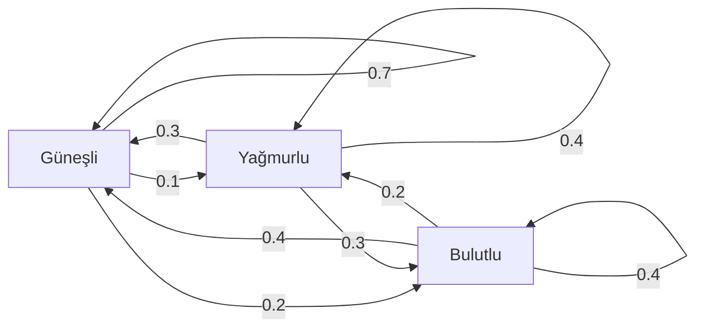
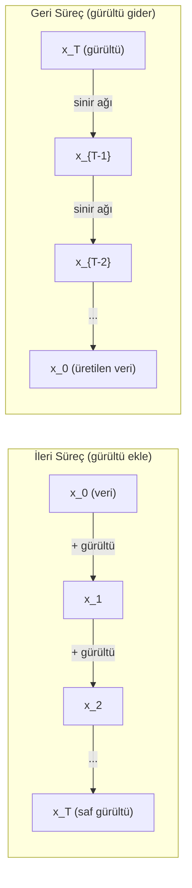

# Stokastik Süreçler

> Yapısı olan rastgelelik. Random walk'lar, Markov zincirleri ve diffusion modellerinin arkasındaki matematik.

**Tür:** Öğrenim
**Dil:** Python
**Ön koşullar:** Faz 1, Ders 06-07 (olasılık, Bayes)
**Süre:** ~75 dakika

## Öğrenme Hedefleri

- 1B ve 2B random walk'ları simüle et ve yer değiştirmenin sqrt(n) ölçeklemesini doğrula
- Bir Markov chain simülatörü kur ve eigendecomposition yoluyla stationary dağılımını hesapla
- Hedef dağılımlardan örnekleme için Metropolis-Hastings MCMC ve Langevin dynamics implemente et
- İleri diffusion sürecini Brownian motion'a bağla ve geri sürecin nasıl veri ürettiğini açıkla

## Sorun

Birçok AI sistemi zaman içinde gelişen rastgelelik içerir. Statik rastgelelik değil — yapılı, sıralı rastgelelik, her adımın öncekine bağlı olduğu.

Dil modelleri token'ları tek tek üretir. Her token önceki bağlama bağlıdır. Model bir olasılık dağılımı çıkarır, ondan örnekler ve devam eder. Bu bir stokastik süreçtir.

Diffusion modelleri bir görüntüye saf statik olana kadar adım adım gürültü ekler. Sonra süreci tersine çevirir, yeni bir görüntü ortaya çıkana kadar adım adım gürültü giderir. İleri süreç bir Markov chain'dir. Geri süreç tersine çalışan öğrenilmiş bir Markov chain'dir.

Reinforcement learning ajanları bir ortamda aksiyonlar alır. Her aksiyon bir olasılıkla yeni bir duruma götürür. Ajan rastgele bir dünyada rastgele bir policy izler. Tüm şey bir Markov karar sürecidir.

MCMC sampling — Bayesçi çıkarımın belkemiği — stationary dağılımı örneklemek istediğin posterior olan bir Markov chain inşa eder.

Tüm bunlar dört temel fikir üzerine inşa edilir:
1. Random walk'lar — en basit stokastik süreç
2. Markov chain'ler — transition matrisi ile yapılı rastgelelik
3. Langevin dynamics — gürültülü gradient descent
4. Metropolis-Hastings — herhangi bir dağılımdan örnekleme

## Kavram

### Random Walk'lar

Pozisyon 0'da başla. Her adımda adil bir madeni para at. Yazı: sağa hareket et (+1). Tura: sola hareket et (-1).

N adım sonra, pozisyonun n rastgele +/-1 değerin toplamıdır. Beklenen pozisyon 0'dır (walk yansızdır). Ama orijinden beklenen uzaklık sqrt(n) olarak büyür.

Bu mantıksızdır. Walk adildir — hiçbir yönde drift yok. Ama zaman geçtikçe, başladığı yerden gittikçe daha uzağa gezer. N adım sonra standart sapma sqrt(n)'dir.

```
Adım 0:  Pozisyon = 0
Adım 1:  Pozisyon = +1 veya -1
Adım 2:  Pozisyon = +2, 0 veya -2
...
Adım 100: Orijinden beklenen uzaklık ~ 10 (sqrt(100))
Adım 10000: Orijinden beklenen uzaklık ~ 100 (sqrt(10000))
```

**2B'de**, walk eşit olasılıkla yukarı, aşağı, sola veya sağa hareket eder. Aynı sqrt(n) ölçeklemesi orijinden uzaklık için geçerlidir. Yol fraktal benzeri bir desen izler.

**Neden sqrt(n)?** Her adım eşit olasılıkla +1 veya -1'dir. N adım sonra pozisyon S_n = X_1 + X_2 + ... + X_n burada her X_i +/-1'dir. Her adımın varyansı 1'dir ve adımlar bağımsızdır, dolayısıyla Var(S_n) = n. Standart sapma = sqrt(n). Merkezi limit teoremine göre, S_n / sqrt(n) standart normal dağılıma yakınsar.

Bu sqrt(n) ölçeklemesi ML'de her yerde görünür. SGD gürültüsü 1/sqrt(batch_size) olarak ölçeklenir. Embedding boyutları sqrt(d) olarak ölçeklenir. Karekök bağımsız rastgele eklemelerin imzasıdır.

**Brownian motion'a bağlantı.** Adım boyutu 1/sqrt(n) ve birim zaman başına n adımlı bir random walk al. N sonsuza giderken, walk Brownian motion B(t)'ye yakınsar — B(t)'nin mean 0 ve varyans t ile normal dağıldığı sürekli zamanlı bir süreç.

Brownian motion diffusion'ın matematiksel temelidir. Sıvıdaki parçacıkların rastgele jiggling'ini, hisse senedi fiyatlarının dalgalanmalarını ve — kritik olarak — diffusion modellerindeki gürültü sürecini modeller.

**Gambler's ruin.** Pozisyon k'den başlayan bir random walker, 0 ve N'de absorbing barrier'lar ile. 0'dan önce N'e ulaşma olasılığı nedir? Adil bir walk için: P(N'e ulaş) = k/N. Bu şaşırtıcı şekilde basit ve zariftir. Martingale teorisine bağlanır — adil random walk bir martingale'dir (beklenen gelecek değer = mevcut değer).

### Markov Zincirleri

Bir Markov chain sabit olasılıklara göre durumlar arasında geçiş yapan bir sistemdir. Anahtar özellik: bir sonraki durum sadece mevcut duruma bağlıdır, geçmişe değil.

```
P(X_{t+1} = j | X_t = i, X_{t-1} = ...) = P(X_{t+1} = j | X_t = i)
```

Bu Markov özelliğidir. Tüm dinamikleri bir transition matrisi P ile tanımlayabileceğin anlamına gelir:

```
P[i][j] = i durumundan j durumuna gitme olasılığı
```

P'nin her satırı 1'e toplanır (bir yere gitmen gerekir).

**Örnek — Hava Durumu:**

```
Durumlar: Güneşli (0), Yağmurlu (1), Bulutlu (2)

P = [[0.7, 0.1, 0.2],    (güneşliyse: %70 güneşli, %10 yağmurlu, %20 bulutlu)
     [0.3, 0.4, 0.3],    (yağmurluysa: %30 güneşli, %40 yağmurlu, %30 bulutlu)
     [0.4, 0.2, 0.4]]    (bulutluysa: %40 güneşli, %20 yağmurlu, %40 bulutlu)
```

Herhangi bir durumda başla. Birçok geçişten sonra, durumların dağılımı stationary dağılım pi'ye yakınsar, burada pi * P = pi. Bu, P'nin eigenvalue 1 olan sol eigenvector'udur.

Hava durumu zinciri için, stationary dağılım [0.53, 0.18, 0.29] olabilir — uzun vadede, başlangıç durumundan bağımsız olarak %53'ü güneşlidir.



**Stationary dağılımı hesaplama.** İki yaklaşım var:

1. **Power method**: herhangi bir başlangıç dağılımını P ile defalarca çarp. Yeterli iterasyon sonrası yakınsar.
2. **Eigenvalue yöntemi**: P'nin eigenvalue 1 ile sol eigenvector'unu bul. Bu, P^T'nin eigenvalue 1 ile eigenvector'udur.

Her iki yaklaşım da zincirin yakınsama koşullarını karşılamasını gerektirir.

**Yakınsama koşulları.** Bir Markov chain aşağıdaki durumlarda eşsiz bir stationary dağılıma yakınsar:
- **Irreducible**: her durum diğer her durumdan erişilebilir
- **Aperiodic**: zincir sabit bir periyot ile döngü yapmaz

ML'de karşılaştığın çoğu zincir her iki koşulu da karşılar.

**Absorbing durumlar.** Bir durum eğer ona girdiğinde asla terk etmiyorsa (P[i][i] = 1) absorbing'dir. Absorbing Markov chain'ler terminal durumlu süreçleri modeller — biten bir oyun, churn yapan bir müşteri, end-of-text token'a vuran bir token dizisi.

**Mixing time.** Zincirin stationary dağılıma "yakın" olmasına kadar kaç adım? Resmi olarak, stationary'den toplam varyasyon uzaklığı bir eşiğin altına düşene kadar geçen adım sayısı. Hızlı mixing = az adım gerekli. P'nin spektral gap'i (1 eksi ikinci en büyük eigenvalue) mixing time'ı kontrol eder. Daha büyük gap = daha hızlı mixing.

### Dil Modellerine Bağlantı

Bir dil modelinde token üretimi yaklaşık olarak bir Markov sürecidir. Mevcut bağlam verildiğinde, model bir sonraki token üzerinde bir dağılım çıkarır. Temperature keskinliği kontrol eder:

```
P(token_i) = exp(logit_i / temperature) / sum(exp(logit_j / temperature))
```

- Temperature = 1.0: standart dağılım
- Temperature < 1.0: daha keskin (daha deterministik)
- Temperature > 1.0: daha düz (daha rastgele)
- Temperature -> 0: argmax (greedy)

Top-k sampling en yüksek olasılıklı k token'a kırpar. Top-p (nucleus) sampling kümülatif olasılığı p'yi aşan en küçük token setine kırpar. İkisi de Markov geçiş olasılıklarını değiştirir.

### Brownian Motion

Random walk'un sürekli zaman limiti. Pozisyon B(t)'nin üç özelliği vardır:
1. B(0) = 0
2. B(t) - B(s), mean 0 ve varyans t - s ile normal dağılır (t > s için)
3. Örtüşmeyen aralıklardaki artımlar bağımsızdır

Brownian motion süreklidir ama hiçbir yerde diferansiye edilemez — her ölçekte jiggle yapar. Yolun düzlemde fraktal boyutu 2'dir.

Kesikli simülasyonda, Brownian motion'ı şununla yaklaşıklarsın:

```
B(t + dt) = B(t) + sqrt(dt) * z,    burada z ~ N(0, 1)
```

Sqrt(dt) ölçeklemesi önemlidir. Random walk'lara uygulanan merkezi limit teoreminden gelir.

### Langevin Dynamics

Gradient descent bir fonksiyonun minimumunu bulur. Langevin dynamics exp(-U(x)/T)'ye orantılı olasılık dağılımını bulur, burada U bir enerji fonksiyonu ve T temperature'dur.

```
x_{t+1} = x_t - dt * gradient(U(x_t)) + sqrt(2 * T * dt) * z_t
```

Parçacığa iki kuvvet etki eder:
1. **Gradient kuvveti** (-dt * gradient(U)): düşük enerjiye doğru iter (gradient descent gibi)
2. **Rastgele kuvvet** (sqrt(2*T*dt) * z): rastgele yönlere iter (keşif)

Temperature T = 0'da, bu saf gradient descent'tir. Yüksek temperature'da, neredeyse bir random walk'tır. Doğru temperature'da, parçacık enerji manzarasını keşfeder ve düşük enerji bölgelerinde daha fazla zaman harcar.

**Diffusion modellerine bağlantı.** Bir diffusion modelinin ileri süreci:

```
x_t = sqrt(alpha_t) * x_{t-1} + sqrt(1 - alpha_t) * noise
```

Bu, veriyi gürültüyle aşamalı olarak karıştıran bir Markov chain'dir. Yeterli adım sonra, x_T saf Gauss gürültüsüdür.

Geri süreç — gürültüden veriye geri gitmek — de bir Markov chain'dir, ama geçiş olasılıkları bir sinir ağı tarafından öğrenilir. Ağ her adımda eklenen gürültüyü tahmin etmeyi öğrenir, sonra onu çıkarır.



### MCMC: Markov Chain Monte Carlo

Bazen değerlendirebilen (bir sabite kadar) ama doğrudan örnekleyemediğin bir dağılım p(x)'ten örnek almanız gerekir. Bayesçi posterior'lar klasik örnektir — likelihood çarpı prior'u biliyorsun, ama normalleştirme sabiti hesaplanamaz.

**Metropolis-Hastings** stationary dağılımı p(x) olan bir Markov chain inşa eder:

1. Bir pozisyon x'te başla
2. Bir proposal dağılımı Q(x'|x)'ten yeni bir pozisyon x' öner
3. Kabul oranını hesapla: a = p(x') * Q(x|x') / (p(x) * Q(x'|x))
4. min(1, a) olasılığıyla x'i kabul et. Aksi halde x'te kal.
5. Tekrarla.

Q simetrikse (örn. Q(x'|x) = Q(x|x') = N(x, sigma^2)), oran a = p(x') / p(x)'e sadeleşir. Sadece olasılıkların oranına ihtiyacın var — normalleştirme sabiti iptal olur.

Zincirin hafif koşullar altında p(x)'e yakınsadığı garanti edilir. Ama proposal çok küçükse (random walk) veya çok büyükse (yüksek rejection) yakınsama yavaş olabilir. Proposal'ı tune etmek MCMC sanatıdır.

**Neden çalışır.** Kabul oranı detailed balance'ı sağlar: x'te olup x'ye taşınma olasılığı x''nde olup x'e taşınma olasılığına eşittir. Detailed balance p(x)'in zincirin stationary dağılımı olduğunu ima eder. Yani yeterli adımdan sonra, örnekler p(x)'ten gelir.

**Pratik düşünceler:**
- **Burn-in**: ilk N örneği at. Zincirin başlangıç noktasından stationary dağılıma ulaşmak için zamana ihtiyacı var.
- **Thinning**: autocorrelation'ı azaltmak için her k. örneği tut.
- **Çoklu zincirler**: farklı başlangıç noktalarından birkaç zincir çalıştır. Aynı dağılıma yakınsarlarsa, yakınsamaya kanıtın var.
- **Kabul oranı**: d boyutlu Gauss proposal'lar için, optimal kabul oranı yaklaşık %23'tür (Roberts & Rosenthal, 2001). Çok yüksek zincirin pek hareket etmediği anlamına gelir. Çok düşük her şeyi reddettiği anlamına gelir.

### AI'da Stokastik Süreçler

| Süreç | AI Uygulaması |
|---------|---------------|
| Random walk | RL'de keşif, Node2Vec embedding'leri |
| Markov chain | Metin üretimi, MCMC sampling |
| Brownian motion | Diffusion modelleri (ileri süreç) |
| Langevin dynamics | Score tabanlı generative modeller, SGLD |
| Markov karar süreci | Reinforcement learning |
| Metropolis-Hastings | Bayesçi çıkarım, posterior sampling |

## İnşa Et

### Adım 1: Random walk simülatörü

```python
import numpy as np

def random_walk_1d(n_steps, seed=None):
    rng = np.random.RandomState(seed)
    steps = rng.choice([-1, 1], size=n_steps)
    positions = np.concatenate([[0], np.cumsum(steps)])
    return positions


def random_walk_2d(n_steps, seed=None):
    rng = np.random.RandomState(seed)
    directions = rng.choice(4, size=n_steps)
    dx = np.zeros(n_steps)
    dy = np.zeros(n_steps)
    dx[directions == 0] = 1   # sağ
    dx[directions == 1] = -1  # sol
    dy[directions == 2] = 1   # yukarı
    dy[directions == 3] = -1  # aşağı
    x = np.concatenate([[0], np.cumsum(dx)])
    y = np.concatenate([[0], np.cumsum(dy)])
    return x, y
```

1B walk kümülatif toplamları saklar. Her adım +1 veya -1'dir. N adım sonra, pozisyon toplamdır. Varyans n ile lineer büyür, dolayısıyla standart sapma sqrt(n) olarak büyür.

### Adım 2: Markov chain

```python
class MarkovChain:
    def __init__(self, transition_matrix, state_names=None):
        self.P = np.array(transition_matrix, dtype=float)
        self.n_states = len(self.P)
        self.state_names = state_names or [str(i) for i in range(self.n_states)]

    def step(self, current_state, rng=None):
        if rng is None:
            rng = np.random.RandomState()
        probs = self.P[current_state]
        return rng.choice(self.n_states, p=probs)

    def simulate(self, start_state, n_steps, seed=None):
        rng = np.random.RandomState(seed)
        states = [start_state]
        current = start_state
        for _ in range(n_steps):
            current = self.step(current, rng)
            states.append(current)
        return states

    def stationary_distribution(self):
        eigenvalues, eigenvectors = np.linalg.eig(self.P.T)
        idx = np.argmin(np.abs(eigenvalues - 1.0))
        stationary = np.real(eigenvectors[:, idx])
        stationary = stationary / stationary.sum()
        return np.abs(stationary)
```

Stationary dağılım P'nin eigenvalue 1 ile sol eigenvector'udur. P^T'nin eigenvector'larını hesaplayarak buluruz (transpoze sol eigenvector'ları sağ eigenvector'lara çevirir).

### Adım 3: Langevin dynamics

```python
def langevin_dynamics(grad_U, x0, dt, temperature, n_steps, seed=None):
    rng = np.random.RandomState(seed)
    x = np.array(x0, dtype=float)
    trajectory = [x.copy()]
    for _ in range(n_steps):
        noise = rng.randn(*x.shape)
        x = x - dt * grad_U(x) + np.sqrt(2 * temperature * dt) * noise
        trajectory.append(x.copy())
    return np.array(trajectory)
```

Gradient x'i düşük enerjiye doğru iter. Gürültü onun takılı kalmasını önler. Dengede, örneklerin dağılımı exp(-U(x)/temperature)'a orantılıdır.

### Adım 4: Metropolis-Hastings

```python
def metropolis_hastings(target_log_prob, proposal_std, x0, n_samples, seed=None):
    rng = np.random.RandomState(seed)
    x = np.array(x0, dtype=float)
    samples = [x.copy()]
    accepted = 0
    for _ in range(n_samples - 1):
        x_proposed = x + rng.randn(*x.shape) * proposal_std
        log_ratio = target_log_prob(x_proposed) - target_log_prob(x)
        if np.log(rng.rand()) < log_ratio:
            x = x_proposed
            accepted += 1
        samples.append(x.copy())
    acceptance_rate = accepted / (n_samples - 1)
    return np.array(samples), acceptance_rate
```

Algoritma yeni bir nokta önerir, daha yüksek olasılığa sahip olup olmadığını kontrol eder (veya oranla orantılı olasılıkla kabul eder) ve tekrarlar. Kabul oranı iyi mixing için %23-50 civarında olmalıdır.

## Kullan

Pratikte, bu algoritmalar için yerleşik kütüphaneleri kullanırsın. Ama debugging ve tuning için mekaniklerini anlamak önemlidir.

```python
import numpy as np

rng = np.random.RandomState(42)
walk = np.cumsum(rng.choice([-1, 1], size=10000))
print(f"Final pozisyon: {walk[-1]}")
print(f"Beklenen uzaklık: {np.sqrt(10000):.1f}")
print(f"Gerçek uzaklık: {abs(walk[-1])}")
```

### Transition matrisleri için numpy

```python
import numpy as np

P = np.array([[0.7, 0.1, 0.2],
              [0.3, 0.4, 0.3],
              [0.4, 0.2, 0.4]])

distribution = np.array([1.0, 0.0, 0.0])
for _ in range(100):
    distribution = distribution @ P

print(f"Stationary dağılım: {np.round(distribution, 4)}")
```

Başlangıç dağılımını P ile defalarca çarp. Yeterli iterasyon sonrası, nereden başladığından bağımsız olarak stationary dağılıma yakınsar. Bu baskın sol eigenvector'u bulmak için power method'udur.

### Gerçek framework'lere bağlantılar

- **PyTorch diffusion:** Hugging Face `diffusers`'taki `DDPMScheduler` ileri ve geri Markov chain'leri implemente eder
- **NumPyro / PyMC:** Bayesçi çıkarım için MCMC (Metropolis-Hastings'i iyileştiren NUTS sampler) kullan
- **Gymnasium (RL):** Ortam step fonksiyonu bir Markov karar süreci tanımlar

### Markov chain yakınsamasını doğrulama

```python
import numpy as np

P = np.array([[0.9, 0.1], [0.3, 0.7]])

eigenvalues = np.linalg.eigvals(P)
spectral_gap = 1 - sorted(np.abs(eigenvalues))[-2]
print(f"Eigenvalue'lar: {eigenvalues}")
print(f"Spektral gap: {spectral_gap:.4f}")
print(f"Yaklaşık mixing time: {1/spectral_gap:.1f} adım")
```

Spektral gap sana zincirin başlangıç durumunu ne kadar hızlı unuttuğunu söyler. 0.2 gap kabaca 5 adımda mix demektir. 0.01 gap kabaca 100 adım demektir. Uzun simülasyonlar çalıştırmadan önce her zaman bunu kontrol et — yavaş karışan bir zincir compute'u harcar.

## Yayınla

Bu ders şunu üretir:
- `outputs/prompt-stochastic-process-advisor.md` -- belirli bir probleme hangi stokastik süreç çerçevesinin uygulandığını tanımlamaya yardım eden bir prompt

## Bağlantılar

| Kavram | Nerede görünür |
|---------|------------------|
| Random walk | Node2Vec graf embedding'leri, RL'de keşif |
| Markov chain | LLM'lerde token üretimi, MCMC sampling |
| Brownian motion | DDPM'de ileri diffusion süreci, SDE tabanlı modeller |
| Langevin dynamics | Score tabanlı generative modeller, stochastic gradient Langevin dynamics (SGLD) |
| Stationary dağılım | MCMC yakınsama hedefi, PageRank |
| Metropolis-Hastings | Bayesçi posterior sampling, simulated annealing |
| Temperature | LLM sampling, RL'de Boltzmann keşfi, simulated annealing |
| Mixing time | MCMC'nin yakınsama hızı, spektral gap analizi |
| Absorbing durum | End-of-sequence token, RL'de terminal durumlar |
| Detailed balance | MCMC sampler'ları için doğruluk garantisi |

Diffusion modelleri özel dikkat hak eder. DDPM (Ho et al., 2020) bir ileri Markov chain tanımlar:

```
q(x_t | x_{t-1}) = N(x_t; sqrt(1-beta_t) * x_{t-1}, beta_t * I)
```

burada beta_t bir gürültü programıdır. T adım sonra, x_T yaklaşık olarak N(0, I)'dir. Geri süreç gürültüyü tahmin eden bir sinir ağı tarafından parametrize edilir:

```
p_theta(x_{t-1} | x_t) = N(x_{t-1}; mu_theta(x_t, t), sigma_t^2 * I)
```

Üretimin her adımı öğrenilmiş bir Markov chain'deki bir adımdır. Markov chain'leri anlamak diffusion modellerinin nasıl ve neden veri ürettiğini anlamaktır.

SGLD (Stochastic Gradient Langevin Dynamics) mini-batch gradient descent'i Langevin gürültüsü ile birleştirir. Tam gradient'i hesaplamak yerine, stokastik bir tahmin kullanır ve kalibre edilmiş gürültü ekler. Learning rate azaldıkça, SGLD optimizasyondan sampling'e geçer — bedavaya yaklaşık Bayesçi posterior örnekleri alırsın. Bu, bir sinir ağından belirsizlik tahminleri almanın en basit yollarından biridir.

Tüm bu bağlantılar boyunca anahtar içgörü: stokastik süreçler sadece teorik araçlar değildir. Modern AI sistemlerinin içindeki hesaplama mekanizmalarıdır. Bir LLM'nin temperature'ını tune ettiğinde, bir Markov chain'i ayarlıyorsun. Bir diffusion modeli eğittiğinde, Brownian-motion benzeri bir süreci tersine çevirmeyi öğreniyorsun. Bayesçi çıkarım çalıştırdığında, posterior'a yakınsayan bir zincir inşa ediyorsun.

## Alıştırmalar

1. **10000 adımlık 1000 random walk simüle et.** Final pozisyonların dağılımını çiz. Yaklaşık olarak mean 0 ve standart sapma sqrt(10000) = 100 olan Gauss olduğunu doğrula.

2. **Markov chain kullanan bir metin üretici kur.** Küçük bir korpus üzerinde eğit: her kelime için, bir sonraki kelimeye geçişleri say. Transition matrisini kur. Zincirden örnekleyerek yeni cümleler üret.

3. **Simulated annealing implemente et** Metropolis-Hastings kullanarak. Yüksek temperature'da başla (neredeyse her şeyi kabul et) ve aşamalı olarak soğut (sadece iyileştirmeleri kabul et). Birçok yerel minimumlu bir fonksiyonun minimumunu bulmak için kullan.

4. **Farklı temperature'larda Langevin dynamics'i karşılaştır.** Çift kuyulu bir potansiyel U(x) = (x^2 - 1)^2'den örnekle. Düşük temperature'da, örnekler bir kuyuda kümelenir. Yüksek temperature'da, her ikisinde yayılırlar. Zincirin kuyular arası karıştığı kritik temperature'ı bul.

5. **İleri diffusion sürecini implemente et.** 1B bir sinyalle başla (örn. bir sinüs dalga). 100 adım boyunca lineer gürültü programı ile aşamalı gürültü ekle. Sinyalin saf gürültüye nasıl bozulduğunu göster. Sonra süreci tersine çeviren basit bir denoiser implemente et (sadece tahmin edilen gürültüyü çıkaran naif olanı bile).

## Anahtar Terimler

| Terim | İnsanlar ne der | Aslında ne demek |
|------|----------------|----------------------|
| Random walk | "Madeni para atışı hareketi" | Pozisyonun her adımda rastgele artımlarla değiştiği süreç |
| Markov özelliği | "Hafızasız" | Gelecek sadece mevcut duruma bağlı, geçmişe değil |
| Transition matrisi | "Olasılık tablosu" | P[i][j] = i durumundan j durumuna hareket etme olasılığı |
| Stationary dağılım | "Uzun vadeli ortalama" | pi*P = pi olan pi dağılımı — zincirin dengesi |
| Brownian motion | "Rastgele jiggling" | Random walk'un sürekli zaman limiti, B(t) ~ N(0, t) |
| Langevin dynamics | "Gürültülü gradient descent" | Deterministik gradient ve rastgele pertürbasyonu birleştiren güncelleme kuralı |
| MCMC | "Hedefe doğru yürüme" | İstediğin stationary dağılımı olan bir Markov chain inşa etme |
| Metropolis-Hastings | "Öner ve kabul/reddet" | Yakınsamayı sağlamak için kabul oranları kullanan MCMC algoritması |
| Temperature | "Rastgelelik düğmesi" | Keşif ile sömürme arasındaki trade-off'u kontrol eden parametre |
| Diffusion süreci | "Gürültü içeri, gürültü dışarı" | İleri: aşamalı gürültü ekle. Geri: aşamalı kaldır. Veri üretir. |

## İleri Okuma

- **Ho, Jain, Abbeel (2020)** -- "Denoising Diffusion Probabilistic Models." Diffusion modeli devrimini başlatan DDPM makalesi. İleri ve geri Markov chain'lerin net türetimi.
- **Song & Ermon (2019)** -- "Generative Modeling by Estimating Gradients of the Data Distribution." Sampling için Langevin dynamics kullanan score tabanlı yaklaşım.
- **Roberts & Rosenthal (2004)** -- "General state space Markov chains and MCMC algorithms." MCMC'nin ne zaman ve neden çalıştığının arkasındaki teori.
- **Norris (1997)** -- "Markov Chains." Standart ders kitabı. Yakınsama, stationary dağılımlar ve hitting time'ları kapsar.
- **Welling & Teh (2011)** -- "Bayesian Learning via Stochastic Gradient Langevin Dynamics." Ölçeklenebilir Bayesçi çıkarım için SGD'yi Langevin dynamics ile birleştirir.
