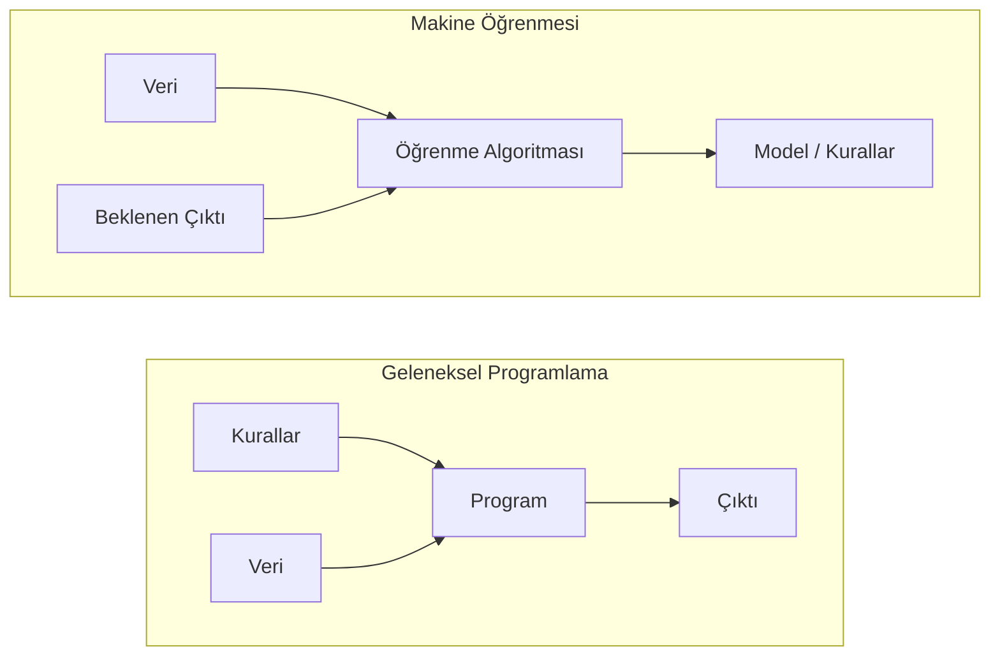
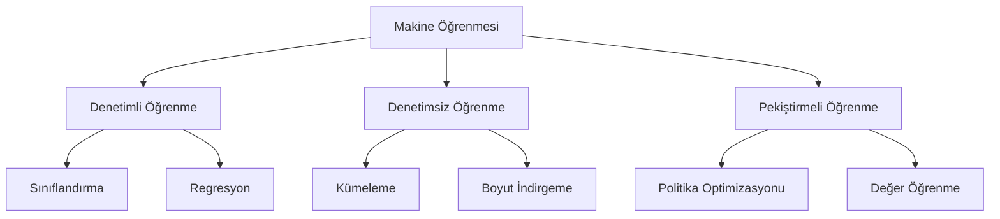
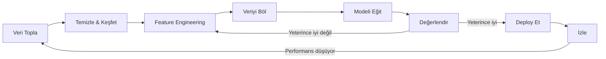
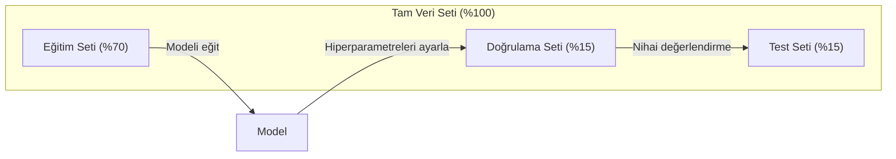
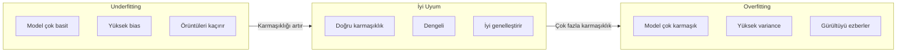
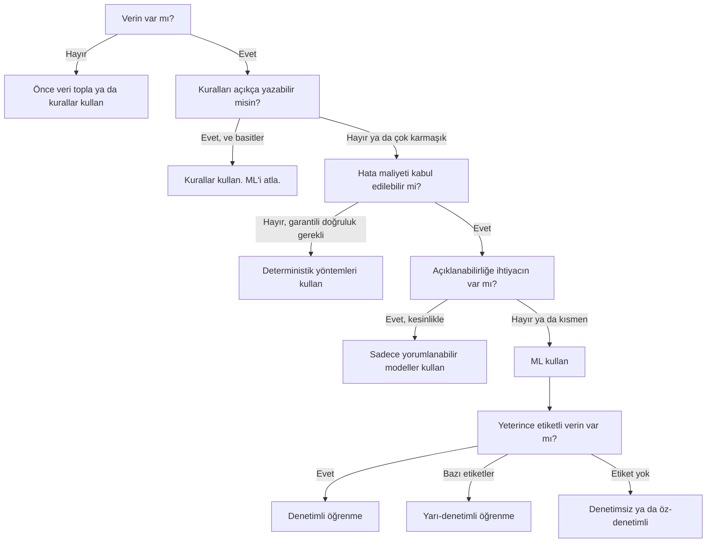

# Makine Öğrenmesi Nedir

> Makine öğrenmesi, kuralları elle yazmak yerine bilgisayara veriden örüntü bulmayı öğretmektir.

**Tür:** Öğrenim
**Diller:** Python
**Ön koşullar:** Faz 1 (Matematik Temelleri)
**Süre:** ~45 dakika

## Öğrenme Hedefleri

- Denetimli, denetimsiz ve pekiştirmeli öğrenme arasındaki farkı açıkla ve verilen bir probleme hangi türün uygun olduğunu belirle
- Sıfırdan bir nearest centroid sınıflandırıcı uygula ve onu rastgele bir baseline ile karşılaştırarak değerlendir
- Sınıflandırma ve regresyon görevleri arasındaki farkı ayırt et ve her biri için uygun loss fonksiyonunu seç
- Verilen bir iş probleminin ML için uygun olup olmadığını ya da deterministik kurallarla daha iyi çözüleceğini değerlendir

## Sorun

Bir spam filtresi inşa etmek istiyorsun. Geleneksel yaklaşım: oturup yüzlerce kural yazmak. "Eğer e-posta 'BEDAVA PARA' içeriyorsa, spam olarak işaretle. 3'ten fazla ünlem işareti varsa, spam olarak işaretle." Haftalarca kural yazıyorsun. Sonra spam'ciler kelimelerini değiştiriyor. Kurallarına bozuluyor. Daha fazla kural yazıyorsun. Bu döngü hiç bitmiyor.

Makine öğrenmesi bunu tersine çeviriyor. Kural yazmak yerine, bilgisayara binlerce etiketli e-posta veriyorsun ("spam" ya da "spam değil") ve kuralları kendisinin bulmasına izin veriyorsun. Bilgisayar, senin asla aklına gelmeyecek örüntüleri buluyor. Spam'ciler taktiklerini değiştirdiğinde, kod yeniden yazmak yerine yeni veriyle yeniden eğitiyorsun.

"Kural programlama"dan "veriden öğrenme"ye geçiş, makine öğrenmesinin özüdür. Her öneri motoru, sesli asistan, sürücüsüz araba ve dil modeli bu şekilde çalışır.

## Kavram

### Kurallardan Değil, Veriden Öğrenmek

Geleneksel programlama ve makine öğrenmesi problemleri zıt yönlerden çözer.



Geleneksel programlama: kuralları sen yazarsın. Program bu kuralları veriye uygulayarak çıktı üretir.

Makine öğrenmesi: sen veriyi ve beklenen çıktıları sağlarsın. Algoritma kuralları keşfeder.

Eğitimden çıkan "model", kuralların kendisidir — sayılar (ağırlıklar, parametreler) olarak kodlanmıştır. Gördüğü örneklerden genelleyerek hiç görmediği veriler üzerinde tahminler yapar.

### Makine Öğrenmesinin Üç Türü



**Denetimli Öğrenme**: Girdi-çıktı çiftlerin var. Model, girdileri çıktılara eşlemeyi öğrenir.
- "İşte kedi veya köpek olarak etiketlenmiş 10.000 fotoğraf. Onları birbirinden ayırmayı öğren."
- "İşte ev özellikleri ve fiyatları. Fiyatı tahmin etmeyi öğren."

**Denetimsiz Öğrenme**: Sadece girdilerin var. Etiket yok. Model yapıyı kendi başına bulur.
- "İşte 10.000 müşterinin satın alma geçmişi. Doğal grupları bul."
- "İşte 1.000 boyutlu veri noktaları. Yapıyı koruyarak 2 boyuta indir."

**Pekiştirmeli Öğrenme**: Bir agent ortamda eylemler gerçekleştirir ve ödüller ya da cezalar alır. Toplam ödülü maksimize etmek için bir strateji (policy) öğrenir.
- "Bu oyunu oyna. Kazanırsan +1, kaybedersen -1. Bir strateji bul."
- "Bu robot kolunu kontrol et. Nesneyi alırsan +1, boşa harcanan her saniye için -0.01."

Pratikte inşa edeceğin şeylerin çoğu denetimli öğrenme kullanır. Denetimsiz öğrenme ön işleme ve keşif için yaygındır. Pekiştirmeli öğrenme oyun yapay zekasını, robotiği ve dil modelleri için RLHF'i besler.

### Üç Büyük Türün Ötesinde

Yukarıdaki üç kategori temiz görünüyor ama gerçek dünyada ML genellikle çizgileri bulanıklaştırır.

**Yarı-denetimli öğrenme** küçük bir etiketli veri kümesi ve büyük bir etiketsiz veri kümesi kullanır. 100 etiketli tıbbi görüntün ve 100.000 etiketsiz görüntün olabilir. Teknikler şunları içerir:

- **Etiket yayılımı:** Benzer veri noktalarını birbirine bağlayan bir graf inşa et. Etiketler, etiketli node'lardan komşu etiketsiz node'lara graf üzerinden yayılır.
- **Pseudo-etiketleme:** Etiketli veriyle bir model eğit, etiketsiz veri için etiketler tahmin etmesini sağla, sonra her şey üzerinde yeniden eğit. Model kendi eğitim setini bootstrap'ler.
- **Tutarlılık düzenlemesi:** Model, bir girdi ile o girdinin biraz bozulmuş bir versiyonu için aynı tahmini vermeli. Bu, etiketler olmadan bile çalışır.

**Öz-denetimli öğrenme** denetimi verinin kendisinden yaratır. Hiç insan etiketine ihtiyacı yok. Model, verinin yapısından kendi tahmin görevini yaratır.

- **Maskelenmiş dil modelleme (BERT):** Cümledeki kelimelerin %15'ini gizle, modeli eksik kelimeleri tahmin etmek üzere eğit. "Etiketler" orijinal metinden gelir.
- **Karşıtlık öğrenmesi (SimCLR):** Bir görüntüyü al, iki büyütülmüş versiyonunu yarat. Modeli, bunların aynı görüntüden geldiğini tanıyacak ve diğer görüntülerin büyütülmüş versiyonlarından ayırt edecek şekilde eğit.
- **Sonraki-token tahmini (GPT):** Önceki tüm kelimeler verildiğinde sonraki kelimeyi tahmin et. Her metin belgesi bir eğitim örneği olur.

Bunlar üç büyük türden ayrı kategoriler değildir. Denetimli ve denetimsiz fikirleri birleştiren stratejilerdir. Öz-denetimli öğrenme teknik olarak denetimlidir (model bir şey tahmin eder) ama etiketler otomatik olarak üretilir, insanlar tarafından değil.

### Sınıflandırma vs Regresyon

Bunlar denetimli öğrenmenin iki ana görevidir.

| Özellik | Sınıflandırma | Regresyon |
|--------|---------------|------------|
| Çıktı | Ayrık kategoriler | Sürekli sayılar |
| Örnek | "Bu e-posta spam mi?" | "Ev fiyatı ne olacak?" |
| Çıktı uzayı | {kedi, köpek, kuş} | Herhangi bir gerçek sayı |
| Loss fonksiyonu | Cross-entropy, accuracy | Mean squared error, MAE |
| Karar | Sınıflar arasındaki sınırlar | Veriye uyan bir eğri |

Sınıflandırma "hangi kategori?" sorusunu cevaplar. Regresyon "ne kadar?" sorusunu cevaplar.

Bazı problemler iki şekilde de çerçevelenebilir. Bir hisse senedinin yükselip düşeceğini tahmin etmek sınıflandırmadır. Tam fiyatı tahmin etmek regresyondur.

### ML İş Akışı

Her makine öğrenmesi projesi, algoritmadan bağımsız olarak aynı pipeline'ı takip eder.



**Veri Topla**: Ham veriyi topla. Daha fazla veri neredeyse her zaman daha iyidir ama kalite niceliğin önündedir.

**Temizle & Keşfet**: Eksik değerleri ele al, kopyaları kaldır, dağılımları görselleştir, anomalileri tespit et. Bu adım genellikle toplam proje süresinin %60-80'ini alır.

**Feature Engineering**: Ham veriyi modelin kullanabileceği özniteliklere dönüştür. Tarihleri haftanın gününe çevir. Sayısal kolonları normalize et. Kategorik değişkenleri encode et. İyi feature'lar süslü algoritmalardan daha önemlidir.

**Veriyi Böl**: Eğitim, doğrulama ve test setlerine ayır. Model eğitim verisi üzerinde eğitilir, hiperparametreleri doğrulama verisi üzerinde ayarlarsın ve nihai performansı test verisi üzerinde raporlarsın.

**Modeli Eğit**: Eğitim verisini bir algoritmaya besle. Algoritma, loss fonksiyonunu minimize etmek için iç parametreleri ayarlar.

**Değerlendir**: Doğrulama/test verisi üzerinde performansı ölç. Performans kabul edilebilir değilse geri dön ve farklı feature'lar, algoritmalar ya da hiperparametreler dene.

**Deploy Et**: Modeli, yeni veri üzerinde tahmin yapacağı üretime al.

**İzle**: Zaman içinde performansı takip et. Veri dağılımları değişir (data drift) ve modeller bozulur. Performans düştüğünde yeniden eğit.

### Eğitim, Doğrulama ve Test Bölünmeleri

Bu, yeni başlayanların en çok yanlış anladığı kavramdır. Modelini, eğitim sırasında hiç görmediği veri üzerinde değerlendirmen gerekir. Aksi takdirde öğrenmeyi değil, ezberlemeyi ölçersin.



| Bölünme | Amaç | Ne zaman kullanılır | Tipik boyut |
|-------|---------|-----------|-------------|
| Eğitim | Model bu veriden öğrenir | Eğitim sırasında | %60-80 |
| Doğrulama | Hiperparametreleri ayarla, modelleri karşılaştır | Her eğitim çalıştırmasından sonra | %10-20 |
| Test | Nihai tarafsız performans tahmini | Bir kez, en sonunda | %10-20 |

Test seti kutsaldır. Ona tam olarak bir kez bakarsın. Modelini sürekli test performansına göre ayarlarsan, etkin olarak test seti üzerinde eğitiyorsun demektir ve raporladığın sayılar anlamsızdır.

Küçük veri setleri için k-fold cross-validation kullan: veriyi k parçaya böl, k-1 parça üzerinde eğit, kalan parça üzerinde doğrula, döndür ve sonuçların ortalamasını al.

### Overfitting vs Underfitting



**Underfitting**: Model, verideki örüntüleri yakalayamayacak kadar basittir. Eğri bir ilişkiye uymaya çalışan düz bir çizgi. Eğitim hatası yüksek. Test hatası yüksek.

**Overfitting**: Model, eğitim verisini gürültüsü dahil ezberleyecek kadar karmaşıktır. Her eğitim noktasından geçen ama yeni veride başarısız olan kıvrımlı bir eğri. Eğitim hatası düşük. Test hatası yüksek.

**İyi uyum**: Model gerçek örüntüleri gürültüyü ezberlemeden yakalar. Eğitim hatası ve test hatası her ikisi de makul ölçüde düşük.

Overfitting belirtileri:
- Eğitim doğruluğu, doğrulama doğruluğundan çok daha yüksek
- Model eğitim verisinde iyi ama yeni veride kötü performans gösteriyor
- Daha fazla eğitim verisi eklemek performansı iyileştiriyor (model öğrenmiyor, ezberliyordu)

Overfitting çözümleri:
- Daha fazla eğitim verisi al
- Model karmaşıklığını azalt (daha az parametre, daha basit mimari)
- Düzenleme (büyük ağırlıklar için bir ceza ekle)
- Dropout (eğitim sırasında nöronları rastgele sıfırla)
- Erken durdurma (doğrulama hatası artmaya başladığında eğitimi durdur)

Underfitting çözümleri:
- Daha karmaşık bir model kullan
- Daha fazla feature ekle
- Düzenlemeyi azalt
- Daha uzun süre eğit

### Bias-Variance Dengesi

Bu, overfitting ve underfitting'in arkasındaki matematiksel çerçevedir.

**Bias**: Modeldeki yanlış varsayımlardan kaynaklanan hata. Gerçek ilişki doğrusal olmadığında doğrusal bir modelin yüksek bias'ı vardır. Yüksek bias underfitting'e yol açar.

**Variance**: Eğitim verisindeki küçük dalgalanmalara karşı duyarlılıktan kaynaklanan hata. Yüksek variance'lı bir model, farklı veri alt kümeleri üzerinde eğitildiğinde çok farklı tahminler verir. Yüksek variance overfitting'e yol açar.

| Model karmaşıklığı | Bias | Variance | Sonuç |
|-----------------|------|----------|--------|
| Çok düşük (eğri veri için doğrusal model) | Yüksek | Düşük | Underfitting |
| Tam doğru | Orta | Orta | İyi genelleştirme |
| Çok yüksek (10 nokta için 20. derece polinom) | Düşük | Yüksek | Overfitting |

Toplam hata = Bias^2 + Variance + İndirgenemez gürültü

İndirgenemez gürültüyü azaltamazsın (verinin kendisindeki rastgeleliktir). bias^2 + variance'ın minimize edildiği tatlı noktayı bulmak istersin.

### No Free Lunch Teoremi

Her problem için en iyi çalışan tek bir algoritma yoktur. Bir problem sınıfında iyi performans gösteren bir algoritma, başka birinde kötü performans gösterir. Veri bilimcilerin birden fazla algoritma denemesi ve sonuçları karşılaştırmasının nedeni budur.

Pratikte seçim şuna bağlıdır:
- Ne kadar veriye sahipsin
- Kaç feature var
- İlişki doğrusal mı, doğrusal değil mi
- Yorumlanabilirliğe ihtiyacın var mı
- Ne kadar compute karşılayabilirsin

### ML'i NE ZAMAN Kullanmamalı

ML güçlü ama her zaman doğru araç değil. Bir modele uzanmadan önce gerçekten ihtiyacın olup olmadığını sor.

**ML'i şu durumlarda kullanma:**

- **Kurallar basit ve iyi tanımlıysa.** Vergi hesaplama, sıralama algoritmaları, birim dönüşümleri. Mantığı birkaç if-ifadesiyle yazabiliyorsan, model fayda sağlamadan karmaşıklık ekler.
- **Verin yok ya da çok az verin var.** ML, öğrenmek için örneklere ihtiyaç duyar. 10 veri noktasıyla anlamlı bir şey eğitemezsin. Önce veri topla.
- **Yanılma maliyeti felaket ve garantili doğruluk gerekiyorsa.** Tıbbi doz hesaplama, nükleer reaktör kontrolü, kriptografik doğrulama. ML modelleri olasılıksaldır. Bazen yanılırlar. "Bazen yanlış" kabul edilemezse, deterministik yöntemleri kullan.
- **Bir lookup tablosu ya da heuristik problemi çözüyorsa.** Basit bir eşik ya da tablo vakaların %99'unu kapsıyorsa, ML eklemek anlamlı bir iyileşme sağlamadan bakım maliyetini artırır.
- **Kararı açıklayamıyorsan ve açıklanabilirlik gerekiyorsa.** Düzenlenmiş endüstriler (kredilendirme, sigorta, ceza adaleti) bazen her kararın tam olarak açıklanabilir olmasını gerektirir. Bazı ML modelleri yorumlanabilirdir (doğrusal regresyon, küçük karar ağaçları). Çoğu değildir.
- **Problem, yeniden eğitebileceğinden daha hızlı değişiyorsa.** Kurallar günlük değişiyor ve yeniden eğitim bir hafta sürüyorsa, model her zaman bayatlamış olur.

Bu karar akış şemasını kullan:



## İnşa Et

`code/ml_intro.py` içindeki kod, mümkün olan en basit ML algoritması olan bir nearest centroid sınıflandırıcıyı sıfırdan uygular. Temel fikri gösterir: veriden öğren, sonra yeni veri üzerinde tahmin et.

### Adım 1: Sıfırdan Nearest Centroid Sınıflandırıcı

Nearest centroid sınıflandırıcı, eğitim verisindeki her sınıfın merkezini (ortalamasını) hesaplar. Tahmin için, her yeni noktayı merkezi en yakın olan sınıfa atar.

```python
class NearestCentroid:
    def fit(self, X, y):
        self.classes = np.unique(y)
        self.centroids = np.array([
            X[y == c].mean(axis=0) for c in self.classes
        ])

    def predict(self, X):
        distances = np.array([
            np.sqrt(((X - c) ** 2).sum(axis=1))
            for c in self.centroids
        ])
        return self.classes[distances.argmin(axis=0)]
```

Tüm algoritma bu kadar. Fit iki ortalama hesaplar. Predict mesafeleri hesaplar. Gradient descent yok, iterasyon yok, hiperparametre yok.

### Adım 2: Sentetik Veri Üzerinde Eğitim

Hafifçe örtüşen iki sınıflı 2B bir sınıflandırma veri seti üretiyoruz. Centroid sınıflandırıcı, sınıf merkezleri arasında doğrusal bir karar sınırı çizer.

```python
rng = np.random.RandomState(42)
X_class0 = rng.randn(100, 2) + np.array([1.0, 1.0])
X_class1 = rng.randn(100, 2) + np.array([-1.0, -1.0])
X = np.vstack([X_class0, X_class1])
y = np.array([0] * 100 + [1] * 100)
```

### Adım 3: Bir Baseline ile Karşılaştırma

Her ML modeli, sıradan bir baseline ile karşılaştırılmalıdır. Burada baseline rastgele bir sınıf tahmin eder. ML modelin rastgele tahminden iyi değilse, bir şey ters demektir.

```python
baseline_preds = rng.choice([0, 1], size=len(y_test))
baseline_acc = np.mean(baseline_preds == y_test)
```

Centroid sınıflandırıcı bu temiz veri setinde yaklaşık %90+ accuracy almalı. Rastgele baseline yaklaşık %50 alır.

### Bu Neden Önemli

Nearest centroid sınıflandırıcı önemsiz derecede basittir. Hiperparametresi, iterasyonu, gradient descent'i yoktur. Yine de temel ML örüntüsünü yakalar:

1. Eğitim verisinden bir temsil **öğren** (centroidler)
2. Bu temsili kullanarak yeni veride **tahmin et** (en yakın mesafe)
3. Bir baseline'a karşı **değerlendir** (rastgele tahmin)

Lojistik regresyondan transformer'lara kadar her ML algoritması bu üç adımlı örüntüyü takip eder. Temsil daha karmaşık hale gelir ama iş akışı aynı kalır.

### Adım 4: Centroid Sınıflandırıcının Yapamadıkları

Nearest centroid sınıflandırıcı, her sınıfın tek bir küme oluşturduğunu varsayar. Doğrusal karar sınırları çizer. Şu durumlarda başarısız olur:

- Sınıfların birden fazla kümesi olduğunda (örn., "1" rakamı birkaç farklı şekilde yazılabilir)
- Karar sınırı doğrusal olmadığında (örn., bir sınıf diğerinin etrafını sarıyor)
- Feature'lar çok farklı ölçeklere sahip olduğunda (mesafe en büyük ölçekli feature tarafından domine edilir)

Bu sınırlamalar öğreneceğin her diğer algoritmayı motive eder. K-nearest neighbors birden fazla kümeyi ele alır. Karar ağaçları doğrusal olmayan sınırları ele alır. Feature ölçekleme ölçek problemini düzeltir. Her ders bir öncekinin sınırlamaları üzerine inşa edilir.

## Kullan

sklearn `NearestCentroid` ve sentetik veri üreticileri sağlar:

```python
from sklearn.neighbors import NearestCentroid
from sklearn.datasets import make_classification
from sklearn.model_selection import train_test_split

X, y = make_classification(
    n_samples=500, n_features=2, n_redundant=0,
    n_clusters_per_class=1, random_state=42
)
X_train, X_test, y_train, y_test = train_test_split(X, y, test_size=0.3)

clf = NearestCentroid()
clf.fit(X_train, y_train)
print(f"Accuracy: {clf.score(X_test, y_test):.3f}")
```

## Yayınla

Bu ders `outputs/prompt-ml-problem-framer.md` üretir -- belirsiz iş problemlerini somut ML görevlerine çeviren bir prompt. Ona bir problem tanımı verirsin ("churn'ü azaltmak istiyoruz" ya da "önümüzdeki çeyrek için talebi tahmin et") ve o öğrenme türünü belirler, tahmin hedefini tanımlar, aday feature'ları listeler, bir başarı metriği seçer, bir baseline kurar ve data leakage ya da sınıf dengesizliği gibi tuzakları işaret eder. Yanlış bir şey inşa etmemek için her ML projesinin başında kullan.

## Anahtar Terimler

| Terim | İnsanlar ne der | Aslında ne demek |
|------|----------------|----------------------|
| Model | "Yapay zeka" | Girdileri çıktılara eşleyen, öğrenilebilir parametrelere sahip matematiksel bir fonksiyon |
| Eğitim | "Yapay zekaya öğretmek" | Tahminlerin bilinen çıktılarla eşleşmesi için model parametrelerini ayarlayan bir optimizasyon algoritması çalıştırmak |
| Feature | "Bir girdi kolonu" | Modelin tahmin yapmak için kullandığı, verinin ölçülebilir bir özelliği |
| Etiket | "Cevap" | Bir eğitim örneğinin bilinen çıktısı, hata sinyalini hesaplamak için kullanılır |
| Hiperparametre | "Bir ayar" | Eğitim öncesinde belirlenen, öğrenme sürecini kontrol eden bir parametre (learning rate, katman sayısı) |
| Loss fonksiyonu | "Modelin ne kadar yanlış olduğu" | Tahmin edilen ve gerçek çıktılar arasındaki farkı ölçen, eğitimin minimize etmeye çalıştığı bir fonksiyon |
| Overfitting | "Test setini ezberledi" | Model genel örüntüler yerine eğitime özgü gürültüyü öğrendi, bu yüzden yeni veride başarısız |
| Underfitting | "Hiçbir şey öğrenmedi" | Model verideki gerçek örüntüleri yakalayamayacak kadar basit |
| Genelleştirme | "Yeni veride çalışıyor" | Modelin, üzerinde eğitilmediği veri üzerinde doğru tahminler yapma yeteneği |
| Cross-validation | "Farklı parçalarda test etme" | Veriyi tekrar tekrar train/test fold'larına bölmek ve sonuçların ortalamasını almak, daha sağlam bir performans tahmini verir |
| Düzenleme | "Ağırlıkları küçük tutmak" | Loss fonksiyonuna, aşırı karmaşık modelleri caydıran bir ceza terimi eklemek |
| Data drift | "Dünya değişti" | Gelen verinin istatistiksel dağılımının zaman içinde kayması, model performansını düşürür |

## Alıştırmalar

1. Herhangi bir veri seti al (örn., Iris, Titanic). 70/15/15 olarak train/validation/test'e böl. Hiperparametreleri neden test seti üzerinde ayarlamaman gerektiğini açıkla.
2. Üç gerçek dünya problemi listele. Her biri için, sınıflandırma, regresyon ya da kümeleme olduğunu ve denetimli ya da denetimsiz olduğunu belirle.
3. Bir model eğitim verisinde %99 accuracy ama test verisinde %60 alıyor. Problemi teşhis et ve düzeltmek için deneyeceğin üç şeyi listele.

## Daha Fazla Okuma

- [An Introduction to Statistical Learning](https://www.statlearning.com/) - tüm klasik ML yöntemlerini pratik örneklerle kapsayan ücretsiz bir ders kitabı
- [Google's Machine Learning Crash Course](https://developers.google.com/machine-learning/crash-course) - ML kavramlarına özlü görsel bir giriş
- [Scikit-learn User Guide](https://scikit-learn.org/stable/user_guide.html) - Python'da ML uygulamak için pratik referans
