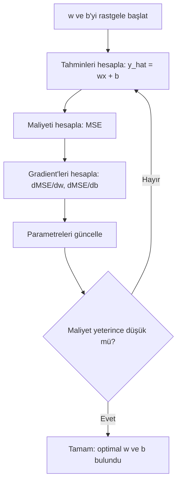

# Doğrusal Regresyon

> Doğrusal regresyon, verinin içinden en iyi düz çizgiyi çizer. Makine öğrenmesinin "hello world"udur.

**Tür:** Yapım
**Diller:** Python
**Ön koşullar:** Faz 1 (Doğrusal Cebir, Kalkülüs, Optimizasyon), Faz 2 Ders 1
**Süre:** ~90 dakika

## Öğrenme Hedefleri

- Mean squared error için gradient descent güncelleme kurallarını türet ve doğrusal regresyonu sıfırdan uygula
- Gradient descent ve normal denklemi hesaplama karmaşıklığı açısından karşılaştır ve her birinin ne zaman kullanılacağını belirle
- Feature standardizasyonu ile çoklu doğrusal regresyon modeli inşa et ve öğrenilen ağırlıkları yorumla
- Ridge regresyonunun (L2 düzenlemesi) büyük ağırlıkları cezalandırarak overfitting'i nasıl önlediğini açıkla

## Sorun

Verin var: ev büyüklükleri ve satış fiyatları. Yeni bir evin fiyatını, büyüklüğü verildiğinde tahmin etmek istiyorsun. Bunu bir scatter plot üzerinde gözle tahmin edebilirsin ama bir formüle ihtiyacın var. Veriye en iyi uyan, herhangi bir büyüklüğü girip fiyat tahmini alabileceğin bir çizgiye ihtiyacın var.

Doğrusal regresyon sana o çizgiyi verir. Daha da önemlisi, tüm ML eğitim döngüsünü tanıtır: bir model tanımla, bir maliyet fonksiyonu tanımla, parametreleri optimize et. Her ML algoritması aynı örüntüyü takip eder. Burada en basit haliyle ustalaş, her yerde tanıyacaksın.

Bu sadece basit problemler için değil. Doğrusal regresyon talep tahmini, A/B test analizi, finansal modelleme ve her regresyon görevi için baseline olarak üretim sistemlerinde kullanılır.

## Kavram

### Model

Doğrusal regresyon, girdi (x) ile çıktı (y) arasında doğrusal bir ilişki olduğunu varsayar:

```
y = wx + b
```

- `w` (ağırlık/eğim): x 1 arttığında y'nin ne kadar değiştiği
- `b` (bias/kesişim): x = 0 olduğunda y'nin değeri

Birden fazla girdi (feature) için bu şuna genişler:

```
y = w1*x1 + w2*x2 + ... + wn*xn + b
```

Veya vektör formunda: `y = w^T * x + b`

Amaç: tüm eğitim örneklerinde tahmin edilen y'nin gerçek y'ye mümkün olduğunca yakın olmasını sağlayan w ve b değerlerini bulmak.

### Maliyet Fonksiyonu (Mean Squared Error)

"Mümkün olduğunca yakın"ı nasıl ölçersin? Tahminlerinin ne kadar yanlış olduğunu yakalayan tek bir sayıya ihtiyacın var. En yaygın seçim Mean Squared Error (MSE):

```
MSE = (1/n) * sum((y_predicted - y_actual)^2)
```

Neden kare? İki neden. Birincisi, büyük hataları küçük hatalardan daha fazla cezalandırır (10'luk bir hata, 1'lik bir hatadan 10 kat değil, 100 kat daha kötüdür). İkincisi, kare fonksiyonu her yerde düzgün ve türevlenebilirdir, bu da optimizasyonu basitleştirir.

Maliyet fonksiyonu bir yüzey oluşturur. Tek bir ağırlık w ve bias b için MSE yüzeyi bir kase gibi görünür (dışbükey paraboloid). Kasenin dibi MSE'nin minimize edildiği yerdir. Eğitim, o dibi bulmak demektir.

### Gradient Descent

Gradient descent, yokuş aşağı adımlar atarak kasenin dibini bulur.



Gradient'ler sana iki şey söyler: her parametreyi hangi yöne hareket ettireceğin ve ne kadar hareket ettireceğin.

y_hat = wx + b ile MSE için:

```
dMSE/dw = (2/n) * sum((y_hat - y) * x)
dMSE/db = (2/n) * sum(y_hat - y)
```

Güncelleme kuralı:

```
w = w - learning_rate * dMSE/dw
b = b - learning_rate * dMSE/db
```

Learning rate adım boyutunu kontrol eder. Çok büyük: minimumu aşar ve ıraksarsın. Çok küçük: eğitim sonsuza kadar sürer. Tipik başlangıç değerleri: 0.01, 0.001 veya 0.0001.

### Normal Denklem (Kapalı-Form Çözüm)

Özellikle doğrusal regresyon için, hiç iterasyon olmadan optimal ağırlıkları veren doğrudan bir formül vardır:

```
w = (X^T * X)^(-1) * X^T * y
```

Bu, w için tek adımda çözmek için bir matrisi tersine çevirir. Küçük veri setleri için mükemmel çalışır. Büyük veri setleri için (milyonlarca satır veya binlerce feature), gradient descent tercih edilir çünkü matris tersine çevirme feature sayısında O(n^3)'tür.

### Çoklu Doğrusal Regresyon

Birden fazla feature ile model şu hale gelir:

```
y = w1*x1 + w2*x2 + ... + wn*xn + b
```

Her şey aynı şekilde çalışır: MSE maliyet fonksiyonudur, gradient descent tüm ağırlıkları eşzamanlı günceller. Tek fark, bir çizgi yerine bir hiperdüzlem uyduruyor olmandır.

Feature ölçekleme burada önemlidir. Bir feature 0 ile 1 arasında, bir diğeri 0 ile 1.000.000 arasında değişiyorsa, gradient descent zorlanır çünkü maliyet yüzeyi uzar. Eğitimden önce feature'ları standardize et (ortalamayı çıkar, standart sapmaya böl).

### Polinom Regresyonu

İlişki doğrusal değilse? Polinom feature'lar oluşturarak yine doğrusal regresyon kullanabilirsin:

```
y = w1*x + w2*x^2 + w3*x^3 + b
```

Bu hâlâ "doğrusal" regresyondur çünkü model ağırlıklarda doğrusaldır (w1, w2, w3). Sadece x'in doğrusal olmayan feature'larını kullanıyorsun.

Daha yüksek dereceli polinomlar daha karmaşık eğrilere uyabilir ama overfitting riski taşır. 10. dereceden bir polinom, 10 noktalık bir veri setindeki her noktadan geçer ama yeni veride kötü tahmin yapar.

### R-Kare Skoru

MSE sana ne kadar yanlış olduğunu söyler ama sayı y'nin ölçeğine bağlıdır. R-kare (R^2) ölçekten bağımsız bir ölçü verir:

```
R^2 = 1 - (kalıntıların kareleri toplamı) / (ortalamadan sapmaların kareleri toplamı)
    = 1 - SS_res / SS_tot
```

- R^2 = 1.0: mükemmel tahminler
- R^2 = 0.0: model her seferinde ortalamayı tahmin etmekten daha iyi değil
- R^2 < 0.0: model, ortalamayı tahmin etmekten daha kötü

### Düzenleme Önizleme (Ridge Regresyonu)

Birçok feature olduğunda model, büyük ağırlıklar atayarak overfit yapabilir. Ridge regresyonu (L2 düzenlemesi) bir ceza ekler:

```
Cost = MSE + lambda * sum(w_i^2)
```

Ceza terimi büyük ağırlıkları caydırır. lambda hiperparametresi dengeyi kontrol eder: daha yüksek lambda daha küçük ağırlıklar ve daha fazla düzenleme demektir. Bu, daha sonraki bir derste ayrıntılı olarak ele alınır. Şimdilik var olduğunu ve neden yardımcı olduğunu bil.

## İnşa Et

### Adım 1: Örnek veri üret

```python
import random
import math

random.seed(42)

TRUE_W = 3.0
TRUE_B = 7.0
N_SAMPLES = 100

X = [random.uniform(0, 10) for _ in range(N_SAMPLES)]
y = [TRUE_W * x + TRUE_B + random.gauss(0, 2.0) for x in X]

print(f"Generated {N_SAMPLES} samples")
print(f"True relationship: y = {TRUE_W}x + {TRUE_B} (+ noise)")
print(f"First 5 points: {[(round(X[i], 2), round(y[i], 2)) for i in range(5)]}")
```

### Adım 2: Gradient descent ile sıfırdan doğrusal regresyon

```python
class LinearRegression:
    def __init__(self, learning_rate=0.01):
        self.w = 0.0
        self.b = 0.0
        self.lr = learning_rate
        self.cost_history = []

    def predict(self, X):
        return [self.w * x + self.b for x in X]

    def compute_cost(self, X, y):
        predictions = self.predict(X)
        n = len(y)
        cost = sum((pred - actual) ** 2 for pred, actual in zip(predictions, y)) / n
        return cost

    def compute_gradients(self, X, y):
        predictions = self.predict(X)
        n = len(y)
        dw = (2 / n) * sum((pred - actual) * x for pred, actual, x in zip(predictions, y, X))
        db = (2 / n) * sum(pred - actual for pred, actual in zip(predictions, y))
        return dw, db

    def fit(self, X, y, epochs=1000, print_every=200):
        for epoch in range(epochs):
            dw, db = self.compute_gradients(X, y)
            self.w -= self.lr * dw
            self.b -= self.lr * db
            cost = self.compute_cost(X, y)
            self.cost_history.append(cost)
            if epoch % print_every == 0:
                print(f"  Epoch {epoch:4d} | Cost: {cost:.4f} | w: {self.w:.4f} | b: {self.b:.4f}")
        return self

    def r_squared(self, X, y):
        predictions = self.predict(X)
        y_mean = sum(y) / len(y)
        ss_res = sum((actual - pred) ** 2 for actual, pred in zip(y, predictions))
        ss_tot = sum((actual - y_mean) ** 2 for actual in y)
        return 1 - (ss_res / ss_tot)


print("=== Training Linear Regression (Gradient Descent) ===")
model = LinearRegression(learning_rate=0.005)
model.fit(X, y, epochs=1000, print_every=200)
print(f"\nLearned: y = {model.w:.4f}x + {model.b:.4f}")
print(f"True:    y = {TRUE_W}x + {TRUE_B}")
print(f"R-squared: {model.r_squared(X, y):.4f}")
```

### Adım 3: Normal denklem (kapalı-form çözüm)

```python
class LinearRegressionNormal:
    def __init__(self):
        self.w = 0.0
        self.b = 0.0

    def fit(self, X, y):
        n = len(X)
        x_mean = sum(X) / n
        y_mean = sum(y) / n
        numerator = sum((X[i] - x_mean) * (y[i] - y_mean) for i in range(n))
        denominator = sum((X[i] - x_mean) ** 2 for i in range(n))
        self.w = numerator / denominator
        self.b = y_mean - self.w * x_mean
        return self

    def predict(self, X):
        return [self.w * x + self.b for x in X]

    def r_squared(self, X, y):
        predictions = self.predict(X)
        y_mean = sum(y) / len(y)
        ss_res = sum((actual - pred) ** 2 for actual, pred in zip(y, predictions))
        ss_tot = sum((actual - y_mean) ** 2 for actual in y)
        return 1 - (ss_res / ss_tot)


print("\n=== Normal Equation (Closed-Form) ===")
model_normal = LinearRegressionNormal()
model_normal.fit(X, y)
print(f"Learned: y = {model_normal.w:.4f}x + {model_normal.b:.4f}")
print(f"R-squared: {model_normal.r_squared(X, y):.4f}")
```

### Adım 4: Çoklu doğrusal regresyon

```python
class MultipleLinearRegression:
    def __init__(self, n_features, learning_rate=0.01):
        self.weights = [0.0] * n_features
        self.bias = 0.0
        self.lr = learning_rate
        self.cost_history = []

    def predict_single(self, x):
        return sum(w * xi for w, xi in zip(self.weights, x)) + self.bias

    def predict(self, X):
        return [self.predict_single(x) for x in X]

    def compute_cost(self, X, y):
        predictions = self.predict(X)
        n = len(y)
        return sum((pred - actual) ** 2 for pred, actual in zip(predictions, y)) / n

    def fit(self, X, y, epochs=1000, print_every=200):
        n = len(y)
        n_features = len(X[0])
        for epoch in range(epochs):
            predictions = self.predict(X)
            errors = [pred - actual for pred, actual in zip(predictions, y)]
            for j in range(n_features):
                grad = (2 / n) * sum(errors[i] * X[i][j] for i in range(n))
                self.weights[j] -= self.lr * grad
            grad_b = (2 / n) * sum(errors)
            self.bias -= self.lr * grad_b
            cost = self.compute_cost(X, y)
            self.cost_history.append(cost)
            if epoch % print_every == 0:
                print(f"  Epoch {epoch:4d} | Cost: {cost:.4f}")
        return self

    def r_squared(self, X, y):
        predictions = self.predict(X)
        y_mean = sum(y) / len(y)
        ss_res = sum((actual - pred) ** 2 for actual, pred in zip(y, predictions))
        ss_tot = sum((actual - y_mean) ** 2 for actual in y)
        return 1 - (ss_res / ss_tot)


random.seed(42)
N = 100
X_multi = []
y_multi = []
for _ in range(N):
    size = random.uniform(500, 3000)
    bedrooms = random.randint(1, 5)
    age = random.uniform(0, 50)
    price = 50 * size + 10000 * bedrooms - 1000 * age + 50000 + random.gauss(0, 20000)
    X_multi.append([size, bedrooms, age])
    y_multi.append(price)


def standardize(X):
    n_features = len(X[0])
    means = [sum(X[i][j] for i in range(len(X))) / len(X) for j in range(n_features)]
    stds = []
    for j in range(n_features):
        variance = sum((X[i][j] - means[j]) ** 2 for i in range(len(X))) / len(X)
        stds.append(variance ** 0.5)
    X_scaled = []
    for i in range(len(X)):
        row = [(X[i][j] - means[j]) / stds[j] if stds[j] > 0 else 0 for j in range(n_features)]
        X_scaled.append(row)
    return X_scaled, means, stds


y_mean_val = sum(y_multi) / len(y_multi)
y_std_val = (sum((yi - y_mean_val) ** 2 for yi in y_multi) / len(y_multi)) ** 0.5
y_scaled = [(yi - y_mean_val) / y_std_val for yi in y_multi]

X_scaled, x_means, x_stds = standardize(X_multi)

print("\n=== Multiple Linear Regression (3 features) ===")
print("Features: house size, bedrooms, age")
multi_model = MultipleLinearRegression(n_features=3, learning_rate=0.01)
multi_model.fit(X_scaled, y_scaled, epochs=1000, print_every=200)

print(f"\nWeights (standardized): {[round(w, 4) for w in multi_model.weights]}")
print(f"Bias (standardized): {multi_model.bias:.4f}")
print(f"R-squared: {multi_model.r_squared(X_scaled, y_scaled):.4f}")
```

### Adım 5: Polinom regresyonu

```python
class PolynomialRegression:
    def __init__(self, degree, learning_rate=0.01):
        self.degree = degree
        self.weights = [0.0] * degree
        self.bias = 0.0
        self.lr = learning_rate

    def make_features(self, X):
        return [[x ** (d + 1) for d in range(self.degree)] for x in X]

    def predict(self, X):
        features = self.make_features(X)
        return [sum(w * f for w, f in zip(self.weights, row)) + self.bias for row in features]

    def fit(self, X, y, epochs=1000, print_every=200):
        features = self.make_features(X)
        n = len(y)
        for epoch in range(epochs):
            predictions = [sum(w * f for w, f in zip(self.weights, row)) + self.bias for row in features]
            errors = [pred - actual for pred, actual in zip(predictions, y)]
            for j in range(self.degree):
                grad = (2 / n) * sum(errors[i] * features[i][j] for i in range(n))
                self.weights[j] -= self.lr * grad
            grad_b = (2 / n) * sum(errors)
            self.bias -= self.lr * grad_b
            if epoch % print_every == 0:
                cost = sum(e ** 2 for e in errors) / n
                print(f"  Epoch {epoch:4d} | Cost: {cost:.6f}")
        return self

    def r_squared(self, X, y):
        predictions = self.predict(X)
        y_mean = sum(y) / len(y)
        ss_res = sum((actual - pred) ** 2 for actual, pred in zip(y, predictions))
        ss_tot = sum((actual - y_mean) ** 2 for actual in y)
        return 1 - (ss_res / ss_tot)


random.seed(42)
X_poly = [x / 10.0 for x in range(0, 50)]
y_poly = [0.5 * x ** 2 - 2 * x + 3 + random.gauss(0, 1.0) for x in X_poly]

x_max = max(abs(x) for x in X_poly)
X_poly_norm = [x / x_max for x in X_poly]
y_poly_mean = sum(y_poly) / len(y_poly)
y_poly_std = (sum((yi - y_poly_mean) ** 2 for yi in y_poly) / len(y_poly)) ** 0.5
y_poly_norm = [(yi - y_poly_mean) / y_poly_std for yi in y_poly]

print("\n=== Polynomial Regression (degree 2 vs degree 5) ===")
print("True relationship: y = 0.5x^2 - 2x + 3")

print("\nDegree 2:")
poly2 = PolynomialRegression(degree=2, learning_rate=0.1)
poly2.fit(X_poly_norm, y_poly_norm, epochs=2000, print_every=500)
print(f"  R-squared: {poly2.r_squared(X_poly_norm, y_poly_norm):.4f}")

print("\nDegree 5:")
poly5 = PolynomialRegression(degree=5, learning_rate=0.1)
poly5.fit(X_poly_norm, y_poly_norm, epochs=2000, print_every=500)
print(f"  R-squared: {poly5.r_squared(X_poly_norm, y_poly_norm):.4f}")

print("\nDegree 2 fits the true curve well. Degree 5 fits training data slightly better")
print("but risks overfitting on new data.")
```

### Adım 6: Ridge regresyonu (L2 düzenlemesi)

```python
class RidgeRegression:
    def __init__(self, n_features, learning_rate=0.01, alpha=1.0):
        self.weights = [0.0] * n_features
        self.bias = 0.0
        self.lr = learning_rate
        self.alpha = alpha

    def predict_single(self, x):
        return sum(w * xi for w, xi in zip(self.weights, x)) + self.bias

    def predict(self, X):
        return [self.predict_single(x) for x in X]

    def fit(self, X, y, epochs=1000, print_every=200):
        n = len(y)
        n_features = len(X[0])
        for epoch in range(epochs):
            predictions = self.predict(X)
            errors = [pred - actual for pred, actual in zip(predictions, y)]
            mse = sum(e ** 2 for e in errors) / n
            reg_term = self.alpha * sum(w ** 2 for w in self.weights)
            cost = mse + reg_term
            for j in range(n_features):
                grad = (2 / n) * sum(errors[i] * X[i][j] for i in range(n))
                grad += 2 * self.alpha * self.weights[j]
                self.weights[j] -= self.lr * grad
            grad_b = (2 / n) * sum(errors)
            self.bias -= self.lr * grad_b
            if epoch % print_every == 0:
                print(f"  Epoch {epoch:4d} | Cost: {cost:.4f} | L2 penalty: {reg_term:.4f}")
        return self


print("\n=== Ridge Regression (L2 Regularization) ===")
print("Same data as multiple regression, with alpha=0.1")
ridge = RidgeRegression(n_features=3, learning_rate=0.01, alpha=0.1)
ridge.fit(X_scaled, y_scaled, epochs=1000, print_every=200)
print(f"\nRidge weights: {[round(w, 4) for w in ridge.weights]}")
print(f"Plain weights: {[round(w, 4) for w in multi_model.weights]}")
print("Ridge weights are smaller (shrunk toward zero) due to the L2 penalty.")
```

## Kullan

Şimdi aynı şeyi, üretimde gerçekten kullanacağın scikit-learn ile.

```python
from sklearn.linear_model import LinearRegression as SklearnLR
from sklearn.linear_model import Ridge
from sklearn.preprocessing import PolynomialFeatures, StandardScaler
from sklearn.model_selection import train_test_split
from sklearn.metrics import mean_squared_error, r2_score
import numpy as np

np.random.seed(42)
X_sk = np.random.uniform(0, 10, (100, 1))
y_sk = 3.0 * X_sk.squeeze() + 7.0 + np.random.normal(0, 2.0, 100)

X_train, X_test, y_train, y_test = train_test_split(X_sk, y_sk, test_size=0.2, random_state=42)

lr = SklearnLR()
lr.fit(X_train, y_train)
y_pred = lr.predict(X_test)

print("=== Scikit-learn Linear Regression ===")
print(f"Coefficient (w): {lr.coef_[0]:.4f}")
print(f"Intercept (b): {lr.intercept_:.4f}")
print(f"R-squared (test): {r2_score(y_test, y_pred):.4f}")
print(f"MSE (test): {mean_squared_error(y_test, y_pred):.4f}")

poly = PolynomialFeatures(degree=2, include_bias=False)
X_poly_sk = poly.fit_transform(X_train)
X_poly_test = poly.transform(X_test)

lr_poly = SklearnLR()
lr_poly.fit(X_poly_sk, y_train)
print(f"\nPolynomial degree 2 R-squared: {r2_score(y_test, lr_poly.predict(X_poly_test)):.4f}")

scaler = StandardScaler()
X_train_scaled = scaler.fit_transform(X_train)
X_test_scaled = scaler.transform(X_test)

ridge = Ridge(alpha=1.0)
ridge.fit(X_train_scaled, y_train)
print(f"Ridge R-squared: {r2_score(y_test, ridge.predict(X_test_scaled)):.4f}")
print(f"Ridge coefficient: {ridge.coef_[0]:.4f}")
```

Sıfırdan uygulamanız ve scikit-learn aynı sonuçları üretir. Fark: scikit-learn uç durumları, sayısal kararlılığı ve performans optimizasyonlarını ele alır. Üretim için kütüphaneyi kullan. Ne olduğunu anlamak için sıfırdan versiyonu kullan.

## Yayınla

Bu ders şunları üretir:
- `outputs/skill-regression.md` - probleme göre doğru regresyon yaklaşımını seçmek için bir skill

## Alıştırmalar

1. Batch gradient descent, stochastic gradient descent (SGD) ve mini-batch gradient descent'i uygula. Aynı veri setinde yakınsama hızını karşılaştır. Hangisi en hızlı yakınsar? Hangisinin en düzgün maliyet eğrisi var?
2. Bir kübik fonksiyondan veri üret (y = ax^3 + bx^2 + cx + d + noise). 1, 3 ve 10. dereceden polinomlar uydur. Eğitim R^2 ve test R^2'yi karşılaştır. Overfitting hangi derecede belirgin hale geliyor?
3. Lasso regresyonunu uygula (L1 düzenlemesi: penalty = alpha * sum(|w_i|)). Çok-feature'lı konut verisinde eğit. Ridge'e karşı hangi ağırlıkların sıfıra gittiğini karşılaştır. L1 neden seyrek çözümler üretirken L2 üretmez?

## Anahtar Terimler

| Terim | İnsanlar ne der | Aslında ne demek |
|------|----------------|----------------------|
| Doğrusal regresyon | "Veriden bir çizgi çek" | wx+b ile gerçek y değerleri arasındaki kare farklarının toplamını minimize eden w ağırlığı ve b bias'ını bul |
| Maliyet fonksiyonu | "Modelin ne kadar kötü olduğu" | Model parametrelerini, optimizasyonun minimize ettiği tahmin hatasını ölçen tek bir sayıya eşleyen fonksiyon |
| Mean squared error | "Karelerin ortalama hatası" | (1/n) * (tahmin - gerçek)^2 toplamı, büyük hataları orantısız şekilde cezalandırır |
| Gradient descent | "Yokuş aşağı yürü" | Kısmi türevleri kullanarak parametreleri maliyet fonksiyonunu azaltan yönde iteratif olarak ayarla |
| Learning rate | "Adım boyutu" | Gradient descent adımı başına parametrelerin ne kadar değişeceğini kontrol eden bir skaler |
| Normal denklem | "Doğrudan çöz" | İterasyon olmadan optimal ağırlıkları veren w = (X^T X)^-1 X^T y kapalı-form çözümü |
| R-kare | "Uyumun ne kadar iyi olduğu" | y'deki varyansın model tarafından açıklanan kesri, negatif sonsuzdan 1.0'a kadar uzanır |
| Feature ölçekleme | "Feature'ları karşılaştırılabilir yap" | Feature'ları benzer aralıklara dönüştürmek (örn., sıfır ortalama, birim varyans) — gradient descent daha hızlı yakınsasın diye |
| Düzenleme | "Karmaşıklığı cezalandır" | Maliyet fonksiyonuna ağırlıkları küçülten, overfitting'i önleyen bir terim eklemek |
| Ridge regresyonu | "L2 düzenlemesi" | MSE'ye lambda * sum(w_i^2) cezası eklenen doğrusal regresyon |
| Polinom regresyonu | "Eğrileri doğrusal matematikle uydurma" | Polinom feature'lar (x, x^2, x^3, ...) üzerinde doğrusal regresyon, hâlâ ağırlıklarda doğrusal |
| Overfitting | "Eğitim verisini ezberlemek" | Eğitim verisindeki gürültüye uyacak ve yeni veride başarısız olacak kadar karmaşık bir model kullanmak |

## Daha Fazla Okuma

- [An Introduction to Statistical Learning (ISLR)](https://www.statlearning.com/) -- ücretsiz PDF, 3 ve 6. bölümler doğrusal regresyonu ve düzenlemeyi pratik R örnekleriyle kapsar
- [The Elements of Statistical Learning (ESL)](https://hastie.su.domains/ElemStatLearn/) -- ücretsiz PDF, ISLR'nin daha matematiksel kardeşi, ridge ve lasso'nun daha derin işlenişi
- [Stanford CS229 Lecture Notes on Linear Regression](https://cs229.stanford.edu/main_notes.pdf) -- Andrew Ng'nin notları, normal denklemi ve gradient descent'i ilk prensiplerden türetir
- [scikit-learn LinearRegression documentation](https://scikit-learn.org/stable/modules/linear_model.html) -- LinearRegression, Ridge, Lasso ve ElasticNet için kod örnekleriyle pratik referans
