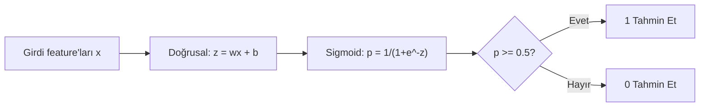
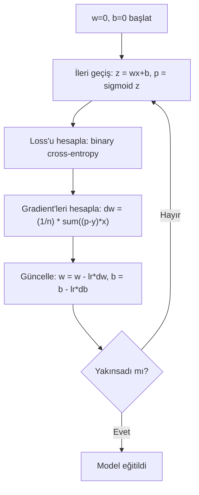

# Lojistik Regresyon

> Lojistik regresyon, evet-hayır sorularını olasılıklarla cevaplamak için düz bir çizgiyi S-eğrisine büker.

**Tür:** Yapım
**Diller:** Python
**Ön koşullar:** Faz 2 Ders 1-2 (ML Nedir, Doğrusal Regresyon)
**Süre:** ~90 dakika

## Öğrenme Hedefleri

- Sigmoid fonksiyonu ve binary cross-entropy loss kullanarak lojistik regresyonu sıfırdan uygula
- İkili sınıflandırma için precision, recall, F1 skoru ve confusion matrix'i hesapla ve yorumla
- MSE'nin sınıflandırma için neden başarısız olduğunu ve binary cross-entropy'nin neden konveks bir maliyet yüzeyi ürettiğini açıkla
- Çok-sınıflı sınıflandırma için softmax regresyon modeli inşa et ve eşik ayarlama dengelerini değerlendir

## Sorun

Boyutu verildiğinde bir tümörün kötü huylu mu yoksa iyi huylu mu olduğunu tahmin etmek istiyorsun. Doğrusal regresyonu deniyorsun. 0.3 ya da 1.7 ya da -0.5 gibi sayılar çıktısı veriyor. Bunlar ne anlama geliyor? 1.7 "çok kötü huylu" mu? -0.5 "çok iyi huylu" mu? Doğrusal regresyon sınırsız sayılar çıkarır. Sınıflandırmanın 0 ile 1 arasında sınırlı olasılıklara ve net bir karara ihtiyacı vardır: evet ya da hayır.

Lojistik regresyon bunu çözer. Aynı doğrusal kombinasyonu (wx + b) alır ve herhangi bir sayıyı (0, 1) aralığına sıkıştıran sigmoid fonksiyonundan geçirir. Çıktı bir olasılıktır. Bir eşik belirlersin (genellikle 0.5) ve karar verirsin.

Bu, pratikte en yaygın kullanılan algoritmalardan biridir. Adına rağmen lojistik regresyon, regresyon algoritması değil, sınıflandırma algoritmasıdır. Adı, kullandığı lojistik (sigmoid) fonksiyondan gelir.

## Kavram

### Doğrusal Regresyon Sınıflandırma İçin Neden Başarısız Olur

Çalışma saatlerine göre geçme/kalma (1/0) tahmin etmeyi hayal et. Doğrusal regresyon veriden bir çizgi geçirir:

```
hours:  1   2   3   4   5   6   7   8   9   10
actual: 0   0   0   0   1   1   1   1   1   1
```

Doğrusal bir uydurma, 1. saatte -0.2 ve 10. saatte 1.3 gibi tahminler üretebilir. Bu değerler olasılık değildir. 0'ın altına ve 1'in üstüne çıkarlar. Daha kötüsü, tek bir aykırı değer (50 saat çalışan biri) tüm çizgiyi sürükleyerek herkesin tahminini değiştirir.

Sınıflandırmanın şu özelliklere sahip bir fonksiyona ihtiyacı vardır:
- 0 ile 1 arasında değer çıkarsın (olasılıklar)
- Keskin bir geçiş yaratsın (bir karar sınırı)
- Sınırdan uzaktaki aykırı değerlerle bozulmasın

### Sigmoid Fonksiyonu

Sigmoid fonksiyonu tam olarak bunu yapar:

```
sigmoid(z) = 1 / (1 + e^(-z))
```

Özellikleri:
- z büyük ve pozitif olduğunda, sigmoid(z) 1'e yaklaşır
- z büyük ve negatif olduğunda, sigmoid(z) 0'a yaklaşır
- z = 0 olduğunda, sigmoid(z) = 0.5
- Çıktı her zaman 0 ile 1 arasındadır
- Fonksiyon her yerde düzgün ve türevlenebilirdir

Türev kullanışlı bir forma sahiptir: sigmoid'(z) = sigmoid(z) * (1 - sigmoid(z)). Bu, gradient hesaplamasını verimli kılar.

### Lojistik Regresyon = Doğrusal Model + Sigmoid

Model z = wx + b hesaplar (doğrusal regresyonla aynı), sonra sigmoid uygular:



p çıktısı P(y=1 | x) olarak yorumlanır, yani girdinin 1. sınıfa ait olma olasılığı. Karar sınırı wx + b = 0 olduğu yerdir, bu da sigmoid çıktısını tam olarak 0.5 yapar.

### Binary Cross-Entropy Loss

Lojistik regresyon için MSE kullanamazsın. Sigmoid ile MSE, birçok lokal minimumu olan konveks olmayan bir maliyet yüzeyi yaratır. Bunun yerine binary cross-entropy (log loss) kullan:

```
Loss = -(1/n) * sum(y * log(p) + (1-y) * log(1-p))
```

Bu neden çalışır:
- y=1 ve p 1'e yakın olduğunda: log(1) = 0, yani loss 0'a yakın (doğru, düşük maliyet)
- y=1 ve p 0'a yakın olduğunda: log(0) negatif sonsuza yaklaşır, yani loss çok büyük (yanlış, yüksek maliyet)
- y=0 ve p 0'a yakın olduğunda: log(1) = 0, yani loss 0'a yakın (doğru, düşük maliyet)
- y=0 ve p 1'e yakın olduğunda: log(0) negatif sonsuza yaklaşır, yani loss çok büyük (yanlış, yüksek maliyet)

Bu loss fonksiyonu lojistik regresyon için konvekstir ve tek bir global minimum garantiler.

### Lojistik Regresyon için Gradient Descent

Sigmoid ile binary cross-entropy için gradient'lerin temiz bir formu vardır:

```
dL/dw = (1/n) * sum((p - y) * x)
dL/db = (1/n) * sum(p - y)
```

Bunlar doğrusal regresyon gradient'leriyle aynı görünür. Fark, p = wx + b yerine p = sigmoid(wx + b) olmasıdır. Sigmoid doğrusal olmamayı getirir ama gradient güncelleme kuralı aynı kalır.



### Karar Sınırı

2B girdi (iki feature) için karar sınırı şu çizgidir:

```
w1*x1 + w2*x2 + b = 0
```

Bir taraftaki noktalar 1 olarak, diğer taraftaki noktalar 0 olarak sınıflandırılır. Lojistik regresyon her zaman doğrusal bir karar sınırı üretir. Eğri bir sınıra ihtiyacın varsa, ya polinom feature'lar eklersin ya da doğrusal olmayan bir model kullanırsın.

### Softmax ile Çok-Sınıflı Sınıflandırma

İkili lojistik regresyon iki sınıfı ele alır. k sınıf için softmax fonksiyonunu kullan:

```
softmax(z_i) = e^(z_i) / sum(e^(z_j) for all j)
```

Her sınıfın kendi ağırlık vektörü vardır. Model her sınıf için bir z_i skoru hesaplar, sonra softmax skorları toplamı 1 olan olasılıklara dönüştürür. Tahmin edilen sınıf, en yüksek olasılığa sahip olandır.

Loss fonksiyonu categorical cross-entropy olur:

```
Loss = -(1/n) * sum(sum(y_k * log(p_k)))
```

burada y_k gerçek sınıf için 1, diğerleri için 0'dır (one-hot encoding).

### Değerlendirme Metrikleri

Yalnız başına accuracy yeterli değildir. %95 negatif ve %5 pozitif olan bir veri seti için, her zaman negatif tahmin eden bir model %95 accuracy alır ama işe yaramaz.

**Confusion Matrix**:

| | Pozitif Tahmin | Negatif Tahmin |
|---|---|---|
| Gerçekte Pozitif | True Positive (TP) | False Negative (FN) |
| Gerçekte Negatif | False Positive (FP) | True Negative (TN) |

**Precision**: Tahmin edilen tüm pozitiflerden, kaçı gerçekten pozitif?
```
Precision = TP / (TP + FP)
```

**Recall** (Sensitivity): Tüm gerçek pozitiflerden, kaçını yakaladık?
```
Recall = TP / (TP + FN)
```

**F1 Skoru**: Precision ve recall'un harmonik ortalaması. Her iki metriği dengeler.
```
F1 = 2 * (Precision * Recall) / (Precision + Recall)
```

Ne zaman önceliklendirileceği:
- **Precision**: false positive'ler maliyetli olduğunda (spam filtresi, meşru e-postaları engellemek istemezsin)
- **Recall**: false negative'ler maliyetli olduğunda (kanser taraması, bir tümörü kaçırmak istemezsin)
- **F1**: tek bir dengeli metriğe ihtiyacın olduğunda

## İnşa Et

### Adım 1: Sigmoid fonksiyonu ve veri üretimi

```python
import random
import math

def sigmoid(z):
    z = max(-500, min(500, z))
    return 1.0 / (1.0 + math.exp(-z))


random.seed(42)
N = 200
X = []
y = []

for _ in range(N // 2):
    X.append([random.gauss(2, 1), random.gauss(2, 1)])
    y.append(0)

for _ in range(N // 2):
    X.append([random.gauss(5, 1), random.gauss(5, 1)])
    y.append(1)

combined = list(zip(X, y))
random.shuffle(combined)
X, y = zip(*combined)
X = list(X)
y = list(y)

print(f"Generated {N} samples (2 classes, 2 features)")
print(f"Class 0 center: (2, 2), Class 1 center: (5, 5)")
print(f"First 5 samples:")
for i in range(5):
    print(f"  Features: [{X[i][0]:.2f}, {X[i][1]:.2f}], Label: {y[i]}")
```

### Adım 2: Sıfırdan lojistik regresyon

```python
class LogisticRegression:
    def __init__(self, n_features, learning_rate=0.01):
        self.weights = [0.0] * n_features
        self.bias = 0.0
        self.lr = learning_rate
        self.loss_history = []

    def predict_proba(self, x):
        z = sum(w * xi for w, xi in zip(self.weights, x)) + self.bias
        return sigmoid(z)

    def predict(self, x, threshold=0.5):
        return 1 if self.predict_proba(x) >= threshold else 0

    def compute_loss(self, X, y):
        n = len(y)
        total = 0.0
        for i in range(n):
            p = self.predict_proba(X[i])
            p = max(1e-15, min(1 - 1e-15, p))
            total += y[i] * math.log(p) + (1 - y[i]) * math.log(1 - p)
        return -total / n

    def fit(self, X, y, epochs=1000, print_every=200):
        n = len(y)
        n_features = len(X[0])
        for epoch in range(epochs):
            dw = [0.0] * n_features
            db = 0.0
            for i in range(n):
                p = self.predict_proba(X[i])
                error = p - y[i]
                for j in range(n_features):
                    dw[j] += error * X[i][j]
                db += error
            for j in range(n_features):
                self.weights[j] -= self.lr * (dw[j] / n)
            self.bias -= self.lr * (db / n)
            loss = self.compute_loss(X, y)
            self.loss_history.append(loss)
            if epoch % print_every == 0:
                print(f"  Epoch {epoch:4d} | Loss: {loss:.4f} | w: [{self.weights[0]:.3f}, {self.weights[1]:.3f}] | b: {self.bias:.3f}")
        return self

    def accuracy(self, X, y):
        correct = sum(1 for i in range(len(y)) if self.predict(X[i]) == y[i])
        return correct / len(y)


split = int(0.8 * N)
X_train, X_test = X[:split], X[split:]
y_train, y_test = y[:split], y[split:]

print("\n=== Training Logistic Regression ===")
model = LogisticRegression(n_features=2, learning_rate=0.1)
model.fit(X_train, y_train, epochs=1000, print_every=200)

print(f"\nTrain accuracy: {model.accuracy(X_train, y_train):.4f}")
print(f"Test accuracy:  {model.accuracy(X_test, y_test):.4f}")
print(f"Weights: [{model.weights[0]:.4f}, {model.weights[1]:.4f}]")
print(f"Bias: {model.bias:.4f}")
```

### Adım 3: Sıfırdan confusion matrix ve metrikler

```python
class ClassificationMetrics:
    def __init__(self, y_true, y_pred):
        self.tp = sum(1 for t, p in zip(y_true, y_pred) if t == 1 and p == 1)
        self.tn = sum(1 for t, p in zip(y_true, y_pred) if t == 0 and p == 0)
        self.fp = sum(1 for t, p in zip(y_true, y_pred) if t == 0 and p == 1)
        self.fn = sum(1 for t, p in zip(y_true, y_pred) if t == 1 and p == 0)

    def accuracy(self):
        total = self.tp + self.tn + self.fp + self.fn
        return (self.tp + self.tn) / total if total > 0 else 0

    def precision(self):
        denom = self.tp + self.fp
        return self.tp / denom if denom > 0 else 0

    def recall(self):
        denom = self.tp + self.fn
        return self.tp / denom if denom > 0 else 0

    def f1(self):
        p = self.precision()
        r = self.recall()
        return 2 * p * r / (p + r) if (p + r) > 0 else 0

    def print_confusion_matrix(self):
        print(f"\n  Confusion Matrix:")
        print(f"                  Predicted")
        print(f"                  Pos   Neg")
        print(f"  Actual Pos     {self.tp:4d}  {self.fn:4d}")
        print(f"  Actual Neg     {self.fp:4d}  {self.tn:4d}")

    def print_report(self):
        self.print_confusion_matrix()
        print(f"\n  Accuracy:  {self.accuracy():.4f}")
        print(f"  Precision: {self.precision():.4f}")
        print(f"  Recall:    {self.recall():.4f}")
        print(f"  F1 Score:  {self.f1():.4f}")


y_pred_test = [model.predict(x) for x in X_test]
print("\n=== Classification Report (Test Set) ===")
metrics = ClassificationMetrics(y_test, y_pred_test)
metrics.print_report()
```

### Adım 4: Karar sınırı analizi

```python
print("\n=== Decision Boundary ===")
w1, w2 = model.weights
b = model.bias
print(f"Decision boundary: {w1:.4f}*x1 + {w2:.4f}*x2 + {b:.4f} = 0")
if abs(w2) > 1e-10:
    print(f"Solved for x2:     x2 = {-w1/w2:.4f}*x1 + {-b/w2:.4f}")

print("\nSample predictions near the boundary:")
test_points = [
    [3.0, 3.0],
    [3.5, 3.5],
    [4.0, 4.0],
    [2.5, 2.5],
    [5.0, 5.0],
]
for point in test_points:
    prob = model.predict_proba(point)
    pred = model.predict(point)
    print(f"  [{point[0]}, {point[1]}] -> prob={prob:.4f}, class={pred}")
```

### Adım 5: Softmax ile çok-sınıflı

```python
class SoftmaxRegression:
    def __init__(self, n_features, n_classes, learning_rate=0.01):
        self.n_features = n_features
        self.n_classes = n_classes
        self.lr = learning_rate
        self.weights = [[0.0] * n_features for _ in range(n_classes)]
        self.biases = [0.0] * n_classes

    def softmax(self, scores):
        max_score = max(scores)
        exp_scores = [math.exp(s - max_score) for s in scores]
        total = sum(exp_scores)
        return [e / total for e in exp_scores]

    def predict_proba(self, x):
        scores = [
            sum(self.weights[k][j] * x[j] for j in range(self.n_features)) + self.biases[k]
            for k in range(self.n_classes)
        ]
        return self.softmax(scores)

    def predict(self, x):
        probs = self.predict_proba(x)
        return probs.index(max(probs))

    def fit(self, X, y, epochs=1000, print_every=200):
        n = len(y)
        for epoch in range(epochs):
            grad_w = [[0.0] * self.n_features for _ in range(self.n_classes)]
            grad_b = [0.0] * self.n_classes
            total_loss = 0.0
            for i in range(n):
                probs = self.predict_proba(X[i])
                for k in range(self.n_classes):
                    target = 1.0 if y[i] == k else 0.0
                    error = probs[k] - target
                    for j in range(self.n_features):
                        grad_w[k][j] += error * X[i][j]
                    grad_b[k] += error
                true_prob = max(probs[y[i]], 1e-15)
                total_loss -= math.log(true_prob)
            for k in range(self.n_classes):
                for j in range(self.n_features):
                    self.weights[k][j] -= self.lr * (grad_w[k][j] / n)
                self.biases[k] -= self.lr * (grad_b[k] / n)
            if epoch % print_every == 0:
                print(f"  Epoch {epoch:4d} | Loss: {total_loss / n:.4f}")
        return self

    def accuracy(self, X, y):
        correct = sum(1 for i in range(len(y)) if self.predict(X[i]) == y[i])
        return correct / len(y)


random.seed(42)
X_3class = []
y_3class = []

centers = [(1, 1), (5, 1), (3, 5)]
for label, (cx, cy) in enumerate(centers):
    for _ in range(50):
        X_3class.append([random.gauss(cx, 0.8), random.gauss(cy, 0.8)])
        y_3class.append(label)

combined = list(zip(X_3class, y_3class))
random.shuffle(combined)
X_3class, y_3class = zip(*combined)
X_3class = list(X_3class)
y_3class = list(y_3class)

split_3 = int(0.8 * len(X_3class))
X_train_3 = X_3class[:split_3]
y_train_3 = y_3class[:split_3]
X_test_3 = X_3class[split_3:]
y_test_3 = y_3class[split_3:]

print("\n=== Multi-class Softmax Regression (3 classes) ===")
softmax_model = SoftmaxRegression(n_features=2, n_classes=3, learning_rate=0.1)
softmax_model.fit(X_train_3, y_train_3, epochs=1000, print_every=200)
print(f"\nTrain accuracy: {softmax_model.accuracy(X_train_3, y_train_3):.4f}")
print(f"Test accuracy:  {softmax_model.accuracy(X_test_3, y_test_3):.4f}")

print("\nSample predictions:")
for i in range(5):
    probs = softmax_model.predict_proba(X_test_3[i])
    pred = softmax_model.predict(X_test_3[i])
    print(f"  True: {y_test_3[i]}, Predicted: {pred}, Probs: [{', '.join(f'{p:.3f}' for p in probs)}]")
```

### Adım 6: Eşik ayarlama

```python
print("\n=== Threshold Tuning ===")
print("Default threshold: 0.5. Adjusting the threshold trades precision for recall.\n")

thresholds = [0.3, 0.4, 0.5, 0.6, 0.7]
print(f"{'Threshold':>10} {'Accuracy':>10} {'Precision':>10} {'Recall':>10} {'F1':>10}")
print("-" * 52)

for t in thresholds:
    y_pred_t = [1 if model.predict_proba(x) >= t else 0 for x in X_test]
    m = ClassificationMetrics(y_test, y_pred_t)
    print(f"{t:>10.1f} {m.accuracy():>10.4f} {m.precision():>10.4f} {m.recall():>10.4f} {m.f1():>10.4f}")
```

## Kullan

Şimdi aynı şeyi scikit-learn ile.

```python
from sklearn.linear_model import LogisticRegression as SklearnLR
from sklearn.metrics import accuracy_score, precision_score, recall_score, f1_score
from sklearn.metrics import confusion_matrix, classification_report
from sklearn.model_selection import train_test_split
from sklearn.preprocessing import StandardScaler
import numpy as np

np.random.seed(42)
X_0 = np.random.randn(100, 2) + [2, 2]
X_1 = np.random.randn(100, 2) + [5, 5]
X_sk = np.vstack([X_0, X_1])
y_sk = np.array([0] * 100 + [1] * 100)

X_tr, X_te, y_tr, y_te = train_test_split(X_sk, y_sk, test_size=0.2, random_state=42)

scaler = StandardScaler()
X_tr_sc = scaler.fit_transform(X_tr)
X_te_sc = scaler.transform(X_te)

lr = SklearnLR()
lr.fit(X_tr_sc, y_tr)
y_pred = lr.predict(X_te_sc)

print("=== Scikit-learn Logistic Regression ===")
print(f"Accuracy:  {accuracy_score(y_te, y_pred):.4f}")
print(f"Precision: {precision_score(y_te, y_pred):.4f}")
print(f"Recall:    {recall_score(y_te, y_pred):.4f}")
print(f"F1:        {f1_score(y_te, y_pred):.4f}")
print(f"\nConfusion Matrix:\n{confusion_matrix(y_te, y_pred)}")
print(f"\nClassification Report:\n{classification_report(y_te, y_pred)}")
```

Sıfırdan uygulamanız aynı karar sınırını ve metrikleri üretir. Scikit-learn solver seçenekleri (liblinear, lbfgs, saga), otomatik düzenleme, çok-sınıflı stratejiler (one-vs-rest, multinomial) ve sayısal kararlılık optimizasyonları ekler.

## Yayınla

Bu ders şunları üretir:
- `code/logistic_regression.py` - metriklerle birlikte sıfırdan lojistik regresyon

## Alıştırmalar

1. Doğrusal olarak ayrılabilir OLMAYAN bir veri seti üret (örn., iki iç içe geçmiş daire). Lojistik regresyonu eğit ve başarısızlığını gözlemle. Sonra polinom feature'lar ekle (x1^2, x2^2, x1*x2) ve tekrar eğit. Accuracy'nin iyileştiğini göster.
2. 3-sınıflı softmax modeli için çok-sınıflı bir confusion matrix uygula. Sınıf başına precision ve recall hesapla. Hangi sınıfı sınıflandırmak en zor?
3. Sıfırdan bir ROC eğrisi inşa et. 0'dan 1'e 100 eşik değeri için true positive rate ve false positive rate hesapla. Yamuk kuralını kullanarak AUC'yi (eğri altındaki alan) hesapla.

## Anahtar Terimler

| Terim | İnsanlar ne der | Aslında ne demek |
|------|----------------|----------------------|
| Lojistik regresyon | "Sınıflandırma için regresyon" | Sınıf olasılıkları çıkaran sigmoid fonksiyonu ile takip edilen doğrusal bir model |
| Sigmoid fonksiyonu | "S-eğrisi" | Herhangi bir reel sayıyı (0, 1) aralığına eşleyen 1/(1+e^(-z)) fonksiyonu |
| Binary cross-entropy | "Log loss" | Kendinden emin yanlış tahminleri ağır şekilde cezalandıran -[y*log(p) + (1-y)*log(1-p)] loss fonksiyonu |
| Karar sınırı | "Ayırıcı çizgi" | Modelin çıktı olasılığının 0.5'e eşit olduğu, tahmin edilen sınıfları ayıran yüzey |
| Softmax | "Çok-sınıflı sigmoid" | Bir skor vektörünü toplamı 1 olan olasılıklara dönüştüren fonksiyon |
| Precision | "Seçilenlerin kaçı ilgili" | TP / (TP + FP), pozitif tahminlerin gerçekten pozitif olan kesri |
| Recall | "İlgili olanların kaçı seçildi" | TP / (TP + FN), modelin doğru tanımladığı gerçek pozitiflerin kesri |
| F1 skoru | "Dengelenmiş accuracy" | Precision ve recall'un harmonik ortalaması: 2*P*R / (P+R) |
| Confusion matrix | "Hata dökümü" | Her sınıf çifti için TP, TN, FP, FN sayılarını gösteren tablo |
| Eşik | "Kesim noktası" | Modelin 1. sınıfı tahmin ettiği olasılık değerinin üstü (varsayılan 0.5, ayarlanabilir) |
| One-hot encoding | "Kategoriler için ikili kolonlar" | k. sınıfı, k. konumda 1 olan sıfır vektörü olarak temsil etmek |
| Categorical cross-entropy | "Çok-sınıflı log loss" | Binary cross-entropy'nin one-hot encoded etiketler kullanarak k sınıfa genişletilmesi |
