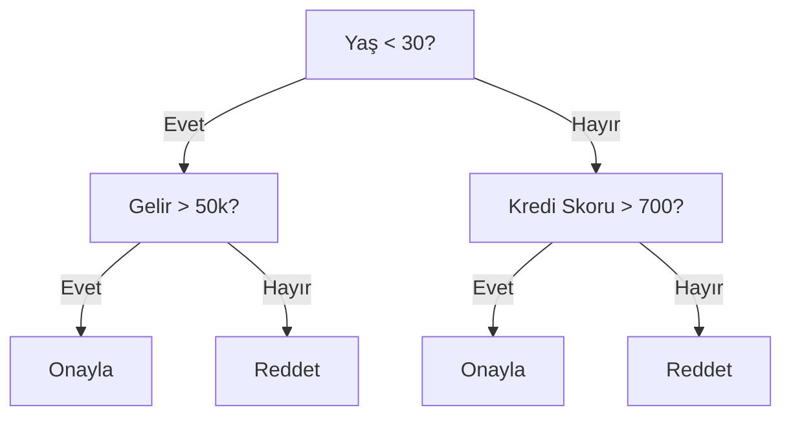
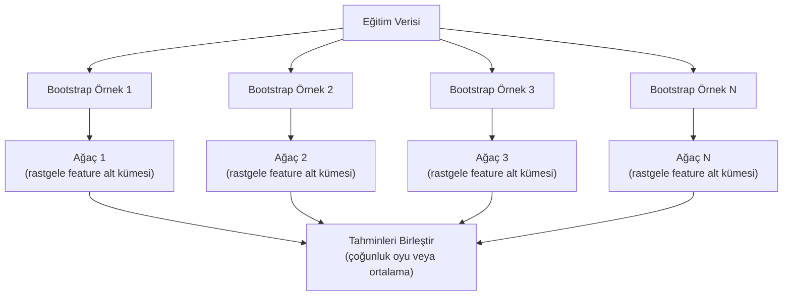

# Karar Ağaçları ve Random Forest

> Bir karar ağacı aslında bir akış şemasıdır. Ama bunlardan oluşan bir orman, ML'deki en güçlü araçlardan biridir.

**Tür:** Yapım
**Dil:** Python
**Ön koşullar:** Faz 1 (Dersler 09 Bilgi Teorisi, 06 Olasılık)
**Süre:** ~90 dakika

## Öğrenme Hedefleri

- Optimal karar ağacı bölünmelerini bulmak için Gini impurity, entropi ve information gain hesaplamalarını uygula
- Ön-budama kontrolleriyle (maksimum derinlik, minimum örnek) sıfırdan bir karar ağacı sınıflandırıcısı inşa et
- Bootstrap örneklemesi ve feature rastgeleleştirmesi kullanarak bir random forest oluştur ve neden variance'ı azalttığını açıkla
- MDI feature importance ile permutation importance'ı karşılaştır ve MDI'nın ne zaman yanlı olduğunu belirle

## Sorun

Tablolu verin var. Satırlar örnek, kolonlar feature ve tahmin etmek istediğin bir hedef kolonu var. Buna bir sinir ağı atabilirsin. Ama tablolu veride ağaç tabanlı modeller (karar ağaçları, random forest, gradient boosted ağaçlar) deep learning'i tutarlı şekilde yener. Yapılandırılmış veriyle yapılan Kaggle yarışmalarına transformer'lar değil XGBoost ve LightGBM hakimdir.

Neden? Ağaçlar karışık feature tiplerini (sayısal ve kategorik) ön işleme olmadan ele alır. Doğrusal olmayan ilişkileri feature engineering olmadan ele alır. Yorumlanabilirdirler: ağaca bakıp bir tahminin neden yapıldığını tam olarak görebilirsin. Ve birçok ağacın ortalamasını alan random forest, orta büyüklükteki veri setlerinde overfitting'e karşı son derece dirençlidir.

Bu ders, özyinelemeli bölme kullanarak sıfırdan karar ağaçları inşa eder, ardından bunun üzerine bir random forest inşa eder. Bölünme kriterleri (Gini impurity, entropi, information gain) arkasındaki matematiği uygulayacak ve neden zayıf öğrenicilerden oluşan bir ensemble'ın güçlü bir öğreniciye dönüştüğünü anlayacaksın.

## Kavram

### Bir karar ağacı ne yapar

Bir karar ağacı, feature uzayını bir dizi evet/hayır sorusu sorarak dikdörtgensel bölgelere ayırır.



Her iç node bir feature'ı bir eşiğe karşı test eder. Her yaprak node tahmin yapar. Yeni bir veri noktasını sınıflandırmak için kökten başlar ve bir yaprağa ulaşana kadar dalları takip edersin.

Ağaç, her node'da veriyi en iyi ayıran feature ve eşiği seçerek yukarıdan aşağıya inşa edilir. "En iyi", bir bölünme kriteri tarafından tanımlanır.

### Bölünme kriterleri: impurity ölçmek

Her node'da bir örnek setimiz var. Bunları, ortaya çıkan çocuk node'lar mümkün olduğunca "saf" olacak şekilde, yani her çocuk çoğunlukla tek bir sınıf içerecek şekilde bölmek istiyoruz.

**Gini impurity**, rastgele seçilen bir örneğin, o node'daki sınıf dağılımına göre etiketlendiğinde yanlış sınıflandırılma olasılığını ölçer.

```
Gini(S) = 1 - sum(p_k^2)

burada p_k, S setindeki k sınıfının oranıdır.
```

Saf bir node için (hepsi tek sınıf), Gini = 0. 50/50 sınıflı ikili bölünme için Gini = 0.5. Düşük olan daha iyidir.

```
Örnek: 6 kedi, 4 köpek

Gini = 1 - (0.6^2 + 0.4^2) = 1 - (0.36 + 0.16) = 0.48
```

**Entropi**, bir node'daki bilgi içeriğini (düzensizliği) ölçer. Faz 1 Ders 09'da işlenmiştir.

```
Entropy(S) = -sum(p_k * log2(p_k))
```

Saf bir node için entropi = 0. 50/50 ikili bölünme için entropi = 1.0. Düşük olan daha iyidir.

```
Örnek: 6 kedi, 4 köpek

Entropy = -(0.6 * log2(0.6) + 0.4 * log2(0.4))
        = -(0.6 * -0.737 + 0.4 * -1.322)
        = 0.442 + 0.529
        = 0.971 bits
```

**Information gain**, bir bölünme sonrası impurity (entropi veya Gini) azalmasıdır.

```
IG(S, feature, threshold) = Impurity(S) - weighted_avg(Impurity(S_left), Impurity(S_right))

burada ağırlıklar, her çocuktaki örneklerin oranlarıdır.
```

Her node'daki açgözlü algoritma: her feature'ı ve her olası eşiği dene. Information gain'i maksimize eden (feature, threshold) çiftini seç.

### Bölünme nasıl çalışır

Mevcut node'da n feature ve m örneği olan bir veri seti için:

1. Her j feature için (j = 1 ile n arası):
   - Örnekleri j feature'ına göre sırala
   - Ardışık farklı değerler arasındaki her orta noktayı eşik olarak dene
   - Her eşik için information gain'i hesapla
2. En yüksek information gain'e sahip feature ve eşiği seç
3. Veriyi sola (feature <= eşik) ve sağa (feature > eşik) böl
4. Her çocukta özyineleme yap

Bu açgözlü yaklaşım küresel olarak optimal ağacı garanti etmez. Optimal ağacı bulmak NP-zordur. Ama açgözlü bölünme pratikte iyi çalışır.

### Durdurma koşulları

Durdurma koşulları olmadan, ağaç her yaprak saf olana kadar büyür (yaprak başına bir örnek). Bu, eğitim verisini mükemmel şekilde ezberler ve berbat şekilde genelleştirir.

**Ön-budama**, ağaç tamamen büyümeden önce onu durdurur:
- Maksimum derinlik: ağaç belirlenen bir derinliğe ulaştığında bölünmeyi durdur
- Yaprak başına minimum örnek: bir node'un k'den az örneği varsa durdur
- Minimum information gain: en iyi bölünme impurity'yi bir eşikten daha az iyileştiriyorsa durdur
- Maksimum yaprak node sayısı: toplam yaprak sayısını sınırla

**Sonra-budama** tam ağacı büyütür, sonra geri kırpar:
- Cost-complexity budama (scikit-learn tarafından kullanılır): yaprak sayısıyla orantılı bir ceza ekler. Daha küçük ağaçlar elde etmek için cezayı artır
- Reduced error budama: doğrulama hatası artmıyorsa bir alt ağacı kaldır

Ön-budama daha basit ve daha hızlıdır. Sonra-budama genellikle daha iyi ağaçlar üretir çünkü daha sonra faydalı bölünmelere yol açabilecek bölünmeleri vaktinden önce durdurmaz.

### Regresyon için karar ağaçları

Regresyon için yaprak tahmini, o yapraktaki hedef değerlerinin ortalamasıdır. Bölünme kriteri de değişir:

**Variance reduction**, information gain'in yerini alır:

```
VR(S, feature, threshold) = Var(S) - weighted_avg(Var(S_left), Var(S_right))
```

Variance'ı en çok azaltan bölünmeyi seç. Ağaç, girdi uzayını bölgelere ayırır ve her bölgede sabit bir değer (ortalama) tahmin eder.

### Random forest: ensemble'ların gücü

Tek bir karar ağacı yüksek variance'a sahiptir. Verideki küçük değişiklikler tamamen farklı ağaçlar üretebilir. Random forest, birçok ağacın ortalamasını alarak bunu düzeltir.



İki rastgelelik kaynağı ağaçları çeşitli kılar:

**Bagging (bootstrap aggregating):** Her ağaç, eğitim verisinden yerine koyarak alınan rastgele bir örnek olan bir bootstrap örneği üzerinde eğitilir. Orijinal örneklerin yaklaşık %63'ü her bootstrap'te görünür (geri kalanlar, doğrulama için kullanılabilecek out-of-bag örnekleridir).

**Feature rastgeleleştirmesi:** Her bölünmede, sadece feature'ların rastgele bir alt kümesi değerlendirilir. Sınıflandırma için varsayılan sqrt(n_features). Regresyon için n_features/3. Bu, tüm ağaçların aynı baskın feature üzerinde bölünmesini önler.

Anahtar içgörü: birçok ilişkisiz ağacın ortalamasını almak, bias'ı artırmadan variance'ı azaltır. Her bireysel ağaç vasat olabilir. Ensemble güçlüdür.

### Feature importance

Random forest doğal olarak feature importance skorları sağlar. En yaygın yöntem:

**Mean Decrease in Impurity (MDI):** Her feature için, o feature'ın kullanıldığı tüm ağaçlardaki ve tüm node'lardaki toplam impurity azalmasını topla. Daha erken bölünmelerde daha büyük impurity azalmaları üreten feature'lar daha önemlidir.

```
importance(feature_j) = feature_j kullanılan tüm node'larda toplam:
    (n_samples_at_node / n_total_samples) * impurity_decrease
```

Bu hızlıdır (eğitim sırasında hesaplanır) ama yüksek kardinaliteli feature'lara ve birçok olası bölünme noktasına sahip feature'lara karşı yanlıdır.

**Permutation importance** alternatiftir: bir feature'ın değerlerini karıştır ve modelin accuracy'sinin ne kadar düştüğünü ölç. Daha güvenilir ama daha yavaş.

### Ağaçlar sinir ağlarını ne zaman yener

Ağaçlar ve forest'lar tablolu veride sinir ağlarına üstün gelir. Birkaç sebep:

| Faktör | Ağaçlar | Sinir ağları |
|--------|-------|----------------|
| Karışık tipler (sayısal + kategorik) | Yerel destek | Encoding gerekir |
| Küçük veri setleri (< 10k satır) | İyi çalışır | Overfit yapar |
| Feature etkileşimleri | Bölünme ile bulunur | Mimari tasarımı gerekir |
| Yorumlanabilirlik | Tam şeffaflık | Kara kutu |
| Eğitim süresi | Dakikalar | Saatler |
| Hiperparametre hassasiyeti | Düşük | Yüksek |

Sinir ağları, verinin uzamsal veya sıralı yapısı olduğunda kazanır (görüntüler, metin, ses). Düz feature tabloları için ağaçlar varsayılandır.

## İnşa Et

### Adım 1: Gini impurity ve entropi

Her iki bölünme kriterini de sıfırdan inşa et ve hangi bölünmelerin iyi olduğu konusunda anlaştıklarını doğrula.

```python
import math

def gini_impurity(labels):
    n = len(labels)
    if n == 0:
        return 0.0
    counts = {}
    for label in labels:
        counts[label] = counts.get(label, 0) + 1
    return 1.0 - sum((c / n) ** 2 for c in counts.values())

def entropy(labels):
    n = len(labels)
    if n == 0:
        return 0.0
    counts = {}
    for label in labels:
        counts[label] = counts.get(label, 0) + 1
    return -sum(
        (c / n) * math.log2(c / n) for c in counts.values() if c > 0
    )
```

### Adım 2: En iyi bölünmeyi bul

Her feature'ı ve her eşiği dene. En yüksek information gain'e sahip olanı döndür.

```python
def information_gain(parent_labels, left_labels, right_labels, criterion="gini"):
    measure = gini_impurity if criterion == "gini" else entropy
    n = len(parent_labels)
    n_left = len(left_labels)
    n_right = len(right_labels)
    if n_left == 0 or n_right == 0:
        return 0.0
    parent_impurity = measure(parent_labels)
    child_impurity = (
        (n_left / n) * measure(left_labels) +
        (n_right / n) * measure(right_labels)
    )
    return parent_impurity - child_impurity
```

### Adım 3: DecisionTree sınıfını inşa et

Özyinelemeli bölünme, tahmin ve feature importance takibi.

```python
class DecisionTree:
    def __init__(self, max_depth=None, min_samples_split=2,
                 min_samples_leaf=1, criterion="gini",
                 max_features=None):
        self.max_depth = max_depth
        self.min_samples_split = min_samples_split
        self.min_samples_leaf = min_samples_leaf
        self.criterion = criterion
        self.max_features = max_features
        self.tree = None
        self.feature_importances_ = None

    def fit(self, X, y):
        self.n_features = len(X[0])
        self.feature_importances_ = [0.0] * self.n_features
        self.n_samples = len(X)
        self.tree = self._build(X, y, depth=0)
        total = sum(self.feature_importances_)
        if total > 0:
            self.feature_importances_ = [
                fi / total for fi in self.feature_importances_
            ]

    def predict(self, X):
        return [self._predict_one(x, self.tree) for x in X]
```

### Adım 4: RandomForest sınıfını inşa et

Bootstrap örneklemesi, feature rastgeleleştirmesi ve çoğunluk oylaması.

```python
class RandomForest:
    def __init__(self, n_trees=100, max_depth=None,
                 min_samples_split=2, max_features="sqrt",
                 criterion="gini"):
        self.n_trees = n_trees
        self.max_depth = max_depth
        self.min_samples_split = min_samples_split
        self.max_features = max_features
        self.criterion = criterion
        self.trees = []

    def fit(self, X, y):
        n = len(X)
        for _ in range(self.n_trees):
            indices = [random.randint(0, n - 1) for _ in range(n)]
            X_boot = [X[i] for i in indices]
            y_boot = [y[i] for i in indices]
            tree = DecisionTree(
                max_depth=self.max_depth,
                min_samples_split=self.min_samples_split,
                max_features=self.max_features,
                criterion=self.criterion,
            )
            tree.fit(X_boot, y_boot)
            self.trees.append(tree)

    def predict(self, X):
        all_preds = [tree.predict(X) for tree in self.trees]
        predictions = []
        for i in range(len(X)):
            votes = {}
            for preds in all_preds:
                v = preds[i]
                votes[v] = votes.get(v, 0) + 1
            predictions.append(max(votes, key=votes.get))
        return predictions
```

Tüm yardımcı metotlarla birlikte tam uygulama için `code/trees.py`'a bak.

## Kullan

scikit-learn ile bir random forest eğitmek üç satırdır:

```python
from sklearn.ensemble import RandomForestClassifier
from sklearn.datasets import load_iris
from sklearn.model_selection import train_test_split

X, y = load_iris(return_X_y=True)
X_train, X_test, y_train, y_test = train_test_split(X, y, random_state=42)

rf = RandomForestClassifier(n_estimators=100, random_state=42)
rf.fit(X_train, y_train)
print(f"Accuracy: {rf.score(X_test, y_test):.4f}")
print(f"Feature importances: {rf.feature_importances_}")
```

Pratikte, gradient boosted ağaçlar (XGBoost, LightGBM, CatBoost) genellikle random forest'lardan daha güçlüdür çünkü her ağaç bir öncekinin hatalarını düzelterek ağaçları sıralı olarak inşa ederler. Ama random forest'ları yanlış yapılandırmak daha zordur ve neredeyse hiç hiperparametre ayarlaması gerektirmezler.

## Yayınla

Bu ders `outputs/prompt-tree-interpreter.md` üretir -- iş paydaşları için karar ağacı bölünmelerini yorumlayan bir prompt. Ona eğitilmiş bir ağacın yapısını besle (derinlik, feature'lar, bölünme eşikleri, accuracy) ve modeli sade dildeki kurallara çevirir, feature importance'ı sıralar, overfitting veya leakage'ı işaret eder ve sonraki adımları önerir. Ağaç tabanlı bir modeli kod okumayan birine açıklamak istediğinde kullan.

## Alıştırmalar

1. 3 sınıflı 2B bir veri seti üzerinde tek bir karar ağacı eğit. Bölünmeleri elle takip et ve dikdörtgensel karar sınırlarını çiz. max_depth=2 ile max_depth=10'daki sınırları karşılaştır.

2. Regresyon ağaçları için variance reduction bölünmesini uygula. 200 nokta için y = sin(x) + noise üret ve regresyon ağacını uydur. Ağacın parça parça sabit tahminlerini gerçek eğriye karşı çiz.

3. 1, 5, 10, 50 ve 200 ağaçlı bir random forest inşa et. Ağaç sayısına karşı eğitim accuracy ve test accuracy çiz. Test accuracy'nin platoya ulaştığını ama düşmediğini gözlemle (forest'lar overfitting'e direnir).

4. 5 farklı veri seti üzerinde Gini impurity ile entropiyi bölünme kriterleri olarak karşılaştır. Accuracy ve ağaç derinliğini ölç. Çoğu durumda neredeyse aynı sonuçları üretirler. Nedenini açıkla.

5. Permutation importance'ı uygula. Bir feature'ın rastgele gürültü olduğu ama yüksek kardinaliteye sahip olduğu bir veri setinde MDI importance ile karşılaştır. MDI gürültü feature'ını yüksek sıralayacaktır. Permutation importance sıralamayacaktır.

## Anahtar Terimler

| Terim | İnsanlar ne der | Aslında ne demek |
|------|----------------|----------------------|
| Karar ağacı | "Tahminler için akış şeması" | Bir dizi if/else bölünmesi öğrenerek feature uzayını dikdörtgensel bölgelere ayıran model |
| Gini impurity | "Node'un ne kadar karışık olduğu" | Bir node'da rastgele bir örneği yanlış sınıflandırma olasılığı. 0 = saf, 0.5 = ikili için maksimum impurity |
| Entropi | "Node'daki düzensizlik" | Bir node'daki bilgi içeriği. 0 = saf, 1.0 = ikili için maksimum belirsizlik. Bilgi teorisinden |
| Information gain | "Bir bölünmenin ne kadar iyi olduğu" | Bir bölünmeden sonraki impurity azalması. Bölünmeleri seçmek için açgözlü kriter |
| Ön-budama | "Ağacı erken durdur" | Maksimum derinlik, minimum örnek veya minimum gain eşikleri belirleyerek ağaç büyümesini erken durdurmak |
| Sonra-budama | "Sonradan ağacı buda" | Tam ağacı büyütmek, sonra doğrulama performansını iyileştirmeyen alt ağaçları kaldırmak |
| Bagging | "Rastgele alt kümelerde eğit" | Bootstrap aggregating. Her modeli yerine koyarak alınan farklı rastgele bir örnek üzerinde eğit |
| Random forest | "Bir grup ağaç" | Her biri bootstrap örneği üzerinde, her bölünmede rastgele feature alt kümeleriyle eğitilmiş karar ağaçlarının ensemble'ı |
| Feature importance (MDI) | "Hangi feature'lar önemli" | Her feature tarafından katkıda bulunulan, tüm ağaçlar ve node'lar boyunca toplanan toplam impurity azalması |
| Permutation importance | "Karıştır ve kontrol et" | Bir feature'ın değerleri rastgele karıştırıldığında accuracy düşüşü. Gürültülü feature'lar için MDI'dan daha güvenilir |
| Variance reduction | "Information gain'in regresyon versiyonu" | Information gain'in regresyon ağacı analoğu. Hedef variance'ını en çok azaltan bölünmeyi seçer |
| Bootstrap örnek | "Tekrarlı rastgele örnek" | Orijinal veri setinden yerine koyarak alınan rastgele bir örnek. Aynı boyutta ama kopyalarla |

## Daha Fazla Okuma

- [Breiman: Random Forests (2001)](https://link.springer.com/article/10.1023/A:1010933404324) - orijinal random forest makalesi
- [Grinsztajn et al.: Why do tree-based models still outperform deep learning on tabular data? (2022)](https://arxiv.org/abs/2207.08815) - tablolu görevlerde ağaçların sinir ağlarına karşı titiz karşılaştırması
- [scikit-learn Decision Trees documentation](https://scikit-learn.org/stable/modules/tree.html) - görselleştirme araçlarıyla pratik kılavuz
- [XGBoost: A Scalable Tree Boosting System (Chen & Guestrin, 2016)](https://arxiv.org/abs/1603.02754) - Kaggle'a hakim olan gradient boosting makalesi
