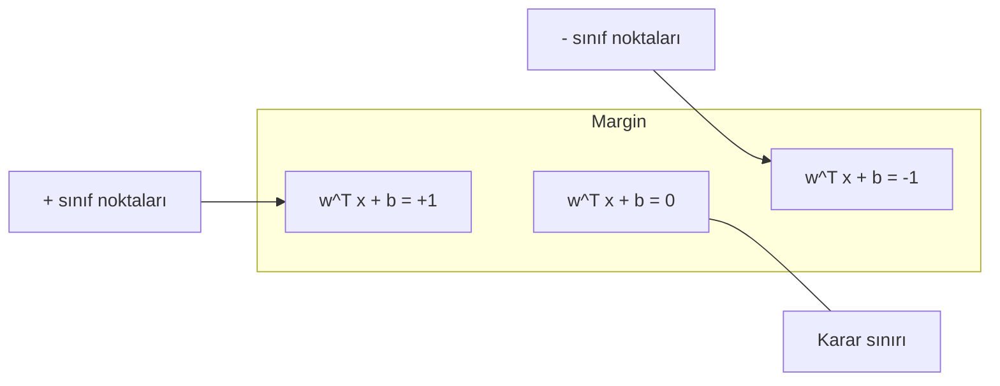
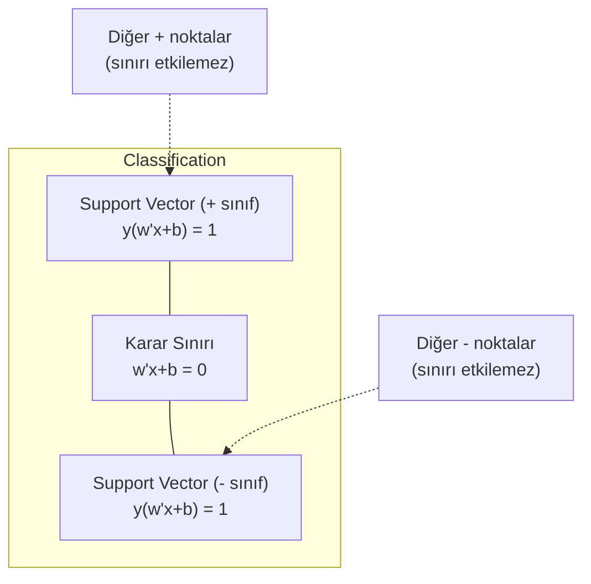
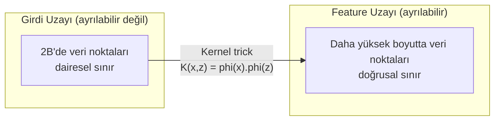

# Support Vector Machine

> İki sınıf arasındaki en geniş caddeyi bul. Tüm fikir bu.

**Tür:** Yapım
**Dil:** Python
**Ön koşullar:** Faz 1 (Dersler 08 Optimizasyon, 14 Normlar ve Mesafeler, 18 Konveks Optimizasyon)
**Süre:** ~90 dakika

## Öğrenme Hedefleri

- Hinge loss ve primal formülasyonda gradient descent kullanarak sıfırdan bir doğrusal SVM uygula
- Maksimum margin ilkesini açıkla ve eğitilmiş bir modelden support vector'leri belirle
- Doğrusal, polinom ve RBF kernellerini karşılaştır ve kernel trick'inin açık yüksek boyutlu eşlemeyi nasıl önlediğini açıkla
- C parametresi tarafından kontrol edilen margin genişliği ile sınıflandırma hataları arasındaki dengeyi değerlendir

## Sorun

İki sınıf veri noktan var ve aralarını ayıran bir çizgi (veya hiperdüzlem) çizmen gerekiyor. Sonsuz sayıda çizgi işe yarayabilir. Hangisini seçmelisin?

En büyük margin'e sahip olanı. Margin, karar sınırı ile her iki taraftaki en yakın veri noktaları arasındaki mesafedir. Daha geniş bir margin, sınıflandırıcının daha kendinden emin olduğu ve görülmemiş veriye daha iyi genelleştirdiği anlamına gelir.

Bu sezgi, ML'deki en matematiksel olarak zarif algoritmalardan biri olan Support Vector Machine'lere götürür. SVM'ler deep learning öncesinde baskın sınıflandırma yöntemiydi ve küçük veri setleri, yüksek boyutlu veri ve teorik garantilerle prensipli, iyi anlaşılmış bir modele ihtiyaç duyduğun problemler için en iyi seçim olmaya devam ediyorlar.

SVM'ler Faz 1 ile doğrudan bağlantılıdır: optimizasyon konvekstir (Ders 18), margin normlarla ölçülür (Ders 14) ve kernel trick'i hiç yüksek boyutlu uzayda hesaplama yapmadan doğrusal olmayan sınırları ele almak için iç çarpımları kullanır.

## Kavram

### Maksimum margin sınıflandırıcı

y_i {-1, +1} içinde olan etiketler ve x_i feature vektörleriyle doğrusal olarak ayrılabilir veri verildiğinde, sınıfları ayıran w^T x + b = 0 hiperdüzlemini istiyoruz.

Bir x_i noktasının hiperdüzleme uzaklığı:

```
distance = |w^T x_i + b| / ||w||
```

Doğru sınıflandırılmış bir nokta için: y_i * (w^T x_i + b) > 0. Margin, hiperdüzlemden her iki taraftaki en yakın noktaya olan mesafenin iki katıdır.



Optimizasyon problemi:

```
maximize    2 / ||w||     (margin genişliği)
subject to  y_i * (w^T x_i + b) >= 1  her i için
```

Eşdeğer olarak (||w||^2 minimize etmek daha kolay):

```
minimize    (1/2) ||w||^2
subject to  y_i * (w^T x_i + b) >= 1  her i için
```

Bu bir konveks kuadratik programdır. Benzersiz bir küresel çözümü vardır. Margin sınırlarında tam olarak oturan veri noktaları (y_i * (w^T x_i + b) = 1 olduğu yerler) support vector'lerdir. Karar sınırını belirleyen tek noktalardır. Support vector olmayan bir noktayı taşı veya kaldır, sınır değişmez.

### Support vector'ler: kritik birkaç nokta



Eğitim noktalarının çoğu önemsizdir. Sadece support vector'ler önemlidir. SVM'lerin tahmin zamanında bellek-verimli olmasının nedeni budur: tüm eğitim setini değil, sadece support vector'leri saklaman yeterlidir.

Support vector sayısı ayrıca genelleştirme hatası üzerinde bir sınır verir. Veri seti boyutuna göre daha az support vector daha iyi genelleştirme anlamına gelir.

### Soft margin: C parametresiyle gürültüyü ele alma

Gerçek veri nadiren mükemmel şekilde ayrılabilir. Bazı noktalar sınırın yanlış tarafında olabilir veya margin'in içinde olabilir. Soft margin formülasyonu, slack değişkenleri ekleyerek ihlallere izin verir.

```
minimize    (1/2) ||w||^2 + C * sum(xi_i)
subject to  y_i * (w^T x_i + b) >= 1 - xi_i
            xi_i >= 0  her i için
```

xi_i slack değişkeni, i noktasının margin'i ne kadar ihlal ettiğini ölçer. C dengeyi kontrol eder:

| C değeri | Davranış |
|---------|----------|
| Büyük C | İhlalleri ağır cezalandırır. Dar margin, daha az yanlış sınıflandırma. Overfit yapar |
| Küçük C | Daha fazla ihlale izin verir. Geniş margin, daha fazla yanlış sınıflandırma. Underfit yapar |

C, ters çevrilmiş düzenleme gücüdür. Büyük C = az düzenleme. Küçük C = daha fazla düzenleme.

### Hinge loss: SVM loss fonksiyonu

Soft margin SVM, kısıtsız bir optimizasyon olarak yeniden yazılabilir:

```
minimize    (1/2) ||w||^2 + C * sum(max(0, 1 - y_i * (w^T x_i + b)))
```

max(0, 1 - y_i * f(x_i)) terimi hinge loss'tur. Nokta doğru sınıflandırıldığında ve margin'in dışında olduğunda sıfırdır. Nokta margin'in içindeyken veya yanlış sınıflandırıldığında doğrusaldır.

```
Tek bir nokta için hinge loss:

loss
  |
  | \
  |  \
  |   \
  |    \
  |     \_______________
  |
  +-----|-----|-------->  y * f(x)
       0     1

y*f(x) >= 1 olduğunda (doğru sınıflandırılmış, margin'in dışında) sıfır loss.
y*f(x) < 1 olduğunda doğrusal ceza.
```

Lojistik loss (lojistik regresyon) ile karşılaştır:

```
Hinge:     max(0, 1 - y*f(x))          Margin'de sert kesim
Logistic:  log(1 + exp(-y*f(x)))        Düzgün, hiç tam olarak sıfır değil
```

Hinge loss seyrek çözümler üretir (sadece support vector'lerin sıfırdan farklı katkısı olur). Lojistik loss tüm veri noktalarını kullanır. Bu, SVM'leri tahmin zamanında daha bellek-verimli kılar.

### Gradient descent ile doğrusal SVM eğitimi

Kısıtlı QP'yi çözmeden, hinge loss artı L2 düzenlemesi üzerinde gradient descent kullanarak bir doğrusal SVM eğitebilirsin:

```
L(w, b) = (lambda/2) * ||w||^2 + (1/n) * sum(max(0, 1 - y_i * (w^T x_i + b)))

w'ye göre gradient:
  Eğer y_i * (w^T x_i + b) >= 1:  dL/dw = lambda * w
  Eğer y_i * (w^T x_i + b) < 1:   dL/dw = lambda * w - y_i * x_i

b'ye göre gradient:
  Eğer y_i * (w^T x_i + b) >= 1:  dL/db = 0
  Eğer y_i * (w^T x_i + b) < 1:   dL/db = -y_i
```

Buna primal formülasyon denir. Epoch başına O(n * d) çalışır; burada n örnek sayısı ve d feature sayısıdır. Büyük, seyrek, yüksek boyutlu veri için (metin sınıflandırması), bu hızlıdır.

### Dual formülasyon ve kernel trick

SVM probleminin Lagrange dual'i (Faz 1 Ders 18, KKT koşullarından):

```
maximize    sum(alpha_i) - (1/2) * sum_ij(alpha_i * alpha_j * y_i * y_j * (x_i . x_j))
subject to  0 <= alpha_i <= C
            sum(alpha_i * y_i) = 0
```

Dual sadece veri noktaları arasındaki x_i . x_j iç çarpımlarını içerir. Anahtar içgörü budur. Her iç çarpımı bir K(x_i, x_j) kernel fonksiyonuyla değiştir, SVM dönüşümü hiç açıkça hesaplamadan doğrusal olmayan sınırlar öğrenebilir.

```
Doğrusal kernel:      K(x, z) = x . z
Polinom kernel:       K(x, z) = (x . z + c)^d
RBF (Gaussian):       K(x, z) = exp(-gamma * ||x - z||^2)
```

RBF kernel veriyi sonsuz boyutlu bir uzaya eşler. Girdi uzayında yakın olan noktaların kernel değeri 1'e yakındır. Uzak olan noktaların kernel değeri 0'a yakındır. Herhangi bir düzgün karar sınırını öğrenebilir.



Kernel trick, yüksek boyutlu uzaydaki iç çarpımı oraya hiç gitmeden hesaplar. D boyutlu d. dereceden polinom kernel için, açık feature uzayı O(D^d) boyutlara sahiptir. Ama K(x, z) O(D) zamanda hesaplanır.

### Regresyon için SVM (SVR)

Support Vector Regression, veri etrafında epsilon genişliğinde bir tüp uydurur. Tüpün içindeki noktaların loss'u sıfırdır. Tüpün dışındaki noktalar doğrusal olarak cezalandırılır.

```
minimize    (1/2) ||w||^2 + C * sum(xi_i + xi_i*)
subject to  y_i - (w^T x_i + b) <= epsilon + xi_i
            (w^T x_i + b) - y_i <= epsilon + xi_i*
            xi_i, xi_i* >= 0
```

Epsilon parametresi tüp genişliğini kontrol eder. Daha geniş tüp = daha az support vector = daha düzgün uyum. Daha dar tüp = daha fazla support vector = daha sıkı uyum.

### SVM'ler neden deep learning'e yenildi (ve hâlâ ne zaman kazanıyorlar)

SVM'ler 1990'ların sonundan 2010'ların başına kadar ML'e hakimdi. Deep learning birkaç nedenle onları geçti:

| Faktör | SVM'ler | Deep learning |
|--------|------|---------------|
| Feature engineering | Gerektirir | Feature'ları öğrenir |
| Ölçeklenebilirlik | Kernel için O(n^2) ile O(n^3) | SGD ile epoch başına O(n) |
| Görüntü/metin/ses | El yapımı feature gerektirir | Ham veriden öğrenir |
| Büyük veri setleri (>100k) | Yavaş | İyi ölçeklenir |
| GPU hızlandırma | Sınırlı fayda | Devasa hızlanma |

SVM'ler hâlâ şu durumlarda kazanır:
- Küçük veri setleri (yüzlerce ile düşük binler arası örnek)
- Yüksek boyutlu seyrek veri (TF-IDF feature'lı metin)
- Matematiksel garantilere ihtiyacın olduğunda (margin sınırları)
- Eğitim süresi minimum olmalıysa (doğrusal SVM çok hızlıdır)
- Net margin yapısı olan ikili sınıflandırma
- Anomali tespiti (one-class SVM)

## İnşa Et

### Adım 1: Hinge loss ve gradient

Temel. Bir batch için hinge loss'u ve gradient'ini hesapla.

```python
def hinge_loss(X, y, w, b):
    n = len(X)
    total_loss = 0.0
    for i in range(n):
        margin = y[i] * (dot(w, X[i]) + b)
        total_loss += max(0.0, 1.0 - margin)
    return total_loss / n
```

### Adım 2: Gradient descent ile doğrusal SVM

Düzenlenmiş hinge loss'u minimize ederek eğit. QP solver gerekmez.

```python
class LinearSVM:
    def __init__(self, lr=0.001, lambda_param=0.01, n_epochs=1000):
        self.lr = lr
        self.lambda_param = lambda_param
        self.n_epochs = n_epochs
        self.w = None
        self.b = 0.0

    def fit(self, X, y):
        n_features = len(X[0])
        self.w = [0.0] * n_features
        self.b = 0.0

        for epoch in range(self.n_epochs):
            for i in range(len(X)):
                margin = y[i] * (dot(self.w, X[i]) + self.b)
                if margin >= 1:
                    self.w = [wj - self.lr * self.lambda_param * wj
                              for wj in self.w]
                else:
                    self.w = [wj - self.lr * (self.lambda_param * wj - y[i] * X[i][j])
                              for j, wj in enumerate(self.w)]
                    self.b -= self.lr * (-y[i])

    def predict(self, X):
        return [1 if dot(self.w, x) + self.b >= 0 else -1 for x in X]
```

### Adım 3: Kernel fonksiyonları

Doğrusal, polinom ve RBF kernel'leri uygula.

```python
def linear_kernel(x, z):
    return dot(x, z)

def polynomial_kernel(x, z, degree=3, c=1.0):
    return (dot(x, z) + c) ** degree

def rbf_kernel(x, z, gamma=0.5):
    diff = [xi - zi for xi, zi in zip(x, z)]
    return math.exp(-gamma * dot(diff, diff))
```

### Adım 4: Margin ve support vector belirleme

Eğitimden sonra, hangi noktaların support vector olduğunu belirle ve margin genişliğini hesapla.

```python
def find_support_vectors(X, y, w, b, tol=1e-3):
    support_vectors = []
    for i in range(len(X)):
        margin = y[i] * (dot(w, X[i]) + b)
        if abs(margin - 1.0) < tol:
            support_vectors.append(i)
    return support_vectors
```

Tüm demolarla birlikte tam uygulama için `code/svm.py`'a bak.

## Kullan

scikit-learn ile:

```python
from sklearn.svm import SVC, LinearSVC, SVR
from sklearn.preprocessing import StandardScaler
from sklearn.pipeline import Pipeline

clf = Pipeline([
    ("scaler", StandardScaler()),
    ("svm", SVC(kernel="rbf", C=1.0, gamma="scale")),
])
clf.fit(X_train, y_train)
print(f"Accuracy: {clf.score(X_test, y_test):.4f}")
print(f"Support vectors: {clf['svm'].n_support_}")
```

Önemli: bir SVM eğitmeden önce feature'larını her zaman ölçekle. SVM'ler feature büyüklüklerine duyarlıdır çünkü margin ||w||'ye bağlıdır ve ölçeklenmemiş feature'lar geometriyi bozar.

Büyük veri setleri için, `SVC` (dual formülasyon, O(n^2) ile O(n^3)) yerine `LinearSVC` (primal formülasyon, epoch başına O(n)) kullan:

```python
from sklearn.svm import LinearSVC

clf = Pipeline([
    ("scaler", StandardScaler()),
    ("svm", LinearSVC(C=1.0, max_iter=10000)),
])
```

## Alıştırmalar

1. 2B doğrusal olarak ayrılabilir bir veri seti üret. LinearSVM'ini eğit ve support vector'leri belirle. Support vector'lerin karar sınırına en yakın noktalar olduğunu doğrula.

2. Gürültülü bir veri seti üzerinde C'yi 0.001'den 1000'e değiştir. Her C değeri için karar sınırını çiz. Geniş margin'den (underfitting) dar margin'e (overfitting) geçişi gözlemle.

3. Sınıf sınırlarının dairesel olduğu (doğrusal olmayan) bir veri seti yarat. Doğrusal SVM'in başarısız olduğunu göster. RBF kernel matrisini hesapla ve sınıfların kernel-kaynaklı feature uzayında ayrılabilir hale geldiğini göster.

4. Aynı veri seti üzerinde hinge loss ile lojistik loss'u karşılaştır. Bir doğrusal SVM ve lojistik regresyon eğit. Her modelin karar sınırına kaç eğitim noktasının katkıda bulunduğunu say (support vector'ler ile tüm noktalar).

5. SVR'yi uygula (epsilon-duyarsız loss). y = sin(x) + noise'a uydur. Tahminler etrafındaki epsilon tüpünü çiz ve support vector'leri (tüpün dışındaki noktalar) vurgula.

## Anahtar Terimler

| Terim | Aslında ne demek |
|------|----------------------|
| Support vector'ler | Karar sınırına en yakın eğitim noktaları. Hiperdüzlemi belirleyen tek noktalar |
| Margin | Karar sınırı ile en yakın support vector'ler arasındaki mesafe. SVM'ler bunu maksimize eder |
| Hinge loss | max(0, 1 - y*f(x)). Doğru sınıflandırılmış ve margin'in dışında olduğunda sıfır. Aksi takdirde doğrusal ceza |
| C parametresi | Margin genişliği ile sınıflandırma hataları arasındaki denge. Büyük C = dar margin, küçük C = geniş margin |
| Soft margin | Slack değişkenleri yoluyla margin ihlallerine izin veren SVM formülasyonu. Ayrılamaz veriyi ele alır |
| Kernel trick | Yüksek boyutlu bir feature uzayındaki iç çarpımları, o uzaya açıkça eşlemeden hesaplamak |
| Doğrusal kernel | K(x, z) = x . z. Standart iç çarpıma eşdeğer. Doğrusal olarak ayrılabilir veri için |
| RBF kernel | K(x, z) = exp(-gamma * \|\|x-z\|\|^2). Sonsuz boyutlara eşler. Herhangi bir düzgün sınırı öğrenir |
| Polinom kernel | K(x, z) = (x . z + c)^d. Polinom kombinasyonlardan oluşan bir feature uzayına eşler |
| Dual formülasyon | SVM probleminin sadece veri noktaları arasındaki iç çarpımlara bağlı yeniden formülasyonu. Kernel'leri mümkün kılar |
| SVR | Support Vector Regression. Veri etrafında bir epsilon-tüp uydurur. Tüpün içindeki noktalar sıfır loss'a sahip |
| Slack değişkenleri | xi_i: bir noktanın margin'i ne kadar ihlal ettiğini ölçer. Margin'in dışında doğru sınıflandırılmış noktalar için sıfır |
| Maksimum margin | Her sınıfın en yakın noktalarına olan mesafeyi maksimize eden hiperdüzlemi seçme ilkesi |

## Daha Fazla Okuma

- [Vapnik: The Nature of Statistical Learning Theory (1995)](https://link.springer.com/book/10.1007/978-1-4757-3264-1) - SVM'ler ve istatistiksel öğrenme üzerine temel metin
- [Cortes & Vapnik: Support-vector networks (1995)](https://link.springer.com/article/10.1007/BF00994018) - orijinal SVM makalesi
- [Platt: Sequential Minimal Optimization (1998)](https://www.microsoft.com/en-us/research/publication/sequential-minimal-optimization-a-fast-algorithm-for-training-support-vector-machines/) - SVM eğitimini pratik kılan SMO algoritması
- [scikit-learn SVM documentation](https://scikit-learn.org/stable/modules/svm.html) - uygulama detaylarıyla pratik kılavuz
- [LIBSVM: A Library for Support Vector Machines](https://www.csie.ntu.edu.tw/~cjlin/libsvm/) - çoğu SVM uygulamasının arkasındaki C++ kütüphanesi
