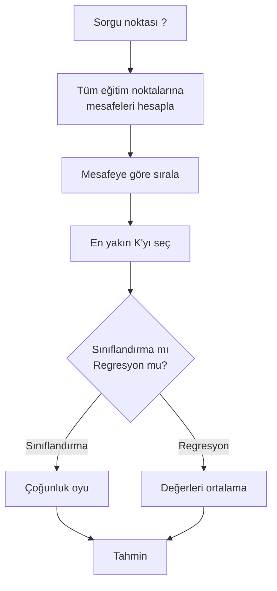
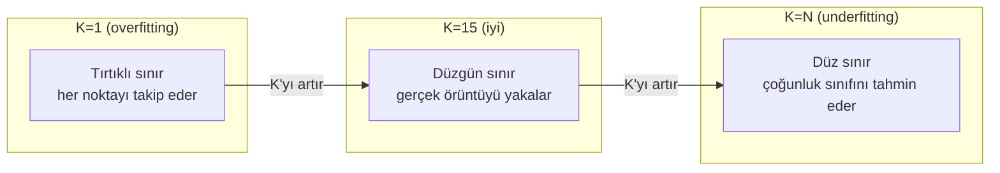
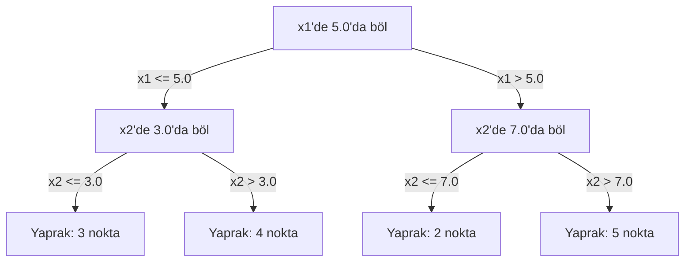

# K-En Yakın Komşu ve Mesafeler

> Her şeyi sakla. Komşularına bakarak tahmin et. Gerçekten çalışan en basit algoritma.

**Tür:** Yapım
**Dil:** Python
**Ön koşullar:** Faz 1 (Ders 14 Normlar ve Mesafeler)
**Süre:** ~90 dakika

## Öğrenme Hedefleri

- Yapılandırılabilir K ve mesafe-ağırlıklı oylama ile sıfırdan KNN sınıflandırma ve regresyon uygula
- L1, L2, cosine ve Minkowski mesafe metriklerini karşılaştır ve verilen bir veri tipi için uygun olanı seç
- Boyut lanetini açıkla ve KNN'nin yüksek boyutlu uzaylarda neden bozulduğunu göster
- Verimli en yakın komşu araması için bir KD-tree inşa et ve brute-force'tan ne zaman daha iyi olduğunu analiz et

## Sorun

Bir veri setin var. Yeni bir veri noktası geliyor. Onu sınıflandırman veya değerini tahmin etmen gerekiyor. Veriden parametreler öğrenmek yerine (doğrusal regresyon veya SVM'ler gibi), yeni noktaya en yakın K eğitim noktasını bulup oylama yapmasına izin veriyorsun.

Bu K-en yakın komşudur. Eğitim aşaması yoktur. Öğrenilecek parametre yoktur. Minimize edilecek loss fonksiyonu yoktur. Tüm eğitim setini saklarsın ve tahmin zamanında mesafeleri hesaplarsın.

İşe yaramayacak kadar basit gibi geliyor. Ama KNN birçok problem için, özellikle küçük ve orta boy veri setlerinde şaşırtıcı şekilde rekabetçidir ve onu derinlemesine anlamak temel kavramları ortaya çıkarır: mesafe metriği seçimi (Faz 1 Ders 14'e bağlanır), boyut laneti ve lazy ile eager öğrenme arasındaki fark.

KNN ayrıca modern yapay zekada her yerde, sadece farklı isimler altında ortaya çıkar. Vektör veritabanları embedding'ler üzerinde KNN araması yapar. Retrieval-augmented generation (RAG), K en yakın doküman parçasını bulur. Öneri sistemleri benzer kullanıcılar veya öğeler bulur. Algoritma aynıdır. Ölçek ve veri yapıları farklıdır.

## Kavram

### KNN nasıl çalışır

Etiketli noktalardan oluşan bir veri seti ve yeni bir sorgu noktası verildiğinde:

1. Sorgudan veri setindeki her noktaya olan mesafeyi hesapla
2. Mesafeye göre sırala
3. En yakın K noktayı al
4. Sınıflandırma için: K komşu arasında çoğunluk oyu
5. Regresyon için: K komşunun değerlerinin ortalaması (veya ağırlıklı ortalaması)



Tüm algoritma bu kadar. Uyumlama yok. Gradient descent yok. Epoch yok.

### K seçimi

K tek hiperparametredir. Bias-variance dengesini kontrol eder:

| K | Davranış |
|---|----------|
| K = 1 | Karar sınırı her noktayı takip eder. Sıfır eğitim hatası. Yüksek variance. Overfit yapar |
| Küçük K (3-5) | Yerel yapıya duyarlı. Karmaşık sınırları yakalayabilir |
| Büyük K | Daha düzgün sınırlar. Gürültüye karşı daha dayanıklı. Underfit yapabilir |
| K = N | Her nokta için çoğunluk sınıfını tahmin eder. Maksimum bias |

Ortak bir başlangıç noktası, N noktalı bir veri seti için K = sqrt(N)'dir. Berabere kalmaktan kaçınmak için ikili sınıflandırma için tek sayılı K kullan.



### Mesafe metrikleri

Mesafe fonksiyonu "yakın"ın ne anlama geldiğini tanımlar. Farklı metrikler farklı komşular, farklı tahminler üretir.

**L2 (Öklid)** varsayılandır. Düz çizgi mesafesi.

```
d(a, b) = sqrt(sum((a_i - b_i)^2))
```

Feature ölçeğine duyarlıdır. KNN ile L2 kullanmadan önce her zaman feature'ları standardize et.

**L1 (Manhattan)** mutlak farkları toplar. L2'ye göre aykırı değerlere karşı daha dayanıklıdır çünkü farkları karelemez.

```
d(a, b) = sum(|a_i - b_i|)
```

**Cosine mesafesi** büyüklüğü göz ardı ederek vektörler arasındaki açıyı ölçer. Metin ve embedding verileri için gereklidir.

```
d(a, b) = 1 - (a . b) / (||a|| * ||b||)
```

**Minkowski** L1 ve L2'yi p parametresi ile genelleştirir.

```
d(a, b) = (sum(|a_i - b_i|^p))^(1/p)

p=1: Manhattan
p=2: Öklid
p->inf: Chebyshev (maksimum mutlak fark)
```

Hangi metriği kullanacağın veriye bağlıdır:

| Veri tipi | En iyi metrik | Neden |
|-----------|------------|-----|
| Benzer ölçekli sayısal feature'lar | L2 (Öklid) | Varsayılan, uzamsal veri için çalışır |
| Aykırı değerli sayısal feature'lar | L1 (Manhattan) | Dayanıklı, büyük farkları büyütmez |
| Metin embedding'leri | Cosine | Büyüklük gürültüdür, yön anlamdır |
| Yüksek boyutlu seyrek | Cosine veya L1 | L2 boyut lanetinden muzdarip |
| Karışık tipler | Özel mesafe | Feature tipine göre metrikleri birleştir |

### Ağırlıklı KNN

Standart KNN, tüm K komşuya eşit ağırlık verir. Ama 0.1 mesafesindeki bir komşu, 5.0 mesafesindekinden daha fazla önemli olmalı.

**Mesafe-ağırlıklı KNN** her komşuyu mesafeye göre ters ağırlıklandırır:

```
weight_i = 1 / (distance_i + epsilon)

Sınıflandırma için: ağırlıklı oy
Regresyon için:     ağırlıklı ortalama = sum(w_i * y_i) / sum(w_i)
```

Epsilon, sorgu noktası tam olarak bir eğitim noktasıyla eşleştiğinde sıfıra bölmeyi önler.

Ağırlıklı KNN, K seçimine daha az duyarlıdır çünkü uzak komşular zaten çok az katkıda bulunur.

### Boyut laneti

KNN performansı yüksek boyutlarda bozulur. Bu belirsiz bir endişe değildir. Matematiksel bir gerçektir.

**Problem 1: mesafeler yakınsar.** Boyut arttıkça, maksimum mesafe ile minimum mesafe oranı 1'e yaklaşır. Tüm noktalar sorguya eşit ölçüde "uzak" olur.

```
d boyutta, rastgele üniform noktalar için:

d=2:    max_dist / min_dist = geniş aralıkta değişir
d=100:  max_dist / min_dist ~ 1.01
d=1000: max_dist / min_dist ~ 1.001

Tüm mesafeler neredeyse eşit olduğunda, "en yakın" anlamsızdır.
```

**Problem 2: hacim patlar.** Verinin sabit bir kesirini içeren K komşu yakalamak için, arama yarıçapını feature uzayının çok daha büyük bir kesirini kapsayacak şekilde genişletmen gerekir. Yüksek boyutlardaki "komşuluk" uzayın çoğunu kapsar.

**Problem 3: köşeler baskındır.** d boyutlu bir birim hiperküpte, hacmin çoğu merkezde değil, köşelere yakın yoğunlaşır. Küpün içine yerleştirilen bir küre, d büyüdükçe yok olan bir kesir içerir.

Pratik sonuç: KNN yaklaşık 20-50 feature'a kadar iyi çalışır. Ondan sonra, KNN uygulamadan önce boyut indirgemeye (PCA, UMAP, t-SNE) ihtiyacın var ya da verinin içsel daha düşük boyutluluğunu sömüren ağaç tabanlı arama yapılarına ihtiyacın var.

### KD-tree'ler: hızlı en yakın komşu araması

Brute-force KNN, sorgudan her eğitim noktasına olan mesafeyi hesaplar. Bu sorgu başına O(n * d)'dir. Büyük veri setleri için bu çok yavaştır.

Bir KD-tree, uzayı özyinelemeli olarak feature eksenleri boyunca böler. Her seviyede, bir boyut boyunca medyan değerde böler.



En yakın komşuyu bulmak için, ağacı sorguyu içeren yaprağa kadar gezin, sonra geri dön ve komşu bölümleri yalnızca daha yakın noktalar içerebilirlerse kontrol et.

Ortalama sorgu süresi: düşük boyutlar için O(log n). Ama KD-tree'ler yüksek boyutlarda (d > 20) O(n)'e düşer çünkü geri dönüş gittikçe daha az dal eler.

### Ball tree'ler: orta boyutlar için daha iyi

Ball tree'ler veriyi eksen-hizalı kutular yerine iç içe geçmiş hiperkürelere böler. Her node, o alt ağaçtaki tüm noktaları içeren bir top (merkez + yarıçap) tanımlar.

KD-tree'lere göre avantajları:
- Orta boyutlarda (yaklaşık 50'ye kadar) daha iyi çalışır
- Eksen-hizalı olmayan yapıyı ele alır
- Daha sıkı sınırlayıcı hacimler, arama sırasında daha fazla dalın budanması anlamına gelir

Hem KD-tree'ler hem de ball tree'ler kesin algoritmalardır. Gerçekten büyük ölçekli arama için (milyonlarca nokta, yüzlerce boyut), bunun yerine yaklaşık en yakın komşu yöntemleri (HNSW, IVF, product quantization) kullanılır. Bunlar Faz 1 Ders 14'te ele alınır.

### Lazy learning vs eager learning

KNN bir lazy learner'dır: eğitim zamanında hiçbir iş yapmaz, tüm işi tahmin zamanında yapar. Çoğu diğer algoritma (doğrusal regresyon, SVM'ler, sinir ağları) eager learner'lardır: kompakt bir model oluşturmak için eğitim zamanında ağır hesaplama yaparlar, sonra tahminler hızlıdır.

| Özellik | Lazy (KNN) | Eager (SVM, sinir ağı) |
|--------|------------|------------------------|
| Eğitim süresi | O(1), sadece veri saklama | O(n * epochs) |
| Tahmin süresi | Sorgu başına O(n * d) | O(d) veya O(parametre) |
| Tahmindeki bellek | Tüm eğitim setini saklar | Sadece model parametrelerini saklar |
| Yeni veriye uyum | Noktaları anında ekle | Modeli yeniden eğit |
| Karar sınırı | Örtük, anlık hesaplanır | Açık, eğitimden sonra sabit |

Lazy learning şu durumlarda idealdir:
- Veri seti sık sık değişiyor (yeniden eğitmeden nokta ekle/kaldır)
- Çok az sorgu için tahminlere ihtiyacın var
- Sıfır eğitim süresi istiyorsun
- Veri seti brute-force aramanın hızlı olacağı kadar küçük

### Regresyon için KNN

Çoğunluk oylama yerine, regresyon için KNN, K komşunun hedef değerlerinin ortalamasını alır.

```
prediction = (1/K) * sum(y_i for i in K nearest neighbors)

Veya mesafe ağırlıklandırma ile:
prediction = sum(w_i * y_i) / sum(w_i)
burada w_i = 1 / distance_i
```

KNN regresyonu parça parça sabit (ya da ağırlıklandırma ile parça parça düzgün) tahminler üretir. Eğitim verisinin aralığının ötesine ekstrapolasyon yapamaz. Eğitim hedefleri 0 ile 100 arasındaysa, KNN asla 200 tahmin etmez.

## İnşa Et

### Adım 1: Mesafe fonksiyonları

L1, L2, cosine ve Minkowski mesafelerini uygula. Bunlar Faz 1 Ders 14'e doğrudan bağlanır.

```python
import math

def l2_distance(a, b):
    return math.sqrt(sum((ai - bi) ** 2 for ai, bi in zip(a, b)))

def l1_distance(a, b):
    return sum(abs(ai - bi) for ai, bi in zip(a, b))

def cosine_distance(a, b):
    dot_val = sum(ai * bi for ai, bi in zip(a, b))
    norm_a = math.sqrt(sum(ai ** 2 for ai in a))
    norm_b = math.sqrt(sum(bi ** 2 for bi in b))
    if norm_a == 0 or norm_b == 0:
        return 1.0
    return 1.0 - dot_val / (norm_a * norm_b)

def minkowski_distance(a, b, p=2):
    if p == float('inf'):
        return max(abs(ai - bi) for ai, bi in zip(a, b))
    return sum(abs(ai - bi) ** p for ai, bi in zip(a, b)) ** (1 / p)
```

### Adım 2: KNN sınıflandırıcı ve regresör

Yapılandırılabilir K, mesafe metriği ve opsiyonel mesafe ağırlıklandırması ile tam KNN inşa et.

```python
class KNN:
    def __init__(self, k=5, distance_fn=l2_distance, weighted=False,
                 task="classification"):
        self.k = k
        self.distance_fn = distance_fn
        self.weighted = weighted
        self.task = task
        self.X_train = None
        self.y_train = None

    def fit(self, X, y):
        self.X_train = X
        self.y_train = y

    def predict(self, X):
        return [self._predict_one(x) for x in X]
```

### Adım 3: Verimli arama için KD-tree

Her boyutun medyanı üzerinde özyinelemeli olarak bölen bir KD-tree'yi sıfırdan inşa et.

```python
class KDTree:
    def __init__(self, X, indices=None, depth=0):
        # Veriyi özyinelemeli olarak böl
        self.axis = depth % len(X[0])
        # Mevcut eksenin medyanı üzerinde böl
        ...

    def query(self, point, k=1):
        # Yaprağa kadar gezin, sonra geri dön
        ...
```

Tüm yardımcı metotlar ve demolarla birlikte tam uygulama için `code/knn.py`'a bak.

### Adım 4: Feature ölçekleme

KNN feature ölçeklemesi gerektirir çünkü mesafeler feature büyüklüklerine duyarlıdır. 0 ile 1000 arasında değişen bir feature, 0 ile 1 arasında değişen bir feature'a baskın gelir.

```python
def standardize(X):
    n = len(X)
    d = len(X[0])
    means = [sum(X[i][j] for i in range(n)) / n for j in range(d)]
    stds = [
        max(1e-10, (sum((X[i][j] - means[j]) ** 2 for i in range(n)) / n) ** 0.5)
        for j in range(d)
    ]
    return [[((X[i][j] - means[j]) / stds[j]) for j in range(d)] for i in range(n)], means, stds
```

## Kullan

scikit-learn ile:

```python
from sklearn.neighbors import KNeighborsClassifier
from sklearn.preprocessing import StandardScaler
from sklearn.pipeline import Pipeline

clf = Pipeline([
    ("scaler", StandardScaler()),
    ("knn", KNeighborsClassifier(n_neighbors=5, metric="euclidean")),
])
clf.fit(X_train, y_train)
print(f"Accuracy: {clf.score(X_test, y_test):.4f}")
```

scikit-learn, veri seti yeterince büyük ve boyut yeterince düşük olduğunda KD-tree veya ball tree'leri otomatik olarak kullanır. Yüksek boyutlu veri için brute force'a geri döner. Bunu `algorithm` parametresiyle kontrol edebilirsin.

Büyük ölçekli en yakın komşu araması için (milyonlarca vektör), FAISS, Annoy veya bir vektör veritabanı kullan:

```python
import faiss

index = faiss.IndexFlatL2(dimension)
index.add(embeddings)
distances, indices = index.search(query_vectors, k=5)
```

## Alıştırmalar

1. 3 sınıflı 2B bir veri setinde KNN sınıflandırması uygula. K=1, K=5, K=15 ve K=N için karar sınırını çiz. Overfitting'den underfitting'e geçişi gözlemle.

2. 2, 5, 10, 50, 100 ve 500 boyutta 1000 rastgele nokta üret. Her boyut için maksimum ikili mesafenin minimum ikili mesafeye oranını hesapla. Boyut lanetini görselleştirmek için boyuta karşı oranı çiz.

3. Bir metin sınıflandırma probleminde KNN için L1, L2 ve cosine mesafesini karşılaştır (TF-IDF vektörleri kullan). Hangi metrik en iyi accuracy'yi verir? Cosine neden metin için kazanma eğilimindedir?

4. Bir KD-tree uygula ve 2B, 10B ve 50B'de 1k, 10k ve 100k noktalı veri setleri için sorgu süresini brute force'a karşı ölç. Hangi boyutta KD-tree brute force'tan daha hızlı olmayı bırakır?

5. y = sin(x) + noise için ağırlıklı bir KNN regresörü inşa et. K=3, 10, 30 için ağırlıklandırılmamış KNN ile karşılaştır. Ağırlıklandırmanın, özellikle büyük K için daha düzgün tahminler ürettiğini göster.

## Anahtar Terimler

| Terim | Aslında ne demek |
|------|----------------------|
| K-en yakın komşu | Bir sorguya en yakın K eğitim noktasını bularak tahmin yapan non-parametrik algoritma |
| Lazy learning | Eğitim zamanında hesaplama yok. Tüm iş tahmin zamanında olur. KNN kanonik örnektir |
| Eager learning | Kompakt bir model oluşturmak için eğitim zamanında ağır hesaplama. Çoğu ML algoritması eager'dır |
| Boyut laneti | Yüksek boyutlarda, mesafeler yakınsar ve komşuluklar uzayın çoğunu kapsayacak şekilde genişler, KNN'yi etkisiz kılar |
| KD-tree | Uzayı feature eksenleri boyunca özyinelemeli olarak bölen ikili ağaç. Düşük boyutlarda O(log n) sorgu |
| Ball tree | İç içe geçmiş hiperkürelerden oluşan ağaç. Orta boyutlarda (yaklaşık 50'ye kadar) KD-tree'lerden daha iyi çalışır |
| Ağırlıklı KNN | Mesafeye göre ters ağırlıklandırılmış komşular. Daha yakın komşuların tahmin üzerinde daha fazla etkisi olur |
| Feature ölçekleme | Feature'ları karşılaştırılabilir aralıklara normalize etmek. KNN gibi mesafe tabanlı yöntemler için gereklidir |
| Çoğunluk oyu | K komşu arasında hangi sınıfın en yaygın olduğunu sayarak sınıflandırma |
| Brute force arama | Her eğitim noktasına mesafe hesaplamak. Sorgu başına O(n*d). Kesin ama büyük n için yavaş |
| Yaklaşık en yakın komşu | Yaklaşık en yakın noktaları kesin aramadan çok daha hızlı bulan algoritmalar (HNSW, LSH, IVF) |
| Voronoi diyagramı | Her bölgenin diğer herhangi bir eğitim noktasından daha yakın olan tüm noktaları içerdiği uzay bölümlemesi. K=1 KNN Voronoi sınırları üretir |

## Daha Fazla Okuma

- [Cover & Hart: Nearest Neighbor Pattern Classification (1967)](https://ieeexplore.ieee.org/document/1053964) - KNN'nin Bayes optimalinden en fazla iki kat hata oranına sahip olduğunu kanıtlayan temel makale
- [Friedman, Bentley, Finkel: An Algorithm for Finding Best Matches in Logarithmic Expected Time (1977)](https://dl.acm.org/doi/10.1145/355744.355745) - orijinal KD-tree makalesi
- [Beyer et al.: When Is "Nearest Neighbor" Meaningful? (1999)](https://link.springer.com/chapter/10.1007/3-540-49257-7_15) - en yakın komşu için boyut lanetinin biçimsel analizi
- [scikit-learn Nearest Neighbors documentation](https://scikit-learn.org/stable/modules/neighbors.html) - algoritma seçimiyle pratik kılavuz
- [FAISS: A Library for Efficient Similarity Search](https://github.com/facebookresearch/faiss) - milyar ölçekli yaklaşık en yakın komşu araması için Meta'nın kütüphanesi
