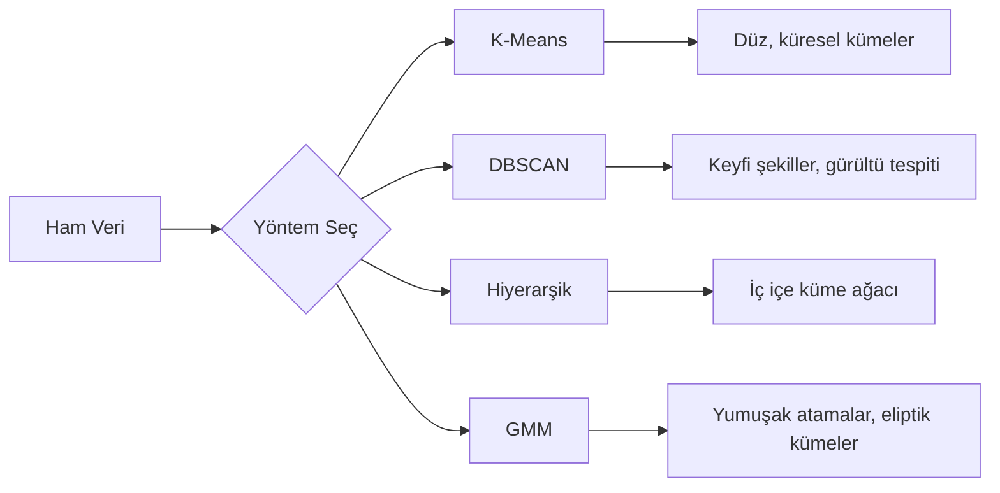

# Denetimsiz Öğrenme

> Etiket yok, öğretmen yok. Algoritma yapıyı kendi başına bulur.

**Tür:** Yapım
**Diller:** Python
**Ön koşullar:** Faz 1 (Normlar & Mesafeler, Olasılık & Dağılımlar), Faz 2 Dersler 1-6
**Süre:** ~90 dakika

## Öğrenme Hedefleri

- K-Means, DBSCAN ve Gaussian Mixture Model'leri sıfırdan uygula ve kümeleme davranışlarını karşılaştır
- Optimal K'yı seçmek için silhouette skoru ve elbow yöntemi kullanarak küme kalitesini değerlendir
- DBSCAN'in K-Means'i ne zaman yendiğini açıkla ve küresel olmayan kümeleri ve aykırı değerleri hangi algoritmanın ele aldığını belirle
- Normal örüntülerden sapma gösteren noktaları işaretlemek için kümeleme yöntemleri kullanan bir anomali tespit pipeline'ı inşa et

## Sorun

Şimdiye kadarki her ML dersi etiketli veri varsaydı: "işte bir girdi, işte doğru çıktı." Gerçek dünyada etiketler pahalıdır. Bir hastanenin milyonlarca hasta kaydı vardır ama hiç kimse her birini manuel olarak bir hastalık kategorisiyle etiketlememiştir. Bir e-ticaret sitesinin milyonlarca kullanıcı oturumu vardır ama hiç kimse müşteri segmentlerini elle etiketlememiştir. Bir güvenlik ekibinin ağ logları vardır ama hiç kimse her anomaliyi işaretlememiştir.

Denetimsiz öğrenme, ne arayacağı söylenmeden örüntüler bulur. Benzer veri noktalarını gruplar, gizli yapıları keşfeder ve anomalileri yüzeye çıkarır. Denetimli öğrenme, cevap anahtarı olan bir ders kitabından öğrenmekse, denetimsiz öğrenme örüntüler kendini gösterene kadar ham veriye bakmaktır.

İşin püf noktası: etiketler olmadan "doğru" veya "yanlış"ı doğrudan ölçemezsin. Algoritmanın bulduğu yapının anlamlı olup olmadığını değerlendirmek için farklı araçlara ihtiyacın var.

## Kavram

### Kümeleme: Benzer Şeyleri Bir Araya Getirmek

Kümeleme, aynı gruptaki noktaların birbirine diğer gruptaki noktalardan daha benzer olduğu şekilde her veri noktasını bir gruba (kümeye) atar. Soru her zaman: "benzer" ne demek?



### K-Means: İş Beygiri

K-Means, veriyi tam olarak K kümeye böler. Her kümenin bir centroid'i (kütle merkezi) vardır ve her nokta en yakın centroid'e aittir.

Lloyd algoritması:

1. Başlangıç centroid'i olarak K rastgele nokta seç
2. Her veri noktasını en yakın centroid'e ata
3. Her centroid'i atanmış noktalarının ortalaması olarak yeniden hesapla
4. Atamalar değişmeyi bırakana kadar 2-3. adımları tekrarla

Amaç fonksiyonu (inertia), her noktadan atanmış centroid'ine olan toplam karesel mesafeyi ölçer. K-Means bunu minimize eder ama yalnızca yerel bir minimum bulur. Farklı başlangıçlar farklı sonuçlar verebilir.

### K Seçimi

İki standart yöntem:

**Elbow yöntemi:** K = 1, 2, 3, ..., n için K-Means çalıştır. K'ya karşı inertia çiz. Daha fazla küme eklemenin inertia'yı önemli ölçüde azaltmayı bıraktığı "dirsek"e bak.

**Silhouette skoru:** Her nokta için, kendi kümesine ne kadar benzer olduğunu (a) en yakın diğer kümeye karşı (b) ölç. Silhouette katsayısı (b - a) / max(a, b)'dir, -1'den (yanlış küme) +1'e (iyi kümelenmiş) kadar uzanır. Global bir skor için tüm noktalar arasında ortalamasını al.

### DBSCAN: Yoğunluk Tabanlı Kümeleme

K-Means kümelerin küresel olduğunu varsayar ve önceden K'yı seçmeni gerektirir. DBSCAN bu varsayımların hiçbirini yapmaz. Kümeleri seyrek bölgelerle ayrılmış yoğun bölgeler olarak bulur.

İki parametre:
- **eps**: bir komşuluğun yarıçapı
- **min_samples**: yoğun bir bölge oluşturmak için gereken minimum nokta sayısı

Üç tür nokta:
- **Core point**: eps mesafesinde en az min_samples noktası olan
- **Border point**: bir core point'e eps mesafesinde olan ama kendisi core point olmayan
- **Noise point**: ne core ne de border. Bunlar aykırı değerlerdir.

DBSCAN, birbirinin eps mesafesindeki core point'leri aynı kümeye bağlar. Border point'ler yakındaki bir core point'in kümesine katılır. Noise point'ler hiçbir kümeye ait değildir.

Güçlü yanlar: herhangi bir şekilde küme bulur, küme sayısını otomatik belirler, aykırı değerleri tanımlar. Zayıf yanı: farklı yoğunluklara sahip kümelerle zorlanır.

### Hiyerarşik Kümeleme

İç içe kümelerden oluşan bir ağaç (dendrogram) inşa eder.

Aglomeratif (aşağıdan yukarıya):
1. Her noktayı kendi kümesi olarak başlat
2. En yakın iki kümeyi birleştir
3. Sadece bir küme kalana kadar tekrarla
4. K küme almak için dendrogramı istenen seviyede kes

Kümeler arasındaki "yakınlık" şu şekilde ölçülebilir:
- **Single linkage**: iki kümedeki herhangi iki nokta arasındaki minimum mesafe
- **Complete linkage**: herhangi iki nokta arasındaki maksimum mesafe
- **Average linkage**: tüm çiftler arasındaki ortalama mesafe
- **Ward yöntemi**: küme içi toplam variance'ında en küçük artışa neden olan birleştirme

### Gaussian Mixture Model (GMM)

K-Means sert atamalar verir: her nokta tam olarak bir kümeye aittir. GMM yumuşak atamalar verir: her noktanın her kümeye ait olma olasılığı vardır.

GMM, verinin K Gauss dağılımının bir karışımından üretildiğini varsayar, her birinin kendi ortalaması ve kovaryansı vardır. Expectation-Maximization (EM) algoritması şunlar arasında dönüşümlü çalışır:

- **E-step**: her noktanın her Gauss'a ait olma olasılığını hesapla
- **M-step**: verinin olabilirliğini maksimize etmek için her Gauss'un ortalamasını, kovaryansını ve karıştırma ağırlığını güncelle

GMM eliptik kümeleri (K-Means gibi yalnızca küresel değil) modelleyebilir ve örtüşen kümeleri doğal olarak ele alır.

### Hangisini Ne Zaman Kullanmalı

| Yöntem | En iyi olduğu durum | Kaçınılması gereken |
|--------|----------|------------|
| K-Means | Büyük veri setleri, küresel kümeler, bilinen K | Düzensiz şekiller, aykırı değerler |
| DBSCAN | Bilinmeyen K, keyfi şekiller, aykırı değer tespiti | Değişken yoğunluklar, çok yüksek boyutlar |
| Hiyerarşik | Küçük veri setleri, dendrogram gerekli, bilinmeyen K | Büyük veri setleri (O(n^2) bellek) |
| GMM | Örtüşen kümeler, yumuşak atama gerekli | Çok büyük veri setleri, çok fazla boyut |

### Kümeleme ile Anomali Tespiti

Kümeleme doğal olarak anomali tespitini destekler:
- **K-Means**: herhangi bir centroid'den uzakta olan noktalar anomalidir
- **DBSCAN**: noise point'ler tanımı gereği anomalidir
- **GMM**: tüm Gauss'larda düşük olasılığa sahip noktalar anomalidir

## İnşa Et

### Adım 1: Sıfırdan K-Means

```python
import math
import random


def euclidean_distance(a, b):
    return math.sqrt(sum((ai - bi) ** 2 for ai, bi in zip(a, b)))


def kmeans(data, k, max_iterations=100, seed=42):
    random.seed(seed)
    n_features = len(data[0])

    centroids = random.sample(data, k)

    for iteration in range(max_iterations):
        clusters = [[] for _ in range(k)]
        assignments = []

        for point in data:
            distances = [euclidean_distance(point, c) for c in centroids]
            nearest = distances.index(min(distances))
            clusters[nearest].append(point)
            assignments.append(nearest)

        new_centroids = []
        for cluster in clusters:
            if len(cluster) == 0:
                new_centroids.append(random.choice(data))
                continue
            centroid = [
                sum(point[j] for point in cluster) / len(cluster)
                for j in range(n_features)
            ]
            new_centroids.append(centroid)

        if all(
            euclidean_distance(old, new) < 1e-6
            for old, new in zip(centroids, new_centroids)
        ):
            print(f"  Converged at iteration {iteration + 1}")
            break

        centroids = new_centroids

    return assignments, centroids
```

### Adım 2: Elbow yöntemi ve silhouette skoru

```python
def compute_inertia(data, assignments, centroids):
    total = 0.0
    for point, cluster_id in zip(data, assignments):
        total += euclidean_distance(point, centroids[cluster_id]) ** 2
    return total


def silhouette_score(data, assignments):
    n = len(data)
    if n < 2:
        return 0.0

    clusters = {}
    for i, c in enumerate(assignments):
        clusters.setdefault(c, []).append(i)

    if len(clusters) < 2:
        return 0.0

    scores = []
    for i in range(n):
        own_cluster = assignments[i]
        own_members = [j for j in clusters[own_cluster] if j != i]

        if len(own_members) == 0:
            scores.append(0.0)
            continue

        a = sum(euclidean_distance(data[i], data[j]) for j in own_members) / len(own_members)

        b = float("inf")
        for cluster_id, members in clusters.items():
            if cluster_id == own_cluster:
                continue
            avg_dist = sum(euclidean_distance(data[i], data[j]) for j in members) / len(members)
            b = min(b, avg_dist)

        if max(a, b) == 0:
            scores.append(0.0)
        else:
            scores.append((b - a) / max(a, b))

    return sum(scores) / len(scores)


def find_best_k(data, max_k=10):
    print("Elbow method:")
    inertias = []
    for k in range(1, max_k + 1):
        assignments, centroids = kmeans(data, k)
        inertia = compute_inertia(data, assignments, centroids)
        inertias.append(inertia)
        print(f"  K={k}: inertia={inertia:.2f}")

    print("\nSilhouette scores:")
    for k in range(2, max_k + 1):
        assignments, centroids = kmeans(data, k)
        score = silhouette_score(data, assignments)
        print(f"  K={k}: silhouette={score:.4f}")

    return inertias
```

### Adım 3: Sıfırdan DBSCAN

```python
def dbscan(data, eps, min_samples):
    n = len(data)
    labels = [-1] * n
    cluster_id = 0

    def region_query(point_idx):
        neighbors = []
        for i in range(n):
            if euclidean_distance(data[point_idx], data[i]) <= eps:
                neighbors.append(i)
        return neighbors

    visited = [False] * n

    for i in range(n):
        if visited[i]:
            continue
        visited[i] = True

        neighbors = region_query(i)

        if len(neighbors) < min_samples:
            labels[i] = -1
            continue

        labels[i] = cluster_id
        seed_set = list(neighbors)
        seed_set.remove(i)

        j = 0
        while j < len(seed_set):
            q = seed_set[j]

            if not visited[q]:
                visited[q] = True
                q_neighbors = region_query(q)
                if len(q_neighbors) >= min_samples:
                    for nb in q_neighbors:
                        if nb not in seed_set:
                            seed_set.append(nb)

            if labels[q] == -1:
                labels[q] = cluster_id

            j += 1

        cluster_id += 1

    return labels
```

### Adım 4: Gaussian Mixture Model (EM algoritması)

```python
def gmm(data, k, max_iterations=100, seed=42):
    random.seed(seed)
    n = len(data)
    d = len(data[0])

    indices = random.sample(range(n), k)
    means = [list(data[i]) for i in indices]
    variances = [1.0] * k
    weights = [1.0 / k] * k

    def gaussian_pdf(x, mean, variance):
        d = len(x)
        coeff = 1.0 / ((2 * math.pi * variance) ** (d / 2))
        exponent = -sum((xi - mi) ** 2 for xi, mi in zip(x, mean)) / (2 * variance)
        return coeff * math.exp(max(exponent, -500))

    for iteration in range(max_iterations):
        responsibilities = []
        for i in range(n):
            probs = []
            for j in range(k):
                probs.append(weights[j] * gaussian_pdf(data[i], means[j], variances[j]))
            total = sum(probs)
            if total == 0:
                total = 1e-300
            responsibilities.append([p / total for p in probs])

        old_means = [list(m) for m in means]

        for j in range(k):
            r_sum = sum(responsibilities[i][j] for i in range(n))
            if r_sum < 1e-10:
                continue

            weights[j] = r_sum / n

            for dim in range(d):
                means[j][dim] = sum(
                    responsibilities[i][j] * data[i][dim] for i in range(n)
                ) / r_sum

            variances[j] = sum(
                responsibilities[i][j]
                * sum((data[i][dim] - means[j][dim]) ** 2 for dim in range(d))
                for i in range(n)
            ) / (r_sum * d)
            variances[j] = max(variances[j], 1e-6)

        shift = sum(
            euclidean_distance(old_means[j], means[j]) for j in range(k)
        )
        if shift < 1e-6:
            print(f"  GMM converged at iteration {iteration + 1}")
            break

    assignments = []
    for i in range(n):
        assignments.append(responsibilities[i].index(max(responsibilities[i])))

    return assignments, means, weights, responsibilities
```

### Adım 5: Test verisi üret ve her şeyi çalıştır

```python
def make_blobs(centers, n_per_cluster=50, spread=0.5, seed=42):
    random.seed(seed)
    data = []
    true_labels = []
    for label, (cx, cy) in enumerate(centers):
        for _ in range(n_per_cluster):
            x = cx + random.gauss(0, spread)
            y = cy + random.gauss(0, spread)
            data.append([x, y])
            true_labels.append(label)
    return data, true_labels


def make_moons(n_samples=200, noise=0.1, seed=42):
    random.seed(seed)
    data = []
    labels = []
    n_half = n_samples // 2
    for i in range(n_half):
        angle = math.pi * i / n_half
        x = math.cos(angle) + random.gauss(0, noise)
        y = math.sin(angle) + random.gauss(0, noise)
        data.append([x, y])
        labels.append(0)
    for i in range(n_half):
        angle = math.pi * i / n_half
        x = 1 - math.cos(angle) + random.gauss(0, noise)
        y = 1 - math.sin(angle) - 0.5 + random.gauss(0, noise)
        data.append([x, y])
        labels.append(1)
    return data, labels


if __name__ == "__main__":
    centers = [[2, 2], [8, 3], [5, 8]]
    data, true_labels = make_blobs(centers, n_per_cluster=50, spread=0.8)

    print("=== K-Means on 3 blobs ===")
    assignments, centroids = kmeans(data, k=3)
    print(f"  Centroids: {[[round(c, 2) for c in cent] for cent in centroids]}")
    sil = silhouette_score(data, assignments)
    print(f"  Silhouette score: {sil:.4f}")

    print("\n=== Elbow Method ===")
    find_best_k(data, max_k=6)

    print("\n=== DBSCAN on 3 blobs ===")
    db_labels = dbscan(data, eps=1.5, min_samples=5)
    n_clusters = len(set(db_labels) - {-1})
    n_noise = db_labels.count(-1)
    print(f"  Found {n_clusters} clusters, {n_noise} noise points")

    print("\n=== GMM on 3 blobs ===")
    gmm_assignments, gmm_means, gmm_weights, _ = gmm(data, k=3)
    print(f"  Means: {[[round(m, 2) for m in mean] for mean in gmm_means]}")
    print(f"  Weights: {[round(w, 3) for w in gmm_weights]}")
    gmm_sil = silhouette_score(data, gmm_assignments)
    print(f"  Silhouette score: {gmm_sil:.4f}")

    print("\n=== DBSCAN on moons (non-spherical clusters) ===")
    moon_data, moon_labels = make_moons(n_samples=200, noise=0.1)
    moon_db = dbscan(moon_data, eps=0.3, min_samples=5)
    n_moon_clusters = len(set(moon_db) - {-1})
    n_moon_noise = moon_db.count(-1)
    print(f"  Found {n_moon_clusters} clusters, {n_moon_noise} noise points")

    print("\n=== K-Means on moons (will fail to separate) ===")
    moon_km, moon_centroids = kmeans(moon_data, k=2)
    moon_sil = silhouette_score(moon_data, moon_km)
    print(f"  Silhouette score: {moon_sil:.4f}")
    print("  K-Means splits moons poorly because they are not spherical")

    print("\n=== Anomaly detection with DBSCAN ===")
    anomaly_data = list(data)
    anomaly_data.append([20.0, 20.0])
    anomaly_data.append([-5.0, -5.0])
    anomaly_data.append([15.0, 0.0])
    anomaly_labels = dbscan(anomaly_data, eps=1.5, min_samples=5)
    anomalies = [
        anomaly_data[i]
        for i in range(len(anomaly_labels))
        if anomaly_labels[i] == -1
    ]
    print(f"  Detected {len(anomalies)} anomalies")
    for a in anomalies[-3:]:
        print(f"    Point {[round(v, 2) for v in a]}")
```

## Kullan

scikit-learn ile aynı algoritmalar tek satırlıktır:

```python
from sklearn.cluster import KMeans, DBSCAN, AgglomerativeClustering
from sklearn.mixture import GaussianMixture
from sklearn.metrics import silhouette_score as sklearn_silhouette

km = KMeans(n_clusters=3, random_state=42).fit(data)
db = DBSCAN(eps=1.5, min_samples=5).fit(data)
agg = AgglomerativeClustering(n_clusters=3).fit(data)
gmm_model = GaussianMixture(n_components=3, random_state=42).fit(data)
```

Sıfırdan versiyonlar, bu kütüphanelerin ne hesapladığını tam olarak gösterir. K-Means atama ve yeniden hesaplama arasında iterasyon yapar. DBSCAN kümeleri yoğun tohumlardan büyütür. GMM beklenti ve maksimizasyon arasında dönüşümlü çalışır. Kütüphane versiyonları sayısal kararlılık, daha akıllı başlangıç (K-Means++) ve GPU hızlandırma ekler ama temel mantık aynıdır.

## Yayınla

Bu ders K-Means, DBSCAN ve GMM'nin çalışan sıfırdan uygulamalarını üretir. Kümeleme kodu, daha gelişmiş denetimsiz yöntemler için temel olarak yeniden kullanılabilir.

## Alıştırmalar

1. K-Means++ başlangıcını uygula: rastgele centroid'ler seçmek yerine, ilkini rastgele seç ve sonraki her centroid'i mevcut en yakın centroid'e olan karesel mesafesiyle orantılı olasılıkla seç. Yakınsama hızını rastgele başlangıçla karşılaştır.
2. Koda hiyerarşik aglomeratif kümelemeyi ekle. Ward linkage'ını uygula ve bir dendrogram (iç içe birleştirme listesi olarak) üret. Onu farklı seviyelerde kes ve K-Means sonuçlarıyla karşılaştır.
3. Basit bir anomali tespit pipeline'ı inşa et: aynı veri üzerinde DBSCAN ve GMM çalıştır, her iki yöntemin de aykırı değer olarak kabul ettiği noktaları işaretle (DBSCAN'de noise, GMM'de düşük olasılık). Örtüşmeyi ölç ve yöntemlerin ne zaman uyuşmadığını tartış.

## Anahtar Terimler

| Terim | İnsanlar ne der | Aslında ne demek |
|------|----------------|----------------------|
| Kümeleme | "Benzer şeyleri gruplamak" | Belirli bir mesafe metriğiyle ölçülmüş şekilde grup içi benzerliğin gruplar arası benzerliği aştığı alt kümelere veriyi bölmek |
| Centroid | "Bir kümenin merkezi" | Bir kümeye atanan tüm noktaların ortalaması; K-Means tarafından küme temsilcisi olarak kullanılır |
| Inertia | "Kümelerin ne kadar sıkı olduğu" | Her noktadan atanmış centroid'ine olan karesel mesafelerin toplamı; düşük olan daha sıkı |
| Silhouette skoru | "Kümelerin ne kadar iyi ayrıldığı" | Her nokta için (b - a) / max(a, b); burada a ortalama küme içi mesafe, b ortalama en yakın küme mesafesidir |
| Core point | "Yoğun bir bölgedeki nokta" | DBSCAN'de eps mesafesinde en az min_samples komşusu olan nokta |
| EM algoritması | "Yumuşak K-Means" | Expectation-Maximization: üyelik olasılıklarını iteratif olarak hesapla (E-step) ve dağılım parametrelerini güncelle (M-step) |
| Dendrogram | "Bir küme ağacı" | Hiyerarşik kümelemede kümelerin hangi sırayla ve mesafede birleştirildiğini gösteren ağaç diyagramı |
| Anomali | "Bir aykırı değer" | Beklenen örüntüye uymayan, DBSCAN tarafından noise olarak veya GMM tarafından düşük-olasılık olarak tanımlanan bir veri noktası |

## Daha Fazla Okuma

- [Stanford CS229 - Unsupervised Learning](https://cs229.stanford.edu/notes2022fall/main_notes.pdf) - Andrew Ng'nin kümeleme ve EM üzerine ders notları
- [scikit-learn Clustering Guide](https://scikit-learn.org/stable/modules/clustering.html) - tüm kümeleme algoritmalarının görsel örneklerle pratik karşılaştırması
- [DBSCAN original paper (Ester et al., 1996)](https://www.aaai.org/Papers/KDD/1996/KDD96-037.pdf) - yoğunluk tabanlı kümelemeyi tanıtan makale
