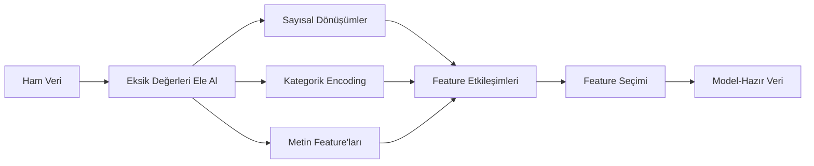

# Feature Engineering & Seçimi

> İyi bir feature, bin veri noktasına bedeldir.

**Tür:** Yapım
**Diller:** Python
**Ön koşullar:** Faz 1 (ML için İstatistik, Doğrusal Cebir), Faz 2 Dersler 1-7
**Süre:** ~90 dakika

## Öğrenme Hedefleri

- Sayısal dönüşümleri (standardizasyon, min-max ölçekleme, log dönüşümü, binning) uygula ve her birinin ne zaman uygun olduğunu açıkla
- Kategorik feature'lar için one-hot, label ve target encoding inşa et ve target encoding'deki data leakage riskini belirle
- Sıfırdan bir TF-IDF vektörleyici oluştur ve metin sınıflandırması için neden ham kelime sayılarından daha iyi performans gösterdiğini açıkla
- Boyut azaltmak için filtre tabanlı feature seçimi (variance threshold, korelasyon, mutual information) uygula

## Sorun

Bir veri setin var. Bir algoritma seçiyorsun. Onu eğitiyorsun. Sonuçlar vasat. Daha gösterişli bir algoritma deniyorsun. Hâlâ vasat. Bir hafta hiperparametre ayarlamakla geçiriyorsun. Marjinal iyileşme.

Sonra biri ham veriyi daha iyi feature'lara dönüştürüyor ve basit bir lojistik regresyon, senin ayarladığın gradient-boosted ensemble'ı yeniyor.

Bu sürekli olur. Klasik ML'de verinin temsili algoritma seçiminden daha önemlidir. "Metrekare" ve "yatak odası sayısı" ile bir ev fiyatı modeli, ne kadar sofistike olursa olsun "adres bir ham string olarak" diye bir feature'lı bir modeli yener. Algoritma sadece ona verdiğinle çalışabilir.

Feature engineering, ham veriyi modellerin örüntü bulmasını kolaylaştıran temsillere dönüştürme sürecidir. Feature seçimi, sinyal eklemeden gürültü ekleyen feature'ları atma sürecidir. Birlikte, klasik ML'deki en yüksek-kaldıraçlı aktivitedir.

## Kavram

### Feature Pipeline'ı



### Sayısal Feature'lar

Ham sayılar nadiren model-hazırdır. Yaygın dönüşümler:

**Ölçekleme:** Mesafe tabanlı algoritmalar (K-Means, KNN, SVM) tüm feature'lara eşit muamele etsin diye feature'ları aynı aralığa koy. Min-max ölçekleme [0, 1]'e eşler. Standardizasyon (z-score) ortalama=0, std=1'e eşler.

**Log dönüşümü:** Sağa-eğik dağılımları sıkıştırır (gelir, nüfus, kelime sayıları). Çarpımsal ilişkileri toplamsal olanlara dönüştürür.

**Binning:** Sürekli değerleri kategorilere dönüştürür. Feature ile target arasındaki ilişki doğrusal olmadığında ama basamak basamak olduğunda (örn., yaş grupları) faydalıdır.

**Polinom feature'lar:** x^2, x^3, x1*x2 terimleri yaratır. Doğrusal modellerin daha fazla feature pahasına doğrusal olmayan ilişkileri yakalamasını sağlar.

### Kategorik Feature'lar

Modeller sayılara ihtiyaç duyar. Kategorilerin encoding'e ihtiyacı var.

**One-hot encoding:** Her kategori için bir ikili kolon yaratır. "renk = kırmızı/mavi/yeşil" üç kolon olur: is_red, is_blue, is_green. Düşük-kardinaliteli feature'lar için iyi çalışır ama çok kategori olduğunda patlar.

**Label encoding:** Her kategoriyi bir tam sayıya eşler: kırmızı=0, mavi=1, yeşil=2. Yanlış sıralama getirir (model yeşil > mavi > kırmızı diye düşünebilir). Sadece bireysel değerler üzerinde bölünen ağaç tabanlı modeller için uygundur.

**Target encoding:** Her kategoriyi o kategorinin target değişkeninin ortalamasıyla değiştirir. Güçlü ama tehlikeli: yüksek data leakage riski. Sadece eğitim verisinde hesaplanmalı ve test verisine uygulanmalı.

### Metin Feature'ları

**Count vectorizer:** Her kelimenin bir belgede kaç kez geçtiğini sayar. "kedi paspasın üstüne oturdu" {kedi: 1, paspasın: 1, üstüne: 1, oturdu: 1} olur.

**TF-IDF:** Term Frequency-Inverse Document Frequency. Kelimeleri belgeler arasında ne kadar benzersiz olduklarına göre ağırlıklandırır. "the" gibi yaygın kelimeler düşük ağırlık alır. Nadir, ayırt edici kelimeler yüksek ağırlık alır.

```
TF(word, doc) = count(word in doc) / total words in doc
IDF(word) = log(total docs / docs containing word)
TF-IDF = TF * IDF
```

### Eksik Değerler

Gerçek verinin delikleri var. Stratejiler:

- **Satırları at:** Sadece eksik veri nadir ve rastgele olduğunda
- **Ortalama/medyan imputation:** Basit, dağılım şeklini korur (medyan aykırı değerlere karşı daha dayanıklıdır)
- **Mod imputation:** Kategorik feature'lar için
- **İndikatör kolon:** Imputation öncesi "bu eksik miydi" diye bir ikili kolon ekle. Verinin eksik olması kendisi bilgi verici olabilir
- **Forward/backward fill:** Zaman serisi verisi için

### Feature Etkileşimi

Bazen ilişki kombinasyondadır. "Boy" ve "kilo" tek başlarına, "BMI = kilo / boy^2"den daha az öngörücüdür. Feature etkileşimleri feature uzayını çarpar, bu yüzden doğruları seçmek için alan bilgisi kullan.

### Feature Seçimi

Daha fazla feature her zaman daha iyi değildir. Alakasız feature'lar gürültü ekler, eğitim süresini artırır ve overfitting'e neden olabilir.

**Filtre yöntemleri (model öncesi):**
- Korelasyon: birbirleriyle yüksek korelasyonlu feature'ları kaldır (gereksiz)
- Mutual information: bir feature'ı bilmenin target hakkındaki belirsizliği ne kadar azalttığını ölçer
- Variance threshold: zar zor değişen feature'ları kaldır

**Wrapper yöntemleri (model tabanlı):**
- L1 düzenlemesi (Lasso): alakasız feature ağırlıklarını tam olarak sıfıra sürer
- Recursive feature elimination: eğit, en az önemli feature'ı kaldır, tekrarla

**Seçim neden önemli:** 10 iyi feature'ı olan bir model genellikle 10 iyi feature ve 90 gürültülü feature'ı olan bir modeli yener. Gürültülü feature'lar modele, genelleştirmeyen eğitim verisi örüntülerine overfit yapma fırsatları verir.

## İnşa Et

### Adım 1: Sıfırdan sayısal dönüşümler

```python
import math


def min_max_scale(values):
    min_val = min(values)
    max_val = max(values)
    if max_val == min_val:
        return [0.0] * len(values)
    return [(v - min_val) / (max_val - min_val) for v in values]


def standardize(values):
    n = len(values)
    mean = sum(values) / n
    variance = sum((v - mean) ** 2 for v in values) / n
    std = math.sqrt(variance) if variance > 0 else 1.0
    return [(v - mean) / std for v in values]


def log_transform(values):
    return [math.log(v + 1) for v in values]


def bin_values(values, n_bins=5):
    min_val = min(values)
    max_val = max(values)
    bin_width = (max_val - min_val) / n_bins
    if bin_width == 0:
        return [0] * len(values)
    result = []
    for v in values:
        bin_idx = int((v - min_val) / bin_width)
        bin_idx = min(bin_idx, n_bins - 1)
        result.append(bin_idx)
    return result


def polynomial_features(row, degree=2):
    n = len(row)
    result = list(row)
    if degree >= 2:
        for i in range(n):
            result.append(row[i] ** 2)
        for i in range(n):
            for j in range(i + 1, n):
                result.append(row[i] * row[j])
    return result
```

### Adım 2: Sıfırdan kategorik encoding

```python
def one_hot_encode(values):
    categories = sorted(set(values))
    cat_to_idx = {cat: i for i, cat in enumerate(categories)}
    n_cats = len(categories)

    encoded = []
    for v in values:
        row = [0] * n_cats
        row[cat_to_idx[v]] = 1
        encoded.append(row)

    return encoded, categories


def label_encode(values):
    categories = sorted(set(values))
    cat_to_int = {cat: i for i, cat in enumerate(categories)}
    return [cat_to_int[v] for v in values], cat_to_int


def target_encode(feature_values, target_values, smoothing=10):
    global_mean = sum(target_values) / len(target_values)

    category_stats = {}
    for feat, target in zip(feature_values, target_values):
        if feat not in category_stats:
            category_stats[feat] = {"sum": 0.0, "count": 0}
        category_stats[feat]["sum"] += target
        category_stats[feat]["count"] += 1

    encoding = {}
    for cat, stats in category_stats.items():
        cat_mean = stats["sum"] / stats["count"]
        weight = stats["count"] / (stats["count"] + smoothing)
        encoding[cat] = weight * cat_mean + (1 - weight) * global_mean

    return [encoding[v] for v in feature_values], encoding
```

### Adım 3: Sıfırdan metin feature'ları

```python
def count_vectorize(documents):
    vocab = {}
    idx = 0
    for doc in documents:
        for word in doc.lower().split():
            if word not in vocab:
                vocab[word] = idx
                idx += 1

    vectors = []
    for doc in documents:
        vec = [0] * len(vocab)
        for word in doc.lower().split():
            vec[vocab[word]] += 1
        vectors.append(vec)

    return vectors, vocab


def tfidf(documents):
    n_docs = len(documents)

    vocab = {}
    idx = 0
    for doc in documents:
        for word in doc.lower().split():
            if word not in vocab:
                vocab[word] = idx
                idx += 1

    doc_freq = {}
    for doc in documents:
        seen = set()
        for word in doc.lower().split():
            if word not in seen:
                doc_freq[word] = doc_freq.get(word, 0) + 1
                seen.add(word)

    vectors = []
    for doc in documents:
        words = doc.lower().split()
        word_count = len(words)
        tf_map = {}
        for word in words:
            tf_map[word] = tf_map.get(word, 0) + 1

        vec = [0.0] * len(vocab)
        for word, count in tf_map.items():
            tf = count / word_count
            idf = math.log(n_docs / doc_freq[word])
            vec[vocab[word]] = tf * idf
        vectors.append(vec)

    return vectors, vocab
```

### Adım 4: Sıfırdan eksik değer imputation

```python
def impute_mean(values):
    present = [v for v in values if v is not None]
    if not present:
        return [0.0] * len(values), 0.0
    mean = sum(present) / len(present)
    return [v if v is not None else mean for v in values], mean


def impute_median(values):
    present = sorted(v for v in values if v is not None)
    if not present:
        return [0.0] * len(values), 0.0
    n = len(present)
    if n % 2 == 0:
        median = (present[n // 2 - 1] + present[n // 2]) / 2
    else:
        median = present[n // 2]
    return [v if v is not None else median for v in values], median


def impute_mode(values):
    present = [v for v in values if v is not None]
    if not present:
        return values, None
    counts = {}
    for v in present:
        counts[v] = counts.get(v, 0) + 1
    mode = max(counts, key=counts.get)
    return [v if v is not None else mode for v in values], mode


def add_missing_indicator(values):
    return [0 if v is not None else 1 for v in values]
```

### Adım 5: Sıfırdan feature seçimi

```python
def correlation(x, y):
    n = len(x)
    mean_x = sum(x) / n
    mean_y = sum(y) / n
    cov = sum((xi - mean_x) * (yi - mean_y) for xi, yi in zip(x, y)) / n
    std_x = math.sqrt(sum((xi - mean_x) ** 2 for xi in x) / n)
    std_y = math.sqrt(sum((yi - mean_y) ** 2 for yi in y) / n)
    if std_x == 0 or std_y == 0:
        return 0.0
    return cov / (std_x * std_y)


def mutual_information(feature, target, n_bins=10):
    feat_min = min(feature)
    feat_max = max(feature)
    bin_width = (feat_max - feat_min) / n_bins if feat_max != feat_min else 1.0
    feat_binned = [
        min(int((f - feat_min) / bin_width), n_bins - 1) for f in feature
    ]

    n = len(feature)
    target_classes = sorted(set(target))

    feat_bins = sorted(set(feat_binned))
    p_feat = {}
    for b in feat_bins:
        p_feat[b] = feat_binned.count(b) / n

    p_target = {}
    for t in target_classes:
        p_target[t] = target.count(t) / n

    mi = 0.0
    for b in feat_bins:
        for t in target_classes:
            joint_count = sum(
                1 for fb, tv in zip(feat_binned, target) if fb == b and tv == t
            )
            p_joint = joint_count / n
            if p_joint > 0:
                mi += p_joint * math.log(p_joint / (p_feat[b] * p_target[t]))

    return mi


def variance_threshold(features, threshold=0.01):
    n_features = len(features[0])
    n_samples = len(features)
    selected = []

    for j in range(n_features):
        col = [features[i][j] for i in range(n_samples)]
        mean = sum(col) / n_samples
        var = sum((v - mean) ** 2 for v in col) / n_samples
        if var >= threshold:
            selected.append(j)

    return selected


def remove_correlated(features, threshold=0.9):
    n_features = len(features[0])
    n_samples = len(features)

    to_remove = set()
    for i in range(n_features):
        if i in to_remove:
            continue
        col_i = [features[r][i] for r in range(n_samples)]
        for j in range(i + 1, n_features):
            if j in to_remove:
                continue
            col_j = [features[r][j] for r in range(n_samples)]
            corr = abs(correlation(col_i, col_j))
            if corr >= threshold:
                to_remove.add(j)

    return [i for i in range(n_features) if i not in to_remove]
```

### Adım 6: Tam pipeline ve demo

```python
import random


def make_housing_data(n=200, seed=42):
    random.seed(seed)
    data = []
    for _ in range(n):
        sqft = random.uniform(500, 5000)
        bedrooms = random.choice([1, 2, 3, 4, 5])
        age = random.uniform(0, 50)
        neighborhood = random.choice(["downtown", "suburbs", "rural"])
        has_pool = random.choice([True, False])

        sqft_with_missing = sqft if random.random() > 0.05 else None
        age_with_missing = age if random.random() > 0.08 else None

        price = (
            50 * sqft
            + 20000 * bedrooms
            - 1000 * age
            + (50000 if neighborhood == "downtown" else 10000 if neighborhood == "suburbs" else 0)
            + (15000 if has_pool else 0)
            + random.gauss(0, 20000)
        )

        data.append({
            "sqft": sqft_with_missing,
            "bedrooms": bedrooms,
            "age": age_with_missing,
            "neighborhood": neighborhood,
            "has_pool": has_pool,
            "price": price,
        })
    return data


if __name__ == "__main__":
    data = make_housing_data(200)

    print("=== Raw Data Sample ===")
    for row in data[:3]:
        print(f"  {row}")

    sqft_raw = [d["sqft"] for d in data]
    age_raw = [d["age"] for d in data]
    prices = [d["price"] for d in data]

    print("\n=== Missing Value Handling ===")
    sqft_missing = sum(1 for v in sqft_raw if v is None)
    age_missing = sum(1 for v in age_raw if v is None)
    print(f"  sqft missing: {sqft_missing}/{len(sqft_raw)}")
    print(f"  age missing: {age_missing}/{len(age_raw)}")

    sqft_indicator = add_missing_indicator(sqft_raw)
    age_indicator = add_missing_indicator(age_raw)
    sqft_imputed, sqft_fill = impute_median(sqft_raw)
    age_imputed, age_fill = impute_mean(age_raw)
    print(f"  sqft filled with median: {sqft_fill:.0f}")
    print(f"  age filled with mean: {age_fill:.1f}")

    print("\n=== Numerical Transforms ===")
    sqft_scaled = standardize(sqft_imputed)
    age_scaled = min_max_scale(age_imputed)
    sqft_log = log_transform(sqft_imputed)
    age_binned = bin_values(age_imputed, n_bins=5)
    print(f"  sqft standardized: mean={sum(sqft_scaled)/len(sqft_scaled):.4f}, std={math.sqrt(sum(v**2 for v in sqft_scaled)/len(sqft_scaled)):.4f}")
    print(f"  age min-max: [{min(age_scaled):.2f}, {max(age_scaled):.2f}]")
    print(f"  age bins: {sorted(set(age_binned))}")

    print("\n=== Categorical Encoding ===")
    neighborhoods = [d["neighborhood"] for d in data]

    ohe, ohe_cats = one_hot_encode(neighborhoods)
    print(f"  One-hot categories: {ohe_cats}")
    print(f"  Sample encoding: {neighborhoods[0]} -> {ohe[0]}")

    le, le_map = label_encode(neighborhoods)
    print(f"  Label encoding map: {le_map}")

    te, te_map = target_encode(neighborhoods, prices, smoothing=10)
    print(f"  Target encoding: {({k: round(v) for k, v in te_map.items()})}")

    print("\n=== Text Features ===")
    descriptions = [
        "large modern house with pool",
        "small cozy cottage near downtown",
        "spacious family home with large yard",
        "modern apartment downtown with view",
        "rustic cabin in rural area",
    ]
    cv, cv_vocab = count_vectorize(descriptions)
    print(f"  Vocabulary size: {len(cv_vocab)}")
    print(f"  Doc 0 non-zero features: {sum(1 for v in cv[0] if v > 0)}")

    tf, tf_vocab = tfidf(descriptions)
    print(f"  TF-IDF vocabulary size: {len(tf_vocab)}")
    top_words = sorted(tf_vocab.keys(), key=lambda w: tf[0][tf_vocab[w]], reverse=True)[:3]
    print(f"  Doc 0 top TF-IDF words: {top_words}")

    print("\n=== Polynomial Features ===")
    sample_row = [sqft_scaled[0], age_scaled[0]]
    poly = polynomial_features(sample_row, degree=2)
    print(f"  Input: {[round(v, 4) for v in sample_row]}")
    print(f"  Polynomial: {[round(v, 4) for v in poly]}")
    print(f"  Features: [x1, x2, x1^2, x2^2, x1*x2]")

    print("\n=== Feature Selection ===")
    feature_matrix = [
        [sqft_scaled[i], age_scaled[i], float(sqft_indicator[i]), float(age_indicator[i])]
        + ohe[i]
        for i in range(len(data))
    ]

    print(f"  Total features: {len(feature_matrix[0])}")

    surviving_var = variance_threshold(feature_matrix, threshold=0.01)
    print(f"  After variance threshold (0.01): {len(surviving_var)} features kept")

    surviving_corr = remove_correlated(feature_matrix, threshold=0.9)
    print(f"  After correlation filter (0.9): {len(surviving_corr)} features kept")

    binary_prices = [1 if p > sum(prices) / len(prices) else 0 for p in prices]
    print("\n  Mutual information with target:")
    feature_names = ["sqft", "age", "sqft_missing", "age_missing"] + [f"neigh_{c}" for c in ohe_cats]
    for j in range(len(feature_matrix[0])):
        col = [feature_matrix[i][j] for i in range(len(feature_matrix))]
        mi = mutual_information(col, binary_prices, n_bins=10)
        print(f"    {feature_names[j]}: MI={mi:.4f}")

    print("\n  Correlation with price:")
    for j in range(len(feature_matrix[0])):
        col = [feature_matrix[i][j] for i in range(len(feature_matrix))]
        corr = correlation(col, prices)
        print(f"    {feature_names[j]}: r={corr:.4f}")
```

## Kullan

scikit-learn ile bu dönüşümler birleştirilebilir pipeline'lardır:

```python
from sklearn.preprocessing import StandardScaler, OneHotEncoder, PolynomialFeatures
from sklearn.impute import SimpleImputer
from sklearn.feature_extraction.text import TfidfVectorizer
from sklearn.feature_selection import mutual_info_classif, VarianceThreshold
from sklearn.compose import ColumnTransformer
from sklearn.pipeline import Pipeline

numeric_pipe = Pipeline([
    ("imputer", SimpleImputer(strategy="median")),
    ("scaler", StandardScaler()),
])

categorical_pipe = Pipeline([
    ("encoder", OneHotEncoder(sparse_output=False)),
])

preprocessor = ColumnTransformer([
    ("num", numeric_pipe, ["sqft", "age"]),
    ("cat", categorical_pipe, ["neighborhood"]),
])
```

Sıfırdan versiyonlar her dönüşümün içinde ne olduğunu tam olarak gösterir. Kütüphane versiyonları uç durum ele alma, seyrek matris desteği ve pipeline kompozisyonu ekler ama matematik aynıdır.

## Yayınla

Bu ders şunları üretir:
- `outputs/prompt-feature-engineer.md` - ham veriden sistematik olarak feature mühendisliği yapmak için bir prompt

## Alıştırmalar

1. Sayısal dönüşümlere robust ölçekleme ekle (ortalama ve standart sapma yerine medyan ve interquartile range kullan). Aşırı aykırı değerleri olan veri üzerinde standart ölçekleme ile karşılaştır.
2. Leave-one-out target encoding'i uygula: her satır için, o satırın kendi target değerini hariç tutarak target ortalamasını hesapla. Bu, naif target encoding'e göre overfitting'i nasıl azalttığını göster.
3. Variance threshold, korelasyon filtreleme ve mutual information sıralamasını birleştiren otomatik bir feature seçim pipeline'ı inşa et. Onu konut veri setine uygula ve model performansını (basit bir doğrusal regresyon kullan) tüm feature'larla seçili feature'lar arasında karşılaştır.

## Anahtar Terimler

| Terim | İnsanlar ne der | Aslında ne demek |
|------|----------------|----------------------|
| Feature engineering | "Yeni kolonlar yapmak" | Ham veriyi modelin örüntüleri görebileceği temsillere dönüştürmek |
| Standardizasyon | "Normalleştirmek" | Feature'ın ortalama=0 ve std=1 olması için ortalamayı çıkarmak ve standart sapmaya bölmek |
| One-hot encoding | "Dummy değişken yapmak" | Her kategori için bir ikili kolon yaratmak, her satır için tam olarak bir kolonun 1 olduğu |
| Target encoding | "Cevabı kullanarak encode etmek" | Her kategoriyi o kategorinin ortalama target değeriyle değiştirmek, overfitting'i önlemek için smoothing ile |
| TF-IDF | "Süslü kelime sayıları" | Term Frequency çarpı Inverse Document Frequency: kelimeler bütünde ne kadar ayırt edici olduklarına göre ağırlıklandırılır |
| Imputation | "Boşlukları doldurmak" | Eksik değerleri tahmin edilen değerlerle (ortalama, medyan, mod ya da model-tahminli) değiştirmek |
| Feature seçimi | "Kötü kolonları atmak" | Gürültü ya da gereksizlik ekleyen feature'ları kaldırmak, sadece target hakkında sinyali olanları tutmak |
| Mutual information | "Bir şeyin diğerini ne kadar söylediği" | X değişkenini gözlemleyerek Y değişkeni hakkındaki belirsizlik azalmasının ölçüsü |
| Data leakage | "Yanlışlıkla hile yapma" | Eğitim sırasında, tahmin zamanında bulunmayacak bilgileri kullanmak ve yanıltıcı şekilde iyimser sonuçlar elde etmek |

## Daha Fazla Okuma

- [Feature Engineering and Selection (Max Kuhn & Kjell Johnson)](http://www.feat.engineering/) - feature engineering'in tüm alanını kapsayan ücretsiz çevrimiçi kitap
- [scikit-learn Preprocessing Guide](https://scikit-learn.org/stable/modules/preprocessing.html) - tüm standart dönüşümler için pratik referans
- [Target Encoding Done Right (Micci-Barreca, 2001)](https://dl.acm.org/doi/10.1145/507533.507538) - smoothing'li target encoding üzerine orijinal makale
