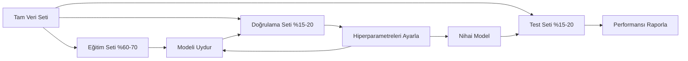

# Model Değerlendirmesi

> Bir model, ancak onu ölçtüğün şekilde kadar iyidir.

**Tür:** Yapım
**Diller:** Python
**Ön koşullar:** Faz 1 (Olasılık & Dağılımlar, ML için İstatistik), Faz 2 Dersler 1-8
**Süre:** ~90 dakika

## Öğrenme Hedefleri

- Sıfırdan K-fold ve stratified K-fold cross-validation uygula ve stratifikasyonun dengesiz veri için neden önemli olduğunu açıkla
- Sıfırdan precision, recall, F1, AUC-ROC ve regresyon metriklerini (MSE, RMSE, MAE, R-kare) hesapla
- Bir modelin yüksek bias mı yoksa yüksek variance'tan mı muzdarip olduğunu teşhis etmek için learning curve'leri yorumla
- Data leakage, yanlış metrik seçimi ve test seti kontaminasyonu dahil yaygın değerlendirme hatalarını belirle

## Sorun

Bir model eğittin. Verinde %95 accuracy alıyor. İyi mi?

Belki. Belki değil. Verinin %95'i tek bir sınıfa aitse, her zaman o sınıfı tahmin eden bir model %95 accuracy alır ama tamamen işe yaramazdır. Eğittiğin veriyle aynı veride değerlendirdiysen, %95 sayısı anlamsızdır çünkü model sadece cevapları ezberlemiştir. Veri setinin zaman bileşeni varsa ve böl­meden önce rastgele karıştırdıysan, modelin geçmişi tahmin etmek için gelecekteki veriyi kullanıyor olabilir.

Model değerlendirmesi, çoğu ML projesinin yanlış gittiği yerdir. Yanlış metrik kötü bir modeli iyi gösterir. Yanlış bölünme modelin hile yapmasına izin verir. Yanlış karşılaştırma daha kötü modeli seçmene neden olur. Değerlendirmeyi doğru yapmak opsiyonel değildir. Üretimde çalışan bir model ile gerçek veriyi gördüğü an başarısız olan bir model arasındaki farktır.

## Kavram

### Eğitim, Doğrulama, Test



Üç bölünme, üç amaç:

- **Eğitim seti**: model bu veriden öğrenir. Eğitim sırasında bu örnekleri görür.
- **Doğrulama seti**: hiperparametreleri ayarlamak ve modeller arasında seçim yapmak için kullanılır. Model bu veride hiç eğitilmez ama kararların ondan etkilenir.
- **Test seti**: tam olarak bir kez dokunulur, en sonunda, nihai performansı raporlamak için. Test performansına bakıp sonra modelini değiştirmek için geri dönersen, artık test seti değildir. İkinci bir doğrulama seti olmuştur.

Test seti, raporlanan performansın modelin gerçekten görülmemiş veride nasıl performans göstereceğini yansıttığının senin hold-out garantisidir.

### K-Fold Cross-Validation

Küçük veri setlerinde, tek bir train/validation bölünmesi veriyi israf eder ve gürültülü tahminler verir. K-fold cross-validation tüm veriyi hem eğitim hem de doğrulama için kullanır:

```mermaid
flowchart TB
    subgraph Fold1["Fold 1"]
        direction LR
        V1["Val"] --- T1a["Train"] --- T1b["Train"] --- T1c["Train"] --- T1d["Train"]
    end
    subgraph Fold2["Fold 2"]
        direction LR
        T2a["Train"] --- V2["Val"] --- T2b["Train"] --- T2c["Train"] --- T2d["Train"]
    end
    subgraph Fold3["Fold 3"]
        direction LR
        T3a["Train"] --- T3b["Train"] --- V3["Val"] --- T3c["Train"] --- T3d["Train"]
    end
    subgraph Fold4["Fold 4"]
        direction LR
        T4a["Train"] --- T4b["Train"] --- T4c["Train"] --- V4["Val"] --- T4d["Train"]
    end
    subgraph Fold5["Fold 5"]
        direction LR
        T5a["Train"] --- T5b["Train"] --- T5c["Train"] --- T5d["Train"] --- V5["Val"]
    end
    Fold1 --> R["Skorların ortalamasını al"]
    Fold2 --> R
    Fold3 --> R
    Fold4 --> R
    Fold5 --> R
```



1. Veriyi K eşit boyutlu fold'a böl
2. Her fold için, K-1 fold üzerinde eğit ve kalan fold üzerinde doğrula
3. K doğrulama skorunun ortalamasını al

K=5 veya K=10 standart seçimlerdir. Her veri noktası tam olarak bir kez doğrulama için kullanılır. Ortalama skor, herhangi bir tek bölünmeden daha kararlı bir tahmindir.

**Stratified K-fold**: her fold'daki sınıf dağılımını korur. Veri setin %70 A sınıfı ve %30 B sınıfı ise, her fold yaklaşık aynı orana sahip olur. Bu, rastgele bir bölünmenin tüm azınlık örneklerini tek bir fold'a koyabileceği dengesiz veri setleri için önemlidir.

### Sınıflandırma Metrikleri

**Confusion matrix**: temel. İkili sınıflandırma için:

|  | Pozitif Tahmin | Negatif Tahmin |
|--|---|---|
| Gerçekte Pozitif | True Positive (TP) | False Negative (FN) |
| Gerçekte Negatif | False Positive (FP) | True Negative (TN) |

Bu matristen, diğer tüm metrikler türetilir:

- **Accuracy** = (TP + TN) / (TP + TN + FP + FN). Doğru tahminlerin oranı. Sınıflar dengesiz olduğunda yanıltıcı.
- **Precision** = TP / (TP + FP). Pozitif olarak tahmin edilen her şeyden, kaç tanesi gerçekten öyleydi? False positive'lerin maliyetli olduğunda kullan (örn., gerçek e-postayı spam olarak işaretleyen spam filtresi).
- **Recall** (sensitivity) = TP / (TP + FN). Tüm gerçek pozitiflerden, kaç tanesini yakaladık? False negative'lerin maliyetli olduğunda kullan (örn., bir tümörü kaçıran kanser taraması).
- **F1 skoru** = 2 * precision * recall / (precision + recall). Precision ve recall'un harmonik ortalaması. Hiçbiri açık bir şekilde baskın gelmediğinde her ikisini de dengeler.
- **AUC-ROC**: Receiver Operating Characteristic eğrisi altındaki alan. Çeşitli sınıflandırma eşiklerinde true positive rate'i false positive rate'e karşı çizer. AUC = 0.5 rastgele tahmin, AUC = 1.0 mükemmel ayrım anlamına gelir. Eşikten bağımsızdır: modelin pozitifleri negatiflerin üstüne ne kadar iyi sıraladığını ölçer, seçtiğin kesim noktasından bağımsız olarak.

### Regresyon Metrikleri

- **MSE** (Mean Squared Error) = mean((y_true - y_pred)^2). Büyük hataları kuadratik olarak cezalandırır. Aykırı değerlere duyarlı.
- **RMSE** (Root Mean Squared Error) = sqrt(MSE). Target değişkeniyle aynı birimde. MSE'den daha kolay yorumlanır.
- **MAE** (Mean Absolute Error) = mean(|y_true - y_pred|). Tüm hatalara doğrusal muamele eder. MSE'den aykırı değerlere daha dayanıklı.
- **R-kare** = 1 - SS_res / SS_tot, burada SS_res = sum((y_true - y_pred)^2) ve SS_tot = sum((y_true - y_mean)^2). Modelin açıkladığı varyans kesri. R^2 = 1.0 mükemmel. R^2 = 0.0, modelin her zaman ortalamayı tahmin etmekten iyi olmadığı anlamına gelir. R^2, model ortalamadan kötüyse negatif olabilir.

### Learning Curve'ler

Eğitim ve doğrulama skorlarını eğitim seti boyutunun bir fonksiyonu olarak çiz:

- **Yüksek bias (underfitting)**: her iki eğri de düşük bir skora yakınsar. Daha fazla veri eklemek yardımcı olmaz. Daha karmaşık bir modele ihtiyacın var.
- **Yüksek variance (overfitting)**: eğitim skoru yüksek ama doğrulama skoru çok daha düşük. Aralarındaki boşluk büyük. Daha fazla veri eklemek yardımcı olmalı.

### Validation Curve'ler

Eğitim ve doğrulama skorlarını bir hiperparametrenin fonksiyonu olarak çiz:

- Düşük karmaşıklıkta: her iki skor da düşük (underfitting)
- Doğru karmaşıklıkta: her iki skor da yüksek ve birbirine yakın
- Yüksek karmaşıklıkta: eğitim skoru yüksek kalır ama doğrulama skoru düşer (overfitting)

Optimal hiperparametre değeri, doğrulama skorunun zirve yaptığı yerdir.

### Yaygın Değerlendirme Hataları

**Data leakage**: test setinden bilgi eğitime sızar. Örnekler: bölmeden önce tüm veri setine bir scaler uydurma, zaman serisi tahmininde gelecekteki veriyi dahil etme, target'tan türetilmiş bir feature kullanma. Her zaman önce böl, sonra ön işle.

**Sınıf dengesizliği**: işlemlerin %99'u meşru, %1'i sahtekarlık. Her zaman "meşru" tahmin eden bir model %99 accuracy alır. Bunun yerine precision, recall, F1 veya AUC-ROC kullan.

**Yanlış metrik**: recall'u optimize etmen gerektiğinde accuracy'yi optimize etmek (tıbbi teşhis) veya verinde ağır aykırı değerler varken RMSE'yi optimize etmek (bunun yerine MAE kullan).

**Stratified bölünme kullanmamak**: dengesiz veride, rastgele bir bölünme doğrulama fold'una çok az azınlık örneği koyabilir, kararsız tahminler verir.

**Çok sık test etmek**: test performansına her baktığında ve ayarlandığında, test setine overfit yapıyorsundur. Test seti tek kullanımlıktır.

## İnşa Et

### Adım 1: Train/validation/test bölünmesi

```python
import random
import math


def train_val_test_split(X, y, train_ratio=0.6, val_ratio=0.2, seed=42):
    random.seed(seed)
    n = len(X)
    indices = list(range(n))
    random.shuffle(indices)

    train_end = int(n * train_ratio)
    val_end = int(n * (train_ratio + val_ratio))

    train_idx = indices[:train_end]
    val_idx = indices[train_end:val_end]
    test_idx = indices[val_end:]

    X_train = [X[i] for i in train_idx]
    y_train = [y[i] for i in train_idx]
    X_val = [X[i] for i in val_idx]
    y_val = [y[i] for i in val_idx]
    X_test = [X[i] for i in test_idx]
    y_test = [y[i] for i in test_idx]

    return X_train, y_train, X_val, y_val, X_test, y_test
```

### Adım 2: K-fold ve stratified K-fold cross-validation

```python
def kfold_split(n, k=5, seed=42):
    random.seed(seed)
    indices = list(range(n))
    random.shuffle(indices)

    fold_size = n // k
    folds = []

    for i in range(k):
        start = i * fold_size
        end = start + fold_size if i < k - 1 else n
        val_idx = indices[start:end]
        train_idx = indices[:start] + indices[end:]
        folds.append((train_idx, val_idx))

    return folds


def stratified_kfold_split(y, k=5, seed=42):
    random.seed(seed)

    class_indices = {}
    for i, label in enumerate(y):
        class_indices.setdefault(label, []).append(i)

    for label in class_indices:
        random.shuffle(class_indices[label])

    folds = [{"train": [], "val": []} for _ in range(k)]

    for label, indices in class_indices.items():
        fold_size = len(indices) // k
        for i in range(k):
            start = i * fold_size
            end = start + fold_size if i < k - 1 else len(indices)
            val_part = indices[start:end]
            train_part = indices[:start] + indices[end:]
            folds[i]["val"].extend(val_part)
            folds[i]["train"].extend(train_part)

    return [(f["train"], f["val"]) for f in folds]


def cross_validate(X, y, model_fn, k=5, metric_fn=None, stratified=False):
    n = len(X)

    if stratified:
        folds = stratified_kfold_split(y, k)
    else:
        folds = kfold_split(n, k)

    scores = []
    for train_idx, val_idx in folds:
        X_train = [X[i] for i in train_idx]
        y_train = [y[i] for i in train_idx]
        X_val = [X[i] for i in val_idx]
        y_val = [y[i] for i in val_idx]

        model = model_fn()
        model.fit(X_train, y_train)
        predictions = [model.predict(x) for x in X_val]

        if metric_fn:
            score = metric_fn(y_val, predictions)
        else:
            score = sum(1 for yt, yp in zip(y_val, predictions) if yt == yp) / len(y_val)
        scores.append(score)

    return scores
```

### Adım 3: Confusion matrix ve sınıflandırma metrikleri

```python
def confusion_matrix(y_true, y_pred):
    tp = sum(1 for yt, yp in zip(y_true, y_pred) if yt == 1 and yp == 1)
    tn = sum(1 for yt, yp in zip(y_true, y_pred) if yt == 0 and yp == 0)
    fp = sum(1 for yt, yp in zip(y_true, y_pred) if yt == 0 and yp == 1)
    fn = sum(1 for yt, yp in zip(y_true, y_pred) if yt == 1 and yp == 0)
    return tp, tn, fp, fn


def accuracy(y_true, y_pred):
    tp, tn, fp, fn = confusion_matrix(y_true, y_pred)
    total = tp + tn + fp + fn
    return (tp + tn) / total if total > 0 else 0.0


def precision(y_true, y_pred):
    tp, tn, fp, fn = confusion_matrix(y_true, y_pred)
    return tp / (tp + fp) if (tp + fp) > 0 else 0.0


def recall(y_true, y_pred):
    tp, tn, fp, fn = confusion_matrix(y_true, y_pred)
    return tp / (tp + fn) if (tp + fn) > 0 else 0.0


def f1_score(y_true, y_pred):
    p = precision(y_true, y_pred)
    r = recall(y_true, y_pred)
    return 2 * p * r / (p + r) if (p + r) > 0 else 0.0


def roc_curve(y_true, y_scores):
    thresholds = sorted(set(y_scores), reverse=True)
    tpr_list = []
    fpr_list = []

    total_positives = sum(y_true)
    total_negatives = len(y_true) - total_positives

    for threshold in thresholds:
        y_pred = [1 if s >= threshold else 0 for s in y_scores]
        tp = sum(1 for yt, yp in zip(y_true, y_pred) if yt == 1 and yp == 1)
        fp = sum(1 for yt, yp in zip(y_true, y_pred) if yt == 0 and yp == 1)

        tpr = tp / total_positives if total_positives > 0 else 0.0
        fpr = fp / total_negatives if total_negatives > 0 else 0.0

        tpr_list.append(tpr)
        fpr_list.append(fpr)

    return fpr_list, tpr_list, thresholds


def auc_roc(y_true, y_scores):
    fpr_list, tpr_list, _ = roc_curve(y_true, y_scores)

    pairs = sorted(zip(fpr_list, tpr_list))
    fpr_sorted = [p[0] for p in pairs]
    tpr_sorted = [p[1] for p in pairs]

    area = 0.0
    for i in range(1, len(fpr_sorted)):
        width = fpr_sorted[i] - fpr_sorted[i - 1]
        height = (tpr_sorted[i] + tpr_sorted[i - 1]) / 2
        area += width * height

    return area
```

### Adım 4: Regresyon metrikleri

```python
def mse(y_true, y_pred):
    n = len(y_true)
    return sum((yt - yp) ** 2 for yt, yp in zip(y_true, y_pred)) / n


def rmse(y_true, y_pred):
    return math.sqrt(mse(y_true, y_pred))


def mae(y_true, y_pred):
    n = len(y_true)
    return sum(abs(yt - yp) for yt, yp in zip(y_true, y_pred)) / n


def r_squared(y_true, y_pred):
    mean_y = sum(y_true) / len(y_true)
    ss_res = sum((yt - yp) ** 2 for yt, yp in zip(y_true, y_pred))
    ss_tot = sum((yt - mean_y) ** 2 for yt in y_true)
    if ss_tot == 0:
        return 0.0
    return 1.0 - ss_res / ss_tot
```

### Adım 5: Learning curve'ler

```python
def learning_curve(X, y, model_fn, metric_fn, train_sizes=None, val_ratio=0.2, seed=42):
    random.seed(seed)
    n = len(X)
    indices = list(range(n))
    random.shuffle(indices)

    val_size = int(n * val_ratio)
    val_idx = indices[:val_size]
    pool_idx = indices[val_size:]

    X_val = [X[i] for i in val_idx]
    y_val = [y[i] for i in val_idx]

    if train_sizes is None:
        train_sizes = [int(len(pool_idx) * r) for r in [0.1, 0.2, 0.4, 0.6, 0.8, 1.0]]

    train_scores = []
    val_scores = []

    for size in train_sizes:
        subset = pool_idx[:size]
        X_train = [X[i] for i in subset]
        y_train = [y[i] for i in subset]

        model = model_fn()
        model.fit(X_train, y_train)

        train_pred = [model.predict(x) for x in X_train]
        val_pred = [model.predict(x) for x in X_val]

        train_scores.append(metric_fn(y_train, train_pred))
        val_scores.append(metric_fn(y_val, val_pred))

    return train_sizes, train_scores, val_scores
```

### Adım 6: Test için basit bir sınıflandırıcı, artı tam demo

```python
class SimpleLogistic:
    def __init__(self, lr=0.1, epochs=100):
        self.lr = lr
        self.epochs = epochs
        self.weights = None
        self.bias = 0.0

    def sigmoid(self, z):
        z = max(-500, min(500, z))
        return 1.0 / (1.0 + math.exp(-z))

    def fit(self, X, y):
        n_features = len(X[0])
        self.weights = [0.0] * n_features
        self.bias = 0.0

        for _ in range(self.epochs):
            for xi, yi in zip(X, y):
                z = sum(w * x for w, x in zip(self.weights, xi)) + self.bias
                pred = self.sigmoid(z)
                error = yi - pred
                for j in range(n_features):
                    self.weights[j] += self.lr * error * xi[j]
                self.bias += self.lr * error

    def predict_proba(self, x):
        z = sum(w * xi for w, xi in zip(self.weights, x)) + self.bias
        return self.sigmoid(z)

    def predict(self, x):
        return 1 if self.predict_proba(x) >= 0.5 else 0


class SimpleLinearRegression:
    def __init__(self, lr=0.001, epochs=200):
        self.lr = lr
        self.epochs = epochs
        self.weights = None
        self.bias = 0.0

    def fit(self, X, y):
        n_features = len(X[0])
        self.weights = [0.0] * n_features
        self.bias = 0.0
        n = len(X)

        for _ in range(self.epochs):
            for xi, yi in zip(X, y):
                pred = sum(w * x for w, x in zip(self.weights, xi)) + self.bias
                error = yi - pred
                for j in range(n_features):
                    self.weights[j] += self.lr * error * xi[j] / n
                self.bias += self.lr * error / n

    def predict(self, x):
        return sum(w * xi for w, xi in zip(self.weights, x)) + self.bias


def standardize(values):
    n = len(values)
    mean = sum(values) / n
    var = sum((v - mean) ** 2 for v in values) / n
    std = math.sqrt(var) if var > 0 else 1.0
    return [(v - mean) / std for v in values], mean, std


def make_classification_data(n=300, seed=42):
    random.seed(seed)
    X = []
    y = []
    for _ in range(n):
        x1 = random.gauss(0, 1)
        x2 = random.gauss(0, 1)
        label = 1 if (x1 + x2 + random.gauss(0, 0.5)) > 0 else 0
        X.append([x1, x2])
        y.append(label)
    return X, y


def make_regression_data(n=200, seed=42):
    random.seed(seed)
    X = []
    y = []
    for _ in range(n):
        x1 = random.uniform(0, 10)
        x2 = random.uniform(0, 5)
        target = 3 * x1 + 2 * x2 + random.gauss(0, 2)
        X.append([x1, x2])
        y.append(target)
    return X, y


def make_imbalanced_data(n=300, minority_ratio=0.05, seed=42):
    random.seed(seed)
    X = []
    y = []
    for _ in range(n):
        if random.random() < minority_ratio:
            x1 = random.gauss(3, 0.5)
            x2 = random.gauss(3, 0.5)
            label = 1
        else:
            x1 = random.gauss(0, 1)
            x2 = random.gauss(0, 1)
            label = 0
        X.append([x1, x2])
        y.append(label)
    return X, y


if __name__ == "__main__":
    X_clf, y_clf = make_classification_data(300)

    print("=== Train/Validation/Test Split ===")
    X_train, y_train, X_val, y_val, X_test, y_test = train_val_test_split(X_clf, y_clf)
    print(f"  Train: {len(X_train)}, Val: {len(X_val)}, Test: {len(X_test)}")
    print(f"  Train class distribution: {sum(y_train)}/{len(y_train)} positive")
    print(f"  Val class distribution: {sum(y_val)}/{len(y_val)} positive")

    model = SimpleLogistic(lr=0.1, epochs=200)
    model.fit(X_train, y_train)

    print("\n=== Classification Metrics ===")
    y_pred = [model.predict(x) for x in X_test]
    tp, tn, fp, fn = confusion_matrix(y_test, y_pred)
    print(f"  Confusion matrix: TP={tp}, TN={tn}, FP={fp}, FN={fn}")
    print(f"  Accuracy:  {accuracy(y_test, y_pred):.4f}")
    print(f"  Precision: {precision(y_test, y_pred):.4f}")
    print(f"  Recall:    {recall(y_test, y_pred):.4f}")
    print(f"  F1 Score:  {f1_score(y_test, y_pred):.4f}")

    y_scores = [model.predict_proba(x) for x in X_test]
    auc = auc_roc(y_test, y_scores)
    print(f"  AUC-ROC:   {auc:.4f}")

    print("\n=== K-Fold Cross-Validation (K=5) ===")
    cv_scores = cross_validate(
        X_clf, y_clf,
        model_fn=lambda: SimpleLogistic(lr=0.1, epochs=200),
        k=5,
        metric_fn=accuracy,
    )
    mean_cv = sum(cv_scores) / len(cv_scores)
    std_cv = math.sqrt(sum((s - mean_cv) ** 2 for s in cv_scores) / len(cv_scores))
    print(f"  Fold scores: {[round(s, 4) for s in cv_scores]}")
    print(f"  Mean: {mean_cv:.4f} (+/- {std_cv:.4f})")

    print("\n=== Stratified K-Fold Cross-Validation (K=5) ===")
    strat_scores = cross_validate(
        X_clf, y_clf,
        model_fn=lambda: SimpleLogistic(lr=0.1, epochs=200),
        k=5,
        metric_fn=accuracy,
        stratified=True,
    )
    strat_mean = sum(strat_scores) / len(strat_scores)
    strat_std = math.sqrt(sum((s - strat_mean) ** 2 for s in strat_scores) / len(strat_scores))
    print(f"  Fold scores: {[round(s, 4) for s in strat_scores]}")
    print(f"  Mean: {strat_mean:.4f} (+/- {strat_std:.4f})")

    print("\n=== Imbalanced Data: Why Accuracy Lies ===")
    X_imb, y_imb = make_imbalanced_data(300, minority_ratio=0.05)
    positives = sum(y_imb)
    print(f"  Class distribution: {positives} positive, {len(y_imb) - positives} negative ({positives/len(y_imb)*100:.1f}% positive)")

    always_negative = [0] * len(y_imb)
    print(f"  Always-negative baseline:")
    print(f"    Accuracy:  {accuracy(y_imb, always_negative):.4f}")
    print(f"    Precision: {precision(y_imb, always_negative):.4f}")
    print(f"    Recall:    {recall(y_imb, always_negative):.4f}")
    print(f"    F1 Score:  {f1_score(y_imb, always_negative):.4f}")

    X_tr_i, y_tr_i, X_v_i, y_v_i, X_te_i, y_te_i = train_val_test_split(X_imb, y_imb)
    model_imb = SimpleLogistic(lr=0.5, epochs=500)
    model_imb.fit(X_tr_i, y_tr_i)
    y_pred_imb = [model_imb.predict(x) for x in X_te_i]
    print(f"\n  Trained model on imbalanced data:")
    print(f"    Accuracy:  {accuracy(y_te_i, y_pred_imb):.4f}")
    print(f"    Precision: {precision(y_te_i, y_pred_imb):.4f}")
    print(f"    Recall:    {recall(y_te_i, y_pred_imb):.4f}")
    print(f"    F1 Score:  {f1_score(y_te_i, y_pred_imb):.4f}")

    print("\n=== Regression Metrics ===")
    X_reg, y_reg = make_regression_data(200)

    col0 = [x[0] for x in X_reg]
    col1 = [x[1] for x in X_reg]
    col0_s, m0, s0 = standardize(col0)
    col1_s, m1, s1 = standardize(col1)
    X_reg_scaled = [[col0_s[i], col1_s[i]] for i in range(len(X_reg))]

    X_tr_r, y_tr_r, X_v_r, y_v_r, X_te_r, y_te_r = train_val_test_split(X_reg_scaled, y_reg)
    reg_model = SimpleLinearRegression(lr=0.01, epochs=500)
    reg_model.fit(X_tr_r, y_tr_r)
    y_pred_r = [reg_model.predict(x) for x in X_te_r]

    print(f"  MSE:       {mse(y_te_r, y_pred_r):.4f}")
    print(f"  RMSE:      {rmse(y_te_r, y_pred_r):.4f}")
    print(f"  MAE:       {mae(y_te_r, y_pred_r):.4f}")
    print(f"  R-squared: {r_squared(y_te_r, y_pred_r):.4f}")

    mean_baseline = [sum(y_tr_r) / len(y_tr_r)] * len(y_te_r)
    print(f"\n  Mean baseline:")
    print(f"    MSE:       {mse(y_te_r, mean_baseline):.4f}")
    print(f"    R-squared: {r_squared(y_te_r, mean_baseline):.4f}")

    print("\n=== Learning Curve ===")
    sizes, train_sc, val_sc = learning_curve(
        X_clf, y_clf,
        model_fn=lambda: SimpleLogistic(lr=0.1, epochs=200),
        metric_fn=accuracy,
    )
    print(f"  {'Size':>6} {'Train':>8} {'Val':>8}")
    for s, tr, va in zip(sizes, train_sc, val_sc):
        print(f"  {s:>6} {tr:>8.4f} {va:>8.4f}")

    print("\n=== Statistical Model Comparison ===")
    model_a_scores = cross_validate(
        X_clf, y_clf,
        model_fn=lambda: SimpleLogistic(lr=0.1, epochs=100),
        k=5, metric_fn=accuracy,
    )
    model_b_scores = cross_validate(
        X_clf, y_clf,
        model_fn=lambda: SimpleLogistic(lr=0.1, epochs=500),
        k=5, metric_fn=accuracy,
    )
    diffs = [a - b for a, b in zip(model_a_scores, model_b_scores)]
    mean_diff = sum(diffs) / len(diffs)
    std_diff = math.sqrt(sum((d - mean_diff) ** 2 for d in diffs) / len(diffs))
    t_stat = mean_diff / (std_diff / math.sqrt(len(diffs))) if std_diff > 0 else 0.0
    print(f"  Model A (100 epochs) mean: {sum(model_a_scores)/len(model_a_scores):.4f}")
    print(f"  Model B (500 epochs) mean: {sum(model_b_scores)/len(model_b_scores):.4f}")
    print(f"  Mean difference: {mean_diff:.4f}")
    print(f"  Paired t-statistic: {t_stat:.4f}")
    print(f"  (|t| > 2.78 for significance at p<0.05 with df=4)")
```

## Kullan

scikit-learn ile değerlendirme iş akışına gömülüdür:

```python
from sklearn.model_selection import cross_val_score, StratifiedKFold, learning_curve
from sklearn.metrics import (
    accuracy_score, precision_score, recall_score, f1_score,
    roc_auc_score, confusion_matrix, mean_squared_error, r2_score,
)
from sklearn.linear_model import LogisticRegression

model = LogisticRegression()
scores = cross_val_score(model, X, y, cv=StratifiedKFold(5), scoring="f1")
```

Sıfırdan versiyonlar cross-validation'ın tam olarak ne yaptığını (sihir yok, sadece for-loop'lar ve indeks takibi), her metriğin nasıl hesaplandığını (sadece TP/FP/TN/FN sayma) ve stratifikasyonun neden önemli olduğunu (her fold'da sınıf oranlarının korunması) gösterir. Kütüphane versiyonları paralellik, daha fazla skorlama seçeneği ve pipeline'larla entegrasyon ekler.

## Yayınla

Bu ders şunları üretir:
- `outputs/skill-evaluation.md` - sınıflandırma ve regresyon modelleri için değerlendirme stratejisini kapsayan bir skill

## Alıştırmalar

1. Precision-recall eğrilerini uygula: farklı eşiklerde precision'ı recall'a karşı çiz. Ortalama precision'ı hesapla (PR eğrisi altındaki alan). Dengesiz bir veri setinde PR eğrisini ROC eğrisine karşı karşılaştır ve her birinin ne zaman daha bilgilendirici olduğunu açıkla.
2. İç içe bir cross-validation döngüsü inşa et: dış döngü model performansını değerlendirir, iç döngü hiperparametreleri ayarlar. Doğrulama verisini değerlendirmeye sızdırmadan iki modeli adil şekilde karşılaştırmak için onu kullan.
3. Model karşılaştırması için bir permütasyon testi uygula: etiketleri karıştır, yeniden eğit ve performansı ölç. Bir null dağılım oluşturmak için 100 kez tekrarla. Gözlenen model performansı için bu dağılıma karşı p-değerini hesapla.

## Anahtar Terimler

| Terim | İnsanlar ne der | Aslında ne demek |
|------|----------------|----------------------|
| Overfitting | "Eğitim verisini ezberleme" | Model eğitim verisindeki gürültüyü yakalar, eğitimde iyi ama görülmemiş veride kötü performans gösterir |
| Cross-validation | "Farklı alt kümelerde test etmek" | Doğrulama için hangi veri parçasının kullanılacağını sistematik olarak döndürmek, tüm rotasyonlardaki sonuçların ortalamasını almak |
| Precision | "Tahmin edilen pozitiflerin kaçının doğru olduğu" | TP / (TP + FP): pozitif tahminlerin gerçekten pozitif olan kesri |
| Recall | "Gerçek pozitiflerin kaçını bulduğumuz" | TP / (TP + FN): doğru tanımlanan gerçek pozitiflerin kesri |
| AUC-ROC | "Modelin sınıfları ne kadar iyi ayırdığı" | Tüm eşiklerde true positive rate ile false positive rate eğrisinin altındaki alan, 0.5 (rastgele) ile 1.0 (mükemmel) arası |
| R-kare | "Ne kadar varyansın açıklandığı" | 1 - (kalıntıların kare toplamı / toplam kare toplamı): modelin yakaladığı target varyansının kesri |
| Data leakage | "Model hile yaptı" | Eğitim sırasında, tahmin zamanında bulunmayacak bilgileri kullanmak, iyimser değerlendirmeye yol açar |
| Learning curve | "Performansın daha fazla veriyle nasıl değiştiği" | Eğitim seti boyutuna karşı eğitim ve doğrulama skorlarının grafiği, underfitting veya overfitting'i ortaya çıkarır |
| Stratified bölünme | "Sınıf oranlarını dengede tutmak" | Her alt kümenin tam veri setiyle aynı her sınıf oranına sahip olacak şekilde veriyi bölmek |

## Daha Fazla Okuma

- [scikit-learn Model Selection Guide](https://scikit-learn.org/stable/model_selection.html) - cross-validation, metrikler ve hiperparametre ayarlama üzerine kapsamlı referans
- [Beyond Accuracy: Precision and Recall (Google ML Crash Course)](https://developers.google.com/machine-learning/crash-course/classification/precision-and-recall) - etkileşimli örneklerle net açıklama
- [A Survey of Cross-Validation Procedures (Arlot & Celisse, 2010)](https://projecteuclid.org/journals/statistics-surveys/volume-4/issue-none/A-survey-of-cross-validation-procedures-for-model-selection/10.1214/09-SS054.full) - farklı CV stratejilerinin ne zaman ve neden çalıştığına dair titiz inceleme
