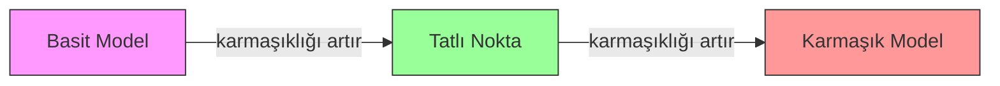
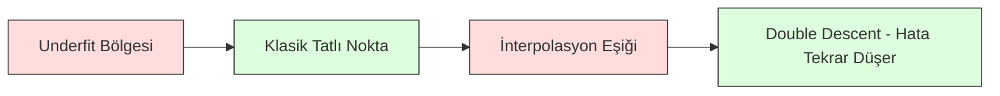
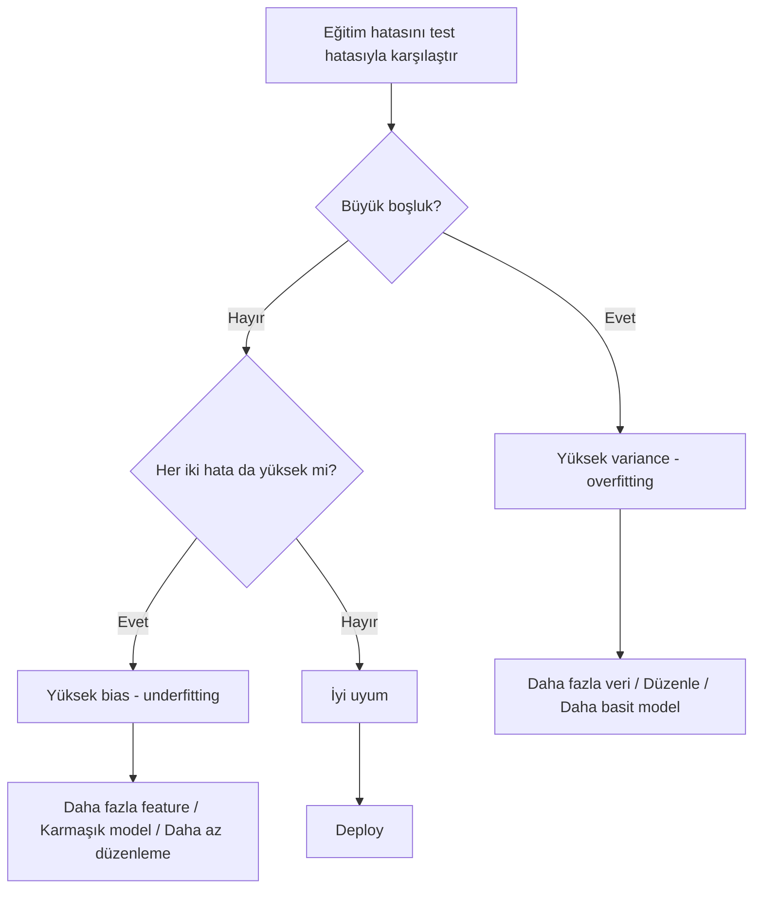
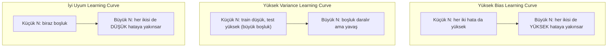
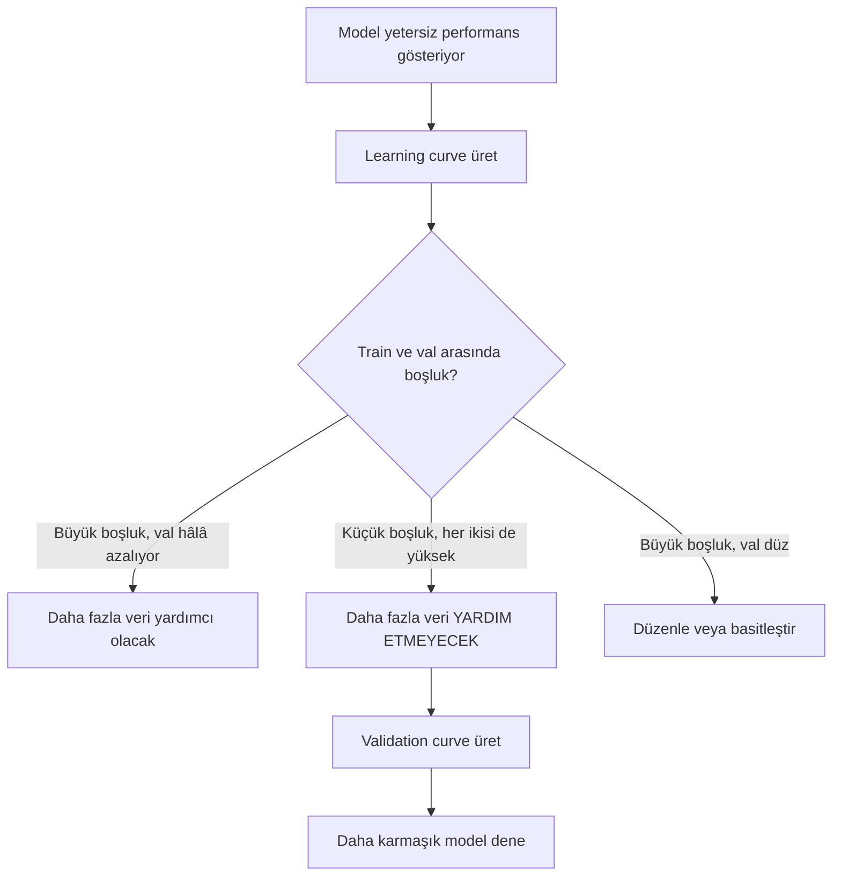

# Bias-Variance Dengesi

> Her model hatası üç kaynaktan birinden gelir: bias, variance veya gürültü. Sadece ilk ikisini kontrol edebilirsin.

**Tür:** Öğrenim
**Dil:** Python
**Ön koşullar:** Faz 2, Dersler 01-09 (ML temelleri, regresyon, sınıflandırma, değerlendirme)
**Süre:** ~75 dakika

## Öğrenme Hedefleri

- Beklenen tahmin hatasının bias-variance ayrışımını türet ve indirgenemez gürültünün rolünü açıkla
- Eğitim ve test hatası örüntülerini kullanarak bir modelin yüksek bias mı yoksa yüksek variance'tan mı muzdarip olduğunu teşhis et
- Düzenleme tekniklerinin (L1, L2, dropout, erken durdurma) bias'ı variance ile nasıl takas ettiğini açıkla
- Artan karmaşıklıktaki modeller arasında bias-variance dengesini görselleştiren deneyler uygula

## Sorun

Bir model eğittin. Test verisinde biraz hatası var. O hata nereden geliyor?

Modelin çok basitse (eğri bir veri setinde doğrusal regresyon), gerçek örüntüyü tutarlı bir şekilde kaçırır. Bu bias'tır. Modelin çok karmaşıksa (15 veri noktasında 20. dereceden polinom), eğitim verisine mükemmel uyar ama yeni veride çılgınca farklı tahminler verir. Bu variance'tır.

Sabit bir model kapasitesi için her ikisini de aynı anda minimize edemezsin. Bias'ı aşağı it, variance yukarı çıkar. Variance'ı aşağı it, bias yukarı çıkar. Bu dengeyi anlamak makine öğrenmesinde sahip olduğun en faydalı tek teşhis becerisidir. Modeli daha karmaşık mı yoksa daha az karmaşık mı yapacağını, daha fazla veri mi alacağını yoksa daha iyi feature mı tasarlayacağını, daha çok mu yoksa daha az mı düzenleyeceğini söyler.

## Kavram

### Bias: Sistematik Hata

Bias, modelinin ortalama tahmininin gerçek değerden ne kadar uzakta olduğunu ölçer. Aynı dağılımdan çekilen birçok farklı eğitim seti üzerinde aynı modeli eğitip tahminleri ortalarsan, bias o ortalama ile gerçek arasındaki boşluktur.

Yüksek bias, modelin gerçek örüntüyü yakalayamayacak kadar katı olduğu anlamına gelir. Bir parabole uydurulmuş düz bir çizgi, ne kadar veri verirsen ver eğriyi her zaman kaçırır. Bu underfitting'dir.

```
Yüksek bias (underfitting):
  Model her zaman kabaca aynı yanlış şeyi tahmin eder.
  Eğitim hatası: YÜKSEK
  Test hatası: YÜKSEK
  Aralarındaki boşluk: KÜÇÜK
```

### Variance: Eğitim Verisine Duyarlılık

Variance, farklı veri alt kümeleri üzerinde eğittiğinde tahminlerin ne kadar değiştiğini ölçer. Eğitim setindeki küçük değişiklikler modelde büyük değişikliklere neden oluyorsa, variance yüksektir.

Yüksek variance, modelin altta yatan sinyali değil, eğitim verisindeki gürültüyü uydurduğu anlamına gelir. 20. dereceden bir polinom her eğitim noktasından geçer ama aralarında çılgınca salınır. Bu overfitting'dir.

```
Yüksek variance (overfitting):
  Model eğitim verisine mükemmel uyar ama yeni veride başarısız olur.
  Eğitim hatası: DÜŞÜK
  Test hatası: YÜKSEK
  Aralarındaki boşluk: BÜYÜK
```

### Ayrışım

Herhangi bir x noktası için, karesel loss altında beklenen tahmin hatası tam olarak ayrışır:

```
Beklenen Hata = Bias^2 + Variance + İndirgenemez Gürültü

burada:
  Bias^2     = (E[f_hat(x)] - f(x))^2
  Variance   = E[(f_hat(x) - E[f_hat(x)])^2]
  Noise      = E[(y - f(x))^2]             (sigma^2)
```

- `f(x)` gerçek fonksiyondur
- `f_hat(x)` modelinin tahminidir
- `E[...]` farklı eğitim setleri üzerindeki beklentidir
- `y` gözlemlenen etikettir (gerçek fonksiyon artı gürültü)

Gürültü terimi indirgenemez. Hiçbir model gürültülü veride sigma^2'den daha iyisini yapamaz. Senin işin bias^2 ile variance arasındaki doğru dengeyi bulmaktır.

### Model Karmaşıklığı vs Hata



Klasik U-şeklindeki eğri:

| Karmaşıklık | Bias | Variance | Toplam Hata |
|-----------|------|----------|-------------|
| Çok düşük | YÜKSEK | DÜŞÜK | YÜKSEK (underfitting) |
| Tam doğru | ORTA | ORTA | EN DÜŞÜK |
| Çok yüksek | DÜŞÜK | YÜKSEK | YÜKSEK (overfitting) |

### Bias-Variance Kontrolü Olarak Düzenleme

Düzenleme, variance'ı azaltmak için bias'ı kasıtlı olarak artırır. Modelin gürültüyü kovalayamaması için modeli kısıtlar.

- **L2 (Ridge):** Tüm ağırlıkları sıfıra doğru küçültür. Tüm feature'ları tutar ama etkilerini azaltır.
- **L1 (Lasso):** Bazı ağırlıkları tam olarak sıfıra iter. Feature seçimi yapar.
- **Dropout:** Eğitim sırasında nöronları rastgele devre dışı bırakır. Gereksiz temsiller yapmaya zorlar.
- **Erken durdurma:** Model eğitim verisine tamamen uymadan eğitimi durdurur.

Düzenleme gücü (lambda, dropout oranı, epoch sayısı) bias-variance eğrisinde nerede oturduğunu doğrudan kontrol eder. Daha fazla düzenleme, daha fazla bias, daha az variance demektir.

### Double Descent: Modern Bakış Açısı

Klasik teori der ki: tatlı noktadan sonra, daha fazla karmaşıklık her zaman zarar verir. Ama 2019'dan beri yapılan araştırmalar beklenmedik bir şey gösterdi. Model kapasitesini interpolasyon eşiğinin (modelin eğitim verisine mükemmel uyacak kadar parametresi olduğu noktanın) çok ötesinde artırmaya devam edersen, test hatası tekrar azalabilir.



Bu "double descent" fenomeni, devasa aşırı-parametrize edilmiş sinir ağlarının (eğitim örneklerinden çok daha fazla parametresi olanların) neden hâlâ iyi genelleştirdiğini açıklar. Klasik bias-variance dengesi yanlış değildir, ama modern rejim için eksiktir.

Double descent hakkında temel gözlemler:
- Doğrusal modellerde, karar ağaçlarında ve sinir ağlarında olur
- İnterpolasyon bölgesinde daha fazla veri aslında zarar verebilir (sample-wise double descent)
- Daha fazla eğitim epoch'u da buna neden olabilir (epoch-wise double descent)
- Düzenleme zirveyi yumuşatır ama ortadan kaldırmaz

Bu neden olur? İnterpolasyon eşiğinde, modelin tüm eğitim noktalarını uydurmaya tam yetecek kapasitesi vardır. Her noktadan geçen çok belirli bir çözüme zorlanır ve verideki küçük bozulmalar uyumda büyük değişikliklere neden olur. Variance burada zirveye ulaşır. Eşiğin ötesinde, modelin veriyi mükemmel uyduran birçok olası çözümü vardır. Öğrenme algoritması (örn., örtük düzenleme ile gradient descent) aralarındaki en basit olanı seçme eğilimindedir. Basit çözümlere yönelik bu örtük bias, aşırı-parametrize modellerin neden genelleştirdiğini açıklar.

| Rejim | Parametreler vs Örnekler | Davranış |
|--------|----------------------|----------|
| Yetersiz parametrize | p << n | Klasik denge geçerli |
| İnterpolasyon eşiği | p ~ n | Variance zirveye ulaşır, test hatası fırlar |
| Aşırı parametrize | p >> n | Örtük düzenleme devreye girer, test hatası düşer |

Pratik amaçlar için: sinir ağları veya büyük ağaç ensemble'ları kullanıyorsan, interpolasyon eşiğinde durma. Ya iyi altında kal (açık düzenleme ile) ya da çok ötesine geç. Olabilecek en kötü yer tam eşikte olmaktır.

### Modelini Teşhis Etmek



| Belirti | Teşhis | Çözüm |
|---------|-----------|-----|
| Yüksek eğitim hatası, yüksek test hatası | Bias | Daha fazla feature, karmaşık model, daha az düzenleme |
| Düşük eğitim hatası, yüksek test hatası | Variance | Daha fazla veri, düzenleme, daha basit model, dropout |
| Düşük eğitim hatası, düşük test hatası | İyi uyum | Yayınla |
| Eğitim hatası azalıyor, test hatası artıyor | Overfitting devam ediyor | Erken durdurma |

### Pratik Stratejiler

**Bias sorun olduğunda:**
- Polinom veya etkileşim feature'ları ekle
- Daha esnek bir model kullan (doğrusal yerine ağaç ensemble'ı)
- Düzenleme gücünü azalt
- Daha uzun süre eğit (henüz yakınsamamışsa)

**Variance sorun olduğunda:**
- Daha fazla eğitim verisi al
- Bagging kullan (random forest)
- Düzenlemeyi artır (daha yüksek lambda, daha fazla dropout)
- Feature seçimi (gürültülü feature'ları kaldır)
- Erken tespit etmek için cross-validation kullan

### Ensemble Yöntemleri ve Variance Azaltma

Ensemble yöntemleri variance ile savaşmak için en pratik araçtır.

**Bagging (Bootstrap Aggregating)** eğitim verisinin farklı bootstrap örnekleri üzerinde birden fazla model eğitir, sonra tahminlerini ortalar. Her bireysel modelin yüksek variance'ı vardır ama ortalamanın çok daha düşük variance'ı vardır. Random forest, karar ağaçlarına uygulanmış bagging'dir.

Matematiksel olarak neden çalışır: her biri sigma^2 variance'ına sahip N bağımsız tahminin ortalamasını alırsan, ortalamanın variance'ı sigma^2 / N olur. Modeller gerçekten bağımsız değildir (hepsi benzer veriyi görür), bu yüzden azalma 1/N'den azdır ama yine de önemlidir.

**Boosting** modelleri sıralı olarak inşa ederek bias'ı azaltır; her yeni model şu ana kadarki ensemble'ın hatalarına odaklanır. Gradient boosting ve AdaBoost ana örneklerdir. Boosting çok fazla model eklersen overfit yapabilir, bu yüzden erken durdurma veya düzenlemeye ihtiyacın vardır.

| Yöntem | Birincil Etki | Bias Değişimi | Variance Değişimi |
|--------|---------------|-------------|-----------------|
| Bagging | Variance'ı azaltır | Değişmez | Azalır |
| Boosting | Bias'ı azaltır | Azalır | Artabilir |
| Stacking | Her ikisini de azaltır | Meta-öğreniciye bağlı | Temel modellere bağlı |
| Dropout | Örtük bagging | Hafif artış | Azalır |

**Pratik kural:** temel modelinin yüksek variance'ı varsa (derin ağaçlar, yüksek dereceli polinomlar), bagging kullan. Temel modelinin yüksek bias'ı varsa (sığ stump'lar, basit doğrusal modeller), boosting kullan.

### Learning Curve'ler

Learning curve'ler, eğitim ve doğrulama hatasını eğitim seti boyutunun bir fonksiyonu olarak çizer. Sahip olduğun en pratik teşhis aracıdırlar. Tek bir train/test karşılaştırmasının aksine, learning curve'ler sana modelinin yörüngesini gösterir ve daha fazla veri eklemenin yardımcı olup olmayacağını söyler.



Nasıl okunur:

| Senaryo | Eğitim Hatası | Doğrulama Hatası | Boşluk | Ne Anlama Gelir | Ne Yapmalı |
|----------|---------------|-----------------|-----|---------------|------------|
| Yüksek bias | Yüksek | Yüksek | Küçük | Model örüntüyü yakalayamaz | Daha fazla feature, karmaşık model, daha az düzenleme |
| Yüksek variance | Düşük | Yüksek | Büyük | Model eğitim verisini ezberler | Daha fazla veri, düzenleme, daha basit model |
| İyi uyum | Orta | Orta | Küçük | Model iyi genelleştirir | Yayınla |
| Yüksek variance, iyileşen | Düşük | Daha fazla veriyle azalıyor | Daralıyor | Verinin düzeltebileceği variance sorunu | Daha fazla veri topla |
| Yüksek bias, düz | Yüksek | Yüksek ve düz | Küçük ve düz | Daha fazla veri YARDIM ETMEZ | Model mimarisini değiştir |

Kritik içgörü: her iki eğri de plato yapmışsa ve boşluk küçük ama her iki hata da yüksekse, daha fazla veri işe yaramaz. Daha iyi bir modele ihtiyacın var. Boşluk büyük ve hâlâ daralıyorsa, daha fazla veri yardımcı olacaktır.

### Learning Curve'ler Nasıl Üretilir

İki yaklaşım vardır:

**Yaklaşım 1: Eğitim seti boyutunu değiştir, sabit model.** Modeli ve hiperparametreleri sabit tut. Eğitim verisinin artan büyüklükteki alt kümeleri üzerinde eğit. Her boyutta eğitim hatasını ve doğrulama hatasını ölç. Bu standart learning curve'dür.

**Yaklaşım 2: Model karmaşıklığını değiştir, sabit veri.** Veriyi sabit tut. Bir karmaşıklık parametresini (polinom derecesi, ağaç derinliği, katman sayısı) tara. Her karmaşıklıkta eğitim hatasını ve doğrulama hatasını ölç. Bu bir validation curve'dür ve bias-variance dengesini doğrudan gösterir.

Her iki yaklaşım birbirini tamamlar. Birincisi daha fazla verinin yardımcı olup olmayacağını söyler. İkincisi farklı bir modelin yardımcı olup olmayacağını söyler. Bir sonraki adımın hakkında karar vermeden önce her ikisini de çalıştır.



## İnşa Et

`code/bias_variance.py` içindeki kod, tam bias-variance ayrıştırma deneyini çalıştırır. İşte yaklaşım, adım adım.

### Adım 1: Bilinen Bir Fonksiyondan Sentetik Veri Üret

Gauss gürültüsüyle `f(x) = sin(1.5x) + 0.5x` kullanıyoruz. Gerçek fonksiyonu bilmek, kesin bias ve variance hesaplamamızı sağlar.

```python
def true_function(x):
    return np.sin(1.5 * x) + 0.5 * x

def generate_data(n_samples=30, noise_std=0.5, x_range=(-3, 3), seed=None):
    rng = np.random.RandomState(seed)
    x = rng.uniform(x_range[0], x_range[1], n_samples)
    y = true_function(x) + rng.normal(0, noise_std, n_samples)
    return x, y
```

### Adım 2: Bootstrap Örnekleme ve Polinom Uydurma

Her polinom derecesi için, birçok bootstrap eğitim seti çekiyoruz, polinomu uyduruyoruz ve sabit bir test grid üzerinde tahminleri kaydediyoruz. Bu bize her test noktasında tahminlerin bir dağılımını verir.

```python
def fit_polynomial(x_train, y_train, degree, lam=0.0):
    X = np.column_stack([x_train ** d for d in range(degree + 1)])
    if lam > 0:
        penalty = lam * np.eye(X.shape[1])
        penalty[0, 0] = 0
        w = np.linalg.solve(X.T @ X + penalty, X.T @ y_train)
    else:
        w = np.linalg.lstsq(X, y_train, rcond=None)[0]
    return w
```

200 farklı bootstrap örneği üzerinde uyduruyoruz. Her bootstrap örneği aynı altta yatan dağılımdan çekilir ama farklı noktalar içerir.

### Adım 3: Bias^2, Variance Ayrışımının Hesaplanması

Her test noktasında 200 tahmin setiyle, ayrıştırmayı doğrudan tanımdan hesaplayabiliriz:

```python
mean_pred = predictions.mean(axis=0)
bias_sq = np.mean((mean_pred - y_true) ** 2)
variance = np.mean(predictions.var(axis=0))
total_error = np.mean(np.mean((predictions - y_true) ** 2, axis=1))
```

- `mean_pred`, bootstrap örneklerinden tahmin edilen E[f_hat(x)]'dir
- `bias_sq`, ortalama tahmin ile gerçek arasındaki karesel boşluktur
- `variance`, bootstrap örnekleri arasındaki tahminlerin ortalama yayılmasıdır
- `total_error` yaklaşık olarak bias^2 + variance + gürültüye eşit olmalıdır

### Adım 4: Learning Curve'ler

Learning curve'ler, model karmaşıklığını sabit tutarken eğitim seti boyutunu tarar. Modelinin veri-sınırlı mı yoksa kapasite-sınırlı mı olduğunu gösterir.

```python
def demo_learning_curves():
    sizes = [10, 15, 20, 30, 50, 75, 100, 150, 200, 300]
    degree = 5

    for n in sizes:
        train_errors = []
        test_errors = []
        for seed in range(50):
            x_train, y_train = generate_data(n_samples=n, seed=seed * 100)
            w = fit_polynomial(x_train, y_train, degree)
            train_pred = predict_polynomial(x_train, w)
            train_mse = np.mean((train_pred - y_train) ** 2)
            test_pred = predict_polynomial(x_test, w)
            test_mse = np.mean((test_pred - y_test) ** 2)
            train_errors.append(train_mse)
            test_errors.append(test_mse)
        # Çalıştırmaların ortalaması learning curve noktasını verir
```

Yüksek variance'lı bir model için (küçük veriyle derece 5), şunu görürsün:
- Eğitim hatası düşük başlar ve daha fazla veri ezberlemeyi zorlaştırdıkça artar
- Test hatası yüksek başlar ve model daha fazla sinyal aldıkça azalır
- Boşluk daha fazla veriyle daralır

Yüksek bias'lı bir model için (derece 1), her iki hata da hızlı bir şekilde aynı yüksek değere yakınsar ve daha fazla veri yardımcı olmaz.

### Adım 5: Düzenleme Taraması

Kod ayrıca yüksek dereceli bir polinomu (derece 15) sabitleyen ve Ridge düzenleme gücünü 0.001'den 100'e tarayan `demo_regularization_sweep()` içerir. Bu bias-variance dengesini farklı bir açıdan gösterir: model karmaşıklığını değiştirmek yerine, kısıtlama gücünü değiştiriyoruz.

```python
def demo_regularization_sweep():
    alphas = [0.001, 0.005, 0.01, 0.05, 0.1, 0.5, 1.0, 5.0, 10.0, 50.0, 100.0]
    for alpha in alphas:
        results = bias_variance_decomposition([15], lam=alpha)
        r = results[15]
        print(f"alpha={alpha:.3f}  bias={r['bias_sq']:.4f}  var={r['variance']:.4f}")
```

Düşük alpha'da, derece-15 polinom neredeyse kısıtsızdır. Variance baskındır çünkü model her bootstrap örneğinde gürültüyü kovalar. Yüksek alpha'da, ceza o kadar güçlüdür ki model etkin olarak neredeyse-sabit bir fonksiyon haline gelir. Bias baskındır. Optimal alpha bu uç değerlerin arasındadır.

Bu, polinom derecesini değiştirmekten gelen aynı U-eğrisidir ama ayrık yerine sürekli bir düğmeyle kontrol edilir. Pratikte, düzenleme dengeyi kontrol etmenin tercih edilen yoludur çünkü feature setini değiştirmeden ince ayar yapmaya izin verir.

## Kullan

sklearn, bootstrap döngüleri yazmadan bu teşhisleri otomatikleştirmek için `learning_curve` ve `validation_curve` sağlar.

### Validation Curve: Model Karmaşıklığını Tara

```python
from sklearn.model_selection import validation_curve
from sklearn.pipeline import make_pipeline
from sklearn.preprocessing import PolynomialFeatures
from sklearn.linear_model import Ridge

degrees = list(range(1, 16))
train_scores_all = []
val_scores_all = []

for d in degrees:
    pipe = make_pipeline(PolynomialFeatures(d), Ridge(alpha=0.01))
    train_scores, val_scores = validation_curve(
        pipe, X, y, param_name="polynomialfeatures__degree",
        param_range=[d], cv=5, scoring="neg_mean_squared_error"
    )
    train_scores_all.append(-train_scores.mean())
    val_scores_all.append(-val_scores.mean())
```

Bu sana bias-variance denge eğrisini doğrudan verir. Doğrulama skorunun eğitim skoruna göre en kötü olduğu yerde variance baskındır. Her ikisinin de kötü olduğu yerde bias baskındır.

### Learning Curve: Eğitim Seti Boyutunu Tara

```python
from sklearn.model_selection import learning_curve

pipe = make_pipeline(PolynomialFeatures(5), Ridge(alpha=0.01))
train_sizes, train_scores, val_scores = learning_curve(
    pipe, X, y, train_sizes=np.linspace(0.1, 1.0, 10),
    cv=5, scoring="neg_mean_squared_error"
)
train_mse = -train_scores.mean(axis=1)
val_mse = -val_scores.mean(axis=1)
```

`train_mse` ve `val_mse`'yi `train_sizes`'a karşı çiz. Şekil modelin hakkında her şeyi söyler.

### Düzenleme Taramasıyla Cross-Validation

```python
from sklearn.model_selection import cross_val_score

alphas = [0.001, 0.01, 0.1, 1.0, 10.0, 100.0]
for alpha in alphas:
    pipe = make_pipeline(PolynomialFeatures(10), Ridge(alpha=alpha))
    scores = cross_val_score(pipe, X, y, cv=5, scoring="neg_mean_squared_error")
    print(f"alpha={alpha:>7.3f}  MSE={-scores.mean():.4f} +/- {scores.std():.4f}")
```

Bu, sabit bir model karmaşıklığı için düzenleme gücünü tarar. Aynı bias-variance dengesini göreceksin: düşük alpha yüksek variance, yüksek alpha yüksek bias demektir.

### Hepsini Bir Araya Getirmek: Tam Bir Teşhis İş Akışı

Pratikte bu teşhisleri sırayla çalıştırırsın:

1. Modelini eğit. Eğitim ve test hatasını hesapla.
2. Her ikisi de yüksekse: bir bias sorunun var. 4. adıma atla.
3. Eğitim düşük ama test yüksekse: bir variance sorunun var. Daha fazla verinin yardımcı olup olmayacağını görmek için bir learning curve üret. Değilse, düzenle.
4. Ana karmaşıklık parametrenizi tarayan bir validation curve üret. Tatlı noktayı bul.
5. Tatlı noktada bir learning curve üret. Boşluk hâlâ büyükse, daha fazla veriye veya düzenlemeye ihtiyacın var.
6. `cross_val_score` kullanarak farklı alpha değerleriyle Ridge/Lasso dene. Cross-validated hatanın en düşük olduğu alpha'yı seç.

Bu çoğu tablolu veri seti için 10-15 dakikalık compute alır ve saatlerce tahmin yürütmekten kurtarır.

## Yayınla

Bu ders şunları üretir: `outputs/prompt-model-diagnostics.md`

## Alıştırmalar

1. Ayrışımı `noise_std=0` (gürültüsüz) ile çalıştır. İndirgenemez hata terimine ne olur? Optimal karmaşıklık değişir mi?

2. Eğitim seti boyutunu 30'dan 300'e artır. Bu variance bileşenini nasıl etkiler? Optimal polinom derecesi kayar mı?

3. Deneye L2 düzenlemesi (Ridge regresyonu) ekle. Sabit yüksek dereceli bir polinom için (derece 15), lambda'yı 0'dan 100'e tara. Bias^2 ve variance'ı lambda'nın fonksiyonu olarak çiz.

4. Gerçek fonksiyonu bir polinomdan `sin(x)`'e değiştir. Bias-variance ayrışımı nasıl değişir? Hâlâ net bir optimal derece var mı?

5. Basit bir bootstrap aggregating (bagging) wrapper'ı uygula: bootstrap örnekleri üzerinde 10 model eğit ve tahminleri ortala. Bunun bias'ı çok fazla artırmadan variance'ı azalttığını göster.

## Anahtar Terimler

| Terim | İnsanlar ne der | Aslında ne demek |
|------|----------------|----------------------|
| Bias | "Model çok basit" | Yanlış varsayımlardan kaynaklanan sistematik hata. Ortalama model tahmini ile gerçek arasındaki boşluk. |
| Variance | "Model overfitting yapıyor" | Eğitim verisine duyarlılıktan kaynaklanan hata. Farklı eğitim setleri arasında tahminlerin ne kadar değiştiği. |
| İndirgenemez hata | "Verideki gürültü" | Gerçek veri üretme sürecindeki rastgelelikten kaynaklanan hata. Hiçbir model ortadan kaldıramaz. |
| Underfitting | "Yeterince öğrenememe" | Modelin yüksek bias'ı var. Eğitim verisinde bile gerçek örüntüyü kaçırır. |
| Overfitting | "Veriyi ezberleme" | Modelin yüksek variance'ı var. Genelleştirmeyen eğitim verisi gürültüsünü uydurur. |
| Düzenleme | "Modeli kısıtlamak" | Model karmaşıklığını azaltmak için bir ceza eklemek, bias'ı daha düşük variance ile takas etmek. |
| Double descent | "Daha fazla parametre yardımcı olabilir" | Model kapasitesi interpolasyon eşiğini çok aştığında test hatası tekrar azalır. |
| Model karmaşıklığı | "Modelin ne kadar esnek olduğu" | Bir modelin keyfi örüntüleri uydurma kapasitesi. Mimari, feature'lar veya düzenleme ile kontrol edilir. |

## Daha Fazla Okuma

- [Hastie, Tibshirani, Friedman: Elements of Statistical Learning, Ch. 7](https://hastie.su.domains/ElemStatLearn/) -- bias-variance ayrıştırmasının kesin işlenişi
- [Belkin et al., Reconciling modern machine learning practice and the bias-variance trade-off (2019)](https://arxiv.org/abs/1812.11118) -- double descent makalesi
- [Nakkiran et al., Deep Double Descent (2019)](https://arxiv.org/abs/1912.02292) -- epoch-wise ve sample-wise double descent
- [Scott Fortmann-Roe: Understanding the Bias-Variance Tradeoff](http://scott.fortmann-roe.com/docs/BiasVariance.html) -- net görsel açıklama
