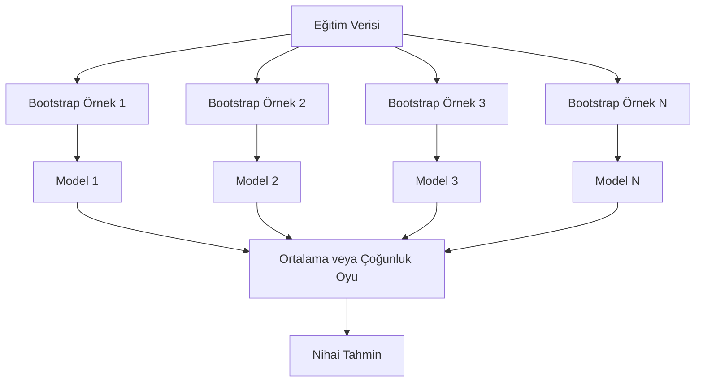
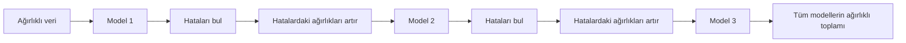
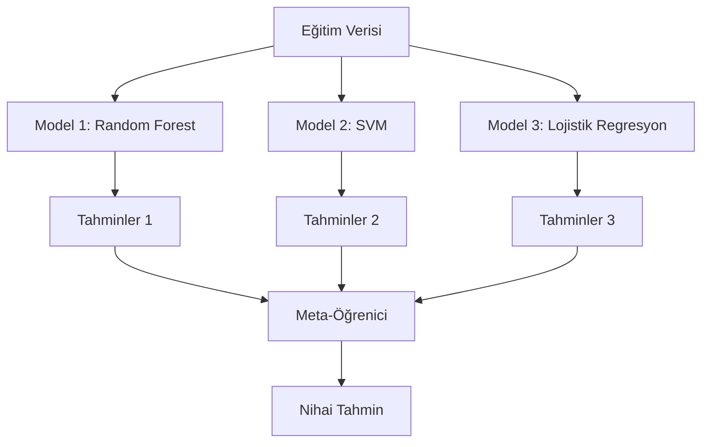

# Ensemble Yöntemleri

> Doğru şekilde birleştirilmiş zayıf öğrenicilerden oluşan bir grup, güçlü bir öğrenici olur. Bu bir metafor değildir. Bir teoremdir.

**Tür:** Yapım
**Dil:** Python
**Ön koşullar:** Faz 2, Ders 10 (Bias-Variance Dengesi)
**Süre:** ~120 dakika

## Öğrenme Hedefleri

- AdaBoost ve gradient boosting'i sıfırdan uygula ve boosting'in bias'ı sıralı olarak nasıl azalttığını açıkla
- Bir bagging ensemble'ı inşa et ve ilişkisiz modellerin ortalamasını almanın bias'ı artırmadan variance'ı nasıl azalttığını göster
- Bagging, boosting ve stacking'i her yöntemin hangi hata bileşenini hedeflediği açısından karşılaştır
- Ensemble çeşitliliğini değerlendir ve daha fazla bağımsız zayıf öğreniciyle çoğunluk oyu accuracy'sinin neden iyileştiğini açıkla

## Sorun

Tek bir karar ağacı hızlı eğitilir ve yorumlanması kolaydır ama overfit yapar. Tek bir doğrusal model karmaşık sınırlarda underfit yapar. Mükemmel model mimarisini tasarlamak için günler harcayabilirsin. Ya da bir grup mükemmel olmayan modeli birleştirip her birinden daha iyi bir şey elde edebilirsin.

Ensemble yöntemleri tam olarak bunu yapar. Tablolu veride Kaggle yarışmalarını kazanmak için en güvenilir tekniktir, çoğu üretim ML sistemini besler ve bias-variance dengesini eylemde gösterir. Bagging variance'ı azaltır. Boosting bias'ı azaltır. Stacking, hangi modellere hangi girdilerde güvenileceğini öğrenir.

## Kavram

### Ensemble'lar Neden Çalışır

Diyelim ki her biri p > 0.5 accuracy'ye sahip N bağımsız sınıflandırıcın var. Çoğunluk oyu şu accuracy'ye sahiptir:

```
P(majority correct) = N/2'den büyük k için C(N,k) * p^k * (1-p)^(N-k) toplamı
```

Her biri %60 accuracy'li 21 sınıflandırıcı için, çoğunluk oyu accuracy'si yaklaşık %74'tür. 101 sınıflandırıcıyla %84'e yükselir. Modeller farklı hatalar yaptığında hatalar birbirini götürür.

Anahtar gereksinim **çeşitliliktir**. Tüm modeller aynı hataları yaparsa, onları birleştirmek hiçbir şeye yardımcı olmaz. Ensemble'lar şu yollarla çeşitli modeller üreterek çalışır:

- Farklı eğitim alt kümeleri (bagging)
- Farklı feature alt kümeleri (random forest)
- Sıralı hata düzeltme (boosting)
- Farklı model aileleri (stacking)

### Bagging (Bootstrap Aggregating)

Bagging, her modeli eğitim verisinin farklı bir bootstrap örneği üzerinde eğiterek çeşitlilik yaratır.



Bir bootstrap örneği orijinal veriden yerine koyarak çekilir, orijinalle aynı boyutta. Benzersiz örneklerin yaklaşık %63.2'si her bootstrap'te görünür. Kalan %36.8 (out-of-bag örnekleri) ücretsiz bir doğrulama seti sağlar.

Bagging bias'ı çok artırmadan variance'ı azaltır. Her bireysel ağaç bootstrap örneğine overfit yapar ama overfitting her ağaç için farklıdır, bu yüzden ortalamak gürültüyü götürür.

**Random Forest** ek bir bükümle bagging'dir: her bölünmede sadece feature'ların rastgele bir alt kümesi değerlendirilir. Bu ağaçlar arasında daha da fazla çeşitliliği zorlar. Tipik aday feature sayısı sınıflandırma için `sqrt(n_features)`, regresyon için `n_features / 3`.

### Boosting (Sıralı Hata Düzeltme)

Boosting modelleri sıralı olarak eğitir. Her yeni model, önceki modellerin yanlış yaptığı örneklere odaklanır.



Boosting bias'ı azaltır. Her yeni model şu ana kadarki ensemble'ın sistematik hatalarını düzeltir. Nihai tahmin, daha iyi modellerin daha yüksek ağırlık aldığı tüm modellerin ağırlıklı toplamıdır.

Denge: çok fazla tur çalıştırırsan boosting overfit yapabilir çünkü bazıları gürültü olabilecek daha zor örnekleri uydurmaya devam eder.

### AdaBoost

AdaBoost (Adaptive Boosting) ilk pratik boosting algoritmasıydı. Tipik olarak karar stump'larıyla (derinlik-1 ağaçlar) olmak üzere herhangi bir temel öğreniciyle çalışır.

Algoritma:

```
1. Örnek ağırlıklarını başlat: tüm i için w_i = 1/N

2. t = 1'den T'ye:
   a. Ağırlıklı veride zayıf öğrenici h_t'yi eğit
   b. Ağırlıklı hatayı hesapla:
      err_t = sum(w_i * I(h_t(x_i) != y_i)) / sum(w_i)
   c. Model ağırlığını hesapla:
      alpha_t = 0.5 * ln((1 - err_t) / err_t)
   d. Örnek ağırlıklarını güncelle:
      w_i = w_i * exp(-alpha_t * y_i * h_t(x_i))
   e. Ağırlıkları 1'e toplanacak şekilde normalize et

3. Nihai tahmin: H(x) = sign(sum(alpha_t * h_t(x)))
```

Daha düşük hata oranına sahip modeller daha yüksek alpha alır. Yanlış sınıflandırılan örnekler daha yüksek ağırlık alır böylece bir sonraki model onlara odaklanır.

### Gradient Boosting

Gradient boosting, boosting'i keyfi loss fonksiyonlarına genelleştirir. Örnekleri yeniden ağırlıklandırmak yerine, her yeni modeli mevcut ensemble'ın artıklarına (loss'un negatif gradient'i) uydurur.

```
1. Başlat: F_0(x) = argmin_c sum(L(y_i, c))

2. t = 1'den T'ye:
   a. Pseudo-artıkları hesapla:
      r_i = -dL(y_i, F_{t-1}(x_i)) / dF_{t-1}(x_i)
   b. r_i artıklarına bir ağaç h_t uydur
   c. Optimal adım boyutunu bul:
      gamma_t = argmin_gamma sum(L(y_i, F_{t-1}(x_i) + gamma * h_t(x_i)))
   d. Güncelle:
      F_t(x) = F_{t-1}(x) + learning_rate * gamma_t * h_t(x)

3. Nihai tahmin: F_T(x)
```

Karesel hata loss'u için, pseudo-artıklar sadece gerçek artıklardır: `r_i = y_i - F_{t-1}(x_i)`. Her ağaç tam anlamıyla önceki ensemble'ın hatalarını uydurur.

Learning rate (shrinkage), her ağacın ne kadar katkı yaptığını kontrol eder. Daha küçük learning rate'ler daha fazla ağaç gerektirir ama daha iyi genelleştirir. Tipik değerler: 0.01 ile 0.3 arası.

### XGBoost: Tablolu Veriye Neden Hakim

XGBoost (eXtreme Gradient Boosting), onu hızlı, doğru ve overfitting'e dirençli yapan mühendislik optimizasyonlarıyla gradient boosting'dir:

- **Düzenlenmiş amaç:** Yaprak ağırlıklarına L1 ve L2 cezaları, bireysel ağaçların çok kendinden emin olmasını önler
- **İkinci dereceden yaklaşım:** Loss'un hem birinci hem de ikinci türevlerini kullanır, daha iyi bölünme kararları verir
- **Seyreklik-farkında bölünmeler:** Her bölünmede eksik veri için en iyi yönü öğrenerek eksik değerleri yerel olarak ele alır
- **Kolon alt örnekleme:** Random forest gibi, çeşitlilik için her bölünmede feature'ları örnekler
- **Ağırlıklı quantile sketch:** Sürekli feature'lar için dağıtık veride bölünme noktalarını verimli bulur
- **Cache-farkında blok yapısı:** CPU cache satırları için optimize edilmiş bellek düzeni

Tablolu veri için, XGBoost (ve halefi LightGBM) sinir ağlarını tutarlı şekilde yener. Bu yakın zamanda değişmeyecek. Verin satır ve kolonlu bir tabloya sığıyorsa, gradient boosting ile başla.

### Stacking (Meta-Öğrenme)

Stacking, birden fazla temel modelin tahminlerini bir meta-öğrenici için feature olarak kullanır.



Meta-öğrenici, hangi temel modele hangi girdiler için güvenileceğini öğrenir. Random forest belirli bölgelerde daha iyiyse ve SVM diğerlerinde daha iyiyse, meta-öğrenici buna göre yönlendirmeyi öğrenecektir.

Data leakage'dan kaçınmak için, temel model tahminleri eğitim setinde cross-validation yoluyla üretilmelidir. Temel modelleri ve meta-feature'ları aynı verilerde asla eğitmezsin.

### Voting

En basit ensemble. Sadece tahminleri doğrudan birleştir.

- **Hard voting:** Sınıf etiketleri üzerinde çoğunluk oyu.
- **Soft voting:** Tahmin edilen olasılıkları ortala, en yüksek ortalama olasılığa sahip sınıfı seç. Güven bilgisi kullandığı için genellikle daha iyidir.

## İnşa Et

### Adım 1: Karar Stump'ı (Temel Öğrenici)

`code/ensembles.py` içindeki kod her şeyi sıfırdan uygular. Bir karar stump'ıyla başlıyoruz: tek bir bölünmeye sahip bir ağaç.

```python
class DecisionStump:
    def __init__(self):
        self.feature_idx = None
        self.threshold = None
        self.polarity = 1
        self.alpha = None

    def fit(self, X, y, weights):
        n_samples, n_features = X.shape
        best_error = float("inf")

        for f in range(n_features):
            thresholds = np.unique(X[:, f])
            for thresh in thresholds:
                for polarity in [1, -1]:
                    pred = np.ones(n_samples)
                    pred[polarity * X[:, f] < polarity * thresh] = -1
                    error = np.sum(weights[pred != y])
                    if error < best_error:
                        best_error = error
                        self.feature_idx = f
                        self.threshold = thresh
                        self.polarity = polarity

    def predict(self, X):
        n = X.shape[0]
        pred = np.ones(n)
        idx = self.polarity * X[:, self.feature_idx] < self.polarity * self.threshold
        pred[idx] = -1
        return pred
```

### Adım 2: Sıfırdan AdaBoost

```python
class AdaBoostScratch:
    def __init__(self, n_estimators=50):
        self.n_estimators = n_estimators
        self.stumps = []
        self.alphas = []

    def fit(self, X, y):
        n = X.shape[0]
        weights = np.full(n, 1 / n)

        for _ in range(self.n_estimators):
            stump = DecisionStump()
            stump.fit(X, y, weights)
            pred = stump.predict(X)

            err = np.sum(weights[pred != y])
            err = np.clip(err, 1e-10, 1 - 1e-10)

            alpha = 0.5 * np.log((1 - err) / err)
            weights *= np.exp(-alpha * y * pred)
            weights /= weights.sum()

            stump.alpha = alpha
            self.stumps.append(stump)
            self.alphas.append(alpha)

    def predict(self, X):
        total = sum(a * s.predict(X) for a, s in zip(self.alphas, self.stumps))
        return np.sign(total)
```

### Adım 3: Sıfırdan Gradient Boosting

```python
class GradientBoostingScratch:
    def __init__(self, n_estimators=100, learning_rate=0.1, max_depth=3):
        self.n_estimators = n_estimators
        self.lr = learning_rate
        self.max_depth = max_depth
        self.trees = []
        self.initial_pred = None

    def fit(self, X, y):
        self.initial_pred = np.mean(y)
        current_pred = np.full(len(y), self.initial_pred)

        for _ in range(self.n_estimators):
            residuals = y - current_pred
            tree = SimpleRegressionTree(max_depth=self.max_depth)
            tree.fit(X, residuals)
            update = tree.predict(X)
            current_pred += self.lr * update
            self.trees.append(tree)

    def predict(self, X):
        pred = np.full(X.shape[0], self.initial_pred)
        for tree in self.trees:
            pred += self.lr * tree.predict(X)
        return pred
```

### Adım 4: sklearn ile karşılaştır

Kod, sıfırdan uygulamalarımızın sklearn'in `AdaBoostClassifier` ve `GradientBoostingClassifier`'ına benzer accuracy ürettiğini doğrular ve tüm yöntemleri yan yana karşılaştırır.

## Kullan

### Her Yöntemin Ne Zaman Kullanılacağı

| Yöntem | Azaltır | En iyi olduğu durum | Dikkat |
|--------|---------|----------|---------------|
| Bagging / Random Forest | Variance | Gürültülü veri, çok feature | Bias'a yardım etmez |
| AdaBoost | Bias | Temiz veri, basit temel öğreniciler | Aykırı değerlere ve gürültüye duyarlı |
| Gradient Boosting | Bias | Tablolu veri, yarışmalar | Eğitim yavaş, ayarlama olmadan overfit kolay |
| XGBoost / LightGBM | Her ikisi de | Üretim tablolu ML | Çok hiperparametre |
| Stacking | Her ikisi de | Son %1-2 accuracy'yi almak | Karmaşık, meta-öğreniciyi overfit etme riski |
| Voting | Variance | Çeşitli modellerin hızlı kombinasyonu | Sadece modeller çeşitliyse yardım eder |

### Tablolu Veri için Üretim Yığını

Çoğu tablolu tahmin problemi için, denenecek sıra budur:

1. Varsayılan parametrelerle **LightGBM veya XGBoost**
2. n_estimators, learning_rate, max_depth, min_child_weight'i ayarla
3. Son %0.5'e ihtiyacın varsa, 3-5 çeşitli modelle bir stacking ensemble inşa et
4. Boyunca cross-validation kullan

Tablolu veride sinir ağları, devam eden araştırma girişimlerine rağmen, gradient boosting'den neredeyse her zaman daha kötüdür. TabNet, NODE ve benzeri mimariler ara sıra eşleşir ama nadiren iyi ayarlanmış bir XGBoost'u yener.

## Yayınla

Bu ders `outputs/prompt-ensemble-selector.md` üretir -- verilen bir veri seti için doğru ensemble yöntemini seçmene yardım eden bir prompt. Verini (boyut, feature tipleri, gürültü seviyesi, sınıf dengesi) ve çözdüğün problemi tanımla. Prompt bir karar kontrol listesinden geçer, bir yöntem önerir, başlangıç hiperparametreleri önerir ve o yöntem için yaygın hatalar hakkında uyarır. Ayrıca tam seçim kılavuzuyla `outputs/skill-ensemble-builder.md` üretir.

## Alıştırmalar

1. AdaBoost uygulamasını her turdan sonra eğitim accuracy'sini takip edecek şekilde değiştir. Tahmin edici sayısına karşı accuracy'yi çiz. Ne zaman yakınsar?

2. Regresyon ağacına rastgele feature alt örneklemesi ekleyerek sıfırdan bir random forest uygula. `max_features=sqrt(n_features)` ile 100 ağaç eğit ve tahminleri ortala. Variance azalmasını tek bir ağaçla karşılaştır.

3. Gradient boosting uygulamasında, erken durdurma ekle: her turdan sonra doğrulama loss'unu takip et ve 10 ardışık tur boyunca iyileşmediğinde durdur. Aslında kaç ağaca ihtiyacı var?

4. Üç temel modelle (lojistik regresyon, karar ağacı, k-en yakın komşu) ve bir lojistik regresyon meta-öğreniciyle bir stacking ensemble'ı inşa et. Meta-feature'ları üretmek için 5-fold cross-validation kullan. Her temel modelle tek başına karşılaştır.

5. Aynı veri setinde XGBoost'u varsayılan parametrelerle çalıştır. Accuracy'sini sıfırdan gradient boosting'inle karşılaştır. Her ikisini de zamanla. Hız farkı ne kadar büyük?

## Anahtar Terimler

| Terim | İnsanlar ne der | Aslında ne demek |
|------|----------------|----------------------|
| Bagging | "Rastgele alt kümelerde eğit" | Bootstrap aggregating: bootstrap örneklerinde modeller eğit, variance'ı azaltmak için tahminleri ortala |
| Boosting | "Zor örneklere odaklan" | Modelleri sıralı olarak eğit, her biri şu ana kadarki ensemble'ın hatalarını düzeltir, bias'ı azaltır |
| AdaBoost | "Veriyi yeniden ağırlıklandır" | Örnek ağırlık güncellemeleri yoluyla boosting; yanlış sınıflandırılan noktalar sonraki öğrenici için daha yüksek ağırlık alır |
| Gradient boosting | "Artıkları uydur" | Her yeni modeli loss fonksiyonunun negatif gradient'ine uydurarak boosting |
| XGBoost | "Kaggle silahı" | Düzenleme, ikinci dereceden optimizasyon ve sistem seviyesinde hız hileleriyle gradient boosting |
| Stacking | "Modellerin üzerinde modeller" | Temel model tahminlerini bir meta-öğrenici için girdi feature'ları olarak kullan |
| Random forest | "Birçok rastgeleleştirilmiş ağaç" | Çeşitlilik için her bölünmede rastgele feature alt örnekleme ekleyen karar ağaçlarıyla bagging |
| Ensemble çeşitliliği | "Farklı hatalar yap" | Ensemble'ın bireyleri aşması için modellerin hatalarında ilişkisiz olması gerekir |
| Out-of-bag hatası | "Ücretsiz doğrulama" | Bir bootstrap çekiminde olmayan örnekler (~%36.8) bir holdout'a gerek kalmadan bir doğrulama seti olarak hizmet eder |

## Daha Fazla Okuma

- [Schapire & Freund: Boosting: Foundations and Algorithms](https://mitpress.mit.edu/9780262526036/) -- AdaBoost'un yaratıcılarının kitabı
- [Friedman: Greedy Function Approximation: A Gradient Boosting Machine (2001)](https://statweb.stanford.edu/~jhf/ftp/trebst.pdf) -- orijinal gradient boosting makalesi
- [Chen & Guestrin: XGBoost (2016)](https://arxiv.org/abs/1603.02754) -- XGBoost makalesi
- [Wolpert: Stacked Generalization (1992)](https://www.sciencedirect.com/science/article/abs/pii/S0893608005800231) -- orijinal stacking makalesi
- [scikit-learn Ensemble Methods](https://scikit-learn.org/stable/modules/ensemble.html) -- pratik referans
