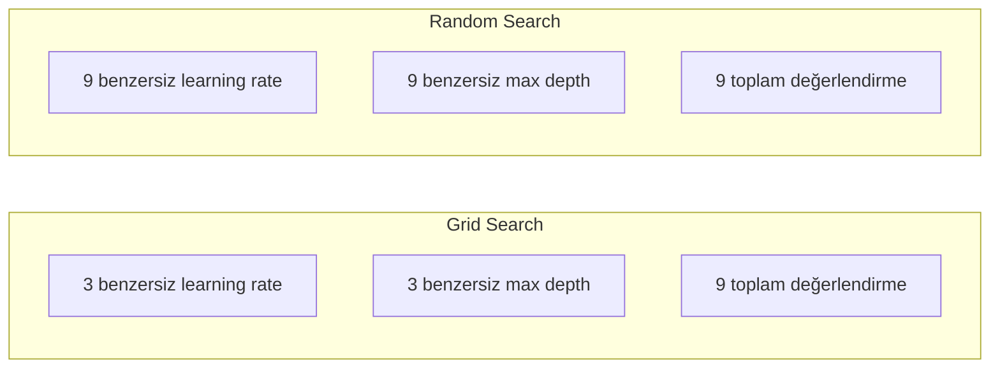
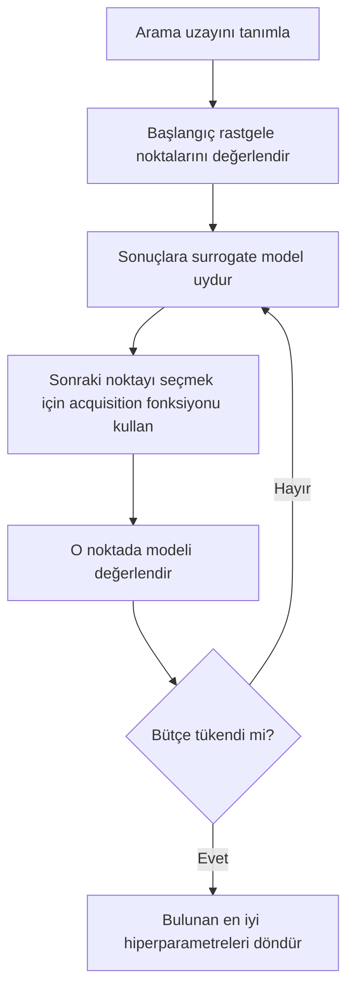
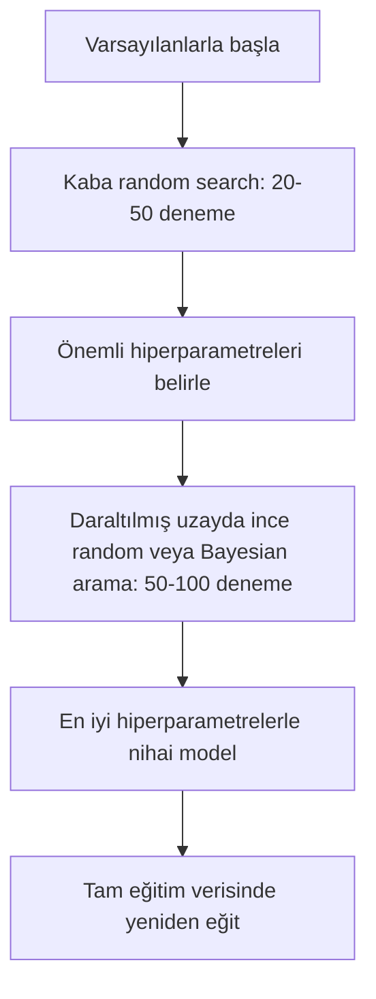
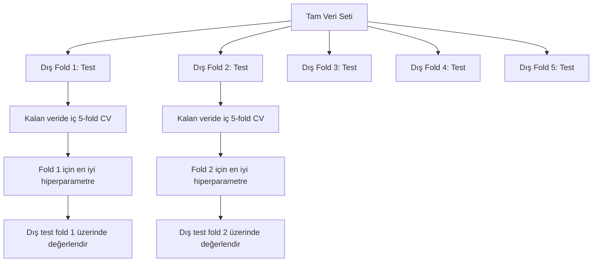

# Hiperparametre Ayarlama

> Hiperparametreler, eğitim başlamadan önce çevirdiğin düğmelerdir. Bunları iyi çevirmek vasat bir model ile harika bir model arasındaki farktır.

**Tür:** Yapım
**Dil:** Python
**Ön koşullar:** Faz 2, Ders 11 (Ensemble Yöntemleri)
**Süre:** ~90 dakika

## Öğrenme Hedefleri

- Sıfırdan grid search, random search ve Bayesian optimizasyon uygula ve örnek verimliliklerini karşılaştır
- Çoğu hiperparametrenin düşük etkin boyutluluğa sahip olduğunda random search'ün neden grid search'ü yendiğini açıkla
- Aramayı yönlendirmek için bir surrogate model ve acquisition fonksiyonu kullanan bir Bayesian optimizasyon döngüsü inşa et
- Uygun cross-validation yoluyla doğrulama setine overfit yapmaktan kaçınan bir hiperparametre ayarlama stratejisi tasarla

## Sorun

Gradient boosting modelinin bir learning rate'i, ağaç sayısı, max derinliği, yaprak başına minimum örnek, subsample oranı ve kolon örnek oranı var. Bu altı hiperparametre. Her birinin 5 makul değeri varsa, grid 5^6 = 15.625 kombinasyona sahiptir. Her birini eğitmek 10 saniye sürüyor. Hepsini denemek için 43 saatlik compute eder.

Grid search bariz yaklaşımdır ve ölçekte en kötüsüdür. Random search daha az compute ile daha iyisini yapar. Bayesian optimizasyon geçmiş değerlendirmelerden öğrenerek daha da iyisini yapar. Hangi stratejiyi kullanacağını ve hangi hiperparametrelerin gerçekten önemli olduğunu bilmek, günlerce boşa harcanan GPU zamanından kurtarır.

## Kavram

### Parametreler vs Hiperparametreler

Parametreler eğitim sırasında öğrenilir (ağırlıklar, bias'lar, bölünme eşikleri). Hiperparametreler eğitim başlamadan önce belirlenir ve öğrenmenin nasıl gerçekleştiğini kontrol eder.

| Hiperparametre | Neyi kontrol eder | Tipik aralık |
|---------------|-----------------|---------------|
| Learning rate | Güncelleme başına adım boyutu | 0.001 ile 1.0 |
| Ağaç/epoch sayısı | Ne kadar süre eğitileceği | 10 ile 10.000 |
| Max derinlik | Model karmaşıklığı | 1 ile 30 |
| Düzenleme (lambda) | Overfitting önleme | 0.0001 ile 100 |
| Batch boyutu | Gradient tahmin gürültüsü | 16 ile 512 |
| Dropout oranı | Düşürülen nöronların kesri | 0.0 ile 0.5 |

### Grid Search

Grid search belirtilen değerlerin her kombinasyonunu değerlendirir. Kapsamlı ve anlaşılması kolaydır ama hiperparametre sayısıyla üstel olarak ölçeklenir.

```
2 hiperparametre için grid:

  learning_rate: [0.01, 0.1, 1.0]
  max_depth:     [3, 5, 7]

  Değerlendirme: 3 x 3 = 9 kombinasyon

  (0.01, 3)  (0.01, 5)  (0.01, 7)
  (0.1,  3)  (0.1,  5)  (0.1,  7)
  (1.0,  3)  (1.0,  5)  (1.0,  7)
```

Grid search'ün temel bir kusuru vardır: bir hiperparametre önemliyse ve diğeri değilse, çoğu değerlendirme boşa gider. 9 değerlendirmeden sadece önemli parametrenin 3 benzersiz değerini alırsın.

### Random Search

Random search hiperparametreleri grid yerine dağılımlardan örnekler. Aynı 9 değerlendirme bütçesiyle, her hiperparametrenin 9 benzersiz değerini alırsın.



Random neden grid'i yener (Bergstra & Bengio, 2012):

- Çoğu hiperparametre düşük etkin boyutluluğa sahiptir. Verilen bir problem için genellikle 6 hiperparametreden sadece 1-2 tanesi önemlidir.
- Grid search önemsiz boyutlarda değerlendirme israf eder.
- Random search aynı bütçe için önemli boyutları daha yoğun şekilde kapsar.
- 60 rastgele denemede, optimumun %5'i içinde bir nokta bulma %95 şansın vardır (arama uzayında biri varsa).

### Bayesian Optimizasyon

Random search sonuçları görmezden gelir. Yüksek learning rate'lerin ıraksamaya neden olduğunu veya derinlik 3'ün derinlik 10'u tutarlı şekilde yendiğini öğrenmez. Bayesian optimizasyon, bir sonraki nerede arayacağına karar vermek için geçmiş değerlendirmeleri kullanır.



İki anahtar bileşen:

**Surrogate model:** Pahalı amaç fonksiyonunu yaklaşıklayan, ucuz değerlendirilebilir bir model (genellikle Gaussian process). Arama uzayındaki herhangi bir noktada hem bir tahmin hem de bir belirsizlik tahmini verir.

**Acquisition fonksiyonu:** Exploitation (bilinen iyi noktaların yakınında ara) ile exploration (belirsizliğin yüksek olduğu yerde ara) arasında denge kurarak bir sonraki nerede değerlendirileceğine karar verir. Yaygın seçimler:

- **Expected Improvement (EI):** Bu noktada mevcut en iyiye göre ne kadar iyileşme bekliyoruz?
- **Upper Confidence Bound (UCB):** Tahmin artı belirsizliğin bir katı. Daha yüksek UCB ya umut verici ya da keşfedilmemiş demektir.
- **Probability of Improvement (PI):** Bu noktanın mevcut en iyiyi yenme olasılığı nedir?

Bayesian optimizasyon genellikle random search'ten 2-5 kat daha az değerlendirmeyle daha iyi hiperparametreler bulur. Surrogate modeli uydurmanın yükü, gerçek modeli eğitmekle karşılaştırıldığında ihmal edilebilir.

### Erken Durdurma

Her eğitim çalıştırmasının bitmesine gerek yok. Bir yapılandırma 10 epoch'tan sonra açıkça kötüyse, onu durdur ve devam et. Bu, hiperparametre arama bağlamında erken durdurmadır.

Stratejiler:
- **Sabırlılığa dayalı:** Doğrulama loss'u N ardışık epoch için iyileşmediyse durdur
- **Median pruning:** Denemenin ara sonucu aynı adımdaki tamamlanmış denemelerin medyanından kötüyse durdur
- **Hyperband:** Birçok yapılandırmaya küçük bütçeler ayır, sonra en iyileri için bütçeyi kademeli olarak artır

Hyperband özellikle etkilidir. Her birine 1 epoch ile 81 yapılandırma başlatır, en iyi üçte birini tutar, 3 epoch verir, en iyi üçte birini tutar ve böyle devam eder. Bu, tüm konfigleri tam bütçe için değerlendirmekten 10-50 kat daha hızlı iyi yapılandırmalar bulur.

### Learning Rate Scheduler'lar

Learning rate neredeyse her zaman en önemli hiperparametredir. Sabit tutmak yerine, scheduler'lar onu eğitim sırasında ayarlar.

| Scheduler | Formül | Ne zaman kullanılır |
|-----------|---------|-------------|
| Step decay | Her N epoch'ta 0.1 ile çarp | Klasik CNN eğitimi |
| Cosine annealing | lr * 0.5 * (1 + cos(pi * t / T)) | Modern varsayılan |
| Warmup + decay | Doğrusal artış sonra cosine azalış | Transformer'lar |
| One-cycle | Bir döngü boyunca artır sonra azalt | Hızlı yakınsama |
| Reduce on plateau | Metrik durduğunda faktörle azalt | Güvenli varsayılan |

### Hiperparametre Önemi

Tüm hiperparametreler eşit derecede önemli değildir. Random forest (Probst et al., 2019) ve gradient boosting üzerine araştırma tutarlı örüntüler gösterir:

**Yüksek önem:**
- Learning rate (her zaman önce ayarla)
- Tahmin edici / epoch sayısı (ayarlama yerine erken durdurma kullan)
- Düzenleme gücü

**Orta önem:**
- Max derinlik / katman sayısı
- Yaprak başına min örnek / weight decay
- Subsample oranı

**Düşük önem:**
- Max feature'lar (random forest için)
- Spesifik aktivasyon fonksiyonu seçimi
- Batch boyutu (makul aralık içinde)

Önce önemli olanları ayarla, geri kalanları varsayılanlarda bırak.

### Pratik Strateji



Somut iş akışı:

1. **Kütüphane varsayılanlarıyla başla.** Deneyimli uygulayıcılar tarafından seçilirler ve genellikle yolun %80'i oradadır.
2. **Kaba random search.** Geniş aralıklar, 20-50 deneme. Kötü çalıştırmaları hızla öldürmek için erken durdurma kullan.
3. **Sonuçları analiz et.** Hangi hiperparametreler performansla korelasyondadır? Arama uzayını daralt.
4. **İnce arama.** Daraltılmış uzayda Bayesian optimizasyon veya odaklı random search. 50-100 deneme.
5. Bulunan en iyi hiperparametrelerle **tüm eğitim verisinde yeniden eğit**.

### Cross-Validation Entegrasyonu

Hiperparametreleri tek bir doğrulama bölünmesinde ayarlamak risklidir. En iyi hiperparametreler belirli doğrulama fold'una overfit yapabilir. Nested cross-validation, iki döngü kullanarak bunu çözer:

- **Dış döngü** (değerlendirme): veriyi train+val ve test'e böler. Tarafsız performans raporlar.
- **İç döngü** (ayarlama): train+val'i train ve val'e böler. En iyi hiperparametreleri bulur.



Her dış fold kendi en iyi hiperparametrelerini bağımsız olarak bulur. Dış skorlar genelleştirme performansının tarafsız bir tahminidir.

sklearn ile:

```python
from sklearn.model_selection import cross_val_score, GridSearchCV
from sklearn.ensemble import GradientBoostingRegressor

inner_cv = GridSearchCV(
    GradientBoostingRegressor(),
    param_grid={
        "learning_rate": [0.01, 0.05, 0.1],
        "max_depth": [2, 3, 5],
        "n_estimators": [50, 100, 200],
    },
    cv=5,
    scoring="neg_mean_squared_error",
)

outer_scores = cross_val_score(
    inner_cv, X, y, cv=5, scoring="neg_mean_squared_error"
)

print(f"Nested CV MSE: {-outer_scores.mean():.4f} +/- {outer_scores.std():.4f}")
```

Bu pahalıdır (5 dış fold x 5 iç fold x 27 grid noktası = 675 model uydurma), ama sana güvenilir bir performans tahmini verir. Makalelerde nihai sonuçları raporlarken veya kararın bahsi yüksek olduğunda kullan.

### Pratik İpuçları

**Learning rate ile başla.** Gradient tabanlı yöntemler için her zaman en önemli hiperparametredir. Kötü bir learning rate diğer her şeyi alakasız hale getirir. Diğer hiperparametreleri varsayılanlarda sabitle ve önce learning rate'i tara.

**Learning rate ve düzenleme için log-uniform dağılımlar kullan.** 0.001 ile 0.01 arasındaki fark, 0.1 ile 1.0 arasındaki fark kadar önemlidir. Doğrusal arama büyük uçtaki bütçeyi israf eder.

**n_estimators'ı ayarlamak yerine erken durdurma kullan.** Boosting ve sinir ağları için, n_estimators veya epoch'ları yüksek ayarla ve erken durdurmanın ne zaman duracağına karar vermesine izin ver. Bu, aramadan bir hiperparametre çıkarır.

**Bütçe ayırma.** Ayarlama bütçenin %60'ını en önemli 2 hiperparametreye harca. Kalan %40'ı diğer her şeye harca. En önemli 2'si performans değişikliğinin çoğunu açıklar.

**Ölçek önemlidir.** Batch boyutunu asla log ölçeğinde arama (16, 32, 64 iyidir). Learning rate'i her zaman log ölçeğinde ara. Arama dağılımını hiperparametrenin modeli nasıl etkilediğine göre eşle.

| Model Tipi | En İyi Hiperparametreler | Önerilen Arama | Bütçe |
|-----------|--------------------|--------------------|--------|
| Random Forest | n_estimators, max_depth, min_samples_leaf | Random search, 50 deneme | Düşük (hızlı eğitim) |
| Gradient Boosting | learning_rate, n_estimators, max_depth | Bayesian, 100 deneme + erken durdurma | Orta |
| Sinir Ağı | learning_rate, weight_decay, batch_size | Bayesian veya random, 100+ deneme | Yüksek (yavaş eğitim) |
| SVM | C, gamma (RBF kernel) | Log ölçeğinde grid, 25-50 deneme | Düşük (2 param) |
| Lasso/Ridge | alpha | Log ölçeğinde 1B arama, 20 deneme | Çok düşük |
| XGBoost | learning_rate, max_depth, subsample, colsample | Bayesian, 100-200 deneme + erken durdurma | Orta |

**Şüphe durumunda:** Deneme sayısı kadar hiperparametrenin iki katı ile random search (örn., 6 hiperparametre = minimum 12+ deneme). 50 denemeli random search'ün dikkatlice tasarlanmış grid search'ü ne sıklıkla yendiğine şaşıracaksın.

## İnşa Et

### Adım 1: Sıfırdan Grid Search

`code/tuning.py` içindeki kod, grid search, random search ve basit bir Bayesian optimizer'ı sıfırdan uygular.

```python
def grid_search(model_fn, param_grid, X_train, y_train, X_val, y_val):
    keys = list(param_grid.keys())
    values = list(param_grid.values())
    best_score = -float("inf")
    best_params = None
    n_evals = 0

    for combo in itertools.product(*values):
        params = dict(zip(keys, combo))
        model = model_fn(**params)
        model.fit(X_train, y_train)
        score = evaluate(model, X_val, y_val)
        n_evals += 1

        if score > best_score:
            best_score = score
            best_params = params

    return best_params, best_score, n_evals
```

### Adım 2: Sıfırdan Random Search

```python
def random_search(model_fn, param_distributions, X_train, y_train,
                  X_val, y_val, n_iter=50, seed=42):
    rng = np.random.RandomState(seed)
    best_score = -float("inf")
    best_params = None

    for _ in range(n_iter):
        params = {k: sample(v, rng) for k, v in param_distributions.items()}
        model = model_fn(**params)
        model.fit(X_train, y_train)
        score = evaluate(model, X_val, y_val)

        if score > best_score:
            best_score = score
            best_params = params

    return best_params, best_score, n_iter
```

### Adım 3: Bayesian Optimizasyon (Basitleştirilmiş)

Temel fikir: gözlenen (hiperparametre, skor) çiftlerine bir Gaussian process uydur, sonra bir sonraki nerede arayacağına karar vermek için bir acquisition fonksiyonu kullan.

```python
class SimpleBayesianOptimizer:
    def __init__(self, search_space, n_initial=5):
        self.search_space = search_space
        self.n_initial = n_initial
        self.X_observed = []
        self.y_observed = []

    def _kernel(self, x1, x2, length_scale=1.0):
        dists = np.sum((x1[:, None, :] - x2[None, :, :]) ** 2, axis=2)
        return np.exp(-0.5 * dists / length_scale ** 2)

    def _fit_gp(self, X_new):
        X_obs = np.array(self.X_observed)
        y_obs = np.array(self.y_observed)
        y_mean = y_obs.mean()
        y_centered = y_obs - y_mean

        K = self._kernel(X_obs, X_obs) + 1e-4 * np.eye(len(X_obs))
        K_star = self._kernel(X_new, X_obs)

        L = np.linalg.cholesky(K)
        alpha = np.linalg.solve(L.T, np.linalg.solve(L, y_centered))
        mu = K_star @ alpha + y_mean

        v = np.linalg.solve(L, K_star.T)
        var = 1.0 - np.sum(v ** 2, axis=0)
        var = np.maximum(var, 1e-6)

        return mu, var

    def _expected_improvement(self, mu, var, best_y):
        sigma = np.sqrt(var)
        z = (mu - best_y) / (sigma + 1e-10)
        ei = sigma * (z * norm_cdf(z) + norm_pdf(z))
        return ei

    def suggest(self):
        if len(self.X_observed) < self.n_initial:
            return sample_random(self.search_space)

        candidates = [sample_random(self.search_space) for _ in range(500)]
        X_cand = np.array([to_vector(c) for c in candidates])
        mu, var = self._fit_gp(X_cand)
        ei = self._expected_improvement(mu, var, max(self.y_observed))
        return candidates[np.argmax(ei)]

    def observe(self, params, score):
        self.X_observed.append(to_vector(params))
        self.y_observed.append(score)
```

GP surrogate her aday noktada iki şey verir: tahmin edilen bir skor (mu) ve bir belirsizlik (var). Expected Improvement bunları dengeler: modelin yüksek skorlar tahmin ettiği VEYA belirsizliğin yüksek olduğu noktaları tercih eder. Erken aşamada, çoğu nokta yüksek belirsizliğe sahiptir bu yüzden optimizer keşfeder. Daha sonra en umut verici bölgeye odaklanır.

### Adım 4: Tüm Yöntemleri Karşılaştır

Aynı sentetik amaç üzerinde üç yöntemi de çalıştır ve karşılaştır. Bu karşılaştırma, her optimizer'ı doğrudan bir amaç fonksiyonuyla (model eğitimi olmadan) çağıran basitleştirilmiş bir wrapper kullanır, bu yüzden API yukarıdaki model tabanlı uygulamalardan farklıdır:

```python
def synthetic_objective(params):
    lr = params["learning_rate"]
    depth = params["max_depth"]
    return -(np.log10(lr) + 2) ** 2 - (depth - 4) ** 2 + 10

param_grid = {
    "learning_rate": [0.001, 0.01, 0.1, 1.0],
    "max_depth": [2, 3, 4, 5, 6, 7, 8],
}

grid_best = None
grid_score = -float("inf")
grid_history = []
for combo in itertools.product(*param_grid.values()):
    params = dict(zip(param_grid.keys(), combo))
    score = synthetic_objective(params)
    grid_history.append((params, score))
    if score > grid_score:
        grid_score = score
        grid_best = params

param_dist = {
    "learning_rate": ("log_float", 0.001, 1.0),
    "max_depth": ("int", 2, 8),
}

rand_best = None
rand_score = -float("inf")
rand_history = []
rng = np.random.RandomState(42)
for _ in range(28):
    params = {k: sample(v, rng) for k, v in param_dist.items()}
    score = synthetic_objective(params)
    rand_history.append((params, score))
    if score > rand_score:
        rand_score = score
        rand_best = params

optimizer = SimpleBayesianOptimizer(param_dist, n_initial=5)
bayes_history = []
for _ in range(28):
    params = optimizer.suggest()
    score = synthetic_objective(params)
    optimizer.observe(params, score)
    bayes_history.append((params, score))
bayes_score = max(s for _, s in bayes_history)

print(f"{'Method':<20} {'Best Score':>12} {'Evaluations':>12}")
print("-" * 50)
print(f"{'Grid Search':<20} {grid_score:>12.4f} {len(grid_history):>12}")
print(f"{'Random Search':<20} {rand_score:>12.4f} {len(rand_history):>12}")
print(f"{'Bayesian Opt':<20} {bayes_score:>12.4f} {len(bayes_history):>12}")
```

Aynı bütçeyle, Bayesian optimizasyon genellikle en iyi skoru en hızlı bulur çünkü açıkça kötü bölgelerde değerlendirme israf etmez. Random search grid search'ten daha fazla zemin kapsar. Grid search sadece çok az hiperparametren olduğunda ve kapsamlı olmayı karşılayabildiğinde kazanır.

## Kullan

### Pratikte Optuna

Optuna, ciddi hiperparametre ayarlaması için önerilen kütüphanedir. Pruning, dağıtık arama ve görselleştirmeyi kutudan çıkar çıkmaz destekler.

```python
import optuna

def objective(trial):
    lr = trial.suggest_float("learning_rate", 1e-4, 1e-1, log=True)
    n_est = trial.suggest_int("n_estimators", 50, 500)
    max_depth = trial.suggest_int("max_depth", 2, 10)

    model = GradientBoostingRegressor(
        learning_rate=lr,
        n_estimators=n_est,
        max_depth=max_depth,
    )
    model.fit(X_train, y_train)
    return mean_squared_error(y_val, model.predict(X_val))

study = optuna.create_study(direction="minimize")
study.optimize(objective, n_trials=100)

print(f"Best params: {study.best_params}")
print(f"Best MSE: {study.best_value:.4f}")
```

Anahtar Optuna özellikleri:
- Log ölçeğinde en iyi aranan parametreler için (learning rate, düzenleme) `suggest_float(..., log=True)`
- Tam sayı parametreler için `suggest_int`
- Ayrık seçimler için `suggest_categorical`
- Kötü denemelerin erken durdurulması için yerleşik MedianPruner
- Analiz için `study.trials_dataframe()`

### Pruning ile Optuna

Pruning, umut vermeyen denemeleri erken durdurur, devasa compute tasarrufu sağlar. İşte örüntü:

```python
import optuna
from sklearn.model_selection import cross_val_score

def objective(trial):
    params = {
        "learning_rate": trial.suggest_float("lr", 1e-4, 0.5, log=True),
        "max_depth": trial.suggest_int("max_depth", 2, 10),
        "n_estimators": trial.suggest_int("n_estimators", 50, 500),
        "subsample": trial.suggest_float("subsample", 0.5, 1.0),
    }

    model = GradientBoostingRegressor(**params)
    scores = cross_val_score(model, X_train, y_train, cv=3,
                             scoring="neg_mean_squared_error")
    mean_score = -scores.mean()

    trial.report(mean_score, step=0)
    if trial.should_prune():
        raise optuna.TrialPruned()

    return mean_score

pruner = optuna.pruners.MedianPruner(n_startup_trials=10, n_warmup_steps=5)
study = optuna.create_study(direction="minimize", pruner=pruner)
study.optimize(objective, n_trials=200)
```

`MedianPruner`, ara değeri aynı adımdaki tüm tamamlanmış denemelerin medyanından kötüyse bir denemeyi durdurur. Pruning, ara metrikleri raporlamak için `trial.report()` çağrısı ve denemenin durdurulup durdurulmaması gerektiğini kontrol etmek için `trial.should_prune()` gerektirir. `n_startup_trials=10`, pruning devreye girmeden önce en az 10 denemenin tamamen tamamlanmasını sağlar. Bu genellikle toplam compute'un %40-60'ından tasarruf sağlar.

### sklearn'in Yerleşik Tuner'ları

Hızlı deneyler için sklearn, `GridSearchCV`, `RandomizedSearchCV` ve `HalvingRandomSearchCV` sağlar:

```python
from sklearn.model_selection import RandomizedSearchCV
from scipy.stats import loguniform, randint

param_dist = {
    "learning_rate": loguniform(1e-4, 0.5),
    "max_depth": randint(2, 10),
    "n_estimators": randint(50, 500),
}

search = RandomizedSearchCV(
    GradientBoostingRegressor(),
    param_dist,
    n_iter=100,
    cv=5,
    scoring="neg_mean_squared_error",
    random_state=42,
    n_jobs=-1,
)
search.fit(X_train, y_train)
print(f"Best params: {search.best_params_}")
print(f"Best CV MSE: {-search.best_score_:.4f}")
```

Learning rate ve düzenleme için scipy'den `loguniform` kullan. Tam sayı hiperparametreler için `randint` kullan. `n_jobs=-1` bayrağı tüm CPU çekirdekleri arasında paralelleştirir.

### Hiperparametre Ayarlamasında Yaygın Hatalar

**Ön işleme yoluyla data leakage.** Cross-validation'dan önce tüm veri setine bir scaler uydurursan, doğrulama fold'undan bilgi eğitime sızar. Ön işlemeyi her zaman bir `Pipeline` içine koy ki sadece eğitim fold'una uydurulsun.

**Doğrulama setine overfit yapma.** Binlerce deneme çalıştırmak etkin olarak doğrulama setine eğitir. Nihai performans tahminleri için nested cross-validation kullan veya ayarlama sırasında asla dokunmadığın ayrı bir test seti ayır.

**Çok dar bir aralık arama.** En iyi değerin arama uzayının sınırındaysa, yeterince geniş aramamışsındır. Optimal değer aralığının dışında olabilir. En iyi parametrelerin kenarlarda olup olmadığını her zaman kontrol et.

**Etkileşim etkilerini görmezden gelmek.** Boosting'de learning rate ve tahmin edici sayısı güçlü bir şekilde etkileşir. Düşük learning rate daha fazla tahmin edici gerektirir. Onları bağımsız ayarlamak, birlikte ayarlamaktan daha kötü sonuçlar verir.

**İteratif modeller için erken durdurma kullanmamak.** Gradient boosting ve sinir ağları için, n_estimators veya epoch'ları yüksek bir değere ayarla ve erken durdurma kullan. Bu, iterasyon sayısını bir hiperparametre olarak ayarlamaktan kesinlikle daha iyidir.

## Alıştırmalar

1. Grid search ve random search'ü aynı toplam bütçeyle (örn., 50 değerlendirme) çalıştır. Bulunan en iyi skorları karşılaştır. Deneyi farklı seed'lerle 10 kez çalıştır. Random search ne sıklıkla kazanır?

2. Hyperband'i sıfırdan uygula. Her biri 1 epoch için eğitilmiş 81 yapılandırmayla başla. Her turda en iyi 1/3'ü tut ve bütçelerini üç katına çıkar. Toplam compute'u (tüm konfiglerdeki tüm epoch'ların toplamı) 81 konfigi tam bütçe için çalıştırmakla karşılaştır.

3. Ders 11'deki gradient boosting uygulamasına bir learning rate scheduler (cosine annealing) ekle. Sabit bir learning rate ile karşılaştırıldığında yardımcı oluyor mu?

4. Gerçek bir veri setinde (örn., sklearn'in göğüs kanseri veri setinde) bir RandomForestClassifier ayarlamak için Optuna kullan. Hangi hiperparametrelerin en çok önemli olduğunu görmek için `optuna.visualization.plot_param_importances(study)` kullan. Bu dersten önem sıralamasıyla eşleşiyor mu?

5. Basit bir acquisition fonksiyonu (Expected Improvement) uygula ve exploration vs exploitation'ı göster. Surrogate modelin ortalamasını ve belirsizliğini çiz ve EI'nin bir sonrakini değerlendirmek için nereyi seçtiğini göster.

## Anahtar Terimler

| Terim | İnsanlar ne der | Aslında ne demek |
|------|----------------|----------------------|
| Hiperparametre | "Seçtiğin bir ayar" | Eğitimden önce belirlenen, veriden öğrenilmeyen, öğrenme sürecini kontrol eden değer |
| Grid search | "Her kombinasyonu dene" | Belirtilen bir parametre grid üzerinde kapsamlı arama. Üstel maliyet. |
| Random search | "Sadece rastgele örnekle" | Hiperparametreleri dağılımlardan örnekle. Önemli boyutları grid search'ten daha iyi kapsar. |
| Bayesian optimizasyon | "Akıllı arama" | Bir sonrakini nerede değerlendireceğine karar vermek için amacın surrogate modelini kullanır, exploration ve exploitation'ı dengeler |
| Surrogate model | "Ucuz bir yaklaşım" | Gözlenen değerlendirmelerden pahalı amaç fonksiyonunu yaklaşıklayan model (genellikle Gaussian process) |
| Acquisition fonksiyonu | "Sonraki nerede" | Aday noktaları beklenen iyileşmeyi belirsizlikle dengeleyerek skorlar. EI ve UCB yaygın seçimlerdir. |
| Erken durdurma | "Zamanı boşa harcamayı bırak" | Doğrulama performansı iyileşmeyi bıraktığında eğitimi erken sonlandır |
| Hyperband | "Konfigler için turnuva braketi" | Uyumlu kaynak ayırma: küçük bütçelerle birçok konfig başlat, en iyileri tut ve bütçelerini artır |
| Learning rate scheduler | "Eğitim sırasında lr'yi değiştir" | Daha iyi yakınsama için eğitim boyunca learning rate'i ayarlayan bir fonksiyon |

## Daha Fazla Okuma

- [Bergstra & Bengio: Random Search for Hyper-Parameter Optimization (2012)](https://jmlr.org/papers/v13/bergstra12a.html) -- random'ın grid'i yendiğini gösteren makale
- [Snoek et al., Practical Bayesian Optimization of Machine Learning Algorithms (2012)](https://arxiv.org/abs/1206.2944) -- ML için Bayesian optimizasyon
- [Li et al., Hyperband: A Novel Bandit-Based Approach (2018)](https://jmlr.org/papers/v18/16-558.html) -- Hyperband makalesi
- [Optuna: A Next-generation Hyperparameter Optimization Framework](https://arxiv.org/abs/1907.10902) -- Optuna makalesi
- [Probst et al., Tunability: Importance of Hyperparameters (2019)](https://jmlr.org/papers/v20/18-444.html) -- hangi hiperparametreler önemli
