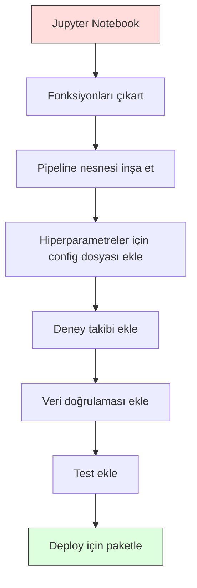

# ML Pipeline'ları

> Model bir ürün değildir. Pipeline ürün ürdür. Pipeline ham veriden deploy edilmiş tahmine kadar her şeydir ve her adım tekrarlanabilir olmalıdır.

**Tür:** Yapım
**Dil:** Python
**Ön koşullar:** Faz 2, Ders 12 (Hiperparametre Ayarlama)
**Süre:** ~120 dakika

## Öğrenme Hedefleri

- Imputation, ölçekleme, encoding ve model eğitimini tek bir tekrarlanabilir nesnede zincirleyen sıfırdan bir ML pipeline'ı inşa et
- Data leakage senaryolarını belirle ve pipeline'ların transformer'ları yalnızca eğitim verisinde uydurarak bunları nasıl önlediğini açıkla
- Sayısal ve kategorik feature'lara farklı ön işleme uygulayan bir ColumnTransformer oluştur
- Pipeline serializasyonunu uygula ve aynı uydurulmuş pipeline'ın eğitimde ve üretimde aynı sonuçları ürettiğini göster

## Sorun

Veri yükleyen, eksik değerleri medyanla dolduran, feature'ları ölçekleyen, bir model eğiten ve accuracy yazdıran bir notebook'un var. Çalışıyor. Yayınlıyorsun.

Bir ay sonra, biri modeli yeniden eğitiyor ve farklı sonuçlar alıyor. Medyan, test verisi dahil tam veri setinde hesaplandı (data leakage). Ölçekleme parametreleri kaydedilmemişti, bu yüzden çıkarım farklı istatistikler kullanıyor. Feature engineering kodu eğitim ve sunum arasında copy-paste yapıldı ve kopyalar farklılaştı. Üretimde bir kategorik kolon, encoder'ın hiç görmediği yeni bir değer kazandı.

Bunlar hipotetik değildir. ML sistemlerinin üretimde başarısız olmasının en yaygın nedenleridir. Pipeline'lar her dönüşüm adımını tek, sıralı, tekrarlanabilir bir nesneye paketleyerek hepsini çözer.

## Kavram

### Pipeline Nedir

Pipeline, bir modelin takip ettiği sıralı bir veri dönüşümleri dizisidir. Her adım önceki adımın çıktısını girdi olarak alır. Tüm pipeline eğitim verisinde bir kez uydurulur. Çıkarım zamanında, aynı uydurulmuş pipeline yeni veriyi dönüştürür ve tahminler üretir.


Pipeline şunları garanti eder:
- Dönüşümler yalnızca eğitim verisinde uydurulur (leakage yok)
- Çıkarım zamanında aynı dönüşümler uygulanır
- Tüm nesne tek bir artifact olarak serialize edilip deploy edilebilir
- Cross-validation pipeline'ı fold başına uygular, ince leakage'ı önler

### Data Leakage: Sessiz Katil

Data leakage, test setinden veya gelecek veriden gelen bilgi eğitimi kirlettiğinde olur. Pipeline'lar en yaygın formları önler.

**Leak olan (yanlış):**
```python
X = df.drop("target", axis=1)
y = df["target"]

scaler = StandardScaler()
X_scaled = scaler.fit_transform(X)

X_train, X_test = X_scaled[:800], X_scaled[800:]
y_train, y_test = y[:800], y[800:]
```

Scaler test verisini gördü. Ortalama ve standart sapma test örneklerini içerir. Bu accuracy tahminlerini şişirir.

**Doğru:**
```python
X_train, X_test = X[:800], X[800:]

scaler = StandardScaler()
X_train_scaled = scaler.fit_transform(X_train)
X_test_scaled = scaler.transform(X_test)
```

Bir pipeline ile bunu düşünmen gerekmez. Pipeline bunu otomatik olarak halleder.

### sklearn Pipeline

sklearn'ün `Pipeline`'ı transformer'ları ve bir estimator'ü zincirler. Tüm adımları sırayla uygulayan `.fit()`, `.predict()` ve `.score()` sunar.

```python
from sklearn.pipeline import Pipeline
from sklearn.preprocessing import StandardScaler
from sklearn.linear_model import LogisticRegression

pipe = Pipeline([
    ("scaler", StandardScaler()),
    ("model", LogisticRegression()),
])

pipe.fit(X_train, y_train)
predictions = pipe.predict(X_test)
```

`pipe.fit(X_train, y_train)` çağırdığında:
1. Scaler X_train üzerinde `fit_transform` çağırır
2. Model ölçeklenen X_train üzerinde `fit` çağırır

`pipe.predict(X_test)` çağırdığında:
1. Scaler X_test üzerinde `transform` (fit_transform değil) çağırır
2. Model ölçeklenen X_test üzerinde `predict` çağırır

Scaler uydurma sırasında test verisini asla görmez. Bütün mesele bu.

### ColumnTransformer: Farklı Kolonlar için Farklı Pipeline'lar

Gerçek veri setlerinin farklı ön işleme gerektiren sayısal ve kategorik kolonları vardır. `ColumnTransformer` bunu halleder.

```python
from sklearn.compose import ColumnTransformer
from sklearn.preprocessing import StandardScaler, OneHotEncoder
from sklearn.impute import SimpleImputer

numeric_pipe = Pipeline([
    ("impute", SimpleImputer(strategy="median")),
    ("scale", StandardScaler()),
])

categorical_pipe = Pipeline([
    ("impute", SimpleImputer(strategy="most_frequent")),
    ("encode", OneHotEncoder(handle_unknown="ignore")),
])

preprocessor = ColumnTransformer([
    ("num", numeric_pipe, ["age", "income", "score"]),
    ("cat", categorical_pipe, ["city", "gender", "plan"]),
])

full_pipeline = Pipeline([
    ("preprocess", preprocessor),
    ("model", GradientBoostingClassifier()),
])
```

OneHotEncoder'daki `handle_unknown="ignore"` üretim için kritiktir. Yeni bir kategori göründüğünde (modelin hiç görmediği bir şehir), çökmek yerine sıfır vektör üretir.

### Deney Takibi

Bir pipeline eğitimi tekrarlanabilir yapar ama ayrıca deneyler boyunca ne olduğunu izlemen gerekir: hangi hiperparametreler kullanıldı, hangi veri seti versiyonu, metrikler neydi, hangi kod çalışıyordu.

**MLflow** en yaygın açık kaynak çözümdür:

```python
import mlflow

with mlflow.start_run():
    mlflow.log_param("max_depth", 5)
    mlflow.log_param("n_estimators", 100)
    mlflow.log_param("learning_rate", 0.1)

    pipe.fit(X_train, y_train)
    accuracy = pipe.score(X_test, y_test)

    mlflow.log_metric("accuracy", accuracy)
    mlflow.sklearn.log_model(pipe, "model")
```

Her çalıştırma parametreler, metrikler, artifact'ler ve tam modelle kaydedilir. Çalıştırmaları karşılaştırabilir, herhangi bir deneyi tekrar üretebilir ve herhangi bir model versiyonunu deploy edebilirsin.

**Weights & Biases (wandb)** barındırılmış bir dashboard ile aynı işlevselliği sağlar:

```python
import wandb

wandb.init(project="my-pipeline")
wandb.config.update({"max_depth": 5, "n_estimators": 100})

pipe.fit(X_train, y_train)
accuracy = pipe.score(X_test, y_test)

wandb.log({"accuracy": accuracy})
```

### Model Versiyonlama

Deney takibinden sonra, model versiyonlarını yönetmen gerekir. Hangi model üretimde? Hangisi staging'de? Hangisi geçen haftaydı?

MLflow'un Model Registry'si şunları sağlar:
- **Versiyon takibi:** Her kaydedilen model bir versiyon numarası alır
- **Aşama geçişleri:** "Staging", "Production", "Archived"
- **Onay iş akışı:** Modeller açıkça üretime promote edilmelidir
- **Rollback:** Önceki bir versiyona anında geri dön

### DVC ile Veri Versiyonlama

Kod git ile versiyonlanır. Veri de versiyonlanmalı ama git büyük dosyaları işleyemez. DVC (Data Version Control) bunu çözer.

```
dvc init
dvc add data/training.csv
git add data/training.csv.dvc data/.gitignore
git commit -m "Track training data"
dvc push
```

DVC, gerçek veriyi uzak depolama alanında (S3, GCS, Azure) saklar ve hash'i kaydeden küçük bir `.dvc` dosyasını git'te tutar. Bir git commit'ini checkout ettiğinde, `dvc checkout` kullanılan tam veriyi geri yükler.

Bu, her git commit'inin hem kodu hem de veriyi sabitlediği anlamına gelir. Tam tekrarlanabilirlik.

### Tekrarlanabilir Deneyler

Tekrarlanabilir bir deney dört şey gerektirir:

1. **Sabit rastgele seed'ler:** numpy, random ve framework (torch, sklearn) için seed'leri ayarla
2. **Sabitlenmiş bağımlılıklar:** Tam versiyonlarla requirements.txt veya poetry.lock
3. **Versiyonlanmış veri:** DVC veya benzeri
4. **Config dosyaları:** Tüm hiperparametreler bir config'te, hardcode değil

```python
import numpy as np
import random

def set_seed(seed=42):
    random.seed(seed)
    np.random.seed(seed)
    try:
        import torch
        torch.manual_seed(seed)
        torch.cuda.manual_seed_all(seed)
        torch.backends.cudnn.deterministic = True
    except ImportError:
        pass
```

### Notebook'tan Üretim Pipeline'ına



Tipik ilerleme:

1. **Notebook keşfi:** Hızlı deneyler, görselleştirmeler, feature fikirleri
2. **Fonksiyonları çıkart:** Ön işleme, feature engineering, değerlendirmeyi modüllere taşı
3. **Pipeline inşa et:** Dönüşümleri bir sklearn Pipeline'a veya özel sınıfa zincirle
4. **Config yönetimi:** Tüm hiperparametreleri bir YAML/JSON config'e taşı
5. **Deney takibi:** MLflow veya wandb logging ekle
6. **Veri doğrulaması:** Eğitim öncesinde şema, dağılımlar ve eksik değer örüntülerini kontrol et
7. **Testler:** Transformer'lar için birim testleri, tam pipeline için entegrasyon testleri
8. **Deployment:** Pipeline'ı serialize et, bir API'de sar (FastAPI, Flask), container'la

### Yaygın Pipeline Hataları

| Hata | Neden kötü | Çözüm |
|---------|-------------|-----|
| Bölmeden önce tam veride uydurma | Data leakage | cross_val_score ile Pipeline kullan |
| Pipeline dışında feature engineering | Train ile serve arasında farklı dönüşümler | Tüm dönüşümleri Pipeline'a koy |
| Bilinmeyen kategorileri ele almama | Yeni değerlerde üretim çöküşü | OneHotEncoder(handle_unknown="ignore") |
| Hardcoded kolon adları | Şema değiştiğinde kırılır | Config'ten kolon adı listeleri kullan |
| Veri doğrulaması yok | Kötü veride sessiz yanlış tahminler | Tahmin öncesinde şema kontrolleri ekle |
| Training/serving skew | Model üretimde farklı feature görüyor | İkisi için tek bir Pipeline nesnesi |

## İnşa Et

`code/pipeline.py` içindeki kod sıfırdan tam bir ML pipeline'ı inşa eder:

### Adım 1: Özel Transformer

```python
class CustomTransformer:
    def __init__(self):
        self.means = None
        self.stds = None

    def fit(self, X):
        self.means = np.mean(X, axis=0)
        self.stds = np.std(X, axis=0)
        self.stds[self.stds == 0] = 1.0
        return self

    def transform(self, X):
        return (X - self.means) / self.stds

    def fit_transform(self, X):
        return self.fit(X).transform(X)
```

### Adım 2: Sıfırdan Pipeline

```python
class PipelineFromScratch:
    def __init__(self, steps):
        self.steps = steps

    def fit(self, X, y=None):
        X_current = X.copy()
        for name, step in self.steps[:-1]:
            X_current = step.fit_transform(X_current)
        name, model = self.steps[-1]
        model.fit(X_current, y)
        return self

    def predict(self, X):
        X_current = X.copy()
        for name, step in self.steps[:-1]:
            X_current = step.transform(X_current)
        name, model = self.steps[-1]
        return model.predict(X_current)
```

### Adım 3: Pipeline ile Cross-Validation

Kod, pipeline ile cross-validation'ın data leakage'ı nasıl önlediğini gösterir: scaler her fold'un eğitim verisinde ayrı ayrı uydurulur.

### Adım 4: sklearn ile Tam Üretim Pipeline'ı

`ColumnTransformer`, birden fazla ön işleme yolu ve bir modelle, uygun cross-validation ve deney logging ile eğitilmiş tam bir pipeline.

## Yayınla

Bu ders şunları üretir:
- `outputs/prompt-ml-pipeline.md` -- ML pipeline'larını inşa etme ve debug etme için bir skill
- `code/pipeline.py` -- sıfırdan sklearn'e tam bir pipeline

## Alıştırmalar

1. 3 sayısal kolon ve 2 kategorik kolonlu bir veri setini ele alan bir pipeline inşa et. Sayısallara medyan imputation + ölçekleme ve kategoriklere en sık imputation + one-hot encoding uygulamak için `ColumnTransformer` kullan. 5-fold cross-validation ile eğit.

2. Kasıtlı olarak data leakage tanıt: bölmeden önce scaler'ı tam veri setine uydur. Cross-validation skorunu (leak'li) pipeline cross-validation skoruyla (temiz) karşılaştır. Fark ne kadar büyük?

3. Pipeline'ını `joblib.dump` ile serialize et. Onu ayrı bir script'te yükle ve tahminler çalıştır. Tahminlerin aynı olduğunu doğrula.

4. Pipeline'a, en önemli iki sayısal kolon için polinom feature'lar (derece 2) yaratan özel bir transformer ekle. Pipeline'da nereye gitmeli?

5. Pipeline için MLflow takibi kur. Farklı hiperparametrelerle 5 deney çalıştır. Çalıştırmaları karşılaştırmak ve en iyi modeli seçmek için MLflow UI (`mlflow ui`) kullan.

## Anahtar Terimler

| Terim | İnsanlar ne der | Aslında ne demek |
|------|----------------|----------------------|
| Pipeline | "Dönüşümler + model zinciri" | Leakage'ı önlemek için tek bir birim olarak uygulanan, uydurulmuş transformer'lar ve bir modelin sıralı dizisi |
| Data leakage | "Test bilgisi eğitime sızdı" | Eğitim setinin dışındaki bilgileri modeli inşa etmek için kullanmak, performans tahminlerini şişirir |
| ColumnTransformer | "Kolon başına farklı ön işleme" | Farklı kolon alt kümelerine farklı pipeline'lar uygular, sonuçları birleştirir |
| Deney takibi | "Çalıştırmalarını logla" | Her eğitim çalıştırması için parametreleri, metrikleri, artifact'leri ve kod versiyonlarını kaydetmek |
| MLflow | "Modelleri takip et ve deploy et" | Deney takibi, model registry ve deployment için açık kaynak platform |
| DVC | "Veri için git" | Hash'leri git'te ve veriyi uzak depolama alanında saklayan büyük veri dosyaları için versiyon kontrol sistemi |
| Model registry | "Model versiyon kataloğu" | Aşama etiketleriyle (staging, production, archived) model versiyonlarını izleyen bir sistem |
| Training/serving skew | "Notebook'ta çalışıyordu" | Veri eğitim ile çıkarım sırasında nasıl işlendiği arasındaki farklar, sessiz hatalara neden olur |
| Tekrarlanabilirlik | "Aynı kod, aynı sonuç" | Aynı kod, veri ve yapılandırmadan aynı sonuçları alma yeteneği |

## Daha Fazla Okuma

- [scikit-learn Pipeline docs](https://scikit-learn.org/stable/modules/compose.html) -- resmi pipeline referansı
- [MLflow documentation](https://mlflow.org/docs/latest/index.html) -- deney takibi ve model registry
- [DVC documentation](https://dvc.org/doc) -- veri versiyonlama
- [Sculley et al., Hidden Technical Debt in Machine Learning Systems (2015)](https://papers.nips.cc/paper/2015/hash/86df7dcfd896fcaf2674f757a2463eba-Abstract.html) -- ML sistem karmaşıklığı üzerine seminal makale
- [Google ML Best Practices: Rules of ML](https://developers.google.com/machine-learning/guides/rules-of-ml) -- pratik üretim ML tavsiyesi
