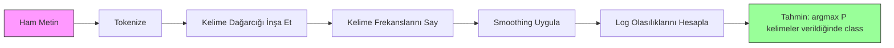

# Naive Bayes

> "Naif" varsayım yanlıştır ve yine de işe yarar. Onun güzelliği budur.

**Tür:** Yapım
**Dil:** Python
**Ön koşullar:** Faz 2, Dersler 01-07 (sınıflandırma, Bayes teoremi)
**Süre:** ~75 dakika

## Öğrenme Hedefleri

- Metin sınıflandırması için Laplace smoothing ile sıfırdan Multinomial Naive Bayes uygula
- Naif bağımsızlık varsayımının matematiksel olarak neden yanlış olduğunu ama pratikte neden doğru sınıf sıralamaları ürettiğini açıkla
- Multinomial, Bernoulli ve Gaussian Naive Bayes varyantlarını karşılaştır ve verilen bir feature tipi için doğru olanı seç
- Yüksek boyutlu seyrek veride Naive Bayes'i lojistik regresyona karşı değerlendir ve iş başındaki bias-variance dengesini açıkla

## Sorun

Metin sınıflandırman gerekiyor. E-postaları spam veya spam-değil olarak. Müşteri yorumlarını pozitif veya negatif olarak. Destek biletlerini kategorilere. Binlerce feature'ın (kelime başına bir tane) ve sınırlı eğitim verin var.

Çoğu sınıflandırıcı burada boğulur. Lojistik regresyonun binlerce ağırlığı güvenilir şekilde tahmin etmek için yeterli örneğe ihtiyacı vardır. Karar ağaçları her seferinde bir kelime üzerinde bölünür ve çılgınca overfit yapar. 10.000 boyuttaki KNN anlamsızdır çünkü her nokta her diğer noktaya eşit ölçüde uzaktır.

Naive Bayes bunu halleder. Matematiksel olarak yanlış bir varsayım yapar (her feature'ın sınıf verildiğinde her diğer feature'dan bağımsız olduğu) ve metin sınıflandırmasında "daha akıllı" modelleri yine de yener, özellikle küçük eğitim setleriyle. Veri üzerinde tek bir geçişte eğitir. Milyonlarca feature'a ölçeklenir. Olasılık tahminleri üretir (gerçi bağımsızlık varsayımı nedeniyle genellikle kötü kalibre edilmiştir).

Yanlış bir varsayımın neden iyi tahminlere yol açtığını anlamak, makine öğrenmesi hakkında temel bir şey öğretir: en iyi model en doğru olan değildir, veriniz için en iyi bias-variance dengesine sahip olandır.

## Kavram

### Bayes Teoremi (Hızlı İnceleme)

Bayes teoremi koşullu olasılıkları çevirir:

```
P(class | features) = P(features | class) * P(class) / P(features)
```

`P(class | features)`'i istiyoruz -- bir belgenin içindeki kelimeler verildiğinde bir sınıfa ait olma olasılığı. Bunu şunlardan hesaplayabiliriz:
- `P(features | class)` -- bu sınıftaki belgelerde bu kelimeleri görme olabilirliği
- `P(class)` -- sınıfın önsel olasılığı (spam genel olarak ne kadar yaygın?)
- `P(features)` -- kanıt, tüm sınıflar için aynı, bu yüzden karşılaştırırken görmezden gelebiliriz

En yüksek `P(class | features)` değerine sahip sınıf kazanır.

### Naif Bağımsızlık Varsayımı

`P(features | class)`'i tam olarak hesaplamak, tüm feature'ların ortak olasılığını tahmin etmeyi gerektirir. 10.000 kelimelik bir kelime dağarcığıyla, 2^10.000 olası kombinasyon üzerinde bir dağılımı tahmin etmen gerekir. İmkansız.

Naif varsayım: her feature, sınıf verildiğinde koşullu olarak bağımsızdır.

```
P(w1, w2, ..., wn | class) = P(w1 | class) * P(w2 | class) * ... * P(wn | class)
```

İmkansız bir ortak dağılım yerine, n basit feature başı dağılım tahmin edersin. Her birinin yalnızca bir saymaya ihtiyacı var.

Bu varsayım açıkça yanlıştır. "Machine" ve "learning" kelimeleri herhangi bir belgede bağımsız değildir. Ama sınıflandırıcının doğru olasılık tahminlerine ihtiyacı yoktur. Doğru sıralamalara ihtiyacı vardır -- hangi sınıfın en yüksek olasılığı var. Bağımsızlık varsayımı sistematik hatalar getirir ama bu hatalar tüm sınıfları benzer şekilde etkiler, bu yüzden sıralama doğru kalır.

### Neden Hâlâ Çalışıyor

Üç neden:

1. **Kalibrasyon yerine sıralama.** Sınıflandırma yalnızca en üst sıradaki sınıfın doğru olmasını gerektirir. Gerçek olasılık 0.7 iken P(spam) = 0.99999 olsa bile, sınıflandırıcı yine de spam'i doğru seçer. Doğru olasılıklara ihtiyacımız yok. Doğru kazanana ihtiyacımız var.

2. **Yüksek bias, düşük variance.** Bağımsızlık varsayımı güçlü bir öncüldür. Modeli ağır şekilde kısıtlar, bu da overfitting'i önler. Sınırlı eğitim verisiyle, biraz yanlış ama kararlı bir model, teorik olarak doğru ama çılgınca kararsız bir modeli yener. Bu eylemdeki bias-variance dengesidir.

3. **Feature gerekliliği birbirini götürür.** İlişkili feature'lar gereksiz kanıt sağlar. Sınıflandırıcı bu kanıtı çift sayar ama doğru sınıf için de çift sayar. "Machine" ve "learning" her zaman birlikte görünüyorsa, ikisi de "tech" sınıfı için kanıt sağlar. NB onları iki kez sayar ama doğru sınıf için iki kez sayar.

Dördüncü, pratik bir neden: Naive Bayes son derece hızlıdır. Eğitim, frekansları sayan veri üzerinde tek bir geçiştir. Tahmin bir matris çarpımıdır. Bir milyon belge üzerinde saniyeler içinde eğitebilirsin. Bu hız, daha hızlı iterasyon yapabileceğin, daha fazla feature seti deneyebileceğin ve daha yavaş modellerle yaptığından daha fazla deney çalıştırabileceğin anlamına gelir.

### Adım Adım Matematik

Somut bir örneği takip edelim. Diyelim ki iki sınıfımız var: spam ve spam-değil. Kelime dağarcığımızın üç kelimesi var: "free", "money", "meeting".

Eğitim verisi:
- Spam e-postalar "free"den 80 kez, "money"den 60 kez, "meeting"den 10 kez bahseder (toplam 150 kelime)
- Spam-değil e-postalar "free"den 5 kez, "money"den 10 kez, "meeting"den 100 kez bahseder (toplam 115 kelime)
- E-postaların %40'ı spam, %60'ı spam-değil

Laplace smoothing ile (alpha=1):

```
P(free | spam)    = (80 + 1) / (150 + 3) = 81/153 = 0.529
P(money | spam)   = (60 + 1) / (150 + 3) = 61/153 = 0.399
P(meeting | spam) = (10 + 1) / (150 + 3) = 11/153 = 0.072

P(free | not-spam)    = (5 + 1) / (115 + 3) = 6/118 = 0.051
P(money | not-spam)   = (10 + 1) / (115 + 3) = 11/118 = 0.093
P(meeting | not-spam) = (100 + 1) / (115 + 3) = 101/118 = 0.856
```

Yeni e-posta içeriği: "free" (2 kez), "money" (1 kez), "meeting" (0 kez).

```
log P(spam | email) = log(0.4) + 2*log(0.529) + 1*log(0.399) + 0*log(0.072)
                    = -0.916 + 2*(-0.637) + (-0.919) + 0
                    = -3.109

log P(not-spam | email) = log(0.6) + 2*log(0.051) + 1*log(0.093) + 0*log(0.856)
                        = -0.511 + 2*(-2.976) + (-2.375) + 0
                        = -8.838
```

Spam büyük bir farkla kazanır. "Free" kelimesinin iki kez görünmesi spam için güçlü bir kanıttır. "Meeting"in görünmemesinin her iki log toplamına da (0 * log(P)) sıfır katkıda bulunduğunu unutmayın -- Multinomial NB'de, eksik kelimelerin etkisi yoktur. Kelime yokluğunu açıkça modelleyen Bernoulli NB'dir.

### Üç Varyant

Naive Bayes üç çeşitte gelir. Her biri `P(feature | class)`'i farklı şekilde modeller.

#### Multinomial Naive Bayes

Her feature'ı bir sayı olarak modeller. Feature'ların kelime frekansları veya TF-IDF değerleri olduğu metin verisi için en iyisidir.

```
P(word_i | class) = (count of word_i in class + alpha) / (total words in class + alpha * vocab_size)
```

`alpha` Laplace smoothing'dir (aşağıda açıklanmıştır). Bu varyant metin sınıflandırmasının iş beygiridir.

#### Gaussian Naive Bayes

Her feature'ı bir normal dağılım olarak modeller. Sürekli feature'lar için en iyisidir.

```
P(x_i | class) = (1 / sqrt(2 * pi * var)) * exp(-(x_i - mean)^2 / (2 * var))
```

Her sınıf feature başına kendi ortalama ve variance'ını alır. Feature'lar her sınıfta gerçekten bir çan eğrisi takip ettiğinde iyi çalışır.

#### Bernoulli Naive Bayes

Her feature'ı ikili (var veya yok) olarak modeller. Kısa metin veya ikili feature vektörleri için en iyisidir.

```
P(word_i | class) = (docs in class containing word_i + alpha) / (total docs in class + 2 * alpha)
```

Multinomial'in aksine, Bernoulli bir kelimenin yokluğunu açıkça cezalandırır. "Free" tipik olarak spam'de görünüyor ama bu e-postada yoksa, Bernoulli bunu spam'e karşı kanıt olarak sayar.

### Her Varyantı Ne Zaman Kullanmalı

| Varyant | Feature Tipi | En İyi Olduğu Durum | Örnek |
|---------|-------------|----------|---------|
| Multinomial | Sayılar veya frekanslar | Metin sınıflandırması, bag-of-words | E-posta spam, konu sınıflandırması |
| Gaussian | Sürekli değerler | Normalimsi feature'lı tablolu veri | Iris sınıflandırma, sensör verisi |
| Bernoulli | İkili (0/1) | Kısa metin, ikili feature vektörleri | SMS spam, varlık/yokluk feature'ları |

### Laplace Smoothing

Test verisinde görünen ama belirli bir sınıf için eğitim verisinde hiç görünmemiş bir kelime olduğunda ne olur?

Smoothing olmadan: `P(word | class) = 0/N = 0`. Tüm çarpım boyunca çarpılan bir sıfır, diğer tüm kanıtlardan bağımsız olarak `P(class | features) = 0` yapar. Tek bir görülmemiş kelime tüm tahmini yok eder, onu destekleyen başka ne kadar çok kanıt olursa olsun.

Laplace smoothing, her feature sayısına küçük bir sayı `alpha` (genellikle 1) ekler:

```
P(word_i | class) = (count(word_i, class) + alpha) / (total_words_in_class + alpha * vocab_size)
```

alpha=1 ile, her kelime en azından küçücük bir olasılık alır. Bir test e-postasında görünen "discombobulate" kelimesi artık spam olasılığını öldürmez. Smoothing'in Bayesçi bir yorumu vardır: kelime dağılımlarına üniform Dirichlet öncülü yerleştirmeye eşdeğerdir.

Daha yüksek alpha daha güçlü smoothing demektir (daha üniform dağılımlar). Daha düşük alpha modelin veriye daha çok güvendiği anlamına gelir. Alpha ayarladığın bir hiperparametredir.

Alpha'nın etkisi:

| Alpha | Etki | Ne zaman kullanılır |
|-------|--------|-------------|
| 0.001 | Neredeyse smoothing yok, veriye güven | Çok büyük eğitim seti, görülmemiş feature beklenmiyor |
| 0.1 | Hafif smoothing | Büyük eğitim seti |
| 1.0 | Standart Laplace smoothing | Varsayılan başlangıç noktası |
| 10.0 | Ağır smoothing, dağılımları düzleştirir | Çok küçük eğitim seti, çok görülmemiş feature bekleniyor |

### Log-Uzayında Hesaplama

Yüzlerce olasılığı (her biri 1'den küçük) çarpmak floating-point underflow'a neden olur. Çarpım, gerçek değer çok küçük pozitif bir sayı olsa bile floating point'te sıfır olur.

Çözüm: log uzayında çalış. Olasılıkları çarpmak yerine, logaritmalarını topla:

```
log P(class | x1, x2, ..., xn) = log P(class) + sum_i log P(xi | class)
```

Bu tahmini bir iç çarpıma dönüştürür:

```
log_scores = X @ log_feature_probs.T + log_class_priors
prediction = argmax(log_scores)
```

Matris çarpımı. Naive Bayes tahmininin neden bu kadar hızlı olduğu işte bu -- tek katmanlı doğrusal bir modelle aynı işlemdir.

### Naive Bayes vs Lojistik Regresyon

İkisi de metin için doğrusal sınıflandırıcılardır. Fark modelledikleri şeydir.

| Özellik | Naive Bayes | Lojistik Regresyon |
|--------|------------|-------------------|
| Tip | Üretken (P(X\|Y) modelleyen) | Ayırt edici (P(Y\|X) modelleyen) |
| Eğitim | Frekansları say | Loss fonksiyonunu optimize et |
| Küçük veri | Daha iyi (güçlü öncül yardımcı olur) | Daha kötü (ağırlıkları tahmin etmek yeterli değil) |
| Büyük veri | Daha kötü (yanlış varsayım zarar verir) | Daha iyi (esnek sınır) |
| Feature'lar | Bağımsızlık varsayar | Korelasyonları ele alır |
| Hız | Tek geçiş, çok hızlı | İteratif optimizasyon |
| Kalibrasyon | Kötü olasılıklar | Daha iyi olasılıklar |

Pratik kural: Naive Bayes ile başla. Yeterince verin varsa ve NB plato yaparsa, lojistik regresyona geç.

### Sınıflandırma Pipeline'ı



Pratikte, floating-point underflow'tan kaçınmak için log uzayında çalışırız. Birçok küçük olasılığı çarpmak yerine, logaritmalarını topluyoruz:

```
log P(class | features) = log P(class) + sum_i log P(feature_i | class)
```

## İnşa Et

`code/naive_bayes.py` içindeki kod hem MultinomialNB hem de GaussianNB'yi sıfırdan uygular.

### MultinomialNB

Sıfırdan uygulama:

1. **fit(X, y)**: Her sınıf için, her feature'ın frekansını say. Laplace smoothing ekle. Log olasılıklarını hesapla. Sınıf öncüllerini sakla (sınıf frekanslarının log'u).

2. **predict_log_proba(X)**: Her örnek için, tüm sınıflar için log P(class) + log P(feature_i | class) toplamını hesapla. Bu bir matris çarpımıdır: X @ log_probs.T + log_priors.

3. **predict(X)**: En yüksek log olasılığına sahip sınıfı döndür.

```python
class MultinomialNB:
    def __init__(self, alpha=1.0):
        self.alpha = alpha

    def fit(self, X, y):
        classes = np.unique(y)
        n_classes = len(classes)
        n_features = X.shape[1]

        self.classes_ = classes
        self.class_log_prior_ = np.zeros(n_classes)
        self.feature_log_prob_ = np.zeros((n_classes, n_features))

        for i, c in enumerate(classes):
            X_c = X[y == c]
            self.class_log_prior_[i] = np.log(X_c.shape[0] / X.shape[0])
            counts = X_c.sum(axis=0) + self.alpha
            self.feature_log_prob_[i] = np.log(counts / counts.sum())

        return self
```

Anahtar içgörü: uydurmadan sonra, tahmin sadece bir matris çarpımı artı bir bias'tır. Naive Bayes'in neden bu kadar hızlı olduğu işte bu.

### GaussianNB

Sürekli feature'lar için, sınıf başına feature başına ortalama ve variance tahmin ederiz:

```python
class GaussianNB:
    def __init__(self):
        pass

    def fit(self, X, y):
        classes = np.unique(y)
        self.classes_ = classes
        self.means_ = np.zeros((len(classes), X.shape[1]))
        self.vars_ = np.zeros((len(classes), X.shape[1]))
        self.priors_ = np.zeros(len(classes))

        for i, c in enumerate(classes):
            X_c = X[y == c]
            self.means_[i] = X_c.mean(axis=0)
            self.vars_[i] = X_c.var(axis=0) + 1e-9
            self.priors_[i] = X_c.shape[0] / X.shape[0]

        return self
```

Tahmin feature başına Gauss PDF kullanır, feature'lar arasında çarpılır (log uzayında toplanır).

### Demo: Metin Sınıflandırması

Kod, iki sınıfı (teknoloji makaleleri vs spor makaleleri) simüle eden sentetik bag-of-words verisi üretir. Her sınıfın farklı bir kelime frekans dağılımı vardır. MultinomialNB onları kelime sayıları kullanarak sınıflandırır.

Sentetik veri şöyle çalışır: 200 "kelime" (feature kolonu) yaratıyoruz. 0-39 kelimeleri teknoloji makalelerinde yüksek frekansa ve sporda düşük frekansa sahiptir. 80-119 kelimeleri sporda yüksek frekansa ve teknolojide düşük frekansa sahiptir. 40-79 kelimeleri her ikisinde de orta frekansta. Bu, bazı kelimelerin güçlü sınıf göstergeleri ve diğerlerinin gürültü olduğu gerçekçi bir senaryo yaratır.

### Demo: Sürekli Feature'lar

Kod Iris benzeri veri üretir (3 sınıf, 4 feature, Gauss kümeleri). GaussianNB sınıf başına ortalama ve variance kullanarak sınıflandırır. Her sınıfın farklı bir merkezi (ortalama vektör) ve farklı bir yayılması (variance) vardır, ölçümlerin kategoriler arasında sistematik olarak farklılaştığı gerçek dünya verisini taklit eder.

Kod ayrıca şunları gösterir:
- **Smoothing karşılaştırması:** Smoothing gücünün accuracy üzerindeki etkisini göstermek için MultinomialNB'yi farklı alpha değerleriyle eğitmek.
- **Eğitim boyutu deneyi:** Eğitim verisi 20'den 1600 örneğe büyürken NB accuracy'sinin nasıl iyileştiği. NB çok az örnekle bile makul bir accuracy'ye ulaşır -- bu onun ana avantajıdır.
- **Confusion matrix:** NB'nin nerede hata yaptığını göstermek için sınıf başına precision, recall ve F1 skoru.

### Tahmin Hızı

Naive Bayes tahmini bir matris çarpımıdır. d feature ve k sınıflı n örnek için:
- MultinomialNB: bir matris çarpımı (n x d) @ (d x k) = O(n * d * k)
- GaussianNB: her biri d feature üzerinde n * k Gauss PDF değerlendirmesi = O(n * d * k)

İkisi de her boyutta doğrusaldır. Bunu KNN (tüm eğitim noktalarına mesafe hesaplaması gerektiren) veya RBF kernel'li SVM (tüm support vector'lere karşı kernel değerlendirmesi gerektiren) ile karşılaştır. NB tahmin zamanında büyüklük dereceleri kadar daha hızlıdır.

## Kullan

sklearn ile, her iki varyant da tek satırlıktır:

```python
from sklearn.naive_bayes import GaussianNB, MultinomialNB

gnb = GaussianNB()
gnb.fit(X_train, y_train)
print(f"GaussianNB accuracy: {gnb.score(X_test, y_test):.3f}")

mnb = MultinomialNB(alpha=1.0)
mnb.fit(X_train_counts, y_train)
print(f"MultinomialNB accuracy: {mnb.score(X_test_counts, y_test):.3f}")
```

sklearn ile metin sınıflandırması için:

```python
from sklearn.feature_extraction.text import CountVectorizer
from sklearn.naive_bayes import MultinomialNB
from sklearn.pipeline import Pipeline

text_clf = Pipeline([
    ("vectorizer", CountVectorizer()),
    ("classifier", MultinomialNB(alpha=1.0)),
])

text_clf.fit(train_texts, train_labels)
accuracy = text_clf.score(test_texts, test_labels)
```

`naive_bayes.py` içindeki kod, doğruluğu doğrulamak için aynı veride sıfırdan uygulamaları sklearn'e karşı karşılaştırır.

### Naive Bayes ile TF-IDF

Ham kelime sayıları her kelimeye oluşum başına eşit ağırlık verir. Ama "the" ve "is" gibi yaygın kelimeler her sınıfta sık sık görünür -- bilgi taşımazlar. TF-IDF (Term Frequency - Inverse Document Frequency) yaygın kelimelerin ağırlığını düşürür ve nadir, ayırt edici kelimelerin ağırlığını artırır.

```python
from sklearn.feature_extraction.text import TfidfVectorizer
from sklearn.naive_bayes import MultinomialNB
from sklearn.pipeline import Pipeline

text_clf = Pipeline([
    ("tfidf", TfidfVectorizer()),
    ("classifier", MultinomialNB(alpha=0.1)),
])
```

TF-IDF değerleri negatif olmadığından, MultinomialNB ile çalışırlar. TF-IDF + MultinomialNB kombinasyonu metin sınıflandırması için en güçlü baseline'lardan biridir. 10.000'den az eğitim örneğine sahip veri setlerinde daha karmaşık modelleri sık sık yener.

### Kısa Metin için BernoulliNB

Kısa metin (tweet'ler, SMS, sohbet mesajları) için BernoulliNB MultinomialNB'yi yenebilir. Kısa metinlerin düşük kelime sayıları vardır, bu yüzden MultinomialNB'nin güvendiği frekans bilgisi gürültülüdür. BernoulliNB yalnızca varlık veya yokluk umurundadır, bu kısa metinle daha güvenilirdir.

```python
from sklearn.naive_bayes import BernoulliNB
from sklearn.feature_extraction.text import CountVectorizer

text_clf = Pipeline([
    ("vectorizer", CountVectorizer(binary=True)),
    ("classifier", BernoulliNB(alpha=1.0)),
])
```

CountVectorizer'daki `binary=True` bayrağı tüm sayıları 0/1'e dönüştürür. O olmadan, BernoulliNB hâlâ çalışır ama tasarlanmadığı sayıları görür.

### NB Olasılıklarını Kalibre Etmek

NB olasılıkları kötü kalibre edilmiştir. NB P(spam) = 0.95 dediğinde, gerçek olasılık 0.7 olabilir. Güvenilir olasılık tahminlerine ihtiyacın varsa (örneğin, bir eşik ayarlamak veya diğer modellerle birleştirmek için), sklearn'ün CalibratedClassifierCV'sini kullan:

```python
from sklearn.calibration import CalibratedClassifierCV

calibrated_nb = CalibratedClassifierCV(MultinomialNB(), cv=5, method="sigmoid")
calibrated_nb.fit(X_train, y_train)
proba = calibrated_nb.predict_proba(X_test)
```

Bu, cross-validation kullanarak NB'nin ham skorlarının üzerine bir lojistik regresyon uydurur. Ortaya çıkan olasılıklar gerçek sınıf frekanslarına çok daha yakındır.

### Yaygın Tuzaklar

1. **Negatif feature değerleri.** MultinomialNB negatif olmayan feature'lar gerektirir. Negatif değerlerin varsa (belirli ayarlarda TF-IDF veya standartlaştırılmış feature'lar gibi), bunun yerine GaussianNB kullan ya da feature'ları pozitif olacak şekilde kaydır.

2. **Sıfır variance feature'ları.** GaussianNB variance'a böler. Bir sınıf için bir feature'ın sıfır variance'ı varsa (tüm değerler aynı), olasılık hesaplaması kırılır. Kod, bunu önlemek için tüm variance'lara küçük bir smoothing terimi (1e-9) ekler.

3. **Sınıf dengesizliği.** E-postaların %99'u spam-değilse, öncül P(not-spam) = 0.99 o kadar güçlüdür ki olabilirlik kanıtını alt eder. Sınıf öncüllerini manuel olarak ayarlayabilir veya sklearn'de class_prior parametresini kullanabilirsin.

4. **Feature ölçekleme.** MultinomialNB ölçeklemeye ihtiyaç duymaz (sayılarda çalışır). GaussianNB de ölçeklemeye ihtiyaç duymaz (feature başına istatistikleri tahmin eder). Bu, feature ölçeklerine duyarlı olan lojistik regresyon ve SVM'ye karşı bir avantajdır.

## Yayınla

Bu ders şunları üretir:
- `outputs/skill-naive-bayes-chooser.md` -- doğru NB varyantını seçmek için bir karar skill'i
- `code/naive_bayes.py` -- sklearn karşılaştırmasıyla sıfırdan MultinomialNB ve GaussianNB

### Naive Bayes Ne Zaman Başarısız Olur

NB, bağımsızlık varsayımı yanlış sıralamalara neden olduğunda (sadece yanlış olasılıklara değil) başarısız olur. Bu şu durumlarda olur:

1. **Güçlü feature etkileşimleri.** Sınıf iki feature'ın kombinasyonuna bağlıysa ama tek başına ikisinden birine değilse (XOR-benzeri örüntüler), NB bunu tamamen kaçıracaktır. Her feature tek başına kanıt sağlamaz ve NB onları doğrusal olmayan şekilde birleştiremez.

2. **Karşıt kanıtlı yüksek korelasyonlu feature'lar.** Feature A "spam" ve feature B "spam-değil" derken, A ve B mükemmel korelasyonluysa (gerçekte her zaman aynı fikirde olurlar), NB olmayan bir yerde çatışan kanıt görür.

3. **Çok büyük eğitim setleri.** Yeterli veriyle, lojistik regresyon gibi ayırt edici modeller gerçek karar sınırını öğrenir ve NB'yi yener. Küçük veriyle yardımcı olan bağımsızlık varsayımı artık modeli geri tutar.

Pratikte, bu başarısızlık modları metin sınıflandırması için nadirdir. Metin feature'ları çoktur, tek tek zayıftır ve bağımsızlık varsayımının hataları birbirini götürme eğilimindedir. Az ama güçlü korelasyonlu feature'a sahip tablolu veri için, önce lojistik regresyon veya ağaç tabanlı modelleri düşün.

## Alıştırmalar

1. **Smoothing deneyi.** MultinomialNB'yi metin verisinde 0.01, 0.1, 1.0, 10.0 ve 100.0 alpha değerleriyle eğit. Alpha'ya karşı accuracy çiz. Performans nerede zirveye ulaşır? Çok yüksek alpha neden zarar verir?

2. **Feature bağımsızlık testi.** Gerçek bir metin veri seti al. Açıkça korelasyonlu iki kelime seç ("machine" ve "learning"). P(word1 | class) * P(word2 | class)'i hesapla ve P(word1 VE word2 | class) ile karşılaştır. Bağımsızlık varsayımı ne kadar yanlış? Sınıflandırma accuracy'sini etkiliyor mu?

3. **Bernoulli uygulaması.** Kodu bir BernoulliNB sınıfıyla genişlet. Bag-of-words'ü ikiliye (var/yok) dönüştür ve metin verisinde accuracy'yi MultinomialNB ile karşılaştır. Bernoulli ne zaman kazanır?

4. **NB vs Lojistik Regresyon.** İkisini de metin verisinde eğit. 100 eğitim örneğiyle başla ve 10.000'e artır. Her ikisi için eğitim seti boyutuna karşı accuracy çiz. Lojistik Regresyon Naive Bayes'i hangi noktada geçer?

5. **Spam filtresi.** Tam bir spam sınıflandırıcı inşa et: ham e-posta metnini tokenize et, kelime dağarcığı inşa et, bag-of-words feature'ları yarat, MultinomialNB eğit, precision ve recall ile değerlendir (sadece accuracy değil -- neden?).

## Anahtar Terimler

| Terim | İnsanlar ne der | Aslında ne demek |
|------|----------------|----------------------|
| Naive Bayes | "Basit olasılıksal sınıflandırıcı" | Sınıf verildiğinde feature'ların koşullu bağımsız olduğu varsayımıyla Bayes teoremini uygulayan bir sınıflandırıcı |
| Koşullu bağımsızlık | "Feature'lar birbirini etkilemez" | P(A, B \| C) = P(A \| C) * P(B \| C) -- C bilindiğinde B'yi bilmek A hakkında yeni bir şey söylemez |
| Laplace smoothing | "Bir ekleme smoothing'i" | Sıfır olasılıkların tahmine baskın gelmesini önlemek için her feature'a küçük bir sayı eklemek |
| Öncül | "Veriyi görmeden önce inandığın" | P(class) -- herhangi bir feature gözlemlemeden önce her sınıfın olasılığı |
| Olabilirlik | "Verinin ne kadar uyduğu" | P(features \| class) -- sınıf biliniyorsa bu feature'ları gözlemleme olasılığı |
| Sonsal | "Veriyi gördükten sonra inandığın" | P(class \| features) -- feature'ları gözlemledikten sonra sınıfın güncellenmiş olasılığı |
| Üretken model | "Verinin nasıl üretildiğini modeller" | P(X \| Y) ve P(Y) öğrenen, sonra P(Y \| X) elde etmek için Bayes teoremini kullanan model |
| Ayırt edici model | "Karar sınırını modeller" | X'in nasıl üretildiğini modellemeden P(Y \| X)'i doğrudan öğrenen model |
| Log olasılık | "Underflow'tan kaçın" | Birçok küçük sayının çarpımının floating point'te sıfır olmasını önlemek için P yerine log P ile çalışmak |

## Daha Fazla Okuma

- [scikit-learn Naive Bayes docs](https://scikit-learn.org/stable/modules/naive_bayes.html) -- matematiksel detaylarla üç varyant da
- [McCallum and Nigam, A Comparison of Event Models for Naive Bayes Text Classification (1998)](https://www.cs.cmu.edu/~knigam/papers/multinomial-aaaiws98.pdf) -- metin için Multinomial vs Bernoulli'nin klasik karşılaştırması
- [Rennie et al., Tackling the Poor Assumptions of Naive Bayes Text Classifiers (2003)](https://people.csail.mit.edu/jrennie/papers/icml03-nb.pdf) -- metin için NB iyileştirmeleri
- [Ng and Jordan, On Discriminative vs. Generative Classifiers (2001)](https://ai.stanford.edu/~ang/papers/nips01-discriminativegenerative.pdf) -- NB'nin daha az veriyle LR'den daha hızlı yakınsadığını kanıtlar
