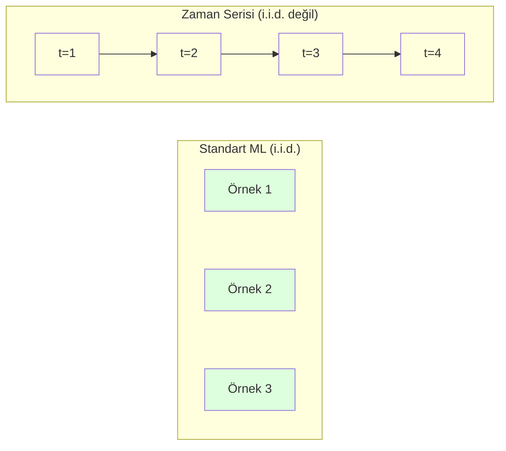
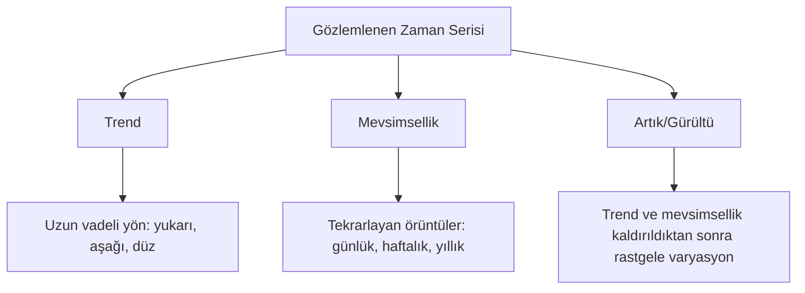
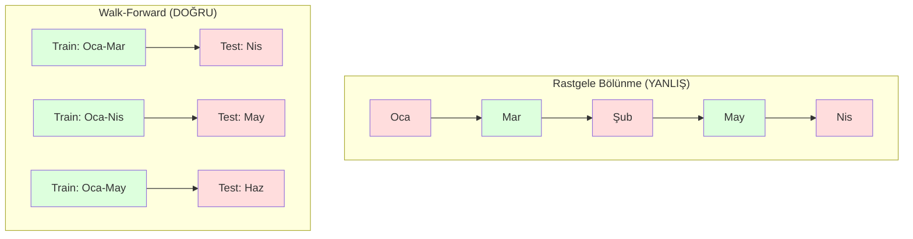

# Zaman Serisi Temelleri

> Geçmiş performans gelecek sonuçları tahmin eder -- önce stasyonerliği kontrol edersen.

**Tür:** Yapım
**Dil:** Python
**Ön koşullar:** Faz 2, Dersler 01-09
**Süre:** ~90 dakika

## Öğrenme Hedefleri

- Bir zaman serisini trend, mevsimsellik ve artık bileşenlerine ayrıştır ve stasyonerlik için test et
- Bir zaman serisini denetimli öğrenme problemine dönüştürmek için lag feature'lar ve rolling istatistikler uygula
- Gelecek verisinin eğitime sızmasını önleyen bir walk-forward doğrulama çerçevesi inşa et
- Zaman serisi için rastgele train/test bölünmelerinin neden geçersiz olduğunu açıkla ve uygun zamansal bölünmelere karşı performans boşluğunu göster

## Sorun

Zamana göre sıralanmış verin var. Günlük satışlar, saatlik sıcaklık, dakika başına CPU kullanımı, haftalık hisse fiyatları. Bir sonraki değeri, sonraki haftayı, sonraki çeyreği tahmin etmek istiyorsun.

Standart ML araç setine uzanıyorsun: rastgele train/test bölünmesi, cross-validation, feature matrisi içeri, tahmin dışarı. Her adım yanlış.

Zaman serisi standart ML'in dayandığı varsayımları bozar. Örnekler bağımsız değildir -- bugünün sıcaklığı dünün sıcaklığına bağlıdır. Rastgele bölünmeler gelecek bilgisini geçmişe sızdırır. Backtest'te harika görünen feature'lar zamanla değişen örüntülere dayandıkları için üretimde başarısız olur.

Rastgele cross-validation ile %95 accuracy alan bir model, uygun zaman tabanlı değerlendirme ile %55 alabilir. Fark bir teknik mesele değil. Kağıt üzerinde çalışan bir model ile üretimde çalışan bir model arasındaki farktır.

Bu ders temelleri kapsar: zaman verisini ne farklı kılar, modelleri dürüstçe nasıl değerlendireceğin ve bir zaman serisini standart ML modellerinin tüketebileceği feature'lara nasıl dönüştüreceğin.

## Kavram

### Zaman Serisini Ne Farklı Kılar

Standart ML i.i.d. varsayar -- bağımsız ve aynı şekilde dağılmış. Her örnek diğer örneklerden bağımsız olarak aynı dağılımdan çekilir. Zaman serisi her ikisini de ihlal eder:

- **Bağımsız değil.** Bugünün hisse fiyatı dünün fiyatına bağlıdır. Bu haftanın satışları geçen haftanın satışlarıyla korelasyonludur.
- **Aynı şekilde dağılmamış.** Dağılım zamanla değişir. Aralık ayındaki satışlar Mart ayındaki satışlardan farklı görünür.

Bu ihlaller küçük değildir. Feature'ları nasıl inşa ettiğini, modelleri nasıl değerlendirdiğini ve hangi algoritmaların çalıştığını değiştirirler.



Standart ML'de örnekler değiştirilebilir. Onları karıştırmak hiçbir şey değiştirmez. Zaman serisinde sıra her şeydir. Karıştırma sinyali yok eder.

### Zaman Serisinin Bileşenleri

Her zaman serisi şunların bir kombinasyonudur:



- **Trend**: Uzun vadeli yön. Gelir yıllık %10 büyüyor. Küresel sıcaklık yükseliyor.
- **Mevsimsellik**: Sabit aralıklarda tekrarlayan örüntüler. Perakende satışları Aralık'ta sıçrar. Klima kullanımı Temmuz'da zirveye ulaşır.
- **Artık**: Trend ve mevsimsellik kaldırıldıktan sonra ne kalırsa. Artık beyaz gürültü gibi görünüyorsa, ayrıştırma sinyali yakaladı.

### Stasyonerlik

Bir zaman serisi, istatistiksel özellikleri (ortalama, variance, autocorrelation) zamanla değişmiyorsa stasyonerdir. Çoğu tahmin yöntemi stasyonerliği varsayar.

**Neden önemli:** Stasyoner olmayan bir serinin ortalaması kayar. Ocak verisinde eğitilen bir model, Şubat'ta görüleceğinden farklı bir ortalama öğrenmiştir. Sistematik olarak yanlış olacaktır.

**Nasıl kontrol edilir:** Pencereler üzerinde rolling ortalama ve rolling standart sapma hesapla. Kayıyorlarsa, seri stasyoner değildir.

**Nasıl düzeltilir:** Differencing. Ham değerleri modellemek yerine, ardışık değerler arasındaki değişikliği modelle:

```
diff[t] = value[t] - value[t-1]
```

Bir tur differencing seriyi stasyoner yapmazsa, tekrar uygula (ikinci dereceden differencing). Çoğu gerçek dünya serisi en fazla iki tura ihtiyaç duyar.

**Örnek:**

Orijinal seri: [100, 102, 106, 112, 120]
Birinci fark:  [2, 4, 6, 8] (hâlâ yukarı doğru trend yapıyor)
İkinci fark:  [2, 2, 2] (sabit -- stasyoner)

Orijinal serinin kuadratik bir trendi vardı. Birinci differencing onu doğrusal bir trende dönüştürdü. İkinci differencing onu düzleştirdi. Pratikte, nadiren ikiden fazla tura ihtiyacın olur.

**Resmi test:** Augmented Dickey-Fuller (ADF) testi stasyonerlik için standart istatistiksel testtir. Null hipotezi "seri stasyoner değildir"dir. 0.05'in altında bir p-değeri null'u reddedebileceğin ve stasyonerlik sonucuna varabileceğin anlamına gelir. ADF'yi sıfırdan uygulamıyoruz (asimptotik dağılım tabloları gerektirir), ama kodumuzdaki rolling istatistik yaklaşımı pratik bir görsel kontrol verir.

### Autocorrelation

Autocorrelation, t zamanındaki bir değerin t-k zamanındaki değerle (geçmişte k adım) ne kadar korelasyonlu olduğunu ölçer. Autocorrelation function (ACF) bu korelasyonu her lag k için çizer.

**ACF sana şunu söyler:**
- Serinin ne kadar gerilere hatırladığı. ACF lag 5'ten sonra sıfıra düşerse, 5 adımdan daha eski değerler alakasızdır.
- Mevsimselliğin var olup olmadığı. ACF lag 12'de sıçrarsa (aylık veri), yıllık mevsimsellik vardır.
- Kaç lag feature yaratacağın. ACF'in ihmal edilebilir hale geldiği yere kadar lag'ler kullan.

**PACF (Partial Autocorrelation Function)** dolaylı korelasyonları kaldırır. Bugünün 3 gün önceyle yalnızca her ikisi dünle korelasyonlu olduğu için korelasyonlu olduğu durumda, lag 3'te PACF sıfır olurken lag 3'te ACF olmayacaktır.

### Lag Feature'lar: Zaman Serisini Denetimli Öğrenmeye Çevirmek

Standart ML modelleri bir X feature matrisi ve bir y target'a ihtiyaç duyar. Zaman serisi sana tek bir değer kolonu verir. Köprü lag feature'lardır.

[10, 12, 14, 13, 15] serisini al ve lag-1 ve lag-2 feature'larını yarat:

| lag_2 | lag_1 | target |
|-------|-------|--------|
| 10    | 12    | 14     |
| 12    | 14    | 13     |
| 14    | 13    | 15     |

Artık standart bir regresyon problemin var. Herhangi bir ML modeli (doğrusal regresyon, random forest, gradient boosting) lag'lerden target'ı tahmin edebilir.

Mühendisliğini yapabileceğin ek feature'lar:
- **Rolling istatistikler:** son k değer üzerinde ortalama, std, min, max
- **Takvim feature'ları:** haftanın günü, ay, is_holiday, is_weekend
- **Differenced değerler:** önceki adımdan değişim
- **Genişleyen istatistikler:** kümülatif ortalama, kümülatif toplam
- **Oran feature'ları:** mevcut değer / rolling ortalama (son ortalamadan ne kadar uzakta)
- **Etkileşim feature'ları:** lag_1 * day_of_week (momentum üzerinde hafta içi etkileri)

**Kaç lag?** Autocorrelation fonksiyonunu kullan. ACF lag 10'a kadar anlamlıysa, en az 10 lag kullan. Haftalık mevsimsellik varsa, lag 7'yi (ve muhtemelen 14'ü) dahil et. Daha fazla lag modele daha fazla tarih verir ama aynı zamanda uydurulacak daha fazla feature da verir, overfitting riskini artırır.

**Target hizalama tuzağı.** Lag feature'lar yaratırken, target t zamanındaki değer olmalı ve tüm feature'lar t-1 zamanındaki veya daha önceki değerleri kullanmalıdır. Yanlışlıkla t zamanındaki değeri bir feature olarak dahil edersen, mükemmel bir tahmin edici -- ve tamamen işe yaramaz bir model -- elde edersin. Bu zaman serisi feature mühendisliğindeki en yaygın hatadır.

### Walk-Forward Doğrulama

Bu derste en önemli kavram budur. Standart k-fold cross-validation örnekleri rastgele train ve test'e atar. Zaman serisi için bu gelecek bilgisini sızdırır.



Walk-forward doğrulama:
1. t zamanına kadar olan veride eğit
2. t+1 zamanında tahmin et (veya çok adımlı için t+1'den t+k'ye)
3. Pencereyi ileriye kaydır
4. Tekrarla

Her test fold'u yalnızca tüm eğitim verisinden sonra gelen veriyi içerir. Gelecek sızıntısı yok. Bu sana modelin deploy edildiğinde nasıl performans göstereceğine dair dürüst bir tahmin verir.

**Expanding window** eğitim için tüm geçmiş veriyi kullanır (pencere büyür). **Sliding window** sabit boyutlu bir eğitim penceresi kullanır (pencere kayar). Eski verinin hâlâ alakalı olduğuna inanıyorsan expanding kullan. Dünya değişiyorsa ve eski veri zarar veriyorsa sliding kullan.

### ARIMA Sezgisi

ARIMA klasik zaman serisi modelidir. Üç bileşeni vardır:

- **AR (Autoregressive):** Geçmiş değerlerden tahmin et. AR(p) son p değeri kullanır.
- **I (Integrated):** Stasyonerliği elde etmek için differencing. I(d) d tur differencing uygular.
- **MA (Moving Average):** Geçmiş tahmin hatalarından tahmin et. MA(q) son q hatayı kullanır.

ARIMA(p, d, q) üçünü birleştirir. ACF/PACF analizine veya otomatik aramaya (auto-ARIMA) dayanarak p, d, q seçersin.

ARIMA'yı sıfırdan uygulamıyoruz -- bu dersin kapsamı dışındaki sayısal optimizasyon gerektirir. Anahtar içgörü, her bileşenin ne yaptığını anlamaktır, böylece ARIMA sonuçlarını yorumlayabilir ve ne zaman kullanacağını bilirsin.

### Ne Zaman Ne Kullanmalı

| Yaklaşım | En İyi Olduğu Durum | Mevsimselliği Ele Alır | Dış Feature'ları Ele Alır |
|----------|---------|-------------------|------------------------|
| Lag feature'lar + ML | Birçok dış feature'lı tablolu | Takvim feature'larıyla | Evet |
| ARIMA | Tek değişkenli seri, kısa vadeli | SARIMA varyantı | Hayır (sınırlı için ARIMAX) |
| Exponential smoothing | Basit trend + mevsimsellik | Evet (Holt-Winters) | Hayır |
| Prophet | İş tahminlemesi, tatiller | Evet (Fourier terimleri) | Sınırlı |
| Sinir ağları (LSTM, Transformer) | Uzun diziler, çok seri | Öğrenilmiş | Evet |

Çoğu pratik problem için, lag feature'lar + gradient boosting en güçlü başlangıç noktasıdır. Dış feature'ları doğal olarak ele alır, stasyonerlik gerektirmez ve debug etmesi kolaydır.

### Tahminleme Ufkları ve Stratejileri

Tek adımlı tahminleme bir zaman adımı ileriye tahmin eder. Çok adımlı tahminleme birden fazla adımı tahmin eder. Üç strateji vardır:

**Recursive (yinelenen):** Bir adım ileriye tahmin et, tahmini bir sonraki adım için girdi olarak kullan. Basit ama hatalar birikir -- her tahmin önceki tahmini kullanır, bu yüzden hatalar bileşir.

**Direct (doğrudan):** Her ufuk için ayrı bir model eğit. Model-1 t+1'i tahmin eder, Model-5 t+5'i tahmin eder. Hata birikimi yok ama her modelin daha az eğitim örneği vardır ve bilgiyi paylaşmazlar.

**Multi-output (çoklu-çıktı):** Tüm ufukları aynı anda çıkaran bir model eğit. Ufuklar arasında bilgiyi paylaşır ama birden fazla çıktıyı destekleyen bir model (veya özel bir loss fonksiyonu) gerektirir.

Çoğu pratik problem için, kısa ufuklar (1-5 adım) için recursive ile başla ve daha uzun ufuklar için direct kullan.

### Zaman Serisindeki Yaygın Hatalar

| Hata | Neden olur | Nasıl düzeltilir |
|---------|---------------|-----------|
| Rastgele train/test bölünmesi | Standart ML'den alışkanlık | Walk-forward veya zamansal bölünme kullan |
| Gelecek feature'lar kullanma | t zamanındaki feature yanlışlıkla dahil edildi | Her feature'ı zamansal hizalama için denetle |
| Mevsimselliğe overfit yapma | Model takvim örüntülerini ezberler | Test setinde tam bir mevsimsel döngü tut |
| Ölçek değişikliklerini görmezden gelme | Gelir iki katına çıkıyor ama örüntüler aynı kalıyor | Mutlak yerine yüzde değişim modelle |
| Çok fazla lag feature | "Daha fazla tarih daha iyidir" | İlgili lag'leri belirlemek için ACF kullan |
| Differencing yapmama | "Model çözer" | Ağaç modelleri trendleri ele alır; doğrusal modeller stasyonerlik gerektirir |

## İnşa Et

`code/time_series.py` içindeki kod temel yapı bloklarını sıfırdan uygular.

### Lag Feature Yaratıcı

```python
def make_lag_features(series, n_lags):
    n = len(series)
    X = np.full((n, n_lags), np.nan)
    for lag in range(1, n_lags + 1):
        X[lag:, lag - 1] = series[:-lag]
    valid = ~np.isnan(X).any(axis=1)
    return X[valid], series[valid]
```

Bu, 1B bir seriyi her satırın son `n_lags` değeri feature olarak ve mevcut değer target olarak olan bir feature matrisine dönüştürür.

### Walk-Forward Cross-Validation

```python
def walk_forward_split(n_samples, n_splits=5, min_train=50):
    assert min_train < n_samples, "min_train must be less than n_samples"
    step = max(1, (n_samples - min_train) // n_splits)
    for i in range(n_splits):
        train_end = min_train + i * step
        test_end = min(train_end + step, n_samples)
        if train_end >= n_samples:
            break
        yield slice(0, train_end), slice(train_end, test_end)
```

Her bölünme eğitim verisinin kesinlikle test verisinden önce gelmesini sağlar. Eğitim penceresi her fold ile genişler.

### Basit Autoregressive Model

Saf bir AR modeli sadece lag feature'larında doğrusal regresyondur:

```python
class SimpleAR:
    def __init__(self, n_lags=5):
        self.n_lags = n_lags
        self.weights = None
        self.bias = None

    def fit(self, series):
        X, y = make_lag_features(series, self.n_lags)
        # Normal denklemler yoluyla çöz
        X_b = np.column_stack([np.ones(len(X)), X])
        theta = np.linalg.lstsq(X_b, y, rcond=None)[0]
        self.bias = theta[0]
        self.weights = theta[1:]
        return self
```

Bu kavramsal olarak Ders 02'deki doğrusal regresyonla aynıdır ama aynı değişkenin zaman gecikmeli versiyonlarına uygulanmıştır.

### Stasyonerlik Kontrolü

Kod, stasyonerliği görsel ve sayısal olarak değerlendirmek için rolling istatistikleri hesaplar:

```python
def check_stationarity(series, window=50):
    rolling_mean = np.array([
        series[max(0, i - window):i].mean()
        for i in range(1, len(series) + 1)
    ])
    rolling_std = np.array([
        series[max(0, i - window):i].std()
        for i in range(1, len(series) + 1)
    ])
    return rolling_mean, rolling_std
```

Rolling ortalama kayıyorsa veya rolling std değişiyorsa, seri stasyoner değildir. Differencing uygula ve tekrar kontrol et.

Kod ayrıca serinin ilk yarısı ile ikinci yarısını karşılaştırarak stasyonerliği kontrol eder. Ortalamalar standart sapmanın yarısından fazla farklıysa veya variance oranı 2x'i aşıyorsa, seri stasyoner olmayan olarak işaretlenir.

### Autocorrelation

```python
def autocorrelation(series, max_lag=20):
    n = len(series)
    mean = series.mean()
    var = series.var()
    acf = np.zeros(max_lag + 1)
    for k in range(max_lag + 1):
        cov = np.mean((series[:n-k] - mean) * (series[k:] - mean))
        acf[k] = cov / var if var > 0 else 0
    return acf
```

## Kullan

sklearn ile, lag feature'ları herhangi bir regressor ile doğrudan kullanırsın:

```python
from sklearn.linear_model import Ridge
from sklearn.ensemble import GradientBoostingRegressor

X, y = make_lag_features(series, n_lags=10)

for train_idx, test_idx in walk_forward_split(len(X)):
    model = Ridge(alpha=1.0)
    model.fit(X[train_idx], y[train_idx])
    predictions = model.predict(X[test_idx])
```

ARIMA için statsmodels kullan:

```python
from statsmodels.tsa.arima.model import ARIMA

model = ARIMA(train_series, order=(5, 1, 2))
fitted = model.fit()
forecast = fitted.forecast(steps=30)
```

`time_series.py` içindeki kod her iki yaklaşımı da gösterir ve walk-forward doğrulama kullanarak karşılaştırır.

### sklearn TimeSeriesSplit

sklearn, walk-forward doğrulamayı uygulayan `TimeSeriesSplit` sağlar:

```python
from sklearn.model_selection import TimeSeriesSplit

tscv = TimeSeriesSplit(n_splits=5)
for train_index, test_index in tscv.split(X):
    X_train, X_test = X[train_index], X[test_index]
    y_train, y_test = y[train_index], y[test_index]
    model.fit(X_train, y_train)
    score = model.score(X_test, y_test)
```

Bu, sıfırdan `walk_forward_split`'imize eşdeğerdir ama sklearn'ün cross-validation çerçevesine entegre edilmiştir. Onu `cross_val_score` ile kullanabilirsin:

```python
from sklearn.model_selection import cross_val_score

scores = cross_val_score(model, X, y, cv=TimeSeriesSplit(n_splits=5))
print(f"Mean score: {scores.mean():.4f} +/- {scores.std():.4f}")
```

### Değerlendirme Metrikleri

Zaman serisi tahminlemesi regresyon metrikleri kullanır ama zaman-farkında bağlamla:

- **MAE (Mean Absolute Error):** |y_true - y_pred|'in ortalaması. Orijinal birimlerde yorumlanması kolay. "Ortalama olarak, tahminler 3.2 derece sapar."
- **RMSE (Root Mean Squared Error):** Mean squared error'un karekökü. Büyük hataları MAE'den daha fazla cezalandırır. Büyük hatalar birçok küçük hatadan daha kötüyse kullan.
- **MAPE (Mean Absolute Percentage Error):** |error / true_value| * 100'ün ortalaması. Ölçekten bağımsız, farklı seriler arasında karşılaştırma için yararlı. Ama gerçek değerler sıfır olduğunda tanımsızdır.
- **Naif baseline karşılaştırması:** Her zaman basit baseline'lara karşı karşılaştır. Mevsimsel naif baseline, bir önceki dönemden (dün, geçen hafta) değeri tahmin eder. Modelin naif'i yenemezse, bir şey ters demektir.

### Rolling Feature'lar

Kod, lag feature'lara rolling istatistikler (7 ve 14 gün pencereleri üzerinde ortalama, std, min, max) eklemeyi gösterir. Bunlar modele lag feature'ların tek başına yakalayamayacağı son trendler ve volatilite hakkında bilgi verir.

Örneğin, rolling ortalama yükseliyorsa, yukarı doğru bir trendi öneriyor. Rolling std artıyorsa, artan volatilite öneriyor. Bunlar, ağaç tabanlı modellerin öğrenebileceği ama doğrusal modellerin öğrenemeyeceği türden örüntülerdir.

## Yayınla

Bu ders şunları üretir:
- `outputs/prompt-time-series-advisor.md` -- zaman serisi problemlerini çerçevelemek için bir prompt
- `code/time_series.py` -- lag feature'lar, walk-forward doğrulama, AR model, stasyonerlik kontrolleri

### Yenmen Gereken Baseline'lar

Herhangi bir model inşa etmeden önce baseline'lar kur:

1. **Son değer (persistence).** Yarının bugünle aynı olacağını tahmin et. Çoğu seri için bunu yenmek şaşırtıcı derecede zordur.
2. **Mevsimsel naif.** Bugünün geçen haftanın aynı günüyle (veya geçen yılın) aynı olacağını tahmin et. Modelin bunu yenemezse, mevsimsellik dışında faydalı bir örüntü öğrenmemiştir.
3. **Hareketli ortalama.** Son k değerin ortalamasını tahmin et. Gürültüyü yumuşatır ama ani değişiklikleri yakalayamaz.

Süslü ML modelin mevsimsel naif baseline'a yenilirse, bir bug'ın var demektir. En yaygın olarak: feature'larda gelecek sızıntısı, yanlış değerlendirme yöntemi veya seri gerçekten rastgele ve tahmin edilemez.

### Pratik İpuçları

1. **Çizimle başla.** Herhangi bir modellemeden önce, ham seriyi çiz. Trendler, mevsimsellik, aykırı değerler, yapısal kırılmalar (davranışta ani değişiklikler) ara. 30 saniyelik bir görsel inceleme genellikle bir saatlik otomatik analizden daha fazlasını söyler.

2. **Önce farkını al, sonra modelle.** Serinin net bir trendi varsa, lag feature'lar yaratmadan önce farkını al. Ağaç tabanlı modeller trendleri ele alabilir ama doğrusal modeller alamaz ve differencing asla zarar vermez.

3. **En az bir tam mevsimsel döngü dışarıda tut.** Haftalık mevsimselliğin varsa, test setinin en az bir tam haftaya ihtiyacı vardır. Aylıksa, en az bir tam ay. Aksi takdirde modelin mevsimsel örüntüyü yakalayıp yakalamadığını değerlendiremezsin.

4. **Üretimde izle.** Zaman serisi modelleri dünya değiştikçe zamanla bozulur. Tahmin hatalarını rolling temelde takip et. Hatalar artmaya başladığında, modeli yeni veriyle yeniden eğit.

5. **Rejim değişikliklerine dikkat et.** Pandemi öncesi veride eğitilmiş bir model pandemi sonrası davranışı tahmin etmeyecektir. Bilinen rejim değişikliklerinin göstergelerini feature olarak dahil et veya eski veriyi unutan bir kayan pencere kullan.

6. **Çarpık serileri log-dönüştür.** Gelir, fiyatlar ve sayılar genellikle sağa-çarpıktır. Log almak variance'ı stabilize eder ve çarpımsal örüntüleri doğrusal modellerin ele alabileceği toplamsal yapar. Log uzayında tahmin et, sonra orijinal birimlere geri dönmek için üs al.

## Alıştırmalar

1. **Stasyonerlik deneyi.** Doğrusal bir trendle bir seri üret. Rolling istatistiklerle stasyonerliği kontrol et. Birinci differencing uygula. Tekrar kontrol et. Kuadratik bir trend için kaç tur differencing alır?

2. **Lag seçimi.** Mevsimsel bir seride (period=7) ACF hesapla. Hangi lag'lerin en yüksek autocorrelation'ı var? Yalnızca o lag'leri kullanarak lag feature'lar yarat (ardışık lag'ler değil). Accuracy lag 1'den 7'ye kullanmaya göre iyileşiyor mu?

3. **Walk-forward vs rastgele bölünme.** Lag feature'lar üzerinde bir Ridge regresyon eğit. Rastgele 80/20 bölünmesiyle ve walk-forward doğrulamayla değerlendir. Rastgele bölünme performansı ne kadar abartıyor?

4. **Feature mühendisliği.** Lag feature'lara rolling ortalama (window=7), rolling std (window=7) ve haftanın günü feature'ları ekle. Walk-forward doğrulama kullanarak bu ekstralarla ve olmadan accuracy'yi karşılaştır.

5. **Çok adımlı tahminleme.** AR modelini 1 yerine 5 adım ileriye tahmin edecek şekilde değiştir. İki stratejiyi karşılaştır: (a) bir adım tahmin et, tahmini bir sonraki adım için girdi olarak kullan (recursive) ve (b) her ufuk için ayrı modeller eğit (direct). Hangisi daha doğru?

## Anahtar Terimler

| Terim | İnsanlar ne der | Aslında ne demek |
|------|----------------|----------------------|
| Stasyonerlik | "İstatistikler zamanla değişmez" | Ortalama, variance ve autocorrelation yapısı zamanla sabit olan bir seri |
| Differencing | "Ardışık değerleri çıkar" | Trendleri kaldırmak ve stasyonerliği elde etmek için y[t] - y[t-1] hesaplamak |
| Autocorrelation (ACF) | "Bir seri kendisiyle nasıl korelasyonludur" | Lag'in fonksiyonu olarak bir zaman serisi ile kendisinin gecikmeli bir kopyası arasındaki korelasyon |
| Partial autocorrelation (PACF) | "Yalnızca doğrudan korelasyon" | Daha kısa tüm lag'lerin etkisi kaldırıldıktan sonra k lag'inde autocorrelation |
| Lag feature'lar | "Girdi olarak geçmiş değerler" | y[t]'yi tahmin etmek için y[t-1], y[t-2], ..., y[t-k]'yi feature olarak kullanmak |
| Walk-forward doğrulama | "Zamana saygılı cross-validation" | Eğitim verisinin her zaman test verisinden kronolojik olarak önce geldiği değerlendirme |
| ARIMA | "Klasik zaman serisi modeli" | AutoRegressive Integrated Moving Average: geçmiş değerleri (AR), differencing (I) ve geçmiş hataları (MA) birleştirir |
| Mevsimsellik | "Tekrarlayan takvim örüntüleri" | Takvim dönemlerine (günlük, haftalık, yıllık) bağlı bir zaman serisindeki düzenli, öngörülebilir döngüler |
| Trend | "Uzun vadeli yön" | Serinin seviyesinde zamanla kalıcı bir artış veya azalış |
| Expanding window | "Tüm tarihi kullan" | Eğitim setinin her fold ile büyüdüğü walk-forward doğrulama |
| Sliding window | "Sabit boyutlu tarih" | Eğitim setinin ileriye kayan sabit uzunlukta bir pencere olduğu walk-forward doğrulama |

## Daha Fazla Okuma

- [Hyndman and Athanasopoulos, Forecasting: Principles and Practice (3rd ed.)](https://otexts.com/fpp3/) -- zaman serisi tahminlemesi üzerine en iyi ücretsiz ders kitabı
- [scikit-learn Time Series Split](https://scikit-learn.org/stable/modules/generated/sklearn.model_selection.TimeSeriesSplit.html) -- sklearn'ün walk-forward splitter'ı
- [statsmodels ARIMA docs](https://www.statsmodels.org/stable/generated/statsmodels.tsa.arima.model.ARIMA.html) -- teşhislerle ARIMA uygulaması
- [Makridakis et al., The M5 Competition (2022)](https://www.sciencedirect.com/science/article/pii/S0169207021001874) -- ML yöntemlerini istatistiksel yöntemlere karşı gösteren büyük ölçekli tahminleme yarışması
