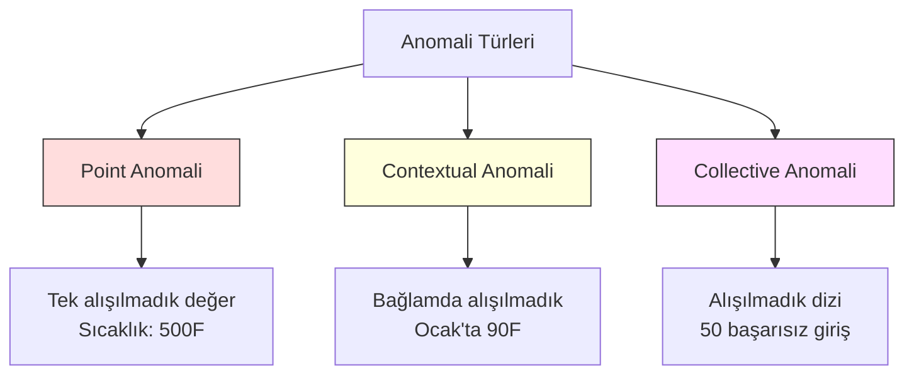
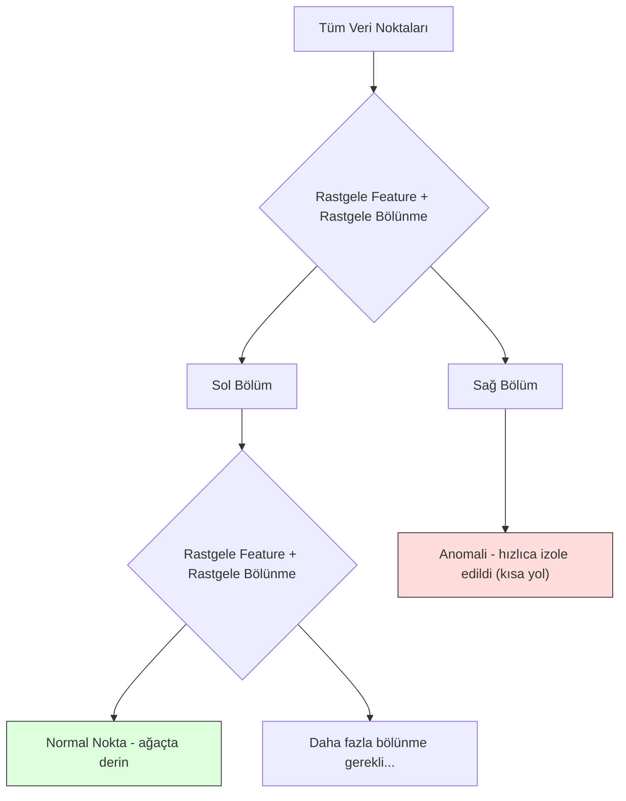
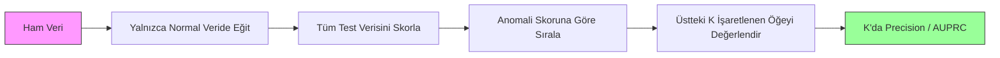

# Anomali Tespiti

> Normali tanımlamak kolaydır. Anormal, uymayan her şeydir.

**Tür:** Yapım
**Dil:** Python
**Ön koşullar:** Faz 2, Dersler 01-09
**Süre:** ~75 dakika

## Öğrenme Hedefleri

- Sıfırdan Z-score, IQR ve Isolation Forest anomali tespit yöntemlerini uygula
- Point, contextual ve collective anomaliler arasında ayrım yap ve her biri için uygun tespit yöntemini seç
- Anomali tespitinin neden anomalileri sınıflandırmak yerine normal veriyi modellemek olarak çerçevelendiğini açıkla
- Denetimsiz anomali tespitini denetimli sınıflandırmayla karşılaştır ve yeni anomali kapsamı ile precision arasındaki dengeyi değerlendir

## Sorun

Bir kredi kartı New York'ta 14:00'te, sonra Tokyo'da 14:05'te kullanılıyor. Normal aralığı 80-120 olan bir fabrika sensörü 150 derece okuyor. Bir sunucu, günlük ortalaması 200 olduğunda saniyede 50.000 istek gönderiyor.

Bunlar anomalilerdir. Onları bulmak önemlidir. Sahtekarlık milyarlara mal olur. Ekipman arızaları kesintilere mal olur. Ağ saldırıları veri kayıplarına mal olur.

Zorluk: nadiren etiketli anomali örneklerin olur. Sahtekarlık işlemlerin %0.1'ini oluşturur. Ekipman arızaları yılda birkaç kez olur. Standart bir sınıflandırıcı eğitemezsin çünkü "anomali" sınıfında öğrenecek neredeyse hiçbir şey yoktur. Bazı etiketlerin olsa bile, gördüğün anomaliler karşılaşacağın tek tür değildir. Yarının sahtekarlık şeması bugünün şemasından farklı görünür.

Anomali tespiti problemi tersine çevirir. Neyin anormal olduğunu öğrenmek yerine, neyin normal olduğunu öğren. Normalden sapan her şey şüphelidir. Bu etiketler olmadan çalışır, yeni anomali türlerine uyum sağlar ve büyük veri setlerine ölçeklenir.

## Kavram

### Anomali Türleri

Tüm anomaliler aynı değildir:

- **Point anomaliler.** Bağlamdan bağımsız olarak alışılmadık tek bir veri noktası. 500 derece sıcaklık okuması. Normalde 50 dolar harcayan bir hesaptan 50.000 dolarlık bir işlem.
- **Contextual anomaliler.** Bağlamı verildiğinde alışılmadık bir veri noktası. 90 derece sıcaklık yazın normaldir, kışın anomalidir. Aynı değer, farklı bağlam.
- **Collective anomaliler.** Her bireysel nokta normal olsa bile, grup olarak alışılmadık bir veri noktası dizisi. Beş giriş başarısızlığı normaldir. Arka arkaya elli tane brute-force saldırısıdır.

Çoğu yöntem point anomalileri tespit eder. Contextual anomaliler zaman veya konum feature'larına ihtiyaç duyar. Collective anomaliler dizi-farkında yöntemlere ihtiyaç duyar.



### Denetimsiz Çerçeveleme

Standart sınıflandırmada, her iki sınıf için de etiketlerin vardır. Anomali tespitinde, tipik olarak üç durumdan birine sahipsindir:

1. **Tamamen denetimsiz.** Hiç etiket yok. Detektörü tüm veriye uydurursun ve anomalilerin "normal" modeli bozacak kadar yaygın olmadığını umut edersin.
2. **Yarı-denetimli.** Yalnızca normal verinin temiz bir veri setine sahipsin. Bu temiz sete uydurursun ve geri kalan her şeyi skorlarsın. Mümkün olduğunda en güçlü kurulumdur.
3. **Zayıf denetimli.** Birkaç etiketli anomalin var. Onları eğitim için değil, değerlendirme için kullan. Denetimsiz eğit, sonra etiketli alt küme üzerinde precision/recall'u ölç.

Anahtar içgörü: anomali tespiti sınıflandırmadan temelde farklıdır. İki sınıf arasındaki karar sınırını değil, normal verinin dağılımını modelliyorsun.

### Denetimli vs Denetimsiz: Denge

Etiketli anomalilerin varsa, onları eğitim için (denetimli sınıflandırma) mı yoksa yalnızca değerlendirme için (denetimsiz tespit) mi kullanmalısın?

**Denetimli (sınıflandırma olarak ele al):**
- Daha önce gördüğün tam anomali türlerini yakalar
- Bilinen anomali türlerinde daha yüksek precision
- Yeni anomali türlerini tamamen kaçırır
- Yeni anomali türleri ortaya çıktığında yeniden eğitim gerektirir
- Yeterli anomali örneği gerektirir (genellikle çok az)

**Denetimsiz (normali modelle, sapmaları işaretle):**
- Yeni türler dahil normalden herhangi bir sapmayı yakalar
- Etiketli anomaliler gerektirmez
- Daha yüksek false positive oranı (alışılmadık her şey kötü değildir)
- Dağılım değişikliğine karşı daha dayanıklı

Pratikte, en iyi sistemler her ikisini de birleştirir: geniş kapsam için denetimsiz tespit, bilinen yüksek-öncelikli anomali türleri için denetimli modeller ve belirsiz durumlar için insan incelemesi.

### Z-Score Yöntemi

En basit yaklaşım. Her feature'ın ortalamasını ve standart sapmasını hesapla. Ortalamadan k standart sapmadan daha uzak herhangi bir noktayı işaretle.

```text
z_score = (x - mean) / std
anomali eğer |z_score| > threshold
```

Varsayılan eşik 3.0'dır (normal veri Gauss dağılımı için 3 standart sapma içinde %99.7).

**Güçlü yanlar:** Basit. Hızlı. Yorumlanabilir ("bu değer normalden 4.5 standart sapma uzakta").

**Zayıf yanlar:** Verinin normal dağıldığını varsayar. Eğitim verisindeki aykırı değerlere duyarlı (aykırı değerler ortalamayı kaydırır ve std'yi şişirir, onları tespit etmeyi zorlaştırır). Çok modlu dağılımlarda başarısız olur.

**Ne zaman iyi çalışır:** Verinin kabaca çan-şekilli olduğu tek-feature izleme. Sunucu yanıt süreleri, üretim toleransları, kararlı baseline'lara sahip sensör okumaları.

**Ne zaman başarısız olur:** Çok-kümeli veri (farklı baseline sıcaklıklara sahip iki ofis konumu), çarpık veri ($1000'in nadir ama anomalik olmadığı işlem tutarları), eğitim setinde aykırı değerleri olan veri.

### IQR Yöntemi

Z-score'dan daha dayanıklı. Ortalama ve standart sapma yerine interquartile range kullanır.

```
Q1 = 25. yüzdelik
Q3 = 75. yüzdelik
IQR = Q3 - Q1
lower_bound = Q1 - factor * IQR
upper_bound = Q3 + factor * IQR
anomali eğer x < lower_bound veya x > upper_bound
```

Varsayılan faktör 1.5'tir.

**Güçlü yanlar:** Aykırı değerlere dayanıklı (yüzdelikler aşırı değerlerden etkilenmez). Çarpık dağılımlarda çalışır. Normallik varsayımı yok.

**Zayıf yanlar:** Yalnızca tek değişkenli (feature başına bağımsız olarak uygulanır). Feature'lar birlikte değerlendirildiğinde yalnızca alışılmadık olan anomalileri tespit edemez (bir nokta her feature'da bireysel olarak normal olabilir ama ortak uzayda anomalik olabilir).

**Pratik not:** IQR'daki 1.5 faktörü box plot'taki bıyıklara karşılık gelir. Bıyıkların dışındaki noktalar potansiyel aykırı değerlerdir. 1.5 yerine 3.0 kullanmak detektörü daha tutucu yapar (daha az işaretleme, daha az false positive). Doğru faktör false alarm toleransına bağlıdır.

### Isolation Forest

Anahtar içgörü: anomaliler az ve farklıdır. Verinin rastgele bir bölünmesinde, anomalileri izole etmek daha kolaydır -- diğerlerinden ayrılmaları için daha az rastgele bölünmeye ihtiyaç duyarlar.



**Nasıl çalışır:**
1. Birçok rastgele ağaç inşa et (bir isolation forest)
2. Her node'da, rastgele bir feature ve feature'ın min ve max'ı arasında rastgele bir bölünme değeri seç
3. Her nokta izole olana kadar (kendi yaprağında) bölmeye devam et
4. Anomalilerin tüm ağaçlarda daha kısa ortalama yol uzunlukları vardır

**Neden çalışır:** Normal noktalar yoğun bölgelerde yaşar. Birini komşularından izole etmek için birçok rastgele bölünme gerekir. Anomaliler seyrek bölgelerde yaşar. Onları izole etmek için bir veya iki rastgele bölünme yeterlidir.

Anomali skoru, tüm ağaçlardaki ortalama yol uzunluğuna, n eleman içeren bir rastgele ikili arama ağacının beklenen yol uzunluğuyla normalize edilmiş olarak dayanır:

```
score(x) = 2^(-average_path_length(x) / c(n))
```

Burada `c(n)` n örnek için beklenen yol uzunluğudur. 1'e yakın skor anomali demektir. 0.5'e yakın skor normal demektir. 0'a yakın skor çok normal demektir (yoğun kümelerin derininde).

**Güçlü yanlar:** Dağılım varsayımları yok. Yüksek boyutlarda çalışır. İyi ölçeklenir (örnek boyutunda subliner çünkü her ağaç bir alt örnek kullanır). Karışık feature tiplerini ele alır.

**Zayıf yanlar:** Yoğun bölgelerdeki anomalilerle zorlanır (maskeleme etkisi). Birçok feature alakasızsa rastgele bölünme daha az etkilidir.

**Anahtar hiperparametreler:**
- `n_estimators`: Ağaç sayısı. 100 genellikle yeterlidir. Daha fazla ağaç daha kararlı skorlar verir ama daha yavaş hesaplama.
- `max_samples`: Ağaç başına örnek sayısı. Orijinal makalede varsayılan 256'dır. Daha küçük değerler bireysel ağaçları daha az doğru yapar ama çeşitliliği artırır. Alt örnekleme Isolation Forest'i hızlı yapan şeydir -- her ağaç verinin küçük bir kesirini görür.
- `contamination`: Beklenen anomali kesri. Yalnızca eşiği ayarlamak için kullanılır. Skorların kendisini etkilemez.

### Local Outlier Factor (LOF)

LOF, bir noktanın etrafındaki yerel yoğunluğu komşularının etrafındaki yoğunlukla karşılaştırır. Yoğun bölgelerle çevrili seyrek bir bölgedeki nokta anomaliktir.

**Nasıl çalışır:**
1. Her nokta için, k en yakın komşusunu bul
2. Yerel ulaşılabilirlik yoğunluğunu hesapla (komşuluk ne kadar yoğun)
3. Her noktanın yoğunluğunu komşularının yoğunluklarıyla karşılaştır
4. Bir noktanın komşularından çok daha düşük yoğunluğu varsa, aykırı bir değerdir

**LOF skoru:**
- 1.0'a yakın LOF komşularla benzer yoğunluk demektir (normal)
- 1.0'dan büyük LOF komşulardan daha düşük yoğunluk demektir (potansiyel olarak anomalik)
- 1.0'dan çok daha büyük LOF (örn., 2.0+) önemli ölçüde daha düşük yoğunluk demektir (muhtemelen anomali)

"Yerel" kısım kritiktir. İki kümeli bir veri setini düşün: 1000 noktalı yoğun bir küme ve 50 noktalı seyrek bir küme. Seyrek kümenin kenarındaki bir nokta küresel olarak alışılmadık değildir -- 50 komşusu vardır. Ama anlık komşuları kendisinden daha yoğunsa yerel olarak alışılmadıktır. LOF, küresel yöntemlerin kaçırdığı bu nüansı yakalar.

**Güçlü yanlar:** Yerel anomalileri tespit eder (küresel olarak alışılmadık olmasalar bile komşuluklarında alışılmadık noktalar). Farklı yoğunluklara sahip kümelerde çalışır.

**Zayıf yanlar:** Büyük veri setlerinde yavaş (naif uygulama için O(n^2)). k seçimine duyarlı. Çok yüksek boyutlarda iyi çalışmaz (boyut laneti mesafe hesaplamalarını etkiler).

### Karşılaştırma

| Yöntem | Varsayımlar | Hız | Yüksek Boyutları Ele Alır | Yerel Anomalileri Tespit Eder |
|--------|------------|-------|-------------------|------------------------|
| Z-score | Normal dağılım | Çok hızlı | Evet (feature başına) | Hayır |
| IQR | Yok (feature başına) | Çok hızlı | Evet (feature başına) | Hayır |
| Isolation Forest | Yok | Hızlı | Evet | Kısmen |
| LOF | Mesafe anlamlıdır | Yavaş | Kötü | Evet |

### Değerlendirme Zorlukları

Anomali detektörlerini değerlendirmek sınıflandırıcıları değerlendirmekten daha zordur:

- **Aşırı sınıf dengesizliği.** %0.1 anomali ile, her şey için "normal" tahmin etmek %99.9 accuracy verir. Accuracy işe yaramaz.
- **AUROC yanıltıcıdır.** Ağır dengesizlikle, model pratik eşiklerde anomalilerin çoğunu kaçırsa bile AUROC iyi görünebilir.
- **Daha iyi metrikler:** Precision@k (işaretlenen en üst k öğenin kaçı gerçek anomalidir), AUPRC (precision-recall eğrisi altındaki alan) ve sabit bir false positive oranında recall.



### Anomali Tespiti Pipeline'ı

Pratikte, anomali tespiti şu iş akışını takip eder:

1. **Baseline veri topla.** İdeal olarak, hiç (veya çok az) anomalinin olmadığını bildiğin bir dönem.
2. **Feature mühendisliği.** Ham feature'lar artı türetilmiş feature'lar (rolling istatistikler, zaman feature'ları, oranlar).
3. **Detektörü eğit.** Baseline veriye uydur. Model "normalin" nasıl göründüğünü öğrenir.
4. **Yeni veriyi skorla.** Her yeni gözlem bir anomali skoru alır.
5. **Eşik seçimi.** Skor kesim noktasını seç. Bu bir iş kararıdır: daha yüksek eşik daha az false alarm ama daha fazla kaçırılan anomali demektir.
6. **Alarm ve araştırma.** İşaretlenen noktalar insan incelemesine veya otomatik yanıta gider.
7. **Geri bildirim toplama.** İşaretlenen öğelerin gerçek anomali mi yoksa false alarm mı olduğunu kaydet. Detektörü değerlendirmek ve zaman içinde eşiği ayarlamak için bu veriyi kullan.

Pipeline asla "bitmez". Veri dağılımları değişir, yeni anomali türleri ortaya çıkar ve eşiklerin ayarlanması gerekir. Anomali tespitini tek seferlik bir model olarak değil, canlı bir sistem olarak ele al.

## İnşa Et

`code/anomaly_detection.py` içindeki kod sıfırdan Z-score, IQR ve Isolation Forest uygular.

### Z-Score Detektörü

```python
def zscore_detect(X, threshold=3.0):
    mean = X.mean(axis=0)
    std = X.std(axis=0)
    std[std == 0] = 1.0
    z = np.abs((X - mean) / std)
    return z.max(axis=1) > threshold
```

Basit ve vektörleştirilmiş. Herhangi bir feature eşiği aşarsa bir noktayı işaretler.

### IQR Detektörü

```python
def iqr_detect(X, factor=1.5):
    q1 = np.percentile(X, 25, axis=0)
    q3 = np.percentile(X, 75, axis=0)
    iqr = q3 - q1
    iqr[iqr == 0] = 1.0
    lower = q1 - factor * iqr
    upper = q3 + factor * iqr
    outside = (X < lower) | (X > upper)
    return outside.any(axis=1)
```

### Sıfırdan Isolation Forest

Sıfırdan uygulama, feature uzayını rastgele bölen isolation ağaçları inşa eder:

```python
class IsolationTree:
    def __init__(self, max_depth):
        self.max_depth = max_depth

    def fit(self, X, depth=0):
        n, p = X.shape
        if depth >= self.max_depth or n <= 1:
            self.is_leaf = True
            self.size = n
            return self
        self.is_leaf = False
        self.feature = np.random.randint(p)
        x_min = X[:, self.feature].min()
        x_max = X[:, self.feature].max()
        if x_min == x_max:
            self.is_leaf = True
            self.size = n
            return self
        self.threshold = np.random.uniform(x_min, x_max)
        left_mask = X[:, self.feature] < self.threshold
        self.left = IsolationTree(self.max_depth).fit(X[left_mask], depth + 1)
        self.right = IsolationTree(self.max_depth).fit(X[~left_mask], depth + 1)
        return self
```

Bir noktayı izole etmenin yol uzunluğu anomali skorunu belirler. Daha kısa yollar daha anomalik anlamına gelir.

`IsolationForest` sınıfı birden fazla ağacı sarar:

```python
class IsolationForest:
    def __init__(self, n_estimators=100, max_samples=256, seed=42):
        self.n_estimators = n_estimators
        self.max_samples = max_samples

    def fit(self, X):
        sample_size = min(self.max_samples, X.shape[0])
        max_depth = int(np.ceil(np.log2(sample_size)))
        for _ in range(self.n_estimators):
            idx = rng.choice(X.shape[0], size=sample_size, replace=False)
            tree = IsolationTree(max_depth=max_depth)
            tree.fit(X[idx])
            self.trees.append(tree)

    def anomaly_score(self, X):
        avg_path = tüm ağaçlardaki ortalama yol uzunluğu
        scores = 2.0 ** (-avg_path / c(max_samples))
        return scores
```

Normalizasyon faktörü `c(n)`, n elemanlı bir ikili arama ağacında başarısız bir aramanın beklenen yol uzunluğudur. `2 * H(n-1) - 2*(n-1)/n`'e eşittir; burada `H` harmonik sayıdır. Bu normalizasyon, skorların farklı boyutlardaki veri setleri arasında karşılaştırılabilir olmasını sağlar.

### Demo Senaryolar

Kod birden fazla test senaryosu üretir:

1. **Aykırı değerleri olan tek küme.** Merkezden uzakta enjekte edilmiş anomalileri olan bir 2B Gauss kümesi. Tüm yöntemler burada çalışmalı.
2. **Çok modlu veri.** Farklı boyutlarda ve yoğunluklarda üç küme. Kümeler arasındaki noktalar anomaliktir. Z-score zorlanır çünkü feature başına aralıklar geniştir.
3. **Yüksek boyutlu veri.** 50 feature ama anomaliler yalnızca 5'inde farklıdır. Yöntemlerin bir feature alt kümesinde anomalileri bulup bulamayacağını test eder.

Her demo, precision, recall, F1 ve Precision@k kullanarak tüm yöntemleri karşılaştırır.

## Kullan

sklearn ile (sıfırdan değil, kütüphane uygulamaları kullanarak):

```python
from sklearn.ensemble import IsolationForest
from sklearn.neighbors import LocalOutlierFactor

iso = IsolationForest(n_estimators=100, contamination=0.05, random_state=42)
iso.fit(X_train)
predictions = iso.predict(X_test)

lof = LocalOutlierFactor(n_neighbors=20, contamination=0.05, novelty=True)
lof.fit(X_train)
predictions = lof.predict(X_test)
```

`contamination` parametresi beklenen anomali kesrini ayarlar. Onu doğru ayarlamak önemlidir -- çok düşük anomalileri kaçırır, çok yüksek false alarm yaratır.

`anomaly_detection.py` içindeki kod, aynı veride sıfırdan uygulamaları sklearn'e karşı karşılaştırır.

### sklearn Contamination Parametresi

sklearn'deki `contamination` parametresi, sürekli anomali skorlarını ikili tahminlere dönüştürmek için eşiği belirler. Altta yatan skorları değiştirmez.

```python
iso_5 = IsolationForest(contamination=0.05)
iso_10 = IsolationForest(contamination=0.10)
```

Her ikisi de aynı anomali skorlarını üretir. Ama `iso_5` en üst %5'i işaretlerken `iso_10` en üst %10'u işaretler. Gerçek anomali oranını bilmiyorsan (genellikle bilmezsin), contamination'ı "auto" olarak ayarla ve ham skorlarla doğrudan çalış. False positive'ler ile false negative'ler arasındaki maliyet dengesine göre kendi eşiğini ayarla.

### One-Class SVM

Bilinmesi gereken başka bir denetimsiz anomali detektörü. One-Class SVM, yüksek boyutlu feature uzayında (kernel trick kullanarak) normal veri etrafında bir sınır uydurur.

```python
from sklearn.svm import OneClassSVM

oc_svm = OneClassSVM(kernel="rbf", gamma="auto", nu=0.05)
oc_svm.fit(X_train)
predictions = oc_svm.predict(X_test)
```

`nu` parametresi anomali kesrini yaklaşıklar. One-Class SVM küçük ve orta veri setlerinde iyi çalışır ama çok büyük veriye ölçeklenmez (kernel matrisi kuadratik olarak büyür).

### Autoencoder Yaklaşımı (Önizleme)

Autoencoder'lar veriyi sıkıştırmayı ve yeniden inşa etmeyi öğrenen sinir ağlarıdır. Normal veride eğit. Test zamanında, anomalilerin yüksek yeniden inşa hatası vardır çünkü ağ yalnızca normal örüntüleri yeniden inşa etmeyi öğrenmiştir.

Bu Faz 3'te (Deep Learning) ele alınır ama ilke aynıdır: neyin normal olduğunu modelle, sapanı işaretle.

### Ensemble Anomali Tespiti

Ensemble yöntemlerinin sınıflandırmayı iyileştirdiği gibi (Ders 11), birden fazla anomali detektörünü birleştirmek tespiti iyileştirir. En basit yaklaşım:

1. Birden fazla detektör çalıştır (Z-score, IQR, Isolation Forest, LOF)
2. Her detektörün skorlarını [0, 1] aralığına normalize et
3. Normalize edilmiş skorların ortalamasını al
4. Ortalama skor üzerinde eşiği aşan noktaları işaretle

Bu false positive'leri azaltır çünkü farklı yöntemlerin farklı başarısızlık modları vardır. Dört yöntem tarafından da işaretlenen bir nokta neredeyse kesinlikle anomaliktir. Yalnızca biri tarafından işaretlenen bir nokta o yöntemin bir tuhaflığı olabilir.

Daha sofistike ensemble'lar, her detektörü tahmin edilen güvenilirliğine göre (mümkünse bilinen anomalilere sahip bir doğrulama setinde ölçülür) ağırlıklandırır.

### Üretim Hususları

1. **Eşik kayması.** Veri dağılımı değiştikçe, sabit bir eşik güncelliğini yitirir. Anomali skorlarının dağılımını izle ve periyodik olarak ayarla.
2. **Alarm yorgunluğu.** Çok fazla false alarm ve operatörler dikkat etmeyi bırakır. Yüksek bir eşikle başla (daha az, daha güvenilir alarmlar) ve güven oluştukça düşür.
3. **Ensemble yaklaşımı.** Üretimde, birden fazla detektörü birleştir. Bir noktayı yalnızca birden fazla yöntem anomalik olduğunu kabul ederse işaretle. Bu false positive'leri önemli ölçüde azaltır.
4. **Feature mühendisliği.** Ham feature'lar nadiren yeterlidir. Rolling istatistikler, oranlar, son-olaydan-bu-yana zaman ve alana özgü feature'lar ekle. İyi bir feature seti detektör seçiminden daha önemlidir.
5. **Geri bildirim döngüsü.** Operatörler işaretlenen öğeleri araştırıp onaylayıp veya reddettiğinde, bunu sisteme geri besle. Detektörü değerlendirmek ve iyileştirmek için zaman içinde etiketli veri biriktir.

## Yayınla

Bu ders şunları üretir:
- `outputs/skill-anomaly-detector.md` -- doğru detektörü seçmek için bir karar skill'i
- `code/anomaly_detection.py` -- sklearn karşılaştırmasıyla sıfırdan Z-score, IQR ve Isolation Forest

### Bir Eşik Seçmek

Anomali skoru süreklidir. İkili kararlar vermek için bir eşiğe ihtiyacın var. Bu teknik bir karar değil, bir iş kararıdır.

İki senaryoyu düşün:
- **Sahtekarlık tespiti.** Sahtekarlığı kaçırmak pahalıdır (geri ödemeler, müşteri güveni). False alarm bir insan analiste araştırmak için 5 dakikaya mal olur. Daha fazla sahtekarlığı yakalamak için eşiği düşük ayarla, daha fazla false alarm kabul et.
- **Ekipman bakımı.** Bir false alarm 50.000 dolarlık gereksiz bir kapanma demektir. Kaçırılan bir arıza 500.000 dolarlık bir tamir demektir. Bu maliyetleri dengelemek için eşiği ayarla.

Her iki durumda da, optimal eşik false positive'ler ile false negative'ler arasındaki maliyet oranına bağlıdır. Farklı eşiklerde precision ve recall'u çiz, maliyet fonksiyonunu üst üste bindir ve minimum-maliyet noktasını seç.

### Üretime Ölçekleme

Üretimde gerçek zamanlı anomali tespiti için:

1. **Batch eğitim, online skorlama.** Modeli son normal veride periyodik olarak (günlük, haftalık) eğit. Her yeni gözlemi geldiği anda skorla.
2. **Feature hesaplama eşleşmeli.** 30 gün üzerinden rolling istatistiklerle eğittiysen, yeni bir gözlem için feature hesaplamak için 30 günlük tarihçeye ihtiyacın var. Gereken tarihçeyi tampona al.
3. **Skor dağılımı izleme.** Zaman içinde anomali skorlarının dağılımını takip et. Medyan skor yukarı doğru kayıyorsa, ya veri değişiyor ya da model bayatlamıştır.
4. **Açıklanabilirlik.** Bir anomaliyi işaretlediğinde, nedenini söyle. Z-score: "Feature X normalden 4.2 standart sapma yukarıda." Isolation Forest: "Bu nokta ortalama 3.1 bölünmede izole edildi (normal noktalar 8.5 alır)."

## Alıştırmalar

1. **Eşik ayarlama.** Z-score detektörünü 1.0'dan 5.0'a kadar 0.5 adımlarla eşiklerle çalıştır. Her eşikte precision ve recall çiz. Verin için tatlı nokta nerede?

2. **Çok değişkenli anomaliler.** Her feature bireysel olarak normal görünen ama kombinasyonun anomalik olduğu 2B veri yarat (örn., ana küme diyagonalinden uzakta noktalar). Feature başına Z-score'un bunları kaçırdığını ama Isolation Forest'ın yakaladığını göster.

3. **Sıfırdan LOF.** k-en yakın komşu kullanarak Local Outlier Factor'ü uygula. Aynı veride sklearn'ün LocalOutlierFactor'üne karşı karşılaştır. k=10 ve k=50 kullan -- k seçimi sonuçları nasıl etkiler?

4. **Streaming anomali tespiti.** Z-score detektörünü streaming ortamında çalışacak şekilde değiştir: yeni noktalar geldikçe çalışan ortalama ve variance'ı güncelle (Welford'un online algoritması). Aynı veride batch Z-score ile karşılaştır.

5. **Gerçek dünya değerlendirmesi.** Bilinen anomalilere sahip bir veri seti al (örneğin Kaggle'dan kredi kartı sahtekarlığı). Tüm dört yöntemi precision@100, precision@500 ve AUPRC kullanarak değerlendir. Hangi yöntem en iyi çalışır? Neden?

## Anahtar Terimler

| Terim | İnsanlar ne der | Aslında ne demek |
|------|----------------|----------------------|
| Anomali | "Aykırı değer, alışılmadık nokta" | Normal verinin beklenen örüntüsünden önemli ölçüde sapan bir veri noktası |
| Point anomali | "Tek bir tuhaf değer" | Bağlamdan bağımsız olarak alışılmadık bireysel bir gözlem |
| Contextual anomali | "Normal değer, yanlış bağlam" | Bağlamı (zaman, konum vb.) verildiğinde alışılmadık ama başka bir bağlamda normal olabilen bir gözlem |
| Isolation Forest | "Aykırı değer bulmak için rastgele bölünmeler" | Anomalileri normal noktalardan daha az bölünmeyle izole eden rastgele ağaçlardan oluşan bir ensemble |
| Local Outlier Factor | "Yoğunluğu komşularla karşılaştır" | Yerel yoğunluğu komşularının yoğunluğundan çok daha düşük olan noktaları işaretleyen bir yöntem |
| Z-score | "Ortalamadan standart sapma" | (x - mean) / std, bir noktanın merkezden standart sapma birimlerinde ne kadar uzak olduğunu ölçer |
| IQR | "Interquartile range" | Q3 - Q1, verinin orta %50'sinin yayılımını ölçer, dayanıklı aykırı değer tespiti için kullanılır |
| Contamination | "Beklenen anomali kesri" | Detektöre verinin hangi oranını anomalik olarak işaretlemesi gerektiğini söyleyen bir hiperparametre |
| Precision@k | "Üstteki k işaretten kaçı gerçek" | Yalnızca en şüpheli k nokta üzerinde hesaplanan precision, dengesiz anomali tespiti için faydalı |
| AUPRC | "Precision-recall eğrisi altındaki alan" | Tüm eşiklerde precision-recall performansını özetleyen bir metrik, dengesiz veri için AUROC'tan daha iyi |

## Daha Fazla Okuma

- [Liu et al., Isolation Forest (2008)](https://cs.nju.edu.cn/zhouzh/zhouzh.files/publication/icdm08b.pdf) -- orijinal Isolation Forest makalesi
- [Breunig et al., LOF: Identifying Density-Based Local Outliers (2000)](https://dl.acm.org/doi/10.1145/342009.335388) -- orijinal LOF makalesi
- [scikit-learn Outlier Detection docs](https://scikit-learn.org/stable/modules/outlier_detection.html) -- tüm sklearn anomali detektörlerine genel bakış
- [Chandola et al., Anomaly Detection: A Survey (2009)](https://dl.acm.org/doi/10.1145/1541880.1541882) -- anomali tespit yöntemlerinin kapsamlı incelemesi
- [Goldstein and Uchida, A Comparative Evaluation of Unsupervised Anomaly Detection Algorithms (2016)](https://journals.plos.org/plosone/article?id=10.1371/journal.pone.0152173) -- gerçek veri setlerinde 10 yöntemin ampirik karşılaştırması
