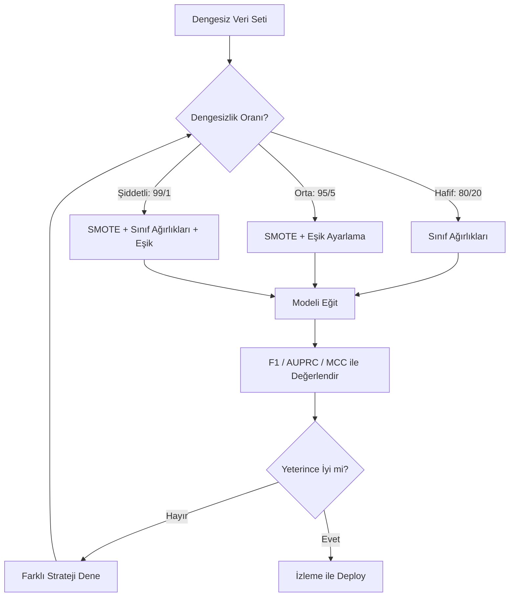
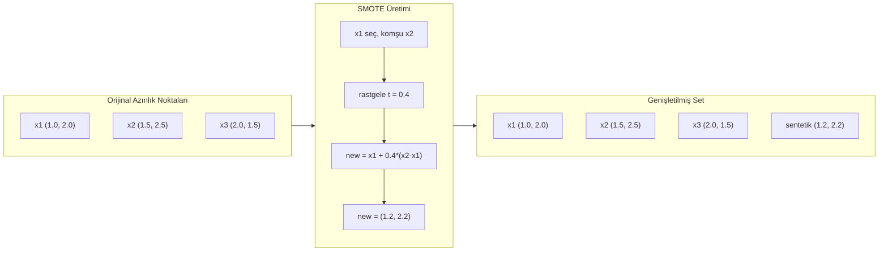
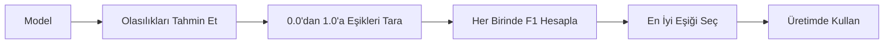
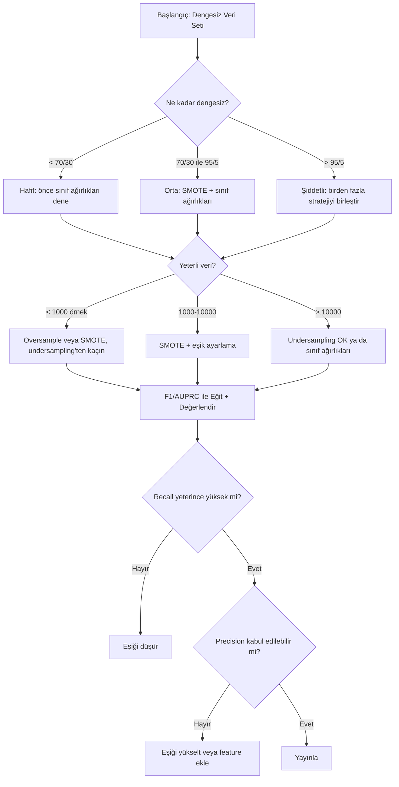

# Dengesiz Veriyi Ele Almak

> Verinin %99'u "normal" olduğunda, accuracy bir yalandır.

**Tür:** Yapım
**Dil:** Python
**Ön koşullar:** Faz 2, Dersler 01-09 (özellikle değerlendirme metrikleri)
**Süre:** ~90 dakika

## Öğrenme Hedefleri

- Sıfırdan SMOTE uygula ve sentetik oversampling'in rastgele kopyalamadan nasıl farklı olduğunu açıkla
- Dengesiz sınıflandırıcıları accuracy yerine F1, AUPRC ve Matthews Correlation Coefficient kullanarak değerlendir
- Sınıf ağırlıklandırması, eşik ayarlama ve yeniden örnekleme stratejilerini karşılaştır ve verilen bir dengesizlik oranı için doğru yaklaşımı seç
- SMOTE, sınıf ağırlıklarını ve eşik optimizasyonunu birleştiren tam bir dengesiz veri pipeline'ı inşa et

## Sorun

Bir sahtekarlık tespit modeli inşa ediyorsun. %99.9 accuracy alıyor. Kutluyorsun. Sonra her tek işlem için "sahtekarlık değil" tahmin ettiğini fark ediyorsun.

Bu bir bug değil. İşlemlerin yalnızca %0.1'i sahtekarlık olduğunda yapılacak rasyonel şeydir. Model, her zaman çoğunluk sınıfını tahmin etmenin genel hatayı minimize ettiğini öğrenir. Teknik olarak doğru ve tamamen işe yaramaz.

Bu, gerçek sınıflandırmanın önemli olduğu her yerde olur. Hastalık teşhisi: %1 pozitif oranı. Ağ saldırısı: %0.01 saldırı. Üretim kusurları: %0.5 kusurlu. Spam filtreleme: %20 spam. Churn tahmini: %5 churn'cüler. Azınlık sınıfı ne kadar sonuçluysa, o kadar nadir olma eğilimindedir.

Accuracy başarısız olur çünkü tüm doğru tahminlere eşit muamele eder. Meşru bir işlemi doğru etiketlemek ve sahtekarlığı doğru yakalamak her ikisi de bir accuracy puanı olarak sayılır. Ama sahtekarlığı yakalamak modelin var olma nedenidir. Modelin nadir ama önemli sınıfa dikkat etmesine zorlayan metriklere, tekniklere ve eğitim stratejilerine ihtiyacımız var.

## Kavram

### Accuracy Neden Başarısız Olur

1000 örnekli bir veri seti düşün: 990 negatif, 10 pozitif. Her zaman negatif tahmin eden bir model:

|  | Pozitif Tahmin | Negatif Tahmin |
|--|---|---|
| Gerçekte Pozitif | 0 (TP) | 10 (FN) |
| Gerçekte Negatif | 0 (FP) | 990 (TN) |

Accuracy = (0 + 990) / 1000 = %99.0

Model sıfır sahtekarlık yakalar. Sıfır hastalık. Sıfır kusur. Ama accuracy %99 diyor. Dengesiz problemler için accuracy'nin neden tehlikeli olduğu işte bu.

### Daha İyi Metrikler

**Precision** = TP / (TP + FP). Pozitif olarak işaretlenen her şeyden, kaçı gerçekten öyledir? Yüksek precision az false alarm demektir.

**Recall** = TP / (TP + FN). Gerçekten pozitif olan her şeyden, kaçını yakaladık? Yüksek recall az kaçırılan pozitif demektir.

**F1 Skoru** = 2 * precision * recall / (precision + recall). Harmonik ortalama. Precision ve recall arasındaki aşırı dengesizliği aritmetik ortalamanın yapacağından daha fazla cezalandırır.

**F-beta Skoru** = (1 + beta^2) * precision * recall / (beta^2 * precision + recall). beta > 1 olduğunda recall daha önemlidir. beta < 1 olduğunda precision daha önemlidir. F2 sahtekarlık tespitinde yaygındır (sahtekarlığı kaçırmak false alarmdan daha kötüdür).

**AUPRC** (Precision-Recall Eğrisi Altındaki Alan). AUC-ROC gibi ama dengesiz veri için daha bilgilendirici. Rastgele bir sınıflandırıcı AUPRC'si pozitif sınıf oranına eşittir (ROC'taki gibi 0.5 değil). Bu iyileştirmeleri görmeyi kolaylaştırır.

**Matthews Correlation Coefficient** = (TP * TN - FP * FN) / sqrt((TP+FP)(TP+FN)(TN+FP)(TN+FN)). -1 ile +1 arasında değişir. Yalnızca model her iki sınıfta iyi performans gösterdiğinde yüksek skor verir. Sınıflar çok farklı boyutlarda olsa bile dengelidir.

Yukarıdaki "her zaman negatif tahmin et" modeli için: precision = 0/0 (tanımsız, genellikle 0 olarak ayarlanır), recall = 0/10 = 0, F1 = 0, MCC = 0. Bu metrikler modeli değersiz olarak doğru şekilde tanımlar.

### Dengesiz Veri Pipeline'ı



### SMOTE: Synthetic Minority Oversampling Technique

Rastgele oversampling mevcut azınlık örneklerini kopyalar. Bu çalışır ama model aynı noktaları tekrar tekrar gördüğü için overfitting riski taşır.

SMOTE kopyalar değil makul yeni sentetik azınlık örnekleri yaratır. Algoritma:

1. Her azınlık örneği x için, diğer azınlık örnekleri arasında k en yakın komşusunu bul
2. Rastgele bir komşu seç
3. x ile o komşu arasındaki çizgi segmentinde yeni bir örnek yarat

Formül: `new_sample = x + random(0, 1) * (neighbor - x)`

Bu, gerçek azınlık noktaları arasında interpolasyon yapar, mevcut veriyi kopyalamadan feature uzayının aynı bölgesinde örnekler yaratır.



### Örnekleme Stratejilerinin Karşılaştırması

**Rastgele Oversampling**: çoğunluk sayısına eşleşmesi için azınlık örneklerini kopyala.
- Artıları: basit, bilgi kaybı yok
- Eksileri: tam kopyalar overfitting'e neden olur, eğitim süresini artırır

**Rastgele Undersampling**: azınlık sayısına eşleşmesi için çoğunluk örneklerini kaldır.
- Artıları: hızlı eğitim, basit
- Eksileri: potansiyel olarak faydalı çoğunluk verisini atar, daha yüksek variance

**SMOTE**: interpolasyon yoluyla sentetik azınlık örnekleri yarat.
- Artıları: yeni veri noktaları üretir, rastgele oversampling'e göre overfitting'i azaltır
- Eksileri: karar sınırının yakınında gürültülü örnekler yaratabilir, çoğunluk sınıfı dağılımını hesaba katmaz

| Strateji | Değişen Veri | Risk | Ne Zaman Kullanılır |
|----------|-------------|------|-------------|
| Oversample | Azınlık kopyalanır | Overfitting | Küçük veri setleri, orta dengesizlik |
| Undersample | Çoğunluk kaldırılır | Bilgi kaybı | Büyük veri setleri, hızlı eğitim isteniyor |
| SMOTE | Sentetik azınlık eklenir | Sınır gürültüsü | Orta dengesizlik, k-NN için yeterli azınlık örneği |

### Sınıf Ağırlıkları

Veriyi değiştirmek yerine, modelin hataları nasıl ele aldığını değiştir. Azınlık sınıfını yanlış sınıflandırmaya daha yüksek ağırlık ata.

950 negatif ve 50 pozitif örnekli ikili bir problem için:
- Negatif sınıf için ağırlık = n_samples / (2 * n_negative) = 1000 / (2 * 950) = 0.526
- Pozitif sınıf için ağırlık = n_samples / (2 * n_positive) = 1000 / (2 * 50) = 10.0

Pozitif sınıf 19 kat ağırlık alır. Bir pozitif örneği yanlış sınıflandırmak 19 negatif örneği yanlış sınıflandırmak kadar maliyetlidir. Model azınlık sınıfına dikkat etmeye zorlanır.

Lojistik regresyonda, bu loss fonksiyonunu değiştirir:

```
weighted_loss = -sum(w_i * [y_i * log(p_i) + (1-y_i) * log(1-p_i)])
```

burada w_i, i örneğinin sınıfına bağlıdır.

Sınıf ağırlıkları beklentide oversampling'e matematiksel olarak eşdeğerdir ama yeni veri noktaları yaratmadan. Bu onları daha hızlı yapar ve kopyalanan örneklerin overfitting riskinden kaçınır.

### Eşik Ayarlama

Çoğu sınıflandırıcı bir olasılık çıkarır. Varsayılan eşik 0.5'tir: P(positive) >= 0.5 ise pozitif tahmin et. Ama 0.5 keyfidir. Sınıflar dengesiz olduğunda, optimal eşik genellikle çok daha düşüktür.

Süreç:
1. Bir model eğit
2. Doğrulama setinde tahmin edilen olasılıkları al
3. 0.0'dan 1.0'a eşikleri tara
4. Her eşikte F1 (veya seçtiğin metrik) hesapla
5. Metriğini maksimize eden eşiği seç



Bir model sahtekarlık bir işlem için P(fraud) = 0.15 çıkarabilir. 0.5 eşikte, bu sahtekarlık değil olarak sınıflandırılır. 0.10 eşikte, doğru yakalanır. Olasılık kalibrasyonu sıralamadan daha az önemlidir -- sahtekarlık olmayanlardan daha yüksek olasılıklar aldığı sürece, onları ayıran bir eşik vardır.

### Cost-Sensitive Learning

Sınıf ağırlıklarının genelleştirilmesi. Üniform maliyetler yerine, belirli yanlış sınıflandırma maliyetleri ata:

| | Pozitif Tahmin | Negatif Tahmin |
|--|---|---|
| Gerçekte Pozitif | 0 (doğru) | C_FN = 100 |
| Gerçekte Negatif | C_FP = 1 | 0 (doğru) |

Sahtekarlık işlemini kaçırmak (FN) false alarm'dan (FP) 100 kat daha pahalıdır. Model toplam hata sayısını değil, toplam maliyeti optimize eder.

Bu, gerçek dünya maliyetlerini tahmin edebildiğinde en prensipli yaklaşımdır. Kaçırılan bir kanser teşhisi, ekstra bir biyopsiye yol açan false alarmdan çok farklı bir maliyete sahiptir. Bu maliyetleri açık hale getirmek doğru takasları zorlar.

### Karar Akış Şeması



## İnşa Et

### Adım 1: Dengesiz bir veri seti üret

```python
import numpy as np


def make_imbalanced_data(n_majority=950, n_minority=50, seed=42):
    rng = np.random.RandomState(seed)

    X_maj = rng.randn(n_majority, 2) * 1.0 + np.array([0.0, 0.0])
    X_min = rng.randn(n_minority, 2) * 0.8 + np.array([2.5, 2.5])

    X = np.vstack([X_maj, X_min])
    y = np.concatenate([np.zeros(n_majority), np.ones(n_minority)])

    shuffle_idx = rng.permutation(len(y))
    return X[shuffle_idx], y[shuffle_idx]
```

### Adım 2: Sıfırdan SMOTE

```python
def euclidean_distance(a, b):
    return np.sqrt(np.sum((a - b) ** 2))


def find_k_neighbors(X, idx, k):
    distances = []
    for i in range(len(X)):
        if i == idx:
            continue
        d = euclidean_distance(X[idx], X[i])
        distances.append((i, d))
    distances.sort(key=lambda x: x[1])
    return [d[0] for d in distances[:k]]


def smote(X_minority, k=5, n_synthetic=100, seed=42):
    rng = np.random.RandomState(seed)
    n_samples = len(X_minority)
    k = min(k, n_samples - 1)
    synthetic = []

    for _ in range(n_synthetic):
        idx = rng.randint(0, n_samples)
        neighbors = find_k_neighbors(X_minority, idx, k)
        neighbor_idx = neighbors[rng.randint(0, len(neighbors))]
        t = rng.random()
        new_point = X_minority[idx] + t * (X_minority[neighbor_idx] - X_minority[idx])
        synthetic.append(new_point)

    return np.array(synthetic)
```

### Adım 3: Rastgele oversampling ve undersampling

```python
def random_oversample(X, y, seed=42):
    rng = np.random.RandomState(seed)
    classes, counts = np.unique(y, return_counts=True)
    max_count = counts.max()

    X_resampled = list(X)
    y_resampled = list(y)

    for cls, count in zip(classes, counts):
        if count < max_count:
            cls_indices = np.where(y == cls)[0]
            n_needed = max_count - count
            chosen = rng.choice(cls_indices, size=n_needed, replace=True)
            X_resampled.extend(X[chosen])
            y_resampled.extend(y[chosen])

    X_out = np.array(X_resampled)
    y_out = np.array(y_resampled)
    shuffle = rng.permutation(len(y_out))
    return X_out[shuffle], y_out[shuffle]


def random_undersample(X, y, seed=42):
    rng = np.random.RandomState(seed)
    classes, counts = np.unique(y, return_counts=True)
    min_count = counts.min()

    X_resampled = []
    y_resampled = []

    for cls in classes:
        cls_indices = np.where(y == cls)[0]
        chosen = rng.choice(cls_indices, size=min_count, replace=False)
        X_resampled.extend(X[chosen])
        y_resampled.extend(y[chosen])

    X_out = np.array(X_resampled)
    y_out = np.array(y_resampled)
    shuffle = rng.permutation(len(y_out))
    return X_out[shuffle], y_out[shuffle]
```

### Adım 4: Sınıf ağırlıklarıyla lojistik regresyon

```python
def sigmoid(z):
    return 1.0 / (1.0 + np.exp(-np.clip(z, -500, 500)))


def logistic_regression_weighted(X, y, weights, lr=0.01, epochs=200):
    n_samples, n_features = X.shape
    w = np.zeros(n_features)
    b = 0.0

    for _ in range(epochs):
        z = X @ w + b
        pred = sigmoid(z)
        error = pred - y
        weighted_error = error * weights

        gradient_w = (X.T @ weighted_error) / n_samples
        gradient_b = np.mean(weighted_error)

        w -= lr * gradient_w
        b -= lr * gradient_b

    return w, b


def compute_class_weights(y):
    classes, counts = np.unique(y, return_counts=True)
    n_samples = len(y)
    n_classes = len(classes)
    weight_map = {}
    for cls, count in zip(classes, counts):
        weight_map[cls] = n_samples / (n_classes * count)
    return np.array([weight_map[yi] for yi in y])
```

### Adım 5: Eşik ayarlama

```python
def find_optimal_threshold(y_true, y_probs, metric="f1"):
    best_threshold = 0.5
    best_score = -1.0

    for threshold in np.arange(0.05, 0.96, 0.01):
        y_pred = (y_probs >= threshold).astype(int)
        tp = np.sum((y_pred == 1) & (y_true == 1))
        fp = np.sum((y_pred == 1) & (y_true == 0))
        fn = np.sum((y_pred == 0) & (y_true == 1))

        if metric == "f1":
            precision = tp / (tp + fp) if (tp + fp) > 0 else 0.0
            recall = tp / (tp + fn) if (tp + fn) > 0 else 0.0
            score = 2 * precision * recall / (precision + recall) if (precision + recall) > 0 else 0.0
        elif metric == "recall":
            score = tp / (tp + fn) if (tp + fn) > 0 else 0.0
        elif metric == "precision":
            score = tp / (tp + fp) if (tp + fp) > 0 else 0.0

        if score > best_score:
            best_score = score
            best_threshold = threshold

    return best_threshold, best_score
```

### Adım 6: Değerlendirme fonksiyonları

```python
def confusion_matrix_values(y_true, y_pred):
    tp = np.sum((y_pred == 1) & (y_true == 1))
    tn = np.sum((y_pred == 0) & (y_true == 0))
    fp = np.sum((y_pred == 1) & (y_true == 0))
    fn = np.sum((y_pred == 0) & (y_true == 1))
    return tp, tn, fp, fn


def compute_metrics(y_true, y_pred):
    tp, tn, fp, fn = confusion_matrix_values(y_true, y_pred)
    accuracy = (tp + tn) / (tp + tn + fp + fn)
    precision = tp / (tp + fp) if (tp + fp) > 0 else 0.0
    recall = tp / (tp + fn) if (tp + fn) > 0 else 0.0
    f1 = 2 * precision * recall / (precision + recall) if (precision + recall) > 0 else 0.0

    denom = np.sqrt(float((tp + fp) * (tp + fn) * (tn + fp) * (tn + fn)))
    mcc = (tp * tn - fp * fn) / denom if denom > 0 else 0.0

    return {
        "accuracy": accuracy,
        "precision": precision,
        "recall": recall,
        "f1": f1,
        "mcc": mcc,
    }
```

### Adım 7: Tüm yaklaşımları karşılaştır

```python
X, y = make_imbalanced_data(950, 50, seed=42)
split = int(0.8 * len(y))
X_train, X_test = X[:split], X[split:]
y_train, y_test = y[:split], y[split:]

# Baseline: tedavi yok
w_base, b_base = logistic_regression_weighted(
    X_train, y_train, np.ones(len(y_train)), lr=0.1, epochs=300
)
probs_base = sigmoid(X_test @ w_base + b_base)
preds_base = (probs_base >= 0.5).astype(int)

# Oversampled
X_over, y_over = random_oversample(X_train, y_train)
w_over, b_over = logistic_regression_weighted(
    X_over, y_over, np.ones(len(y_over)), lr=0.1, epochs=300
)
preds_over = (sigmoid(X_test @ w_over + b_over) >= 0.5).astype(int)

# SMOTE
minority_mask = y_train == 1
X_minority = X_train[minority_mask]
synthetic = smote(X_minority, k=5, n_synthetic=len(y_train) - 2 * int(minority_mask.sum()))
X_smote = np.vstack([X_train, synthetic])
y_smote = np.concatenate([y_train, np.ones(len(synthetic))])
w_sm, b_sm = logistic_regression_weighted(
    X_smote, y_smote, np.ones(len(y_smote)), lr=0.1, epochs=300
)
preds_smote = (sigmoid(X_test @ w_sm + b_sm) >= 0.5).astype(int)

# Sınıf ağırlıkları
sample_weights = compute_class_weights(y_train)
w_cw, b_cw = logistic_regression_weighted(
    X_train, y_train, sample_weights, lr=0.1, epochs=300
)
probs_cw = sigmoid(X_test @ w_cw + b_cw)
preds_cw = (probs_cw >= 0.5).astype(int)

# Eşik ayarlama (test seti üzerinde değil, ayrılmış doğrulama seti üzerinde ayarla)
probs_val = sigmoid(X_val @ w_cw + b_cw)
best_thresh, best_f1 = find_optimal_threshold(y_val, probs_val, metric="f1")
preds_thresh = (probs_cw >= best_thresh).astype(int)
```

Kod dosyası tüm bunları tek bir script'te çalıştırır ve sonuçları yazdırır.

## Kullan

scikit-learn ve imbalanced-learn ile bu teknikler tek satırlıktır:

```python
from sklearn.linear_model import LogisticRegression
from sklearn.metrics import classification_report, f1_score
from sklearn.model_selection import train_test_split
from imblearn.over_sampling import SMOTE
from imblearn.under_sampling import RandomUnderSampler
from imblearn.pipeline import Pipeline

X_train, X_test, y_train, y_test = train_test_split(X, y, stratify=y)

model_weighted = LogisticRegression(class_weight="balanced")
model_weighted.fit(X_train, y_train)
print(classification_report(y_test, model_weighted.predict(X_test)))

smote = SMOTE(random_state=42)
X_resampled, y_resampled = smote.fit_resample(X_train, y_train)
model_smote = LogisticRegression()
model_smote.fit(X_resampled, y_resampled)
print(classification_report(y_test, model_smote.predict(X_test)))

pipeline = Pipeline([
    ("smote", SMOTE()),
    ("model", LogisticRegression(class_weight="balanced")),
])
pipeline.fit(X_train, y_train)
print(classification_report(y_test, pipeline.predict(X_test)))
```

Sıfırdan uygulamalar her tekniğin tam olarak ne yaptığını gösterir. SMOTE azınlık sınıfında sadece k-NN interpolasyonudur. Sınıf ağırlıkları loss'u çarpar. Eşik ayarlama kesim noktaları üzerinde bir for-loop'tur. Sihir yok.

## Yayınla

Bu ders şunları üretir:
- `outputs/skill-imbalanced-data.md` -- dengesiz sınıflandırma problemlerini ele almak için bir karar kontrol listesi

## Alıştırmalar

1. **Borderline-SMOTE**: SMOTE uygulamasını yalnızca karar sınırının yakınındaki azınlık noktaları için (k-en yakın komşuları çoğunluk sınıf örneklerini içerenler) sentetik örnekler üretecek şekilde değiştir. Sınıfların örtüştüğü bir veri setinde standart SMOTE ile sonuçları karşılaştır.

2. **Maliyet matrisi optimizasyonu**: maliyet matrisinin bir parametre olduğu cost-sensitive learning uygula. Bir maliyet matrisi alan ve beklenen maliyeti minimize eden optimal tahminleri döndüren bir fonksiyon yarat. Farklı maliyet oranlarıyla test et (1:10, 1:100, 1:1000) ve precision-recall dengesinin nasıl değiştiğini çiz.

3. **Eşik kalibrasyonu**: Platt scaling uygula (kalibre edilmiş olasılıklar üretmek için modelin ham çıktılarına bir lojistik regresyon uydur). Kalibrasyondan önce ve sonra precision-recall eğrisini karşılaştır. Kalibrasyonun sıralamayı değiştirmediğini (AUC aynı kalır) ama olasılıkları daha anlamlı yaptığını göster.

4. **Dengeli bagging ile ensemble**: birden fazla model eğit, her biri dengeli bir bootstrap örneğinde (tüm azınlık + çoğunluğun rastgele alt kümesi). Tahminlerini ortala. Bu yaklaşımı SMOTE'lu tek bir modele karşı karşılaştır. Hem performansı hem de çalışmalar arasındaki variance'ı ölç.

5. **Dengesizlik oranı deneyi**: dengeli bir veri seti al ve dengesizlik oranını aşamalı olarak artır (50/50, 70/30, 90/10, 95/5, 99/1). Her oran için, SMOTE ile ve olmadan eğit. Her iki yaklaşım için dengesizlik oranına karşı F1 çiz. SMOTE hangi oranda anlamlı bir fark yaratmaya başlar?

## Anahtar Terimler

| Terim | İnsanlar ne der | Aslında ne demek |
|------|----------------|----------------------|
| Sınıf dengesizliği | "Bir sınıfta çok daha fazla örnek var" | Veri setindeki sınıfların dağılımı önemli ölçüde çarpıktır, modellerin çoğunluk sınıfını tercih etmesine neden olur |
| SMOTE | "Sentetik oversampling" | Mevcut azınlık örnekleri ile k-en yakın azınlık komşuları arasında interpolasyon yaparak yeni azınlık örnekleri yaratır |
| Sınıf ağırlıkları | "Nadir sınıflardaki hataları daha pahalı yapmak" | Modelin azınlık yanlış sınıflandırmasını daha ağır cezalandırması için loss fonksiyonunu sınıfa özgü ağırlıklarla çarpmak |
| Eşik ayarlama | "Karar sınırını hareket ettirmek" | Sınıflandırma için olasılık kesim noktasını varsayılan 0.5'ten istenen metriği optimize eden bir değere değiştirmek |
| Precision-recall dengesi | "İkisini birden alamazsın" | Eşiği düşürmek daha fazla pozitif yakalar (daha yüksek recall) ama aynı zamanda daha fazla false positive işaretler (daha düşük precision) ve tersi |
| AUPRC | "PR eğrisi altındaki alan" | Precision-recall eğrisini tek bir sayıya özetler; sınıflar ağır şekilde dengesiz olduğunda AUC-ROC'tan daha bilgilendiricidir |
| Matthews Correlation Coefficient | "Dengeli metrik" | Modelin yalnızca her iki sınıfta iyi performans gösterdiğinde yüksek skor üreten tahmin edilen ve gerçek etiketler arasındaki korelasyon |
| Cost-sensitive learning | "Farklı hatalar farklı miktarlara mal olur" | Modelin hata sayısını değil, toplam maliyeti optimize etmesi için gerçek dünya yanlış sınıflandırma maliyetlerini eğitim hedefine dahil etmek |
| Rastgele oversampling | "Azınlığı çoğalt" | Sınıf sayılarını dengelemek için azınlık sınıfı örneklerini tekrarlamak; basit ama kopyalanan noktalara overfit yapma riski |

## Daha Fazla Okuma

- [SMOTE: Synthetic Minority Over-sampling Technique (Chawla et al., 2002)](https://arxiv.org/abs/1106.1813) -- orijinal SMOTE makalesi, dengesiz öğrenme üzerine hâlâ en çok atıfta bulunulan çalışma
- [Learning from Imbalanced Data (He & Garcia, 2009)](https://ieeexplore.ieee.org/document/5128907) -- örnekleme, cost-sensitive ve algoritmik yaklaşımları kapsayan kapsamlı bir inceleme
- [imbalanced-learn documentation](https://imbalanced-learn.org/stable/) -- SMOTE varyantları, undersampling stratejileri ve pipeline entegrasyonu içeren Python kütüphanesi
- [The Precision-Recall Plot Is More Informative than the ROC Plot (Saito & Rehmsmeier, 2015)](https://journals.plos.org/plosone/article?id=10.1371/journal.pone.0118432) -- dengesiz problemler için PR eğrilerinin ROC eğrilerine ne zaman ve neden tercih edileceği
