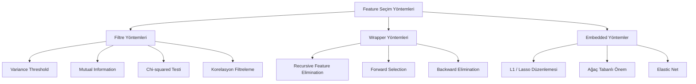
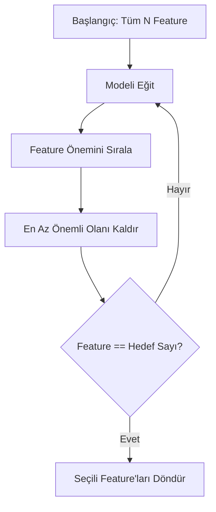
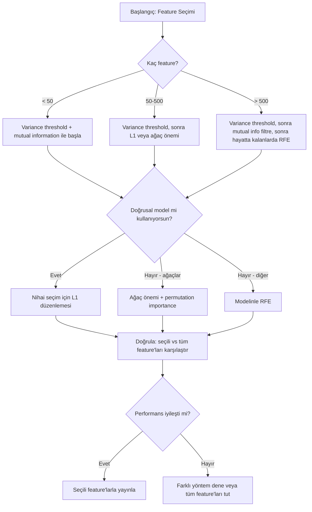

# Feature Seçimi

> Daha fazla feature daha iyi değildir. Doğru feature'lar daha iyidir.

**Tür:** Yapım
**Dil:** Python
**Ön koşullar:** Faz 2, Dersler 01-09, 08 (feature engineering)
**Süre:** ~75 dakika

## Öğrenme Hedefleri

- Sıfırdan filtre yöntemleri (variance threshold, mutual information, chi-squared) ve wrapper yöntemleri (RFE, forward selection) uygula
- Mutual information'ın korelasyonun kaçırdığı doğrusal olmayan feature-target ilişkilerini nasıl yakaladığını açıkla
- L1 düzenlemesini (embedded seçim) RFE (wrapper seçim) ile karşılaştır ve hesaplama dengelerini değerlendir
- Birden fazla yöntemi birleştiren bir feature seçim pipeline'ı inşa et ve held-out veride iyileştirilmiş genelleştirmeyi göster

## Sorun

500 feature'ın var. Modelin yavaş eğitiliyor, sürekli overfit yapıyor ve hiç kimse ne öğrendiğini açıklayamıyor. Performansı iyileştirmeyi umarak daha fazla feature ekliyorsun. Daha kötüye gidiyor.

Bu eylemdeki boyut lanetidir. Feature sayısı arttıkça, feature uzayının hacmi patlar. Veri noktaları seyrekleşir. Noktalar arasındaki mesafeler yakınsar. Modelin gerçek örüntüleri bulmak için üstel olarak daha fazla veriye ihtiyacı vardır. Gürültü feature'ları sinyal feature'larını boğar. Overfitting varsayılan haline gelir.

Feature seçimi panzehirdir. Gürültüyü soy. Gereksizliği kaldır. Target hakkında gerçek bilgi taşıyan feature'ları tut. Sonuç: daha hızlı eğitim, daha iyi genelleştirme ve gerçekten açıklayabileceğin modeller.

Amaç tüm mevcut bilgiyi kullanmak değildir. Doğru bilgiyi kullanmaktır.

## Kavram

### Üç Feature Seçim Kategorisi

Her feature seçim yöntemi üç kategoriden birine girer:



**Filtre yöntemleri** istatistiksel bir ölçü kullanarak her feature'ı bağımsız olarak skorlar. Bir model kullanmazlar. Hızlıdır, ama feature etkileşimlerini kaçırırlar.

**Wrapper yöntemleri** feature alt kümelerini değerlendirmek için bir model eğitir. Skor olarak model performansını kullanırlar. Daha iyi sonuçlar, ama modeli birçok kez yeniden eğittiği için pahalıdır.

**Embedded yöntemler** feature'ları model eğitiminin bir parçası olarak seçer. L1 düzenlemesi ağırlıkları sıfıra sürer. Karar ağaçları en faydalı feature'larda bölünür. Seçim ayrı bir adım olarak değil, uydurma sırasında olur.

### Variance Threshold

En basit filtre. Bir feature örnekler arasında zar zor değişiyorsa, neredeyse hiç bilgi taşımaz.

1000 örneğin 999'u için 0.0 olan bir feature düşün. Variance'ı sıfıra yakındır. Hiçbir model onu sınıflar arasında ayırt etmek için kullanamaz. Onu kaldır.

```
variance(x) = mean((x - mean(x))^2)
```

Bir eşik belirle (örn., 0.01). Onun altında variance'a sahip her feature'ı düşür. Bu, target değişkenine hiç bakmadan açıkça işe yaramaz feature'ları kaldırır.

Ne zaman kullanılır: diğer yöntemlerden önce bir ön işleme adımı olarak. Sıfıra yakın maliyetle açıkça işe yaramaz feature'ları yakalar.

Sınırlama: bir feature yüksek variance'a sahip olabilir ve yine de saf gürültü olabilir. Variance threshold gereklidir ama yeterli değildir.

### Mutual Information

Mutual information, X feature'ının değerini bilmenin target Y hakkındaki belirsizliği ne kadar azalttığını ölçer.

```
I(X; Y) = sum_x sum_y p(x, y) * log(p(x, y) / (p(x) * p(y)))
```

X ve Y bağımsızsa, p(x, y) = p(x) * p(y), bu yüzden log terimi sıfırdır ve I(X; Y) = 0. X sana Y hakkında ne kadar çok şey söylerse, mutual information o kadar yüksektir.

Korelasyona göre anahtar avantaj: mutual information doğrusal olmayan ilişkileri yakalar. Bir feature'ın target ile sıfır korelasyonu olabilir ama yüksek mutual information'a sahip olabilir çünkü ilişki kuadratik veya periyodiktir.

Sürekli feature'lar için, önce bin'lere ayır (histogram tabanlı tahmin). Bin sayısı tahmini etkiler -- çok az bin bilgi kaybeder, çok fazla bin gürültü ekler. Yaygın bir seçim: sqrt(n) bin veya Sturges kuralı (1 + log2(n)).


### Recursive Feature Elimination (RFE)

RFE bir wrapper yöntemidir. İteratif olarak budamak için bir modelin kendi feature önemini kullanır:

1. Tüm feature'larla modeli eğit
2. Feature'ları öneme göre sırala (doğrusal modeller için katsayılar, ağaçlar için impurity azalması)
3. En az önemli feature'ı(ları) kaldır
4. İstenen feature sayısı kalana kadar tekrarla



RFE feature etkileşimlerini düşünür çünkü model tüm kalan feature'ları birlikte görür. Bir feature'ı kaldırmak diğerlerinin önemini değiştirir. Bu onu filtre yöntemlerinden daha kapsamlı yapar.

Maliyet: modeli N - hedef kez eğitirsin. 500 feature ve 10 hedefiyle, bu 490 eğitim çalıştırması demektir. Pahalı modeller için bu yavaştır. Her adımda birden fazla feature kaldırarak (örn., her turda en alt %10'u kaldır) hızlandırabilirsin.

### L1 (Lasso) Düzenlemesi

L1 düzenlemesi loss fonksiyonuna ağırlıkların mutlak değerini ekler:

```
loss = prediction_error + alpha * sum(|w_i|)
```

alpha parametresi feature'ların ne kadar agresif şekilde budandığını kontrol eder. Daha yüksek alpha, daha fazla ağırlığın tam olarak sıfıra gitmesi demektir.

Neden tam olarak sıfır? L1 cezası ağırlık uzayında elmas şeklinde bir kısıt bölgesi yaratır. Optimal çözüm, bir veya daha fazla ağırlığın sıfır olduğu bu elmasın bir köşesine inme eğilimindedir. L2 düzenlemesi (ridge) ağırlıkların küçüldüğü ama nadiren sıfıra ulaştığı dairesel bir kısıt yaratır.

Bu embedded feature seçimidir: model eğitim sırasında hangi feature'ları görmezden geleceğini öğrenir. Sıfır ağırlığa sahip feature'lar etkin olarak kaldırılır.

Avantajlar: tek eğitim çalıştırması, korelasyonlu feature'ları ele alır (birini seçer ve diğerlerini sıfırlar), çoğu doğrusal model uygulamasına gömülüdür.

Sınırlama: yalnızca doğrusal modeller için çalışır. Doğrusal olmayan feature önemini yakalayamaz.

### Ağaç Tabanlı Feature Önemi

Karar ağaçları ve ensemble'ları (random forest, gradient boosting) doğal olarak feature'ları sıralar. Her bölünme impurity'yi (sınıflandırma için Gini veya entropi, regresyon için variance) azaltır. Daha büyük impurity azalmaları üreten feature'lar daha önemlidir.

T ağaçlı bir random forest için:

```
importance(feature_j) = (1/T) * tüm ağaçlar üzerinde toplam
    feature_j üzerinde bölünen tüm node'lar üzerinde toplam
        (n_samples * impurity_decrease)
```

Bu, her feature için normalize edilmiş bir önem skoru verir. Doğrusal olmayan ilişkileri ve feature etkileşimlerini otomatik olarak ele alır.

Dikkat: ağaç tabanlı önem birçok benzersiz değere sahip feature'lara (yüksek kardinalite) yanlıdır. Rastgele bir ID kolonu önemli görünecektir çünkü her örneği mükemmel şekilde böler. Bir sağlık kontrolü olarak permutation importance kullan.

### Permutation Importance

Modelden bağımsız bir yöntem:

1. Modeli eğit ve doğrulama verisinde baseline performansını kaydet
2. Her feature için: değerlerini rastgele karıştır, performanstaki düşüşü ölç
3. Düşüş ne kadar büyükse, feature o kadar önemlidir

Bir feature'ı karıştırmak performansa zarar vermiyorsa, model ona bağlı değildir. Performans çökerse, o feature kritiktir.

Permutation importance ağaç tabanlı önemin kardinalite yanlılığından kaçınır. Ama yavaştır: feature başına bir tam değerlendirme, kararlılık için birden fazla kez tekrarlanır.

### Karşılaştırma Tablosu

| Yöntem | Tip | Hız | Doğrusal Olmayan | Feature Etkileşimleri |
|--------|------|-------|-----------|---------------------|
| Variance threshold | Filtre | Çok hızlı | Hayır | Hayır |
| Mutual information | Filtre | Hızlı | Evet | Hayır |
| Korelasyon filtresi | Filtre | Hızlı | Hayır | Hayır |
| RFE | Wrapper | Yavaş | Modele bağlı | Evet |
| L1 / Lasso | Embedded | Hızlı | Hayır (doğrusal) | Hayır |
| Ağaç önemi | Embedded | Orta | Evet | Evet |
| Permutation importance | Modelden bağımsız | Yavaş | Evet | Evet |

### Karar Akış Şeması



## İnşa Et

### Adım 1: Bilinen feature yapısına sahip sentetik veri üret

```python
import numpy as np


def make_feature_selection_data(n_samples=500, seed=42):
    rng = np.random.RandomState(seed)

    x1 = rng.randn(n_samples)
    x2 = rng.randn(n_samples)
    x3 = rng.randn(n_samples)
    x4 = x1 + 0.1 * rng.randn(n_samples)
    x5 = x2 + 0.1 * rng.randn(n_samples)

    informative = np.column_stack([x1, x2, x3, x4, x5])

    correlated = np.column_stack([
        x1 * 0.9 + 0.1 * rng.randn(n_samples),
        x2 * 0.8 + 0.2 * rng.randn(n_samples),
        x3 * 0.7 + 0.3 * rng.randn(n_samples),
        x1 * 0.5 + x2 * 0.5 + 0.1 * rng.randn(n_samples),
        x2 * 0.6 + x3 * 0.4 + 0.1 * rng.randn(n_samples),
    ])

    noise = rng.randn(n_samples, 10) * 0.5

    X = np.hstack([informative, correlated, noise])
    y = (2 * x1 - 1.5 * x2 + x3 + 0.5 * rng.randn(n_samples) > 0).astype(int)

    feature_names = (
        [f"info_{i}" for i in range(5)]
        + [f"corr_{i}" for i in range(5)]
        + [f"noise_{i}" for i in range(10)]
    )

    return X, y, feature_names
```

Ground truth'u biliyoruz: 0-4 feature'ları bilgilendiricidir (artı 3 ve 4 0 ve 1'in korelasyonlu kopyalarıdır), 5-9 feature'ları bilgilendirici feature'larla korelasyonludur, 10-19 feature'ları saf gürültüdür. İyi bir seçim yöntemi 0-4'ü en yüksek ve 10-19'u en düşük sıralamalıdır.

### Adım 2: Variance threshold

```python
def variance_threshold(X, threshold=0.01):
    variances = np.var(X, axis=0)
    mask = variances > threshold
    return mask, variances
```

### Adım 3: Mutual information (ayrık)

```python
def discretize(x, n_bins=10):
    min_val, max_val = x.min(), x.max()
    if max_val == min_val:
        return np.zeros_like(x, dtype=int)
    bin_edges = np.linspace(min_val, max_val, n_bins + 1)
    binned = np.digitize(x, bin_edges[1:-1])
    return binned


def mutual_information(X, y, n_bins=10):
    n_samples, n_features = X.shape
    mi_scores = np.zeros(n_features)

    y_vals, y_counts = np.unique(y, return_counts=True)
    p_y = y_counts / n_samples

    for f in range(n_features):
        x_binned = discretize(X[:, f], n_bins)
        x_vals, x_counts = np.unique(x_binned, return_counts=True)
        p_x = dict(zip(x_vals, x_counts / n_samples))

        mi = 0.0
        for xv in x_vals:
            for yi, yv in enumerate(y_vals):
                joint_mask = (x_binned == xv) & (y == yv)
                p_xy = np.sum(joint_mask) / n_samples
                if p_xy > 0:
                    mi += p_xy * np.log(p_xy / (p_x[xv] * p_y[yi]))
        mi_scores[f] = mi

    return mi_scores
```

### Adım 4: Recursive Feature Elimination

```python
def simple_logistic_importance(X, y, lr=0.1, epochs=100):
    n_samples, n_features = X.shape
    w = np.zeros(n_features)
    b = 0.0

    for _ in range(epochs):
        z = X @ w + b
        pred = 1.0 / (1.0 + np.exp(-np.clip(z, -500, 500)))
        error = pred - y
        w -= lr * (X.T @ error) / n_samples
        b -= lr * np.mean(error)

    return w, b


def rfe(X, y, n_features_to_select=5, lr=0.1, epochs=100):
    n_total = X.shape[1]
    remaining = list(range(n_total))
    rankings = np.ones(n_total, dtype=int)
    rank = n_total

    while len(remaining) > n_features_to_select:
        X_subset = X[:, remaining]
        w, _ = simple_logistic_importance(X_subset, y, lr, epochs)
        importances = np.abs(w)

        least_idx = np.argmin(importances)
        original_idx = remaining[least_idx]
        rankings[original_idx] = rank
        rank -= 1
        remaining.pop(least_idx)

    for idx in remaining:
        rankings[idx] = 1

    selected_mask = rankings == 1
    return selected_mask, rankings
```

### Adım 5: L1 feature seçimi

```python
def soft_threshold(w, alpha):
    return np.sign(w) * np.maximum(np.abs(w) - alpha, 0)


def l1_feature_selection(X, y, alpha=0.1, lr=0.01, epochs=500):
    n_samples, n_features = X.shape
    w = np.zeros(n_features)
    b = 0.0

    for _ in range(epochs):
        z = X @ w + b
        pred = 1.0 / (1.0 + np.exp(-np.clip(z, -500, 500)))
        error = pred - y

        gradient_w = (X.T @ error) / n_samples
        gradient_b = np.mean(error)

        w -= lr * gradient_w
        w = soft_threshold(w, lr * alpha)
        b -= lr * gradient_b

    selected_mask = np.abs(w) > 1e-6
    return selected_mask, w
```

### Adım 6: Ağaç tabanlı önem (basit karar ağacı)

```python
def gini_impurity(y):
    if len(y) == 0:
        return 0.0
    classes, counts = np.unique(y, return_counts=True)
    probs = counts / len(y)
    return 1.0 - np.sum(probs ** 2)


def best_split(X, y, feature_idx):
    values = np.unique(X[:, feature_idx])
    if len(values) <= 1:
        return None, -1.0

    best_threshold = None
    best_gain = -1.0
    parent_gini = gini_impurity(y)
    n = len(y)

    for i in range(len(values) - 1):
        threshold = (values[i] + values[i + 1]) / 2.0
        left_mask = X[:, feature_idx] <= threshold
        right_mask = ~left_mask

        n_left = np.sum(left_mask)
        n_right = np.sum(right_mask)

        if n_left == 0 or n_right == 0:
            continue

        gain = parent_gini - (n_left / n) * gini_impurity(y[left_mask]) - (n_right / n) * gini_impurity(y[right_mask])

        if gain > best_gain:
            best_gain = gain
            best_threshold = threshold

    return best_threshold, best_gain


def tree_importance(X, y, n_trees=50, max_depth=5, seed=42):
    rng = np.random.RandomState(seed)
    n_samples, n_features = X.shape
    importances = np.zeros(n_features)

    for _ in range(n_trees):
        sample_idx = rng.choice(n_samples, size=n_samples, replace=True)
        feature_subset = rng.choice(n_features, size=max(1, int(np.sqrt(n_features))), replace=False)

        X_boot = X[sample_idx]
        y_boot = y[sample_idx]

        tree_imp = _build_tree_importance(X_boot, y_boot, feature_subset, max_depth)
        importances += tree_imp

    total = importances.sum()
    if total > 0:
        importances /= total

    return importances


def _build_tree_importance(X, y, feature_subset, max_depth, depth=0):
    n_features = X.shape[1]
    importances = np.zeros(n_features)

    if depth >= max_depth or len(np.unique(y)) <= 1 or len(y) < 4:
        return importances

    best_feature = None
    best_threshold = None
    best_gain = -1.0

    for f in feature_subset:
        threshold, gain = best_split(X, y, f)
        if gain > best_gain:
            best_gain = gain
            best_feature = f
            best_threshold = threshold

    if best_feature is None or best_gain <= 0:
        return importances

    importances[best_feature] += best_gain * len(y)

    left_mask = X[:, best_feature] <= best_threshold
    right_mask = ~left_mask

    importances += _build_tree_importance(X[left_mask], y[left_mask], feature_subset, max_depth, depth + 1)
    importances += _build_tree_importance(X[right_mask], y[right_mask], feature_subset, max_depth, depth + 1)

    return importances
```

### Adım 7: Tüm yöntemleri çalıştır ve karşılaştır

Kod dosyası, beş yöntemi aynı sentetik veri setinde çalıştırır ve her yöntemin hangi feature'ları seçtiğini gösteren bir karşılaştırma tablosu yazdırır.

## Kullan

scikit-learn ile feature seçimi pipeline'a gömülüdür:

```python
from sklearn.feature_selection import (
    VarianceThreshold,
    mutual_info_classif,
    RFE,
    SelectFromModel,
)
from sklearn.linear_model import Lasso, LogisticRegression
from sklearn.ensemble import RandomForestClassifier

vt = VarianceThreshold(threshold=0.01)
X_filtered = vt.fit_transform(X)

mi_scores = mutual_info_classif(X, y)
top_k = np.argsort(mi_scores)[-10:]

rfe_selector = RFE(LogisticRegression(), n_features_to_select=10)
rfe_selector.fit(X, y)
X_rfe = rfe_selector.transform(X)

lasso_selector = SelectFromModel(Lasso(alpha=0.01))
lasso_selector.fit(X, y)
X_lasso = lasso_selector.transform(X)

rf = RandomForestClassifier(n_estimators=100)
rf.fit(X, y)
importances = rf.feature_importances_
```

Sıfırdan uygulamalar her yöntemin içinde ne olduğunu tam olarak gösterir. Variance threshold sadece `var(X, axis=0)` hesaplayıp bir mask uygular. Mutual information bir kontenjans tablosunda ortak ve marjinal frekansları sayar. RFE eğiten, sıralayan ve budayan bir döngüdür. L1 yumuşak eşikleme adımıyla gradient descent'tir. Ağaç önemi bölünmeler arasında impurity azalmalarını biriktirir. Sihir yok -- sadece istatistikler ve döngüler.

sklearn versiyonları dayanıklılık ekler (örn., mutual_info_classif bin yerine k-NN yoğunluk tahmini kullanır), hız (C uygulamaları) ve pipeline entegrasyonu.

## Yayınla

Bu ders şunları üretir:
- `outputs/skill-feature-selector.md` -- doğru feature seçim yöntemini seçmek için hızlı bir referans karar ağacı

## Alıştırmalar

1. **Forward selection**: RFE'nin tersini uygula. Sıfır feature ile başla. Her adımda, model performansını en çok iyileştiren feature'ı ekle. Feature eklemek artık yardımcı olmadığında dur. Seçili feature'ları RFE sonuçlarına karşı karşılaştır. Hangisi daha hızlı? Hangisi daha iyi sonuçlar veriyor?

2. **Stability selection**: L1 feature seçimini her seferinde verinin rastgele bir %80 alt örneğinde, hafifçe farklı alpha değerleriyle 50 kez çalıştır. Her feature'ın ne sıklıkla seçildiğini say. Çalıştırmaların %80'inden fazlasında seçilen feature'lar "kararlıdır". Kararlı feature'ları tek-çalıştırma L1 seçimine karşı karşılaştır. Hangisi daha güvenilir?

3. **Multicollinearity tespiti**: tüm feature'lar için korelasyon matrisini hesapla. Bir korelasyon eşiği (örn., 0.9) verildiğinde, her yüksek korelasyonlu çiftten bir feature'ı kaldıran (target ile daha yüksek mutual information'a sahip olanı tutarak) bir fonksiyon uygula. Sentetik veri setinde test et ve gereksiz korelasyonlu feature'ları kaldırdığını doğrula.

4. **Feature seçim pipeline'ı**: variance threshold, mutual information filtresi ve RFE'yi tek bir pipeline'a zincirle. Önce sıfıra yakın variance'lı feature'ları kaldır, sonra mutual information'a göre en üst %50'yi tut, sonra hayatta kalanlarda RFE çalıştır. Bu pipeline'ı tüm feature'larda yalnızca RFE çalıştırmaya karşı karşılaştır. Pipeline daha hızlı mı? Eşit derecede doğru mu?

5. **Sıfırdan permutation importance**: permutation importance uygula. Her feature için, değerlerini 10 kez karıştır, F1 skorundaki ortalama düşüşü ölç. Sıralamayı ağaç tabanlı önemle karşılaştır. Uyuşmadıkları durumları bul ve nedenini açıkla (ipucu: korelasyonlu feature'lar).

## Anahtar Terimler

| Terim | İnsanlar ne der | Aslında ne demek |
|------|----------------|----------------------|
| Filtre yöntemi | "Feature'ları bağımsız olarak skorla" | Bir model eğitmeden istatistiksel bir ölçü kullanarak feature'ları sıralayan, her feature'ı izole olarak değerlendiren bir feature seçim yaklaşımı |
| Wrapper yöntemi | "Feature seçmek için modeli kullan" | Bir model eğiterek ve performansını seçim kriteri olarak kullanarak feature alt kümelerini değerlendiren bir feature seçim yaklaşımı |
| Embedded yöntem | "Model eğitim sırasında feature'ları seçer" | L1 düzenlemesinin ağırlıkları sıfıra sürmesi gibi, model uydurmanın bir parçası olarak gerçekleşen feature seçimi |
| Mutual information | "Bir değişkenin diğeri hakkında ne kadar söylediği" | X bilgisi verildiğinde Y hakkındaki belirsizlik azalmasının ölçüsü, hem doğrusal hem de doğrusal olmayan bağımlılıkları yakalar |
| Recursive Feature Elimination | "Eğit, sırala, buda, tekrarla" | Bir modeli eğiten, en az önemli feature'ı(ları) kaldıran ve bir hedef sayıya ulaşana kadar tekrarlayan iteratif bir wrapper yöntemi |
| L1 / Lasso düzenlemesi | "Feature'ları öldüren ceza" | Loss fonksiyonuna mutlak ağırlık değerlerinin toplamını eklemek, önemsiz feature ağırlıklarını tam olarak sıfıra sürer |
| Variance threshold | "Sabit feature'ları kaldır" | Örnekler arası variance'ı belirlenmiş bir eşiğin altına düşen feature'ları düşürmek, bilgi taşımayan feature'ları filtreler |
| Feature önemi | "Hangi feature'lar en önemli" | Bölünme kazançlarından (ağaçlar) veya katsayı büyüklüklerinden (doğrusal) hesaplanan, her feature'ın model tahminlerine ne kadar katkıda bulunduğunu gösteren bir skor |
| Permutation importance | "Karıştır ve hasarı ölç" | Her feature'ın değerlerini rastgele karıştırarak ve sonuçtaki model performansındaki düşüşü ölçerek feature önemini değerlendirmek |
| Boyut laneti | "Çok fazla feature, yeterli veri yok" | Feature eklemenin feature uzayının hacmini üstel olarak artırdığı, veriyi seyrek ve mesafeleri anlamsız yaptığı fenomen |

## Daha Fazla Okuma

- [An Introduction to Variable and Feature Selection (Guyon & Elisseeff, 2003)](https://jmlr.org/papers/v3/guyon03a.html) -- feature seçim yöntemleri üzerine temel inceleme, hâlâ geniş çapta atıfta bulunulmakta
- [scikit-learn Feature Selection Guide](https://scikit-learn.org/stable/modules/feature_selection.html) -- filtre, wrapper ve embedded yöntemler için kod örnekleriyle pratik referans
- [Stability Selection (Meinshausen & Buhlmann, 2010)](https://arxiv.org/abs/0809.2932) -- dayanıklı, tekrarlanabilir sonuçlar için alt örneklemeyi feature seçimiyle birleştirir
- [Beware Default Random Forest Importances (Strobl et al., 2007)](https://bmcbioinformatics.biomedcentral.com/articles/10.1186/1471-2105-8-25) -- ağaç tabanlı önemdeki kardinalite yanlılığını gösterir ve alternatif olarak koşullu önem önerir
