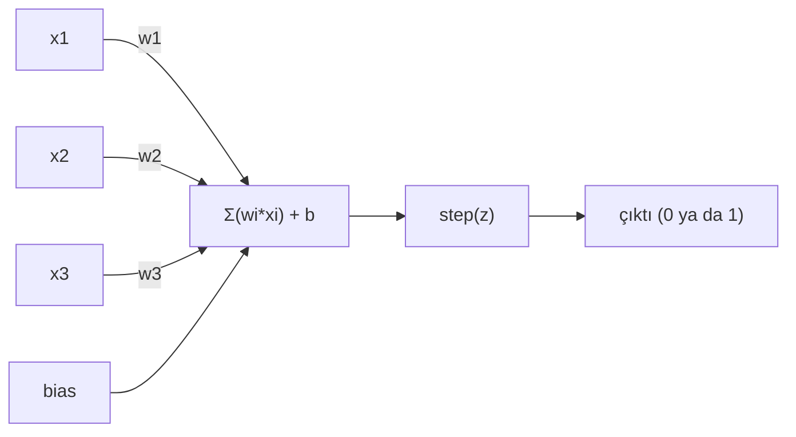
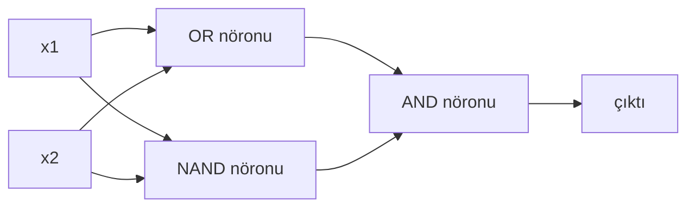

# Perceptron

> Perceptron, sinir ağlarının atomudur. Onu açtığında içinde ağırlıklar, bir bias ve bir karar bulursun.

**Tür:** Yapım
**Diller:** Python
**Ön koşullar:** Faz 1 (Lineer Cebir Sezgisi)
**Süre:** ~60 dakika

## Öğrenme Hedefleri

- Python'da sıfırdan bir perceptron uygula; ağırlık güncelleme kuralı ve step aktivasyon fonksiyonu dahil
- Tek bir perceptron'un neden yalnızca doğrusal olarak ayrılabilir problemleri çözebildiğini açıkla ve XOR başarısızlık vakasını göster
- OR, NAND ve AND kapılarını birleştirerek XOR'u çözen bir çok katmanlı perceptron kur
- Sigmoid aktivasyon ve backpropagation ile iki katmanlı bir ağı eğit; XOR'u otomatik olarak öğrensin

## Sorun

Vektörleri ve nokta çarpımlarını biliyorsun. Bir matrisin girişleri çıkışlara dönüştürdüğünü de biliyorsun. Peki bir makine hangi dönüşümü kullanması gerektiğini *nasıl* öğrenir?

Perceptron buna cevap verir. Mümkün olan en basit öğrenme makinesidir: birkaç giriş al, ağırlıklarla çarp, bir bias ekle ve ikili bir karar ver. Sonra ayarla. Hepsi bu. Şimdiye kadar inşa edilmiş her sinir ağı, bu fikrin üst üste yığılmış katmanlarıdır.

Perceptron'u anlamak, "öğrenmenin" kodda gerçekten ne anlama geldiğini anlamak demektir: çıktı gerçeğe uyana kadar sayıları ayarlamak.

## Kavram

### Bir Nöron, Bir Karar

Bir perceptron n giriş alır, her birini bir ağırlıkla çarpar, toplar, bir bias ekler ve sonucu bir aktivasyon fonksiyonundan geçirir.



Step fonksiyonu acımasızdır: ağırlıklı toplam artı bias >= 0 ise çıktı 1. Aksi halde 0.

```
step(z) = 1  eğer z >= 0
           0  eğer z < 0
```

Bu doğrusal bir sınıflandırıcıdır. Ağırlıklar ve bias, giriş uzayını iki bölgeye ayıran bir doğru (ya da daha yüksek boyutlarda hiperdüzlem) tanımlar.

### Karar Sınırı

İki giriş için, perceptron 2D uzayda bir doğru çizer:

```
  x2
  ┤
  │  Sınıf 1        /
  │    (0)          /
  │                /
  │               / w1·x1 + w2·x2 + b = 0
  │              /
  │             /     Sınıf 2
  │            /        (1)
  ┼───────────/──────────── x1
```

Doğrunun bir tarafındaki her şey 0 üretir. Diğer tarafındaki her şey 1 üretir. Eğitim, sınıfları doğru ayırana kadar bu doğruyu hareket ettirir.

### Öğrenme Kuralı

Perceptron öğrenme kuralı basittir:

```
Her eğitim örneği (x, y_true) için:
    y_pred = predict(x)
    error = y_true - y_pred

    Her ağırlık için:
        w_i = w_i + learning_rate * error * x_i
    bias = bias + learning_rate * error
```

Tahmin doğruysa, error = 0, hiçbir şey değişmez. 0 tahmin ederken 1 olması gerekiyorsa, ağırlıklar artar. 1 tahmin ederken 0 olması gerekiyorsa, ağırlıklar azalır. Learning rate, her ayarlamanın ne kadar büyük olacağını kontrol eder.

### XOR Problemi

İşte burada her şey çöker. Şu mantık kapılarına bak:

```
AND kapısı:         OR kapısı:          XOR kapısı:
x1  x2  out         x1  x2  out         x1  x2  out
0   0   0           0   0   0           0   0   0
0   1   0           0   1   1           0   1   1
1   0   0           1   0   1           1   0   1
1   1   1           1   1   1           1   1   0
```

AND ve OR doğrusal olarak ayrılabilir: 0'ları 1'lerden ayırmak için tek bir doğru çizebilirsin. XOR ayrılamaz. Hiçbir tek doğru [0,1] ve [1,0]'ı [0,0] ve [1,1]'den ayıramaz.

```
AND (ayrılabilir):      XOR (ayrılamaz):

  x2                      x2
  1 ┤  0     1            1 ┤  1     0
    │     /                 │
  0 ┤  0 / 0              0 ┤  0     1
    ┼──/──────── x1         ┼──────────── x1
       doğru işe yarar!     hiçbir doğru işe yaramaz!
```

Bu temel bir limittir. Tek bir perceptron yalnızca doğrusal olarak ayrılabilir problemleri çözebilir. Minsky ve Papert bunu 1969'da kanıtladı ve sinir ağı araştırmalarını on yıllığına neredeyse öldürdü.

Çözüm: perceptron'ları katmanlar halinde yığ. Bir çok katmanlı perceptron, iki doğrusal kararı doğrusal olmayan tek bir karara birleştirerek XOR'u çözebilir.

## İnşa Et

### Adım 1: Perceptron sınıfı

```python
class Perceptron:
    def __init__(self, n_inputs, learning_rate=0.1):
        self.weights = [0.0] * n_inputs
        self.bias = 0.0
        self.lr = learning_rate

    def predict(self, inputs):
        total = sum(w * x for w, x in zip(self.weights, inputs))
        total += self.bias
        return 1 if total >= 0 else 0

    def train(self, training_data, epochs=100):
        for epoch in range(epochs):
            errors = 0
            for inputs, target in training_data:
                prediction = self.predict(inputs)
                error = target - prediction
                if error != 0:
                    errors += 1
                    for i in range(len(self.weights)):
                        self.weights[i] += self.lr * error * inputs[i]
                    self.bias += self.lr * error
            if errors == 0:
                print(f"Epoch {epoch + 1}'de yakınsadı")
                return
        print(f"{epochs} epoch sonra yakınsamadı")
```

### Adım 2: Mantık kapılarında eğit

```python
and_data = [
    ([0, 0], 0),
    ([0, 1], 0),
    ([1, 0], 0),
    ([1, 1], 1),
]

or_data = [
    ([0, 0], 0),
    ([0, 1], 1),
    ([1, 0], 1),
    ([1, 1], 1),
]

not_data = [
    ([0], 1),
    ([1], 0),
]

print("=== AND Kapısı ===")
p_and = Perceptron(2)
p_and.train(and_data)
for inputs, _ in and_data:
    print(f"  {inputs} -> {p_and.predict(inputs)}")

print("\n=== OR Kapısı ===")
p_or = Perceptron(2)
p_or.train(or_data)
for inputs, _ in or_data:
    print(f"  {inputs} -> {p_or.predict(inputs)}")

print("\n=== NOT Kapısı ===")
p_not = Perceptron(1)
p_not.train(not_data)
for inputs, _ in not_data:
    print(f"  {inputs} -> {p_not.predict(inputs)}")
```

### Adım 3: XOR'un başarısız olmasını izle

```python
xor_data = [
    ([0, 0], 0),
    ([0, 1], 1),
    ([1, 0], 1),
    ([1, 1], 0),
]

print("\n=== XOR Kapısı (tek perceptron) ===")
p_xor = Perceptron(2)
p_xor.train(xor_data, epochs=1000)
for inputs, expected in xor_data:
    result = p_xor.predict(inputs)
    status = "OK" if result == expected else "YANLIŞ"
    print(f"  {inputs} -> {result} (beklenen {expected}) {status}")
```

Asla yakınsamayacak. Bu, tek bir perceptron'un XOR'u öğrenemeyeceğinin sert kanıtıdır.

### Adım 4: XOR'u iki katmanla çöz

İşin püf noktası: XOR = (x1 OR x2) AND NOT (x1 AND x2). Üç perceptron'u birleştir:



```python
def xor_network(x1, x2):
    or_neuron = Perceptron(2)
    or_neuron.weights = [1.0, 1.0]
    or_neuron.bias = -0.5

    nand_neuron = Perceptron(2)
    nand_neuron.weights = [-1.0, -1.0]
    nand_neuron.bias = 1.5

    and_neuron = Perceptron(2)
    and_neuron.weights = [1.0, 1.0]
    and_neuron.bias = -1.5

    hidden1 = or_neuron.predict([x1, x2])
    hidden2 = nand_neuron.predict([x1, x2])
    output = and_neuron.predict([hidden1, hidden2])
    return output


print("\n=== XOR Kapısı (çok katmanlı ağ) ===")
for inputs, expected in xor_data:
    result = xor_network(inputs[0], inputs[1])
    print(f"  {inputs} -> {result} (beklenen {expected})")
```

Dört vaka da doğru. Perceptron'ları katmanlar halinde yığmak, hiçbir tek perceptron'un üretemeyeceği karar sınırları yaratır.

### Adım 5: İki Katmanlı Bir Ağ Eğit

Adım 4 ağırlıkları elle yerleştirdi. Bu XOR için işe yarar, ama doğru ağırlıkları önceden bilmediğin gerçek problemler için yaramaz. Çözüm: step fonksiyonunu sigmoid ile değiştir ve ağırlıkları backpropagation ile otomatik olarak öğren.

```python
class TwoLayerNetwork:
    def __init__(self, learning_rate=0.5):
        import random
        random.seed(0)
        self.w_hidden = [[random.uniform(-1, 1), random.uniform(-1, 1)] for _ in range(2)]
        self.b_hidden = [random.uniform(-1, 1), random.uniform(-1, 1)]
        self.w_output = [random.uniform(-1, 1), random.uniform(-1, 1)]
        self.b_output = random.uniform(-1, 1)
        self.lr = learning_rate

    def sigmoid(self, x):
        import math
        x = max(-500, min(500, x))
        return 1.0 / (1.0 + math.exp(-x))

    def forward(self, inputs):
        self.inputs = inputs
        self.hidden_outputs = []
        for i in range(2):
            z = sum(w * x for w, x in zip(self.w_hidden[i], inputs)) + self.b_hidden[i]
            self.hidden_outputs.append(self.sigmoid(z))
        z_out = sum(w * h for w, h in zip(self.w_output, self.hidden_outputs)) + self.b_output
        self.output = self.sigmoid(z_out)
        return self.output

    def train(self, training_data, epochs=10000):
        for epoch in range(epochs):
            total_error = 0
            for inputs, target in training_data:
                output = self.forward(inputs)
                error = target - output
                total_error += error ** 2

                d_output = error * output * (1 - output)

                saved_w_output = self.w_output[:]
                hidden_deltas = []
                for i in range(2):
                    h = self.hidden_outputs[i]
                    hd = d_output * saved_w_output[i] * h * (1 - h)
                    hidden_deltas.append(hd)

                for i in range(2):
                    self.w_output[i] += self.lr * d_output * self.hidden_outputs[i]
                self.b_output += self.lr * d_output

                for i in range(2):
                    for j in range(len(inputs)):
                        self.w_hidden[i][j] += self.lr * hidden_deltas[i] * inputs[j]
                    self.b_hidden[i] += self.lr * hidden_deltas[i]
```

```python
net = TwoLayerNetwork(learning_rate=2.0)
net.train(xor_data, epochs=10000)
for inputs, expected in xor_data:
    result = net.forward(inputs)
    predicted = 1 if result >= 0.5 else 0
    print(f"  {inputs} -> {result:.4f} (yuvarlanmış: {predicted}, beklenen {expected})")
```

Adım 4'ten iki temel fark. Birincisi, sigmoid step fonksiyonunun yerini alır — pürüzsüzdür, yani gradyanlar mevcuttur. İkincisi, `train` metodu hatayı çıktıdan gizli katmana doğru geriye yayar ve her ağırlığı hataya olan katkısıyla orantılı olarak ayarlar. Bu 20 satırda backpropagation.

Bu, Ders 03'e köprüdür. `d_output` ve `hidden_deltas` arkasındaki matematik, ağ grafiğine uygulanan zincir kuralıdır. Orada düzgün şekilde türeteceğiz.

## Kullan

Sıfırdan inşa ettiğin her şey tek bir import içinde mevcut:

```python
from sklearn.linear_model import Perceptron as SkPerceptron
import numpy as np

X = np.array([[0,0],[0,1],[1,0],[1,1]])
y = np.array([0, 0, 0, 1])

clf = SkPerceptron(max_iter=100, tol=1e-3)
clf.fit(X, y)
print([clf.predict([x])[0] for x in X])
```

Beş satır. Senin 30 satırlık `Perceptron` sınıfın aynı şeyi yapıyor. sklearn versiyonu yakınsama kontrolleri, çoklu loss fonksiyonları ve seyrek giriş desteği ekler — ama temel döngü aynıdır: ağırlıklı toplam, step fonksiyonu, hatada ağırlık güncellemesi.

Asıl boşluk ölçekte ortaya çıkar. Üretim ağlarında neler değişir:

- Step fonksiyonu sigmoid, ReLU ya da diğer pürüzsüz aktivasyonlara dönüşür
- Ağırlıklar backpropagation ile otomatik olarak öğrenilir (Ders 03)
- Katmanlar derinleşir: 3, 10, 100+ katman
- Aynı prensip geçerlidir: her katman, önceki katmanın çıktılarından yeni özellikler yaratır

Tek bir perceptron yalnızca düz çizgiler çizebilir. Yığ onları ve herhangi bir şekil çizebilirsin.

## Yayınla

Bu ders şunu üretir:
- `outputs/skill-perceptron.md` - tek katmanlı vs çok katmanlı mimarilerin ne zaman gerekli olduğunu kapsayan bir skill

## Alıştırmalar

1. Bir NAND kapısı üzerinde bir perceptron eğit (evrensel kapı — herhangi bir mantık devresi NAND'lardan kurulabilir). Ağırlıkları ve bias'ının geçerli bir karar sınırı oluşturduğunu doğrula.
2. Perceptron sınıfını her epoch'ta karar sınırını (w1*x1 + w2*x2 + b = 0) takip edecek şekilde değiştir. AND kapısı üzerinde eğitim sırasında doğrunun nasıl kaydığını yazdır.
3. 3 girişinin en az 2'si 1 olduğunda 1 üreten bir 3 girişli perceptron kur (çoğunluk oyu fonksiyonu). Bu doğrusal olarak ayrılabilir mi? Neden?

## Anahtar Terimler

| Terim | İnsanlar ne diyor | Gerçekte ne anlama geliyor |
|------|----------------|----------------------|
| Perceptron | "Sahte bir nöron" | Bir doğrusal sınıflandırıcı: girişlerin ve ağırlıkların nokta çarpımı, artı bias, bir step fonksiyonundan geçirilmiş |
| Ağırlık | "Bir girişin ne kadar önemli olduğu" | Her girişin karara olan katkısını ölçekleyen bir çarpan |
| Bias | "Eşik" | Karar sınırını kaydıran bir sabit; perceptron'un sıfır girişlerle bile ateşlemesini sağlar |
| Aktivasyon fonksiyonu | "Değerleri sıkıştıran şey" | Ağırlıklı toplamdan sonra uygulanan bir fonksiyon — perceptron'lar için step fonksiyonu, modern ağlar için sigmoid/ReLU |
| Doğrusal olarak ayrılabilir | "Aralarına bir doğru çizebilirsin" | Tek bir hiperdüzlemin sınıfları mükemmel şekilde ayırabildiği bir veri seti |
| XOR problemi | "Perceptron'ların yapamadığı şey" | Tek katmanlı ağların doğrusal olarak ayrılamayan fonksiyonları öğrenemediğinin kanıtı |
| Karar sınırı | "Sınıflandırıcının değiştiği yer" | Giriş uzayını iki sınıfa bölen hiperdüzlem w*x + b = 0 |
| Çok katmanlı perceptron | "Gerçek bir sinir ağı" | Katmanlar halinde yığılmış perceptron'lar; her katmanın çıktısı bir sonraki katmanın girdisini besler |

## İleri Okuma

- Frank Rosenblatt, "The Perceptron: A Probabilistic Model for Information Storage and Organization in the Brain" (1958) — her şeyi başlatan orijinal makale
- Minsky & Papert, "Perceptrons" (1969) — XOR'un tek katmanlı ağlarla çözülemediğini kanıtlayan ve perceptron araştırmalarını on yıllığına öldüren kitap
- Michael Nielsen, "Neural Networks and Deep Learning", Bölüm 1 (http://neuralnetworksanddeeplearning.com/) — ücretsiz online, perceptron'ların ağlara nasıl birleştiğine dair en iyi görsel açıklama
