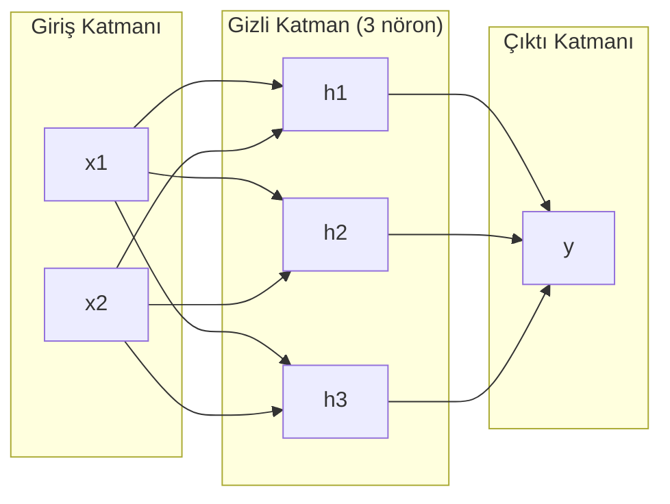
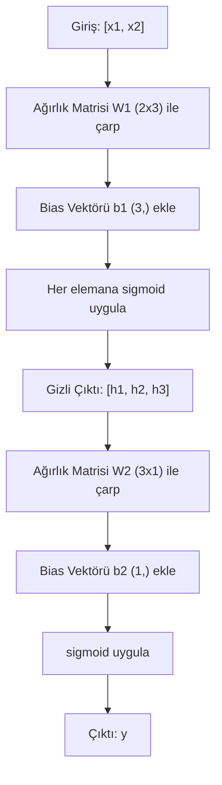
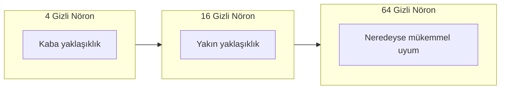

# Çok Katmanlı Ağlar ve Forward Pass

> Bir nöron bir doğru çizer. Onları yığ ve her şeyi çizebilirsin.

**Tür:** Yapım
**Diller:** Python
**Ön koşullar:** Faz 01 (Matematik Temelleri), Ders 03.01 (Perceptron)
**Süre:** ~90 dakika

## Öğrenme Hedefleri

- Sıfırdan, eksiksiz bir forward pass yapan Layer ve Network sınıflarıyla çok katmanlı bir ağ kur
- Bir ağın her katmanından geçen matris boyutlarını izle ve şekil uyumsuzluklarını tespit et
- Doğrusal olmayan aktivasyonları yığmanın, bir ağa eğri karar sınırlarını öğrenme yeteneği verdiğini açıkla
- Elle ayarlanmış sigmoid ağırlıklarla 2-2-1 mimarisini kullanarak XOR problemini çöz

## Sorun

Tek bir nöron, doğru çizicidir. Hepsi bu. Verinin içinden geçen tek bir düz doğru. Yapay zekada her gerçek problem — görüntü tanıma, dil anlama, Go oynama — eğri ister. Nöronları katmanlar halinde yığmak eğriyi nasıl elde ettiğindir.

1969'da Minsky ve Papert bu sınırlamanın öldürücü olduğunu kanıtladı: tek katmanlı bir ağ XOR'u öğrenemez. "Öğrenmekte zorlanır" değil — matematiksel olarak öğrenemez. XOR doğruluk tablosu [0,1] ve [1,0]'ı bir tarafa, [0,0] ve [1,1]'i diğer tarafa koyar. Hiçbir tek doğru onları ayırmaz.

Bu, sinir ağı finansmanını on yıldan fazla bir süre öldürdü. Çözüm sonradan bakınca açıktı: tek katman kullanmayı bırak. Nöronları katmanlar halinde yığ. İlk katmanın giriş uzayını yeni özelliklere oyduğunu, ikinci katmanın ise bu özellikleri tek bir doğrunun yapamayacağı kararlara birleştirdiğini bırak.

Bu yığın çok katmanlı ağdır. Bugün üretimdeki her deep learning modelinin temelidir. Forward pass — verinin girdiden gizli katmanlara, oradan çıktıya akması — başka hiçbir şey çalışmadan önce inşa etmen gereken ilk şeydir.

## Kavram

### Katmanlar: Giriş, Gizli, Çıktı

Bir çok katmanlı ağın üç katman tipi vardır:

**Giriş katmanı** — aslında bir katman değildir. Ham verini tutar. İki özellik iki giriş düğümü demektir. Burada hesaplama olmaz.

**Gizli katmanlar** — işin yapıldığı yer. Her nöron önceki katmanın her çıktısını alır, ağırlıkları ve bir bias uygular, sonra sonucu bir aktivasyon fonksiyonundan geçirir. "Gizli" çünkü bu değerleri eğitim verisinde doğrudan görmezsin.

**Çıktı katmanı** — nihai cevap. İkili sınıflandırma için, sigmoid ile bir nöron. Çok sınıflı için, sınıf başına bir nöron.



Bu bir 2-3-1 ağı. İki giriş, üç gizli nöron, bir çıktı. Her bağlantı bir ağırlık taşır. Her nöron (giriş hariç) bir bias taşır.

Her katman, gizli durum (hidden state) adı verilen bir sayı vektörü üretir. Metin için, gizli durumlar boyutu artırır — anlamsal anlamı yakalamak için bir kelimeyi 768 sayı olarak kodlar. Görüntüler için, boyutu azaltırlar — milyonlarca pikseli yönetilebilir bir temsile sıkıştırırlar. Öğrenmenin yaşadığı yer gizli durumdur.

### Nöronlar ve Aktivasyonlar

Her nöron üç şey yapar:

1. Her girişi karşılık gelen ağırlığıyla çarp
2. Tüm çarpımları topla ve bir bias ekle
3. Toplamı bir aktivasyon fonksiyonundan geçir

Şimdilik aktivasyon sigmoid:

```
sigmoid(z) = 1 / (1 + e^(-z))
```

Sigmoid her sayıyı (0, 1) aralığına sıkıştırır. Büyük pozitif girişler 1'e doğru iter. Büyük negatif girişler 0'a doğru iter. Sıfır 0.5'e eşlenir. Bu pürüzsüz eğri öğrenmeyi mümkün kılar — perceptron'un sert step'inin aksine, sigmoid'in her yerde bir gradyanı vardır.

### Forward Pass: Veri Nasıl Akar

Forward pass giriş verisini ağ boyunca, katman katman, çıktıya ulaşana kadar iter. Forward pass sırasında öğrenme olmaz. Saf hesaplamadır: çarp, topla, aktive et, tekrarla.



Her katmanda, sırayla üç işlem olur:

```
z = W * input + b       (doğrusal dönüşüm)
a = sigmoid(z)           (aktivasyon)
```

Bir katmanın çıktısı bir sonrakinin girdisi olur. İşte tüm forward pass.

### Matris Boyutları

Boyutları takip etmek deep learning'deki en önemli tek hata ayıklama becerisidir. İşte 2-3-1 ağı:

| Adım | İşlem | Boyutlar | Sonuç Şekli |
|------|-----------|------------|-------------|
| Giriş | x | -- | (2,) |
| Gizli doğrusal | W1 * x + b1 | W1: (3, 2), b1: (3,) | (3,) |
| Gizli aktivasyon | sigmoid(z1) | -- | (3,) |
| Çıktı doğrusal | W2 * h + b2 | W2: (1, 3), b2: (1,) | (1,) |
| Çıktı aktivasyon | sigmoid(z2) | -- | (1,) |

Kural: katman k'deki ağırlık matrisi W (neurons_in_layer_k, neurons_in_layer_k_minus_1) şekline sahiptir. Satırlar mevcut katmana karşılık gelir. Sütunlar önceki katmana karşılık gelir. Şekiller hizalanmıyorsa bir bug'ın var demektir.

### Evrensel Yakınsama Teoremi

1989'da George Cybenko olağanüstü bir şeyi kanıtladı: tek bir gizli katmana ve yeterli sayıda nörona sahip bir sinir ağı, herhangi bir sürekli fonksiyonu istenen herhangi bir doğrulukta yaklaştırabilir.

Bu, tek bir gizli katmanın her zaman en iyisi olduğu anlamına gelmez. Mimarinin teorik olarak yeterli olduğu anlamına gelir. Pratikte daha derin ağlar (daha fazla katman, katman başına daha az nöron), aynı fonksiyonları sığ-geniş ağlardan çok daha az toplam parametreyle öğrenir. Deep learning bu yüzden çalışır.

Sezgi: gizli katmandaki her nöron bir "tümsek" ya da özellik öğrenir. Doğru konumlara yerleştirilmiş yeterli tümsek herhangi bir pürüzsüz eğriyi yaklaştırabilir. Daha fazla nöron, daha fazla tümsek, daha iyi yaklaşıklık.



### Birleştirilebilirlik

Sinir ağları birleştirilebilir. Onları yığabilir, zincirleyebilir, paralel çalıştırabilirsin. Bir Whisper modeli sesi işlemek için bir encoder ağ ve metin üretmek için ayrı bir decoder ağ kullanır. Modern LLM'ler decoder-only'dir. BERT encoder-only'dir. T5 encoder-decoder'dır. Mimari seçimi, modelin ne yapabileceğini tanımlar.

## İnşa Et

Saf Python. numpy yok. Her matris işlemi sıfırdan yazıldı.

### Adım 1: Sigmoid Aktivasyon

```python
import math

def sigmoid(x):
    x = max(-500.0, min(500.0, x))
    return 1.0 / (1.0 + math.exp(-x))
```

[-500, 500]'e kelepçeleme overflow'u önler. `math.exp(500)` büyüktür ama sonludur. `math.exp(1000)` sonsuzdur.

### Adım 2: Layer Sınıfı

Tüm deep learning'deki en önemli işlem matris çarpımıdır. Her katman, her attention head, her forward pass — sonuna kadar matmul'dur. Bir doğrusal katman bir giriş vektörü alır, onu bir ağırlık matrisiyle çarpar ve bir bias vektörü ekler: y = Wx + b. Bu tek denklem bir sinir ağındaki hesaplamanın %90'ıdır.

Bir katman bir ağırlık matrisi ve bir bias vektörü tutar. Forward metodu bir giriş vektörü alır ve aktive edilmiş çıktıyı döndürür.

```python
class Layer:
    def __init__(self, n_inputs, n_neurons, weights=None, biases=None):
        if weights is not None:
            self.weights = weights
        else:
            import random
            self.weights = [
                [random.uniform(-1, 1) for _ in range(n_inputs)]
                for _ in range(n_neurons)
            ]
        if biases is not None:
            self.biases = biases
        else:
            self.biases = [0.0] * n_neurons

    def forward(self, inputs):
        self.last_input = inputs
        self.last_output = []
        for neuron_idx in range(len(self.weights)):
            z = sum(
                w * x for w, x in zip(self.weights[neuron_idx], inputs)
            )
            z += self.biases[neuron_idx]
            self.last_output.append(sigmoid(z))
        return self.last_output
```

Ağırlık matrisi (n_neurons, n_inputs) şekline sahiptir. Her satır, tüm girişlere karşılık gelen bir nöronun ağırlıklarıdır. Forward metodu nöronlar üzerinde döner, ağırlıklı toplam artı bias'ı hesaplar, sigmoid uygular ve sonuçları toplar.

### Adım 3: Network Sınıfı

Bir ağ, katmanlardan oluşan bir listedir. Forward pass onları zincirler: katman k'nin çıktısı katman k+1'e beslenir.

```python
class Network:
    def __init__(self, layers):
        self.layers = layers

    def forward(self, inputs):
        current = inputs
        for layer in self.layers:
            current = layer.forward(current)
        return current
```

İşte tüm forward pass. Dört satır mantık. Veri girer, her katmandan akar, diğer taraftan çıkar.

### Adım 4: Elle Ayarlanmış Ağırlıklarla XOR

Ders 01'de XOR'u OR, NAND ve AND perceptron'larını birleştirerek çözdük. Şimdi aynı şeyi Layer ve Network sınıflarımızla yap. 2-2-1 mimarisi: iki giriş, iki gizli nöron, bir çıktı.

```python
hidden = Layer(
    n_inputs=2,
    n_neurons=2,
    weights=[[20.0, 20.0], [-20.0, -20.0]],
    biases=[-10.0, 30.0],
)

output = Layer(
    n_inputs=2,
    n_neurons=1,
    weights=[[20.0, 20.0]],
    biases=[-30.0],
)

xor_net = Network([hidden, output])

xor_data = [
    ([0, 0], 0),
    ([0, 1], 1),
    ([1, 0], 1),
    ([1, 1], 0),
]

for inputs, expected in xor_data:
    result = xor_net.forward(inputs)
    predicted = 1 if result[0] >= 0.5 else 0
    print(f"  {inputs} -> {result[0]:.6f} (yuvarlanmış: {predicted}, beklenen: {expected})")
```

Büyük ağırlıklar (20, -20) sigmoid'i bir step fonksiyonu gibi davranmaya zorlar. İlk gizli nöron OR'a yaklaşır. İkincisi NAND'a yaklaşır. Çıktı nöronu onları AND'de birleştirir, ki bu XOR'dur.

### Adım 5: Çember Sınıflandırma

Daha zor bir problem: 2D noktaları, orijinde merkezlenmiş 0.5 yarıçaplı bir çemberin içinde ya da dışında olarak sınıflandır. Bu eğri bir karar sınırı gerektirir — tek bir perceptron için imkansız.

```python
import random
import math

random.seed(42)

data = []
for _ in range(200):
    x = random.uniform(-1, 1)
    y = random.uniform(-1, 1)
    label = 1 if (x * x + y * y) < 0.25 else 0
    data.append(([x, y], label))

circle_net = Network([
    Layer(n_inputs=2, n_neurons=8),
    Layer(n_inputs=8, n_neurons=1),
])
```

Rastgele ağırlıklarla ağ iyi sınıflandırma yapamayacak. Ama forward pass yine de çalışacak. Asıl mesele de bu — forward pass sadece hesaplamadır. Doğru ağırlıkları öğrenmek backpropagation'dır, Ders 03'te geliyor.

```python
correct = 0
for inputs, expected in data:
    result = circle_net.forward(inputs)
    predicted = 1 if result[0] >= 0.5 else 0
    if predicted == expected:
        correct += 1

print(f"Rastgele ağırlıklarla doğruluk: {correct}/{len(data)} ({100*correct/len(data):.1f}%)")
```

Rastgele ağırlıklar zayıf doğruluk verir — çoğu zaman çoğunluk sınıfını tahmin etmekten bile kötü. Eğitimden sonra (Ders 03), 8 gizli nöronlu aynı mimari, içeriyi dışarıdan ayıran eğri bir sınır çizecek.

## Kullan

PyTorch yukarıdaki her şeyi dört satırda yapar:

```python
import torch
import torch.nn as nn

model = nn.Sequential(
    nn.Linear(2, 8),
    nn.Sigmoid(),
    nn.Linear(8, 1),
    nn.Sigmoid(),
)

x = torch.tensor([[0.0, 0.0], [0.0, 1.0], [1.0, 0.0], [1.0, 1.0]])
output = model(x)
print(output)
```

`nn.Linear(2, 8)` senin Layer sınıfın: (8, 2) şeklinde ağırlık matrisi, (8,) şeklinde bias vektörü. `nn.Sigmoid()` eleman bazında uygulanan sigmoid fonksiyonun. `nn.Sequential` senin Network sınıfın: katmanları sırayla zincirler.

Fark hız ve ölçek. PyTorch GPU'larda çalışır, milyonlarca örnekten oluşan batch'leri işler ve backpropagation için gradyanları otomatik hesaplar. Ama forward pass mantığı sıfırdan inşa ettiğinle aynıdır.

## Yayınla

Bu ders, ağ mimarileri tasarlamak için yeniden kullanılabilir bir prompt üretir:

- `outputs/prompt-network-architect.md`

Belirli bir problem için kaç katman, katman başına kaç nöron ve hangi aktivasyon fonksiyonlarının kullanılacağına karar vermen gerektiğinde onu kullan.

## Alıştırmalar

1. Bir 2-4-2-1 ağı (iki gizli katman) kur ve rastgele ağırlıklarla XOR verisi üzerinde forward pass çalıştır. Her katmanda temsilin nasıl dönüştüğünü görmek için ara gizli katman çıktılarını yazdır.

2. Çember sınıflandırıcısındaki gizli katman boyutunu 8'den 2'ye, sonra 32'ye değiştir. Her seferinde rastgele ağırlıklarla forward pass çalıştır. Gizli nöron sayısı çıktı aralığını ya da dağılımını değiştiriyor mu? Neden?

3. Network sınıfına, eğitilebilir ağırlıkların ve bias'ların toplam sayısını döndüren bir `count_parameters` metodu uygula. Onu 784-256-128-10 ağı (klasik MNIST mimarisi) üzerinde test et. Kaç parametresi var?

4. Bir 3-4-4-2 ağı için forward pass kur. Onu RGB renk değerleriyle (0-1'e normalize edilmiş) besle ve iki çıktıyı gözlemle. Bu, iki sınıflı basit bir renk sınıflandırıcısının mimarisidir.

5. Sigmoid'i "leaky step" fonksiyonuyla değiştir: z < 0 ise 0.01 * z döndür, aksi halde 1.0 döndür. Adım 4'teki aynı elle ayarlanmış ağırlıklarla XOR üzerinde forward pass çalıştır. Hâlâ çalışıyor mu? Pürüzsüz sigmoid neden sert kesimlere tercih edilir?

## Anahtar Terimler

| Terim | İnsanlar ne diyor | Gerçekte ne anlama geliyor |
|------|----------------|----------------------|
| Forward pass | "Modeli çalıştırmak" | Girdiyi her katmana iterek — ağırlıklarla çarp, bias ekle, aktive et — bir çıktı üretmek |
| Gizli katman | "Ortadaki kısım" | Giriş ile çıktı arasındaki, değerleri doğrudan veride gözlemlenmeyen herhangi bir katman |
| Çok katmanlı ağ | "Bir derin sinir ağı" | Sırayla yığılmış nöron katmanları; her katmanın çıktısı bir sonrakinin girdisini besler |
| Aktivasyon fonksiyonu | "Doğrusal olmama" | Doğrusal dönüşümden sonra uygulanan, karar sınırına eğri katan bir fonksiyon |
| Sigmoid | "S eğrisi" | sigma(z) = 1/(1+e^(-z)), herhangi bir reel sayıyı (0,1)'e sıkıştırır, her yerde pürüzsüz ve türevlenebilirdir |
| Ağırlık matrisi | "Parametreler" | Öğrenilebilir bağlantı güçlerini içeren (current_layer_neurons, previous_layer_neurons) şeklinde W matrisi |
| Bias vektörü | "Ofset" | Matris çarpımından sonra eklenen, nöronların tüm girişler sıfır olsa bile aktive olmasına izin veren bir vektör |
| Evrensel yakınsama | "Sinir ağları her şeyi öğrenebilir" | Yeterli nörona sahip tek bir gizli katman herhangi bir sürekli fonksiyonu yaklaştırabilir — ama "yeterli" milyarlarca anlamına gelebilir |
| Doğrusal dönüşüm | "Matris çarpım adımı" | z = W * x + b, aktivasyondan önceki, girdileri yeni bir uzaya eşleyen hesaplama |
| Karar sınırı | "Sınıflandırıcının değiştiği yer" | Giriş uzayında ağ çıktısının sınıflandırma eşiğini geçtiği yüzey |

## İleri Okuma

- Michael Nielsen, "Neural Networks and Deep Learning", Bölüm 1-2 (http://neuralnetworksanddeeplearning.com/) — forward pass'ler ve ağ yapısının en net ücretsiz açıklaması, etkileşimli görselleştirmelerle
- Cybenko, "Approximation by Superpositions of a Sigmoidal Function" (1989) — orijinal evrensel yakınsama teoremi makalesi, şaşırtıcı derecede okunabilir
- 3Blue1Brown, "But what is a neural network?" (https://www.youtube.com/watch?v=aircAruvnKk) — doğru zihinsel modeli kuran, katmanlar, ağırlıklar ve forward pass'ler üzerine 20 dakikalık görsel anlatım
- Goodfellow, Bengio, Courville, "Deep Learning", Bölüm 6 (https://www.deeplearningbook.org/) — çok katmanlı ağlar için standart referans, ücretsiz online
