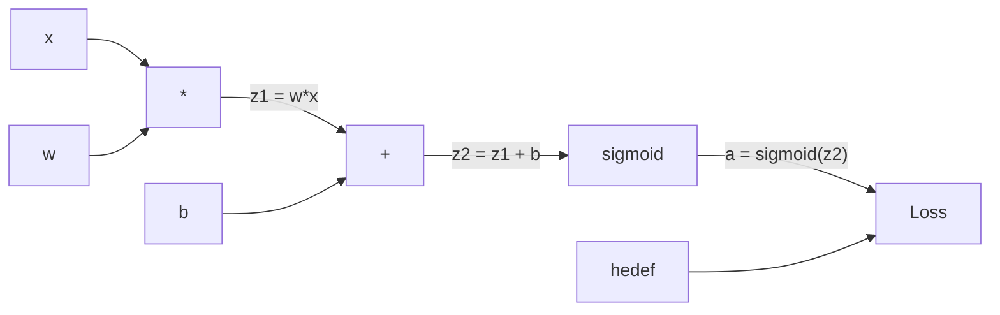
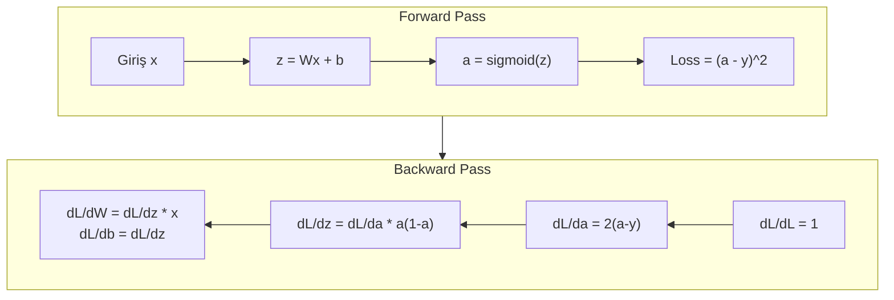
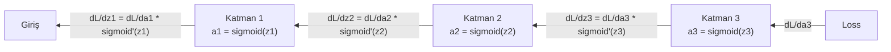

# Sıfırdan Backpropagation

> Backpropagation, öğrenmeyi mümkün kılan algoritmadır. O olmasa sinir ağları sadece pahalı rastgele sayı üreticileridir.

**Tür:** Yapım
**Diller:** Python
**Ön koşullar:** Ders 03.02 (Çok Katmanlı Ağlar)
**Süre:** ~120 dakika

## Öğrenme Hedefleri

- Bir computation graph kuran ve topolojik sıralama ile gradyanları hesaplayan Value tabanlı bir autograd motoru uygula
- Zincir kuralını kullanarak toplama, çarpma ve sigmoid için backward pass'i türet
- Yalnızca sıfırdan yazdığın backpropagation motorunu kullanarak çok katmanlı bir ağı XOR ve çember sınıflandırma üzerinde eğit
- Derin sigmoid ağlarda vanishing gradient problemini tespit et ve gradyanların neden üstel olarak küçüldüğünü açıkla

## Sorun

Ağında 768 girişli ve 3072 çıkışlı tek bir gizli katman var. Bu 2,359,296 ağırlık eder. Yanlış bir tahmin yaptı. Hangi ağırlıklar hataya sebep oldu? Her ağırlığı tek tek test etmek 2.3 milyon forward pass demek. Backpropagation tüm 2.3 milyon gradyanı tek bir backward pass'te hesaplar. Bu bir optimizasyon değil. Eğitilebilir ile imkansız arasındaki fark.

Naif yaklaşım: bir ağırlık al, onu küçük bir miktar kıpırdat, forward pass'i tekrar çalıştır, loss'un artıp azaldığını ölç. Bu sana o ağırlık için gradyanı verir. Şimdi ağdaki her ağırlık için yap. Binlerce eğitim adımı ve milyonlarca veri noktasıyla çarp. Faydalı bir şeyi eğitmek için jeolojik zamanlar gerekirdi.

Backpropagation bunu çözer. Bir forward pass, bir backward pass, tüm gradyanlar hesaplanmış. İşin püf noktası, bir computation graph'a sistematik olarak uygulanan kalkülüsten gelen zincir kuralıdır. Deep learning'i pratik hale getiren algoritma budur. O olmasa hâlâ oyuncak problemlerde takılı kalırdık.

## Kavram

### Zincir Kuralı, Ağlara Uygulanmış

Zincir kuralını Faz 01, Ders 05'te gördün. Hızlı özet: y = f(g(x)) ise, dy/dx = f'(g(x)) * g'(x). Zincir boyunca türevleri çarpıyorsun.

Bir sinir ağında "zincir", girdiden loss'a kadar olan işlem dizisidir. Her katman ağırlıkları uygular, bias'ları ekler, bir aktivasyondan geçirir. Loss fonksiyonu nihai çıktıyı hedefle karşılaştırır. Backpropagation bu zinciri geriye doğru izler ve her işlemin hataya nasıl katkıda bulunduğunu hesaplar.

### Computation Graph'lar

Her forward pass bir graph kurar. Her düğüm bir işlemdir (çarpma, toplama, sigmoid). Her kenar ileri yönde bir değer, geri yönde bir gradyan taşır.



Forward pass: değerler soldan sağa akar. x ve w z1 = w*x üretir. b'yi ekle, z2 elde et. Sigmoid aktivasyon a'yı verir. a'yı hedef y ile loss fonksiyonu kullanarak karşılaştır.

Backward pass: gradyanlar sağdan sola akar. dL/da ile başla (loss aktivasyonla nasıl değişir). da/dz2 ile çarp (sigmoid türevi). Bu sana dL/dz2'yi verir. dL/db'ye (z2 = z1 + b olduğundan dL/dz2'ye eşit) ve dL/dz1'e böl. Sonra dL/dw = dL/dz1 * x ve dL/dx = dL/dz1 * w.

Graph'taki her düğümün backward pass sırasında tek bir görevi vardır: yukarıdan gelen gradyanı al, yerel türeviyle çarp ve aşağıya geç.

### Forward vs Backward



Forward pass her ara değeri saklar: z, a, her katmanın girişleri. Backward pass gradyanları hesaplamak için bu saklı değerlere ihtiyaç duyar. Backprop'un kalbindeki bellek-hesaplama dengesi budur. Belleği (aktivasyonları saklamak) hız (milyonlarca yerine bir pass) için takas edersin.

### Bir Ağ İçinde Gradyan Akışı

3 katmanlı bir ağ için gradyanlar her katmanı zincirler:



Her katmanda gradyan sigmoid türeviyle çarpılır. Sigmoid türevi a * (1 - a)'dır ve maksimum 0.25'tir (a = 0.5 olduğunda). Üç katman derininde, gradyan en fazla 0.25^3 = 0.0156 ile çarpılmıştır. On katman derininde: 0.25^10 = 0.000001.

### Vanishing Gradient

Bu vanishing gradient problemidir. Sigmoid çıktısını 0 ile 1 arasında sıkıştırır. Türevi her zaman 0.25'ten küçüktür. Yeterince sigmoid katman yığ, gradyanlar hiçe iner. Erken katmanlar neredeyse hiç öğrenmez çünkü sıfıra yakın gradyanlar alırlar.

```
sigmoid(z):     Çıktı aralığı [0, 1]
sigmoid'(z):    Maks değer 0.25 (z = 0'da)

5 katman sonra:   gradyan * 0.25^5 = orijinalin 0.001 katı
10 katman sonra:  gradyan * 0.25^10 = orijinalin 0.000001 katı
```

Bu yüzden derin sigmoid ağlarını eğitmek neredeyse imkansızdır. Çözüm — ReLU ve varyantları — Ders 04'ün konusu. Şimdilik, backprop'un kusursuz çalıştığını anla. Sorun, üzerinde çalıştığı şeydedir.

### 2 Katmanlı Bir Ağ İçin Gradyanları Türetme

Girdi x, sigmoid ile gizli katman, sigmoid ile çıktı katmanı ve MSE loss'a sahip bir ağ için somut matematik.

Forward pass:
```
z1 = W1 * x + b1
a1 = sigmoid(z1)
z2 = W2 * a1 + b2
a2 = sigmoid(z2)
L = (a2 - y)^2
```

Backward pass (zincir kuralını adım adım uygulayarak):
```
dL/da2 = 2(a2 - y)
da2/dz2 = a2 * (1 - a2)
dL/dz2 = dL/da2 * da2/dz2 = 2(a2 - y) * a2 * (1 - a2)

dL/dW2 = dL/dz2 * a1
dL/db2 = dL/dz2

dL/da1 = dL/dz2 * W2
da1/dz1 = a1 * (1 - a1)
dL/dz1 = dL/da1 * da1/dz1

dL/dW1 = dL/dz1 * x
dL/db1 = dL/dz1
```

Her gradyan, loss'tan geriye izlenen yerel türevlerin çarpımıdır. Backpropagation'ın tamamı budur.

## İnşa Et

### Adım 1: Value Düğümü

Hesaplamamızdaki her sayı bir Value olur. Verisini, gradyanını ve nasıl yaratıldığını saklar (böylece gradyanları geri hesaplamayı bilir).

```python
class Value:
    def __init__(self, data, children=(), op=''):
        self.data = data
        self.grad = 0.0
        self._backward = lambda: None
        self._children = set(children)
        self._op = op

    def __repr__(self):
        return f"Value(data={self.data:.4f}, grad={self.grad:.4f})"
```

Henüz gradyan yok (0.0). Henüz backward fonksiyonu yok (no-op). `_children` bu Value'yu hangi Value'ların ürettiğini takip eder ki daha sonra graph'ı topolojik olarak sıralayabilelim.

### Adım 2: Backward Fonksiyonları Olan İşlemler

Her işlem yeni bir Value yaratır ve gradyanların onun içinden nasıl geriye akacağını tanımlar.

```python
def __add__(self, other):
    other = other if isinstance(other, Value) else Value(other)
    out = Value(self.data + other.data, (self, other), '+')

    def _backward():
        self.grad += out.grad
        other.grad += out.grad

    out._backward = _backward
    return out

def __mul__(self, other):
    other = other if isinstance(other, Value) else Value(other)
    out = Value(self.data * other.data, (self, other), '*')

    def _backward():
        self.grad += other.data * out.grad
        other.grad += self.data * out.grad

    out._backward = _backward
    return out
```

Toplama için: d(a+b)/da = 1, d(a+b)/db = 1. Yani her iki giriş de çıktının gradyanını doğrudan alır.

Çarpma için: d(a*b)/da = b, d(a*b)/db = a. Her giriş, diğerinin değerini çıktı gradyanıyla çarpılmış olarak alır.

`+=` kritiktir. Bir Value birden fazla işlemde kullanılmış olabilir. Gradyanı, tüm yollardan gelen gradyanların toplamıdır.

### Adım 3: Sigmoid ve Loss

```python
import math

def sigmoid(self):
    x = self.data
    x = max(-500, min(500, x))
    s = 1.0 / (1.0 + math.exp(-x))
    out = Value(s, (self,), 'sigmoid')

    def _backward():
        self.grad += (s * (1 - s)) * out.grad

    out._backward = _backward
    return out
```

Sigmoid türevi: sigmoid(x) * (1 - sigmoid(x)). Forward pass sırasında sigmoid(x) = s'yi hesapladık. Onu tekrar kullan. Ekstra iş yok.

```python
def mse_loss(predicted, target):
    diff = predicted + Value(-target)
    return diff * diff
```

Tek çıktı için MSE: (predicted - target)^2. Çıkarmayı, negatiflenmiş bir Value ile toplama olarak ifade ediyoruz.

### Adım 4: Backward Pass

Topolojik sıralama, düğümleri doğru sırayla işlememizi sağlar — bir düğümün gradyanı, içinden yayılmadan önce tamamen biriktirilir.

```python
def backward(self):
    topo = []
    visited = set()

    def build_topo(v):
        if v not in visited:
            visited.add(v)
            for child in v._children:
                build_topo(child)
            topo.append(v)

    build_topo(self)
    self.grad = 1.0
    for v in reversed(topo):
        v._backward()
```

Loss'tan başla (gradyan = 1.0, çünkü dL/dL = 1). Sıralı graph'ta geriye doğru yürü. Her düğümün `_backward`'ı gradyanları çocuklarına iter.

### Adım 5: Layer ve Network

```python
import random

class Neuron:
    def __init__(self, n_inputs):
        scale = (2.0 / n_inputs) ** 0.5
        self.weights = [Value(random.uniform(-scale, scale)) for _ in range(n_inputs)]
        self.bias = Value(0.0)

    def __call__(self, x):
        act = sum((wi * xi for wi, xi in zip(self.weights, x)), self.bias)
        return act.sigmoid()

    def parameters(self):
        return self.weights + [self.bias]


class Layer:
    def __init__(self, n_inputs, n_outputs):
        self.neurons = [Neuron(n_inputs) for _ in range(n_outputs)]

    def __call__(self, x):
        out = [n(x) for n in self.neurons]
        return out[0] if len(out) == 1 else out

    def parameters(self):
        params = []
        for n in self.neurons:
            params.extend(n.parameters())
        return params


class Network:
    def __init__(self, sizes):
        self.layers = []
        for i in range(len(sizes) - 1):
            self.layers.append(Layer(sizes[i], sizes[i + 1]))

    def __call__(self, x):
        for layer in self.layers:
            x = layer(x)
            if not isinstance(x, list):
                x = [x]
        return x[0] if len(x) == 1 else x

    def parameters(self):
        params = []
        for layer in self.layers:
            params.extend(layer.parameters())
        return params

    def zero_grad(self):
        for p in self.parameters():
            p.grad = 0.0
```

Bir Neuron girişleri alır, ağırlıklı toplam + bias hesaplar ve sigmoid uygular. Weight initialization, daha derin ağlarda sigmoid doygunluğunu önlemek için sqrt(2/n_inputs) ile ölçeklenir. Bir Layer, Neuron'lardan oluşan bir listedir. Bir Network, Layer'lardan oluşan bir listedir. `parameters()` metodu tüm öğrenilebilir Value'ları toplar ki onları güncelleyebilelim.

### Adım 6: XOR Üzerinde Eğit

```python
random.seed(42)
net = Network([2, 4, 1])

xor_data = [
    ([0.0, 0.0], 0.0),
    ([0.0, 1.0], 1.0),
    ([1.0, 0.0], 1.0),
    ([1.0, 1.0], 0.0),
]

learning_rate = 1.0

for epoch in range(1000):
    total_loss = Value(0.0)
    for inputs, target in xor_data:
        x = [Value(i) for i in inputs]
        pred = net(x)
        loss = mse_loss(pred, target)
        total_loss = total_loss + loss

    net.zero_grad()
    total_loss.backward()

    for p in net.parameters():
        p.data -= learning_rate * p.grad

    if epoch % 100 == 0:
        print(f"Epoch {epoch:4d} | Loss: {total_loss.data:.6f}")

print("\nXOR Sonuçları:")
for inputs, target in xor_data:
    x = [Value(i) for i in inputs]
    pred = net(x)
    print(f"  {inputs} -> {pred.data:.4f} (beklenen {target})")
```

Loss'un azaldığını izle. Rastgele tahminlerden doğru XOR çıktılarına kadar, tamamen gradyanları hesaplayan ve ağırlıkları doğru yönde kıpırdatan backpropagation tarafından yönetilir.

### Adım 7: Çember Sınıflandırma

Ders 02'de çember sınıflandırma için ağırlıkları elle ayarlamıştın. Şimdi onları ağa öğrenmesi için bırak.

```python
random.seed(7)

def generate_circle_data(n=100):
    data = []
    for _ in range(n):
        x1 = random.uniform(-1.5, 1.5)
        x2 = random.uniform(-1.5, 1.5)
        label = 1.0 if x1 * x1 + x2 * x2 < 1.0 else 0.0
        data.append(([x1, x2], label))
    return data

circle_data = generate_circle_data(80)

circle_net = Network([2, 8, 1])
learning_rate = 0.5

for epoch in range(2000):
    random.shuffle(circle_data)
    total_loss_val = 0.0
    for inputs, target in circle_data:
        x = [Value(i) for i in inputs]
        pred = circle_net(x)
        loss = mse_loss(pred, target)
        circle_net.zero_grad()
        loss.backward()
        for p in circle_net.parameters():
            p.data -= learning_rate * p.grad
        total_loss_val += loss.data

    if epoch % 200 == 0:
        correct = 0
        for inputs, target in circle_data:
            x = [Value(i) for i in inputs]
            pred = circle_net(x)
            predicted_class = 1.0 if pred.data > 0.5 else 0.0
            if predicted_class == target:
                correct += 1
        accuracy = correct / len(circle_data) * 100
        print(f"Epoch {epoch:4d} | Loss: {total_loss_val:.4f} | Doğruluk: {accuracy:.1f}%")
```

Burada online SGD kullanıyoruz — tüm batch'i biriktirmek yerine her örnekten sonra ağırlıkları güncelle. Bu simetriyi daha hızlı kırar ve tam loss manzarasında sigmoid doygunluğundan kaçınır. Verinin her epoch'ta karıştırılması, ağın sırayı ezberlemesini önler.

Elle ayarlama yok. Ağ çembersel karar sınırını kendi başına keşfeder. Backpropagation'ın gücü budur: mimariyi, loss fonksiyonunu ve veriyi tanımlarsın. Algoritma ağırlıkları çözer.

## Kullan

PyTorch yukarıdaki her şeyi birkaç satırda yapar. Temel fikir aynıdır — autograd forward pass sırasında bir computation graph kurar ve gradyanları hesaplamak için geriye doğru izler.

```python
import torch
import torch.nn as nn

model = nn.Sequential(
    nn.Linear(2, 4),
    nn.Sigmoid(),
    nn.Linear(4, 1),
    nn.Sigmoid(),
)
optimizer = torch.optim.SGD(model.parameters(), lr=1.0)
criterion = nn.MSELoss()

X = torch.tensor([[0,0],[0,1],[1,0],[1,1]], dtype=torch.float32)
y = torch.tensor([[0],[1],[1],[0]], dtype=torch.float32)

for epoch in range(1000):
    pred = model(X)
    loss = criterion(pred, y)
    optimizer.zero_grad()
    loss.backward()
    optimizer.step()

print("PyTorch XOR Sonuçları:")
with torch.no_grad():
    for i in range(4):
        pred = model(X[i])
        print(f"  {X[i].tolist()} -> {pred.item():.4f} (beklenen {y[i].item()})")
```

`loss.backward()` senin `total_loss.backward()`'ın. `optimizer.step()` senin manuel `p.data -= lr * p.grad`'ın. `optimizer.zero_grad()` senin `net.zero_grad()`'ın. Aynı algoritma, endüstriyel güçte uygulama. PyTorch GPU hızlandırmasını, karışık hassasiyeti, gradient checkpointing'i ve yüzlerce katman türünü yönetir. Ama backward pass, aynı computation graph'a uygulanan aynı zincir kuralıdır.

Eğitim forward pass'i, sonra backward pass'i, sonra ağırlıkları güncelleyişi çalıştırır. Çıkarım yalnızca forward pass'i çalıştırır. Gradyan yok, güncelleme yok. Bu ayrım önemlidir çünkü üretimde olan şey çıkarımdır. Claude ya da GPT gibi bir API çağırdığında çıkarım çalıştırıyorsundur — prompt'un ağ boyunca ileri akar ve diğer uçtan token'lar çıkar. Hiçbir ağırlık değişmez. Backprop'u anlamak önemlidir çünkü o ağdaki her ağırlığı o şekillendirdi.

## Yayınla

Bu ders şunu üretir:
- `outputs/prompt-gradient-debugger.md` — herhangi bir sinir ağındaki gradyan problemlerini (vanishing, exploding, NaN) teşhis etmek için yeniden kullanılabilir bir prompt

## Alıştırmalar

1. Value sınıfına bir `__sub__` metodu ekle (a - b = a + (-1 * b)). Sonra bir `__neg__` metodu uygula. (a - b)^2 gibi basit bir ifade için manuel hesapla karşılaştırarak gradyanların doğru olduğunu doğrula.

2. Value'ya bir `relu` metodu ekle (max(0, x) çıktısı, türev x > 0 ise 1, aksi halde 0). Gizli katmanlarda sigmoid'i relu ile değiştir ve XOR'da tekrar eğit. Yakınsama hızını karşılaştır. Daha hızlı eğitim görmelisin — bu Ders 04'ün önizlemesi.

3. Tam sayı kuvvetleri için Value'ya bir `__pow__` metodu uygula. `mse_loss`'u uygun bir `(predicted - target) ** 2` ifadesiyle değiştirmek için onu kullan. Gradyanların orijinal uygulamayla eşleştiğini doğrula.

4. Eğitim döngüsüne gradyan kırpma ekle: `backward()` çağrısından sonra tüm gradyanları [-1, 1]'e kırp. Daha derin bir ağ (sigmoid ile 4+ katman) eğit ve kırpma olan ve olmayan loss eğrilerini karşılaştır. Bu, exploding gradient'lere karşı ilk savunmandır.

5. Bir görselleştirme kur: XOR üzerinde eğitimden sonra, ağdaki her parametrenin gradyanını yazdır. En küçük gradyanlara sahip katmanı tespit et. Bu, Kavram bölümünde okuduğun vanishing gradient problemini gösterir.

## Anahtar Terimler

| Terim | İnsanlar ne diyor | Gerçekte ne anlama geliyor |
|------|----------------|----------------------|
| Backpropagation | "Ağ öğrenir" | Zincir kuralını computation graph içinden geriye uygulayarak her ağırlık için dL/dw hesaplayan algoritma |
| Computation graph | "Ağ yapısı" | Düğümlerin işlem olduğu ve kenarların değerleri (ileri) ve gradyanları (geri) taşıdığı yönlü asiklik graph |
| Zincir kuralı | "Türevleri çarp" | y = f(g(x)) ise, dy/dx = f'(g(x)) * g'(x) — backpropagation'ın matematiksel temeli |
| Gradyan | "En dik yönün yönü" | Loss'un bir parametreye göre kısmi türevi — loss'u azaltmak için o parametreyi nasıl değiştireceğini söyler |
| Vanishing gradient | "Derin ağlar öğrenmiyor" | Gradyanlar, sigmoid gibi doygunlaşan aktivasyonlu katmanlardan yayıldıkça üstel olarak küçülür |
| Forward pass | "Ağı çalıştırmak" | Girdilerden, her katmanın işlemlerini sırayla uygulayıp ara değerleri saklayarak çıktıyı hesaplama |
| Backward pass | "Gradyanları hesaplama" | Computation graph'ı tersten dolaşmak, zincir kuralını kullanarak her düğümde gradyanları biriktirmek |
| Learning rate | "Ne kadar hızlı öğrendiği" | Ağırlıkları güncellerken adım boyutunu kontrol eden bir skaler: w_new = w_old - lr * gradyan |
| Topolojik sıralama | "Doğru sıra" | Her düğümün, bağımlı olduğu tüm düğümlerden sonra geldiği bir graph düğüm sıralaması — gradyanların yayılmadan önce tamamen biriktirilmesini sağlar |
| Autograd | "Otomatik türev alma" | Forward hesaplama sırasında computation graph'lar kurup gradyanları otomatik olarak hesaplayan bir sistem — PyTorch motorunun yaptığı şey |

## İleri Okuma

- Rumelhart, Hinton & Williams, "Learning representations by back-propagating errors" (1986) — backpropagation'ı yaygınlaştıran ve çok katmanlı ağ eğitimini açan makale
- 3Blue1Brown, "Neural Networks" serisi (https://www.youtube.com/playlist?list=PLZHQObOWTQDNU6R1_67000Dx_ZCJB-3pi) — backpropagation ve ağlar arası gradyan akışı üzerine en iyi görsel açıklama
