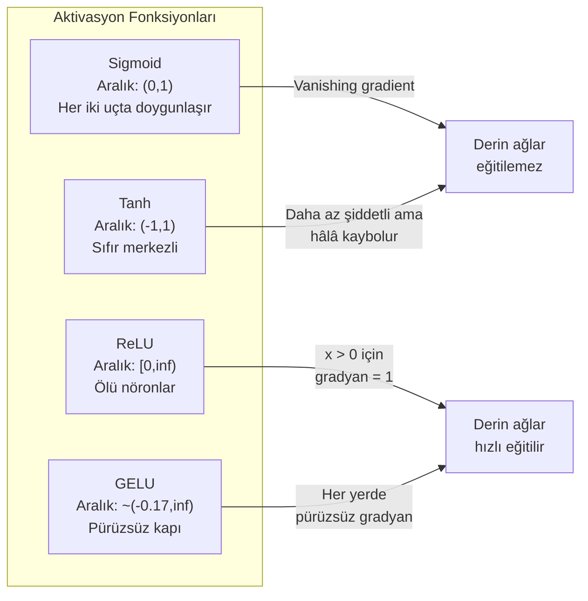
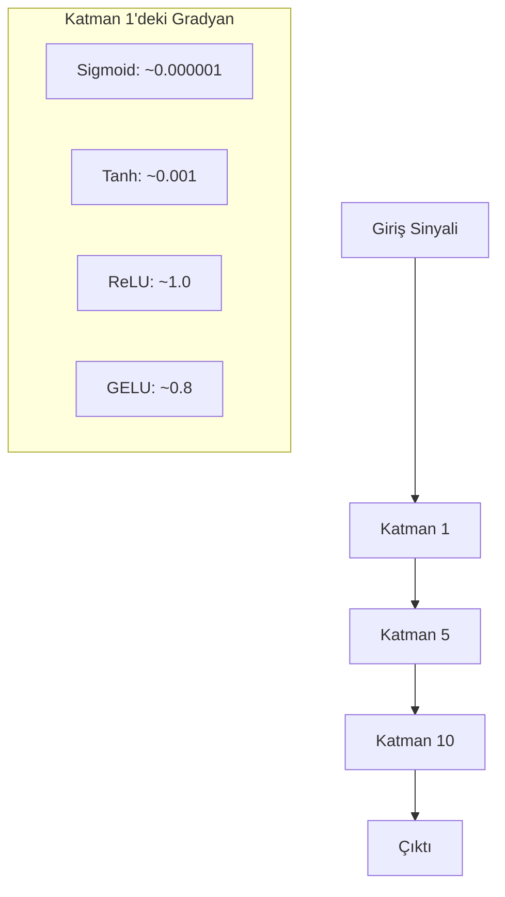
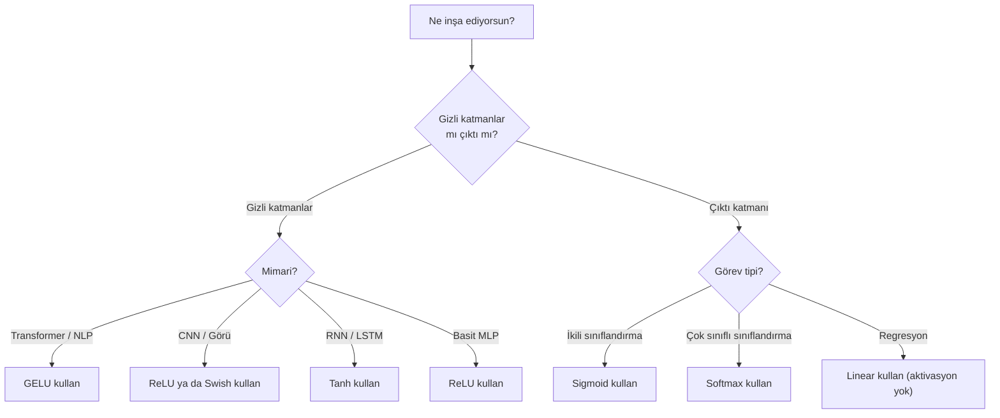

# Aktivasyon Fonksiyonları

> Doğrusal olmama olmadan, 100 katmanlı ağın süslü bir matris çarpımıdır. Aktivasyonlar, sinir ağlarının eğrilerle düşünmesini sağlayan kapılardır.

**Tür:** Yapım
**Diller:** Python
**Ön koşullar:** Ders 03.03 (Backpropagation)
**Süre:** ~75 dakika

## Öğrenme Hedefleri

- sigmoid, tanh, ReLU, Leaky ReLU, GELU, Swish ve softmax'i türevleriyle birlikte sıfırdan uygula
- 10+ katmandan farklı aktivasyonlarla aktivasyon büyüklüklerini ölçerek vanishing gradient problemini teşhis et
- Bir ReLU ağında ölü nöronları tespit et ve GELU'nun bu başarısızlık modundan neden kaçındığını açıkla
- Belirli bir mimari için (transformer, CNN, RNN, çıktı katmanı) doğru aktivasyon fonksiyonunu seç

## Sorun

İki doğrusal dönüşümü yığ: y = W2(W1x + b1) + b2. Aç: y = W2W1x + W2b1 + b2. Bu sadece y = Ax + c — tek bir doğrusal dönüşüm. Kaç doğrusal katman yığarsan yığ, sonuç tek bir matris çarpımına çöker. 100 katmanlı ağının tek bir katmanla aynı temsil gücü vardır.

Bu teorik bir merak konusu değil. Derin bir doğrusal ağın gerçekten XOR'u öğrenemediği, sarmal veri setini sınıflandıramadığı, bir yüzü tanıyamadığı anlamına gelir. Aktivasyon fonksiyonları olmadan derinlik bir yanılsamadır.

Aktivasyon fonksiyonları doğrusallığı kırar. Her katmanın çıktısını doğrusal olmayan bir fonksiyonla büker ve ağa karar sınırlarını eğme, keyfi fonksiyonları yaklaştırma ve gerçekten öğrenme yeteneği verir. Ama yanlış aktivasyonu seç, gradyanların sıfıra iner (derin ağlarda sigmoid), sonsuza patlar (dikkatli initialization olmadan sınırsız aktivasyonlar) ya da nöronların kalıcı olarak ölür (büyük negatif bias'larla ReLU). Aktivasyon fonksiyonu seçimi, ağının öğrenip öğrenmeyeceğini doğrudan belirler.

## Kavram

### Doğrusal Olmama Neden Gerekli

Matris çarpımı birleştirilebilirdir. Bir vektörü matris A ile sonra matris B ile çarpmak, AB ile çarpmakla aynıdır. Bu, on doğrusal katmanı yığmanın matematiksel olarak büyük bir matrisli tek bir doğrusal katmana eşdeğer olduğu anlamına gelir. O kadar parametre, o kadar derinlik — boşa. Zinciri kırmak için bir şeye ihtiyacın var. Aktivasyon fonksiyonlarının yaptığı budur.

İşte kanıtı. Bir doğrusal katman f(x) = Wx + b hesaplar. İki tane yığ:

```
Katman 1: h = W1 * x + b1
Katman 2: y = W2 * h + b2
```

Yerine koy:

```
y = W2 * (W1 * x + b1) + b2
y = (W2 * W1) * x + (W2 * b1 + b2)
y = A * x + c
```

Tek katman. Katmanların arasına doğrusal olmayan bir aktivasyon g() ekle:

```
h = g(W1 * x + b1)
y = W2 * h + b2
```

Şimdi yerine koyma bozulur. W2 * g(W1 * x + b1) + b2 tek bir doğrusal dönüşüme indirgenemez. Ağ, doğrusal olmayan fonksiyonları temsil edebilir. Aktivasyonlu her ek katman temsil kapasitesi ekler.

### Sigmoid

Sinir ağları için orijinal aktivasyon fonksiyonu.

```
sigmoid(x) = 1 / (1 + e^(-x))
```

Çıktı aralığı: (0, 1). Pürüzsüz, türevlenebilir, herhangi bir reel sayıyı olasılık benzeri bir değere eşler.

Türevi:

```
sigmoid'(x) = sigmoid(x) * (1 - sigmoid(x))
```

Bu türevin maksimum değeri 0.25'tir ve x = 0'da gerçekleşir. Backpropagation'da gradyanlar katmanlar boyunca çarpılır. On sigmoid katmanı, gradyanın en fazla on kez 0.25 ile çarpılması demektir:

```
0.25^10 = 0.000000953674
```

Orijinal sinyalin milyonda birinden az. Bu vanishing gradient problemidir. Erken katmanlardaki gradyanlar o kadar küçülür ki ağırlıklar neredeyse hiç güncellenmez. Ağ öğreniyor gibi görünür — sonraki katmanlarda loss azalır — ama ilk katmanlar donmuştur. Derin sigmoid ağları basitçe eğitilemez.

Ek problem: sigmoid çıktıları her zaman pozitiftir (0 ile 1 arasında), yani ağırlıklardaki gradyanlar her zaman aynı işarettedir. Bu, gradient descent sırasında zig-zag yapmaya neden olur.

### Tanh

Sigmoid'in merkezlenmiş versiyonu.

```
tanh(x) = (e^x - e^(-x)) / (e^x + e^(-x))
```

Çıktı aralığı: (-1, 1). Sıfır merkezli, bu da zig-zag problemini ortadan kaldırır.

Türevi:

```
tanh'(x) = 1 - tanh(x)^2
```

Maksimum türev x = 0'da 1.0 — sigmoid'den dört kat daha iyi. Ama vanishing gradient problemi hâlâ vardır. Büyük pozitif ya da negatif girdiler için türev sıfıra yaklaşır. On katman hâlâ gradyanı ezer, sadece daha az agresif olarak.

### ReLU: Atılım

Rectified Linear Unit. 2010'da Nair ve Hinton tarafından deep learning için popülerleştirildi (fonksiyonun kendisi Fukushima'nın 1969 çalışmasına dayanır), her şeyi değiştirdi.

```
relu(x) = max(0, x)
```

Çıktı aralığı: [0, sonsuz). Türev son derece basittir:

```
relu'(x) = 1  eğer x > 0
            0  eğer x <= 0
```

Pozitif girdiler için vanishing gradient yok. Gradyan tam olarak 1'dir, doğrudan geçirilir. Derin ağların eğitilebilir olmasının nedeni budur — ReLU katmanlar arasında gradyan büyüklüğünü korur.

Ama bir başarısızlık modu var: ölü nöron problemi. Bir nöronun ağırlıklı girdisi her zaman negatifse (büyük negatif bir bias ya da talihsiz bir weight initialization nedeniyle), çıktısı her zaman sıfır, gradyanı her zaman sıfırdır ve asla güncellenmez. Kalıcı olarak ölüdür. Pratikte, bir ReLU ağındaki nöronların %10-40'ı eğitim sırasında ölebilir.

### Leaky ReLU

Ölü nöronlar için en basit çözüm.

```
leaky_relu(x) = x        eğer x > 0
                alpha * x eğer x <= 0
```

Burada alpha küçük bir sabittir, tipik olarak 0.01. Negatif tarafın sıfır yerine küçük bir eğimi vardır, böylece ölü nöronlar yine de gradyan sinyali alır ve toparlanabilir.

### GELU: Modern Varsayılan

Gaussian Error Linear Unit. Hendrycks ve Gimpel tarafından 2016'da tanıtıldı. BERT, GPT ve çoğu modern transformer'da varsayılan aktivasyon.

```
gelu(x) = x * Phi(x)
```

Burada Phi(x) standart normal dağılımın kümülatif dağılım fonksiyonudur. Pratikte kullanılan yaklaşıklık:

```
gelu(x) ~= 0.5 * x * (1 + tanh(sqrt(2/pi) * (x + 0.044715 * x^3)))
```

GELU her yerde pürüzsüzdür, küçük negatif değerlere izin verir (sıfıra sert kırpan ReLU'nun aksine) ve olasılıksal bir yorumu vardır: her girdiyi, Gauss dağılımı altında pozitif olma olasılığına göre ağırlıklandırır. Bu pürüzsüz kapı, daha iyi gradyan akışı sağladığı ve ölü nöron probleminden tamamen kaçındığı için transformer mimarilerinde ReLU'dan daha iyi performans gösterir.

### Swish / SiLU

Ramachandran ve diğerleri tarafından 2017'de otomatik arama yoluyla keşfedilen kendi kendine kapılı aktivasyon.

```
swish(x) = x * sigmoid(x)
```

Swish resmi olarak x * sigmoid(x)'tir. Google onu aktivasyon fonksiyonu uzayında otomatik arama yoluyla keşfetti — sinir ağı parçaları tasarlayan bir sinir ağı.

GELU gibi pürüzsüzdür, monoton değildir ve küçük negatif değerlere izin verir. Fark inceliklidir: Swish kapılama için sigmoid kullanırken GELU Gauss CDF'sini kullanır. Pratikte performans neredeyse aynıdır. Swish EfficientNet ve bazı görü modellerinde kullanılır. GELU dil modellerinde baskındır.

### Softmax: Çıktı Aktivasyonu

Gizli katmanlarda kullanılmaz. Softmax bir ham skor vektörünü (logit'ler) bir olasılık dağılımına dönüştürür.

```
softmax(x_i) = e^(x_i) / sum(e^(x_j) for all j)
```

Her çıktı 0 ile 1 arasındadır. Tüm çıktılar 1'e toplanır. Bu onu çok sınıflı sınıflandırma için standart son aktivasyon yapar. En büyük logit en yüksek olasılığı alır, ama argmax'tan farklı olarak softmax türevlenebilirdir ve göreceli güven hakkında bilgiyi korur.

### Şekillerin Karşılaştırması



### Gradyan Akışı Karşılaştırması



### Hangi Aktivasyon Ne Zaman



## İnşa Et

### Adım 1: Tüm Aktivasyon Fonksiyonlarını Türevleriyle Uygula

Her fonksiyon tek bir float alır ve bir float döndürür. Her türev fonksiyonu aynı girişi alır ve gradyanı döndürür.

```python
import math

def sigmoid(x):
    x = max(-500, min(500, x))
    return 1.0 / (1.0 + math.exp(-x))

def sigmoid_derivative(x):
    s = sigmoid(x)
    return s * (1 - s)

def tanh_act(x):
    return math.tanh(x)

def tanh_derivative(x):
    t = math.tanh(x)
    return 1 - t * t

def relu(x):
    return max(0.0, x)

def relu_derivative(x):
    return 1.0 if x > 0 else 0.0

def leaky_relu(x, alpha=0.01):
    return x if x > 0 else alpha * x

def leaky_relu_derivative(x, alpha=0.01):
    return 1.0 if x > 0 else alpha

def gelu(x):
    return 0.5 * x * (1 + math.tanh(math.sqrt(2 / math.pi) * (x + 0.044715 * x ** 3)))

def gelu_derivative(x):
    phi = 0.5 * (1 + math.erf(x / math.sqrt(2)))
    pdf = math.exp(-0.5 * x * x) / math.sqrt(2 * math.pi)
    return phi + x * pdf

def swish(x):
    return x * sigmoid(x)

def swish_derivative(x):
    s = sigmoid(x)
    return s + x * s * (1 - s)

def softmax(xs):
    max_x = max(xs)
    exps = [math.exp(x - max_x) for x in xs]
    total = sum(exps)
    return [e / total for e in exps]
```

### Adım 2: Gradyanların Nerede Öldüğünü Görselleştir

-5'ten 5'e 100 eşit aralıklı noktada gradyanı hesapla. Her aktivasyonun gradyanının sıfıra yakın olduğu yeri gösteren bir metin histogramı yazdır.

```python
def gradient_scan(name, derivative_fn, start=-5, end=5, n=100):
    step = (end - start) / n
    near_zero = 0
    healthy = 0
    for i in range(n):
        x = start + i * step
        g = derivative_fn(x)
        if abs(g) < 0.01:
            near_zero += 1
        else:
            healthy += 1
    pct_dead = near_zero / n * 100
    print(f"{name:15s}: {healthy:3d} sağlıklı, {near_zero:3d} sıfıra yakın (%{pct_dead:.0f} ölü bölge)")

gradient_scan("Sigmoid", sigmoid_derivative)
gradient_scan("Tanh", tanh_derivative)
gradient_scan("ReLU", relu_derivative)
gradient_scan("Leaky ReLU", leaky_relu_derivative)
gradient_scan("GELU", gelu_derivative)
gradient_scan("Swish", swish_derivative)
```

### Adım 3: Vanishing Gradient Deneyi

Sigmoid vs ReLU kullanarak bir sinyali N katman boyunca forward-pass et. Aktivasyon büyüklüğünün nasıl değiştiğini ölç.

```python
import random

def vanishing_gradient_experiment(activation_fn, name, n_layers=10, n_inputs=5):
    random.seed(42)
    values = [random.gauss(0, 1) for _ in range(n_inputs)]

    print(f"\n{name} {n_layers} katmandan geçiyor:")
    for layer in range(n_layers):
        weights = [random.gauss(0, 1) for _ in range(n_inputs)]
        z = sum(w * v for w, v in zip(weights, values))
        activated = activation_fn(z)
        magnitude = abs(activated)
        bar = "#" * int(magnitude * 20)
        print(f"  Katman {layer+1:2d}: büyüklük = {magnitude:.6f} {bar}")
        values = [activated] * n_inputs

vanishing_gradient_experiment(sigmoid, "Sigmoid")
vanishing_gradient_experiment(relu, "ReLU")
vanishing_gradient_experiment(gelu, "GELU")
```

### Adım 4: Ölü Nöron Tespitçisi

Bir ReLU ağı yarat, içinden rastgele girişler geçir, kaç nöronun hiç ateşlemediğini say.

```python
def dead_neuron_detector(n_inputs=5, hidden_size=20, n_samples=1000):
    random.seed(0)
    weights = [[random.gauss(0, 1) for _ in range(n_inputs)] for _ in range(hidden_size)]
    biases = [random.gauss(0, 1) for _ in range(hidden_size)]

    fire_counts = [0] * hidden_size

    for _ in range(n_samples):
        inputs = [random.gauss(0, 1) for _ in range(n_inputs)]
        for neuron_idx in range(hidden_size):
            z = sum(w * x for w, x in zip(weights[neuron_idx], inputs)) + biases[neuron_idx]
            if relu(z) > 0:
                fire_counts[neuron_idx] += 1

    dead = sum(1 for c in fire_counts if c == 0)
    rarely_fire = sum(1 for c in fire_counts if 0 < c < n_samples * 0.05)
    healthy = hidden_size - dead - rarely_fire

    print(f"\nÖlü Nöron Raporu ({hidden_size} nöron, {n_samples} örnek):")
    print(f"  Ölü (hiç ateşlemedi):   {dead}")
    print(f"  Zar zor canlı (<%5):    {rarely_fire}")
    print(f"  Sağlıklı:                {healthy}")
    print(f"  Ölü nöron oranı:        %{dead/hidden_size*100:.1f}")

    for i, c in enumerate(fire_counts):
        status = "ÖLÜ" if c == 0 else "ZAYIF" if c < n_samples * 0.05 else "OK"
        bar = "#" * (c * 40 // n_samples)
        print(f"  Nöron {i:2d}: {c:4d}/{n_samples} ateşleme [{status:4s}] {bar}")

dead_neuron_detector()
```

### Adım 5: Eğitim Karşılaştırması — Sigmoid vs ReLU vs GELU

Aynı iki katmanlı ağı, üç farklı aktivasyonla çember veri setinde (çember içindeki noktalar = sınıf 1, dışındakiler = sınıf 0) eğit. Yakınsama hızını karşılaştır.

```python
def make_circle_data(n=200, seed=42):
    random.seed(seed)
    data = []
    for _ in range(n):
        x = random.uniform(-2, 2)
        y = random.uniform(-2, 2)
        label = 1.0 if x * x + y * y < 1.5 else 0.0
        data.append(([x, y], label))
    return data


class ActivationNetwork:
    def __init__(self, activation_fn, activation_deriv, hidden_size=8, lr=0.1):
        random.seed(0)
        self.act = activation_fn
        self.act_d = activation_deriv
        self.lr = lr
        self.hidden_size = hidden_size

        self.w1 = [[random.gauss(0, 0.5) for _ in range(2)] for _ in range(hidden_size)]
        self.b1 = [0.0] * hidden_size
        self.w2 = [random.gauss(0, 0.5) for _ in range(hidden_size)]
        self.b2 = 0.0

    def forward(self, x):
        self.x = x
        self.z1 = []
        self.h = []
        for i in range(self.hidden_size):
            z = self.w1[i][0] * x[0] + self.w1[i][1] * x[1] + self.b1[i]
            self.z1.append(z)
            self.h.append(self.act(z))

        self.z2 = sum(self.w2[i] * self.h[i] for i in range(self.hidden_size)) + self.b2
        self.out = sigmoid(self.z2)
        return self.out

    def backward(self, target):
        error = self.out - target
        d_out = error * self.out * (1 - self.out)

        for i in range(self.hidden_size):
            d_h = d_out * self.w2[i] * self.act_d(self.z1[i])
            self.w2[i] -= self.lr * d_out * self.h[i]
            for j in range(2):
                self.w1[i][j] -= self.lr * d_h * self.x[j]
            self.b1[i] -= self.lr * d_h
        self.b2 -= self.lr * d_out

    def train(self, data, epochs=200):
        losses = []
        for epoch in range(epochs):
            total_loss = 0
            correct = 0
            for x, y in data:
                pred = self.forward(x)
                self.backward(y)
                total_loss += (pred - y) ** 2
                if (pred >= 0.5) == (y >= 0.5):
                    correct += 1
            avg_loss = total_loss / len(data)
            accuracy = correct / len(data) * 100
            losses.append(avg_loss)
            if epoch % 50 == 0 or epoch == epochs - 1:
                print(f"    Epoch {epoch:3d}: loss={avg_loss:.4f}, doğruluk=%{accuracy:.1f}")
        return losses


data = make_circle_data()

configs = [
    ("Sigmoid", sigmoid, sigmoid_derivative),
    ("ReLU", relu, relu_derivative),
    ("GELU", gelu, gelu_derivative),
]

results = {}
for name, act_fn, act_d_fn in configs:
    print(f"\n=== {name} ile Eğitim ===")
    net = ActivationNetwork(act_fn, act_d_fn, hidden_size=8, lr=0.1)
    losses = net.train(data, epochs=200)
    results[name] = losses

print("\n=== Final Loss Karşılaştırması ===")
for name, losses in results.items():
    print(f"  {name:10s}: başlangıç={losses[0]:.4f} -> son={losses[-1]:.4f} (iyileşme: %{(1 - losses[-1]/losses[0])*100:.1f})")
```

## Kullan

PyTorch bunların hepsini hem fonksiyonel hem de modül formunda sunar:

```python
import torch
import torch.nn as nn
import torch.nn.functional as F

x = torch.randn(4, 10)

relu_out = F.relu(x)
gelu_out = F.gelu(x)
sigmoid_out = torch.sigmoid(x)
swish_out = F.silu(x)

logits = torch.randn(4, 5)
probs = F.softmax(logits, dim=1)

model = nn.Sequential(
    nn.Linear(10, 64),
    nn.GELU(),
    nn.Linear(64, 32),
    nn.GELU(),
    nn.Linear(32, 5),
)
```

Bir transformer'da gizli katmanlar: GELU. Bir CNN'de gizli katmanlar: ReLU. Sınıflandırma için çıktı katmanı: softmax. Regresyon için çıktı katmanı: yok (linear). Olasılıklar için çıktı katmanı: sigmoid. Hepsi bu. Bu varsayılanlarla başla. Yalnızca kanıtın olduğunda onları değiştir.

RNN'ler ve LSTM'ler gizli durum için tanh ve kapılar için sigmoid kullanırlar, ama bugün sıfırdan inşa ediyorsan muhtemelen RNN kullanmıyorsundur. ReLU ağında nöronlar ölüyorsa GELU'ya geç. Özel bir nedenin olmadıkça Leaky ReLU'ya uzanma — GELU ölü nöron problemini çözer ve daha iyi gradyan akışı verir.

## Yayınla

Bu ders şunu üretir:
- `outputs/prompt-activation-selector.md` — herhangi bir mimari için doğru aktivasyon fonksiyonunu seçmene yardım eden yeniden kullanılabilir bir prompt

## Alıştırmalar

1. Negatif eğim alpha'nın öğrenilebilir bir parametre olduğu Parametric ReLU (PReLU)'yu uygula. Onu çember veri setinde eğit ve sabit Leaky ReLU ile karşılaştır.

2. Vanishing gradient deneyini 10 yerine 50 katmanla çalıştır. Sigmoid, tanh, ReLU ve GELU için her katmandaki büyüklüğü çiz. Her aktivasyonun sinyali hangi katmanda etkili biçimde sıfıra ulaşıyor?

3. ELU (Exponential Linear Unit)'yu uygula: elu(x) = x eğer x > 0, alpha * (e^x - 1) eğer x <= 0. Aynı ağda ölü nöron oranını ReLU ile karşılaştır.

4. Eğitim sırasında çalışan bir "gradyan sağlık monitörü" kur: her epoch'ta her katmandaki ortalama gradyan büyüklüğünü hesapla. Herhangi bir katmanın gradyanı 0.001'in altına düştüğünde ya da 100'ü aştığında uyarı yazdır.

5. Eğitim karşılaştırmasını çember yerine Ders 01'deki XOR veri setini kullanacak şekilde değiştir. XOR'da hangi aktivasyon en hızlı yakınsar? Bu çember sonuçlarından neden farklı?

## Anahtar Terimler

| Terim | İnsanlar ne diyor | Gerçekte ne anlama geliyor |
|------|----------------|----------------------|
| Aktivasyon fonksiyonu | "Doğrusal olmayan kısım" | Doğrusallığı kıran, ağın doğrusal olmayan eşlemeleri öğrenmesine olanak veren, her nöronun çıktısına uygulanan bir fonksiyon |
| Vanishing gradient | "Derin ağlarda gradyanlar kaybolur" | Aktivasyonun türevi 1'den küçük olduğunda gradyanlar katmanlar boyunca üstel olarak küçülür ve erken katmanları eğitilemez yapar |
| Exploding gradient | "Gradyanlar patlar" | Efektif çarpan 1'i aştığında gradyanlar katmanlar boyunca üstel olarak büyür ve kararsız eğitime neden olur |
| Ölü nöron | "Öğrenmeyi durduran bir nöron" | Girdisi kalıcı olarak negatif olan, sıfır çıktı ve sıfır gradyan üreten bir ReLU nöronu |
| Sigmoid | "Değerleri 0-1'e sıkıştırır" | Lojistik fonksiyon 1/(1+e^-x), tarihsel olarak önemli ama derin ağlarda vanishing gradient'lere neden olur |
| ReLU | "Negatifleri sıfıra kırpar" | max(0, x) — gradyan büyüklüğünü koruyarak deep learning'i pratik hale getiren aktivasyon |
| GELU | "Transformer aktivasyonu" | Gaussian Error Linear Unit, girdileri pozitif olma olasılıklarına göre ağırlıklandıran pürüzsüz bir aktivasyon |
| Swish/SiLU | "Kendi kendine kapılı ReLU" | x * sigmoid(x), otomatik arama yoluyla keşfedildi, EfficientNet'te kullanılır |
| Softmax | "Skorları olasılıklara çevirir" | Bir logit vektörünü, tüm değerleri (0,1)'de olan ve 1'e toplanan bir olasılık dağılımına normalize eder |
| Leaky ReLU | "Ölmeyen ReLU" | max(alpha*x, x) burada alpha küçük (0.01), küçük negatif gradyanlara izin vererek ölü nöronları önler |
| Doygunluk | "Sigmoid'in düz kısmı" | Bir aktivasyonun türevinin sıfıra yaklaştığı, gradyan akışını engelleyen bölgeler |
| Logit | "Softmax'tan önceki ham skor" | Softmax ya da sigmoid uygulanmadan önce son katmanın normalize edilmemiş çıktısı |

## İleri Okuma

- Nair & Hinton, "Rectified Linear Units Improve Restricted Boltzmann Machines" (2010) — ReLU'yu tanıtan ve derin ağların eğitimini mümkün kılan makale
- Hendrycks & Gimpel, "Gaussian Error Linear Units (GELUs)" (2016) — transformer'lar için varsayılan haline gelen aktivasyon fonksiyonunu tanıttı
- Ramachandran et al., "Searching for Activation Functions" (2017) — Swish'i keşfetmek için otomatik arama kullandı, aktivasyon tasarımının otomatikleştirilebileceğini gösterdi
- Glorot & Bengio, "Understanding the difficulty of training deep feedforward neural networks" (2010) — vanishing/exploding gradient'leri teşhis eden ve Xavier initialization'ı öneren makale
- Goodfellow, Bengio, Courville, "Deep Learning" Bölüm 6.3 (https://www.deeplearningbook.org/) — gizli birimler ve aktivasyon fonksiyonlarının titiz bir incelemesi
